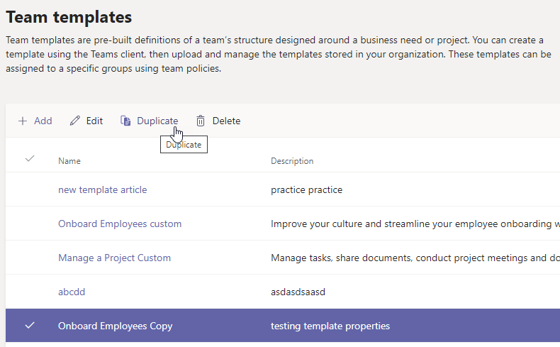

# 기존 팀 템플릿에서 새 팀 템플릿을 Microsoft Teams

**사용자 지정 템플릿은 아직 EDU 고객에게 지원되지 않습니다.**

Microsoft Teams 특정 조직 요구 사항을 충족하기 위해 저장 및 수정할 수 있는 미리 작성된 템플릿을 제공합니다.

1. Teams 관리 센터에 로그인합니다.

2. 왼쪽 탐색에서 팀 **Teams**  >  **확장합니다.**

3. 팀 템플릿 **섹션에서** 중복할 팀 템플릿 옆을 선택하여 강조 표시합니다.

4. 중복을 **선택합니다.**

(또는 추가를 선택할 **수 있습니다.**  >  **기존 템플릿으로 시작하여** 시작점으로 사용할 서식 파일 선택을 **를 열 수 있습니다.**

5. 시작점  화면으로 사용할 템플릿 선택에서 다음 을 **선택합니다.**

    중복된 템플릿이 열리면 **복사라는** 단어가 이름에 추가됩니다.

6. 다음 필드를 완료한 다음 다음을 **선택합니다.**
    - 템플릿 이름
    - 서식 파일 짧고 긴 설명
    - 로컬 표시  

7. 채널, **탭 및 앱 섹션에서** 팀에 필요한 기존 채널 및 앱을 수정합니다.

    1. 편집할 채널을 선택하고 **편집을 선택합니다.**
    2. **완료되면** 변경 내용을 적용합니다.

8. 팀에서 필요로 하는 모든 채널 또는 앱을 추가합니다.

    1. 채널 **섹션에서** 추가를 **선택합니다.**
    2. 추가 **대화 상자에서** 채널 이름을 지정합니다.
    3. 설명을 추가합니다.
    4. 채널을 기본적으로 표시해야 하는지 여부를 결정합니다.
    5. 채널에 추가할 앱 이름을 검색합니다.
    6. 완료 **시 적용을** 선택합니다.

7. 채널 **및** 앱 추가가 완료되면 제출을 선택합니다.

    새 템플릿은 템플릿 라이브러리에 저장됩니다.

> [!Note]
> 팀 사용자가 갤러리에서 사용자 지정 템플릿을 보는 데 최대 24시간이 걸릴 수 있습니다.

## 관련 문서

- [관리 센터에서 팀 템플릿 시작](get-started-with-teams-templates-in-the-admin-console.md)
- [기존 팀에서 템플릿 만들기](create-template-from-existing-team.md)
- [팀 템플릿 만들기](create-a-team-template.md)