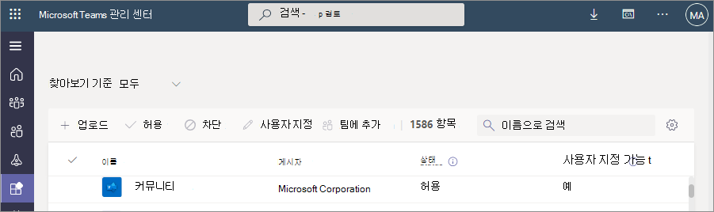
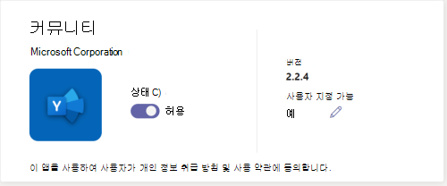

# 조직의 Teams 스토어에서 앱의 모양 사용자 지정

Microsoft Teams 관리자가 Teams 앱을 사용자 지정하여 스토어 환경을 개선하고 조직의 브랜딩을 준수할 수 있습니다. 앱 개발자는 Teams 관리자가 앱을 사용자 지정하도록 허용할 수 있습니다. 그런 다음 Teams 관리 센터의 앱 관리 페이지에서 조직의 요구 사항에 따라 앱 속성을 업데이트할 수 있습니다. 사용자 지정할 수 있는 세부 정보는 다음과 같습니다.

* 짧은 이름
* 간단한 설명
* 전체 설명
* 개인 정보 취급 방침 URL
* 웹 사이트 URL
* 사용 약관 URL
* 앱 아이콘
* 아이콘의 윤곽선 색
* 강조색

앱의 다양한 메타데이터 필드에 대한 자세한 내용은 개발자 설명서의 [Teams 매니페스트 스키마](/microsoftteams/platform/resources/schema/manifest-schema)를 참조하세요.

> [!NOTE]
> 어떤 조직에서도 테스트용으로 로드된 앱을 사용자 지정할 수 없습니다. GCCH(정부 커뮤니티 클라우드 High) 또는 국방부(DoD) 클라우드에서는 앱을 사용자 지정할 수 없습니다.

## 앱 세부 정보 사용자 지정

앱을 사용자 지정하려면 다음 단계를 완료합니다.

1. Teams 관리 센터에 로그인합니다.

1. **Teams 앱을** 확장하고 **[앱 관리를](https://admin.teams.microsoft.com/policies/manage-apps)** 선택합니다.

1. 앱 목록의 **사용자 지정 가능한** 열을 확인하고 사용자 지정할 수 있는 앱을 기준으로 정렬합니다.

   

   사용자 지정 기능에 액세스하는 세 가지 진입점이 있습니다.

   * 사용자 지정할 앱 옆을 선택한 다음 **사용자 지정** 을 선택합니다.

     

   * 앱 이름을 선택한 다음 **사용자 지정 가능** 에서 편집 아이콘을 선택합니다.

     

   * 앱 이름을 선택하고 작업에서 **오버플로 메뉴를** 마우스로 **가리키고 사용자** 지정을 선택합니다.

     

1. **세부 정보** 섹션을 확장하고 다음 필드 중 하나 이상을 사용자 지정합니다. 개발자가 사용자 지정할 수 있는 것으로 할당된 필드가 표시됩니다.

    * 짧은 이름
    * 간단한 설명
    * 전체 설명
    * 웹 사이트
    * 개인 정보 취급 방침 URL
    * 사용 약관 URL

   

1. **아이콘** 섹션을 확장합니다.

1. 아이콘을 업로드. 하나의 아이콘(192 x 192) 픽셀을 PNG 형식으로 사용합니다.

1. 아이콘 윤곽선 색을 선택합니다. 하나의 투명 윤곽선(32x32) 픽셀을 PNG 형식으로 사용합니다.

1. 아이콘과 일치하는 앱 강조 색을 선택합니다.

   

1. 앱을 사용자 지정한 후 **적용** 을 선택합니다.

1. **게시** 를 선택하여 사용자 지정된 앱을 게시합니다.

   이제 사용자 지정된 앱이 **앱 관리** 페이지에 나열됩니다. 앱 기능을 사용자 지정해도 앱의 복사본이 생성되지 않으므로 앱 버전은 하나만 있습니다.

이제 Teams 최종 사용자가 클라이언트에서 사용자 지정된 앱을 볼 수 있습니다.

   

앱 사용자 지정에 대한 자세한 내용은 다음과 같습니다.

* 앱 및 앱과 관련된 설명을 사용자 지정할 때 앱 게시자가 설명서 또는 사용 약관에 제공한 경우 사용자 지정 지침을 따르는지 확인합니다. 또한 사용할 수 있는 타사 이미지에 대한 다른 사람의 권리를 존중할 책임이 있습니다.

* 관리 제공된 사용자 지정 데이터는 가장 가까운 지역에 저장됩니다.

* 사용 약관 또는 개인 정보 취급 방침에 대한 링크가 유효한지 확인해야 합니다.

* 앱 게시자가 더 이상 필드를 사용자 지정할 수 없도록 허용하지 않는 경우 더 이상 사용자 지정할 수 없는 필드에 대해 관리자에게 알리는 메시지가 앱 세부 정보 페이지에 표시됩니다. 해당 필드에 대한 모든 변경 내용은 원래 값으로 되돌려집니다.

* 프로덕션 환경에서 이러한 변경을 수행하기 전에 Teams 테스트 테넌트에서 앱 사용자 지정 변경 내용을 테스트하는 것이 좋습니다.

* 브랜딩을 변경하려면 모든 사용자에게 전파하는 데 최대 24시간이 필요할 수 있습니다.

* 앱을 사용자 지정할 수 있도록 개발자는 새 버전의 앱을 제공할 수 있습니다. 새 버전을 업로드하고 이전 버전의 앱을 제거합니다. 앱을 사용자 지정하고 게시한 경우 앱 사용자 지정 기능을 사용하여 사용자 지정된 새 앱이 현재 앱을 대체하지 않습니다.

* [앱 사용 보고서에](teams-analytics-and-reports/app-usage-report.md)는 게시자가 제공한 앱의 원래 이름이 표시됩니다.

* Microsoft Graph 권한 동의 대화 상자에 게시자가 제공한 앱의 원래 이름이 표시됩니다. 사용 권한을 제공하면서 앱을 정확하게 식별하는 데 도움이 됩니다.

## 앱 세부 정보 검토

앱 세부 정보를 보고 정보를 검토할 수 있습니다.

1. Teams 관리 센터에 로그인합니다.

1. **Teams 앱을** 확장하고 **[앱 관리를](https://admin.teams.microsoft.com/policies/manage-apps)** 선택합니다.

1. 앱 이름을 선택합니다.

1. 게시자의 원래 앱 이름 **Short 이름을** 포함하여 앱 세부 정보를 봅니다.

   

   **게시자 필드의 짧은 이름은** 앱의 짧은 이름을 변경한 경우에만 표시됩니다.

## 앱 세부 정보를 기본값으로 다시 설정

앱 세부 정보를 앱 개발자가 제공한 원래 값으로 다시 설정할 수 있습니다. 이 옵션은 사용자 지정한 앱에서만 사용할 수 있습니다.

1. Teams 관리 센터에서 **Teams 앱 관리 앱** > 에 액세스 **[합니다](https://admin.teams.microsoft.com/policies/manage-apps)**.

1. 앱 이름을 선택합니다.

1. **작업** 메뉴에서 **기본값으로 다시 설정을** 선택합니다.

   

## 관련 문서

* [앱 관리](manage-apps.md)
* [조직의 앱 스토어 사용자 지정](customize-your-app-store.md)
* [앱 리브랜딩](https://techcommunity.microsoft.com/t5/microsoft-teams-blog/rebrand-apps-to-your-own-organization-s-branding-with-app/ba-p/2376296)
