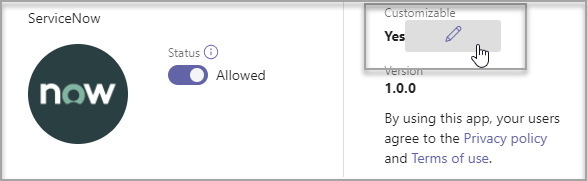

# Microsoft Teams에서 앱 사용자 지정Customize apps in Microsoft Teams

[!INCLUDE [preview-feature](includes/preview-feature.md)]

 Microsoft Teams는 Teams 환경을 개선하기 위해 앱 사용자 지정을 제공합니다.Microsoft Teams provides app customization to enhance the Teams experience. 일부 앱 개발자는 Teams 관리자가 앱을 사용자 지정하도록 허용합니다. 관리자는 Teams 관리 센터 앱 관리 페이지를 사용하여 조직 요구에 따라 앱 속성을 사용자 지정하거나 다시 **브랜드화할 수** 있습니다.Some app developers allow an app to be customized by the Teams admin. The admin can customize or rebrand the app properties based on the organizational needs using the Teams admin center **Manage apps** page. 사용자 지정할 수 있는 세부 정보는 다음을 참조합니다.The details you can customize are:

- 짧은 이름Short name
- 간략한 설명Short description
- 전체 설명Full description
- 개인 정보 취급 방침 URLPrivacy policy URL
- 웹 사이트 URLWebsite URL
- 사용 약관 URLTerms of use URL
- 색 아이콘Color icon
- 개요 아이콘Outline icon
- 강조 색Accent color

사용자 지정할 수 있는 필드에 대한 자세한 내용은 Teams 매니페스트를 참조합니다. See the [Teams Manifest schema](https://docs.microsoft.com/microsoftteams/platform/resources/schema/manifest-schema) for details about the fields that you can customize.

## 앱의 세부 정보 사용자 지정Customize the app's details

앱 사용자 지정을 시작하고 다음 단계를 완료합니다.To start customizing an app, complete the following steps:

1. Teams 관리 센터에 로그인합니다.Sign in to the Teams admin center.
2. **Teams Apps를 확장하고** 앱 **관리를 선택합니다.**Expand **Teams Apps** and select **Manage apps**.
3. 앱 **목록의** 사용자 지정 가능한 열을 확인하고 사용자 지정 가능한 앱별로 정렬합니다.Check the **Customizable** column of the apps list and sort by apps that are customizable.

   

   사용자 지정 기능에 액세스하는 세 가지 진입점이 있습니다.There are three entry points to access the customize feature:

   - 사용자 지정하려는 앱 옆에 있는 를 선택한 다음 사용자 **지정을 선택합니다.**Select next to the app that you want to customize, and then select **Customize**.

     

   - 앱 이름을 선택한 다음 **사용자 지정 가능 을 선택합니다.**Select the app name and then **Customizable**.

     

   - 앱 이름을 선택한 다음 작업 **드롭다운에서** **사용자 지정을** 선택합니다.Select the app name, and then select **Customize** from the **Actions** dropdown.

     

4. 세부 정보 **섹션을** 확장하고 다음 필드를 사용자 지정합니다.Expand the **Details** section and customize the following fields:

    - 짧은 이름Short name
    - 간략한 설명Short description
    - 전체 설명Full description
    - 웹 사이트Website
    - 개인 정보 취급 방침 URLPrivacy policy URL
    - 사용 약관 URLTerms of use URL

   

> [!Note]
> 앱 개발자가 사용자 지정 가능으로 할당한 필드만 표시됩니다.Only the fields that the app developer has assigned as customizable will be visible.

5. 아이콘 **섹션을 확장합니다.**Expand the **Icon** section.

   a.a. 아이콘을 업로드합니다.Upload an icon. PNG 형식으로 하나의 전체 색 아이콘(192x192) 픽셀을 사용 합니다.Use one full-color icon (192x192) pixel in PNG format.

   b.b. 아이콘 개요 색을 선택 합니다.Choose an icon outline color. 투명한 윤곽선(32x32) 픽셀을 PNG 형식으로 사용Use one transparent outline (32x32) pixel in PNG format.

   c.c. 아이콘과 일치하는 앱 악센트 색을 선택합니다.Select an app accent color that matches the icon.

    

6. 앱이 사용자 지정되고 나면 적용 을 **선택합니다.**Once your app has been customized, select **Apply**.

7. 게시를 **선택하여** 사용자 지정된 앱을 게시합니다.Select **Publish** to publish the customized app.

   이제 사용자 지정된 앱이 앱 관리 페이지에 **나열됩니다.**The customized app is now listed in your **Manage apps** page. 앱 기능을 사용자 지정해도 앱의 복사본을 만들지 않습니다.You'll have only one version of the app, since customizing the app features doesn't create a copy of the app.

이제 Teams 최종 사용자는 Teams 클라이언트를 열고 사용자 지정된 앱을 볼 수 있습니다.Now your Teams end users can open their Teams client to see the customized app.

   

### 앱 사용자 지정을 위한 특별한 고려 사항Special considerations for customizing an app

다음 노트에는 앱 사용자 지정에 대한 중요한 세부 정보가 포함되어 있습니다.The following note includes important details about customizing an app.

> [!Note]
> - 앱 및 앱과 관련된 설명을 사용자 지정할 때 앱 게시자가 제공하는 사용자 지정 지침을 준수해야 합니다.When you customize apps and any description related to an app, ensure that you follow the Customization Guidelines provided by the app publisher. 사용할 수 있는 타사 이미지와 관련하여 타인의 권리를 존중할 책임이 있습니다.You're responsible for respecting the rights of others regarding third-party images you might use.
> - 관리자 제공 사용자 지정 데이터는 가장 가까운 지역의 설정 저장소에 저장됩니다.Admin-provided customization data is stored in the Settings Store in the nearest region. GoLocal Cloud Teams 배포에서 반드시 그렇지는 않습니다.It isn't necessarily in any GoLocal Cloud Teams deployment.
> - 사용 약관 또는 개인 정보 취급 방침에 대한 링크가 유효한지 확인해야 합니다.You're responsible for ensuring that the links to the terms of use or privacy policy are valid. 앱 메타데이터에 변경(또는 허용)을 적절하게 관리해야 합니다.You must provide appropriate management of the changes they make (or allow to be made) to app metadata. 현재 구현은 개발자가 제공한 URL로 되전하는 데 도움이 되는 지원을 제공합니다.Current implementation will provide support to help you to revert to developer-provided URLs. URL 없이 앱을 구성할 수 없습니다(앱이 URL 사용자 지정을 허용하는 경우).You may not configure the app without a URL (if the app allows customization of the URLs).
> - 앱 게시자가 더 이상 필드를 사용자 지정할 수 없는 경우 앱 세부 정보 페이지에 더 이상 사용자 지정할 수 없는 필드에 대해 관리자에게 알리는 메시지가 나타납니다.In case the app publisher no longer allows a field to be customizable, a message appears on the app details page notifying the admin about the fields that can't be customized any longer. 이 필드에 대한 변경 내용은 모두 원래 값으로 되버렸다.All the changes made to that field will be reverted to the original values.
> - 브랜디드를 변경하려면 사용자가 변경 내용을 볼 수 있도록 최대 24시간이 필요할 수 있습니다.Changes to branding might require up to 24 hours for the users to see the changes.

## 앱 세부 정보 검토Review app details

정보를 검토하기 위해 앱 세부 정보를 볼 수 있습니다.You might want to see the app details to review the information.

1. Teams 관리 센터에 로그인합니다.Sign in to the Teams admin center.

2. **Teams 앱** 을 확장하고 **앱 관리** 를 선택합니다.Expand **Teams apps** and select **Manage apps**.

3. 앱 이름을 선택합니다.Select the app name.

4. 퍼블리셔의 원래 앱 이름 짧은 이름을 포함하여 앱 **세부 정보를 볼 수 있습니다.**View the app details, including the original app name **Short name from publisher**.

   

   게시자 **필드의** 짧은 이름은 앱의 짧은 이름을 변경한 경우만 표시됩니다.The **Short name from publisher** field is only visible if you've changed the app's short name.

## 앱 세부 정보를 기본값으로 다시 설정Reset app details to default

앱 세부 정보를 원래 설정으로 재설정할 수 있습니다.At any time, you can reset the app details to the original settings.

1. Teams 관리 센터에 로그인합니다.Sign in to the Teams admin center.

2. **Teams Apps를 확장하고** 앱 **관리를 선택합니다.**Expand **Teams Apps** and select **Manage apps**.

3. 앱 이름을 선택합니다.Select the app name.

4. 작업 **드롭다운에서 기본값으로** **재설정을** 선택합니다.Select **Reset to default** from the **Actions** dropdown.

   

## 자주 묻는 질문Frequently asked questions

**사용자 지정 앱을 보는 데 얼마나 오래 걸릴까요?****How long will it take for my users to see the customized app?**

관리자가 Teams 관리 센터의 변경 내용을 즉시 볼 수 있습니다. 최종 사용자가 변경 내용을 보는 데 최대 24시간이 걸릴 수 있습니다.Although the admin can immediately see the changes in Teams Admin Center, it might take up to 24 hours for the end users to see the changes.  

**앱 공급자가 고객을 위해 앱을 사용자 지정할 수 있나요?****Can the app provider customize the app for its customers?**

 아니요, 테넌트 관리자는 Teams 관리 센터를 사용하여 테넌트에 대한 앱을 사용자 지정해야 합니다.No, the admin of a tenant needs to customize the app for their tenant using the Teams Admin Center.

**테넌트에서 현재 사용자 지정 앱을 바꾸기 위해 사용자 지정된 앱이 자동으로 배포될까요?****Will the customized app automatically get deployed to replace my current custom app in a tenant?**

아니요, 테넌트 관리자는 사용자 지정 앱을 수동으로 제거하고 사용자 지정된 버전의 앱을 게시해야 합니다.No, the tenant admins will have to manually remove any custom app and publish the customized version of the app. 앱을 사용자 지정하고 사용자 지정 앱으로 게시한 경우 앱 사용자 지정 기능을 사용하여 사용자 지정한 새 앱이 현재 사용자 지정 앱을 대체하지 않습니다.If you have customized an app and published it as a custom app, the new app customized using the app customization feature won't replace the current custom app.  

**앱 사용 보고서에 사용자 지정된 짧은 이름과 같은 사용자 지정된 값도 표시하나요?****Will the app usage report also show the customized values such as customized short name?**

 아니요, 앱 사용 보고서는 퍼블리셔에서 보낸 앱의 원래 이름을 계속 보여 줍니다.No, the app usage report will still show the original name of the app sent from the publisher.

**앱 사용자 지정 기능을 사용하여 어떤 앱을 사용자 지정할 수 있나요?****Which apps can I customize using the app customization feature?**

앱 게시자가 사용자 지정할 수 있도록 허용된 앱만 사용자 지정할 수 있습니다.You can only customize apps that have been allowed to be customizable by the app publisher. 앱 게시자는 고객이 앱을 사용자 지정할 수 있도록 옵트인해야 합니다.The app publisher will need to opt in to allow its customers to customize the app.

**그래프 사용 권한 동의 화면에 사용자 지정 속성이 표시될까요?****Will the customized properties show up on the graph permission consent screen?**

아니요, 권한 동의 화면은 퍼블리셔가 보낸 원래 값을 계속 표시합니다.No, the permission consent screen will still show the original value sent by the publisher.

## 관련 문서Related article

- [앱 관리Manage apps](manage-apps.md)
- [앱 스토어 사용자 지정Customize your app store](customize-your-app-store.md)
