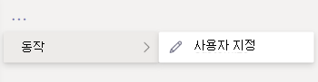

# 앱 사용자 지정 Microsoft Teams

 Microsoft Teams 환경을 개선하기 위해 앱 사용자 지정을 Teams 제공합니다. 일부 앱 개발자는 앱 관리자에 의해 앱을 사용자 Teams 수 있습니다. 관리자는 관리 센터 관리 페이지를 사용하여 조직 요구에 따라 앱 속성을 사용자 지정하거나 Teams **수** 있습니다. 사용자 지정할 수 있는 세부 정보는 다음을 참조합니다.

- 짧은 이름
- 간략한 설명
- 전체 설명
- 개인 정보 취급 방침 URL
- 웹 사이트 URL
- 사용 약관 URL
- 색 아이콘
- 개요 아이콘
- 강조 색

사용자 [지정할 Teams](/microsoftteams/platform/resources/schema/manifest-schema) 필드에 대한 자세한 내용은 매니페스트 매니페스트를 참조합니다.

> [!NOTE]
> 현재 GCCH(High) 정부 커뮤니티 클라우드(DoD) 또는 국방부(DoD)에서 앱을 사용자 지정하는 것은 지원되지 않습니다.
> 현재 이 기능은 사이드로드된 앱에 Microsoft Teams 없습니다.

## 앱의 세부 정보 사용자 지정

앱 사용자 지정을 시작하고 다음 단계를 완료합니다.

1. Teams 관리 센터에 로그인합니다.
2. 앱 **Teams 확장하고** 앱 **관리를 선택합니다.**
3. 앱 **목록의** 사용자 지정 가능한 열을 확인하고 사용자 지정 가능한 앱별로 정렬합니다.

   

   사용자 지정 기능에 액세스하는 세 가지 진입점이 있습니다.

   - 사용자 지정하려는 앱 옆에 있는 를 선택한 다음 사용자 **지정을 선택합니다.**

     

   - 앱 이름을 선택한 다음 **사용자 지정 가능 을 선택합니다.**

     

   - 앱 이름을 선택한 다음 작업 **드롭다운에서** **사용자 지정을** 선택합니다.

     

4. 세부 정보 **섹션을** 확장하고 다음 필드를 사용자 지정합니다.

    - 짧은 이름
    - 간략한 설명
    - 전체 설명
    - 웹 사이트
    - 개인 정보 취급 방침 URL
    - 사용 약관 URL

   

> [!Note]
> 앱 개발자가 사용자 지정 가능으로 할당한 필드만 표시됩니다.

5. 아이콘 **섹션을 확장합니다.**

   a. 업로드 아이콘을 추가합니다. PNG 형식으로 하나의 전체 색 아이콘(192x192) 픽셀을 사용 합니다.

   b. 아이콘 개요 색을 선택 합니다. 투명한 윤곽선(32x32) 픽셀을 PNG 형식으로 사용

   c. 아이콘과 일치하는 앱 악센트 색을 선택합니다.

    

6. 앱이 사용자 지정되고 나면 적용 을 **선택합니다.**

7. 게시를 **선택하여** 사용자 지정된 앱을 게시합니다.

   이제 사용자 지정된 앱이 앱 관리 페이지에 **나열됩니다.** 앱 기능을 사용자 지정해도 앱의 복사본을 만들지 않습니다.

이제 최종 Teams 사용자 지정 앱을 보기 위해 Teams 클라이언트를 열 수 있습니다.

   

### 앱 사용자 지정을 위한 특별한 고려 사항

다음 노트에는 앱 사용자 지정에 대한 중요한 세부 정보가 포함되어 있습니다.

> [!Note]
> - 앱 및 앱과 관련된 설명을 사용자 지정할 때 해당 설명서 또는 사용 약관에 앱 게시자가 제공한 사용자 지정 지침을 준수해야 합니다. 또한 사용할 수 있는 타사 이미지와 관련하여 다른 사용자의 권리를 존중할 책임도 있습니다.
> - 관리자 제공 사용자 지정 데이터는 가장 가까운 지역에 저장됩니다.
> - 귀하는 사용 약관 또는 개인 정보 취급 방침에 대한 링크가 유효한지 확인해야 합니다.
> - 앱 게시자가 더 이상 필드를 사용자 지정할 수 없는 경우 앱 세부 정보 페이지에 더 이상 사용자 지정할 수 없는 필드에 대해 관리자에게 알리는 메시지가 나타납니다. 이 필드에 대한 변경 내용은 모두 원래 값으로 되버렸다.
> - 프로덕션 환경에서 이러한 변경을 수행하기 Teams 테스트 테넌트에서 앱 사용자 지정 변경을 테스트하는 것이 좋습니다.
> - 브랜디드를 변경하려면 사용자가 변경 내용을 볼 수 있도록 최대 24시간이 필요할 수 있습니다.

## 앱 세부 정보 검토

정보를 검토하기 위해 앱 세부 정보를 볼 수 있습니다.

1. Teams 관리 센터에 로그인합니다.

2. **Teams 앱** 을 확장하고 **앱 관리** 를 선택합니다.

3. 앱 이름을 선택합니다.

4. 퍼블리셔의 원래 앱 이름 짧은 이름을 포함하여 앱 **세부 정보를 볼 수 있습니다.**

   

   게시자 **필드의** 짧은 이름은 앱의 짧은 이름을 변경한 경우만 표시됩니다.

## 앱 세부 정보를 기본값으로 다시 설정

앱 세부 정보를 원래 설정으로 재설정할 수 있습니다.

1. Teams 관리 센터에 로그인합니다.

2. 앱 **Teams 확장하고** 앱 **관리를 선택합니다.**

3. 앱 이름을 선택합니다.

4. 작업 **드롭다운에서 기본값으로** **재설정을** 선택합니다.

   

## 자주 묻는 질문

**사용자 지정 앱을 보는 데 얼마나 오래 걸릴까요?**

관리자가 관리자 센터의 변경 내용을 즉시 볼 수 Teams 최종 사용자가 변경 내용을 보는 데 최대 24시간이 걸릴 수 있습니다.  

**앱 공급자가 고객을 위해 앱을 사용자 지정할 수 있나요?**

 아니요, 테넌트 관리자는 관리 센터를 사용하여 테넌트에 대한 앱을 사용자 지정해야 Teams 합니다.

**테넌트에서 현재 사용자 지정 앱을 바꾸기 위해 사용자 지정된 앱이 자동으로 배포될까요?**

아니요, 테넌트 관리자는 사용자 지정 앱을 수동으로 제거하고 사용자 지정된 버전의 앱을 게시해야 합니다. 앱을 사용자 지정하고 사용자 지정 앱으로 게시한 경우 앱 사용자 지정 기능을 사용하여 사용자 지정한 새 앱이 현재 사용자 지정 앱을 대체하지 않습니다.  

**앱 사용 보고서에 사용자 지정된 짧은 이름과 같은 사용자 지정된 값도 표시하나요?**

 아니요, 앱 사용 보고서는 퍼블리셔에서 보낸 앱의 원래 이름을 계속 보여 줍니다.

**앱 사용자 지정 기능을 사용하여 어떤 앱을 사용자 지정할 수 있나요?**

앱 게시자가 사용자 지정할 수 있도록 허용된 앱만 사용자 지정할 수 있습니다. 앱 게시자는 고객이 앱을 사용자 지정할 수 있도록 옵트인해야 합니다.

**그래프 사용 권한 동의 화면에 사용자 지정 속성이 표시될까요?**

아니요, 권한 동의 화면은 퍼블리셔가 보낸 원래 값을 계속 표시합니다.

## 관련 문서

- [앱 관리](manage-apps.md)
- [앱 스토어 사용자 지정](customize-your-app-store.md)
- [앱 다시브랜드](https://techcommunity.microsoft.com/t5/microsoft-teams-blog/rebrand-apps-to-your-own-organization-s-branding-with-app/ba-p/2376296)
