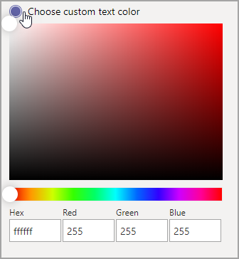

# Microsoft 팀의 사용자 지정 앱 스토어Custom apps store in Microsoft Teams

[!INCLUDE [template](includes/preview-feature.md)]

이제 최종 사용자에 게 더 많은 초대를 만들기 위해 로고, 사용자 지정 배경, 사용자 지정 텍스트 색을 추가 하 여 팀 앱을 조직 브랜딩으로 사용자 지정할 수 있습니다.Now you can customize the Teams Apps store with your organizational branding by adding your logo, custom backgrounds, and custom text colors to make it more inviting to end users.

> [!Note]
> 브랜딩을 변경 하려면 24 시간이 소요 됩니다.Changes to branding will require 24 hours to take effect.

## 조직 로고 사용자 지정Customize your organization logo

<!-- Bookmark used by Context Sensitive Help (CSH). Do not delete. -->

<!-- Do not remove the bookmark link above. -->

여기에서 조직 로고를 업로드할 수 있습니다.Here you can upload your organization logo. 선택한 로고가 **Apps**  >  **테 넌 트를 위해 빌드된** 앱의 팀 클라이언트에 표시 됩니다.The logo selected will appear in the Teams client in **Apps** > **Built for your tenant** page.

**그림 선택** 옵션을 선택 하면 선택한 파일을 업로드할 수 있습니다.When you select the **Choose a picture** option, you can upload the file of your choice. 로고는 240x60 또는 해당 크기로 조정 됩니다.The logo should be 240x60, or it will be scaled to that size. 5MB 보다 크지 않아야 합니다.It should be no larger than 5MB. 지원 되는 형식은 다음과 같습니다.The supported formats are:

- . svg.svg
- .png.png
- .jpg.jpg

로고는 팀 스토어에서 테 넌 트 앱 카탈로그의 오른쪽 위 모서리에 표시 됩니다.The logo is shown in the top right corner of the tenant app catalog in the Teams store.

## 작은 로고 사용자 지정Customize your small logo

<!-- Bookmark used by Context Sensitive Help (CSH). Do not delete. -->

<!-- Do not remove the bookmark link above. -->

조직 logomark 또는 작은 로고는 조직 브랜드를 나타내는 이미지 또는 기호 이며 회사 이름을 포함 하지 않습니다.Your organization logomark or small logo is an image or symbol that represents your organization brand and doesn't include your company name. Logomark는 팀 구성원이 앱 스토어를 식별 하는 데 도움이 됩니다.The logomark helps team members identify the Apps store. 선택한 로고가 팀 클라이언트의 앱 페이지에 표시 됩니다.The logo selected will appear in the Teams client in Apps page.

**그림 선택** 옵션을 선택 하면 선택한 파일을 업로드할 수 있습니다.When you select the **Choose a picture** option, you can upload the file of your choice. Logomark는 32x32 픽셀 이어야 하며 크기에 맞게 크기가 조정 됩니다.The logomark should be 32x32 pixels, or it will be scaled to that size. 5MB 보다 크지 않아야 합니다.It should be no larger than 5MB. 지원 되는 형식은 다음과 같습니다.The supported formats are:

- . svg.svg
- .png.png
- .jpg.jpg

작은 로고가 팀 스토어 랜딩 페이지의 **기본 제공 테 넌 트** 섹션 제목 옆에 표시 됩니다.The small logo is shown next to the **Built for tenant** section title in the Teams store landing page.

## 배경 색 사용자 지정Customize the background color

<!-- Bookmark used by Context Sensitive Help (CSH). Do not delete. -->

<!-- Do not remove the bookmark link above. -->

배경은 텍스트에 대 한 대비가 충분 하므로 사용자가 텍스트를 명확 하 게 읽을 수 있습니다.The background should have enough contrast with the text so the users can read the text clearly. 백그라운드는 **Apps**  >  **테 넌 트 헤더로 빌드된** 앱의 팀 클라이언트에 표시 됩니다.The background will appear in the Teams client in **Apps** > **Built for your tenant** header.

옵션은 다음과 같습니다.Your options are:

- 팀 클라이언트 기본 배경 테마 사용Use Teams client default background theme
- 그림을 선택 합니다.Choose a picture. 배경 그림을 선택 하면 선택한 파일을 업로드할 수 있습니다.When you select the background picture, you can upload the file of your choice. 배경은 1212x100 픽셀 이어야 하며, 해당 크기에 맞게 크기가 조정 됩니다.The background should be 1212x100 pixels, or it will be scaled to that size. 5MB 보다 크지 않아야 합니다.It should be no larger than 5MB. 지원 되는 형식은 다음과 같습니다.The supported formats are:
  - . svg.svg
  - .png.png
  - .jpg.jpg
- 사용자 지정 배경을 선택 합니다.Choose a custom background. **사용자 지정 색**선택을 선택 하면 색 선택이 열립니다.When you select **Choose a custom color**, a color chooser opens. 색 선택기의 배율을 조정 하 여 원하는 색을 선택 합니다.Select the color that you want by adjusting the scale of the color chooser.

백그라운드 이미지 또는 색은 팀 테 넌 트 앱 카탈로그의 위쪽 배너에 대 한 배경으로 사용 됩니다.The background image or color is used as the background for the top banner in the Teams tenant app catalog.

## 이름의 텍스트 색 사용자 지정Customize the text color of your name

<!-- Bookmark used by Context Sensitive Help (CSH). Do not delete. -->

<!-- Do not remove the bookmark link above. -->

텍스트 색은 사용자가 조직의 이름을 명확 하 게 읽을 수 있는 배경과의 대비가 충분 해야 합니다.The text color should have enough contrast with the background that the users can read the name of your organization clearly. 해당 텍스트는 **Apps**  >  **테 넌 트 헤더로 빌드된** 앱의 팀 클라이언트에 표시 됩니다.The text will appear in the Teams client in **Apps** > **Built for your tenant** header.

**사용자 지정 색**선택을 선택 하면 색 선택이 열립니다.When you select **Choose a custom color**, a color chooser opens. 색 선택기의 배율을 조정 하 여 원하는 색을 선택 합니다.Select the color that you want by adjusting the scale of the color chooser.

 

## 팀 앱 스토어의 사용자 지정 완료Complete the customization of your team apps store

앱 스토어 사용자 지정을 완료 한 후 **저장** 을 클릭 하 여 변경 내용을 저장 하세요.When you've finished customizing your apps store, be sure to click **Save** to save your changes.
변경 내용을 미리 보려면 **앱 스토어 미리 보기** 를 클릭 하 여 사용자 지정 앱 저장소의 표현을 표시 합니다.To preview your changes, click **Preview apps store** to see a representation of your customized apps store.

> [!Note]
> 일부 기본 색은 사용자의 팀 클라이언트 버전을 기반으로 하기 때문에이 표현은 사용자 지정 앱 저장소의 최종 버전과 다를 수 있습니다.The representation might vary from the final version of your customized apps store because some default colors are based on your users' version of Teams client.

## 관련 문서Related article

[앱 관리Manage your apps](manage-apps.md)
