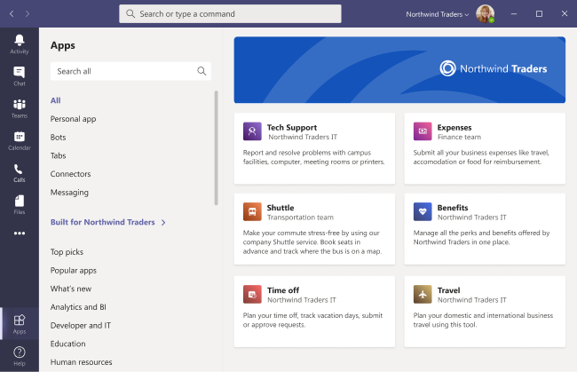

# 사용자 지정 앱 저장소에 Microsoft Teams

이제 최종 사용자에게 더 많은 Teams 로고, 사용자 지정 배경 및 사용자 지정 텍스트 색을 추가하여 회사 브랜디드를 사용하여 조직의 앱 스토어를 사용자 지정할 수 있습니다.

> [!Note]
> 브랜디드를 변경하려면 24시간이 소요됩니다.

앱 사용자 지정 저장소 를 선택하여 관리 센터에서 사용자 **지정** Teams  >  **수 있습니다.**

  

이 문서에서는 사용자 지정 앱 스토어 기능 및 이를 사용하는 방법을 설명합니다.

## 조직 로고 사용자 지정

<!-- Bookmark used by Context Sensitive Help (CSH). Do not delete. -->

<!-- Do not remove the bookmark link above. -->

여기에서 조직 로고를 업로드할 수 있습니다. 선택한 로고는 테넌트용 Apps Teams **클라이언트에**  >  **표시됩니다.**

그림 선택 옵션을 **선택하면** 원하는 파일을 업로드할 수 있습니다. 로고는 240x60이 되거나 크기가 그 크기로 조정됩니다. 5MB를 넘지 말아야 합니다. 지원되는 형식은 다음입니다.

- .svg
- .png
- .jpg

로고는 테넌트 앱 카탈로그의 맨 위 오른쪽 모서리에 Teams 표시됩니다.

## 작은 로고 사용자 지정

<!-- Bookmark used by Context Sensitive Help (CSH). Do not delete. -->

<!-- Do not remove the bookmark link above. -->

조직 로고마크 또는 작은 로고는 조직 브랜드를 나타내는 이미지 또는 기호로 회사 이름을 포함하지 않습니다. 러브마크는 팀 구성원이 Apps 스토어를 식별하는 데 도움이 됩니다. 선택한 로고는 앱의 Teams 클라이언트에 표시됩니다.

그림 선택 옵션을 **선택하면** 원하는 파일을 업로드할 수 있습니다. 로고마크는 32x32픽셀 또는 크기로 조정됩니다. 5MB를 넘지 말아야 합니다. 지원되는 형식은 다음입니다.

- .svg
- .png
- .jpg

작은 로고는 저장소 방문  페이지의 기본 제공 테넌트 섹션 Teams 표시됩니다.

## 배경색 사용자 지정

<!-- Bookmark used by Context Sensitive Help (CSH). Do not delete. -->

<!-- Do not remove the bookmark link above. -->

사용자가 텍스트를 명확하게 읽을 수 있도록 배경에 텍스트와 충분한 대비가 있는지 확인합니다. 배경은 테넌트 헤더에 Teams **Apps**  >  **Built의** 클라이언트에 표시됩니다.

옵션은 다음과 같습니다.

- 클라이언트 Teams 배경 테마 사용
- 그림을 선택 합니다. 배경 그림을 선택하면 원하는 파일을 업로드할 수 있습니다. 배경은 1212x100 픽셀이 되거나 그 크기로 조정됩니다. 5MB를 넘지 말아야 합니다. 지원되는 형식은 다음입니다.
  - .svg
  - .png
  - .jpg
- 사용자 지정 배경을 선택 합니다. 사용자 지정 색 **선택을 선택하면** 색 선택기가 열립니다. 색 선택기의 배율을 조정하여 원하는 색을 선택합니다.

배경 이미지 또는 색은 테넌트 앱 카탈로그의 Teams 배경으로 사용됩니다.

## 이름의 텍스트 색 사용자 지정

<!-- Bookmark used by Context Sensitive Help (CSH). Do not delete. -->

<!-- Do not remove the bookmark link above. -->

사용자가 조직의 이름을 명확하게 읽을 수 있도록 텍스트 색이 배경과 충분한 대비를 하여야 합니다. 텍스트는 테넌트 헤더에 Teams **Apps**  >  **Built의 클라이언트에** 표시됩니다.

사용자 지정 색 **선택을 선택하면** 색 선택기가 열립니다. 색 선택기의 배율을 조정하여 원하는 색을 선택합니다.

 

## 팀 앱 저장소 사용자 지정 완료

앱 스토어 사용자 지정이 완료되면 저장을 선택하여  변경 내용을 저장해야 합니다.
변경 내용을 미리 보기 위해 앱 스토어 미리 보기를 **선택하여** 사용자 지정된 앱 저장소의 표현을 볼 수 있습니다.

> [!Note]
> 일부 기본 색은 사용자 지정 클라이언트의 사용자 버전에 따라 다르기 때문에 표현은 사용자 지정 앱 저장소의 최종 버전과 다를 Teams 있습니다.

## 관련 문서

[앱 관리](manage-apps.md)
