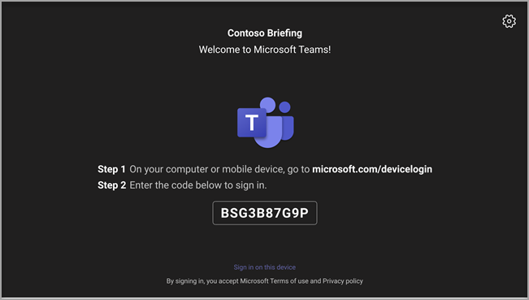

# Android 디바이스에 대한 원격 프로비전 및 Teams 로그인

IT 관리자는 원격으로 Android 디바이스에 프로비전하고 Teams 수 있습니다. 디바이스를 원격으로 프로비전하려면 관리자는 프로비전되는 디바이스의 MAC 아이디를 업로드하고 확인 코드를 만들어야 합니다. 전체 프로세스는 관리자 센터에서 원격으로 Teams 수 있습니다.

## 지원되는 디바이스 검토

다음 목록에는 Android 디바이스 펌웨어 요구 사항이 표시됩니다.

|디바이스 범주|디바이스 모델|펌웨어 버전|
|-|-|-|
|Teams 휴대폰|Yealink T55/T56/T58|58.15.0.124|
|Teams 휴대폰|Yealink VP59|91.15.0.58|
|Teams 휴대폰|Yealink CP960|73.15.0.117|
|Teams 휴대폰|Yealink MP56/MP54/MP58|122.15.0.36|
|Teams 휴대폰|Crestron UC-2|1.0.3.52|
|Teams 휴대폰|  Poly Trio C60|  7.0.2.1071|
|Teams 휴대폰|  CCX400/CCX500/CCX600    |7.0.2.1072|
|Teams 휴대폰|  오디오 코드 C448HD/C450HD/C470HD|   1.10.120|

## 디바이스 MAC 주소 추가

다음 단계를 완료하여 새 디바이스를 프로비전합니다.

1. Teams 관리 센터에 로그인합니다.
2. 디바이스를 **확장합니다.**
3. 작업 **탭에서** 새 디바이스 **프로비전을** 선택합니다.

새 디바이스 **프로비전** 창에서 MAC 주소를 수동으로 추가하거나 파일을 업로드할 수 있습니다.

### 디바이스 MAC 주소를 수동으로 추가합니다.

1. 대기 중 **활성화 탭에서** **MAC ID 추가를 선택합니다.**

   

1. MAC ID를 입력합니다.
1. 위치를 입력하여 기술자가 디바이스를 설치할 위치를 식별하는 데 도움이 됩니다.
1. 완료 **시 적용을** 선택합니다.

### 업로드 MAC 주소를 추가하기 위해 파일을 저장합니다.

1. 대기 **중** 활성화 탭에서 MAC **업로드 선택합니다.**
2. 파일 템플릿을 다운로드합니다.
3. MAC ID 및 위치를 입력한 다음 파일을 저장합니다.
4. **파일 을** 선택한 다음 을 **업로드.**

## 확인 코드 생성

디바이스에 대한 확인 코드가 필요합니다. 확인 코드는 일괄적으로 또는 디바이스 수준에서 생성되어 24시간 동안 유효합니다.

1. 대기 **중 활성화 탭에서** 기존 MAC ID를 선택합니다.
   MAC 주소에 대한 암호가 만들어지며 확인 **코드 열에 표시됩니다.**

2. 현장 기술자에게 MAC 신분증 및 확인 코드 목록을 제공합니다. 파일에서 직접 세부 정보를 내보낼 수 있으며 실제 설치 작업을 수행하고 있는 기술자에게 파일을 공유할 수 있습니다.

## 디바이스 프로비전

디바이스에 전원이 공급되고 네트워크에 연결되면 기술자가 디바이스를 프로비전합니다. 이러한 단계는 디바이스에서 Teams 완료됩니다.

1. 기술자는 **에서** 디바이스 **프로비전을 설정.**  

   
  
2. 기술자는 제공된 입력 필드에 디바이스별 확인 코드를 입력합니다.

   

   디바이스가 성공적으로 프로비전된 후 테넌트 이름이 로그인 페이지에 표시됩니다.

   

## 원격으로 로그인

프로비전된 디바이스가 대기 로그인 **탭에 나타납니다.** 개별 디바이스를 선택하여 원격 로그인 프로세스를 시작합니다.

1. 대기 로그인 탭에서 **디바이스를** 선택합니다.

   

2. 사용자 로그인의 지침을 **따르고** 닫기 를 **선택합니다.**

   

## 관련 문서

- [Teams에서 디바이스 관리](device-management.md)
- [원격 Teams 디바이스 업데이트](remote-update.md)
