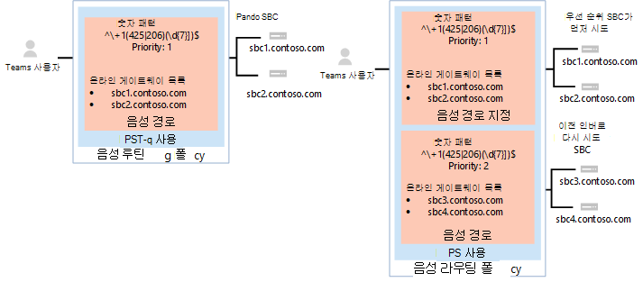
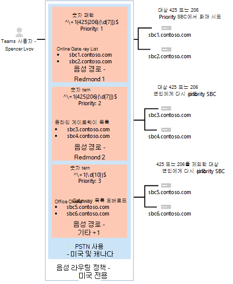
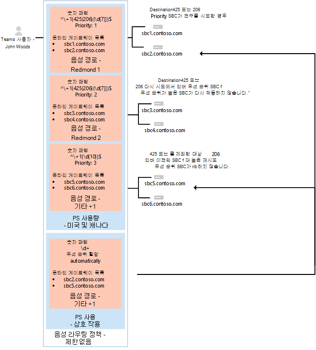

# <a name="configure-direct-routing"></a><span data-ttu-id="063a2-103">직접 라우팅 구성</span><span class="sxs-lookup"><span data-stu-id="063a2-103">Configure Direct Routing</span></span>

> [!Tip]
> <span data-ttu-id="063a2-104">직접적인 라우팅, 계획 방법 및 배포 방법에 대 한 자세한 내용은 다음 세션을 시청 하세요. [Microsoft 팀의 직접 라우팅](https://aka.ms/teams-direct-routing)</span><span class="sxs-lookup"><span data-stu-id="063a2-104">Watch the following session to learn about the benefits of Direct Routing, how to plan for it, and how to deploy it: [Direct Routing in Microsoft Teams](https://aka.ms/teams-direct-routing)</span></span>

<span data-ttu-id="063a2-105">아직 수행 하지 않은 경우에는 필수 구성 요소에 대 한 [직접 라우팅 계획](direct-routing-plan.md) 을 읽고 Microsoft 전화 시스템 네트워크를 구성 하기 전에 수행 해야 하는 다른 단계를 검토 합니다.</span><span class="sxs-lookup"><span data-stu-id="063a2-105">If you have not already done so, read [Plan Direct Routing](direct-routing-plan.md) for prerequisites and to review other steps you’ll need to take before you configure your Microsoft Phone System network.</span></span> 

<span data-ttu-id="063a2-106">이 문서에서는 Microsoft 전화 시스템 다이렉트 라우팅을 구성 하는 방법에 대해 설명 합니다.</span><span class="sxs-lookup"><span data-stu-id="063a2-106">This article describes how to configure Microsoft Phone System Direct Routing.</span></span> <span data-ttu-id="063a2-107">SBC (지원 되는 세션 경계 컨트롤러)를 연결 하는 방법에 대해 설명 하 고, Microsoft 팀 사용자가 PSTN (공개 교환 전화 네트워크)에 연결 하기 위해 직접 라우팅을 사용 하도록 구성 하는 방법에 대해 자세히 알아보세요.</span><span class="sxs-lookup"><span data-stu-id="063a2-107">It details how to pair a supported Session Border Controller (SBC) to Direct Routing and how to configure Microsoft Teams users to use Direct Routing to connect to the Public Switched Telephone Network (PSTN).</span></span> <span data-ttu-id="063a2-108">이 문서에서 설명 하는 단계를 완료 하려면 관리자가 PowerShell cmdlet에 대해 잘 알고 있어야 합니다.</span><span class="sxs-lookup"><span data-stu-id="063a2-108">To complete the steps explained in this article, administrators need some familiarity with PowerShell cmdlets.</span></span> <span data-ttu-id="063a2-109">PowerShell을 사용 하는 방법에 대 한 자세한 내용은 [Windows PowerShell 용 컴퓨터 설정을](https://docs.microsoft.com/SkypeForBusiness/set-up-your-computer-for-windows-powershell/set-up-your-computer-for-windows-powershell)참조 하세요.</span><span class="sxs-lookup"><span data-stu-id="063a2-109">For more information about using PowerShell, see [Set up your computer for Windows PowerShell](https://docs.microsoft.com/SkypeForBusiness/set-up-your-computer-for-windows-powershell/set-up-your-computer-for-windows-powershell).</span></span> 

<span data-ttu-id="063a2-110">Sbc 공급 업체에서 권장 하는 바와 같이 SBC가 이미 구성 되어 있는지 확인 하는 것이 좋습니다.</span><span class="sxs-lookup"><span data-stu-id="063a2-110">We recommend that you confirm that your SBC has already been configured as recommended by your SBC vendor:</span></span> 

- [<span data-ttu-id="063a2-111">오디오 코드 배포 설명서</span><span class="sxs-lookup"><span data-stu-id="063a2-111">AudioCodes deployment documentation</span></span>](https://www.audiocodes.com/solutions-products/products/products-for-microsoft-365/direct-routing-for-microsoft-teams)
- [<span data-ttu-id="063a2-112">Oracle 배포 문서</span><span class="sxs-lookup"><span data-stu-id="063a2-112">Oracle deployment documentation</span></span>](https://www.oracle.com/industries/communications/enterprise-session-border-controller/microsoft.html)
- [<span data-ttu-id="063a2-113">리본 커뮤니케이션 배포 문서</span><span class="sxs-lookup"><span data-stu-id="063a2-113">Ribbon Communications deployment documentation</span></span>](https://ribboncommunications.com/solutions/enterprise-solutions/microsoft-solutions/direct-routing-microsoft-teams-calling)
- [<span data-ttu-id="063a2-114">TE-시스템 (anynode) 배포 문서</span><span class="sxs-lookup"><span data-stu-id="063a2-114">TE-Systems (anynode) deployment documentation</span></span>](https://www.anynode.de/anynode-and-microsoft-teams/)

<span data-ttu-id="063a2-115">Microsoft 전화 시스템을 구성 하 고 사용자가 직접 라우팅을 사용 하도록 설정한 다음 다음 절차를 완료 하 여 기본 통화 클라이언트로 Microsoft 팀을 설정할 수 있습니다.</span><span class="sxs-lookup"><span data-stu-id="063a2-115">You can configure your Microsoft Phone System and enable users to use Direct Routing, then set up Microsoft Teams as the preferred calling client by completing the following procedures:</span></span> 

- [<span data-ttu-id="063a2-116">Microsoft 전화 시스템을 사용 하 여 SBC 쌍을 연결 하 고 페어링의 유효성을 검사 합니다.</span><span class="sxs-lookup"><span data-stu-id="063a2-116">Pair the SBC with a Microsoft Phone System and validate the pairing</span></span>](#pair-the-sbc-to-the-direct-routing-service-of-phone-system)
- [<span data-ttu-id="063a2-117">사용자가 직접 라우팅 서비스를 사용 하도록 설정</span><span class="sxs-lookup"><span data-stu-id="063a2-117">Enable users for Direct Routing Service</span></span>](#enable-users-for-direct-routing-service)
- <span data-ttu-id="063a2-118">Microsoft 팀이 사용자를 위한 기본 통화 클라이언트 인지 확인</span><span class="sxs-lookup"><span data-stu-id="063a2-118">Ensure that Microsoft Teams is the preferred calling client for the users</span></span>

## <a name="pair-the-sbc-to-the-direct-routing-service-of-phone-system"></a><span data-ttu-id="063a2-119">전화 시스템의 다이렉트 라우팅 서비스에 SBC 쌍을 연결 합니다.</span><span class="sxs-lookup"><span data-stu-id="063a2-119">Pair the SBC to the Direct Routing Service of Phone System</span></span> 

<span data-ttu-id="063a2-120">다음은 직접 라우팅 인터페이스에 SBC를 연결 하거나 연결할 수 있도록 하는 세 가지 상위 수준 단계입니다.</span><span class="sxs-lookup"><span data-stu-id="063a2-120">The following are the three high-level steps to let you connect, or pair, the SBC to the Direct Routing interface:</span></span> 

- <span data-ttu-id="063a2-121">PowerShell을 사용 하 여 **비즈니스용 Skype Online** 관리 센터에 연결</span><span class="sxs-lookup"><span data-stu-id="063a2-121">Connect to **Skype for Business Online** admin center using PowerShell</span></span> 
- <span data-ttu-id="063a2-122">SBC 쌍</span><span class="sxs-lookup"><span data-stu-id="063a2-122">Pair the SBC</span></span> 
- <span data-ttu-id="063a2-123">페어링의 유효성을 검사 합니다.</span><span class="sxs-lookup"><span data-stu-id="063a2-123">Validate the pairing</span></span> 

### <a name="connect-to-skype-for-business-online-by-using-powershell"></a><span data-ttu-id="063a2-124">PowerShell을 사용 하 여 비즈니스용 Skype Online에 연결</span><span class="sxs-lookup"><span data-stu-id="063a2-124">Connect to Skype for Business Online by using PowerShell</span></span> 

<span data-ttu-id="063a2-125">테 넌 트에 연결 된 PowerShell 세션을 사용 하 여 SBC를 직접 라우팅 인터페이스에 쌍으로 연결할 수 있습니다.</span><span class="sxs-lookup"><span data-stu-id="063a2-125">You can use a PowerShell session connected to the tenant to pair the SBC to the Direct Routing interface.</span></span> <span data-ttu-id="063a2-126">PowerShell 세션을 열려면 [Windows powershell 용 컴퓨터 설정](https://docs.microsoft.com/SkypeForBusiness/set-up-your-computer-for-windows-powershell/set-up-your-computer-for-windows-powershell)에 설명 된 단계를 따르세요.</span><span class="sxs-lookup"><span data-stu-id="063a2-126">To open a PowerShell session, please follow the steps outlined in [Set up your computer for Windows PowerShell](https://docs.microsoft.com/SkypeForBusiness/set-up-your-computer-for-windows-powershell/set-up-your-computer-for-windows-powershell).</span></span> 
 
<span data-ttu-id="063a2-127">원격 PowerShell 세션을 설정한 후 SBC 관리 명령을 볼 수 있는지 확인 하세요.</span><span class="sxs-lookup"><span data-stu-id="063a2-127">After you establish a remote PowerShell session, please validate that you can see the commands to manage the SBC.</span></span> <span data-ttu-id="063a2-128">명령에 대 한 유효성을 검사 하려면 PowerShell 세션에서 다음을 입력 하거나 복사/붙여넣고 enter 키를 누릅니다.</span><span class="sxs-lookup"><span data-stu-id="063a2-128">To validate the commands, type or copy/paste in the following in the PowerShell session and press Enter:</span></span> 

```PowerShell
Get-Command *onlinePSTNGateway*
```

<span data-ttu-id="063a2-129">이 명령은 SBC를 관리할 수 있도록 여기에 나와 있는 네 개의 함수를 반환 합니다.</span><span class="sxs-lookup"><span data-stu-id="063a2-129">Your command will return the four functions shown here that will let you manage the SBC.</span></span> 

<pre>
CommandType    Name                       Version    Source 
-----------    ----                       -------    ------ 
Function       Get-CsOnlinePSTNGateway    1.0        tmp_v5fiu1no.wxt 
Function       New-CsOnlinePSTNGateway    1.0        tmp_v5fiu1no.wxt 
Function       Remove-CsOnlinePSTNGateway 1.0        tmp_v5fiu1no.wxt 
Function       Set-CsOnlinePSTNGateway    1.0        tmp_v5fiu1no.wxt
</pre>   


### <a name="pair-the-sbc-to-the-tenant"></a><span data-ttu-id="063a2-130">SBC와 테 넌 트를 쌍으로 연결</span><span class="sxs-lookup"><span data-stu-id="063a2-130">Pair the SBC to the tenant</span></span> 

<span data-ttu-id="063a2-131">SBC와 테 넌 트를 쌍으로 연결 하려면 PowerShell 세션에서 다음을 입력 하 고 enter 키를 누릅니다.</span><span class="sxs-lookup"><span data-stu-id="063a2-131">To pair the SBC to the tenant, in the PowerShell session type the following and press Enter:</span></span> 

```PowerShell
New-CsOnlinePSTNGateway -Fqdn <SBC FQDN> -SipSignalingPort <SBC SIP Port> -MaxConcurrentSessions <Max Concurrent Sessions the SBC can handle> -Enabled $true 
```
  > [!NOTE]
  > 1. <span data-ttu-id="063a2-132">SBC 문서에서 찾을 수 있는 정보를 사용 하 여 SBC의 최대 통화 제한 값을 설정할 것을 적극 권장 합니다.</span><span class="sxs-lookup"><span data-stu-id="063a2-132">We highly recommend setting a maximum call limit in the SBC, using information that can be found in the SBC documentation.</span></span> <span data-ttu-id="063a2-133">이 제한은 SBC이 용량 수준에 있는 경우 알림을 트리거합니다.</span><span class="sxs-lookup"><span data-stu-id="063a2-133">The limit will trigger a notification if the SBC is at the capacity level.</span></span>
  > 2. <span data-ttu-id="063a2-134">FQDN의 도메인 부분이 onmicrosoft.com를 제외 \*하 고 테 넌 트에서 등록 된 도메인 중 하 나와 일치 하는 경우에만 SBC를 쌍으로 연결할 수 있습니다.</span><span class="sxs-lookup"><span data-stu-id="063a2-134">You can only pair the SBC if the domain portion of its FQDN matches one of the domains registered in your tenant, except \*.onmicrosoft.com.</span></span> <span data-ttu-id="063a2-135">Onmicrosoft.com \*도메인 이름을 사용 하는 것은 SBC FQDN 이름에 대해 지원 되지 않습니다.</span><span class="sxs-lookup"><span data-stu-id="063a2-135">Using \*.onmicrosoft.com domain names is not supported for the SBC FQDN name.</span></span> <span data-ttu-id="063a2-136">예를 들어 도메인 이름이 두 개 있는 경우:</span><span class="sxs-lookup"><span data-stu-id="063a2-136">For example, if you have two domain names:</span></span><br/><br/>
  > <span data-ttu-id="063a2-137">**contoso**. c a m</span><span class="sxs-lookup"><span data-stu-id="063a2-137">**contoso**.com</span></span><br/><span data-ttu-id="063a2-138">**contoso**. onmicrosoft.com</span><span class="sxs-lookup"><span data-stu-id="063a2-138">**contoso**.onmicrosoft.com</span></span><br/><br/>
  > <span data-ttu-id="063a2-139">SBC 이름에는 이름 sbc.contoso.com를 사용할 수 있습니다.</span><span class="sxs-lookup"><span data-stu-id="063a2-139">For the SBC name, you can use the name sbc.contoso.com.</span></span> <span data-ttu-id="063a2-140">Sbc와 이름 sbc를 쌍으로 연결 하려고 하면이 테 넌 트가 도메인을 소유 하지 않으므로 시스템에서 사용자를 허용 하지 않습니다.</span><span class="sxs-lookup"><span data-stu-id="063a2-140">If you try to pair the SBC with a name sbc.contoso.abc, the system will not let you, as the domain is not owned by this tenant.</span></span><br/>
  > <span data-ttu-id="063a2-141">테 넌 트에 등록 된 도메인 외에도 해당 도메인 및 할당 된 E3 또는 E5 라이선스를 가진 사용자가 있어야 합니다.</span><span class="sxs-lookup"><span data-stu-id="063a2-141">In addition to the domain registered in your tenant, it is important that there is a user with that domain and an assigned E3 or E5 license.</span></span> <span data-ttu-id="063a2-142">그렇지 않으면 다음 오류가 표시 됩니다.</span><span class="sxs-lookup"><span data-stu-id="063a2-142">If not, you will receive the following error:</span></span><br/>
  <span data-ttu-id="063a2-143">`Can not use the “sbc.contoso.com” domain as it was not configured for this tenant`.</span><span class="sxs-lookup"><span data-stu-id="063a2-143">`Can not use the “sbc.contoso.com” domain as it was not configured for this tenant`.</span></span>

```PowerShell
New-CsOnlinePSTNGateway -Identity sbc.contoso.com -Enabled $true -SipSignalingPort 5067 -MaxConcurrentSessions 100 
```
<span data-ttu-id="063a2-144">구합니다</span><span class="sxs-lookup"><span data-stu-id="063a2-144">Returns:</span></span>
<pre>
Identity              : sbc.contoso.com 
Fqdn                  : sbc.contoso.com 
SipSignalingPort     : 5067 
FailoverTimeSeconds   : 10 
ForwardCallHistory    : False 
ForwardPai            : False 
SendSipOptions        : True 
MaxConcurrentSessions : 100 
Enabled               : True   
</pre>
<span data-ttu-id="063a2-145">페어링 프로세스 중에 설정할 수 있는 추가 옵션이 있습니다.</span><span class="sxs-lookup"><span data-stu-id="063a2-145">There are additional options that can be set during the pairing process.</span></span> <span data-ttu-id="063a2-146">그러나 앞의 예제에서는 필요한 최소 매개 변수만 표시 합니다.</span><span class="sxs-lookup"><span data-stu-id="063a2-146">In the previous example, however, only the minimum required parameters are shown.</span></span> 
 
<span data-ttu-id="063a2-147">다음 표에는 매개 변수를 ```New-CsOnlinePstnGateway```설정 하는 데 사용할 수 있는 추가 매개 변수가 나와 있습니다.</span><span class="sxs-lookup"><span data-stu-id="063a2-147">The following table lists the additional parameters that you can use in setting parameters for ```New-CsOnlinePstnGateway```.</span></span>

|<span data-ttu-id="063a2-148">필수?</span><span class="sxs-lookup"><span data-stu-id="063a2-148">Required?</span></span>|<span data-ttu-id="063a2-149">이름</span><span class="sxs-lookup"><span data-stu-id="063a2-149">Name</span></span>|<span data-ttu-id="063a2-150">설명</span><span class="sxs-lookup"><span data-stu-id="063a2-150">Description</span></span>|<span data-ttu-id="063a2-151">기본값</span><span class="sxs-lookup"><span data-stu-id="063a2-151">Default</span></span>|<span data-ttu-id="063a2-152">사용할 수 있는 값</span><span class="sxs-lookup"><span data-stu-id="063a2-152">Possible values</span></span>|<span data-ttu-id="063a2-153">유형 및 제한 사항</span><span class="sxs-lookup"><span data-stu-id="063a2-153">Type and restrictions</span></span>|
|:-----|:-----|:-----|:-----|:-----|:-----|
|<span data-ttu-id="063a2-154">예</span><span class="sxs-lookup"><span data-stu-id="063a2-154">Yes</span></span>|<span data-ttu-id="063a2-155">Q</span><span class="sxs-lookup"><span data-stu-id="063a2-155">FQDN</span></span>|<span data-ttu-id="063a2-156">SBC의 FQDN 이름입니다.</span><span class="sxs-lookup"><span data-stu-id="063a2-156">The FQDN name of the SBC</span></span> |<span data-ttu-id="063a2-157">없음</span><span class="sxs-lookup"><span data-stu-id="063a2-157">None</span></span>|<span data-ttu-id="063a2-158">비 Efqdn 이름, 63 문자 제한</span><span class="sxs-lookup"><span data-stu-id="063a2-158">NoneFQDN name, limit 63 characters</span></span>|<span data-ttu-id="063a2-159">[Active Directory에서 컴퓨터, 도메인, 사이트 및 ou에 대 한 명명 규칙](https://support.microsoft.com/help/909264) 의 허용 및 허용 되지 않는 문자 목록 문자열</span><span class="sxs-lookup"><span data-stu-id="063a2-159">String, list of allowed and disallowed characters on [Naming conventions in Active Directory for computers, domains, sites, and OUs](https://support.microsoft.com/help/909264)</span></span>|
|<span data-ttu-id="063a2-160">아니요</span><span class="sxs-lookup"><span data-stu-id="063a2-160">No</span></span>|<span data-ttu-id="063a2-161">MediaBypass</span><span class="sxs-lookup"><span data-stu-id="063a2-161">MediaBypass</span></span> |<span data-ttu-id="063a2-162">SBC로 표시 된 매개 변수는 미디어 바이패스를 지원 하 고 관리자가이를 사용 하려고 합니다.</span><span class="sxs-lookup"><span data-stu-id="063a2-162">Parameter indicated of the SBC supports Media Bypass and the administrator wants to use it.</span></span>|<span data-ttu-id="063a2-163">없음</span><span class="sxs-lookup"><span data-stu-id="063a2-163">None</span></span>|<span data-ttu-id="063a2-164">False</span><span class="sxs-lookup"><span data-stu-id="063a2-164">True</span></span><br/><span data-ttu-id="063a2-165">해제</span><span class="sxs-lookup"><span data-stu-id="063a2-165">False</span></span>|<span data-ttu-id="063a2-166">부울</span><span class="sxs-lookup"><span data-stu-id="063a2-166">Boolean</span></span>|
|<span data-ttu-id="063a2-167">예</span><span class="sxs-lookup"><span data-stu-id="063a2-167">Yes</span></span>|<span data-ttu-id="063a2-168">SipSignalingPort</span><span class="sxs-lookup"><span data-stu-id="063a2-168">SipSignalingPort</span></span> |<span data-ttu-id="063a2-169">TLS (전송 계층 보안) 프로토콜을 사용 하 여 직접 라우팅 서비스와 통신 하는 데 사용 되는 수신 대기 포트입니다.</span><span class="sxs-lookup"><span data-stu-id="063a2-169">Listening port used for communicating with Direct Routing services by using the Transport Layer Security (TLS) protocol.</span></span>|<span data-ttu-id="063a2-170">없음</span><span class="sxs-lookup"><span data-stu-id="063a2-170">None</span></span>|<span data-ttu-id="063a2-171">모든 포트</span><span class="sxs-lookup"><span data-stu-id="063a2-171">Any port</span></span>|<span data-ttu-id="063a2-172">0 ~ 65535</span><span class="sxs-lookup"><span data-stu-id="063a2-172">0 to 65535</span></span> |
|<span data-ttu-id="063a2-173">아니요</span><span class="sxs-lookup"><span data-stu-id="063a2-173">No</span></span>|<span data-ttu-id="063a2-174">FailoverTimeSeconds</span><span class="sxs-lookup"><span data-stu-id="063a2-174">FailoverTimeSeconds</span></span> |<span data-ttu-id="063a2-175">10으로 설정 된 경우 (기본값), 게이트웨이에서 응답 하지 않은 아웃 바운드 호출은 10 초 이내에 사용 가능한 다음 트렁크로 라우팅됩니다. 추가 trunks 없으면 통화가 자동으로 삭제 됩니다.</span><span class="sxs-lookup"><span data-stu-id="063a2-175">When set to 10 (default value), outbound calls that are not answered by the gateway within 10 seconds are routed to the next available trunk; if there are no additional trunks, then the call is automatically dropped.</span></span> <span data-ttu-id="063a2-176">느린 네트워크 및 게이트웨이 응답을 사용 하는 조직에서 호출이 불필요 하 게 손실 될 수 있습니다.</span><span class="sxs-lookup"><span data-stu-id="063a2-176">In an organization with slow networks and gateway responses, that could potentially result in calls being dropped unnecessarily.</span></span> <span data-ttu-id="063a2-177">기본값은 10입니다.</span><span class="sxs-lookup"><span data-stu-id="063a2-177">The default value is 10.</span></span>|<span data-ttu-id="063a2-178">1천만</span><span class="sxs-lookup"><span data-stu-id="063a2-178">10</span></span>|<span data-ttu-id="063a2-179">숫자로</span><span class="sxs-lookup"><span data-stu-id="063a2-179">Number</span></span>|<span data-ttu-id="063a2-180">Int</span><span class="sxs-lookup"><span data-stu-id="063a2-180">Int</span></span>|
|<span data-ttu-id="063a2-181">아니요</span><span class="sxs-lookup"><span data-stu-id="063a2-181">No</span></span>|<span data-ttu-id="063a2-182">ForwardCallHistory</span><span class="sxs-lookup"><span data-stu-id="063a2-182">ForwardCallHistory</span></span> |<span data-ttu-id="063a2-183">트렁크를 통해 통화 기록 정보를 전달할지 여부를 나타냅니다.</span><span class="sxs-lookup"><span data-stu-id="063a2-183">Indicates whether call history information will be forwarded through the trunk.</span></span> <span data-ttu-id="063a2-184">이 기능을 사용 하도록 설정 하면 Office 365 PSTN 프록시가 두 가지 헤더 인 기록 정보 및 참조 하는 사람을 보냅니다.</span><span class="sxs-lookup"><span data-stu-id="063a2-184">If enabled, the Office 365 PSTN Proxy sends two headers: History-info and Referred-By.</span></span> <span data-ttu-id="063a2-185">기본값은 **False** ($False)입니다.</span><span class="sxs-lookup"><span data-stu-id="063a2-185">The default value is **False** ($False).</span></span> |<span data-ttu-id="063a2-186">해제</span><span class="sxs-lookup"><span data-stu-id="063a2-186">False</span></span>|<span data-ttu-id="063a2-187">False</span><span class="sxs-lookup"><span data-stu-id="063a2-187">True</span></span><br/><span data-ttu-id="063a2-188">해제</span><span class="sxs-lookup"><span data-stu-id="063a2-188">False</span></span>|<span data-ttu-id="063a2-189">부울</span><span class="sxs-lookup"><span data-stu-id="063a2-189">Boolean</span></span>|
|<span data-ttu-id="063a2-190">아니요</span><span class="sxs-lookup"><span data-stu-id="063a2-190">No</span></span>|<span data-ttu-id="063a2-191">ForwardPAI</span><span class="sxs-lookup"><span data-stu-id="063a2-191">ForwardPAI</span></span>|<span data-ttu-id="063a2-192">PAI(P-Asserted-Identity) 헤더를 통화와 함께 전달할지 여부를 나타냅니다.</span><span class="sxs-lookup"><span data-stu-id="063a2-192">Indicates whether the P-Asserted-Identity (PAI) header will be forwarded along with the call.</span></span> <span data-ttu-id="063a2-193">PAI 헤더를 사용하면 발신자 번호를 확인할 수 있습니다.</span><span class="sxs-lookup"><span data-stu-id="063a2-193">The PAI header provides a way to verify the identity of the caller.</span></span> <span data-ttu-id="063a2-194">사용 하도록 설정한 경우 개인 정보 취급 방침: ID 헤더만 전송 됩니다.</span><span class="sxs-lookup"><span data-stu-id="063a2-194">If enabled the Privacy:ID header will also be sent.</span></span> <span data-ttu-id="063a2-195">기본값은 **False** ($False)입니다.</span><span class="sxs-lookup"><span data-stu-id="063a2-195">The default value is **False** ($False).</span></span>|<span data-ttu-id="063a2-196">해제</span><span class="sxs-lookup"><span data-stu-id="063a2-196">False</span></span>|<span data-ttu-id="063a2-197">False</span><span class="sxs-lookup"><span data-stu-id="063a2-197">True</span></span><br/><span data-ttu-id="063a2-198">해제</span><span class="sxs-lookup"><span data-stu-id="063a2-198">False</span></span>|<span data-ttu-id="063a2-199">부울</span><span class="sxs-lookup"><span data-stu-id="063a2-199">Boolean</span></span>|
|<span data-ttu-id="063a2-200">아니요</span><span class="sxs-lookup"><span data-stu-id="063a2-200">No</span></span>|<span data-ttu-id="063a2-201">SendSIPOptions</span><span class="sxs-lookup"><span data-stu-id="063a2-201">SendSIPOptions</span></span> |<span data-ttu-id="063a2-202">SBC가 SIP 옵션을 보내지 않을 지 여부를 정의 합니다.</span><span class="sxs-lookup"><span data-stu-id="063a2-202">Defines if an SBC will or will not send the SIP options.</span></span> <span data-ttu-id="063a2-203">이 기능을 사용 하지 않도록 설정 하면 SBC이 모니터링 및 경고 시스템에서 제외 됩니다.</span><span class="sxs-lookup"><span data-stu-id="063a2-203">If disabled, the SBC will be excluded from Monitoring and Alerting system.</span></span> <span data-ttu-id="063a2-204">SIP 옵션을 사용 하도록 설정 하는 것이 좋습니다.</span><span class="sxs-lookup"><span data-stu-id="063a2-204">We highly recommend that you enable SIP options.</span></span> <span data-ttu-id="063a2-205">기본값은 **True**입니다.</span><span class="sxs-lookup"><span data-stu-id="063a2-205">Default value is **True**.</span></span> |<span data-ttu-id="063a2-206">False</span><span class="sxs-lookup"><span data-stu-id="063a2-206">True</span></span>|<span data-ttu-id="063a2-207">False</span><span class="sxs-lookup"><span data-stu-id="063a2-207">True</span></span><br/><span data-ttu-id="063a2-208">해제</span><span class="sxs-lookup"><span data-stu-id="063a2-208">False</span></span>|<span data-ttu-id="063a2-209">부울</span><span class="sxs-lookup"><span data-stu-id="063a2-209">Boolean</span></span>|
|<span data-ttu-id="063a2-210">아니요</span><span class="sxs-lookup"><span data-stu-id="063a2-210">No</span></span>|<span data-ttu-id="063a2-211">MaxConcurrentSessions</span><span class="sxs-lookup"><span data-stu-id="063a2-211">MaxConcurrentSessions</span></span> |<span data-ttu-id="063a2-212">경고 시스템에서 사용 합니다.</span><span class="sxs-lookup"><span data-stu-id="063a2-212">Used by alerting system.</span></span> <span data-ttu-id="063a2-213">값이 설정 되 면 경고 시스템에서는 동시 세션 수가이 값 보다 90% 이상일 때 테 넌 트 관리자에 게 알림을 생성 합니다.</span><span class="sxs-lookup"><span data-stu-id="063a2-213">When any value is set, the alerting system will generate an alert to the tenant administrator when the number of concurrent session is 90% or higher than this value.</span></span> <span data-ttu-id="063a2-214">매개 변수를 설정 하지 않으면 경고가 생성 되지 않습니다.</span><span class="sxs-lookup"><span data-stu-id="063a2-214">If parameter is not set, the alerts are not generated.</span></span> <span data-ttu-id="063a2-215">그러나 모니터링 시스템에서는 24 시간 마다 동시 세션의 수를 보고 합니다.</span><span class="sxs-lookup"><span data-stu-id="063a2-215">However, the monitoring system will report number of concurrent session every 24 hours.</span></span> |<span data-ttu-id="063a2-216">L</span><span class="sxs-lookup"><span data-stu-id="063a2-216">Null</span></span>|<span data-ttu-id="063a2-217">L</span><span class="sxs-lookup"><span data-stu-id="063a2-217">Null</span></span><br/><span data-ttu-id="063a2-218">1 ~ 10만</span><span class="sxs-lookup"><span data-stu-id="063a2-218">1 to 100,000</span></span> ||
|<span data-ttu-id="063a2-219">아니요</span><span class="sxs-lookup"><span data-stu-id="063a2-219">No</span></span>|<span data-ttu-id="063a2-220">MediaRelayRoutingLocationOverride</span><span class="sxs-lookup"><span data-stu-id="063a2-220">MediaRelayRoutingLocationOverride</span></span> |<span data-ttu-id="063a2-221">수동으로 미디어 경로를 선택할 수 있습니다.</span><span class="sxs-lookup"><span data-stu-id="063a2-221">Allows selecting path for media manually.</span></span> <span data-ttu-id="063a2-222">직접 라우팅은 미디어 경로에 대 한 데이터 센터에 SBC의 공용 IP를 기반으로 할당 합니다.</span><span class="sxs-lookup"><span data-stu-id="063a2-222">Direct Routing assigns a datacenter for media path based on the public IP of the SBC.</span></span> <span data-ttu-id="063a2-223">항상 SBC 데이터 센터에 가장 가까운 위치를 선택 합니다.</span><span class="sxs-lookup"><span data-stu-id="063a2-223">We always select closest to the SBC datacenter.</span></span> <span data-ttu-id="063a2-224">그러나 경우에 따라 미국 범위에 있는 공용 IP를 유럽의 SBC에 할당할 수 있습니다.</span><span class="sxs-lookup"><span data-stu-id="063a2-224">However, in some cases a public IP from for example a US range can be assigned to an SBC located in Europe.</span></span> <span data-ttu-id="063a2-225">이 경우 최적이 아닌 미디어 경로를 사용 하 게 됩니다.</span><span class="sxs-lookup"><span data-stu-id="063a2-225">In this case we will be using not optimal media path.</span></span> <span data-ttu-id="063a2-226">이 매개 변수를 사용 하면 미디어 트래픽에 대 한 기본 설정 영역을 수동으로 설정할 수 있습니다.</span><span class="sxs-lookup"><span data-stu-id="063a2-226">This parameter allows manually set the preferred region for media traffic.</span></span> <span data-ttu-id="063a2-227">미디어 경로에 대 한 데이터 센터의 자동 할당이 SBC 데이터 센터에 가장 근접 하 게 할당 되지 않는다는 것을 호출 로그가 명확 하 게 나타내는 경우에만이 매개 변수를 설정 하는 것이 좋습니다.</span><span class="sxs-lookup"><span data-stu-id="063a2-227">We only recommend setting this parameter if the call logs clearly indicate that automatic assignment of the datacenter for media path does not assign the closest to the SBC datacenter.</span></span> |<span data-ttu-id="063a2-228">없음</span><span class="sxs-lookup"><span data-stu-id="063a2-228">None</span></span>|<span data-ttu-id="063a2-229">ISO 형식의 국가 코드</span><span class="sxs-lookup"><span data-stu-id="063a2-229">Country codes in ISO format</span></span>||
|<span data-ttu-id="063a2-230">아니요</span><span class="sxs-lookup"><span data-stu-id="063a2-230">No</span></span>|<span data-ttu-id="063a2-231">수</span><span class="sxs-lookup"><span data-stu-id="063a2-231">Enabled</span></span>|<span data-ttu-id="063a2-232">이 SBC를 발신 전화에 사용 하도록 설정 합니다.</span><span class="sxs-lookup"><span data-stu-id="063a2-232">Used to enable this SBC for outbound calls.</span></span> <span data-ttu-id="063a2-233">은 SBC, 업데이트 중이거나 유지 관리 중에 일시적으로 제거 하는 데 사용할 수 있습니다.</span><span class="sxs-lookup"><span data-stu-id="063a2-233">Can be used to temporarily remove the SBC, while it is being updated or during maintenance.</span></span> |<span data-ttu-id="063a2-234">해제</span><span class="sxs-lookup"><span data-stu-id="063a2-234">False</span></span>|<span data-ttu-id="063a2-235">False</span><span class="sxs-lookup"><span data-stu-id="063a2-235">True</span></span><br/><span data-ttu-id="063a2-236">해제</span><span class="sxs-lookup"><span data-stu-id="063a2-236">False</span></span>|<span data-ttu-id="063a2-237">부울</span><span class="sxs-lookup"><span data-stu-id="063a2-237">Boolean</span></span>|
 
### <a name="verify-the-sbc-pairing"></a><span data-ttu-id="063a2-238">SBC 페어링 확인</span><span class="sxs-lookup"><span data-stu-id="063a2-238">Verify the SBC pairing</span></span> 

<span data-ttu-id="063a2-239">연결 확인:</span><span class="sxs-lookup"><span data-stu-id="063a2-239">Verify the connection:</span></span> 
- <span data-ttu-id="063a2-240">SBC가 쌍의 SBCs 목록에 있는지 확인 합니다.</span><span class="sxs-lookup"><span data-stu-id="063a2-240">Check if the SBC is on the list of paired SBCs.</span></span> 
- <span data-ttu-id="063a2-241">SIP 옵션의 유효성을 검사 합니다.</span><span class="sxs-lookup"><span data-stu-id="063a2-241">Validate SIP Options.</span></span> 
 
#### <a name="validate-if-the-sbc-is-on-the-list-of-paired-sbcs"></a><span data-ttu-id="063a2-242">SBC이 쌍의 SBCs 목록에 있는지 확인 합니다.</span><span class="sxs-lookup"><span data-stu-id="063a2-242">Validate if the SBC is on the list of paired SBCs</span></span> 

<span data-ttu-id="063a2-243">SBC 쌍을 곱한 후 원격 PowerShell 세션에서 다음 명령을 실행 하 여 해당 SBC가 쌍을 이루는 SBCs 목록에 있는지 확인 합니다.`Get-CSOnlinePSTNGateway`</span><span class="sxs-lookup"><span data-stu-id="063a2-243">After you pair the SBC, validate that the SBC is present in the list of paired SBCs by running the following command in a remote PowerShell session: `Get-CSOnlinePSTNGateway`</span></span>

<span data-ttu-id="063a2-244">쌍으로 연결 된 게이트웨이는 아래 예제에 표시 된 대로 목록에 표시 되어야 하며 **Enabled** 매개 변수에 **True**값이 표시 되는지 확인 합니다.</span><span class="sxs-lookup"><span data-stu-id="063a2-244">The paired gateway should appear in the list as shown in the example below, and verify that the **Enabled** parameter  displays a value of **True**.</span></span> <span data-ttu-id="063a2-245">입력</span><span class="sxs-lookup"><span data-stu-id="063a2-245">Enter:</span></span>

```PowerShell
Get-CsOnlinePSTNGateway -Identity sbc.contoso.com  
```
<span data-ttu-id="063a2-246">반환 되는 결과:</span><span class="sxs-lookup"><span data-stu-id="063a2-246">Which returns:</span></span>
<pre>
Identity              : sbc.contoso.com  
Fqdn                  : sbc.contoso.com 
SipSignalingPort     : 5067 
CodecPriority         : SILKWB,SILKNB,PCMU,PCMA 
ExcludedCodecs        :  
FailoverTimeSeconds   : 10 
ForwardCallHistory    : False 
ForwardPai            : False 
SendSipOptions        : True 
MaxConcurrentSessions : 100 
Enabled               : True 
</pre>

#### <a name="validate-sip-options-flow"></a><span data-ttu-id="063a2-247">SIP 옵션 흐름의 유효성 검사</span><span class="sxs-lookup"><span data-stu-id="063a2-247">Validate SIP Options flow</span></span> 

<span data-ttu-id="063a2-248">나가는 SIP 옵션을 사용 하 여 페어링의 유효성을 검사 하려면 SBC 관리 인터페이스를 사용 하 고 SBC가 보내는 옵션 메시지에 대 한 200 OK 응답을 수신 하는지 확인 합니다.</span><span class="sxs-lookup"><span data-stu-id="063a2-248">To validate the pairing using outgoing SIP Options, use the SBC management interface and confirm that the SBC receives 200 OK responses to its outgoing OPTIONS messages.</span></span>

<span data-ttu-id="063a2-249">직접적인 라우팅이 수신 옵션을 인식 하는 경우 수신 옵션 메시지의 대화 상대 헤더 필드에 구성 된 SBC FQDN으로 보내는 SIP 옵션 메시지를 전송 하기 시작 합니다.</span><span class="sxs-lookup"><span data-stu-id="063a2-249">When Direct Routing sees incoming OPTIONS, it will start sending outgoing SIP Options messages to the SBC FQDN configured in the Contact header field in the incoming OPTIONS message.</span></span> 

<span data-ttu-id="063a2-250">들어오는 SIP 옵션을 사용 하 여 페어링의 유효성을 검사 하려면 SBC 관리 인터페이스를 사용 하 여 SBC가 직접 라우팅에서 들어오는 옵션 메시지에 대 한 응답을 보내고, 전송 하는 응답 코드는 200 OK를 참조 합니다.</span><span class="sxs-lookup"><span data-stu-id="063a2-250">To validate the pairing using incoming SIP Options, use the SBC management interface and see that the SBC sends a reply to the OPTIONS messages coming in from Direct Routing and that the response code it sends is 200 OK.</span></span>

## <a name="enable-users-for-direct-routing-service"></a><span data-ttu-id="063a2-251">사용자가 직접 라우팅 서비스를 사용 하도록 설정</span><span class="sxs-lookup"><span data-stu-id="063a2-251">Enable users for Direct Routing Service</span></span> 

<span data-ttu-id="063a2-252">직접 라우팅 서비스에 대해 사용자를 사용할 준비가 되 면 다음 단계를 수행 합니다.</span><span class="sxs-lookup"><span data-stu-id="063a2-252">When you are ready to enable users for the Direct Routing Service, follow these steps:</span></span> 

1. <span data-ttu-id="063a2-253">Office 365에서 사용자를 만들고 전화 시스템 라이선스를 할당 합니다.</span><span class="sxs-lookup"><span data-stu-id="063a2-253">Create a user in Office 365 and assign a phone system license.</span></span> 
2. <span data-ttu-id="063a2-254">사용자가 비즈니스용 Skype Online에 있는지 확인 합니다.</span><span class="sxs-lookup"><span data-stu-id="063a2-254">Ensure that the user is homed in Skype for Business Online.</span></span> 
3. <span data-ttu-id="063a2-255">전화 번호를 구성 하 고 엔터프라이즈 음성 및 보이스 메일을 사용 하도록 설정 합니다.</span><span class="sxs-lookup"><span data-stu-id="063a2-255">Configure the phone number and enable enterprise voice and voicemail.</span></span> 
4. <span data-ttu-id="063a2-256">음성 라우팅을 구성 합니다.</span><span class="sxs-lookup"><span data-stu-id="063a2-256">Configure voice routing.</span></span> <span data-ttu-id="063a2-257">경로는 자동으로 유효성이 검사 됩니다.</span><span class="sxs-lookup"><span data-stu-id="063a2-257">The route is automatically validated.</span></span>

### <a name="create-a-user-in-office-365-and-assign-the-license"></a><span data-ttu-id="063a2-258">Office 365에서 사용자를 만들고 라이선스를 할당 합니다.</span><span class="sxs-lookup"><span data-stu-id="063a2-258">Create a user in Office 365 and assign the license</span></span> 

<span data-ttu-id="063a2-259">Office 365에서 새 사용자를 만드는 두 가지 옵션이 있습니다.</span><span class="sxs-lookup"><span data-stu-id="063a2-259">There are two options for creating a new user in Office 365.</span></span> <span data-ttu-id="063a2-260">그러나 라우팅 문제를 방지 하기 위해 조직에서 하나의 옵션을 선택 하 고 사용 하는 것이 좋습니다.</span><span class="sxs-lookup"><span data-stu-id="063a2-260">However, we recommend that your organization select and use one option to avoid routing issues:</span></span> 

- <span data-ttu-id="063a2-261">온-프레미스 Active Directory에서 사용자를 만들고 사용자를 클라우드와 동기화 합니다.</span><span class="sxs-lookup"><span data-stu-id="063a2-261">Create the user in on-premises Active Directory and sync the user to the cloud.</span></span> <span data-ttu-id="063a2-262">[Azure Active Directory와 온-프레미스 디렉터리 통합](https://docs.microsoft.com/azure/active-directory/connect/active-directory-aadconnect)을 참조 하세요.</span><span class="sxs-lookup"><span data-stu-id="063a2-262">See [Integrate your on-premises directories with Azure Active Directory](https://docs.microsoft.com/azure/active-directory/connect/active-directory-aadconnect).</span></span>
- <span data-ttu-id="063a2-263">Office 365 관리자 포털에서 직접 사용자를 만듭니다.</span><span class="sxs-lookup"><span data-stu-id="063a2-263">Create the user directly in the Office 365 Administrator Portal.</span></span> <span data-ttu-id="063a2-264">[Office 365에 개별적으로 또는 대량으로 사용자 추가-관리자 도움말을](https://support.office.com/article/Add-users-individually-or-in-bulk-to-Office-365-Admin-Help-1970f7d6-03b5-442f-b385-5880b9c256ec)참조 하세요.</span><span class="sxs-lookup"><span data-stu-id="063a2-264">See [Add users individually or in bulk to Office 365 - Admin Help](https://support.office.com/article/Add-users-individually-or-in-bulk-to-Office-365-Admin-Help-1970f7d6-03b5-442f-b385-5880b9c256ec).</span></span> 

<span data-ttu-id="063a2-265">비즈니스용 skype Online 배포에 비즈니스용 Skype 2015 또는 Lync 2010/2013 온-프레미스가 있는 경우 유일 하 게 지원 되는 옵션은 온-프레미스 Active Directory에서 사용자를 만들고 사용자를 클라우드와 동기화 (옵션 1) 하는 것입니다.</span><span class="sxs-lookup"><span data-stu-id="063a2-265">If your Skype for Business Online deployment co-exists with Skype for Business 2015 or Lync 2010/2013 on-premises, the only supported option is to create the user in on-premises Active Directory and sync the user to the cloud (Option 1).</span></span> 

<span data-ttu-id="063a2-266">라이선스 요구 사항에 대 한 자세한 내용은 [직접 라우팅 계획](direct-routing-plan.md)의 [라이선스 및 기타 요구 사항을](direct-routing-plan.md#licensing-and-other-requirements) 참조 하세요.</span><span class="sxs-lookup"><span data-stu-id="063a2-266">For information about license requirements, see [licensing and other requirements](direct-routing-plan.md#licensing-and-other-requirements) in [Plan Direct Routing](direct-routing-plan.md).</span></span>

### <a name="ensure-that-the-user-is-homed-in-skype-for-business-online"></a><span data-ttu-id="063a2-267">사용자가 비즈니스용 Skype Online에 있는지 확인</span><span class="sxs-lookup"><span data-stu-id="063a2-267">Ensure that the user is homed in Skype for Business Online</span></span> 

<span data-ttu-id="063a2-268">직접 라우팅에는 사용자가 비즈니스용 Skype Online에 있어야 합니다.</span><span class="sxs-lookup"><span data-stu-id="063a2-268">Direct Routing requires the user to be homed in Skype for Business Online.</span></span> <span data-ttu-id="063a2-269">RegistrarPool 매개 변수를 살펴보면이를 확인할 수 있습니다.</span><span class="sxs-lookup"><span data-stu-id="063a2-269">You can check this by looking at the RegistrarPool parameter.</span></span> <span data-ttu-id="063a2-270">Infra.lync.com 도메인에 값이 있어야 합니다.</span><span class="sxs-lookup"><span data-stu-id="063a2-270">It needs to have a value in the infra.lync.com domain.</span></span>

1. <span data-ttu-id="063a2-271">원격 PowerShell에 연결 합니다.</span><span class="sxs-lookup"><span data-stu-id="063a2-271">Connect to remote PowerShell.</span></span>
2. <span data-ttu-id="063a2-272">다음 명령을 실행 합니다.</span><span class="sxs-lookup"><span data-stu-id="063a2-272">Issue the command:</span></span> 

    ```PowerShell
    Get-CsOnlineUser -Identity "<User name>" | fl RegistrarPool
    ``` 

### <a name="configure-the-phone-number-and-enable-enterprise-voice-and-voicemail"></a><span data-ttu-id="063a2-273">전화 번호를 구성 하 고 엔터프라이즈 음성 및 보이스 메일 사용</span><span class="sxs-lookup"><span data-stu-id="063a2-273">Configure the phone number and enable enterprise voice and voicemail</span></span> 

<span data-ttu-id="063a2-274">사용자를 만들고 라이선스를 할당 한 후 다음 단계는 전화 번호와 보이스 메일을 구성 하는 것입니다.</span><span class="sxs-lookup"><span data-stu-id="063a2-274">After you have created the user and assigned a license, the next step is to configure their phone number and voicemail.</span></span> <span data-ttu-id="063a2-275">이 작업을 한 번에 수행할 수 있습니다.</span><span class="sxs-lookup"><span data-stu-id="063a2-275">This can be done in one step.</span></span> 

<span data-ttu-id="063a2-276">전화 번호를 추가 하 고 보이스 메일을 사용 하도록 설정 하려면:</span><span class="sxs-lookup"><span data-stu-id="063a2-276">To add the phone number and enable for voicemail:</span></span>
 
1. <span data-ttu-id="063a2-277">원격 PowerShell 세션에 연결 합니다.</span><span class="sxs-lookup"><span data-stu-id="063a2-277">Connect to a remote PowerShell session.</span></span> 
2. <span data-ttu-id="063a2-278">명령 입력:</span><span class="sxs-lookup"><span data-stu-id="063a2-278">Enter the command:</span></span> 
 
    ```PowerShell
    Set-CsUser -Identity "<User name>" -EnterpriseVoiceEnabled $true -HostedVoiceMail $true -OnPremLineURI tel:<E.164 phone number>
    ```

<span data-ttu-id="063a2-279">예를 들어 "Spencer Low" 사용자의 전화 번호를 추가 하려면 다음을 입력 합니다.</span><span class="sxs-lookup"><span data-stu-id="063a2-279">For example, to add a phone number for user "Spencer Low," you would enter the following:</span></span> 

```PowerShell
Set-CsUser -Identity "Spencer Low" -OnPremLineURI tel:+14255388797 -EnterpriseVoiceEnabled $true -HostedVoiceMail $true
```

<span data-ttu-id="063a2-280">사용 된 전화 번호는 국가 코드를 사용 하 여 전체 전자 164 자로 구성 되어야 합니다.</span><span class="sxs-lookup"><span data-stu-id="063a2-280">The phone number used has to be configured as a full E.164 phone number with country code.</span></span> 

  > [!NOTE]
  > <span data-ttu-id="063a2-281">사용자의 전화 번호가 온-프레미스에서 관리 되는 경우 온-프레미스 Skype for Business 관리 셸 또는 제어판을 사용 하 여 사용자의 전화 번호를 구성 합니다.</span><span class="sxs-lookup"><span data-stu-id="063a2-281">If the user’s phone number is managed on premises, use on-premises Skype for Business Management Shell or Control Panel to configure the user's phone number.</span></span> 

### <a name="configure-voice-routing"></a><span data-ttu-id="063a2-282">음성 라우팅 구성</span><span class="sxs-lookup"><span data-stu-id="063a2-282">Configure Voice Routing</span></span> 

<span data-ttu-id="063a2-283">Microsoft 휴대폰 시스템에는 다음을 기준으로 특정 SBC로 전화를 보낼 수 있는 라우팅 메커니즘이 있습니다.</span><span class="sxs-lookup"><span data-stu-id="063a2-283">Microsoft Phone System has a routing mechanism that allows a call to be sent to a specific SBC based on:</span></span> 

- <span data-ttu-id="063a2-284">전화 번호 패턴</span><span class="sxs-lookup"><span data-stu-id="063a2-284">Called number pattern</span></span> 
- <span data-ttu-id="063a2-285">전화 번호 패턴 호출을 하는 특정 사용자</span><span class="sxs-lookup"><span data-stu-id="063a2-285">Called number pattern + Specific User who makes the call</span></span>
 
<span data-ttu-id="063a2-286">SBCs는 활성 및 백업으로 지정 될 수 있습니다.</span><span class="sxs-lookup"><span data-stu-id="063a2-286">SBCs can be designated as active and backup.</span></span> <span data-ttu-id="063a2-287">즉,이 번호 패턴에 대해 활성으로 구성 된 SBC 또는 번호 패턴 + 특정 사용자를 사용할 수 없는 경우에는 통화가 백업 SBC로 라우팅됩니다.</span><span class="sxs-lookup"><span data-stu-id="063a2-287">That means when the SBC that is configured as active for this number pattern, or number pattern + specific user, is not available, then the calls will be routed to a backup SBC.</span></span>
 
<span data-ttu-id="063a2-288">통화 라우팅은 다음 요소로 구성 됩니다.</span><span class="sxs-lookup"><span data-stu-id="063a2-288">Call routing is made up of the following elements:</span></span> 
- <span data-ttu-id="063a2-289">음성 라우팅 정책 – PSTN 사용을 위한 컨테이너 사용자 또는 여러 사용자에 게 할당할 수 있습니다.</span><span class="sxs-lookup"><span data-stu-id="063a2-289">Voice Routing Policy – container for PSTN Usages; can be assigned to a user or to multiple users</span></span> 
- <span data-ttu-id="063a2-290">PSTN 사용 – 음성 경로 및 PSTN 사용량을 위한 컨테이너 다른 음성 라우팅 정책에서 공유 가능</span><span class="sxs-lookup"><span data-stu-id="063a2-290">PSTN Usages – container for Voice Routes and PSTN Usages; can be shared in different Voice Routing Policies</span></span> 
- <span data-ttu-id="063a2-291">음성 경로 – 호출 번호가 패턴과 일치 하는 호출에 사용할 온라인 PSTN 게이트웨이 집합 및 번호 패턴</span><span class="sxs-lookup"><span data-stu-id="063a2-291">Voice Routes – number pattern and set of Online PSTN Gateways to use for calls where calling number matches the pattern</span></span> 
- <span data-ttu-id="063a2-292">온라인 PSTN 게이트웨이-SBC에 대 한 포인터는 호출이 SBC를 통해 호출 될 때 적용 되는 구성 (예: 정방향 P-어설션된-Id (PAI) 또는 기본 설정 코덱)도 저장 합니다. 음성 경로에 추가할 수 있습니다.</span><span class="sxs-lookup"><span data-stu-id="063a2-292">Online PSTN Gateway - pointer to an SBC, also stores the configuration that is applied when call is placed via the SBC, such as forward P-Asserted-Identity (PAI) or Preferred Codecs; can be added to Voice Routes</span></span> 

#### <a name="creating-a-voice-routing-policy-with-one-pstn-usage"></a><span data-ttu-id="063a2-293">하나의 PSTN 용도를 사용 하 여 음성 라우팅 정책 만들기</span><span class="sxs-lookup"><span data-stu-id="063a2-293">Creating a voice routing policy with one PSTN Usage</span></span> 

<span data-ttu-id="063a2-294">다음 다이어그램은 통화 흐름에서 음성 라우팅 정책의 두 가지 예를 보여줍니다.</span><span class="sxs-lookup"><span data-stu-id="063a2-294">The following diagram shows two examples of voice routing policies in call flow.</span></span>

<span data-ttu-id="063a2-295">**통화 흐름 1 (왼쪽):** 사용자가 + 1 425 XXX XX xx 또는 + 1 206 XXX XX XX에 전화를 거는 경우, 통화는 SBC sbc1.contoso.biz 또는 sbc2.contoso.biz로 라우팅됩니다.</span><span class="sxs-lookup"><span data-stu-id="063a2-295">**Call Flow 1 (on the left):** If a user makes a call to +1 425 XXX XX XX or +1 206 XXX XX XX, the call is routed to SBC sbc1.contoso.biz or sbc2.contoso.biz.</span></span> <span data-ttu-id="063a2-296">Sbc1.contoso.biz 나 sbc2.contoso.biz 모두 사용할 수 없는 경우에는 통화가 손실 됩니다.</span><span class="sxs-lookup"><span data-stu-id="063a2-296">If neither sbc1.contoso.biz nor sbc2.contoso.biz are available, the call is dropped.</span></span> 

<span data-ttu-id="063a2-297">**통화 흐름 2 (오른쪽):** 사용자가 + 1 425 XXX XX xx 또는 + 1 206 XXX XX XX에 전화를 거는 경우, 통화는 먼저 SBC sbc1.contoso.biz 또는 sbc2.contoso.biz로 라우팅됩니다.</span><span class="sxs-lookup"><span data-stu-id="063a2-297">**Call Flow 2 (on the right):** If a user makes a call to +1 425 XXX XX XX or +1 206 XXX XX XX, the call is first routed to SBC sbc1.contoso.biz or sbc2.contoso.biz.</span></span> <span data-ttu-id="063a2-298">두 SBC를 모두 사용할 수 없는 경우 우선 순위가 낮은 경로 (sbc3.contoso.biz 및 sbc4.contoso.biz)가 시도 됩니다.</span><span class="sxs-lookup"><span data-stu-id="063a2-298">If neither SBC is available, the route with lower priority will be tried (sbc3.contoso.biz and sbc4.contoso.biz).</span></span> <span data-ttu-id="063a2-299">사용할 수 있는 SBCs 장치가 없으면 통화가 끊깁니다.</span><span class="sxs-lookup"><span data-stu-id="063a2-299">If none of the SBCs are available, the call is dropped.</span></span> 



<span data-ttu-id="063a2-301">두 예제에서 음성 경로에 우선 순위를 할당 하는 동안 경로의 SBCs는 임의 순서 대로 시도 됩니다.</span><span class="sxs-lookup"><span data-stu-id="063a2-301">In both examples, while the Voice Route is assigned priorities, the SBCs in the routes are tried in random order.</span></span>

  > [!NOTE]
  > <span data-ttu-id="063a2-302">사용자에 게 Microsoft 통화 계획 라이선스가 없는 경우 예제 구성의 패턴 + 1 425 XXX XX xx 또는 + 1 206 XXX XX XX와 일치 하는 숫자를 제외한 모든 번호로 거는 호출이 삭제 됩니다.</span><span class="sxs-lookup"><span data-stu-id="063a2-302">Unless the user also has a Microsoft Calling Plan license, calls to any number except numbers matching the patterns +1 425 XXX XX XX or +1 206 XXX XX XX in the example configuration are dropped.</span></span> <span data-ttu-id="063a2-303">사용자에 게 통화 요금제 라이선스가 있는 경우이 통화는 Microsoft 호출 계획의 정책에 따라 자동으로 라우팅됩니다.</span><span class="sxs-lookup"><span data-stu-id="063a2-303">If the user has a Calling Plan license, the call is automatically routed according to the policies of the Microsoft Calling Plan.</span></span> 

<span data-ttu-id="063a2-304">Microsoft 통화 요금제는 Microsoft 통화 계획 라이선스를 사용 하 여 모든 사용자의 마지막 경로에 자동으로 적용 되며 추가 통화 라우팅 구성이 필요 하지 않습니다.</span><span class="sxs-lookup"><span data-stu-id="063a2-304">The Microsoft Calling Plan applies automatically as the last route to all users with the Microsoft Calling Plan license and does not require additional call routing configuration.</span></span>

<span data-ttu-id="063a2-305">다음 다이어그램에 표시 된 예제에서는 다른 모든 미국 및 캐나다 번호 (호출 되는 번호 패턴 + 1 XXX XXX XX XX으로 이동 하는 호출)에 대 한 통화 보내기를 위해 음성 경로를 추가 합니다.</span><span class="sxs-lookup"><span data-stu-id="063a2-305">In the example shown in the following diagram, a voice route is added to send calls to all other US and Canadian number (calls that go to called number pattern +1 XXX XXX XX XX).</span></span>


<span data-ttu-id="063a2-307">다른 모든 통화에 대해 사용자에 게 라이선스 (Microsoft 전화 시스템 및 Microsoft 호출 계획)가 둘 다 있는 경우 자동 경로가 사용 됩니다.</span><span class="sxs-lookup"><span data-stu-id="063a2-307">For all other calls, if a user has both licenses (Microsoft Phone System and Microsoft Calling Plan), Automatic Route is used.</span></span> <span data-ttu-id="063a2-308">관리자가 만든 온라인 음성 경로의 숫자 패턴과 일치 하는 항목이 없는 경우 Microsoft 통화 요금제를 통해 라우팅합니다.</span><span class="sxs-lookup"><span data-stu-id="063a2-308">If nothing matches the number patterns in the administrator-created online voice routes, route via Microsoft Calling Plan.</span></span>

<span data-ttu-id="063a2-309">사용자에 게 Microsoft 전화 시스템만 있는 경우에는 일치 하는 규칙이 없기 때문에 통화가 끊깁니다.</span><span class="sxs-lookup"><span data-stu-id="063a2-309">If the user has only Microsoft Phone System, the call is dropped because no matching rules are available.</span></span>

  > [!NOTE]
  > <span data-ttu-id="063a2-310">패턴 + 1 XXX XXX XX XX와 일치 하는 경로만 있으므로이 경우 경로 "Other + 1"에 대 한 우선 순위 값은 중요 하지 않습니다.</span><span class="sxs-lookup"><span data-stu-id="063a2-310">The Priority value for route "Other +1" doesn’t matter in this case, as there is only one route that matches the pattern +1 XXX XXX XX XX.</span></span> <span data-ttu-id="063a2-311">사용자가 + 1 324 567 89 89를 호출 하 고 sbc5.contoso.biz 및 sbc6.contoso.biz를 모두 사용할 수 없는 경우 통화가 삭제 됩니다.</span><span class="sxs-lookup"><span data-stu-id="063a2-311">If a user makes a call to +1 324 567 89 89 and both sbc5.contoso.biz and sbc6.contoso.biz are unavailable, the call is dropped.</span></span>

<span data-ttu-id="063a2-312">다음 표에는 세 가지 음성 경로를 사용 하는 구성이 요약 되어 있습니다.</span><span class="sxs-lookup"><span data-stu-id="063a2-312">The following table summarizes the configuration using three voice routes.</span></span> <span data-ttu-id="063a2-313">이 예제에서는 세 개의 경로가 모두 동일한 PSTN 사용 인 "미국 및 캐나다"의 일부입니다.</span><span class="sxs-lookup"><span data-stu-id="063a2-313">In this example, all three routes are part of the same PSTN Usage "US and Canada".</span></span>

|<span data-ttu-id="063a2-314">**PSTN 사용**</span><span class="sxs-lookup"><span data-stu-id="063a2-314">**PSTN usage**</span></span>|<span data-ttu-id="063a2-315">**음성 경로**</span><span class="sxs-lookup"><span data-stu-id="063a2-315">**Voice route**</span></span>|<span data-ttu-id="063a2-316">**번호 패턴**</span><span class="sxs-lookup"><span data-stu-id="063a2-316">**Number pattern**</span></span>|<span data-ttu-id="063a2-317">**중요도**</span><span class="sxs-lookup"><span data-stu-id="063a2-317">**Priority**</span></span>|<span data-ttu-id="063a2-318">**하더라도**</span><span class="sxs-lookup"><span data-stu-id="063a2-318">**SBC**</span></span>|<span data-ttu-id="063a2-319">**설명**</span><span class="sxs-lookup"><span data-stu-id="063a2-319">**Description**</span></span>|
|:-----|:-----|:-----|:-----|:-----|:-----|
|<span data-ttu-id="063a2-320">미국만</span><span class="sxs-lookup"><span data-stu-id="063a2-320">US only</span></span>|<span data-ttu-id="063a2-321">"Redmond 1"</span><span class="sxs-lookup"><span data-stu-id="063a2-321">"Redmond 1"</span></span>|<span data-ttu-id="063a2-322">^\\+ 1 (425\|206) (\d{7}) $</span><span class="sxs-lookup"><span data-stu-id="063a2-322">^\\+1(425\|206)(\d{7})$</span></span>|<span data-ttu-id="063a2-323">1</span><span class="sxs-lookup"><span data-stu-id="063a2-323">1</span></span>|<span data-ttu-id="063a2-324">sbc1.contoso.biz</span><span class="sxs-lookup"><span data-stu-id="063a2-324">sbc1.contoso.biz</span></span><br/><span data-ttu-id="063a2-325">sbc2.contoso.biz</span><span class="sxs-lookup"><span data-stu-id="063a2-325">sbc2.contoso.biz</span></span>|<span data-ttu-id="063a2-326">호출 되는 번호 + 1 425 XXX XX XX 또는 + 1 206 XXX XX XX의 활성 경로</span><span class="sxs-lookup"><span data-stu-id="063a2-326">Active route for called numbers +1 425 XXX XX XX or +1 206 XXX XX XX</span></span>|
|<span data-ttu-id="063a2-327">미국만</span><span class="sxs-lookup"><span data-stu-id="063a2-327">US only</span></span>|<span data-ttu-id="063a2-328">"Redmond 2"</span><span class="sxs-lookup"><span data-stu-id="063a2-328">"Redmond 2"</span></span>|<span data-ttu-id="063a2-329">^\\+ 1 (425\|206) (\d{7}) $</span><span class="sxs-lookup"><span data-stu-id="063a2-329">^\\+1(425\|206)(\d{7})$</span></span>|<span data-ttu-id="063a2-330">2</span><span class="sxs-lookup"><span data-stu-id="063a2-330">2</span></span>|<span data-ttu-id="063a2-331">sbc3.contoso.biz</span><span class="sxs-lookup"><span data-stu-id="063a2-331">sbc3.contoso.biz</span></span><br/><span data-ttu-id="063a2-332">sbc4.contoso.biz</span><span class="sxs-lookup"><span data-stu-id="063a2-332">sbc4.contoso.biz</span></span>|<span data-ttu-id="063a2-333">호출 되는 번호에 대 한 백업 경로 + 1 425 XXX XX XX 또는 + 1 206 XXX XX XX</span><span class="sxs-lookup"><span data-stu-id="063a2-333">Backup route for called numbers +1 425 XXX XX XX or +1 206 XXX XX XX</span></span>|
|<span data-ttu-id="063a2-334">미국만</span><span class="sxs-lookup"><span data-stu-id="063a2-334">US only</span></span>|<span data-ttu-id="063a2-335">"기타 + 1"</span><span class="sxs-lookup"><span data-stu-id="063a2-335">"Other +1"</span></span>|<span data-ttu-id="063a2-336">^\\+ 1 (\d{10}) $</span><span class="sxs-lookup"><span data-stu-id="063a2-336">^\\+1(\d{10})$</span></span>|<span data-ttu-id="063a2-337">3</span><span class="sxs-lookup"><span data-stu-id="063a2-337">3</span></span>|<span data-ttu-id="063a2-338">sbc5.contoso.biz</span><span class="sxs-lookup"><span data-stu-id="063a2-338">sbc5.contoso.biz</span></span><br/><span data-ttu-id="063a2-339">sbc6.contoso.biz</span><span class="sxs-lookup"><span data-stu-id="063a2-339">sbc6.contoso.biz</span></span>|<span data-ttu-id="063a2-340">호출 되는 번호에 대 한 경로 + 1 XXX XXX XX XX (+ 1 425 XXX xx xx 또는 + 1 206 XXX XX xx 제외)</span><span class="sxs-lookup"><span data-stu-id="063a2-340">Route for called numbers +1 XXX XXX XX XX (except +1 425 XXX XX XX or +1 206 XXX XX XX)</span></span>|
|||||||

<span data-ttu-id="063a2-341">모든 경로는 PSTN 사용 "미국 및 캐나다"와 연결 되며, PSTN 사용은 음성 라우팅 정책 "미국 전용"과 연결 됩니다.</span><span class="sxs-lookup"><span data-stu-id="063a2-341">All routes are associated with the PSTN Usage "US and Canada" and the PSTN Usage is associated with the Voice Routing Policy "US Only."</span></span> <span data-ttu-id="063a2-342">이 예제에서는 음성 라우팅 정책이 사용자 Spencer Low에 할당 됩니다.</span><span class="sxs-lookup"><span data-stu-id="063a2-342">In this example, the voice routing policy is assigned to user Spencer Low.</span></span>

#### <a name="examples-of-call-routes"></a><span data-ttu-id="063a2-343">통화 경로의 예</span><span class="sxs-lookup"><span data-stu-id="063a2-343">Examples of call routes</span></span>

<span data-ttu-id="063a2-344">다음 예제에서는 경로, PSTN 용도 및 라우팅 정책을 구성 하는 방법을 설명 하 고 정책을 사용자에 게 할당 합니다.</span><span class="sxs-lookup"><span data-stu-id="063a2-344">In the following example, we demonstrate how to configure Routes, PSTN Usages, and Routing policies, and we assign the policy to the user.</span></span>

<span data-ttu-id="063a2-345">**1 단계:** PSTN 사용량 "미국 및 캐나다"를 만듭니다.</span><span class="sxs-lookup"><span data-stu-id="063a2-345">**Step 1:** Create the PSTN Usage "US and Canada".</span></span>

<span data-ttu-id="063a2-346">비즈니스용 Skype 원격 PowerShell 세션에 다음을 입력 합니다.</span><span class="sxs-lookup"><span data-stu-id="063a2-346">In a Skype for Business Remote PowerShell session, type:</span></span>

```PowerShell
Set-CsOnlinePstnUsage -Identity Global -Usage @{Add="US and Canada"}
```

<span data-ttu-id="063a2-347">다음을 입력 하 여 사용이 생성 되었는지 확인 합니다.</span><span class="sxs-lookup"><span data-stu-id="063a2-347">Validate that the usage was created by entering:</span></span> 
```PowerShell
Get-CSOnlinePSTNUsage
``` 
<span data-ttu-id="063a2-348">다음은 잘릴 수 있는 이름 목록을 반환 하는 것입니다.</span><span class="sxs-lookup"><span data-stu-id="063a2-348">Which returns a list of names that may be truncated:</span></span>
```output
Identity    : Global
Usage       : {testusage, US and Canada, International, karlUsage. . .}
```
<span data-ttu-id="063a2-349">아래 예제에서는 전체 이름을 표시 하는 PowerShell 명령을 `(Get-CSOnlinePSTNUsage).usage` 실행 한 결과를 볼 수 있습니다 (잘리지 않음).</span><span class="sxs-lookup"><span data-stu-id="063a2-349">In the example below, you can see the result of the running the PowerShell command `(Get-CSOnlinePSTNUsage).usage` to display full names (not truncated).</span></span>

<pre>
 testusage
 US and Canada
 International
 karlUsage
 New test env
 Tallinn Lab Sonus
 karlUsage2
 Unrestricted
 Two trunks
</pre>

<span data-ttu-id="063a2-350">**2 단계:** 비즈니스용 Skype Online의 PowerShell 세션에서 3 개 경로 (Redmond 1, 레드먼드 2, 기타 + 1)를 만들어 앞의 표에 자세히 설명 되어 있습니다.</span><span class="sxs-lookup"><span data-stu-id="063a2-350">**Step 2:** In a PowerShell session in Skype for Business Online, create three routes: Redmond 1, Redmond 2, and Other +1, as detailed in the previous table.</span></span> 

<span data-ttu-id="063a2-351">"Redmond 1" 경로를 만들려면 다음을 입력 합니다.</span><span class="sxs-lookup"><span data-stu-id="063a2-351">To create the "Redmond 1" route, enter:</span></span>

```PowerShell
New-CsOnlineVoiceRoute -Identity "Redmond 1" -NumberPattern "^\+1(425|206)
(\d{7})$" -OnlinePstnGatewayList sbc1.contoso.biz, sbc2.contoso.biz -Priority 1 -OnlinePstnUsages "US and Canada"
```

<span data-ttu-id="063a2-352">반환 되는 결과:</span><span class="sxs-lookup"><span data-stu-id="063a2-352">Which returns:</span></span>
<pre>
Identity                : Redmond 1
Priority                : 1
Description             :
NumberPattern           : ^\+1(425|206) (\d{7})$
OnlinePstnUsages        : {US and Canada}
OnlinePstnGatewayList   : {sbc1.contoso.biz, sbc2.contoso.biz}
Name                    : Redmond 1
</pre>
<span data-ttu-id="063a2-353">Redmond 2 경로를 만들려면 다음을 입력 합니다.</span><span class="sxs-lookup"><span data-stu-id="063a2-353">To create the Redmond 2 route, enter:</span></span>

```PowerShell
New-CsOnlineVoiceRoute -Identity "Redmond 2" -NumberPattern "^\+1(425|206)
(\d{7})$" -OnlinePstnGatewayList sbc3.contoso.biz, sbc4.contoso.biz -Priority 2 -OnlinePstnUsages "US and Canada"
```

<span data-ttu-id="063a2-354">다른 + 1 경로를 만들려면 다음을 입력 합니다.</span><span class="sxs-lookup"><span data-stu-id="063a2-354">To create the Other +1 route, enter:</span></span>

```PowerShell
New-CsOnlineVoiceRoute -Identity "Other +1" -NumberPattern "^\+1(\d{10})$"
-OnlinePstnGatewayList sbc5.contoso.biz, sbc6.contoso.biz -OnlinePstnUsages "US and Canada"
```

  > [!CAUTION]
  > <span data-ttu-id="063a2-355">번호 패턴 특성의 정규식이 유효한 식 인지 확인 합니다.</span><span class="sxs-lookup"><span data-stu-id="063a2-355">Make sure that your regular expression in the NumberPattern attribute is a valid expression.</span></span> <span data-ttu-id="063a2-356">이 웹 사이트를 사용 하 여 테스트할 수 있습니다.[https://www.regexpal.com](https://www.regexpal.com)</span><span class="sxs-lookup"><span data-stu-id="063a2-356">You can test it using this website: [https://www.regexpal.com](https://www.regexpal.com)</span></span>

<span data-ttu-id="063a2-357">일부 경우에는 동일한 SBC에 대 한 모든 통화를 라우팅할 필요가 있습니다. -번호를 사용 하세요 (". \*").</span><span class="sxs-lookup"><span data-stu-id="063a2-357">In some cases there is a need to route all calls to the same SBC; please use -NumberPattern ".\*"</span></span>

<span data-ttu-id="063a2-358">모든 통화를 동일한 SBC로 라우팅합니다.</span><span class="sxs-lookup"><span data-stu-id="063a2-358">Route all calls to same SBC.</span></span>

```PowerShell
Set-CsOnlineVoiceRoute -id "Redmond 1" -NumberPattern ".*" -OnlinePstnGatewayList sbc1.contoso.biz
```

<span data-ttu-id="063a2-359">다음과 같이 옵션을 사용 하 여 `Get-CSOnlineVoiceRoute` PowerShell 명령을 실행 하 여 경로를 올바르게 구성 했는지 확인 합니다.</span><span class="sxs-lookup"><span data-stu-id="063a2-359">Validate that you’ve correctly configured the route by running the `Get-CSOnlineVoiceRoute` PowerShell command using options as shown:</span></span>

```PowerShell
Get-CsOnlineVoiceRoute | Where-Object {($_.priority -eq 1) -or ($_.priority -eq 2) or ($_.priority -eq 4) -Identity "Redmond 1" -NumberPattern "^\+1(425|206) (\d{7})$" -OnlinePstnGatewayList sbc1.contoso.biz, sbc2.contoso.biz -Priority 1 -OnlinePstnUsages "US and Canada"
```
<span data-ttu-id="063a2-360">다음을 반환 합니다.</span><span class="sxs-lookup"><span data-stu-id="063a2-360">Which should return:</span></span>
<pre>
Identity            : Redmond 1 
Priority            : 1
Description     : 
NumberPattern       : ^\+1(425|206) (\d{7})$
OnlinePstnUsages    : {US and Canada}    
OnlinePstnGatewayList   : {sbc1.contoso.biz, sbc2.contoso.biz}
Name            : Redmond 1
Identity        : Redmond 2 
Priority            : 2
Description     : 
NumberPattern       : ^\+1(425|206) (\d{7})$
OnlinePstnUsages    : {US and Canada}    
OnlinePstnGatewayList   : {sbc3.contoso.biz, sbc4.contoso.biz}
Name            : Redmond 2
    
Identity        : Other +1 
Priority            : 4
Description     : 
NumberPattern       : ^\+1(\d{10})$
OnlinePstnUsages    : {US and Canada}    
OnlinePstnGatewayList   : {sbc5.contoso.biz, sbc6.contoso.biz}
Name            : Other +1
</pre>

<span data-ttu-id="063a2-361">이 예제에서 경로 "Other + 1"에 우선 순위 4가 자동으로 할당 되었습니다.</span><span class="sxs-lookup"><span data-stu-id="063a2-361">In the example, the route "Other +1" was automatically assigned priority 4.</span></span> 

<span data-ttu-id="063a2-362">**3 단계:** 음성 라우팅 정책 "미국 전용"을 만들고 PSTN 사용량 "미국 및 캐나다"를 정책에 추가 합니다.</span><span class="sxs-lookup"><span data-stu-id="063a2-362">**Step 3:** Create a Voice Routing Policy "US Only" and add to the policy the PSTN Usage "US and Canada."</span></span>

<span data-ttu-id="063a2-363">비즈니스용 Skype Online의 PowerShell 세션에서 다음을 입력 합니다.</span><span class="sxs-lookup"><span data-stu-id="063a2-363">In a PowerShell session in Skype for Business Online, type:</span></span>

```PowerShell
New-CsOnlineVoiceRoutingPolicy "US Only" -OnlinePstnUsages "US and Canada"
```

<span data-ttu-id="063a2-364">결과는 다음 예제에 나와 있습니다.</span><span class="sxs-lookup"><span data-stu-id="063a2-364">The result is shown in this example:</span></span>

<pre>
Identity            : Tag:US only
OnlinePstnUsages    : {US and Canada}
Description         :
RouteType           : BYOT
</pre>

<span data-ttu-id="063a2-365">**4 단계:** PowerShell을 사용 하 여 사용자 Spencer 낮은 음성 라우팅 정책에 게 부여 합니다.</span><span class="sxs-lookup"><span data-stu-id="063a2-365">**Step 4:** Grant to user Spencer Low a voice routing policy by using PowerShell.</span></span>

<span data-ttu-id="063a2-366">비즈니스용 Skype Online의 PowerShell 세션에서 다음을 입력 합니다.</span><span class="sxs-lookup"><span data-stu-id="063a2-366">In a PowerShell session in Skype for Business Online, type:</span></span>

```PowerShell
Grant-CsOnlineVoiceRoutingPolicy -Identity "Spencer Low" -PolicyName "US Only"
```

<span data-ttu-id="063a2-367">다음 명령을 입력 하 여 정책 할당의 유효성을 검사 합니다.</span><span class="sxs-lookup"><span data-stu-id="063a2-367">Validate the policy assignment by entering this command:</span></span>

```PowerShell
Get-CsOnlineUser "Spencer Low" | select OnlineVoiceRoutingPolicy
```

<span data-ttu-id="063a2-368">반환 되는 결과:</span><span class="sxs-lookup"><span data-stu-id="063a2-368">Which returns:</span></span>
<pre>
OnlineVoiceRoutingPolicy
---------------------
US Only
</pre>

#### <a name="creating-a-voice-routing-policy-with-several-pstn-usages"></a><span data-ttu-id="063a2-369">여러 PSTN 용도를 사용 하 여 음성 라우팅 정책 만들기</span><span class="sxs-lookup"><span data-stu-id="063a2-369">Creating a Voice Routing Policy with several PSTN Usages</span></span>

<span data-ttu-id="063a2-370">이전에 만든 음성 라우팅 정책은 Microsoft 통화 계획 라이선스가 사용자에 게 할당 되지 않는 이상 미국 및 캐나다의 전화 번호로만 통화 하도록 허용 합니다.</span><span class="sxs-lookup"><span data-stu-id="063a2-370">The Voice Routing Policy created previously only allows calls to phone numbers in the US and Canada--unless the Microsoft Calling Plan license is also assigned to the user.</span></span>

<span data-ttu-id="063a2-371">다음 예제에서는 음성 라우팅 정책 "제한 없음"을 만들 수 있습니다.</span><span class="sxs-lookup"><span data-stu-id="063a2-371">In the example that follows, you can create the Voice Routing Policy "No Restrictions."</span></span> <span data-ttu-id="063a2-372">이 정책은 이전 예제에서 만든 PSTN 사용량 "미국 및 캐나다"와 새로운 PSTN 사용량 "국제"를 함께 재사용 합니다.</span><span class="sxs-lookup"><span data-stu-id="063a2-372">The policy reuses the PSTN Usage "US and Canada" created in the previous example, as well as the new PSTN Usage "International."</span></span> 

<span data-ttu-id="063a2-373">이렇게 하면 SBCs sbc2.contoso.biz 및 sbc5.contoso.biz에 대 한 다른 모든 통화가 라우팅됩니다.</span><span class="sxs-lookup"><span data-stu-id="063a2-373">This routes all other calls to the SBCs sbc2.contoso.biz and sbc5.contoso.biz.</span></span> <span data-ttu-id="063a2-374">표시 되는 예제는 사용자 "Spencer Low"에 미국 전용 정책만 할당 하 고 "John 숲" 사용자에 게는 제한 사항에 대해 설명 합니다.</span><span class="sxs-lookup"><span data-stu-id="063a2-374">The examples that are shown assign the US Only policy to user "Spencer Low," and No Restrictions to the user "John Woods."</span></span>

<span data-ttu-id="063a2-375">Spencer Low – 미국 및 캐나다 번호로만 허용 되는 통화.</span><span class="sxs-lookup"><span data-stu-id="063a2-375">Spencer Low – Calls allowed only to US and Canadian numbers.</span></span> <span data-ttu-id="063a2-376">Redmond 번호 범위로 호출 하는 경우 특정 SBC 집합을 사용 해야 합니다.</span><span class="sxs-lookup"><span data-stu-id="063a2-376">When calling to the Redmond number range, the specific set of SBC must be used.</span></span> <span data-ttu-id="063a2-377">통화 요금제 라이선스가 사용자에 게 할당 되지 않으면 미국 이외의 번호는 라우팅되지 않습니다.</span><span class="sxs-lookup"><span data-stu-id="063a2-377">Non-US numbers will not be routed unless the Calling Plan license is assigned to the user.</span></span>

<span data-ttu-id="063a2-378">John 숲 – 모든 번호로 전화를 걸 수 있습니다.</span><span class="sxs-lookup"><span data-stu-id="063a2-378">John Woods – Calls allowed to any number.</span></span> <span data-ttu-id="063a2-379">Redmond 번호 범위로 호출 하는 경우 특정 SBC 집합을 사용 해야 합니다.</span><span class="sxs-lookup"><span data-stu-id="063a2-379">When calling to the Redmond number range, the specific set of SBC must be used.</span></span> <span data-ttu-id="063a2-380">미국 이외의 번호는 sbc2.contoso.biz 및 sbc5.contoso.biz를 통해 라우팅됩니다.</span><span class="sxs-lookup"><span data-stu-id="063a2-380">Non-US numbers will be routed via sbc2.contoso.biz and sbc5.contoso.biz.</span></span>



<span data-ttu-id="063a2-382">다른 모든 통화에 대해 사용자에 게 라이선스 (Microsoft 전화 시스템 및 Microsoft 호출 계획)가 둘 다 있는 경우 자동 경로가 사용 됩니다.</span><span class="sxs-lookup"><span data-stu-id="063a2-382">For all other calls, if a user has both licenses (Microsoft Phone System and Microsoft Calling Plan), Automatic Route is used.</span></span> <span data-ttu-id="063a2-383">관리자가 만든 온라인 음성 경로의 숫자 패턴과 일치 하는 항목이 없는 경우 Microsoft 통화 요금제를 통해 라우팅합니다.</span><span class="sxs-lookup"><span data-stu-id="063a2-383">If nothing matches the number patterns in the administrator-created online voice routes, route via Microsoft Calling Plan.</span></span>

<span data-ttu-id="063a2-384">사용자에 게 Microsoft 전화 시스템만 있는 경우에는 일치 하는 규칙이 없기 때문에 통화가 끊깁니다.</span><span class="sxs-lookup"><span data-stu-id="063a2-384">If the user has only Microsoft Phone System, the call is dropped because no matching rules are available.</span></span>



<span data-ttu-id="063a2-386">다음 표에서는 라우팅 정책 "제한 없음" 사용 현황 및 음성 경로를 요약 하 여 설명 합니다.</span><span class="sxs-lookup"><span data-stu-id="063a2-386">The following table summarizes routing policy "No Restrictions" usage designations and voice routes.</span></span> 

|<span data-ttu-id="063a2-387">**PSTN 사용**</span><span class="sxs-lookup"><span data-stu-id="063a2-387">**PSTN usage**</span></span>|<span data-ttu-id="063a2-388">**음성 경로**</span><span class="sxs-lookup"><span data-stu-id="063a2-388">**Voice route**</span></span>|<span data-ttu-id="063a2-389">**번호 패턴**</span><span class="sxs-lookup"><span data-stu-id="063a2-389">**Number pattern**</span></span>|<span data-ttu-id="063a2-390">**중요도**</span><span class="sxs-lookup"><span data-stu-id="063a2-390">**Priority**</span></span>|<span data-ttu-id="063a2-391">**하더라도**</span><span class="sxs-lookup"><span data-stu-id="063a2-391">**SBC**</span></span>|<span data-ttu-id="063a2-392">**설명**</span><span class="sxs-lookup"><span data-stu-id="063a2-392">**Description**</span></span>|
|:-----|:-----|:-----|:-----|:-----|:-----|
|<span data-ttu-id="063a2-393">미국만</span><span class="sxs-lookup"><span data-stu-id="063a2-393">US Only</span></span>|<span data-ttu-id="063a2-394">"Redmond 1"</span><span class="sxs-lookup"><span data-stu-id="063a2-394">"Redmond 1"</span></span>|<span data-ttu-id="063a2-395">^\\+ 1 (425\|206) (\d{7}) $</span><span class="sxs-lookup"><span data-stu-id="063a2-395">^\\+1(425\|206)(\d{7})$</span></span>|<span data-ttu-id="063a2-396">1</span><span class="sxs-lookup"><span data-stu-id="063a2-396">1</span></span>|<span data-ttu-id="063a2-397">sbc1.contoso.biz</span><span class="sxs-lookup"><span data-stu-id="063a2-397">sbc1.contoso.biz</span></span><br/><span data-ttu-id="063a2-398">sbc2.contoso.biz</span><span class="sxs-lookup"><span data-stu-id="063a2-398">sbc2.contoso.biz</span></span>|<span data-ttu-id="063a2-399">호출 수신자 번호 + 1 425 XXX XX XX 또는 + 1 206 XXX XX XX의 활성 경로</span><span class="sxs-lookup"><span data-stu-id="063a2-399">Active route for callee numbers +1 425 XXX XX XX or +1 206 XXX XX XX</span></span>|
|<span data-ttu-id="063a2-400">미국만</span><span class="sxs-lookup"><span data-stu-id="063a2-400">US Only</span></span>|<span data-ttu-id="063a2-401">"Redmond 2"</span><span class="sxs-lookup"><span data-stu-id="063a2-401">"Redmond 2"</span></span>|<span data-ttu-id="063a2-402">^\\+ 1 (425\|206) (\d{7}) $</span><span class="sxs-lookup"><span data-stu-id="063a2-402">^\\+1(425\|206)(\d{7})$</span></span>|<span data-ttu-id="063a2-403">2</span><span class="sxs-lookup"><span data-stu-id="063a2-403">2</span></span>|<span data-ttu-id="063a2-404">sbc3.contoso.biz</span><span class="sxs-lookup"><span data-stu-id="063a2-404">sbc3.contoso.biz</span></span><br/><span data-ttu-id="063a2-405">sbc4.contoso.biz</span><span class="sxs-lookup"><span data-stu-id="063a2-405">sbc4.contoso.biz</span></span>|<span data-ttu-id="063a2-406">호출 수신자 번호 + 1 425 XXX XX XX 또는 + 1 206 XXX XX XX에 대 한 백업 경로</span><span class="sxs-lookup"><span data-stu-id="063a2-406">Backup route for callee numbers +1 425 XXX XX XX or +1 206 XXX XX XX</span></span>|
|<span data-ttu-id="063a2-407">미국만</span><span class="sxs-lookup"><span data-stu-id="063a2-407">US Only</span></span>|<span data-ttu-id="063a2-408">"기타 + 1"</span><span class="sxs-lookup"><span data-stu-id="063a2-408">"Other +1"</span></span>|<span data-ttu-id="063a2-409">^\\+ 1 (\d{10}) $</span><span class="sxs-lookup"><span data-stu-id="063a2-409">^\\+1(\d{10})$</span></span>|<span data-ttu-id="063a2-410">3</span><span class="sxs-lookup"><span data-stu-id="063a2-410">3</span></span>|<span data-ttu-id="063a2-411">sbc5.contoso.biz</span><span class="sxs-lookup"><span data-stu-id="063a2-411">sbc5.contoso.biz</span></span><br/><span data-ttu-id="063a2-412">sbc6>. contoso.biz</span><span class="sxs-lookup"><span data-stu-id="063a2-412">sbc6>.contoso.biz</span></span>|<span data-ttu-id="063a2-413">호출 수신자 번호 + 1 XXX XXX XX XX (+ 1 425 XXX xx xx 또는 + 1 206 XXX XX xx 제외)의 경로</span><span class="sxs-lookup"><span data-stu-id="063a2-413">Route for callee numbers +1 XXX XXX XX XX (except +1 425 XXX XX XX or +1 206 XXX XX XX)</span></span>|
|<span data-ttu-id="063a2-414">국제화</span><span class="sxs-lookup"><span data-stu-id="063a2-414">International</span></span>|<span data-ttu-id="063a2-415">국제화</span><span class="sxs-lookup"><span data-stu-id="063a2-415">International</span></span>|<span data-ttu-id="063a2-416">\d +</span><span class="sxs-lookup"><span data-stu-id="063a2-416">\d+</span></span>|<span data-ttu-id="063a2-417">4(tcp/ipv4)</span><span class="sxs-lookup"><span data-stu-id="063a2-417">4</span></span>|<span data-ttu-id="063a2-418">sbc2.contoso.biz</span><span class="sxs-lookup"><span data-stu-id="063a2-418">sbc2.contoso.biz</span></span><br/><span data-ttu-id="063a2-419">sbc5.contoso.biz</span><span class="sxs-lookup"><span data-stu-id="063a2-419">sbc5.contoso.biz</span></span>|<span data-ttu-id="063a2-420">임의의 숫자 패턴에 대 한 라우팅</span><span class="sxs-lookup"><span data-stu-id="063a2-420">Route for any number pattern</span></span> |


  > [!NOTE]
  > - <span data-ttu-id="063a2-421">음성 라우팅 정책의 PSTN 사용량 순서는 중요 합니다.</span><span class="sxs-lookup"><span data-stu-id="063a2-421">The order of PSTN Usages in Voice Routing Policies is critical.</span></span> <span data-ttu-id="063a2-422">용도는 순서 대로 적용 되며 첫 번째 사용에서 일치 하는 항목을 찾은 경우 다른 용도는 계산 되지 않습니다.</span><span class="sxs-lookup"><span data-stu-id="063a2-422">The usages are applied in order, and if a match is found in the first usage, then other usages are never evaluated.</span></span> <span data-ttu-id="063a2-423">Pstn 사용 "국제"는 PSTN 사용량 "미국 전용" 뒤에 배치 해야 합니다.</span><span class="sxs-lookup"><span data-stu-id="063a2-423">The PSTN Usage "International" must be placed after the PSTN Usage "US Only."</span></span> <span data-ttu-id="063a2-424">PSTN 사용량의 순서를 변경 하려면 `Set-CSOnlineVoiceRoutingPolicy` 명령을 실행 합니다.</span><span class="sxs-lookup"><span data-stu-id="063a2-424">To change the order of the PSTN Usages, run the `Set-CSOnlineVoiceRoutingPolicy` command.</span></span> <br/><span data-ttu-id="063a2-425">예를 들어 "미국 및 캐나다"의 순서와 역순으로 "국제" 초를 순서 대로 변경 하려면 다음을 실행 합니다.</span><span class="sxs-lookup"><span data-stu-id="063a2-425">For example, to change the order from "US and Canada" first and "International" second to the reverse order run:</span></span><br/> `Set-CsOnlineVoiceRoutingPolicy -id tag:"no Restrictions" -OnlinePstnUsages @{Replace="International", "US and Canada"}`
 > - <span data-ttu-id="063a2-426">"기타 + 1" 및 "국제" 음성 경로에 대 한 우선 순위는 자동으로 지정 됩니다.</span><span class="sxs-lookup"><span data-stu-id="063a2-426">The priority for "Other +1" and "International" Voice routes are assigned automatically.</span></span> <span data-ttu-id="063a2-427">"Redmond 1" 및 "Redmond 2" 보다 우선 순위가 낮은 경우에는 중요 하지 않습니다.</span><span class="sxs-lookup"><span data-stu-id="063a2-427">They don’t matter as long as they have lower priorities than "Redmond 1" and "Redmond 2."</span></span>

#### <a name="example-of-voice-routing-policy-for-user-john-woods"></a><span data-ttu-id="063a2-428">사용자 John 숲에 대 한 음성 라우팅 정책의 예</span><span class="sxs-lookup"><span data-stu-id="063a2-428">Example of Voice Routing Policy for user John Woods</span></span>

<span data-ttu-id="063a2-429">PSTN 사용 "국제", 음성 경로 "국제" 음성 라우팅 정책 "제한 사항 없음"을 만들고 "John 숲" 사용자에 게 할당 하는 단계는 다음과 같습니다.</span><span class="sxs-lookup"><span data-stu-id="063a2-429">The steps to create PSTN Usage "International", voice route "International," Voice Routing Policy "No Restrictions," and then assigning it to the user "John Woods" are as follows.</span></span>   


<span data-ttu-id="063a2-430">**1 단계**: PSTN 사용량 "국제"를 만듭니다.</span><span class="sxs-lookup"><span data-stu-id="063a2-430">**Step 1**: Create the PSTN Usage "International."</span></span> 

<span data-ttu-id="063a2-431">비즈니스용 Skype Online의 원격 PowerShell 세션에서 다음을 입력 합니다.</span><span class="sxs-lookup"><span data-stu-id="063a2-431">In a remote PowerShell session in Skype for Business Online, enter:</span></span>

```PowerShell
Set-CsOnlinePstnUsage -Identity Global -Usage @{Add="International"}
```

<span data-ttu-id="063a2-432">**2 단계**: "국제" 새 음성 경로 만들기</span><span class="sxs-lookup"><span data-stu-id="063a2-432">**Step 2**:  Create the new voice route "International."</span></span>

```PowerShell
New-CsOnlineVoiceRoute -Identity "International" -NumberPattern ".*" -OnlinePstnGatewayList sbc2.contoso.biz, sbc5.contoso.biz -OnlinePstnUsages "International"
```
<span data-ttu-id="063a2-433">반환 되는 결과:</span><span class="sxs-lookup"><span data-stu-id="063a2-433">Which returns:</span></span>

<pre>
Identity                  : International
Priority                  : 5
Description               :
NumberPattern             : .*
OnlinePstnUsages          : {International}
OnlinePstnGatewayList     : {sbc2.contoso.biz, sbc5.contoso.biz}
Name                      : International
</pre>

<span data-ttu-id="063a2-434">**3 단계**: 음성 라우팅 정책 "제한 없음"을 만듭니다.</span><span class="sxs-lookup"><span data-stu-id="063a2-434">**Step 3**: Create a Voice Routing Policy "No Restrictions".</span></span> 

<span data-ttu-id="063a2-435">PSTN 사용 "Redmond 1" 및 "Redmond"는 전화 번호 "+ 1 425 XXX xx" 및 "+ 1 206 XXX XX XX"를 로컬 또는 온-프레미스 통화로 하는 특별 한 처리를 유지 하기 위해이 음성 라우팅 정책에 재사용 됩니다.</span><span class="sxs-lookup"><span data-stu-id="063a2-435">The PSTN Usage "Redmond 1" and "Redmond" are reused in this voice routing policy to preserve special handling for calls to number "+1 425 XXX XX XX" and "+1 206 XXX XX XX" as local or on-premises calls.</span></span>

   ```PowerShell
   New-CsOnlineVoiceRoutingPolicy "No Restrictions" -OnlinePstnUsages "US and Canada", "International"
   ```

<span data-ttu-id="063a2-436">PSTN 사용 순서를 기록해 둡니다.</span><span class="sxs-lookup"><span data-stu-id="063a2-436">Take note of the order of PSTN Usages:</span></span>

<span data-ttu-id="063a2-437">에서.</span><span class="sxs-lookup"><span data-stu-id="063a2-437">a.</span></span> <span data-ttu-id="063a2-438">다음 예제와 같이 구성 된 사용량으로 "+ 1 425 XXX XX"로 전화를 걸고 나면 통화는 "미국 및 캐나다" 사용에 설정 된 경로를 따르고 특별 한 라우팅 논리가 적용 됩니다.</span><span class="sxs-lookup"><span data-stu-id="063a2-438">If a call made to number "+1 425 XXX XX XX" with the usages configured as in the following example, the call follows the route set in "US and Canada" usage and the special routing logic is applied.</span></span> <span data-ttu-id="063a2-439">즉, 통화가 먼저 sbc1.contoso.biz 및 sbc2.contoso.biz를 사용 하 여 라우팅된 다음 백업 경로로 sbc3.contoso.biz 및 sbc4.contoso.biz 됩니다.</span><span class="sxs-lookup"><span data-stu-id="063a2-439">That is, the call is routed using sbc1.contoso.biz and sbc2.contoso.biz first, and then sbc3.contoso.biz and sbc4.contoso.biz as the backup routes.</span></span>

<span data-ttu-id="063a2-440">b.</span><span class="sxs-lookup"><span data-stu-id="063a2-440">b.</span></span> <span data-ttu-id="063a2-441">"국제" PSTN 사용이 "미국 및 캐나다" 보다 앞에 있는 경우 + 1 425 XXX XX XX로 거는 호출은 라우팅 논리의 일부로 sbc2.contoso.biz 및 sbc5.contoso.biz로 라우팅됩니다.</span><span class="sxs-lookup"><span data-stu-id="063a2-441">If "International" PSTN usage is before "US and Canada," calls to +1 425 XXX XX XX are routed to sbc2.contoso.biz and sbc5.contoso.biz as part of the routing logic.</span></span> <span data-ttu-id="063a2-442">명령 입력:</span><span class="sxs-lookup"><span data-stu-id="063a2-442">Enter the command:</span></span>

```PowerShell
New-CsOnlineVoiceRoutingPolicy "No Restrictions" -OnlinePstnUsages "US and Canada", "International"
```

<span data-ttu-id="063a2-443">반환 하는</span><span class="sxs-lookup"><span data-stu-id="063a2-443">Which returns</span></span>

<pre>
Identity              : International 
OnlinePstnUsages : {US and Canada, International}    
Description      :  
RouteType             : BYOT
</pre>

<span data-ttu-id="063a2-444">**4 단계**: 다음 명령을 사용 하 여 사용자 "John 숲"에 음성 라우팅 정책을 할당 합니다.</span><span class="sxs-lookup"><span data-stu-id="063a2-444">**Step 4**: Assign the voice routing policy to the user "John Woods" using the following command.</span></span>

```PowerShell
Grant-CsOnlineVoiceRoutingPolicy -Identity "John Woods" -PolicyName "No Restrictions”
```

<span data-ttu-id="063a2-445">그런 다음 명령을 사용 하 여 과제를 확인 합니다.</span><span class="sxs-lookup"><span data-stu-id="063a2-445">Then verify the assignment using the command:</span></span> 

```PowerShell
Get-CsOnlineUser "John Woods" | Select OnlineVoiceRoutingPolicy
```

<span data-ttu-id="063a2-446">반환 되는 결과:</span><span class="sxs-lookup"><span data-stu-id="063a2-446">Which returns:</span></span>

<pre>
OnlineVoiceRoutingPolicy
------------------------
No Restrictions
</pre>

<span data-ttu-id="063a2-447">결과적으로 John 숲의 통화에 적용 되는 음성 정책에는 제한이 없으며 미국, 캐나다, 국제 통화를 위해 제공 되는 통화 라우팅의 논리에 따라 진행 됩니다.</span><span class="sxs-lookup"><span data-stu-id="063a2-447">The result is that the voice policy applied to John Woods’ calls is unrestricted, and will follow the logic of call routing available for US, Canada, and International calling.</span></span>

## <a name="assign-teams-only-mode-to-users-to-ensure-calls-land-in-microsoft-teams"></a><span data-ttu-id="063a2-448">Microsoft 팀에서 전화를 걸 수 있도록 사용자에 게 팀 전용 모드 할당</span><span class="sxs-lookup"><span data-stu-id="063a2-448">Assign Teams Only mode to users to ensure calls land in Microsoft Teams</span></span>

<span data-ttu-id="063a2-449">다이렉트 라우팅은 팀 클라이언트에서 수신 전화를 받을 수 있도록 사용자가 팀 전용 모드에 있어야 합니다.</span><span class="sxs-lookup"><span data-stu-id="063a2-449">Direct Routing requires that users be in Teams Only mode to ensure incoming calls land in the Teams client.</span></span> <span data-ttu-id="063a2-450">사용자를 팀 전용 모드로 전환 하려면 TeamsUpgradePolicy의 "UpgradeToTeams" 인스턴스를 할당 합니다.</span><span class="sxs-lookup"><span data-stu-id="063a2-450">To put users in Teams Only mode, assign them the "UpgradeToTeams" instance of TeamsUpgradePolicy.</span></span> <span data-ttu-id="063a2-451">조직에서 비즈니스용 skype Server 또는 비즈니스용 Skype Online을 사용 하는 경우 비즈니스용 [skype로 팀을 함께 사용 하는 조직의 마이그레이션 및 상호 운용성 지침](https://docs.microsoft.com/microsoftteams/migration-interop-guidance-for-teams-with-skype)에 대 한 다음 문서를 참조 하세요.</span><span class="sxs-lookup"><span data-stu-id="063a2-451">If your organization uses Skype for Business Server or Skype for Business Online, see the following article for information interoperability between Skype and Teams: [Migration and interoperability guidance for organizations using Teams together with Skype for Business](https://docs.microsoft.com/microsoftteams/migration-interop-guidance-for-teams-with-skype).</span></span> 

## <a name="configuring-sending-calls-directly-to-voicemail"></a><span data-ttu-id="063a2-452">전화를 음성 메일로 바로 보내는 방법 구성</span><span class="sxs-lookup"><span data-stu-id="063a2-452">Configuring sending calls directly to voicemail</span></span>

<span data-ttu-id="063a2-453">직접 라우팅을 사용 하면 사용자에 대 한 통화를 종료 하 고 사용자의 음성 메일로 바로 보낼 수 있습니다.</span><span class="sxs-lookup"><span data-stu-id="063a2-453">Direct Routing allows you to end the call to a user and send it directly to the users' voicemail.</span></span> <span data-ttu-id="063a2-454">전화를 음성 메일로 바로 보내려면 불투명 = 앱: 보이스 메일을 요청 URI 헤더에 첨부 하세요.</span><span class="sxs-lookup"><span data-stu-id="063a2-454">If you want to send the call directly to voicemail, please attach opaque=app:voicemail to the Request URI header.</span></span> <span data-ttu-id="063a2-455">예를 들어 "sip: user@yourdomain .com, 불투명 = 앱: 보이스".</span><span class="sxs-lookup"><span data-stu-id="063a2-455">For example, "sip:user@yourdomain.com;opaque=app:voicemail".</span></span>
<span data-ttu-id="063a2-456">이 경우 팀 사용자는 호출 알림을 받지 않게 되며, 통화는 사용자의 보이스 메일에 직접 연결 됩니다.</span><span class="sxs-lookup"><span data-stu-id="063a2-456">In this case the Teams user will not receive the calling notification, the call will be connected to the voicemail of the user directly.</span></span>

## <a name="translate-caller-and-callee-numbers-for-outbound-and-inbound-calls-to-an-alternate-format"></a><span data-ttu-id="063a2-457">대체 형식에 대 한 아웃 바운드 및 인바운드 호출에 대 한 호출자 및 호출 수신자 번호를 변환 합니다.</span><span class="sxs-lookup"><span data-stu-id="063a2-457">Translate caller and callee numbers for outbound and inbound calls to an alternate format</span></span>

<span data-ttu-id="063a2-458">때때로 테 넌 트 관리자가 SBCs와의 상호 운용성을 보장 하기 위해 만든 패턴에 따라 아웃 바운드 및/또는 인바운드 호출에 대 한 호출 수신자 또는 발신자 번호를 변경 하려고 할 수 있습니다.</span><span class="sxs-lookup"><span data-stu-id="063a2-458">Sometimes tenant administrators may want to change the callee or caller number for outbound and/or inbound calls based on the patterns they created to ensure interoperability with SBCs.</span></span> <span data-ttu-id="063a2-459">호출 수신자 또는 발신자 번호를 대체 형식으로 변환 하도록 번호 번역 규칙 정책을 설정할 수 있습니다.</span><span class="sxs-lookup"><span data-stu-id="063a2-459">You can set a Number Translation Rules policy to translate callee or caller numbers to an alternate format.</span></span> <span data-ttu-id="063a2-460">정책을 사용 하 여 다음에 대 한 숫자를 번역할 수 있습니다.</span><span class="sxs-lookup"><span data-stu-id="063a2-460">You can use the policy to translate numbers for the following:</span></span>

- <span data-ttu-id="063a2-461">인바운드 통화: PSTN 끝점 (호출자)에서 팀 클라이언트 (피호출자)로 호출 합니다.</span><span class="sxs-lookup"><span data-stu-id="063a2-461">Inbound calls: Calls from a PSTN endpoint (caller) to a Teams client (callee).</span></span>
- <span data-ttu-id="063a2-462">아웃 바운드 통화: 팀 클라이언트 (호출자)에서 PSTN 끝점 (호출 수신자)으로 호출 합니다.</span><span class="sxs-lookup"><span data-stu-id="063a2-462">Outbound calls: Calls from a Teams client (caller) to a PSTN endpoint (callee).</span></span>

<span data-ttu-id="063a2-463">정책은 SBC 수준에서 적용 됩니다.</span><span class="sxs-lookup"><span data-stu-id="063a2-463">The policy is applied at the SBC level.</span></span> <span data-ttu-id="063a2-464">여러 번역 규칙을 사용자가 PowerShell에 나열할 때 표시 되는 순서 대로 적용 되는 SBC에 할당할 수 있습니다.</span><span class="sxs-lookup"><span data-stu-id="063a2-464">You can assign multiple translation rules to a SBC, which are applied in the order that they appear when you list them in PowerShell.</span></span> <span data-ttu-id="063a2-465">또한 정책에서 규칙의 순서를 변경할 수 있습니다.</span><span class="sxs-lookup"><span data-stu-id="063a2-465">You can also change the order of the rules in the policy.</span></span>

<span data-ttu-id="063a2-466">번호 조작 규칙을 만들고, 수정 하 고, 보고, 삭제 하려면 [New-CsTeamsTranslationRule](https://docs.microsoft.com/powershell/module/skype/new-csteamstranslationrule), [Set-CsTeamsTranslationRule](https://docs.microsoft.com/powershell/module/skype/set-csteamstranslationrule), [CsTeamsTranslationRule](https://docs.microsoft.com/powershell/module/skype/get-csteamstranslationrule)및 [Remove-CsTeamsTranslationRule](https://docs.microsoft.com/powershell/module/skype/remove-csteamstranslationrule) cmdlet을 사용 합니다.</span><span class="sxs-lookup"><span data-stu-id="063a2-466">To create, modify, view, and delete number manipulation rules, use the [New-CsTeamsTranslationRule](https://docs.microsoft.com/powershell/module/skype/new-csteamstranslationrule), [Set-CsTeamsTranslationRule](https://docs.microsoft.com/powershell/module/skype/set-csteamstranslationrule), [Get-CsTeamsTranslationRule](https://docs.microsoft.com/powershell/module/skype/get-csteamstranslationrule), and [Remove-CsTeamsTranslationRule](https://docs.microsoft.com/powershell/module/skype/remove-csteamstranslationrule) cmdlets.</span></span>

<span data-ttu-id="063a2-467">SBCs에 번호 조작 규칙을 할당, 구성 및 나열 하려면 [CSOnlinePSTNGateway](https://docs.microsoft.com/powershell/module/skype/new-csonlinepstngateway) 및 [Set-CSOnlinePSTNGateway](https://docs.microsoft.com/powershell/module/skype/set-csonlinepstngateway) ```InboundTeamsNumberTranslationRules```cmdlet을, ```InboundPSTNNumberTranslationRules``` ```OutboundTeamsNumberTranslationRules``` ```OutboundPSTNNumberTranslationRules``` ```InboundTeamsNumberTranslationRulesList``` ```InboundPSTNNumberTranslationRulesList``` ```OutboundTeamsNumberTranslationRulesList```,,,,,, ```OutboundPSTNNumberTranslationRulesList``` 매개 변수와 함께 사용 합니다.</span><span class="sxs-lookup"><span data-stu-id="063a2-467">To assign, configure, and list number manipulation rules on SBCs, use the [New-CSOnlinePSTNGateway](https://docs.microsoft.com/powershell/module/skype/new-csonlinepstngateway) and [Set-CSOnlinePSTNGateway](https://docs.microsoft.com/powershell/module/skype/set-csonlinepstngateway) cmdlets together with the  ```InboundTeamsNumberTranslationRules```, ```InboundPSTNNumberTranslationRules```, ```OutboundTeamsNumberTranslationRules```, ```OutboundPSTNNumberTranslationRules```, ```InboundTeamsNumberTranslationRulesList```, ```InboundPSTNNumberTranslationRulesList```, ```OutboundTeamsNumberTranslationRulesList```, and ```OutboundPSTNNumberTranslationRulesList``` parameters.</span></span>

### <a name="examples"></a><span data-ttu-id="063a2-468">예제</span><span class="sxs-lookup"><span data-stu-id="063a2-468">Examples</span></span>

#### <a name="example-sbc-configuration"></a><span data-ttu-id="063a2-469">예제 SBC 구성</span><span class="sxs-lookup"><span data-stu-id="063a2-469">Example SBC configuration</span></span>

<span data-ttu-id="063a2-470">예제 시나리오의 경우 ```New-CsOnlinePSTNGateway``` cmdlet을 실행 하 여 다음 SBC 구성을 만듭니다.</span><span class="sxs-lookup"><span data-stu-id="063a2-470">For the example scenarios, we run the ```New-CsOnlinePSTNGateway``` cmdlet to create the following SBC configuration.</span></span>

```PowerShell
New-CSOnlinePSTNGateway -Identity sbc1.contoso.com -SipSignalingPort 5061 –InboundTeamsNumberTranslationRulesList ‘AddPlus1’, ‘AddE164SeattleAreaCode’ -InboundPSTNNumberTranslationRulesList ‘AddPlus1’ -OnboundPSTNNumberTranslationRulesList ‘AddSeattleAreaCode’,  -OutboundTeamsNumberTranslationRulesList ‘StripPlus1’
```

<span data-ttu-id="063a2-471">SBC에 할당 된 번역 규칙은 다음 표에 요약 되어 있습니다.</span><span class="sxs-lookup"><span data-stu-id="063a2-471">The translation rules assigned to the SBC are summarized in the following table.</span></span>

|<span data-ttu-id="063a2-472">이름</span><span class="sxs-lookup"><span data-stu-id="063a2-472">Name</span></span>  |<span data-ttu-id="063a2-473">패턴이</span><span class="sxs-lookup"><span data-stu-id="063a2-473">Pattern</span></span> |<span data-ttu-id="063a2-474">변환용</span><span class="sxs-lookup"><span data-stu-id="063a2-474">Translation</span></span>  |
|---------|---------|---------|
|<span data-ttu-id="063a2-475">AddPlus1</span><span class="sxs-lookup"><span data-stu-id="063a2-475">AddPlus1</span></span>     |<span data-ttu-id="063a2-476">^ (\d{10}) $</span><span class="sxs-lookup"><span data-stu-id="063a2-476">^(\d{10})$</span></span>          |<span data-ttu-id="063a2-477">+ 1 $1</span><span class="sxs-lookup"><span data-stu-id="063a2-477">+1$1</span></span>          |
|<span data-ttu-id="063a2-478">AddE164SeattleAreaCode</span><span class="sxs-lookup"><span data-stu-id="063a2-478">AddE164SeattleAreaCode</span></span>      |<span data-ttu-id="063a2-479">^ (\d{4}) $</span><span class="sxs-lookup"><span data-stu-id="063a2-479">^(\d{4})$</span></span>          | <span data-ttu-id="063a2-480">+ 1206555 $1</span><span class="sxs-lookup"><span data-stu-id="063a2-480">+1206555$1</span></span>         |
|<span data-ttu-id="063a2-481">AddSeattleAreaCode</span><span class="sxs-lookup"><span data-stu-id="063a2-481">AddSeattleAreaCode</span></span>    |<span data-ttu-id="063a2-482">^ (\d{4}) $</span><span class="sxs-lookup"><span data-stu-id="063a2-482">^(\d{4})$</span></span>          | <span data-ttu-id="063a2-483">425555 $1</span><span class="sxs-lookup"><span data-stu-id="063a2-483">425555$1</span></span>         |
|<span data-ttu-id="063a2-484">StripPlus1</span><span class="sxs-lookup"><span data-stu-id="063a2-484">StripPlus1</span></span>    |<span data-ttu-id="063a2-485">^ + 1 (\d{10}) $</span><span class="sxs-lookup"><span data-stu-id="063a2-485">^+1(\d{10})$</span></span>          | <span data-ttu-id="063a2-486">$1</span><span class="sxs-lookup"><span data-stu-id="063a2-486">$1</span></span>         |

<span data-ttu-id="063a2-487">이 예제 시나리오에는 Alice와 Bob 두 명의 사용자가 있습니다.</span><span class="sxs-lookup"><span data-stu-id="063a2-487">In these example scenarios, we have two users, Alice and Bob.</span></span> <span data-ttu-id="063a2-488">Alice는 팀 사용자이 고 번호는 + 1 206 555 0100입니다.</span><span class="sxs-lookup"><span data-stu-id="063a2-488">Alice is a Teams user and her number is +1 206 555 0100.</span></span> <span data-ttu-id="063a2-489">Bob은 PSTN 사용자이 고 해당 번호는 + 1 425 555 0100입니다.</span><span class="sxs-lookup"><span data-stu-id="063a2-489">Bob is a PSTN user and his number is +1 425 555 0100.</span></span>

#### <a name="example-1-inbound-call-to-a-ten-digit-number"></a><span data-ttu-id="063a2-490">예제 1:10 자리 숫자에 대 한 인바운드 호출</span><span class="sxs-lookup"><span data-stu-id="063a2-490">Example 1: Inbound call to a ten-digit number</span></span>

<span data-ttu-id="063a2-491">Bob은 E 10의 164 자리 숫자를 사용 하 여 Alice를 호출 합니다.</span><span class="sxs-lookup"><span data-stu-id="063a2-491">Bob calls Alice using a non-E.164 ten-digit number.</span></span> <span data-ttu-id="063a2-492">Bob이 2065550100으로 전화를 걸어 Alice에 도달 합니다.</span><span class="sxs-lookup"><span data-stu-id="063a2-492">Bob dials 2065550100 to reach Alice.</span></span>
<span data-ttu-id="063a2-493">SBC는 Urirequesturi에서 2065550100을 사용 하 고 From 헤더에는 To 헤더 및 4255550100를 사용 합니다.</span><span class="sxs-lookup"><span data-stu-id="063a2-493">SBC uses 2065550100 in the RequestURI and To headers and 4255550100 in the From header.</span></span>

|<span data-ttu-id="063a2-494">헤더</span><span class="sxs-lookup"><span data-stu-id="063a2-494">Header</span></span>  |<span data-ttu-id="063a2-495">원문 언어</span><span class="sxs-lookup"><span data-stu-id="063a2-495">Original</span></span> |<span data-ttu-id="063a2-496">번역 된 헤더</span><span class="sxs-lookup"><span data-stu-id="063a2-496">Translated header</span></span> |<span data-ttu-id="063a2-497">매개 변수 및 규칙이 적용 됨</span><span class="sxs-lookup"><span data-stu-id="063a2-497">Parameter and rule applied</span></span>  |
|---------|---------|---------|---------|
|<span data-ttu-id="063a2-498">Urirequesturi</span><span class="sxs-lookup"><span data-stu-id="063a2-498">RequestURI</span></span>  |<span data-ttu-id="063a2-499">Sip:2065550100@sbc.contoso.com 초대</span><span class="sxs-lookup"><span data-stu-id="063a2-499">INVITE sip:2065550100@sbc.contoso.com</span></span>|<span data-ttu-id="063a2-500">Sip:+12065550100@sbc.contoso.com 초대</span><span class="sxs-lookup"><span data-stu-id="063a2-500">INVITE sip:+12065550100@sbc.contoso.com</span></span>|<span data-ttu-id="063a2-501">InboundTeamsNumberTranslationRulesList 'AddPlus1'</span><span class="sxs-lookup"><span data-stu-id="063a2-501">InboundTeamsNumberTranslationRulesList ‘AddPlus1’</span></span>|
|<span data-ttu-id="063a2-502">받는 사람</span><span class="sxs-lookup"><span data-stu-id="063a2-502">TO</span></span>    |<span data-ttu-id="063a2-503">TO: \<sip:2065550100@sbc.contoso.com></span><span class="sxs-lookup"><span data-stu-id="063a2-503">TO: \<sip:2065550100@sbc.contoso.com></span></span>|<span data-ttu-id="063a2-504">TO: \<sip:+12065550100@sbc.contoso.com></span><span class="sxs-lookup"><span data-stu-id="063a2-504">TO: \<sip:+12065550100@sbc.contoso.com></span></span>|<span data-ttu-id="063a2-505">InboundTeamsNumberTranlationRulesList 'AddPlus1'</span><span class="sxs-lookup"><span data-stu-id="063a2-505">InboundTeamsNumberTranlationRulesList ‘AddPlus1’</span></span>|
|<span data-ttu-id="063a2-506">보낸 사람</span><span class="sxs-lookup"><span data-stu-id="063a2-506">FROM</span></span>   |<span data-ttu-id="063a2-507">보낸 사람 \<: sip:4255550100@sbc.contoso.com></span><span class="sxs-lookup"><span data-stu-id="063a2-507">FROM: \<sip:4255550100@sbc.contoso.com></span></span>|<span data-ttu-id="063a2-508">보낸 사람 \<: sip:+14255550100@sbc.contoso.com></span><span class="sxs-lookup"><span data-stu-id="063a2-508">FROM: \<sip:+14255550100@sbc.contoso.com></span></span>|<span data-ttu-id="063a2-509">InboundPSTNNumberTranslationRulesList 'AddPlus1'</span><span class="sxs-lookup"><span data-stu-id="063a2-509">InboundPSTNNumberTranslationRulesList ‘AddPlus1’</span></span>|

#### <a name="example-2-inbound-call-to-a-four-digit-number"></a><span data-ttu-id="063a2-510">예제 2:4 자리 숫자에 대 한 인바운드 호출</span><span class="sxs-lookup"><span data-stu-id="063a2-510">Example 2: Inbound call to a four-digit number</span></span>

<span data-ttu-id="063a2-511">Bob은 네 자리 숫자를 사용 하 여 Alice를 호출 합니다.</span><span class="sxs-lookup"><span data-stu-id="063a2-511">Bob calls Alice using a four-digit number.</span></span> <span data-ttu-id="063a2-512">Bob이 0100으로 전화를 걸어 Alice에 도달 합니다.</span><span class="sxs-lookup"><span data-stu-id="063a2-512">Bob dials 0100 to reach Alice.</span></span>
<span data-ttu-id="063a2-513">SBC는 Urirequesturi에서 0100을 사용 하 고 From 헤더에는 To 헤더 및 4255550100를 사용 합니다.</span><span class="sxs-lookup"><span data-stu-id="063a2-513">SBC uses 0100 in the RequestURI and To headers and 4255550100 in the From header.</span></span>

|<span data-ttu-id="063a2-514">헤더</span><span class="sxs-lookup"><span data-stu-id="063a2-514">Header</span></span>  |<span data-ttu-id="063a2-515">원문 언어</span><span class="sxs-lookup"><span data-stu-id="063a2-515">Original</span></span> |<span data-ttu-id="063a2-516">번역 된 헤더</span><span class="sxs-lookup"><span data-stu-id="063a2-516">Translated header</span></span> |<span data-ttu-id="063a2-517">매개 변수 및 규칙이 적용 됨</span><span class="sxs-lookup"><span data-stu-id="063a2-517">Parameter and rule applied</span></span>  |
|---------|---------|---------|---------|
|<span data-ttu-id="063a2-518">Urirequesturi</span><span class="sxs-lookup"><span data-stu-id="063a2-518">RequestURI</span></span>  |<span data-ttu-id="063a2-519">Sip:0100@sbc.contoso.com 초대</span><span class="sxs-lookup"><span data-stu-id="063a2-519">INVITE sip:0100@sbc.contoso.com</span></span>          |<span data-ttu-id="063a2-520">Sip:+12065550100@sbc.contoso.com 초대</span><span class="sxs-lookup"><span data-stu-id="063a2-520">INVITE sip:+12065550100@sbc.contoso.com</span></span>           |<span data-ttu-id="063a2-521">InboundTeamsNumberTranlationRulesList 'AddE164SeattleAreaCode'</span><span class="sxs-lookup"><span data-stu-id="063a2-521">InboundTeamsNumberTranlationRulesList ‘AddE164SeattleAreaCode’</span></span>        |
|<span data-ttu-id="063a2-522">받는 사람</span><span class="sxs-lookup"><span data-stu-id="063a2-522">TO</span></span>    |<span data-ttu-id="063a2-523">TO: \<sip:0100@sbc.contoso.com></span><span class="sxs-lookup"><span data-stu-id="063a2-523">TO: \<sip:0100@sbc.contoso.com></span></span>|<span data-ttu-id="063a2-524">TO: \<sip:+12065550100@sbc.contoso.com></span><span class="sxs-lookup"><span data-stu-id="063a2-524">TO: \<sip:+12065550100@sbc.contoso.com></span></span>|<span data-ttu-id="063a2-525">InboundTeamsNumberTranlationRulesList 'AddE164SeattleAreaCode'</span><span class="sxs-lookup"><span data-stu-id="063a2-525">InboundTeamsNumberTranlationRulesList ‘AddE164SeattleAreaCode’</span></span>         |
|<span data-ttu-id="063a2-526">보낸 사람</span><span class="sxs-lookup"><span data-stu-id="063a2-526">FROM</span></span>   |<span data-ttu-id="063a2-527">보낸 사람 \<: sip:4255550100@sbc.contoso.com></span><span class="sxs-lookup"><span data-stu-id="063a2-527">FROM: \<sip:4255550100@sbc.contoso.com></span></span>|<span data-ttu-id="063a2-528">보낸 사람 \<: sip:+14255550100@sbc.contoso.com></span><span class="sxs-lookup"><span data-stu-id="063a2-528">FROM: \<sip:+14255550100@sbc.contoso.com></span></span>|<span data-ttu-id="063a2-529">InboundPSTNNumberTranlationRulesList 'AddPlus1'</span><span class="sxs-lookup"><span data-stu-id="063a2-529">InboundPSTNNumberTranlationRulesList ‘AddPlus1’</span></span>        |

#### <a name="example-3-outbound-call-using-a-ten-digit-non-e164-number"></a><span data-ttu-id="063a2-530">예제 3:10 자리 비 E 1-64 번호를 사용 하는 아웃 바운드 통화</span><span class="sxs-lookup"><span data-stu-id="063a2-530">Example 3: Outbound call using a ten-digit non-E.164 number</span></span>

<span data-ttu-id="063a2-531">Alice가 10 자리 숫자를 사용 하 여 Bob을 호출 합니다.</span><span class="sxs-lookup"><span data-stu-id="063a2-531">Alice calls Bob using a ten-digit number.</span></span> <span data-ttu-id="063a2-532">Alice는 425 555 0100으로 Bob에 게 전화를 겁니다.</span><span class="sxs-lookup"><span data-stu-id="063a2-532">Alice dials 425 555 0100 to reach Bob.</span></span>
<span data-ttu-id="063a2-533">SBC는 팀과 PSTN 사용자 모두에 대해 비 E 164 10 자리 숫자를 사용 하도록 구성 되어 있습니다.</span><span class="sxs-lookup"><span data-stu-id="063a2-533">SBC is configured to use non-E.164 ten-digit numbers for both Teams and PSTN users.</span></span>

<span data-ttu-id="063a2-534">이 시나리오에서 다이얼 플랜은 직접 라우팅 인터페이스에 전송 하기 전에 번호를 변환 합니다.</span><span class="sxs-lookup"><span data-stu-id="063a2-534">In this scenario, a dial plan translates the number before sending it to the Direct Routing interface.</span></span> <span data-ttu-id="063a2-535">Alice가 팀 클라이언트에 425 555 0100를 입력 하면 해당 번호는 국가 다이얼 플랜에 따라 + 14255550100로 변환 됩니다.</span><span class="sxs-lookup"><span data-stu-id="063a2-535">When Alice enters 425 555 0100 in the Teams client, the number is translated to +14255550100 by the country dial plan.</span></span> <span data-ttu-id="063a2-536">결과 번호는 다이얼 플랜 규칙 및 팀 번역 규칙의 누적 정규화입니다.</span><span class="sxs-lookup"><span data-stu-id="063a2-536">The resulting numbers are a cumulative normalization of the dial plan rules and Teams translation rules.</span></span> <span data-ttu-id="063a2-537">팀 번역 규칙은 다이얼 플랜에 추가 된 "+ 1"을 제거 합니다.</span><span class="sxs-lookup"><span data-stu-id="063a2-537">The Teams translation rules remove the "+1" that was added by the dial plan.</span></span>

|<span data-ttu-id="063a2-538">헤더</span><span class="sxs-lookup"><span data-stu-id="063a2-538">Header</span></span>  |<span data-ttu-id="063a2-539">원문 언어</span><span class="sxs-lookup"><span data-stu-id="063a2-539">Original</span></span> |<span data-ttu-id="063a2-540">번역 된 헤더</span><span class="sxs-lookup"><span data-stu-id="063a2-540">Translated header</span></span> |<span data-ttu-id="063a2-541">매개 변수 및 규칙이 적용 됨</span><span class="sxs-lookup"><span data-stu-id="063a2-541">Parameter and rule applied</span></span>  |
|---------|---------|---------|---------|
|<span data-ttu-id="063a2-542">Urirequesturi</span><span class="sxs-lookup"><span data-stu-id="063a2-542">RequestURI</span></span>  |<span data-ttu-id="063a2-543">Sip:+14255550100@sbc.contoso.com 초대</span><span class="sxs-lookup"><span data-stu-id="063a2-543">INVITE sip:+14255550100@sbc.contoso.com</span></span>          |<span data-ttu-id="063a2-544">Sip:4255550100@sbc.contoso.com 초대</span><span class="sxs-lookup"><span data-stu-id="063a2-544">INVITE sip:4255550100@sbc.contoso.com</span></span>       |<span data-ttu-id="063a2-545">OutboundPSTNNumberTranlationRulesList 'StripPlus1'</span><span class="sxs-lookup"><span data-stu-id="063a2-545">OutboundPSTNNumberTranlationRulesList ‘StripPlus1’</span></span>         |
|<span data-ttu-id="063a2-546">받는 사람</span><span class="sxs-lookup"><span data-stu-id="063a2-546">TO</span></span>    |<span data-ttu-id="063a2-547">TO: \<sip:+14255550100@sbc.contoso.com></span><span class="sxs-lookup"><span data-stu-id="063a2-547">TO: \<sip:+14255550100@sbc.contoso.com></span></span>|<span data-ttu-id="063a2-548">TO: \<sip:4255555555@sbc.contoso.com></span><span class="sxs-lookup"><span data-stu-id="063a2-548">TO: \<sip:4255555555@sbc.contoso.com></span></span>|<span data-ttu-id="063a2-549">OutboundPSTNNumberTranlationRulesList 'StripPlus1'</span><span class="sxs-lookup"><span data-stu-id="063a2-549">OutboundPSTNNumberTranlationRulesList ‘StripPlus1’</span></span>       |
|<span data-ttu-id="063a2-550">보낸 사람</span><span class="sxs-lookup"><span data-stu-id="063a2-550">FROM</span></span>   |<span data-ttu-id="063a2-551">보낸 사람 \<: sip:+12065550100@sbc.contoso.com></span><span class="sxs-lookup"><span data-stu-id="063a2-551">FROM: \<sip:+12065550100@sbc.contoso.com></span></span>|<span data-ttu-id="063a2-552">보낸 사람 \<: sip:2065550100@sbc.contoso.com></span><span class="sxs-lookup"><span data-stu-id="063a2-552">FROM: \<sip:2065550100@sbc.contoso.com></span></span>|<span data-ttu-id="063a2-553">OutboundTeamsNumberTranlationRulesList 'StripPlus1'</span><span class="sxs-lookup"><span data-stu-id="063a2-553">OutboundTeamsNumberTranlationRulesList ‘StripPlus1’</span></span>         |

#### <a name="example-4-outbound-call-using-a-four-digit-non-e164-number"></a><span data-ttu-id="063a2-554">예제 4:4 자리 비 E 1-64 번호를 사용 하는 아웃 바운드 통화</span><span class="sxs-lookup"><span data-stu-id="063a2-554">Example 4: Outbound call using a four-digit non-E.164 number</span></span>

<span data-ttu-id="063a2-555">Alice는 네 자리 숫자를 사용 하 여 Bob을 호출 합니다.</span><span class="sxs-lookup"><span data-stu-id="063a2-555">Alice calls Bob using a four-digit number.</span></span> <span data-ttu-id="063a2-556">Alice는 0100을 사용 하 여 Bob이 통화를 하거나 연락처를 사용 하 여 연락을 주고 받을 수 있습니다.</span><span class="sxs-lookup"><span data-stu-id="063a2-556">Alice uses 0100 to reach Bob from Calls or by using a contact.</span></span>
<span data-ttu-id="063a2-557">SBC 사용자의 경우 팀 사용자 및 10 자리 숫자에 대해 비 E 164 개의 4 자리 숫자를 사용 하도록 SBC를 구성 합니다.</span><span class="sxs-lookup"><span data-stu-id="063a2-557">SBC is configured to use non-E.164 four-digit numbers for Teams users and ten-digit numbers for PSTN users.</span></span> <span data-ttu-id="063a2-558">다이얼 플랜은이 시나리오에서 적용 되지 않습니다.</span><span class="sxs-lookup"><span data-stu-id="063a2-558">The dial plan isn't applied in this scenario.</span></span>

|<span data-ttu-id="063a2-559">헤더</span><span class="sxs-lookup"><span data-stu-id="063a2-559">Header</span></span>  |<span data-ttu-id="063a2-560">원문 언어</span><span class="sxs-lookup"><span data-stu-id="063a2-560">Original</span></span> |<span data-ttu-id="063a2-561">번역 된 헤더</span><span class="sxs-lookup"><span data-stu-id="063a2-561">Translated header</span></span> |<span data-ttu-id="063a2-562">매개 변수 및 규칙이 적용 됨</span><span class="sxs-lookup"><span data-stu-id="063a2-562">Parameter and rule applied</span></span>  |
|---------|---------|---------|---------|
|<span data-ttu-id="063a2-563">Urirequesturi</span><span class="sxs-lookup"><span data-stu-id="063a2-563">RequestURI</span></span>  |<span data-ttu-id="063a2-564">Sip:0100@sbc.contoso.com 초대</span><span class="sxs-lookup"><span data-stu-id="063a2-564">INVITE sip:0100@sbc.contoso.com</span></span>           |<span data-ttu-id="063a2-565">Sip:4255550100@sbc.contoso.com 초대</span><span class="sxs-lookup"><span data-stu-id="063a2-565">INVITE sip:4255550100@sbc.contoso.com</span></span>       |<span data-ttu-id="063a2-566">InboundTeamsNumberTranlationRulesList ' AddSeattleAreaCode '</span><span class="sxs-lookup"><span data-stu-id="063a2-566">InboundTeamsNumberTranlationRulesList ‘AddSeattleAreaCode’</span></span>         |
|<span data-ttu-id="063a2-567">받는 사람</span><span class="sxs-lookup"><span data-stu-id="063a2-567">TO</span></span>    |<span data-ttu-id="063a2-568">TO: \<sip:0100@sbc.contoso.com></span><span class="sxs-lookup"><span data-stu-id="063a2-568">TO: \<sip:0100@sbc.contoso.com></span></span>|<span data-ttu-id="063a2-569">TO: \<sip:4255555555@sbc.contoso.com></span><span class="sxs-lookup"><span data-stu-id="063a2-569">TO: \<sip:4255555555@sbc.contoso.com></span></span>|<span data-ttu-id="063a2-570">InboundTeamsNumberTranlationRulesList ' AddSeattleAreaCode '</span><span class="sxs-lookup"><span data-stu-id="063a2-570">InboundTeamsNumberTranlationRulesList ‘AddSeattleAreaCode’</span></span>       |
|<span data-ttu-id="063a2-571">보낸 사람</span><span class="sxs-lookup"><span data-stu-id="063a2-571">FROM</span></span>   |<span data-ttu-id="063a2-572">보낸 사람 \<: sip:+12065550100@sbc.contoso.com></span><span class="sxs-lookup"><span data-stu-id="063a2-572">FROM: \<sip:+12065550100@sbc.contoso.com></span></span>|<span data-ttu-id="063a2-573">보낸 사람 \<: sip:2065550100@sbc.contoso.com></span><span class="sxs-lookup"><span data-stu-id="063a2-573">FROM: \<sip:2065550100@sbc.contoso.com></span></span>| <span data-ttu-id="063a2-574">InboundPSTNNumberTranlationRulesList 'StripPlus1'</span><span class="sxs-lookup"><span data-stu-id="063a2-574">InboundPSTNNumberTranlationRulesList ‘StripPlus1’</span></span> |

## <a name="see-also"></a><span data-ttu-id="063a2-575">참고 항목</span><span class="sxs-lookup"><span data-stu-id="063a2-575">See also</span></span>

[<span data-ttu-id="063a2-576">직접 라우팅 계획</span><span class="sxs-lookup"><span data-stu-id="063a2-576">Plan Direct Routing</span></span>](direct-routing-plan.md)
