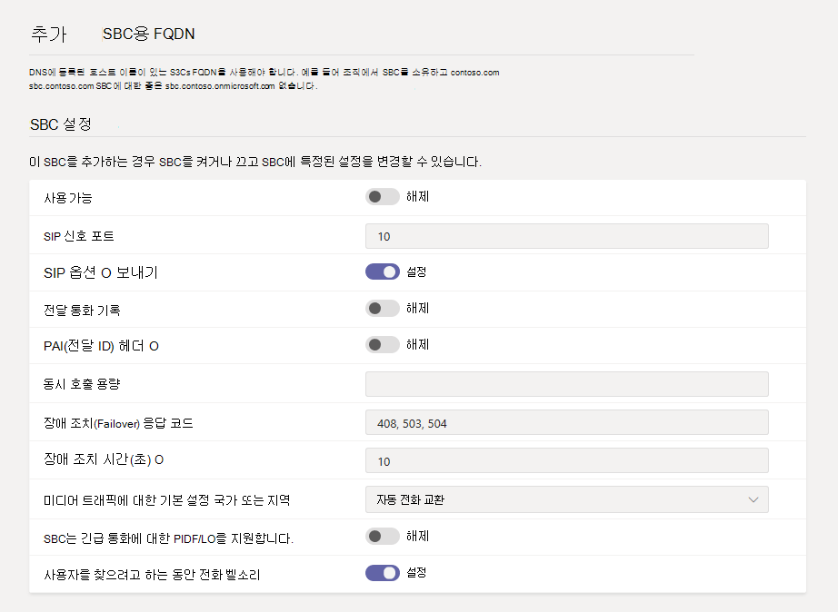

# <a name="connect-your-session-border-controller-sbc-to-direct-routing"></a><span data-ttu-id="20eff-103">커넥트 SBC(세션 테두리 컨트롤러)를 직접 라우팅에 연결</span><span class="sxs-lookup"><span data-stu-id="20eff-103">Connect your Session Border Controller (SBC) to Direct Routing</span></span>

<span data-ttu-id="20eff-104">이 문서에서는 SBC(세션 테두리 컨트롤러)를 구성하고 직접 라우팅에 전화 시스템 방법을 설명합니다.</span><span class="sxs-lookup"><span data-stu-id="20eff-104">This article describes how to configure a Session Border Controller (SBC) and connect it to Phone System Direct Routing.</span></span>  <span data-ttu-id="20eff-105">직접 라우팅을 구성하는 다음 단계의 1단계입니다.</span><span class="sxs-lookup"><span data-stu-id="20eff-105">This is step 1 of the following steps to configure Direct Routing:</span></span>

- <span data-ttu-id="20eff-106">**1단계. 커넥트 SBC를 전화 시스템** 연결의 유효성을 검사합니다(이 문서)</span><span class="sxs-lookup"><span data-stu-id="20eff-106">**Step 1. Connect your SBC with Phone System and validate the connection** (This article)</span></span>
- <span data-ttu-id="20eff-107">2단계.</span><span class="sxs-lookup"><span data-stu-id="20eff-107">Step 2.</span></span> [<span data-ttu-id="20eff-108">직접 라우팅에 대한 사용자 사용</span><span class="sxs-lookup"><span data-stu-id="20eff-108">Enable users for Direct Routing</span></span>](direct-routing-enable-users.md)
- <span data-ttu-id="20eff-109">3단계.</span><span class="sxs-lookup"><span data-stu-id="20eff-109">Step 3.</span></span> [<span data-ttu-id="20eff-110">호출 라우팅 구성</span><span class="sxs-lookup"><span data-stu-id="20eff-110">Configure call routing</span></span>](direct-routing-voice-routing.md)
- <span data-ttu-id="20eff-111">4단계.</span><span class="sxs-lookup"><span data-stu-id="20eff-111">Step 4.</span></span> [<span data-ttu-id="20eff-112">숫자를 대체 형식으로 변환</span><span class="sxs-lookup"><span data-stu-id="20eff-112">Translate numbers to an alternate format</span></span>](direct-routing-translate-numbers.md)

<span data-ttu-id="20eff-113">직접 라우팅을 설정하는 데 필요한 모든 단계에 대한 자세한 내용은 직접 라우팅 [구성 을 참조하세요.](direct-routing-configure.md)</span><span class="sxs-lookup"><span data-stu-id="20eff-113">For information on all the steps required to set up Direct Routing, see [Configure Direct Routing](direct-routing-configure.md).</span></span>

<span data-ttu-id="20eff-114">관리자 센터 또는 [Microsoft Teams](#using-the-microsoft-teams-admin-center) [PowerShell을](#using-powershell) 사용하여 SBC를 구성하고 직접 라우팅에 연결할 수 있습니다.</span><span class="sxs-lookup"><span data-stu-id="20eff-114">You can use the [Microsoft Teams admin center](#using-the-microsoft-teams-admin-center) or [PowerShell](#using-powershell) to configure and connect an SBC to Direct Routing.</span></span>

## <a name="using-the-microsoft-teams-admin-center"></a><span data-ttu-id="20eff-115">Microsoft Teams 관리 센터 사용</span><span class="sxs-lookup"><span data-stu-id="20eff-115">Using the Microsoft Teams admin center</span></span>

1. <span data-ttu-id="20eff-116">왼쪽 탐색에서 Voice   >  **Direct 라우팅으로** 이동한 다음 **SBC 탭을 클릭합니다.**</span><span class="sxs-lookup"><span data-stu-id="20eff-116">In the left navigation, go to **Voice** > **Direct Routing**, and then click the **SBCs** tab.</span></span>
2. <span data-ttu-id="20eff-117">**추가** 를 클릭합니다.</span><span class="sxs-lookup"><span data-stu-id="20eff-117">Click **Add**.</span></span>
3. <span data-ttu-id="20eff-118">SBC에 대한 FQDN을 입력합니다.</span><span class="sxs-lookup"><span data-stu-id="20eff-118">Enter a FQDN for the SBC.</span></span> <br><br><span data-ttu-id="20eff-119">FQDN의 도메인 이름 부분이 테넌트에 등록된 도메인과 일치하는지 확인하고 도메인 이름이 SBC FQDN 도메인 이름에 지원되지 `*.onmicrosoft.com` 않습니다.</span><span class="sxs-lookup"><span data-stu-id="20eff-119">Make sure the domain name portion of the FQDN matches a domain that's registered in your tenant and keep in mind that the `*.onmicrosoft.com` domain name isn't supported for the SBC FQDN domain name.</span></span> <span data-ttu-id="20eff-120">예를 들어 도메인 이름이 2개인 경우 `contoso.com` `contoso.onmicrosoft.com` 를 `sbc.contoso.com` SBC 이름으로 사용할 수 있습니다.</span><span class="sxs-lookup"><span data-stu-id="20eff-120">For example, if you have two domain names, `contoso.com` and `contoso.onmicrosoft.com`, use `sbc.contoso.com` as the SBC name.</span></span> <span data-ttu-id="20eff-121">하위 종을 사용하는 경우 이 하위 토마인도 테넌트에 등록되어 있는지 확인 합니다.</span><span class="sxs-lookup"><span data-stu-id="20eff-121">If using a subdomain, make sure this subdomain is also registered in your tenant.</span></span> <span data-ttu-id="20eff-122">예를 들어 를 사용하려는 경우 `sbc.service.contoso.com` `service.contoso.com` 등록해야 합니다.</span><span class="sxs-lookup"><span data-stu-id="20eff-122">For example, if you want to use `sbc.service.contoso.com`, then `service.contoso.com` needs to be registered.</span></span>
4. <span data-ttu-id="20eff-123">조직의 요구에 따라 SBC에 대한 다음 설정을 구성합니다.</span><span class="sxs-lookup"><span data-stu-id="20eff-123">Configure the following settings for the SBC, based on your organization's needs.</span></span> <span data-ttu-id="20eff-124">이러한 각 설정에 대한 자세한 내용은 SBC 설정 [을 참조하세요.](#sbc-settings)</span><span class="sxs-lookup"><span data-stu-id="20eff-124">For details on each of these settings, see [SBC settings](#sbc-settings).</span></span>

    

5. <span data-ttu-id="20eff-126">모두 마쳤으면 **저장** 을 클릭합니다.</span><span class="sxs-lookup"><span data-stu-id="20eff-126">When you're done, click **Save**.</span></span>

## <a name="using-powershell"></a><span data-ttu-id="20eff-127">PowerShell 사용</span><span class="sxs-lookup"><span data-stu-id="20eff-127">Using PowerShell</span></span>

<span data-ttu-id="20eff-128">SBC를 직접 라우팅에 연결하려면 다음이 필요합니다.</span><span class="sxs-lookup"><span data-stu-id="20eff-128">To connect your SBC to Direct Routing, you'll need to:</span></span>

1. <span data-ttu-id="20eff-129">[PowerShell을 사용하여 커넥트 비즈니스용 Skype 온라인을 사용할 수 있습니다.](#connect-to-skype-for-business-online-by-using-powershell)</span><span class="sxs-lookup"><span data-stu-id="20eff-129">[Connect to Skype for Business Online by using PowerShell](#connect-to-skype-for-business-online-by-using-powershell).</span></span>
2. <span data-ttu-id="20eff-130">[커넥트 SBC를 테넌트에](#connect-the-sbc-to-the-tenant)</span><span class="sxs-lookup"><span data-stu-id="20eff-130">[Connect the SBC to the tenant](#connect-the-sbc-to-the-tenant).</span></span>
3. <span data-ttu-id="20eff-131">[SBC 연결 을 확인합니다.](#verify-the-sbc-connection)</span><span class="sxs-lookup"><span data-stu-id="20eff-131">[Verify the SBC connection](#verify-the-sbc-connection).</span></span>

### <a name="connect-to-skype-for-business-online-by-using-powershell"></a><span data-ttu-id="20eff-132">커넥트 PowerShell을 사용하여 비즈니스용 Skype 온라인을 사용할 수 있습니다.</span><span class="sxs-lookup"><span data-stu-id="20eff-132">Connect to Skype for Business Online by using PowerShell</span></span>

<span data-ttu-id="20eff-133">테넌트에 연결된 PowerShell 세션을 사용하여 직접 라우팅 인터페이스에 SBC를 페어링할 수 있습니다.</span><span class="sxs-lookup"><span data-stu-id="20eff-133">You can use a PowerShell session connected to the tenant to pair the SBC to the Direct Routing interface.</span></span> <span data-ttu-id="20eff-134">PowerShell 세션을 열기 위해 컴퓨터 설정 에 설명된 단계를 [Windows PowerShell.](/SkypeForBusiness/set-up-your-computer-for-windows-powershell/set-up-your-computer-for-windows-powershell)</span><span class="sxs-lookup"><span data-stu-id="20eff-134">To open a PowerShell session, follow the steps outlined in [Set up your computer for Windows PowerShell](/SkypeForBusiness/set-up-your-computer-for-windows-powershell/set-up-your-computer-for-windows-powershell).</span></span>
 
<span data-ttu-id="20eff-135">원격 PowerShell 세션을 설정한 후 SBC를 관리하는 명령을 볼 수 있는지 확인해야 합니다.</span><span class="sxs-lookup"><span data-stu-id="20eff-135">After you establish a remote PowerShell session, verify that you can see the commands to manage the SBC.</span></span> <span data-ttu-id="20eff-136">명령을 확인하기 위해 PowerShell 세션에서 다음 명령을 입력하거나 복사하여 붙여넣은 다음 Enter를 누를 수 있습니다.</span><span class="sxs-lookup"><span data-stu-id="20eff-136">To verify the commands, type or copy and paste the following command in the PowerShell session, and then press Enter:</span></span> 

```PowerShell
Get-Command *onlinePSTNGateway*
```

<span data-ttu-id="20eff-137">명령은 여기에 표시된 4개의 함수를 반환하여 SBC를 관리할 수 있습니다.</span><span class="sxs-lookup"><span data-stu-id="20eff-137">The command returns the four functions shown here that will let you manage the SBC.</span></span>

<pre>
CommandType    Name                       Version    Source 
-----------    ----                       -------    ------ 
Function       Get-CsOnlinePSTNGateway    1.0        tmp_v5fiu1no.wxt 
Function       New-CsOnlinePSTNGateway    1.0        tmp_v5fiu1no.wxt 
Function       Remove-CsOnlinePSTNGateway 1.0        tmp_v5fiu1no.wxt 
Function       Set-CsOnlinePSTNGateway    1.0        tmp_v5fiu1no.wxt
</pre>

### <a name="connect-the-sbc-to-the-tenant"></a><span data-ttu-id="20eff-138">커넥트 SBC를 테넌트에</span><span class="sxs-lookup"><span data-stu-id="20eff-138">Connect the SBC to the tenant</span></span>

<span data-ttu-id="20eff-139">[New-CsOnlinePSTNGateway](/powershell/module/skype/new-csonlinepstngateway) cmdlet을 사용하여 SBC를 테넌트에 연결합니다.</span><span class="sxs-lookup"><span data-stu-id="20eff-139">Use the [New-CsOnlinePSTNGateway](/powershell/module/skype/new-csonlinepstngateway) cmdlet to connect the SBC to the tenant.</span></span> <span data-ttu-id="20eff-140">PowerShell 세션에서 다음을 입력한 다음 Enter를 누를 수 있습니다.</span><span class="sxs-lookup"><span data-stu-id="20eff-140">In a PowerShell session, type the following, and then press Enter:</span></span>

```PowerShell
New-CsOnlinePSTNGateway -Fqdn <SBC FQDN> -SipSignalingPort <SBC SIP Port> -MaxConcurrentSessions <Max Concurrent Sessions the SBC can handle> -Enabled $true
```

  > [!NOTE]
  > 1. <span data-ttu-id="20eff-141">SBC 설명서에서 찾을 수 있는 정보를 사용하여 SBC에서 최대 호출 제한을 설정하는 것이 좋습니다.</span><span class="sxs-lookup"><span data-stu-id="20eff-141">We recommend that you set a maximum call limit in the SBC using information that can be found in the SBC documentation.</span></span> <span data-ttu-id="20eff-142">제한은 SBC가 용량 수준에 있는 경우 알림을 트리거합니다.</span><span class="sxs-lookup"><span data-stu-id="20eff-142">The limit will trigger a notification if the SBC is at the capacity level.</span></span>
  > 2. <span data-ttu-id="20eff-143">FQDN의 도메인 부분이 .onmicrosoft.com 제외한 테넌트에 등록된 도메인 중 하나와 일치하는 경우 SBC를 \* 연결할 수 onmicrosoft.com.</span><span class="sxs-lookup"><span data-stu-id="20eff-143">You can only connect the SBC if the domain portion of its FQDN matches one of the domains registered in your tenant, except \*.onmicrosoft.com.</span></span> <span data-ttu-id="20eff-144">.onmicrosoft.com 도메인 이름을 \* 사용하는 것은 SBC FQDN 이름에 지원되지 않습니다.</span><span class="sxs-lookup"><span data-stu-id="20eff-144">Using \*.onmicrosoft.com domain names is not supported for the SBC FQDN name.</span></span> <span data-ttu-id="20eff-145">예를 들어 **contoso**.com 및 **contoso**.onmicrosoft.com 두 개의 도메인 이름이 있는 경우 SBC sbc.contoso.com 사용할 수 있습니다.</span><span class="sxs-lookup"><span data-stu-id="20eff-145">For example, if you have two domain names, **contoso**.com and **contoso**.onmicrosoft.com, you can use sbc.contoso.com for the SBC name.</span></span> <span data-ttu-id="20eff-146">sbc.contoso.abc와 같은 이름으로 SBC를 연결하려고 하는 경우 도메인이 이 테넌트에 의해 소유되지 않습니다.</span><span class="sxs-lookup"><span data-stu-id="20eff-146">If you try to connect the SBC with a name such as sbc.contoso.abc, the system won't let you, as the domain is not owned by this tenant.</span></span><br/>
  > <span data-ttu-id="20eff-147">테넌트에 등록된 도메인 외에도 해당 도메인과 할당된 E3 또는 E5 라이선스가 있는 사용자가 있는 것이 중요합니다.</span><span class="sxs-lookup"><span data-stu-id="20eff-147">In addition to the domain registered in your tenant, it's important that there's a user with that domain and an assigned E3 or E5 license.</span></span> <span data-ttu-id="20eff-148">그렇지 않은 경우 다음 오류가 표시됩니다.</span><span class="sxs-lookup"><span data-stu-id="20eff-148">If not, you'll receive the following error:</span></span><br/>
  <span data-ttu-id="20eff-149">`Can not use the "sbc.contoso.com" domain as it was not configured for this tenant`.</span><span class="sxs-lookup"><span data-stu-id="20eff-149">`Can not use the "sbc.contoso.com" domain as it was not configured for this tenant`.</span></span>

<span data-ttu-id="20eff-150">다음은 예제입니다.</span><span class="sxs-lookup"><span data-stu-id="20eff-150">Here's an example:</span></span>

```PowerShell
New-CsOnlinePSTNGateway -Identity sbc.contoso.com -Enabled $true -SipSignalingPort 5067 -MaxConcurrentSessions 100 
```

<span data-ttu-id="20eff-151">반환되는:</span><span class="sxs-lookup"><span data-stu-id="20eff-151">Which returns:</span></span>

<pre>
Identity              : sbc.contoso.com 
Fqdn                  : sbc.contoso.com 
SipSignalingPort     : 5067 
FailoverTimeSeconds   : 10 
ForwardCallHistory    : False 
ForwardPai            : False 
SendSipOptions        : True 
MaxConcurrentSessions : 100 
Enabled               : True   
</pre>

> [!NOTE]
> <span data-ttu-id="20eff-152">이 예제에서는 필요한 최소 매개 변수만 보여줍니다.</span><span class="sxs-lookup"><span data-stu-id="20eff-152">This example shows only the minimum required parameters.</span></span> <span data-ttu-id="20eff-153">연결 프로세스 중에 [New-CsOnlinePSTNGateway](/powershell/module/skype/new-csonlinepstngateway) cmdlet을 사용하여 설정할 수 있는 추가 매개 변수가 있습니다.</span><span class="sxs-lookup"><span data-stu-id="20eff-153">There are additional parameters that you can set  with the [New-CsOnlinePSTNGateway](/powershell/module/skype/new-csonlinepstngateway) cmdlet during the connection process.</span></span> <span data-ttu-id="20eff-154">자세한 내용은 SBC 설정을 [참조하세요.](#sbc-settings)</span><span class="sxs-lookup"><span data-stu-id="20eff-154">To learn more, see [SBC settings](#sbc-settings).</span></span>
 
### <a name="verify-the-sbc-connection"></a><span data-ttu-id="20eff-155">SBC 연결 확인</span><span class="sxs-lookup"><span data-stu-id="20eff-155">Verify the SBC connection</span></span>

<span data-ttu-id="20eff-156">연결을 확인:</span><span class="sxs-lookup"><span data-stu-id="20eff-156">To verify the connection:</span></span>

- <span data-ttu-id="20eff-157">[SBC가](#check-whether-the-sbc-is-on-the-list-of-paired-sbcs)페어링된 SBC 목록에 있는지 여부를 검사합니다.</span><span class="sxs-lookup"><span data-stu-id="20eff-157">[Check whether the SBC is on the list of paired SBCs](#check-whether-the-sbc-is-on-the-list-of-paired-sbcs).</span></span>
- <span data-ttu-id="20eff-158">[SIP 옵션의 유효성을 검사합니다.](#validate-sip-options)</span><span class="sxs-lookup"><span data-stu-id="20eff-158">[Validate SIP options](#validate-sip-options).</span></span>
 
#### <a name="check-whether-the-sbc-is-on-the-list-of-paired-sbcs"></a><span data-ttu-id="20eff-159">SBC가 페어링된 SBC 목록에 있는지 확인</span><span class="sxs-lookup"><span data-stu-id="20eff-159">Check whether the SBC is on the list of paired SBCs</span></span>

<span data-ttu-id="20eff-160">SBC를 연결한 후 [Get-CsOnlinePSTNGateway](/powershell/module/skype/get-csonlinepstngateway) cmdlet을 사용하여 SBC가 페어링된 SBC 목록에 있는지 확인할 수 있습니다.</span><span class="sxs-lookup"><span data-stu-id="20eff-160">After you connect the SBC, use the [Get-CsOnlinePSTNGateway](/powershell/module/skype/get-csonlinepstngateway) cmdlet to verify that the SBC is present in the list of paired SBCs.</span></span> <span data-ttu-id="20eff-161">원격 PowerShell 세션에서 다음을 입력한 다음 Enter를 누를 수 있습니다.</span><span class="sxs-lookup"><span data-stu-id="20eff-161">Type the following in a remote PowerShell session, and then press Enter:</span></span>

```PowerShell
Get-CsOnlinePSTNGateway -Identity sbc.contoso.com  
```

<span data-ttu-id="20eff-162">페어링된 게이트웨이는 아래 예제와 같이 목록에 표시해야 합니다. 사용 가능 매개 변수는 True 의 값을 **표시해야 합니다.** </span><span class="sxs-lookup"><span data-stu-id="20eff-162">The paired gateway should appear in the list as shown in the example below, and the **Enabled** parameter should display a value of **True**.</span></span>

<span data-ttu-id="20eff-163">반환되는:</span><span class="sxs-lookup"><span data-stu-id="20eff-163">Which returns:</span></span>

<pre>
Identity              : sbc.contoso.com  
Fqdn                  : sbc.contoso.com
SipSignalingPort     : 5067
CodecPriority         : SILKWB,SILKNB,PCMU,PCMA
ExcludedCodecs        :  
FailoverTimeSeconds   : 10
ForwardCallHistory    : False
ForwardPai            : False
SendSipOptions        : True
MaxConcurrentSessions : 100
Enabled               : True
</pre>

#### <a name="validate-sip-options"></a><span data-ttu-id="20eff-164">SIP 옵션 유효성 검사</span><span class="sxs-lookup"><span data-stu-id="20eff-164">Validate SIP options</span></span>

<span data-ttu-id="20eff-165">발신 SIP 옵션을 사용하여 페어링의 유효성을 검사하기 위해 SBC 관리 인터페이스를 사용하고 SBC가 발신 옵션 메시지에 대해 200개 확인 응답을 수신하는지 확인합니다.</span><span class="sxs-lookup"><span data-stu-id="20eff-165">To validate the pairing using outgoing SIP options, use the SBC management interface and confirm that the SBC receives 200 OK responses to its outgoing OPTIONS messages.</span></span>

<span data-ttu-id="20eff-166">직접 라우팅에서 들어오는 옵션을 볼 때 들어오는 옵션 메시지의 연락처 헤더 필드에 구성된 SBC FQDN에 보내는 SIP 옵션 메시지를 보내기 시작합니다.</span><span class="sxs-lookup"><span data-stu-id="20eff-166">When Direct Routing sees incoming OPTIONS, it will start sending outgoing SIP Options messages to the SBC FQDN configured in the Contact header field in the incoming OPTIONS message.</span></span> 

<span data-ttu-id="20eff-167">들어오는 SIP 옵션을 사용하여 페어링의 유효성을 검사하기 위해 SBC 관리 인터페이스를 사용하고 SBC가 직접 라우팅에서 들어오는 OPTIONS 메시지에 대한 회신을 보내고 보내는 응답 코드가 200 확인이 됐는지 확인할 수 있습니다.</span><span class="sxs-lookup"><span data-stu-id="20eff-167">To validate the pairing using incoming SIP options, use the SBC management interface and see that the SBC sends a reply to the OPTIONS messages coming in from Direct Routing and that the response code it sends is 200 OK.</span></span>

## <a name="sbc-settings"></a><span data-ttu-id="20eff-168">SBC 설정</span><span class="sxs-lookup"><span data-stu-id="20eff-168">SBC settings</span></span>

<span data-ttu-id="20eff-169">이 표에는 새 [CsOnlinePSTNGateway](/powershell/module/skype/new-csonlinepstngateway) cmdlet을 사용하여 Microsoft Teams 관리 센터에서 SBC에 대해 설정할 수 있는 옵션을 나열합니다.</span><span class="sxs-lookup"><span data-stu-id="20eff-169">This table lists the options that you can set for the SBC in the Microsoft Teams admin center and by using the [New-CsOnlinePSTNGateway](/powershell/module/skype/new-csonlinepstngateway) cmdlet.</span></span>

|<span data-ttu-id="20eff-170">필수?</span><span class="sxs-lookup"><span data-stu-id="20eff-170">Required?</span></span>|<span data-ttu-id="20eff-171">Microsoft Teams 관리 센터 설정</span><span class="sxs-lookup"><span data-stu-id="20eff-171">Microsoft Teams admin center setting</span></span>|<span data-ttu-id="20eff-172">PowerShell 매개 변수</span><span class="sxs-lookup"><span data-stu-id="20eff-172">PowerShell parameter</span></span>|<span data-ttu-id="20eff-173">설명</span><span class="sxs-lookup"><span data-stu-id="20eff-173">Description</span></span>|<span data-ttu-id="20eff-174">기본값</span><span class="sxs-lookup"><span data-stu-id="20eff-174">Default</span></span>|<span data-ttu-id="20eff-175">가능한 값</span><span class="sxs-lookup"><span data-stu-id="20eff-175">Possible values</span></span>|<span data-ttu-id="20eff-176">형식 및 제한 사항</span><span class="sxs-lookup"><span data-stu-id="20eff-176">Type and restrictions</span></span>|
|:-----|:-----|:-----|:-----|:-----|:-----|:-----|
|<span data-ttu-id="20eff-177">예</span><span class="sxs-lookup"><span data-stu-id="20eff-177">Yes</span></span>|<span data-ttu-id="20eff-178">**SBC에 대한 FQDN 추가**</span><span class="sxs-lookup"><span data-stu-id="20eff-178">**Add an FQDN for the SBC**</span></span>|<span data-ttu-id="20eff-179">FQDN</span><span class="sxs-lookup"><span data-stu-id="20eff-179">FQDN</span></span> |<span data-ttu-id="20eff-180">없음</span><span class="sxs-lookup"><span data-stu-id="20eff-180">None</span></span>|<span data-ttu-id="20eff-181">FQDN 이름, 63자 제한</span><span class="sxs-lookup"><span data-stu-id="20eff-181">FQDN name, limit 63 characters</span></span>|<span data-ttu-id="20eff-182">문자열, 컴퓨터, 도메인, 사이트 및 [OUS용 Active Directory의](https://support.microsoft.com/help/909264) 명명 규칙에서 허용 및 허용되지 않습니다 문자 목록을 참조하세요.</span><span class="sxs-lookup"><span data-stu-id="20eff-182">String, see the list of allowed and disallowed characters on [Naming conventions in Active Directory for computers, domains, sites, and OUs](https://support.microsoft.com/help/909264)</span></span>|
|<span data-ttu-id="20eff-183">아니요</span><span class="sxs-lookup"><span data-stu-id="20eff-183">No</span></span>|<span data-ttu-id="20eff-184">**사용 가능**</span><span class="sxs-lookup"><span data-stu-id="20eff-184">**Enabled**</span></span>|<span data-ttu-id="20eff-185">사용 가능</span><span class="sxs-lookup"><span data-stu-id="20eff-185">Enabled</span></span>|<span data-ttu-id="20eff-186">아웃바운드 호출에 대해 SBC를 켜는 데 사용할 수 있습니다.</span><span class="sxs-lookup"><span data-stu-id="20eff-186">Use to turn on the SBC for outbound calls.</span></span> <span data-ttu-id="20eff-187">이 기능을 사용하여 업데이트되는 동안 또는 유지 관리 중에 서비스에서 SBC를 일시적으로 제거할 수 있습니다.</span><span class="sxs-lookup"><span data-stu-id="20eff-187">You can use this to temporarily remove the SBC from service while it's being updated or during maintenance.</span></span> |<span data-ttu-id="20eff-188">False</span><span class="sxs-lookup"><span data-stu-id="20eff-188">False</span></span>|<span data-ttu-id="20eff-189">True</span><span class="sxs-lookup"><span data-stu-id="20eff-189">True</span></span><br/><span data-ttu-id="20eff-190">False</span><span class="sxs-lookup"><span data-stu-id="20eff-190">False</span></span>|<span data-ttu-id="20eff-191">부울</span><span class="sxs-lookup"><span data-stu-id="20eff-191">Boolean</span></span>|
|<span data-ttu-id="20eff-192">예</span><span class="sxs-lookup"><span data-stu-id="20eff-192">Yes</span></span>|<span data-ttu-id="20eff-193">**SIP 신호 포트**</span><span class="sxs-lookup"><span data-stu-id="20eff-193">**SIP signaling port**</span></span>|<span data-ttu-id="20eff-194">SipSignalingPort</span><span class="sxs-lookup"><span data-stu-id="20eff-194">SipSignalingPort</span></span> |<span data-ttu-id="20eff-195">TLS(전송 계층) 프로토콜을 사용하여 직접 라우팅과 통신하는 데 사용되는 수신 수신 포트입니다.</span><span class="sxs-lookup"><span data-stu-id="20eff-195">This is the listening port that's used to communicate with Direct Routing by using the Transport Layer (TLS) protocol.</span></span>|<span data-ttu-id="20eff-196">없음</span><span class="sxs-lookup"><span data-stu-id="20eff-196">None</span></span>|<span data-ttu-id="20eff-197">모든 포트</span><span class="sxs-lookup"><span data-stu-id="20eff-197">Any port</span></span>|<span data-ttu-id="20eff-198">0~65535</span><span class="sxs-lookup"><span data-stu-id="20eff-198">0 to 65535</span></span> |
|<span data-ttu-id="20eff-199">아니요</span><span class="sxs-lookup"><span data-stu-id="20eff-199">No</span></span>|<span data-ttu-id="20eff-200">**SIP 옵션 보내기**</span><span class="sxs-lookup"><span data-stu-id="20eff-200">**Send SIP options**</span></span>|<span data-ttu-id="20eff-201">SendSIPOptions</span><span class="sxs-lookup"><span data-stu-id="20eff-201">SendSIPOptions</span></span> |<span data-ttu-id="20eff-202">SBC에서 SIP 옵션 메시지를 보낼지 여부를 정의합니다.</span><span class="sxs-lookup"><span data-stu-id="20eff-202">Defines whether the SBC will send SIP options messages.</span></span> <span data-ttu-id="20eff-203">이 설정을 설정하는 것이 좋습니다.</span><span class="sxs-lookup"><span data-stu-id="20eff-203">We highly recommend that you turn on this setting.</span></span> <span data-ttu-id="20eff-204">이 설정이 해제된 경우 모니터링 및 경고 시스템에서 SBC가 제외됩니다.</span><span class="sxs-lookup"><span data-stu-id="20eff-204">When this setting is off, the SBC is excluded from the Monitoring and Alert system.</span></span>|<span data-ttu-id="20eff-205">True</span><span class="sxs-lookup"><span data-stu-id="20eff-205">True</span></span>|<span data-ttu-id="20eff-206">True</span><span class="sxs-lookup"><span data-stu-id="20eff-206">True</span></span><br/><span data-ttu-id="20eff-207">False</span><span class="sxs-lookup"><span data-stu-id="20eff-207">False</span></span>|<span data-ttu-id="20eff-208">부울</span><span class="sxs-lookup"><span data-stu-id="20eff-208">Boolean</span></span>|
|<span data-ttu-id="20eff-209">아니요</span><span class="sxs-lookup"><span data-stu-id="20eff-209">No</span></span>|<span data-ttu-id="20eff-210">**전달 통화 기록**</span><span class="sxs-lookup"><span data-stu-id="20eff-210">**Forward call history**</span></span>|<span data-ttu-id="20eff-211">ForwardCallHistory</span><span class="sxs-lookup"><span data-stu-id="20eff-211">ForwardCallHistory</span></span> |<span data-ttu-id="20eff-212">통화 기록 정보가 트렁크를 통해 전달인지 여부를 나타냅니다.</span><span class="sxs-lookup"><span data-stu-id="20eff-212">Indicates whether call history information is forwarded through the trunk.</span></span> <span data-ttu-id="20eff-213">이 기능을 설정하면 Microsoft 365 또는 Office 365 프록시에서 기록 정보 및 추천 헤더를 전송합니다.</span><span class="sxs-lookup"><span data-stu-id="20eff-213">When you turn this on, the Microsoft 365 or Office 365 proxy sends a History-info and Referred-by header.</span></span> |<span data-ttu-id="20eff-214">False</span><span class="sxs-lookup"><span data-stu-id="20eff-214">False</span></span>|<span data-ttu-id="20eff-215">True</span><span class="sxs-lookup"><span data-stu-id="20eff-215">True</span></span><br/><span data-ttu-id="20eff-216">False</span><span class="sxs-lookup"><span data-stu-id="20eff-216">False</span></span>|<span data-ttu-id="20eff-217">부울</span><span class="sxs-lookup"><span data-stu-id="20eff-217">Boolean</span></span>|
|<span data-ttu-id="20eff-218">아니요</span><span class="sxs-lookup"><span data-stu-id="20eff-218">No</span></span>|<span data-ttu-id="20eff-219">**PAI(전달 P-Asserted-identity) 헤더**</span><span class="sxs-lookup"><span data-stu-id="20eff-219">**Forward P-Asserted-identity (PAI) header**</span></span>|<span data-ttu-id="20eff-220">ForwardPAI</span><span class="sxs-lookup"><span data-stu-id="20eff-220">ForwardPAI</span></span>|<span data-ttu-id="20eff-221">호출과 함께 PAI 헤더를 전달할지 여부를 나타냅니다.</span><span class="sxs-lookup"><span data-stu-id="20eff-221">Indicates whether the PAI header is forwarded along with the call.</span></span> <span data-ttu-id="20eff-222">PAI 헤더를 사용하면 발신자 번호를 확인할 수 있습니다.</span><span class="sxs-lookup"><span data-stu-id="20eff-222">The PAI header provides a way to verify the identity of the caller.</span></span> <span data-ttu-id="20eff-223">이 설정이 설정되어 있는 경우 Privacy:ID 헤더도 전송됩니다.</span><span class="sxs-lookup"><span data-stu-id="20eff-223">If this setting is on, the Privacy:ID header is also sent.</span></span>|<span data-ttu-id="20eff-224">False</span><span class="sxs-lookup"><span data-stu-id="20eff-224">False</span></span>|<span data-ttu-id="20eff-225">True</span><span class="sxs-lookup"><span data-stu-id="20eff-225">True</span></span><br/><span data-ttu-id="20eff-226">False</span><span class="sxs-lookup"><span data-stu-id="20eff-226">False</span></span>|<span data-ttu-id="20eff-227">부울</span><span class="sxs-lookup"><span data-stu-id="20eff-227">Boolean</span></span>|
|<span data-ttu-id="20eff-228">아니요</span><span class="sxs-lookup"><span data-stu-id="20eff-228">No</span></span>|<span data-ttu-id="20eff-229">**동시 호출 용량**</span><span class="sxs-lookup"><span data-stu-id="20eff-229">**Concurrent call capacity**</span></span>|<span data-ttu-id="20eff-230">MaxConcurrentSessions</span><span class="sxs-lookup"><span data-stu-id="20eff-230">MaxConcurrentSessions</span></span> |<span data-ttu-id="20eff-231">값을 설정하면 동시 세션 수가 이 값보다 90% 이상이면 경고 시스템이 사용자에게 알릴 것입니다.</span><span class="sxs-lookup"><span data-stu-id="20eff-231">When you set a value, the alerting system will notify you when the number of concurrent sessions is 90 percent or higher than this value.</span></span> <span data-ttu-id="20eff-232">값을 설정하지 않은 경우 경고가 생성되지 않습니다.</span><span class="sxs-lookup"><span data-stu-id="20eff-232">If you don't set a value, alerts aren't generated.</span></span> <span data-ttu-id="20eff-233">그러나 모니터링 시스템은 24시간마다 동시 세션 수를 보고합니다.</span><span class="sxs-lookup"><span data-stu-id="20eff-233">However, the monitoring system will report the number of concurrent sessions every 24 hours.</span></span> |<span data-ttu-id="20eff-234">Null</span><span class="sxs-lookup"><span data-stu-id="20eff-234">Null</span></span>|<span data-ttu-id="20eff-235">Null</span><span class="sxs-lookup"><span data-stu-id="20eff-235">Null</span></span><br/><span data-ttu-id="20eff-236">1~100,000</span><span class="sxs-lookup"><span data-stu-id="20eff-236">1 to 100,000</span></span> ||
|<span data-ttu-id="20eff-237">아니요</span><span class="sxs-lookup"><span data-stu-id="20eff-237">No</span></span>|<span data-ttu-id="20eff-238">**장애 조치(Failover) 응답 코드**</span><span class="sxs-lookup"><span data-stu-id="20eff-238">**Failover response codes**</span></span>|<span data-ttu-id="20eff-239">FailoverResponseCodes</span><span class="sxs-lookup"><span data-stu-id="20eff-239">FailoverResponseCodes</span></span><br>|<span data-ttu-id="20eff-240">직접 라우팅이 발신 초대에 대한 응답으로 4xx 또는 6xx SIP 오류 코드를 수신하는 경우 호출은 기본적으로 완료된 것으로 간주됩니다.</span><span class="sxs-lookup"><span data-stu-id="20eff-240">If Direct Routing receives any 4xx or 6xx SIP error code in response to an outgoing Invite, the call is considered completed by default.</span></span> <span data-ttu-id="20eff-241">발신은 트래픽 흐름을 Teams 클라이언트 -Teams > -> SBC -전화 통신 네트워크)를 > 호출을 의미합니다.</span><span class="sxs-lookup"><span data-stu-id="20eff-241">Outgoing means a call from a Teams client to the PSTN with traffic flow: Teams client -> Direct Routing -> SBC -> telephony network).</span></span> <span data-ttu-id="20eff-242">장애 조치(failover) 응답 코드를 지정하면 SBC가 네트워크 또는 기타 문제로 호출할 수 없는 경우 지정한 코드를 수신할 때 직접 라우팅이 다른 SBC를 시도하도록 강제합니다(사용자의 음성 라우팅 정책에 다른 SBC가 있는 경우).</span><span class="sxs-lookup"><span data-stu-id="20eff-242">When you specify a failover response code, this forces Direct Routing to try another SBC (if another SBC exists in the voice routing policy of the user) when it receives the specified codes if the SBC can't make a call because of network or other issues.</span></span> <span data-ttu-id="20eff-243">자세한 내용은 SBC(세션 경계 컨트롤러)에서 받은 특정 SIP 코드의 [장애 조치(Failover)를 참조합니다.](direct-routing-trunk-failover-on-outbound-call.md)</span><span class="sxs-lookup"><span data-stu-id="20eff-243">To learn more, see [Failover of specific SIP codes received from the Session Border Controller (SBC)](direct-routing-trunk-failover-on-outbound-call.md).</span></span>|<span data-ttu-id="20eff-244">408, 503, 504</span><span class="sxs-lookup"><span data-stu-id="20eff-244">408, 503, 504</span></span>||<span data-ttu-id="20eff-245">Int</span><span class="sxs-lookup"><span data-stu-id="20eff-245">Int</span></span>|
|<span data-ttu-id="20eff-246">아니요</span><span class="sxs-lookup"><span data-stu-id="20eff-246">No</span></span>|<span data-ttu-id="20eff-247">**장애 조치 시간(초)**</span><span class="sxs-lookup"><span data-stu-id="20eff-247">**Failover times (seconds)**</span></span>|<span data-ttu-id="20eff-248">FailoverTimeSeconds</span><span class="sxs-lookup"><span data-stu-id="20eff-248">FailoverTimeSeconds</span></span> |<span data-ttu-id="20eff-249">값을 설정하면 설정한 시간 내에 게이트웨이에서 응답하지 않는 아웃바운드 호출이 사용 가능한 다음 트렁크로 라우팅됩니다.</span><span class="sxs-lookup"><span data-stu-id="20eff-249">When you set a value, outbound calls that aren't answered by the gateway within the time that you set are routed to the next available trunk.</span></span> <span data-ttu-id="20eff-250">추가 트렁크가 없는 경우 호출이 자동으로 삭제됩니다.</span><span class="sxs-lookup"><span data-stu-id="20eff-250">If there are no additional trunks, the call is automatically dropped.</span></span> <span data-ttu-id="20eff-251">기본값은 10초입니다.</span><span class="sxs-lookup"><span data-stu-id="20eff-251">The default value is 10 seconds.</span></span> <span data-ttu-id="20eff-252">네트워크 및 게이트웨이 응답이 느린 조직에서 이로 인해 호출이 불필요하게 삭제될 수 있습니다.</span><span class="sxs-lookup"><span data-stu-id="20eff-252">In an organization with slow networks and gateway responses, this could potentially result in calls being dropped unnecessarily.</span></span>|<span data-ttu-id="20eff-253">10</span><span class="sxs-lookup"><span data-stu-id="20eff-253">10</span></span>|<span data-ttu-id="20eff-254">번호</span><span class="sxs-lookup"><span data-stu-id="20eff-254">Number</span></span>|<span data-ttu-id="20eff-255">Int</span><span class="sxs-lookup"><span data-stu-id="20eff-255">Int</span></span>|
|<span data-ttu-id="20eff-256">아니요</span><span class="sxs-lookup"><span data-stu-id="20eff-256">No</span></span>|<span data-ttu-id="20eff-257">**미디어 트래픽에 대한 기본 설정 국가 또는 지역**</span><span class="sxs-lookup"><span data-stu-id="20eff-257">**Preferred country or region for media traffic**</span></span>|<span data-ttu-id="20eff-258">MediaRelayRoutingLocationOverride</span><span class="sxs-lookup"><span data-stu-id="20eff-258">MediaRelayRoutingLocationOverride</span></span> |<span data-ttu-id="20eff-259">미디어 트래픽에 대해 선호하는 국가 또는 지역을 수동으로 설정하는 데 사용하세요.</span><span class="sxs-lookup"><span data-stu-id="20eff-259">Use to manually set your preferred country or region for media traffic.</span></span> <span data-ttu-id="20eff-260">호출 로그가 미디어 경로에 대한 데이터 센터의 기본 할당이 SBC 데이터 센터에 가장 가까운 경로를 사용하지 않는다는 것을 명확하게 나타내는 경우 이 설정을 사용하는 것이 좋습니다.</span><span class="sxs-lookup"><span data-stu-id="20eff-260">We recommend that you set this only if the call logs clearly indicate that the default assignment of the datacenter for the media path doesn't use the path closest to the SBC datacenter.</span></span> <span data-ttu-id="20eff-261">기본적으로 직접 라우팅은 SBC의 공용 IP 주소를 기반으로 데이터 센터를 할당하고 항상 SBC 데이터 센터에 가장 가까운 경로를 선택합니다.</span><span class="sxs-lookup"><span data-stu-id="20eff-261">By default, Direct Routing assigns a datacenter based on the public IP address of the SBC, and always selects the path closest to the SBC datacenter.</span></span> <span data-ttu-id="20eff-262">그러나 경우에 따라 기본 경로가 최적의 경로가 아 아를 수 있습니다.</span><span class="sxs-lookup"><span data-stu-id="20eff-262">However, in some cases, the default path might not be the optimal path.</span></span> <span data-ttu-id="20eff-263">이 매개 변수를 사용하면 미디어 트래픽에 대해 기본 설정 지역을 수동으로 설정할 수 있습니다.</span><span class="sxs-lookup"><span data-stu-id="20eff-263">This parameter allows you to manually set the preferred region for media traffic.</span></span> |<span data-ttu-id="20eff-264">없음</span><span class="sxs-lookup"><span data-stu-id="20eff-264">None</span></span>|<span data-ttu-id="20eff-265">ISO 형식의 국가 코드</span><span class="sxs-lookup"><span data-stu-id="20eff-265">Country codes in ISO format</span></span>||
|<span data-ttu-id="20eff-266">아니요</span><span class="sxs-lookup"><span data-stu-id="20eff-266">No</span></span>|<span data-ttu-id="20eff-267">**SBC는 긴급 통화에 대한 PIDF/LO를 지원합니다.**</span><span class="sxs-lookup"><span data-stu-id="20eff-267">**SBC supports PIDF/LO for emergency calls**</span></span>|<span data-ttu-id="20eff-268">PidfloSupported</span><span class="sxs-lookup"><span data-stu-id="20eff-268">PidfloSupported</span></span>|<span data-ttu-id="20eff-269">SBC가 긴급 통화에 대해 PIDF/LO(현재 상태 정보 데이터 형식 위치 개체)를 지원하는지 여부를 지정합니다.</span><span class="sxs-lookup"><span data-stu-id="20eff-269">Specify whether the SBC supports Presence Information Data Format Location Object (PIDF/LO) for emergency calls.</span></span>||||
|<span data-ttu-id="20eff-270">아니요</span><span class="sxs-lookup"><span data-stu-id="20eff-270">No</span></span>| - |<span data-ttu-id="20eff-271">MediaBypass</span><span class="sxs-lookup"><span data-stu-id="20eff-271">MediaBypass</span></span>|<span data-ttu-id="20eff-272">이 설정은 SBC가 미디어 우회를 지원하는지 여부와 이 SBC에 사용할지 여부를 나타냅니다.</span><span class="sxs-lookup"><span data-stu-id="20eff-272">This setting indicates whether the SBC supports media bypass and whether you want to use it for this SBC.</span></span> |<span data-ttu-id="20eff-273">없음</span><span class="sxs-lookup"><span data-stu-id="20eff-273">None</span></span>|<span data-ttu-id="20eff-274">True</span><span class="sxs-lookup"><span data-stu-id="20eff-274">True</span></span><br/><span data-ttu-id="20eff-275">False</span><span class="sxs-lookup"><span data-stu-id="20eff-275">False</span></span>|<span data-ttu-id="20eff-276">부울</span><span class="sxs-lookup"><span data-stu-id="20eff-276">Boolean</span></span>|

## <a name="see-also"></a><span data-ttu-id="20eff-277">참고 항목</span><span class="sxs-lookup"><span data-stu-id="20eff-277">See also</span></span>

[<span data-ttu-id="20eff-278">직접 라우팅 계획</span><span class="sxs-lookup"><span data-stu-id="20eff-278">Plan Direct Routing</span></span>](direct-routing-plan.md)

[<span data-ttu-id="20eff-279">직접 라우팅 구성</span><span class="sxs-lookup"><span data-stu-id="20eff-279">Configure Direct Routing</span></span>](direct-routing-configure.md)

[<span data-ttu-id="20eff-280">Teams PowerShell 개요</span><span class="sxs-lookup"><span data-stu-id="20eff-280">Teams PowerShell overview</span></span>](teams-powershell-overview.md)