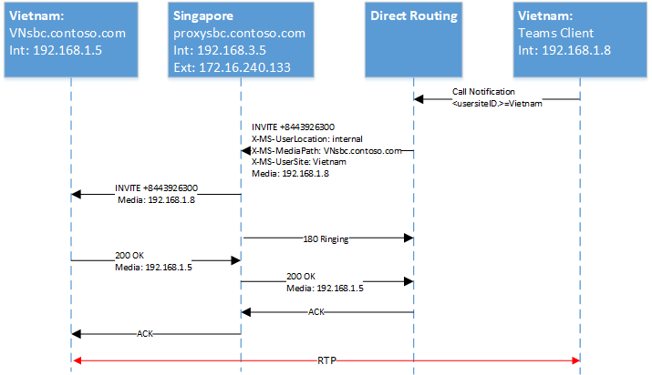

# <a name="configure-local-media-optimization-for-direct-routing"></a>직접 라우팅에 대 한 로컬 미디어 최적화 구성

로컬 미디어 최적화 구성은 위치 기반 라우팅과 동적 비상 전화와 같이 다른 클라우드 음성 기능에 공통적으로 사용 되는 네트워크 설정을 기반으로 합니다. 네트워크 지역, 네트워크 사이트, 네트워크 서브넷 및 신뢰할 수 있는 IP 주소에 대 한 자세한 내용은 [클라우드 음성 기능에 대 한 네트워크 설정을](cloud-voice-network-settings.md)참조 하세요.

로컬 미디어 최적화를 구성 하기 전에 [직접 라우팅에 대 한 로컬 미디어 최적화](direct-routing-media-optimization.md)를 참조 하세요.  

로컬 미디어 최적화를 구성 하려면 다음 단계를 수행 해야 합니다. 팀 관리 센터 또는 PowerShell을 사용할 수 있습니다. 자세한 내용은 [네트워크 토폴로지 관리](manage-your-network-topology.md)를 참조 하세요.

1. 사용자 및 SBC 사이트를 구성 합니다 (이 문서에서 설명).
2. SBC 공급 업체 사양에 따라 로컬 미디어 최적화를 위해 SBCs를 구성 합니다.

다음 다이어그램에는이 문서의 예제에 사용 된 네트워크 설정이 나와 있습니다.


## <a name="configure-the-user-and-the-sbc-sites"></a>사용자 및 SBC 사이트 구성

사용자 및 SBC 사이트를 구성 하려면 다음이 필요 합니다.

1. [신뢰할 수 있는 외부 IP 주소를 관리](#manage-external-trusted-ip-addresses)합니다.  

2. 네트워크 지역, 네트워크 사이트 및 네트워크 서브넷을 구성 하 여 [네트워크 토폴로지를 정의](#define-the-network-topology) 합니다.

3. 사이트 (들)에 관련 모드 및 프록시 SBC 값을 사용 하 여 SBC를 할당 하 여 [가상 네트워크 토폴로지를 정의](#define-the-virtual-network-topology) 합니다.


## <a name="configure-sbcs-for-local-media-optimization-according-to-the-sbc-vendor-specification"></a>SBC 공급 업체 사양에 따라 로컬 미디어 최적화에 대 한 SBC 구성

이 문서에서는 Microsoft 구성 요소에 대 한 구성에 대해 설명 합니다. SBC 구성에 대 한 자세한 내용은 SBC 공급 업체 문서를 참조 하세요.

로컬 미디어 최적화는 다음 SBC 공급 업체에서 지원 됩니다.

| 공급 업체 | 지원부 |    소프트웨어 버전 |
|:------------|:-------|:-------| :-------|
| [오디오 코드](https://www.audiocodes.com/media/13253/connecting-audiocodes-sbc-to-microsoft-teams-direct-routing-enterprise-model-configuration-note.pdf) |    Mediant 500 SBC |   7.20 a. 256 | 
|            |  Mediant 800 SBC |   7.20 a. 256 | 
|            |  Mediant 2600 SBC |  7.20 a. 256 | 
|            |  Mediant 4000 SBC |  7.20 a. 256 | 
|            |  Mediant 1000B SBC | 7.20 a. 256 | 
|            |  Mediant 9000 SBC |  7.20 a. 256 | 
|            |  Mediant Virtual Edition SBC |   7.20 a. 256 | 
|            |  Mediant Cloud Edition SBC | 7.20 a. 256 |
| [리본 SBC 코어](https://support.sonus.net/display/ALLDOC/SBC+8.2+-+Configure+Local+Media+Optimization)  |  SBC 5110         | 8.2  |
|            |  SBC 5210         | 8.2  |
|            |  SBC 5400         | 8.2  |
|            |  SBC 7000         | 8.2  |
|            |  SBC SWe          | 8.2  |
| [TE-시스템](https://www.anynode.de/local_media_optimization/) |  anynode          | 4.0.1 + |
| [Oracle](https://www.oracle.com/industries/communications/enterprise-communications/session-border-controller/microsoft.html) | AP 1100 | 8.4.0.0.0 |
|        | AP 3900 | 8.4.0.0.0 |
|        | AP 4600 | 8.4.0.0.0 | 
|        | AP 6300 | 8.4.0.0.0 |
|        | AP 6350 | 8.4.0.0.0 | 
|        | VME     | 8.4.0.0.0 |


## <a name="manage-external-trusted-ip-addresses"></a>신뢰할 수 있는 외부 IP 주소 관리

외부 신뢰할 수 있는 Ip는 기업 네트워크의 인터넷 외부 Ip입니다. 이러한 IP는 microsoft 팀 클라이언트가 Microsoft 365에 연결할 때 사용 하는 IP 주소입니다. 사용자가 로컬 미디어 최적화를 사용 하는 각 사이트에 대해 이러한 외부 Ip를 추가 해야 합니다.

각 사이트에 대 한 공용 IP 주소를 추가 하려면 CsTenantTrustedIPAddress cmdlet을 사용 합니다. 테 넌 트에 대해 무제한의 신뢰 된 IP 주소를 정의할 수 있습니다. Microsoft 365에서 표시 되는 외부 Ip가 IPv4 및 IPv6 주소 모두 인 경우 두 가지 유형의 IP 주소를 모두 추가 해야 합니다. IPv4의 경우 mask 32를 사용 합니다. IPv6의 경우 마스크 128를 사용 합니다. Cmdlet에 다른 MaskBits를 지정 하 여 개별 외부 IP 주소와 외부 IP 서브넷을 모두 추가할 수 있습니다.

```
New-CsTenantTrustedIPAddress -IPAddress <External IP address> -MaskBits <Subnet bitmask> -Description <description>
```


신뢰할 수 있는 IP 주소를 추가 하는 예

```
New-CsTenantTrustedIPAddress -IPAddress 172.16.240.110 -MaskBits 32 -Description "Vietnam site trusted IP"
New-CsTenantTrustedIPAddress -IPAddress 172.16.240.120 -MaskBits 32 -Description "Indonesia site trusted IP"
New-CsTenantTrustedIPAddress -IPAddress 172.16.240.130 -MaskBits 32 -Description "Singapore site trusted IP"
```


## <a name="define-the-network-topology"></a>네트워크 토폴로지 정의

이 섹션에서는 네트워크 영역, 네트워크 사이트 및 네트워크 토폴로지의 네트워크 서브넷을 정의 하는 방법에 대해 설명 합니다.

모든 매개 변수는 대/소문자를 구분 하므로 설치 중에 사용 된 것과 동일한 대/소문자를 사용 하 고 있는지 확인 해야 합니다.  (예를 들어, \ \ \ \ \ \ \ \ "베트남" 및 "베트남"는 다른 사이트로 간주 됩니다.)

### <a name="define-network-regions"></a>네트워크 지역 정의

네트워크 지역을 정의 하려면 새-Csten앤틸리스 지역 cmdlet을 사용 합니다. 영역 Id 매개 변수는 영역의 지리를 나타내는 논리 이름이 며 종속성 또는 제한이 없습니다. CentralSite <site ID> 매개 변수는 선택 사항입니다.

```
New-CsTenantNetworkRegion -NetworkRegionID <region ID>  
```

다음 예에서는 APAC 라는 네트워크 지역을 만듭니다.

```
New-CsTenantNetworkRegion -NetworkRegionID "APAC"  
```

###  <a name="define-network-sites"></a>네트워크 사이트 정의

네트워크 사이트를 정의 하려면 새-Csten앤틸리스 Site cmdlet을 사용 합니다. 각 네트워크 사이트는 네트워크 지역과 연결 되어 있어야 합니다.

```
New-CsTenantNetworkSite -NetworkSiteID <site ID> -NetworkRegionID <region ID>
```

다음 예에서는 APAC 지역에 베트남, 인도네시아, 싱가포르의 세 가지 새 네트워크 사이트를 만듭니다.

```
New-CsTenantNetworkSite -NetworkSiteID "Vietnam" -NetworkRegionID "APAC"
New-CsTenantNetworkSite -NetworkSiteID "Indonesia" -NetworkRegionID "APAC"
New-CsTenantNetworkSite -NetworkSiteID "Singapore" -NetworkRegionID "APAC"
```

### <a name="define-network-subnets"></a>네트워크 서브넷 정의

네트워크 서브넷을 정의 하 고 네트워크 사이트에 연결 하려면 새-Csten앤틸리스 Networksubnet cmdlet을 사용 합니다. 각 네트워크 서브넷은 한 사이트에만 연결 될 수 있습니다. 

```
New-CsTenantNetworkSubnet -SubnetID <Subnet IP address> -MaskBits <Subnet bitmask> -NetworkSiteID <site ID>
```

다음 예에서는 세 개의 네트워크 서브넷을 정의 하 고이를 베트남, 인도네시아, 싱가포르의 세 가지 네트워크 사이트에 연결 합니다.

```
New-CsTenantNetworkSubnet -SubnetID 192.168.1.0 -MaskBits 24 -NetworkSiteID “Vietnam”
New-CsTenantNetworkSubnet -SubnetID 192.168.2.0 -MaskBits 24 -NetworkSiteID “Indonesia”
New-CsTenantNetworkSubnet -SubnetID 192.168.3.0 -MaskBits 24 -NetworkSiteID “Singapore”
```

## <a name="define-the-virtual-network-topology"></a>가상 네트워크 토폴로지 정의 

먼저 테 넌 트 관리자가 새 CsOnlinePSTNGateway cmdlet을 사용 하 여 관련 SBC 각각에 대해 새 SBC 구성을 만듭니다.
테 넌 트 관리자는 CsOnlinePSTNGateway cmdlet을 사용 하 여 PSTN 게이트웨이 개체에 대 한 네트워크 사이트를 지정 하 여 가상 네트워크 토폴로지를 정의 합니다.

```
PS C:\> Set-CsOnlinePSTNGateway -Identity <Identity> -GatewaySiteID <site ID> -MediaBypass <true/false> -BypassMode <Always/OnlyForLocalUsers> -ProxySBC  <proxy SBC FQDN or $null>
```

다음 사항에 유의 하세요. 
   - 고객에 게 단일 SBC가 있는 경우-ProxySBC 매개 변수는 필수 $null 또는 SBC FQDN 값 (중앙 집중화 된 trunks 시나리오의 중앙 SBC) 이어야 합니다.
   - MediaBypass 매개 변수는 로컬 미디어 최적화를 지원 하기 위해 $true으로 설정 해야 합니다.
   - SBC에-BypassMode 매개 변수가 설정 되어 있지 않은 경우에는 X MS 헤더가 전송 되지 않습니다. 
   - 모든 매개 변수는 대/소문자를 구분 하므로 설치 중에 사용 된 것과 동일한 대/소문자를 사용 하 고 있는지 확인 해야 합니다.  (예를 들어, \ \ \ \ \ \ \ \ "베트남" 및 "베트남"는 다른 사이트로 간주 됩니다.)

다음 예에서는 네트워크 사이트에 SBCs 세 개를 추가 합니다 (모드를 사용 하는 APAC 지역에서 베트남, 인도네시아, 싱가포르에는 항상 bypass).

```
Set-CSOnlinePSTNGateway -Identity “proxysbc.contoso.com” -GatewaySiteID “Singapore” -MediaBypass $true -BypassMode “Always” -ProxySBC $null

Set-CSOnlinePSTNGateway -Identity “VNsbc.contoso.com” -GatewaySiteID “Vietnam” -MediaBypass $true -BypassMode “Always” -ProxySBC “proxysbc.contoso.com”

Set-CSOnlinePSTNGateway -Identity “IDsbc.contoso.com” -GatewaySiteID “Indonesia” -MediaBypass $true -BypassMode “Always” -ProxySBC “proxysbc.contoso.com”
```

참고: 로컬 미디어 최적화 및 LBR (위치 기반 라우팅)가 동시에 구성 되는 경우에도 중단 되지 않는 작업을 수행 하려면 각 다운스트림 SBC에 대해 $true에 대해 routing Sitelbrenabled 매개 변수를 설정 하 여 LBR에 대해 다운스트림 SBCs를 사용 하도록 설정 해야 합니다. 프록시 SBC에는이 설정이 필수가 아닙니다.

직접적인 라우팅에는 위의 정보에 따라 다음 표에 표시 된 대로 SIP 초대 및 재 초대에 대 한 세 개의 독점 SIP 헤더가 포함 됩니다.

BypassMode가 정의 된 경우 초대 및 재 초대에 대 한 직접 라우팅에 소개 되는 X MS 헤더:

| 헤더 이름 | 최대값 | 설명 | 
|:------------|:-------|:-------|
| X-s i m 사용자 위치 | 내부/외부 | 사용자가 내부 인지 외부 인지 여부를 나타냅니다. |
| 요청-URI 초대 sip: + 84439263000@VNsbc.contoso.com SIP/2.0 | SBC FQDN | SBC가 직접 라우팅에 직접 연결 되지 않은 경우에도 통화를 대상으로 하는 FQDN입니다. |
| X-MS-MediaPath | 예: proxysbc.contoso.com, VNsbc.contoso.com | 사용자와 대상 SBC 사이의 미디어 경로에 사용 해야 하는 SBCs의 순서입니다. 최종 SBC는 항상 마지막입니다. |
| X-MS UserSite | usersiteID | 테 넌 트 관리자가 정의한 문자열 |

## <a name="call-flows"></a>통화 흐름 

다음은 두 가지 모드의 통화 흐름을 보여 줍니다.

- [항상 무시](#always-bypass-mode)
- [로컬 사용자 용](#only-for-local-users-mode)

### <a name="always-bypass-mode"></a>항상 무시 모드

가장 간단 하 게 구성 하는 옵션은 항상 무시 모드입니다. 모든 사이트에서 모든 SBCs에 연결할 수 있는 경우 테 넌 트 관리자가 모든 사용자 및 SBCs에 대해 단일 사이트를 구성할 수 있습니다.

예제는 다음과 같은 시나리오에 대해 항상 건너뛰기 모드를 보여 줍니다.

- [아웃 바운드 통화와 사용자가 SBC와 같은 위치에 있습니다.](#outbound-calls-and-the-user-is-in-the-same-location-as-the-sbc-with-always-bypass)
- [사용자가 SBC와 같은 위치에 있는 인바운드 통화](#inbound-calls-and-the-user-is-in-the-same-location-as-the-sbc-with-always-bypass)
- [아웃 바운드 통화 및 외부 사용자](#outbound-calls-and-the-user-is-external-with-always-bypass)
- [인바운드 전화 및 사용자가 외부에 있습니다.](#inbound-calls-and-the-user-is-external-with-always-bypass)

다음 표에는 예제에 사용 되는 FQDN 및 IP 주소가 나와 있습니다.

| Q | SBC 외부 IP 주소 | SBC 내부 IP 주소 | 내부 서브넷 | 위치 | 외부 NAT (신뢰할 수 있는 IP) |
|:------------|:-------|:-------|:-------|:-------|:-------|
| VNsbc.contoso.com | 없음 | 192.168.1.5 | 192.168.1.0/24 | 베트남 | 172.16.240.110 |
| IDsbc.contoso.com | 없음 | 192.168.2.5 | 192.168.2.0/24 | 인도네시아 | 172.16.240.120 |
| proxysbc.contoso.com | 172.16.240.133 | 192.168.3.5 | 192.168.3.0/24 | 싱가포르 | 172.16.240.130 |


#### <a name="outbound-calls-and-the-user-is-in-the-same-location-as-the-sbc-with-always-bypass"></a>사용자가 항상 우회 하는 SBC와 같은 위치에 있는 아웃 바운드 통화

| 모드 |    사용자 |  위치 |  통화 방향 |
|:------------|:-------|:-------| :-------|
| AlwaysBypass |    내부용 |  SBC와 동일한 사이트 |  위한 |

다음 표에서는 최종 사용자 구성 및 작업을 보여 줍니다.

| 사용자의 실제 위치| 사용자가/에서 전화를 걸거나 받을 수 있습니다. | 사용자 전화 번호  | 온라인 음성 라우팅 정책 | SBC에 대해 구성 된 모드 |
|:------------|:-------|:-------|:-------|:-------|
| 베트남 | + 84 4 3926 3000 | + 84 4 5555 5555   | 우선 순위 1: ^ \+ 84 (\d {9} ) $-VNsbc.contoso.com <br> 우선 순위 2:. *-proxysbc.contoso.com   | VNsbc.contoso.com – 항상 무시 <br> proxysbc.contoso.com – 항상 무시


다음 다이어그램은 항상 우회 모드를 사용 하는 아웃 바운드 호출에 대 한 SIP 사다리와 SBC와 같은 위치에 있는 사용자를 보여 줍니다.


다음 표에는 다이렉트 라우팅이 보내는 X MS 헤더가 나와 있습니다.

| 매개 변수 | 볼 |
|:------------|:-------|
| 초대 + 8443926300@VNsbc.contoso.com | 온라인 음성 라우팅 정책에 정의 된 SBC의 대상 FQDN이 요청 URI로 전송 됩니다. | 
| X-MS UserLocation: internal | 해당 사용자가 회사 네트워크 내에 있는 것으로 표시 된 필드 |
| X-MS-MediaPath: VNsbc.contoso.com |   클라이언트가 대상 SBC로 트래버스 해야 하는 SBC를 지정 합니다. 이 경우 항상 Bypass이 고 클라이언트는 헤더의 유일한 이름으로 전송 되는 대상 이름입니다. | 
|X-MS UserSite: 베트남 |   사용자가 위치한 사이트 내에 표시 되는 필드입니다. |


#### <a name="inbound-calls-and-the-user-is-in-the-same-location-as-the-sbc-with-always-bypass"></a>사용자가 항상 우회 하는 SBC와 같은 위치에 있는 인바운드 통화

| 모드 |    사용자 |  위치 |  통화 방향 |
|:------------|:-------|:-------|:-------|:-------|
| AlwaysBypass |    내부용 | SBC와 동일한 사이트 | Ipsec |


인바운드 호출에서는 사용자의 위치를 알 수 없으며 SBC는 사용자의 위치를 추측해 야 합니다. Guess가 올바르지 않으면 재 초대를 받아야 합니다. 이 케이스는 사용자가 내부이 고 미디어가 직접 흐를 수 있으며 추가 작업이 필요 하지 않은 것으로 간주 됩니다 (재 초대).
직접 라우팅 서비스에 연결 된 SBC는 레코드 경로 및 연락처 필드를 제공 하 여 원래 SBC 위치를 보고 합니다. 이러한 필드를 기반으로 미디어 경로는 직접 라우팅에서 계산 됩니다.

참고: 사용자가 여러 끝점을 사용할 수 있는 경우 183의 지원은 불가능 합니다. 이 경우에는 직접적인 라우팅이 항상 180 벨을 사용 합니다. 

다음 다이어그램에서는 AlwaysBypass mode를 사용 하 여 인바운드 호출에 대 한 SIP 사다리를 보여 주고 사용자가 SBC와 같은 위치에 있습니다.


#### <a name="outbound-calls-and-the-user-is-external-with-always-bypass"></a>아웃 바운드 통화 및 사용자가 항상 우회로 외부에 있는 경우

| 모드 |    사용자 |  사이트 |  통화 방향
|:------------|:-------|:-------|:-------|
AlwaysBypass |  내부 |  해당 없음 | 위한 |


다음 다이어그램에서는 AlwaysBypass 모드를 사용 하는 아웃 바운드 호출에 대 한 SIP 사다리를 보여 주고 사용자가 외부에 있습니다.


다음 표에는 다이렉트 라우팅 서비스에서 보낸 X-MS 헤더가 나와 있습니다.

| 매개 변수 |   볼 |
|:------------|:-------|
|초대 + 8443926300@VNsbc.contoso.com | 온라인 음성 라우팅 정책에 정의 된 SBC의 대상 FQDN은 요청 URI로 전송 됩니다.|
| X-MS UserLocation: 외부 | 해당 사용자가 회사 네트워크 외부에 있음을 표시 한 필드 |
| X-MS-MediaPath: proxysbc.contoso.com, VNsbc.contoso.com    | 클라이언트가 대상 SBC로 트래버스 해야 하는 SBC를 지정 합니다. 이 경우 항상 우회 되 고 클라이언트가 외부에 있는 것입니다. |

#### <a name="inbound-calls-and-the-user-is-external-with-always-bypass"></a>인바운드 통화 및 사용자가 항상 우회로 외부에 있는 경우

| 모드 | 사용자 | 사이트 |  통화 방향 |
|:------------|:-------|:-------|:-------|
AlwaysBypass |  내부 |  해당 없음 |   Ipsec |

인바운드 호출의 경우 직접 라우팅에 연결 된 SBC는 다시 초대를 보내야 합니다 (기본적으로 사용자의 위치가 외부에 있는 경우 로컬 미디어 후보가 항상 제공 됩니다).  X-MediaPath는 Record 경로 및 지정 된 SBC 사용자를 기준으로 계산 됩니다.

다음 다이어그램에서는 AlwaysBypass 모드를 사용 하는 인바운드 호출에 대 한 SIP 사다리를 보여 주고 사용자가 외부에 있습니다.


### <a name="only-for-local-users-mode"></a>로컬 사용자 모드에만 해당

대상 SBC의 로컬 미디어 후보는 사용자가 SBC와 같은 위치에 있는 경우에만 제공 됩니다. 다른 모든 경우 미디어는 프록시 SBC의 내부 또는 외부 IP를 통해 전달 됩니다.

다음과 같은 시나리오에 대해 설명 합니다.

- [아웃 바운드 통화와 사용자가 SBC와 같은 위치에 있습니다.](#outbound-calls-and-the-user-is-in-the-same-location-as-the-sbc-with-only-for-local-users)
- [사용자가 SBC와 같은 위치에 있는 인바운드 통화](#inbound-calls-and-the-user-is-in-the-same-location-as-the-sbc-with-only-for-local-users)
- [사용자가 SBC와 같은 위치에 있지 않지만 회사 네트워크에 있습니다.](#user-is-not-at-the-same-location-as-the-sbc-but-is-in-the-corporate-network-with-only-for-local-users)
- [인바운드 통화와 사용자는 내부용 이지만 SBC와 같은 위치에 있지 않습니다.](#inbound-call-and-the-user-is-internal-but-is-not-at-the-same-location-as-the-sbc-with-only-for-local-users)

다음 표에는 최종 사용자 구성 및 작업이 나와 있습니다.

| 사용자의 실제 위치 |  사용자가/에서 전화를 걸거나 받을 수 있습니다. |  사용자 전화 번호 | 온라인 음성 라우팅 정책 |   SBC에 대해 구성 된 모드 |
|:------------|:-------|:-------|:-------|:-------|
| 베트남 | + 84 4 3926 3000 |  + 84 4 5555 5555 | 우선 순위 1: ^ \+ 84 (\d {9} ) $-VNsbc.contoso.com <br> 우선 순위 2:. *-proxysbc.contoso.com | VNsbc.contoso.com-모든 사용자에 게 Proxysbc.contoso.com – 항상 우회 |

#### <a name="outbound-calls-and-the-user-is-in-the-same-location-as-the-sbc-with-only-for-local-users"></a>사용자가 지역 사용자 용 으로만 SBC와 같은 위치에 있는 경우의 아웃 바운드 통화

| 모드 | 사용자 | 사이트 | 통화 방향 |
|:------------|:-------|:-------|:-------|
| 유일한 Forlocalusers |   내부용 |SBC와 같음   | 위한 |

다음 다이어그램은 ' 없음 ' Localusers 모드를 사용 하는 아웃 바운드 호출을 보여 주며 사용자는 SBC와 같은 위치에 있습니다. 이는 [사용자가 SBC와 같은 위치에 있을 때 나가는 호출](#outbound-calls-and-the-user-is-in-the-same-location-as-the-sbc-with-always-bypass)에 표시 되는 것과 동일한 흐름입니다.




#### <a name="inbound-calls-and-the-user-is-in-the-same-location-as-the-sbc-with-only-for-local-users"></a>사용자가 지역 사용자 용 으로만 SBC와 같은 위치에 있는 경우의 인바운드 통화

| 모드 | 사용자 | 사이트 | 통화 방향 |
|:------------|:-------|:-------|:-------|
| 유일한 Forlocalusers |   내부용 | SBC와 같음 | Ipsec |

다음 다이어그램은이 모드를 사용 하는 인바운드 호출을 보여 주며 사용자는 SBC와 같은 위치에 있습니다. 이는 [사용자가 SBC와 같은 위치에 있을 때 인바운드 호출](#inbound-calls-and-the-user-is-in-the-same-location-as-the-sbc-with-always-bypass)에 표시 되는 것과 동일한 흐름입니다.


#### <a name="user-is-not-at-the-same-location-as-the-sbc-but-is-in-the-corporate-network-with-only-for-local-users"></a>사용자가 SBC와 같은 위치에 있지 않지만 로컬 사용자 용으로 회사 네트워크에 있습니다.

| 모드 | 사용자 | 사이트 |통화 방향 |
|:------------|:-------|:-------|:-------|
| 유일한 Forlocalusers  | 내부용 |   SBC와 다름 | 위한 |

직접 라우팅은 SBC에 구성 된 사용자 및 모드의 보고 된 위치를 기반으로 X-MediaPath를 계산 합니다.


다음 다이어그램에는 없음 Forlocalusers 모드를 사용 하는 아웃 바운드 호출과 SBC와 같은 위치에 있지 않은 내부 사용자가 표시 됩니다.


#### <a name="inbound-call-and-the-user-is-internal-but-is-not-at-the-same-location-as-the-sbc-with-only-for-local-users"></a>인바운드 통화와 사용자는 내부용 이지만 지역 사용자의 경우 SBC와 같은 위치에 있지 않습니다.

| 모드 |    사용자 |  사이트 |  통화 방향 |
|:------------|:-------|:-------|:-------|
| 유일한 Forlocalusers | 내부용 |    SBC와 다름 |    Ipsec |

다음 다이어그램은 사용자 이름에는 없음 Forlocaluser 모드를 사용 하는 인바운드 호출과 SBC와 같은 위치에 있지 않은 내부 사용자를 보여 줍니다.


