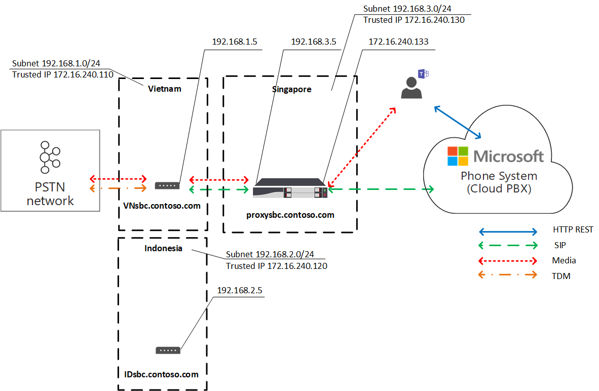
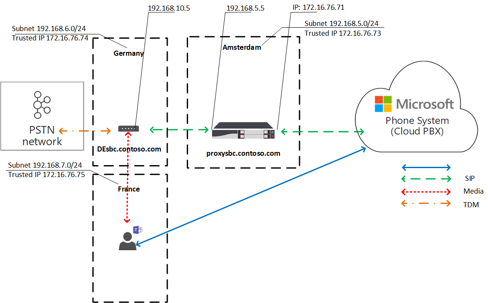
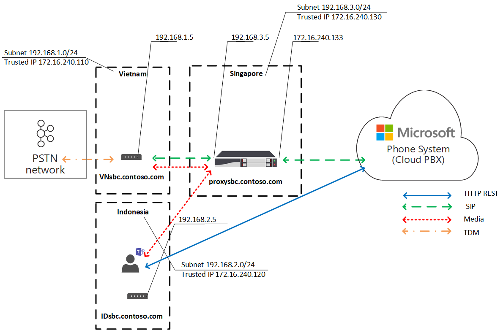

# 직접 라우팅을 위한 로컬 미디어 최적화Local Media Optimization for Direct Routing

PSTN(공용 전환 전화 네트워크) 음성은 음성 품질에 대한 기대가 높은 비즈니스 중요 애플리케이션으로 간주됩니다.Public Switched Telephone Network (PSTN) voice is considered a business-critical application with high expectations for voice quality. 직접 라우팅을 사용하면 전 세계 다양한 기업에 대한 다양한 네트워크 토폴로지 및 로컬 전화 통신 설정을 수용할 수 있도록 미디어 트래픽 흐름을 제어할 수 있습니다.Direct Routing lets you control media traffic flows to accommodate a multitude of network topologies and local telephony setups for various enterprises all over the world. 

직접 라우팅을 위한 로컬 미디어 최적화를 사용하면 다음을 통해 음성 품질을 관리할 수 있습니다.Local Media Optimization for Direct Routing lets you manage voice quality by:

-   Teams 클라이언트와 SBC(고객 세션 테두리 컨트롤러) 간에 미디어 트래픽 흐름을 제어합니다.Controlling how media traffic flows between the Teams clients and the customer Session Border Controllers (SBCs).
-   회사 네트워크 서브넷의 경계 내에서 미디어를 로컬로 유지Keeping media local within the boundaries of corporate network subnets.
-   SBC가 개인 IP가 있는 회사 방화벽 뒤에 있으며 Microsoft에 직접 표시되지 않는 경우에도 Teams 클라이언트와 SBC 간에 미디어 스트림을 허용합니다.Allowing media streams between the Teams clients and the SBCs even if the SBCs are behind corporate firewalls with private IPs and not visible to Microsoft directly.

로컬 미디어 최적화는 다음 두 가지 시나리오를 지원합니다.Local Media Optimization supports two scenarios:

- SIP(기본 세션 시작 프로토콜)에 연결된 중앙 집중식 SBC를 통해 모든 로컬 트렁크의 중앙 집중화-회사의 모든 로컬 지점에 전화 통신 서비스를 제공합니다.Centralization of all local trunks through a centralized SBC connected to the main Session Initiation Protocol (SIP)trunk--providing telephony services to all local branch offices of the company.

-   SBCs의 가상 네트워크 토폴로지 구축 - 로컬 지점의 SBC가 외부 IP 주소를 통해 Microsoft Phone System에 표시되는 중앙 집중식 프록시 SBC에 연결되고 통신합니다.Building a virtual network topology of SBCs--where the SBCs in the local branch offices are connected to a centralized proxy SBC that is visible to, and communicating with, Microsoft Phone System through its external IP address. 가상 네트워크 토폴로지에서 다운스트림 SBC는 내부 IP를 통해 통신하고 있으며 Phone System에 직접 표시되지 않습니다.In a virtual network topology, downstream SBCs are communicating through internal IPs and are not directly visible to Phone System.

이 문서에서는 기능 기능 및 고객 시나리오 및 솔루션을 설명합니다.This article describes feature functionality, and customer scenarios and solutions. 구성에 대한 자세한 내용은 로컬 미디어 최적화 [구성을 참조합니다.](direct-routing-media-optimization-configure.md)For details on configuration, see [Configure Local Media Optimization](direct-routing-media-optimization-configure.md). 

  > [!NOTE]
  > 인트라넷의 경계 내에서 미디어를 로컬로 유지하려는 경우 로컬 미디어 최적화를 권장합니다.If you want to keep media local within the boundaries of your intranet, Local Media Optimization is recommended. 미디어 우회가 이미 있으며 SBC의 공용 IP 주소만 사용하는 경우 로컬 미디어 최적화로 이동해야 하는 것은 아닙니다.If you already have Media Bypass and you use only the public IP addresses of your SBCs, it is not mandatory to move to Local Media Optimization. Media Bypass를 계속 사용할 수 있습니다.You can continue to use Media Bypass. 자세한 내용은 미디어 [우회 계획 을 참조하세요.](direct-routing-plan-media-bypass.md)For more information, see [Plan Media Bypass](direct-routing-plan-media-bypass.md).

## 지원되는 고객 시나리오Supported customer scenarios

이 토론에서는 Contoso가 다음과 같이 전 세계 여러 비즈니스를 실행하고 있는 것으로 가정합니다.For this discussion, assume that Contoso runs multiple businesses across the globe as follows. (유럽 및 APAC 지역은 예제로만 사용됩니다.(Note that Europe and APAC regions are used as examples only. 회사에 비슷한 요구 사항이 있는 여러 지역이 있을 수 있습니다.)A company might have several different regions with similar requirements.)
 
- **유럽에서는** Contoso에 약 30개 국가에 사무실이 있습니다.**In Europe**, Contoso has offices in approximately 30 countries. 각 사무실에는 자체 PBX(Private Branch Exchange)가 있습니다.Each office has its own Private Branch Exchange (PBX). 

  Contoso는 모든 30개 유럽 사무소에 대해 한 위치에서 트렁크를 중앙 집중화하는 옵션을 제공했습니다.Contoso was offered an option to centralize the trunks in one location--Amsterdam--for all 30 European offices. Contoso는 암스테르담에 SBC를 배포하고 중앙 집중식 위치를 통해 호출을 실행할 수 있는 충분한 대역폭을 제공하고, 중앙 SIP 트렁크를 중앙 집중식 위치에 연결하고 암스테르담의 모든 유럽 위치 서비스를 시작했습니다.Contoso deployed the SBC in Amsterdam, provided enough bandwidth to run calls through the centralized location, connected a central SIP trunk to the centralized location, and started serving all European locations from Amsterdam. 

- **APAC 지역에서** Contoso에는 여러 국가에 여러 사무실이 있습니다.**In the APAC region**, Contoso has multiple offices in different countries. 

  많은 국가에서는 여전히 로컬 지점에 TDM(시간 분할 멀티플렉스) 트렁크가 있습니다.In many countries, the company still has time-division multiplexing (TDM) trunks in local branch offices. TDM 트렁크의 중앙 집중화는 APAC 지역에서는 옵션이 아니기 때문에 SIP로 전환할 수 없습니다.Centralization of the TDM trunks is not an option in the APAC region, so switching to SIP is not possible. 수백 개의 게이트웨이(SBC)가 있는 APAC 지역에 50개 이상의 Contoso 지점이 있는 것으로 가정합니다.Assume there are more than fifty Contoso branch offices across the APAC region with hundreds of gateways (SBCs). 이 시나리오에서는 공용 IP 주소 및/또는 로컬 인터넷 중단으로 인하여 직접 라우팅 인터페이스에 대한 모든 게이트웨이를 페어링할 수 없습니다.In this scenario, it is not possible to pair all gateways to the Direct Routing interface because of a lack of public IP addresses and/or local internet breakouts. 또한 일부 국가에서는 로컬 PSTN 네트워크 연결 없이는 이행할 수 없는 규정 요구 사항을 부과합니다.In addition, some countries impose regulatory requirements that cannot be fulfilled without having local PSTN network connectivity.

Contoso는 비즈니스 요구 사항에 따라 직접 라우팅을 위한 로컬 미디어 최적화를 통해 두 가지 솔루션을 구현했습니다.Based on their business requirements, Contoso implemented two solutions with Local Media Optimization for Direct Routing:

- **유럽에서는** 모든 트렁크가 중앙 집중식으로 설정됩니다. 사용자 위치에 따라 중앙 SBC와 사용자 간에 미디어 흐름이 있습니다.**In Europe**, all trunks are centralized and media flows between the central SBC and the users, based on the user location. 

  - 사용자가 회사 네트워크의 로컬 서브넷에 연결되어 있는 경우(즉, 사용자는 내부), 중앙 SBC의 내부 IP와 사용자의 Teams 클라이언트 간에 미디어가 흐르게 됩니다.If a user is connected to the local subnet of a corporate network (that is, the user is internal), media flows between the internal IP of the central SBC and the user’s Teams client. 
  
  - 사용자가 회사 네트워크의 경계를 밖에 있는 경우(예: 사용자가 공용 무선 인터넷 연결을 사용하는 경우) 사용자는 외부로 간주됩니다.If a user is outside the boundaries of the corporate network--for example, if the user is using a public wireless Internet connection--then the user is considered to be external. 이 경우 미디어는 중앙 SBC의 외부 IP와 Teams 클라이언트 간에 흐르게 됩니다.In this case, the media flows between the external IP of the central SBC and the Teams client.

- **APAC** 지역에서 중앙 집중식 프록시 SBC는 Microsoft Direct 라우팅과 페어링되어 직접 라우팅 인터페이스와 로컬 지점의 다운스트림 SBC 간에 미디어를 지시합니다.**In the APAC region**, a centralized proxy SBC is paired to Microsoft Direct Routing, which directs media between the Direct Routing interface and the downstream SBCs in local branch offices. 

  로컬 지점의 다운스트림 SBC는 APAC의 직접 라우팅에 직접 표시되지 않지만 microsoft Phone System 내에서 가상 네트워크 토폴로지 Set-CSOnlinePSTNGateway cmdlet을 사용하여 페어링됩니다.The downstream SBCs in the local branch offices are not directly visible to Direct Routing in APAC, but they are paired by using the Set-CSOnlinePSTNGateway cmdlet to create a virtual network topology within Microsoft Phone System. 미디어는 가능하면 항상 로컬로 유지됩니다.Media always stays local when possible. 외부 사용자에게는 Teams 클라이언트와 프록시 SBC의 공용 IP 간에 미디어가 흐르고 있습니다.External users have media flowing between the Teams client and the public IP of the proxy SBC.

## 중앙 집중식 트렁크가 있는 중앙 SBCCentral SBC with centralized trunks

연결된 중앙 집중식 SIP 트렁크가 있는 단일 중앙 SBC를 통해 모든 로컬 지점에 PSTN 서비스가 제공되는 솔루션을 빌드하려면 Contoso 테넌트 관리자는 하나의 SBC(centralsbc.contoso.com)를 서비스에 페어링합니다. SBC에는 중앙 집중식 SIP 트렁크가 연결되어 있습니다.To build a solution where PSTN services are provided to all local branch offices through a single central SBC with a connected centralized SIP trunk, the Contoso tenant administrator pairs one SBC (centralsbc.contoso.com) to the service; the SBC has a centralized SIP trunk connected to it. 

- 사용자가 회사의 내부 네트워크에 있는 경우 SBC는 미디어용 SBC의 내부 IP를 제공합니다.When a user is in the internal network of the company, the SBC provides the internal IP of the SBC for media. 

- 사용자가 회사 네트워크 외부에 있는 경우 SBC는 SBC의 외부(공용) IP를 제공합니다.When a user is outside of the corporate network, the SBC provides the external (public) IP of the SBC.

참고: 예제, 테이블 또는 다이어그램 내의 모든 값은 그림 용도로만 표시됩니다.Note: All values within examples, tables, or diagrams are presented for illustration purposes only.

표 1.Table 1. SBC에 대한 네트워크 매개 변수 예제Example network parameters for SBCs 

| 위치Location | SBC FQDNSBC FQDN | 내부 서브넷Internal subnet | 외부 NAT(신뢰할 수 있는 IP)External NAT (Trusted IP) | SBC 외부 IP 주소SBC external IP address | SBC 내부 IP 주소SBC internal IP address |
|:------------|:-------|:-------|:-------|:-------|:-------|
| 암스테르담Amsterdam | centralsbc.contoso.comcentralsbc.contoso.com | 192.168.5.0/24192.168.5.0/24 | 172.16.76.73172.16.76.73 | 172.16.76.71172.16.76.71 | 192.168.5.5192.168.5.5 |
| 독일Germany | 배포되지 않습니다.Not deployed | 192.168.6.0/24192.168.6.0/24 | 172.16.76.74172.16.76.74 | 배포되지 않습니다.Not deployed |  배포되지 않습니다.Not deployed |
| 프랑스France | 배포되지 않습니다.Not deployed | 192.168.7.0/24192.168.7.0/24 | 172.16.76.75172.16.76.75 | 배포되지 않습니다.Not deployed |  배포되지 않습니다.Not deployed ||||

### 내부 사용자Internal user

다음 다이어그램은 사용자가 사용자의 홈 분기 사무실 또는 사이트의 회사 네트워크에 연결되어 있는 경우 트래픽 흐름을 보여줍니다.The following diagram shows the traffic flow when a user is connected to the corporate network in the user’s home branch office or site. 

프레미스 동안 사용자는 독일의 로컬 지점에 할당됩니다.While on premises, the user is assigned to the local branch office in Germany. 사용자는 Teams를 통해 직접 라우팅 전화를 걸 수 있습니다.The user makes a Direct Routing phone call through Teams.

- 사용자의 Teams 클라이언트는 REST API를 통해 직접 Phone System에 통신하지만 통화 중에 생성된 미디어는 중앙 SBC의 내부 IP 주소로 전달됩니다.The user’s Teams client communicates to Phone System directly through the REST API, but the media generated during the call flows to the central SBC’s internal IP address. 

- SBC는 휴대폰 시스템 및 연결된 PSTN 네트워크로 흐름을 리디렉션합니다.The SBC redirects the flow to Phone System and the connected PSTN network. 

- 중앙 SBC는 외부 IP 주소만 통해 Phone System에 표시됩니다.The central SBC is visible to Phone System through the external IP address only. 

다이어그램 1.Diagram 1. 사용자가 중앙 집중식 SBC와 연결된 중앙 집중식 SIP 트렁크를 통해 '홈' 사이트에 있는 경우 트래픽 흐름Traffic flow when the user is in the ‘home’ site with a centralized SBC and with a connected centralized SIP Trunk

### 외부 사용자External user

다음 다이어그램은 사용자가 프레미스에 있지 않은 회사 네트워크에 연결되어 있지 않은 경우 트래픽 흐름을 보여 주며, 즉 사용자의 디바이스가 모바일 디바이스 또는 공용 Wi-Fi를 통해 인터넷에 연결됩니다.The following diagram shows the traffic flow when a user is not on premises and is not connected to the corporate network (that is, the user’s device is connected to the Internet through a mobile device or public Wi-Fi). 사용자는 Teams를 통해 직접 라우팅 전화를 걸 수 있습니다.The user makes a Direct Routing phone call through Teams:

- 사용자의 Teams 클라이언트는 REST API를 통해 직접 Phone System에 통신하지만, 이 경우 호출 중에 생성된 미디어가 중앙 SBC의 외부 IP 주소로 전달됩니다.The user’s Teams client communicates to Phone System directly through the REST API, but, in this case, the media generated during the call flows to the central SBC’s external IP address. 

- SBC는 휴대폰 시스템 및 연결된 PSTN 네트워크로 흐름을 리디렉션합니다.The SBC redirects the flow to Phone System and the connected PSTN network. 

- 중앙 SBC는 외부 IP 주소만 통해 Phone System에 표시됩니다.The central SBC is visible to Phone System through the external IP address only. 

이 경우 동작은 사용자가 독일의 지사에 로컬인지 또는 다른 지점에 있는지 여부와 유사합니다.In this case, the behavior is similar whether the user is local to the branch office in Germany or to any other branch office. 사용자가 회사 네트워크의 경계를 밖에 있기 때문에 사용자는 외부로 간주됩니다.The user is considered external because the user is outside the boundaries of the corporate network.

다이어그램 2.Diagram 2. 사용자가 중앙 집중식 SBC와 연결된 중앙 집중식 SIP 트렁크를 통해 외부에 있는 트래픽 흐름Traffic flow when the user is external with a centralized SBC and with a connected centralized SIP Trunk

## 연결된 다운스트림 SBC가 있는 프록시 SBCProxy SBC with connected downstream SBCs

TDM 트렁크의 중앙 집중화가 옵션이 아닌 APAC 지역의 모든 로컬 지점에서 PSTN 서비스가 제공되는 솔루션을 빌드하기 위해 Contoso 관리자는 프록시 SBC(proxysbc.contoso.com)를 직접 라우팅 서비스에 페어링합니다.To build a solution where PSTN services are provided in all local branch offices in the APAC region where centralization of the TDM trunks is not an option, the Contoso administrator pairs one SBC (proxysbc.contoso.com), also called the proxy SBC, to the Direct Routing service. 

그 후 Contoso 관리자는 프록시 SBC를 통해 도달할 수 있는 일부 다운스트림 SBC를 proxysbc.contoso.com.Afterwards, the Contoso administrator adds some downstream SBCs indicating that they can be reached through the proxy SBC proxysbc.contoso.com. 다운스트림 SBC에는 공용 IPS가 없습니다. 그러나 음성 경로에 할당할 수 있습니다.Downstream SBCs do not have public IPs, however, they can be assigned to voice routes. 아래 표에는 네트워크 매개 변수 및 구성 예제가 표시됩니다.The table below shows example network parameters and configuration.

사용자가 다운스트림 SBC가 있는 로컬 지점에 있는 경우 미디어 트래픽은 사용자와 로컬 다운스트림 SBC 간에 직접 흐르게 됩니다.When a user is in the local branch office where the downstream SBC is located, the media traffic flows between the user and the local downstream SBC directly. 사용자가 사무실 외부(공용 인터넷)인 경우 미디어는 사용자에서 프록시 SBC의 공용 IP로 흐르며, 이를 관련 다운스트림 SBC로 프록시합니다.If a user is outside of the office (on a public internet), the media flows from the user to the public IP of the Proxy SBC, which proxies it to the relevant downstream SBC(s).

표 2.Table 2. SBC 네트워크 정보 예제Example SBC network information

| 위치Location | SBC FQDNSBC FQDN | 내부 서브넷Internal subnet | 외부 NAT(신뢰할 수 있는 IP)External NAT (Trusted IP) | SBC 외부 IP 주소SBC external IP address  | SBC 내부 IP 주소SBC internal IP address |
|:------------|:-------|:-------|:-------|:-------|:-------|
| 베트남Vietnam | VNsbc.contoso.comVNsbc.contoso.com | 192.168.1.0/24192.168.1.0/24 | 172.16.240.110172.16.240.110 | 없음None |  192.168.1.5192.168.1.5 |
| 인도네시아Indonesia  | IDsbc.contoso.comIDsbc.contoso.com | 192.168.2.0/24192.168.2.0/24 | 172.16.240.120172.16.240.120 | 없음None |  192.168.2.5192.168.2.5 |
| 싱가포르Singapore | proxysbc.contoso.comproxysbc.contoso.com |   192.168.3.0/24192.168.3.0/24 | 172.16.240.130172.16.240.130 | 172.16.240.133172.16.240.133 | 192.168.3.5192.168.3.5 |

### 내부 사용자Internal user 

다음 다이어그램은 사용자가 APAC 지역의 사무실에 있는 경우 시나리오에 대한 높은 수준의 트래픽 흐름을 보여 줍니다.The following diagram shows the high-level traffic flow for the scenario when a user is inside the office in the APAC region. 베트남의 로컬 지점에 할당되어 있으며, 프레미스에 있는 사용자는 Teams를 통해 직접 라우팅 전화를 걸 수 있습니다.The user, who is assigned to a local branch office in Vietnam, and is on premises, makes a Direct Routing phone call through Teams. 

- 사용자의 Teams 클라이언트는 REST API를 통해 직접 전화 시스템과 통신하지만 호출 중에 생성된 미디어는 로컬 SBC의 내부 IP 주소로 전달됩니다.The user’s Teams client communicates with Phone System directly through the REST API, but media generated during the call flows to local SBC’s internal IP address.

- 로컬 SBC는 싱가포르의 프록시 SBC 및 연결된 로컬 PSTN 네트워크로 흐름을 리디렉션합니다.The local SBC redirects the flow to the proxy SBC in Singapore and to the connected local PSTN network.

-  프록시 SBC는 외부 IP 주소만 통해 Phone System에 표시되어 다운스트림 SBC(이 경우 베트남의 로컬 SBC)에서 Phone System으로 흐름을 라우팅합니다.The proxy SBC is visible to Phone System through the external IP address only and routes the flow from the downstream SBC (in this case the local SBC in Vietnam) to Phone System. 

- 로컬 지점의 다운스트림 SBC는 Phone System에 직접 표시되지 않지만 로컬 미디어 최적화를 설정하는 동안 Contoso 관리자가 정의한 가상 네트워크 토폴로지 내에 매핑됩니다.The downstream SBC in the local branch office is not visible to Phone System directly but is mapped within the virtual network topology that is defined by the Contoso administrator while setting up Local Media Optimization.

참고: 동작은 구성된 로컬 미디어 최적화 모드에 따라 로컬 사용자 및 로컬이 아닌 사용자에 대해 다를 수 있습니다.Note: The behavior might be different for local users and non-local users depending on the configured Local Media Optimization mode. 

가능한 모드 및 관련 동작에 대한 자세한 내용은 로컬 미디어 최적화 구성을 참조하세요.For more information on possible modes and relevant behavior, see Configure Local Media Optimization.

다이어그램 3.Diagram 3. 사용자가 프록시 SBC와 연결된 다운스트림 SBC를 사용하는 "홈" 네트워크에 있는 경우 트래픽 흐름Traffic flow when the user is in the “home” network with a proxy SBC and with connected downstream SBCs 

### 외부 사용자External user

다음 다이어그램은 사용자가 회사 네트워크 경계 외부에 있는 경우 트래픽 흐름을 보여줍니다.The following diagram shows the traffic flow when a user is outside of the corporate network boundaries. 사용자가 프레미스에 있지 않습니다(회사 네트워크의 경계 내에 있지 않습니다).The user is not on premises (is not within the boundaries of corporate network). 사용자는 Teams를 통해 베트남의 전화 번호로 직접 라우팅 전화를 걸 수 있습니다.The user makes a Direct Routing phone call through Teams to a phone number in Vietnam. 

- 사용자의 Teams 클라이언트는 REST API를 통해 전화 시스템과 직접 통신하지만 호출 중에 생성된 미디어는 먼저 싱가포르의 프록시 SBC의 외부 IP 주소로 전달됩니다.The user’s Teams client communicates with Phone System directly through the REST API, but the  media generated during the call flows first to the external IP address of the proxy SBC in Singapore. 

- 구성 및 음성 정책(자세한 내용은 [로컬](direct-routing-media-optimization-configure.md) 미디어 최적화 구성 참조)에 따라 프록시 SBC는 베트남의 다운스트림 SBC로 흐름을 리디렉션합니다.Based on configuration and voice policies (see [Configure Local Media Optimization](direct-routing-media-optimization-configure.md) for details), the proxy SBC redirects the flow to the downstream SBC in Vietnam. 

- 베트남의 다운스트림 SBC는 연결된 로컬 PSTN 네트워크로 흐름을 리디렉션합니다.The downstream SBC in Vietnam redirects the flow to the connected local PSTN network. 

- 프록시 SBC는 외부 IP 주소만 통해 Phone System에 표시됩니다.The proxy SBC is visible to Phone System through the external IP address only.

-  로컬 지점의 다운스트림 SBC는 Phone System에 직접 표시되지 않지만 로컬 미디어 최적화를 설정하는 동안 Contoso 관리자가 정의한 가상 네트워크 토폴로지 내에 매핑됩니다.The downstream SBC in the local branch office is not visible to Phone System directly, but is mapped within the virtual network topology that is defined by the Contoso administrator while setting up Local Media Optimization. 이 예제에서는 사용자가 회사 네트워크의 경계를 밖에 있기 때문에 외부로 간주됩니다.In the example, the user is considered external because the user is outside the boundaries of the corporate network. 

다이어그램 4.Diagram 4. 사용자가 프록시 SBC와 연결된 다운스트림 SBC를 사용하는 경우 트래픽 흐름Traffic flow when the user is external with a proxy SBC and with connected downstream SBCs

## 로컬 미디어 최적화 모드Local Media Optimization modes

로컬 미디어 최적화는 두 가지 모드를 지원합니다.Local Media Optimization supports two modes:

- **모드 1: 항상 을 무시합니다.****Mode 1: Always bypass**. 이 경우 사용자가 내부인 경우 미디어는 내부 사용자의 실제 위치에 관계없이 로컬 다운스트림 SBC의 내부 IP 주소를 통해 흐르게 됩니다. 예를 들어 다운스트림 SBC가 있는 동일한 지점 내 또는 다른 지점에 있습니다.In this case, if the user is internal, the media will flow through the local downstream SBC’s internal IP address regardless of the actual location of the internal user; for example, within the same branch office where the downstream SBC is located or in some other branch office.  

- **모드 2: 로컬 사용자만 해당합니다.****Mode 2: Only for local users**. 이 모드에서는 다운스트림 SBC와 동일한 지점에 있는 내부 사용자가 생성한 경우만 미디어가 로컬 다운스트림 SBC의 내부 IP 주소로 직접 흐르게 됩니다.In this mode, media will flow directly to the local downstream SBC’s internal IP address only when generated by the internal user located in the same branch office as the downstream SBC. 

로컬 미디어 최적화 모드를 구분하기 위해 테넌트 관리자는 cmdlet을 사용하여 모든 SBC에 대해 -BypassMode 매개 변수를 'Always' 또는 'OnlyForLocalUsers'로 설정해야 Set-CSonlinePSTNGateway 있습니다.To distinguish between Local Media Optimization modes, the tenant administrator needs to set the -BypassMode parameter to either ‘Always’ or ‘OnlyForLocalUsers’ for every SBC by using the  Set-CSonlinePSTNGateway cmdlet. 자세한 내용은 로컬 미디어 최적화 [구성을 참조하세요.](direct-routing-media-optimization-configure.md)For more information, see [Configure Local Media Optimization](direct-routing-media-optimization-configure.md).  

 > [!NOTE]
  > 사용자가 내부인 경우 사용자와 SBC 간에 내부 IP 주소를 통해 미디어 연결이 **필요합니다.**When users are internal, media connectivity between the user and the SBC over the internal IP address is **required**. 이 경우 SBC에서 미디어 연결에 대한 내부 IP를 제공하기 때문에 미디어에 대한 대중 교통 릴레이에 대한 콜백은 없습니다.There is no fallback to public transport relays for media in this case as the SBC will be providing an internal IP for media connectivity. 

### 모드 1: 항상 우회Mode 1: Always bypass

지점 간에 연결이 양호한 경우 권장되는 모드는 Always bypass입니다.If you have good connection between branch offices, the recommended mode is Always bypass.
 
예를 들어 회사에 암스테르담에 중앙 집중식 SIP 트렁크가 있으며, 이 트렁크는 30개 국가에 제공되고 30개 사이트와 로컬 사용자 간에 연결성이 양호한 것으로 가정합니다.For example, assume a company has a centralized SIP trunk in Amsterdam, which serves 30 countries and has good connectivity between all 30 sites and local users. 독일에는 로컬 SBC가 배포되는 지점도 있습니다.There is also a branch in Germany where a local SBC is deployed.

독일의 SBC는 "Always bypass" 모드로 구성할 수 있습니다.The SBC in Germany can be configured in “Always bypass” mode. 사용자는 위치에 관계없이 SBC의 내부 IP 주소를 통해 SBC에 직접 연결됩니다(예: 프랑스에서 독일로, 참조를 위해 아래 다이어그램 참조).Users, regardless of their location, will connect to the SBC directly through the internal IP address of the SBC (for example from France to Germany; see the diagram below for reference).

다음에서는 두 가지 시나리오를 설명합니다.The following describes two scenarios:

- 시나리오 1.Scenario 1. 사용자는 온라인 음성 라우팅 정책에 정의된 SBC와 동일한 위치에 있습니다.The user is in the same location as the SBC defined in the Online Voice Routing Policy.

- 시나리오 2.Scenario 2. 사용자 및 게이트웨이는 서로 다른 사이트에 있습니다.The user and gateways are in different sites.

#### 시나리오 1.Scenario 1. 사용자가 온라인 음성 라우팅 정책에 정의된 SBC와 동일한 위치에 있습니다.The user is in the same location as the SBC defined in the Online Voice Routing Policy

암스테르담의 SBC는 독일의 로컬 다운스트림 SBC에 대한 프록시 SBC로 구성됩니다.The SBC in Amsterdam is configured to be a proxy SBC for a local downstream SBC in Germany. 사용자는 로컬 SBC의 회사 네트워크와 동일한 서브넷 내에 있는 독일에 있습니다.The user is in Germany within the same subnet as the corporate network of the local SBC. 두 SBC(프록시 및 다운스트림)는 Always Bypass 모드로 구성됩니다.Both SBCs (proxy and downstream) are configured for Always Bypass mode. 온라인 음성 라우팅 정책은 독일 내 통화(지역 코드 +49)의 경우 독일의 로컬 SBC로 라우팅해야 한다고 지정합니다.Online voice routing policies specify that in case of calls within Germany (with area code +49) they should be routed to the local SBC in Germany. 다른 모든 호출-및 독일의 SBC가 실패하는 경우 독일의 호출은 암스테르담의 프록시 SBC로 라우팅됩니다.All other calls--and in case the SBC in Germany fails, calls in Germany--should be routed to the proxy SBC in Amsterdam. 다음 표에서는 예제 구성을 요약합니다.The following table summarizes the example configuration. 

표 3.Table 3. 시나리오 1에 대한 예제 구성Example configuration for Scenario 1

| 사용자 물리적 위치User physical location | 사용자가 번호를 호출합니다.User makes a call to a number | 온라인 음성 라우팅 정책Online Voice Routing Policy | SBC에 대해 구성된 모드Mode configured for SBC | 미디어 흐름Media Flow | 
|:------------|:-------|:-------|:-------|:-------|
| 독일Germany | +49 1 437 2800+49 1 437 2800 | 우선 순위 1: ^ \+ 49(\d {8} )$ -DEsbc.contoso.comPriority 1: ^\+49(\d{8})$ -DEsbc.contoso.com 우선 순위 2: .\* - proxysbc.contoso.comPriority 2: .\* - proxysbc.contoso.com| DEsbc.contoso.com – Always BypassDEsbc.contoso.com – Always Bypass  proxysbc.contoso.com – Always Bypassproxysbc.contoso.com – Always Bypass | Teams 사용자 <-> DEsbc.contoso.comTeams User <–> DEsbc.contoso.com |

아래 다이어그램은 Teams를 통해 독일의 번호로 직접 라우팅 전화 통화를 하는 독일의 내부 사용자에 대한 높은 수준의 트래픽 흐름을 보여줍니다.The diagram below shows the high-level traffic flow for the internal user in Germany making a Direct Routing phone call through Teams to the number in Germany. 

- 사용자의 Teams 클라이언트는 REST API를 통해 전화 시스템과 직접 통신합니다.The user’s Teams client communicates with Phone System directly through the REST API. 

- 호출 중에 생성된 미디어는 로컬 SBC의 내부 IP 주소로 흐르게 됩니다.The media generated during the call flows to the local SBC’s internal IP address. 

- 로컬 SBC는 암스테르담의 프록시 SBC 및 연결된 로컬 PSTN 네트워크로 흐름을 리디렉션합니다.The local SBC redirects the flow to the proxy SBC in Amsterdam and to the connected local PSTN network. 

- 프록시 SBC는 외부 IP 주소만 통해 Phone System에 표시되어 다운스트림 SBC(이 경우 독일의 로컬 SBC)에서 Phone System으로 흐름을 라우팅합니다.The proxy SBC is visible to Phone System through the external IP address only and routes the flow from the downstream SBC (in this case, the local SBC in Germany) to Phone System. 

- 로컬 지점의 다운스트림 SBC는 Phone System에 직접 표시되지 않지만 로컬 미디어 최적화를 설정하는 동안 Contoso 관리자가 정의한 가상 네트워크 토폴로지 내에 매핑됩니다.The downstream SBC in the local branch office is not visible to Phone System directly but is mapped within the virtual network topology that is defined by the Contoso administrator while setting up Local Media Optimization.

다이어그램 5.Diagram 5.  "Always Bypass" 모드가 있는 트래픽 흐름 및 사용자가 "홈" 사이트에 있습니다.Traffic flow with “Always Bypass” mode and the user is in the “home” site

#### 시나리오 2: 사용자 및 게이트웨이가 서로 다른 사이트에 있습니다.Scenario 2: The user and gateways are in different sites

암스테르담의 SBC는 독일의 로컬 다운스트림 SBC에 대한 프록시 SBC로 구성됩니다.The SBC in Amsterdam is configured to be a proxy SBC for a local downstream SBC in Germany. 두 SBC(프록시 및 다운스트림)는 Always Bypass 모드로 구성됩니다.Both SBCs (proxy and downstream) are configured for Always Bypass mode. 프랑스의 내부 사용자는 로컬 지점에 있는 독일에 대한 직접 라우팅 호출을 합니다.The internal user in France, located in the local branch office, is making a Direct Routing call to Germany. 온라인 음성 라우팅 정책은 독일에 대한 호출(지역 코드 +49)을 독일의 로컬 SBC로 라우팅해야 한다고 지정합니다.Online voice routing policies specify that calls to Germany (with area code +49) should be routed to the local SBC in Germany. 다른 모든 호출-및 독일의 SBC가 실패하는 경우 독일의 모든 호출은 암스테르담의 프록시 SBC로 라우팅됩니다.All other calls--and, in case the SBC in Germany fails, all calls in Germany--should be routed to the proxy SBC in Amsterdam. 다음 표에서는 예제 구성을 요약합니다.The following table summarizes the example configuration. 

표 4.Table 4. 시나리오 2에 대한 예제 구성Example configuration for Scenario 2

| 사용자 물리적 위치User physical location | 사용자가 번호를 호출합니다.User makes a call to a number | 온라인 음성 라우팅 정책Online Voice Routing Policy | SBC에 대해 구성된 모드Mode configured for SBC | 미디어 흐름Media Flow | 
|:------------|:-------|:-------|:-------|:-------|
| 프랑스France | +49 1 437 2800+49 1 437 2800 | 우선 순위 1: ^ \+ 49(\d {8} )$ -DEsbc.contoso.comPriority 1: ^\+49(\d{8})$ -DEsbc.contoso.com  우선 순위 2: .\* - proxysbc.contoso.comPriority 2: .\* - proxysbc.contoso.com |  DEsbc.contoso.com – Always Bypass proxysbc.contoso.com – Always BypassDEsbc.contoso.com  – Always Bypass proxysbc.contoso.com – Always Bypass | Teams 사용자 <- > DEsbc.contoso.comTeams User <– > DEsbc.contoso.com  |

다음 다이어그램은 프랑스에 있는 내부 독일 사용자가 Teams를 통해 독일의 번호로 직접 라우팅 전화를 걸 때 높은 수준의 트래픽 흐름을 보여줍니다.The following diagram shows the high-level traffic flow when the internal German user located in France makes a Direct Routing phone call through Teams to the number in Germany. 

- 사용자의 Teams 클라이언트는 REST API를 통해 전화 시스템과 직접 통신합니다.The user’s Teams client communicates with Phone System directly through the REST API.

- 호출 중에 생성된 미디어는 독일의 내부 IP 주소의 SBC로 직접 흐르게 됩니다.The media generated during the call flows directly to the SBC in Germany's internal IP address. 

- 독일의 SBC는 암스테르담의 프록시 SBC 및 연결된 로컬 PSTN 네트워크로 흐름을 리디렉션합니다.The SBC in Germany redirects the flow to the proxy SBC in Amsterdam and to the connected local PSTN network. 

다이어그램 6.Diagram 6.  "Always Bypass" 모드가 있는 트래픽 흐름과 사용자가 "홈" 사이트에 있지 않지만 내부 네트워크에 있습니다.Traffic flow with “Always Bypass” mode and the user is not in “home” site but in the internal network

### 모드 2: 로컬 사용자만Mode 2: Only for local users

로컬 지점 간에 연결이 좋지만 각 로컬 지점과 지역 사무실 간에 연결이 양호한 경우 권장되는 모드는 "로컬 사용자만"입니다.If there are bad connections between local branch offices but good connections between each local branch office and regional office, then the recommended mode is “Only For Local Users”.

예를 들어 APAC 지역에서 Contoso에 다른 국가에 여러 사무실이 있는 것으로 가정합니다.For example, in the APAC region, assume Contoso has multiple offices in different countries. 많은 국가의 경우 회사에 여전히 많은 로컬 지점에 TDM 트렁크가 있기 때문에 SIP로 전환할 수 없습니다.For many countries, switching to SIP is not possible because the company still has TDM trunks in many local branch offices. TDM 트렁크의 중앙 집중화는 APAC 지역에서는 옵션이 아닙니다.Centralization of the TDM trunks is not an option in the APAC region. 또한 수백 개의 게이트웨이(SBC)를 통해 APAC 지역에 50개 이상의 Contoso 지점이 있습니다.Moreover, there are more than fifty Contoso branch offices across the APAC region with hundreds of gateways (SBCs). 

TDM 트렁크의 중앙 집중화가 선택되지 않는 APAC 지역의 모든 로컬 지점에서 PSTN 서비스가 제공되는 솔루션을 빌드하기 위해 Contoso 관리자는 싱가포르의 한 지역 SBC를 프록시 SBC로 직접 라우팅 서비스에 페어링합니다.To build a solution where PSTN services are provided in all local branch offices in the APAC region where centralization of the TDM trunks is not an option, the Contoso administrator pairs one regional SBC in Singapore as the proxy SBC to the Direct Routing service. 로컬 지점 간의 직접 연결은 좋지 않지만 각 로컬 지점과 싱가포르의 지역 SBC 간에는 좋은 연결이 있습니다.The direct connection between the local branch offices is not good, but there is a good connection between each local branch office and the regional SBC in Singapore. 지역 SBC의 경우 관리자는 'Always Bypass' 모드를 선택하고 로컬 다운스트림 SBC의 경우 관리자는 '로컬 사용자 전용' 모드를 선택합니다.For the regional SBC, the administrator chooses ‘Always Bypass’ mode, and for the local downstream SBCs, the administrator chooses ‘Only For Local Users’ mode.

다음에서는 두 가지 시나리오를 설명합니다.The following describes two scenarios:

- 시나리오 1.Scenario 1. 사용자가 온라인 음성 라우팅 정책에 정의된 SBC와 동일한 위치에 있습니다.The user is in the same location as the SBC defined in the Online Voice Routing Policy

- 시나리오 2.Scenario 2. 사용자 및 게이트웨이는 서로 다른 사이트에 있습니다.The user and gateways are in different sites

#### 시나리오 1.Scenario 1. 사용자가 온라인 음성 라우팅 정책에 정의된 SBC와 동일한 위치에 있습니다.The user is in the same location as the SBC defined in Online Voice Routing Policy

싱가포르의 SBC가 베트남 및 인도네시아의 로컬 다운스트림 SBC에 대한 프록시 SBC로 구성된다고 가정합니다.Assume the SBC in Singapore is configured to be a proxy SBC for the local downstream SBCs in Vietnam and Indonesia. 사용자는 로컬 SBC와 동일한 위치에 있는 베트남에 있습니다.The user is in Vietnam within the same location as the local SBC. 온라인 음성 라우팅 정책은 베트남에서 호출(지역 코드 +84)을 베트남의 로컬 SBC로 라우팅해야 한다고 지정합니다.Online voice routing policies specify that calls in Vietnam (with area code +84) should be routed to the local SBC in Vietnam. 다른 모든 호출-및 베트남의 SBC가 실패하면 베트남에서 호출합니다. 싱가포르의 프록시 SBC로 라우팅해야 합니다.All other calls--and, if the SBC in Vietnam fails, calls in Vietnam--should be routed to the proxy SBC in Singapore. 다음 표에서는 예제 구성을 요약합니다.The following table summarizes the example configuration. 

표 5.Table 5. '로컬 사용자 전용' 모드 시나리오 1에 대한 예제 구성Example configuration for ‘Only For Local Users’ mode Scenario 1

| 사용자 물리적 위치User physical location | 사용자가 번호를 호출합니다.User makes a call to a number | 온라인 음성 라우팅 정책Online Voice Routing Policy | SBC에 대해 구성된 모드Mode configured for SBC | 미디어 흐름Media Flow | 
|:------------|:-------|:-------|:-------|:-------|
| 베트남Vietnam | +84 4 3926 3000+84 4 3926 3000 | 우선 순위 1: ^ \+ 84(\d {9} )$ -VNsbc.contoso.comPriority 1: ^\+84(\d{9})$ -VNsbc.contoso.com  우선 순위 2: .\* - proxysbc.contoso.comPriority 2: .\* - proxysbc.contoso.com | VNsbc.contoso.com – 로컬 사용자만VNsbc.contoso.com – Only For Local Users   proxysbc.contoso.com – Always Bypassproxysbc.contoso.com – Always Bypass | Teams 사용자 <-> VNsbc.contoso.comTeams User <–> VNsbc.contoso.com |

다음 다이어그램에서 베트남의 로컬 지점에 할당된 사용자가 프레미스에서 Teams를 통해 직접 라우팅 전화를 걸 수 있습니다.In the following diagram, a user assigned to the local branch office in Vietnam, while on premises, makes a Direct Routing phone call through Teams. 

- 사용자의 Teams 클라이언트는 REST API를 통해 전화 시스템과 직접 통신합니다.The user’s Teams client communicates with Phone System directly through the REST API. 

- 호출 중에 생성된 미디어는 로컬 SBC의 내부 IP 주소로 흐름합니다.Media generated during the call flows to the local SBC’s internal IP address. 

- 로컬 SBC는 싱가포르의 프록시 SBC 및 연결된 로컬 PSTN 네트워크로 흐름을 리디렉션합니다.The local SBC redirects the flow to the proxy SBC in Singapore and to the connected local PSTN network. 

- 프록시 SBC는 외부 IP 주소만 통해 Phone System에 표시되어 다운스트림 SBC(이 경우 베트남의 로컬 SBC)에서 Phone System으로 흐름을 라우팅합니다.The proxy SBC is visible to Phone System through the external IP address only and routes the flow from the downstream SBC (in this case, the local SBC in Vietnam) to Phone System. 

- 로컬 지점의 다운스트림 SBC는 Phone System에 직접 표시되지 않지만 가상 네트워크 토폴로지 내에 매핑됩니다.The downstream SBC in the local branch office is not visible to Phone System directly but is mapped within the virtual network topology.

다이어그램 7.Diagram 7. "로컬 사용자 전용" 모드가 있는 트래픽 흐름 및 사용자가 "홈" 사이트에 있습니다.Traffic flow with “Only For Local Users” mode and the user is in “home” site

#### 시나리오 2.Scenario 2. 사용자 및 게이트웨이는 서로 다른 사이트에 있습니다.The user and gateways are in different sites

싱가포르의 SBC가 베트남 및 인도네시아의 로컬 다운스트림 SBC에 대한 프록시 SBC로 구성된다고 가정합니다.Assume the SBC in Singapore is configured to be a proxy SBC for the local downstream SBCs in Vietnam and Indonesia. 인도네시아의 내부 사용자는 현지 지점에 있는 베트남에 대한 직접 라우팅 호출을 합니다.The internal user in Indonesia, located in the local branch office, is making a Direct Routing call to Vietnam. 온라인 음성 라우팅 정책은 베트남에 대한 호출(지역 코드 +84)을 베트남의 로컬 SBC로 라우팅해야 한다고 지정합니다.Online Voice routing policies specify that calls to Vietnam (with area code +84) should be routed to the local SBC in Vietnam. 다른 모든 호출-및 베트남의 SBC가 실패하는 경우 베트남에 대한 호출은 싱가포르의 프록시 SBC로 라우팅됩니다.All other calls--and, in case the SBC in Vietnam fails, calls to Vietnam--should be routed to the proxy SBC in Singapore. 싱가포르의 프록시 SBC는 'Always Bypass' 모드로 설정되어 있으며 베트남의 로컬 SBC는 '로컬 사용자 전용' 모드로 설정됩니다.The proxy SBC in Singapore is set to ‘Always Bypass’ mode, and the local SBC in Vietnam is set to ‘Only For Local Users’ mode. 다음 표에서는 예제 구성을 요약합니다.The following table summarizes the example configuration. 

표 6.Table 6. 사용자 구성User configuration

| 사용자 물리적 위치User physical location | 사용자가 번호를 호출합니다.User makes a call to a number | 온라인 음성 라우팅 정책Online Voice Routing Policy | SBC에 대해 구성된 모드Mode configured for SBC | 미디어 흐름Media Flow | 
|:------------|:-------|:-------|:-------|:-------|
| 인도네시아Indonesia | +84 4 3926 3000+84 4 3926 3000 | 우선 순위 1: ^ \+ 84(\d {9} )$ -VNsbc.contoso.comPriority 1: ^\+84(\d{9})$ -VNsbc.contoso.com   우선 순위 2: .\* - proxysbc.contoso.comPriority 2: .\* - proxysbc.contoso.com |VNsbc.contoso.com – 로컬 사용자만VNsbc.contoso.com – Only For Local Users   proxysbc.contoso.com – Always Bypassproxysbc.contoso.com – Always Bypass | Teams 사용자 <-> proxysbc.contoso.com <-> VNsbc.contoso.comTeams User <–> proxysbc.contoso.com <–> VNsbc.contoso.com |

다음 다이어그램에서 내부 사용자는 인도네시아 지사에 있는 동안 Teams를 통해 베트남의 번호로 직접 라우팅 전화를 걸 수 있습니다.In the following diagram, the internal user, while on premises in the Indonesian branch office, makes a Direct Routing phone call through Teams to a number in Vietnam. 

- 사용자의 Teams 클라이언트는 REST API를 통해 전화 시스템과 직접 통신합니다.The user’s Teams client communicates with Phone System directly through the REST API.

- 호출 중에 생성된 미디어는 먼저 프록시 SBC의 내부 IP 주소로 흐름합니다.Media generated during the call flows to proxy SBC’s internal IP address first. 

- 싱가포르의 프록시 SBC는 베트남의 다운스트림 SBC의 내부 IP 주소 및 전화 시스템으로 흐름을 리디렉션합니다.The proxy SBC in Singapore redirects the flow to the internal IP address of the downstream SBC in Vietnam and to Phone System. 

- 베트남의 다운스트림 SBC는 연결된 로컬 PSTN 네트워크로 흐름을 라우팅합니다.The Downstream SBC in Vietnam routes the flow to the connected local PSTN network. 

- 프록시 SBC는 외부 IP 주소만 통해 Phone System에 표시됩니다.The proxy SBC is visible to Phone System through the external IP address only.

- 로컬 지점의 다운스트림 SBC는 Phone System에 직접 표시되지 않지만 가상 네트워크 토폴로지 내에 매핑됩니다.The downstream SBCs in local branch offices are not visible to Phone System directly but are mapped within the virtual network topology.

다이어그램 8.Diagram 8.  "로컬 사용자 전용" 모드가 있는 트래픽 흐름 및 사용자가 "홈" 사이트가 아닌 내부 네트워크에 있습니다.Traffic flow with “Only For Local Users” mode, and the user is not in “home” site but in the internal network

## 알려진 문제Known issues

다음은 현재 로컬 미디어 최적화에 있는 알려진 문제의 목록입니다.The following is a list of known issues that are currently present in Local Media Optimization. Microsoft는 이러한 문제를 해결하기 위해 작업 중입니다.Microsoft is working on addressing these issues.

| 문제Issue | 해결사Workaround |
| :--- | :--- |
| Teams 클라이언트 공용 IP가 고객 신뢰할 **수** 있는 IP 목록과 일치하는 경우 Teams 클라이언트는 내부로 식별되지 않습니다.Teams client is not identified as **internal** when the Teams client Public IP matches the customer Trusted IP list. | 로컬 미디어 최적화에는 Teams 클라이언트 서브넷이 테넌트 구성된 네트워크 서브넷과 [일치해야 합니다.](https://docs.microsoft.com/powershell/module/skype/new-cstenantnetworksubnet?view=skype-ps)Local Media Optimization requires that the Teams client subnet matches a tenant configured [network subnet](https://docs.microsoft.com/powershell/module/skype/new-cstenantnetworksubnet?view=skype-ps)|
| 호출 에스컬레이터는 Teams 클라이언트가 내부로 식별될 때 호출이 삭제됩니다.Call escalations result in dropped calls when the Teams client is identified as internal.| 직접 라우팅 SBC에서 로컬 미디어 최적화를 사용하지 않도록 설정합니다.Disable Local Media Optimization on the Direct Routing SBC.|
| 통화가 떨어진 외부 고객/리소스 결과로 내부 고객 간에 1에서 1로의 에스컬레이터 호출Call escalations from 1 to 1 call between internal customers to multiparty call with external customer/resource result in dropped calls | 수정 작업을 진행 중입니다.Work in progress on a fix. 또는 직접 라우팅 SBC에서 로컬 미디어 최적화를 사용하지 않도록 설정합니다.Alternatively, disable Local Media Optimization on the Direct Routing SBC.|

