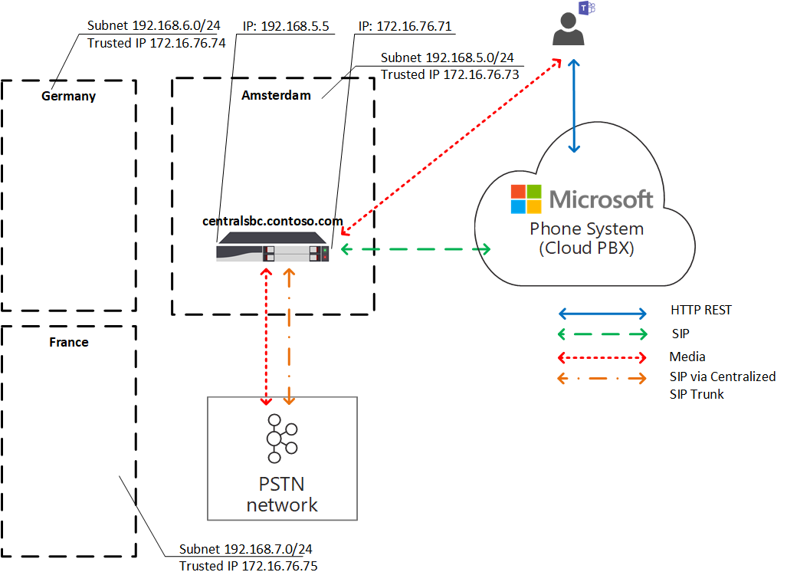

# 직접 라우팅에 대 한 로컬 미디어 최적화

PSTN (공개 통신 네트워크) 음성은 음성 품질에 대 한 높은 기대치를 갖춘 비즈니스 중심의 응용 프로그램으로 간주 됩니다. 직접 라우팅은 미디어 트래픽 흐름을 제어 하 여 전세계 다양 한 기업에 대 한 로컬 전화 통신 및 여러 가지 네트워크 토폴로지를 수용할 수 있도록 합니다. 

직접 라우팅에 대 한 로컬 미디어 최적화를 통해 다음과 같은 방법으로 음성 품질을 관리할 수 있습니다.

-   팀 클라이언트와 고객 세션 경계 컨트롤러 (SBCs) 간에 미디어 트래픽이 흐르는 방법을 제어 합니다.
-   회사 네트워크 서브넷의 경계 내에서 미디어 로컬을 유지 합니다.
-   SBCs가 사설 Ip를 사용 하는 회사 방화벽 뒤에 있고 Microsoft에 직접 표시 되지 않는 경우에도 팀 클라이언트와 SBCs 간에 미디어 스트림을 허용 합니다.

로컬 미디어 최적화는 다음 두 가지 시나리오를 지원 합니다.

- SIP (주 세션 초기화 프로토콜) 트렁크에 연결 된 중앙 집중화 된 SBC를 통해 모든 로컬 trunks의 중앙 집중화--회사의 모든 지역 지사에 대 한 전화 통신 서비스를 제공 합니다.

-   SBCs (가상 네트워크 토폴로지 빌드)-즉, 로컬 지점의 SBCs는 외부 IP 주소를 통해 Microsoft 전화 시스템에 표시 되 고 통신 하는 중앙 집중화 된 프록시 SBC에 연결 됩니다. 가상 네트워크 토폴로지에서 다운스트림 SBCs는 내부 Ip를 통해 통신 하며 전화 시스템에 직접 표시 되지 않습니다.

이 문서에서는 기능 기능, 고객 시나리오 및 솔루션에 대해 설명 합니다. 구성에 대 한 자세한 내용은 [로컬 미디어 최적화 구성을](direct-routing-media-optimization-configure.md)참조 하세요. 

  > [!NOTE]
  > 인트라넷의 경계 내에서 미디어 로컬을 유지 하려는 경우 로컬 미디어 최적화를 권장 합니다. 이미 미디어 바이패스를 사용 하 고 있는 경우에는 SBCs의 공용 IP 주소만 사용할 경우 로컬 미디어 최적화로 전환 하는 것은 필수가 아닙니다. 미디어 바이패스를 계속 사용할 수 있습니다. 자세한 내용은 [미디어 바이패스 계획](direct-routing-plan-media-bypass.md)을 참조 하세요.

## 지원 되는 고객 시나리오

이 논의에 대 한 자세한 내용은 Contoso가 다음과 같이 전세계에 여러 기업을 실행 한다고 가정 합시다. (유럽 및 APAC 지역은 예일 때에만 사용 됨에 유의 하세요. 회사에는 비슷한 요구 사항이 있는 다양 한 지역이 있을 수 있습니다.
 
- **유럽에서** Contoso는 약 30 개국에 지사를 보유 하 고 있습니다. 각 office에는 고유한 PBX (개인 분기 교환)가 있습니다. 

  Contoso는 모든 30 유럽 사무소에 대해 trunks를 한 위치에서--암스테르담로 중앙 집중화 하는 옵션을 제공 했습니다. Contoso는 암스테르담에서 SBC를 배포 하 고 중앙 위치를 통해 통화를 실행 하는 데 충분 한 대역폭을 제공 하 고 중앙 SIP 트렁크를 중앙 위치로 연결 하 고 암스테르담의 모든 유럽 위치를 서비스 시작 합니다. 

- E a e e e e e e e- **ac 지역에** 는 Contoso에 여러 국가의 사무실이 있습니다. 

  대부분의 국가에서 회사에는 여전히 지역 지사에 TDM (시간 구분) trunks 있습니다. TDM trunks의 중앙 집중화는 APAC 지역에서는 옵션이 아니므로 SIP로 전환 하는 것은 불가능 합니다. 여러 개의 SBCs (수의 게이트웨이)를 사용 하는 APAC 지역에 50 Contoso 지사 이외의 지점이 있다고 가정 합니다. 이 시나리오에서는 공용 IP 주소 및/또는 로컬 인터넷 연결 끊김 때문에 모든 게이트웨이를 직접 라우팅 인터페이스에 연결할 수 없습니다. 또한 일부 국가에서는 현지 PSTN 네트워크 연결 없이도 규정 요구 조건을 충족 시킬 수 없습니다.

비즈니스 요구 사항에 따라 Contoso는 직접 라우팅에 대 한 로컬 미디어 최적화를 사용 하 여 두 개의 솔루션을 구현 했습니다.

- **유럽에서** 모든 trunks 사용자 위치를 기반으로 중앙 SBC와 사용자 간의 중앙 집중화 되 고 미디어 흐름입니다. 

  - 사용자가 회사 네트워크의 로컬 서브넷 (즉, 내부 사용자)에 연결 된 경우 중앙 SBC의 내부 IP와 사용자의 팀 클라이언트 간 미디어 흐름을 진행 합니다. 
  
  - 사용자가 회사 네트워크의 경계를 벗어난 경우 (예: 사용자가 공용 무선 인터넷 연결을 사용 하는 경우) 사용자가 외부로 간주 됩니다. 이 경우 미디어는 중앙 SBC의 외부 IP와 팀 클라이언트 간에 흐릅니다.

- **APAC 지역에서** 중앙 집중화 된 프록시 SBC는 로컬 지사에서 직접 라우팅 인터페이스와 다운스트림 SBCs 간에 미디어를 전달 하는 Microsoft 직접 라우팅과 쌍을 이룹니다. 

  로컬 지점에 있는 다운스트림 SBCs는 APAC의 직접적인 라우팅에 직접 표시 되지 않지만, Set-CSOnlinePSTNGateway cmdlet을 사용 하 여 Microsoft 전화 시스템 내에서 가상 네트워크 토폴로지를 만드는 방법으로 쌍을 이룹니다. 가능 하면 미디어가 항상 로컬에 유지 됩니다. 외부 사용자는 팀 클라이언트와 프록시 SBC의 공용 IP 간에 미디어 흐름이 있습니다.

## 중앙 trunks 중앙 SBC

중앙 집중화 된 SIP 트렁크를 사용 하 여 단일 중앙 SBC를 통해 모든 지역 지사에 PSTN 서비스를 제공 하는 솔루션을 구축 하기 위해 Contoso 테 넌 트 관리자가 하나의 SBC (centralsbc.contoso.com)를 서비스에 쌍으로 연결 합니다. SBC에 연결 된 중앙 SIP 트렁크가 있습니다. 

- 사용자가 회사의 내부 네트워크에 있는 경우 SBC는 미디어에 대 한 SBC의 내부 IP를 제공 합니다.

- 사용자가 회사 네트워크 외부에 있는 경우 SBC는 SBC의 외부 (공용) IP를 제공 합니다.

참고: 예제, 테이블 또는 다이어그램 내의 모든 값은 설명을 위해 제공 됩니다.

표 1 SBCs 용 네트워크 매개 변수 예 

| 위치 | SBC FQDN | 내부 서브넷 | 외부 NAT (신뢰할 수 있는 IP) | SBC 외부 IP 주소 | SBC 내부 IP 주소 |
|:------------|:-------|:-------|:-------|:-------|:-------|
| 암스테르담 | centralsbc.contoso.com | 192.168.5.0/24 | 172.16.76.73 | 172.16.76.71 | 192.168.5.5 |
| 독일 | 배포 되지 않음 | 192.168.6.0/24 | 172.16.76.74 | 배포 되지 않음 |  배포 되지 않음 |
| 프랑스 | 배포 되지 않음 | 192.168.7.0/24 | 172.16.76.75 | 배포 되지 않음 |  배포 되지 않음 ||||

### 내부 사용자

다음 다이어그램은 사용자가 가정용 지사 또는 사이트에서 회사 네트워크에 연결 되어 있을 때의 트래픽 흐름을 보여 줍니다. 

온-프레미스 동안 사용자는 독일 지역 지사에 할당 됩니다. 사용자가 팀을 통해 다이렉트로 라우팅 전화를 겁니다.

- 사용자의 팀 클라이언트는 REST API를 통해 직접 전화 시스템에 통신 하지만 통화 중에 생성 된 미디어는 중앙 SBC의 내부 IP 주소로 흐릅니다. 

- SBC는 흐름을 전화 시스템 및 연결 된 PSTN 네트워크로 리디렉션합니다. 

- 중앙 SBC는 외부 IP 주소를 통해서만 전화 시스템에서 볼 수 있습니다. 

다이어그램 1. 사용자가 중앙 집중화 된 SBC이 고 중앙 집중화 된 SIP 트렁크가 있는 ' 홈 ' 사이트에 있는 경우 트래픽 흐름

### 외부 사용자

다음 다이어그램은 사용자가 온-프레미스가 아니고 회사 네트워크에 연결 되어 있지 않은 경우 (즉, 사용자의 장치가 모바일 장치 또는 공용 Wi-fi를 통해 인터넷에 연결 되어 있지 않은 경우) 트래픽 흐름을 보여 줍니다. 사용자가 팀을 통해 다이렉트 라우팅 전화를 사용 합니다.

- 사용자의 팀 클라이언트는 REST API를 통해 직접 전화 시스템에 통신 하지만이 경우 통화 중에 생성 된 미디어는 중앙 SBC의 외부 IP 주소로 이동 합니다. 

- SBC는 흐름을 전화 시스템 및 연결 된 PSTN 네트워크로 리디렉션합니다. 

- 중앙 SBC는 외부 IP 주소를 통해서만 전화 시스템에서 볼 수 있습니다. 

이 경우 사용자가 독일의 지사와 다른 지사에 로컬로 있든 관계 없이 동작이 유사 합니다. 사용자가 회사 네트워크의 경계를 벗어나므로 외부 사용자로 간주 됩니다.

다이어그램 2. 사용자가 중앙 집중화 된 SBC이 고 중앙 집중화 된 SIP 트렁크가 있는 외부에 있는 경우의 트래픽 흐름

## 연결 된 다운스트림 SBCs가 있는 프록시 SBC

TDM trunks 중앙 집중화 된 모든 지역 지사에서 PSTN 서비스를 제공 하는 솔루션을 구축 하려면 Contoso 관리자가 프록시 SBC 라고도 하는 하나의 SBC (proxysbc.contoso.com)을 직접 라우팅 서비스에 연결 합니다. 

나중에 Contoso 관리자가 프록시 SBC proxysbc.contoso.com를 통해 연결할 수 있음을 나타내는 다운스트림 SBCs를 추가 합니다. 다운스트림 SBCs에는 공용 Ip가 없으므로 음성 경로에 할당할 수 있습니다. 아래 표에는 네트워크 매개 변수 및 구성 예가 나와 있습니다.

사용자가 다운스트림 SBC이 있는 지역 지사에 있는 경우 미디어 트래픽은 사용자와 로컬 다운스트림 SBC 간에 직접 흐릅니다. 사용자가 office 외부 (공용 인터넷) 인 경우 미디어는 사용자가 프록시 SBC의 공용 IP로 이동 하며,이는 관련 다운스트림 SBC (들)에 프록시를 사용 합니다.

표 2. 예제 SBC 네트워크 정보

| 위치 | SBC FQDN | 내부 서브넷 | 외부 NAT (신뢰할 수 있는 IP) | SBC 외부 IP 주소  | SBC 내부 IP 주소 |
|:------------|:-------|:-------|:-------|:-------|:-------|
| 베트남 | VNsbc.contoso.com | 192.168.1.0/24 | 172.16.240.110 | 없음 |  192.168.1.5 |
| 인도네시아  | IDsbc.contoso.com | 192.168.2.0/24 | 172.16.240.120 | 없음 |  192.168.2.5 |
| 싱가포르 | proxysbc.contoso.com |   192.168.3.0/24 | 172.16.240.130 | 172.16.240.133 | 192.168.3.5 |

### 내부 사용자 

다음 다이어그램은 사용자가 APAC 지역 내에 있는 경우 시나리오의 상위 수준 트래픽 흐름을 보여 줍니다. 베트남 지역 지사에 할당 되 고 온-프레미스 인 사용자는 팀을 통해 직접 라우팅 전화를 사용 합니다. 

- 사용자의 팀 클라이언트는 REST API를 통해 직접 전화 시스템과 통신 하지만 통화 중에 생성 된 미디어는 로컬 SBC의 내부 IP 주소로 흐릅니다.

- 로컬 SBC는 연결 된 로컬 PSTN 네트워크에 대 한 싱가포르의 프록시 SBC로 흐름을 리디렉션합니다.

-  프록시 SBC는 외부 IP 주소를 통해서만 전화 시스템에서 볼 수 있으며 다운스트림 SBC (이 경우에는 베트남의 지역 SBC)에서 전화 시스템으로 흐름을 라우팅합니다. 

- 로컬 지점에 있는 다운스트림 SBC는 전화 시스템에 직접 표시 되지 않지만 로컬 미디어 최적화를 설정 하는 동안 Contoso 관리자가 정의한 가상 네트워크 토폴로지 내에 매핑됩니다.

참고: 로컬 사용자 및 비로컬 사용자의 경우 구성 된 로컬 미디어 최적화 모드에 따라 동작이 다를 수 있습니다. 

사용할 수 있는 모드 및 관련 동작에 대 한 자세한 내용은 로컬 미디어 최적화 구성을 참조 하세요.

다이어그램 3. 사용자가 프록시 SBC 및 연결 된 다운스트림 SBCs를 사용 하 여 "홈" 네트워크에 있을 때 트래픽 흐름 

### 외부 사용자

다음 다이어그램은 사용자가 회사 네트워크 경계를 벗어날 때의 트래픽 흐름을 보여 줍니다. 사용자가 온-프레미스가 아닙니다 (회사 네트워크 경계 내에 있지 않음). 사용자가 팀을 통해 베트남의 전화 번호로 직접 라우팅 전화를 겁니다. 

- 사용자의 팀 클라이언트는 REST API를 통해 직접 전화 시스템과 통신 하지만, 통화 중에 생성 된 미디어는 먼저 싱가포르의 프록시 SBC에 대 한 외부 IP 주소에 전달 됩니다. 

- 구성 및 음성 정책에 따라 (세부 정보에 대 한 [로컬 미디어 최적화 구성](direct-routing-media-optimization-configure.md) 참조) 프록시 sbc는 흐름을 베트남의 다운스트림 SBC로 리디렉션합니다. 

- 베트남의 다운스트림 SBC는 흐름을 연결 된 로컬 PSTN 네트워크로 리디렉션합니다. 

- 프록시 SBC는 외부 IP 주소를 통해서만 전화 시스템에서 볼 수 있습니다.

-  로컬 지점에 있는 다운스트림 SBC는 전화 시스템에 직접 표시 되지 않지만 로컬 미디어 최적화를 설정 하는 동안 Contoso 관리자가 정의한 가상 네트워크 토폴로지 내에 매핑됩니다. 이 예제에서는 사용자가 회사 네트워크의 경계를 벗어나므로 외부 사용자로 간주 됩니다. 

다이어그램 4. 사용자가 프록시 SBC로 외부에 있고 연결 된 다운스트림 SBCs가 있는 경우 트래픽 흐름

## 로컬 미디어 최적화 모드

로컬 미디어 최적화는 두 가지 모드를 지원 합니다.

- **모드 1: 항상 무시** 합니다. 이 경우 사용자가 internal 인 경우 미디어는 내부 사용자의 실제 위치에 관계 없이 로컬 다운스트림 SBC의 내부 IP 주소를 통해 전달 됩니다. 예를 들어, 다운스트림 SBC이 있거나 다른 지점에 있는 동일한 지점 내에 있습니다.

- **모드 2: 로컬 사용자에만** 해당 됩니다. 이 모드에서 미디어는 내부 사용자가 다운스트림 SBC와 동일한 지점에 위치 하 여 생성 된 경우에만 로컬 다운스트림 SBC의 내부 IP 주소로 흐릅니다. 

로컬 미디어 최적화 모드를 구분 하려면 테 넌 트 관리자가 Set-CSonlinePSTNGateway cmdlet을 사용 하 여 모든 SBC에 대해-BypassMode 매개 변수를 ' 항상 ' 또는 ' 전용 Forlocalusers ' 중 하나로 설정 해야 합니다. 자세한 내용은 [로컬 미디어 최적화 구성을](direct-routing-media-optimization-configure.md)참조 하세요.  

### 모드 1: 항상 무시

지사 간에 연결이 양호한 경우 권장 모드는 항상 무시 됩니다.

예를 들어 회사에 게 30 개국의 중앙 집중화 된 SIP 트렁크가 있고 30 개 사이트와 로컬 사용자 간의 연결이 양호한 것으로 가정 합니다. 독일에 지역 SBC이 배포 되는 분기도 있습니다.

독일의 SBC는 "항상 무시" 모드에서 구성할 수 있습니다. 위치에 관계 없이 사용자는 SBC의 내부 IP 주소를 통해 직접 SBC에 연결 됩니다 (예: 프랑스 ~ 독일). 아래 다이어그램은 참조를 참조 하세요.).

다음은 두 가지 시나리오에 대 한 설명입니다.

- 시나리오 1. 사용자가 온라인 음성 라우팅 정책에 정의 된 SBC와 같은 위치에 있습니다.

- 시나리오 2. 사용자와 게이트웨이가 서로 다른 사이트에 있습니다.

#### 시나리오 1. 사용자가 온라인 음성 라우팅 정책에 정의 된 SBC와 같은 위치에 있습니다.

암스테르담의 SBC는 독일의 로컬 다운스트림 SBC에 대 한 프록시 SBC로 구성 됩니다. 사용자는 로컬 SBC의 회사 네트워크와 동일한 서브넷 내에서 독일에 있습니다. SBCs (프록시와 다운스트림) 모두 항상 바이패스 모드로 구성 되어 있습니다. 온라인 음성 라우팅 정책은 독일 내에서 전화를 거는 경우 (지역 번호 + 49), 독일의 지역 SBC로 라우팅해야 하는 것을 지정 합니다. 다른 모든 통화--즉, 독일의 SBC에 오류가 발생 하는 경우, 독일의 호출은 암스테르담의 프록시 SBC로 경로를 지정 해야 합니다. 다음 표에서는 예제 구성을 간략하게 보여 줍니다. 

표 3. 시나리오 1에 대 한 예제 구성

| 사용자의 실제 위치 | 사용자가 번호로 전화를 걸고 있습니다. | 온라인 음성 라우팅 정책 | SBC에 대해 구성 된 모드 | 미디어 흐름 | 
|:------------|:-------|:-------|:-------|:-------|
| 독일 | + 49 1 437 2800 | 우선 순위 1: ^ \+ 49 (\d {8} ) $-DEsbc.contoso.com 우선 순위 2:. *-proxysbc.contoso.com| DEsbc.contoso.com – 항상 무시  proxysbc.contoso.com – 항상 무시 | 팀 사용자 < – > DEsbc.contoso.com |

아래 다이어그램은 독일에서 팀을 통해 직접 라우팅 전화를 사용 하 여 독일의 내부 사용자에 대 한 상위 수준 트래픽 흐름을 보여 줍니다. 

- 사용자의 팀 클라이언트는 REST API를 통해 직접 전화 시스템과 통신 합니다. 

- 통화 중에 생성 된 미디어는 로컬 SBC의 내부 IP 주소로 흐릅니다. 

- 지역 SBC는 흐름을 암스테르담의 프록시 SBC 및 연결 된 로컬 PSTN 네트워크로 리디렉션합니다. 

- 프록시 SBC는 외부 IP 주소를 통해서만 전화 시스템에서 볼 수 있으며 다운스트림 SBC (이 경우에는 독일의 지역 SBC)에서 전화 시스템으로 흐름을 라우팅합니다. 

- 로컬 지점에 있는 다운스트림 SBC는 전화 시스템에 직접 표시 되지 않지만 로컬 미디어 최적화를 설정 하는 동안 Contoso 관리자가 정의한 가상 네트워크 토폴로지 내에 매핑됩니다.

다이어그램 5.  "항상 우회" 모드를 사용 하며 사용자가 "홈" 사이트에 있는 트래픽 흐름

#### 시나리오 2: 사용자와 게이트웨이가 서로 다른 사이트에 있는 경우

암스테르담의 SBC는 독일의 로컬 다운스트림 SBC에 대 한 프록시 SBC로 구성 됩니다. SBCs (프록시와 다운스트림) 모두 항상 바이패스 모드로 구성 되어 있습니다. 지역 지사에 있는 프랑스의 내부 사용자는 독일에 대 한 직접 라우팅 통화를 만듭니다. 온라인 음성 라우팅 정책은 독일 (지역 번호 + 49)에 대 한 호출이 독일의 지역 SBC에 라우팅되도록 지정 합니다. 다른 모든 통화--그리고 독일의 SBC에 오류가 발생 하는 경우, 독일의 모든 통화는 암스테르담의 프록시 SBC로 경로를 지정 해야 합니다. 다음 표에서는 예제 구성을 간략하게 보여 줍니다. 

표 4 시나리오 2에 대 한 예제 구성

| 사용자의 실제 위치 | 사용자가 번호로 전화를 걸고 있습니다. | 온라인 음성 라우팅 정책 | SBC에 대해 구성 된 모드 | 미디어 흐름 | 
|:------------|:-------|:-------|:-------|:-------|
| 프랑스 | + 49 1 437 2800 | 우선 순위 1: ^ \+ 49 (\d {8} ) $-DEsbc.contoso.com  우선 순위 2:. *-proxysbc.contoso.com |  DEsbc.contoso.com – 항상 proxysbc.contoso.com – 항상 무시 | 팀 사용자 < – > DEsbc.contoso.com  |

다음 다이어그램은 프랑스에 거주 하는 내부 독일 사용자가 팀을 통해 독일의 번호로 직접 라우팅 전화를 거는 경우의 상위 수준 트래픽 흐름을 보여 줍니다. 

- 사용자의 팀 클라이언트는 REST API를 통해 직접 전화 시스템과 통신 합니다.

- 통화 중에 생성 된 미디어는 독일의 내부 IP 주소에서 SBC로 직접 흐릅니다. 

- 독일의 SBC는 흐름을 암스테르담의 프록시 SBC 및 연결 된 로컬 PSTN 네트워크로 리디렉션합니다. 

다이어그램 6.  "항상 우회" 모드를 사용 하며 사용자가 "홈" 사이트에 없지만 내부 네트워크에 있는 트래픽 흐름

### 모드 2: 로컬 사용자 용

로컬 지사와 각 지역 지사 간의 연결 상태가 좋지 않은 경우 권장 모드는 "로컬 사용자 용 으로만"입니다.

예를 들어 APAC 지역에는 Contoso에 다양 한 국가의 사무실이 여러 개 있다고 가정 합니다. 대부분의 국가에서 회사는 여전히 여러 지역 지사에 TDM trunks 있으므로 SIP로 전환할 수 없습니다. TDM trunks의 중앙 집중화는 APAC 지역에서 옵션이 아닙니다. 더욱이, 다 수의 게이트웨이 (SBCs)를 사용 하는 APAC 지역에는 50 개 이상의 Contoso 지사 들이 있습니다. 

TDM trunks의 중앙 집중화 된 모든 지역 지사에서 PSTN 서비스를 제공 하는 솔루션을 구축 하려면 Contoso 관리자가 싱가포르의 한 지역 SBC를 프록시 SBC로 연결 하 고 직접 라우팅 서비스에 연결 합니다. 로컬 지사 간의 직접적인 연결은 좋지 않지만, 각 지역 지사와 싱가포르의 지역 SBC 간에는 적절 한 연결이 있습니다. 지역 SBC의 경우 관리자는 ' 항상 무시 ' 모드를 선택 하 고 로컬 다운스트림 SBCs의 경우 관리자는 ' 로컬 사용자만 "모드를 선택 합니다.

다음은 두 가지 시나리오에 대 한 설명입니다.

- 시나리오 1. 사용자가 온라인 음성 라우팅 정책에 정의 된 SBC와 같은 위치에 있습니다.

- 시나리오 2. 사용자와 게이트웨이가 서로 다른 사이트에 있습니다.

#### 시나리오 1. 사용자가 온라인 음성 라우팅 정책에 정의 된 SBC와 같은 위치에 있습니다.

싱가포르의 SBC이 베트남 및 인도네시아의 로컬 다운스트림 SBCs에 대 한 프록시 SBC로 구성 되었다고 가정 합니다. 사용자가 로컬 SBC와 같은 위치에 있는 베트남에 있습니다. 온라인 음성 라우팅 정책은 베트남 (지역 번호 + 84)의 통화가 베트남의 지역 SBC에 라우팅되도록 지정 합니다. 다른 모든 통화--그리고, 베트남의 SBC에 오류가 발생 하는 경우, 베트남의 호출은 싱가포르의 프록시 SBC로 경로를 지정 해야 합니다. 다음 표에서는 예제 구성을 간략하게 보여 줍니다. 

표 5 ' 로컬 사용자에만 해당 모드 시나리오 1에 대 한 구성 예제

| 사용자의 실제 위치 | 사용자가 번호로 전화를 걸고 있습니다. | 온라인 음성 라우팅 정책 | SBC에 대해 구성 된 모드 | 미디어 흐름 | 
|:------------|:-------|:-------|:-------|:-------|
| 베트남 | + 84 4 3926 3000 | 우선 순위 1: ^ \+ 84 (\d {9} ) $-VNsbc.contoso.com  우선 순위 2:. *-proxysbc.contoso.com | VNsbc.contoso.com – 로컬 사용자에 대해서만   proxysbc.contoso.com – 항상 무시 | 팀 사용자 < – > VNsbc.contoso.com |

다음 다이어그램에서 베트남의 지역 지사에 할당 된 사용자는 온-프레미스에서 팀을 통해 다이렉트 라우팅 전화 호출을 수행 합니다. 

- 사용자의 팀 클라이언트는 REST API를 통해 직접 전화 시스템과 통신 합니다. 

- 통화 중에 생성 된 미디어는 로컬 SBC의 내부 IP 주소로 흐릅니다. 

- 로컬 SBC는 연결 된 로컬 PSTN 네트워크에 대 한 싱가포르의 프록시 SBC로 흐름을 리디렉션합니다. 

- 프록시 SBC는 외부 IP 주소를 통해서만 전화 시스템에서 볼 수 있으며 다운스트림 SBC (이 경우에는 베트남의 로컬 SBC)에서 전화 시스템으로 흐름을 라우팅합니다. 

- 로컬 지점에 있는 다운스트림 SBC는 전화 시스템에 직접 표시 되지 않지만 가상 네트워크 토폴로지 내에서 매핑됩니다.

다이어그램 7. "로컬 사용자 전용" 모드와 사용자가 "홈" 사이트에 있는 트래픽 흐름

#### 시나리오 2. 사용자와 게이트웨이가 서로 다른 사이트에 있습니다.

싱가포르의 SBC이 베트남 및 인도네시아의 로컬 다운스트림 SBCs에 대 한 프록시 SBC로 구성 되었다고 가정 합니다. 로컬 지사에 위치한 인도네시아의 내부 사용자는 베트남로 직접 라우팅 호출을 합니다. 온라인 음성 라우팅 정책은 베트남 (지역 번호 + 84)에 대 한 호출이 베트남의 지역 SBC에 라우팅되도록 지정 합니다. 다른 모든 통화--그리고, 베트남의 SBC에 오류가 발생 하는 경우, 베트남에 대 한 호출은 싱가포르의 프록시 SBC에 라우팅해야 합니다. 싱가포르의 프록시 SBC는 ' 항상 무시 ' 모드로 설정 되 고, 베트남의 지역 SBC는 ' 로컬 사용자 전용 ' 모드로 설정 됩니다. 다음 표에서는 예제 구성을 간략하게 보여 줍니다. 

표 6 사용자 구성

| 사용자의 실제 위치 | 사용자가 번호로 전화를 걸고 있습니다. | 온라인 음성 라우팅 정책 | SBC에 대해 구성 된 모드 | 미디어 흐름 | 
|:------------|:-------|:-------|:-------|:-------|
| 인도네시아 | + 84 4 3926 3000 | 우선 순위 1: ^ \+ 84 (\d {9} ) $-VNsbc.contoso.com   우선 순위 2:. *-proxysbc.contoso.com |VNsbc.contoso.com – 로컬 사용자에 대해서만   proxysbc.contoso.com – 항상 무시 | 팀 사용자 < – > proxysbc.contoso.com <-> VNsbc.contoso.com |

다음 다이어그램에서 인도네시아어 지사에서 온-프레미스에 있는 내부 사용자는 팀을 통해 베트남의 번호로 직접 라우팅 전화를 겁니다. 

- 사용자의 팀 클라이언트는 REST API를 통해 직접 전화 시스템과 통신 합니다.

- 통화 중에 생성 된 미디어는 프록시 SBC의 내부 IP 주소로 먼저 전달 됩니다. 

- 싱가포르의 프록시 SBC는 흐름을 베트남 및에서 전화 시스템의 다운스트림 SBC에 대 한 내부 IP 주소로 리디렉션합니다. 

- 베트남의 다운스트림 SBC는 연결 된 로컬 PSTN 네트워크로 흐름을 라우팅합니다. 

- 프록시 SBC는 외부 IP 주소를 통해서만 전화 시스템에서 볼 수 있습니다.

- 지역 지사에 있는 다운스트림 SBCs는 직접 전화 시스템에 표시 되지 않지만 가상 네트워크 토폴로지 내에는 매핑되어 있습니다.

다이어그램 8.  "로컬 사용자 용 으로만" 모드와 사용자가 "홈" 사이트에 없지만 내부 네트워크에 있는 트래픽 흐름

## 알려진 문제

다음은 현재 로컬 미디어 최적화에 있는 알려진 문제 목록입니다. Microsoft는 이러한 문제를 해결 하기 위해 노력 하 고 있습니다.

| 문제 | 방법을 |
| :--- | :--- |
| 팀 클라이언트 공용 IP가 고객의 신뢰할 수 있는 IP 목록과 일치 하는 경우 팀 클라이언트는 **internal** 로 식별 되지 않습니다. | 로컬 미디어 최적화에서는 팀 클라이언트 서브넷이 테 넌 트 구성 [네트워크 서브넷](https://docs.microsoft.com/powershell/module/skype/new-cstenantnetworksubnet?view=skype-ps) 과 일치 해야 합니다.|
| 통화 에스컬레이션은 팀 클라이언트가 내부용으로 식별 되는 경우 호출을 삭제 합니다.| 다이렉트 라우팅 SBC에서 로컬 미디어 최적화를 사용 하지 않도록 설정 합니다.|

