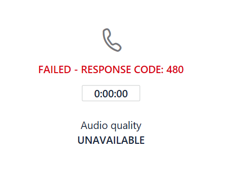

# 직접 라우팅 모니터링 및 문제 해결

이 문서에서는 직접 라우팅 구성을 모니터링 하 고 문제를 해결 하는 방법을 설명 합니다. 

직접 라우팅을 사용 하 여 전화를 걸고 받을 수 있는 기능은 다음 구성 요소를 포함 합니다. 

- SBCs (세션 경계 컨트롤러) 
- Microsoft 클라우드의 직접 라우팅 구성 요소 
- 통신 trunks 

문제가 해결 되지 않는 경우 SBC 공급 업체나 Microsoft에서 지원 서비스 케이스를 열 수 있습니다. 

Microsoft는 문제 해결 및 모니터링을 위한 추가 도구를 제공 하는 작업 중입니다. 문서를 정기적으로 업데이트를 확인 하세요. 

## SIP (세션 초기화 프로토콜) 옵션 메시지를 사용 하 여 세션 경계 컨트롤러의 가용성 모니터링

직접 라우팅은 세션 경계 컨트롤러에서 보낸 SIP 옵션을 사용 하 여 SBC 상태를 모니터링 합니다. 테 넌 트 관리자가 SIP 옵션 모니터링을 사용 하도록 설정 하는 데 필요한 작업은 없습니다. 수집 된 정보는 라우팅 결정을 할 때 고려해 야 합니다. 

예를 들어 특정 사용자에 대해 통화를 라우팅할 수 있는 몇 개의 SBCs가 있는 경우 다이렉트 라우팅은 각 SBC에서 받은 SIP 옵션 정보를 라우팅 결정을 고려 하 여 간주 합니다. 

다음 다이어그램에서는 구성의 예를 보여 줍니다. 

사용자가 7> 자리 숫자로 + 1 425 \<를 호출 하면 직접적인 라우팅이 경로를 평가 합니다. 경로에는 sbc1.contoso.com 및 sbc2.contoso.com의 두 가지 SBCs가 있습니다. 두 SBCs는 경로의 우선 순위가 같습니다. SBC를 선택 하기 전에 라우팅 메커니즘은 SBC에서 마지막으로 SIP 옵션을 보낸 시점을 기준으로 SBCs의 상태를 평가 합니다. 

호출을 보내는 순간의 통계가 1 분 마다 옵션을 전송 한다는 것을 표시 하면 SBC는 정상으로 간주 됩니다.  

호출이 이루어지면 다음 논리가 적용 됩니다.

- SBC는 11:00 AM에 페어링 되었습니다.  
- SBC는 오전 11:01, 11:02 AM 등의 옵션을 보냅니다.  
- 11:15에서 사용자는 전화를 걸고 라우팅 메커니즘이이 SBC를 선택 합니다. 

직접 라우팅은 일반 간격 옵션을 세 번 (1 분 간격으로) 할 수 있습니다. 지난 3 분 동안 옵션이 전송 된 경우 SBC는 정상으로 간주 됩니다.

예의 SBC에서 11:12 AM 및 11:15 AM (통화 시간) 사이의 모든 기간에 대 한 옵션을 보낸 경우에는 정상적인 것으로 간주 됩니다. 그렇지 않은 경우 SBC는 경로에서 강등 됩니다. 

강등은 SBC가 먼저 시도 되지 않는다는 의미입니다. 예를 들어 우선 순위가 동일한 sbc1.contoso.com 및 sbc2.contoso.com 있습니다.  

앞에서 설명한 대로 sbc1.contoso.com에서 SIP 옵션을 정기적으로 보내지 않는 경우 수준이 내려갑니다. 그 다음 sbc2.contoso.com 통화를 시도 합니다. Sbc2에서 통화를 전달할 수 없는 경우에는 오류가 발생 하기 전에 sbc1.contoso.com (수준 내림)을 다시 시도 합니다. 

한 경로에 둘 이상의 SBCs (또는 그 이상)가 있는 것으로 간주 되는 경우 SBCs 간의 통화를 분산 하기 위해 Fisher가 적용 됩니다.

## 통화 품질 분석 대시보드 및 SBC 로그 모니터링 
 
일부 경우에 특히 초기 페어링 중에 SBCs 또는 다이렉트 라우팅 서비스의 잘못 된 구성 관련 문제가 발생할 수 있습니다. 

다음 도구를 사용 하 여 구성을 모니터링할 수 있습니다.  
 
- 통화 품질 대시보드 
- SBC 로그 

다이렉트 라우팅 서비스에는 호출 분석 또는 SBC 로그에 보고 되는 매우 설명적인 오류 코드가 있습니다. 

통화 품질 대시보드는 통화 품질 및 안정성에 대 한 정보를 제공 합니다. 통화 분석을 사용 하 여 발생 하는 문제를 해결 하는 방법에 대 한 자세한 내용은 [Microsoft 팀 및 비즈니스용 Skype Online에 대 한 통화 품질 대시보드 켜기 및 사용](https://docs.microsoft.com/SkypeForBusiness/using-call-quality-in-your-organization/turning-on-and-using-call-quality-dashboard) 및 통화 [분석을 사용 하 여 통화 품질 저하 문제 해결](https://docs.microsoft.com/SkypeForBusiness/using-call-quality-in-your-organization/use-call-analytics-to-troubleshoot-poor-call-quality)을 참조 하세요. 

통화 실패 시에는 통화 분석이 표준 SIP 코드를 제공 하 여 문제 해결에 도움을 줍니다. 

그러나 통화 분석은 호출이 직접 라우팅 및 실패의 내부 구성 요소에 도달 하는 경우에만 도움이 됩니다. SBC 페어링 또는 SIP "초대"가 거부 된 문제에 대 한 문제가 발생 하는 경우 (예: 트렁크 FQDN의 이름이 잘못 구성 된 경우)에는 통화 분석이 도움이 되지 않습니다. 이 경우 SBC 로그를 참조 하세요. 직접 라우팅은 SBCs에 대 한 문제에 대 한 자세한 설명을 보냅니다. 이러한 문제는 SBC 로그에서 읽을 수 있습니다. 
