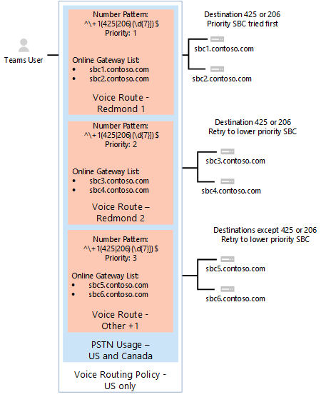

# 직접 라우팅 모니터링 및 문제 해결Monitor and troubleshoot Direct Routing

이 문서에서는 직접 라우팅 구성을 모니터링하고 문제를 해결하는 방법을 설명하고 있습니다.This article describes how to monitor and troubleshoot your Direct Routing configuration. 

직접 라우팅을 사용하여 호출을 걸고 받는 능력에는 다음 구성 요소가 포함됩니다.The ability to make and receive calls by using Direct Routing involves the following components: 

- SBC(세션 테두리 컨트롤러)Session Border Controllers (SBCs) 
- Microsoft 클라우드의 직접 라우팅 구성 요소Direct Routing components in the Microsoft Cloud 
- Telecom 트렁크Telecom trunks 

문제 해결에 어려움이 있는 경우 SBC 공급업체 또는 Microsoft에 지원 사례를 열 수 있습니다.If you have difficulties troubleshooting issues, you can open a support case with your SBC vendor or Microsoft. 

Microsoft는 문제 해결 및 모니터링을 위한 더 많은 도구를 제공하기 위해 작업 중입니다.Microsoft is working on providing more tools for troubleshooting and monitoring. 업데이트에 대한 설명서를 주기적으로 확인합니다.Please check the documentation periodically for updates. 

## SIP(세션 시작 프로토콜) 옵션 메시지를 사용하여 세션 테두리 컨트롤러의 가용성 모니터링Monitoring availability of Session Border Controllers using Session Initiation Protocol (SIP) options messages

직접 라우팅은 세션 테두리 컨트롤러에서 보낸 SIP 옵션을 사용하여 SBC 상태 모니터링Direct Routing uses SIP options sent by the Session Border Controllers to monitor SBC health. SIP 옵션 모니터링을 사용하도록 설정하려면 테넌트 관리자에게 필요한 작업이 없습니다.There are no actions required from the tenant administrator to enable the SIP options monitoring. 라우팅 결정을 내릴 때 수집된 정보를 고려합니다.The collected information is taken into consideration when routing decisions are made. 

예를 들어 특정 사용자의 경우 호출을 라우팅하는 데 사용할 수 있는 여러 SBC가 있는 경우 직접 라우팅은 각 SBC에서 받은 SIP 옵션 정보를 고려하여 라우팅을 판단합니다.For example, if, for a specific user, there are several SBCs available to route a call, Direct Routing considers the SIP options information received from each SBC to determine routing. 

다음 다이어그램은 구성의 예를 보여줍니다.The following diagram shows an example of the configuration: 

사용자가 7자리 숫자 +1 425를> 경우 직접 라우팅은 \< 경로를 평가합니다.When a user makes a call to number +1 425 \<any seven digits>, Direct Routing evaluates the route. 경로에는 두 개의 SBC, 즉 sbc1.contoso.com 및 sbc2.contoso.com.There are two SBCs in the route: sbc1.contoso.com and sbc2.contoso.com. 두 SBC 모두 경로에서 동일한 우선 순위를 습니다.Both SBCs have equal priority in the route. SBC를 선택하기 전에 라우팅 메커니즘은 SBC가 SIP 옵션을 마지막으로 보낸 시기를 기반으로 SBC의 상태 평가를 합니다.Before picking an SBC, the routing mechanism evaluates the health of the SBCs based on when the SBC sent the SIP options last time. 

호출을 보낼 때 통계가 SBC가 1분마다 옵션을 전송하는 것으로 표시될 경우 SBC는 정상으로 간주됩니다.An SBC is considered healthy if statistics at the moment of sending the call shows that the SBC sends options every minute.  

호출이 이행된 경우 다음 논리가 적용됩니다.When a call is made, the following logic applies:

- SBC는 오전 11시에 쌍으로 진행됩니다.The SBC was paired at 11:00 AM.  
- SBC는 오전 11시, 오전 11시 2분에 옵션을 전송합니다.The SBC sends options at 11:01 AM, 11:02 AM, and so on.  
- 11시 15분에 사용자가 전화를 걸고 라우팅 메커니즘이 이 SBC를 선택합니다.At 11:15, a user makes a call and the routing mechanism selects this SBC. 

직접 라우팅은 일반 간격 옵션을 세 번(일반 간격은 1분)합니다.Direct Routing takes the regular interval options three times (the regular interval is one minute). 지난 3분 동안 옵션이 전송된 경우 SBC는 정상으로 간주됩니다.If options were send during the last three minutes, the SBC is considered healthy.

예제의 SBC가 오전 11시 12분과 오전 11시 15분 사이에 옵션을 보낸 경우(호출이 만들어진 시간) 정상으로 간주됩니다.If the SBC in the example sent options at any period between 11:12 AM and 11:15 AM (the time the call was made), it is considered healthy. 그렇지 않은 경우 SBC는 경로에서 강하됩니다.If not, the SBC will be demoted from the route. 

강하는 SBC가 먼저 시도되지 않는 경우를 의미합니다.Demotion means that the SBC will not be tried first. 예를 들어 우선 순위가 sbc1.contoso.com sbc2.contoso.com 수 있습니다.For example, we have sbc1.contoso.com and sbc2.contoso.com with equal priority.  

이전에 sbc1.contoso.com 정기적으로 SIP 옵션을 보내지 않는 경우 강아집니다.If sbc1.contoso.com does not send SIP options on a regular interval as previously described, it is demoted. 다음으로 sbc2.contoso.com 호출을 위해 합니다.Next, sbc2.contoso.com tries for the call. sbc2.contoso.con에서 호출을 배달할 수 없는 경우 sbc1.contoso.com(강하)를 다시 시도한 후 오류가 생성됩니다.If sbc2.contoso.con cannot deliver the call, the sbc1.contoso.com (demoted) is tried again before a failure is generated. 

한 경로에 있는 두 개 이상의 SBC가 정상 및 같음으로 간주되는 경우 Fisher-Yates 셔플이 적용되어 SBC 간에 호출을 분산합니다.If two (or more) SBCs in one route are considered healthy and equal, Fisher-Yates shuffle is applied to distribute the calls between the SBCs.

## 통화 품질 분석 대시보드 및 SBC 로그 모니터링Monitor Call Quality Analytics dashboard and SBC logs 
 
경우에 따라 특히 초기 페어링 중에 SBC 또는 직접 라우팅 서비스의 구성 잘못과 관련된 문제가 있을 수 있습니다.In some cases, especially during the initial pairing, there might be issues related to misconfiguration of the SBCs or the Direct Routing service. 

다음 도구를 사용하여 구성을 모니터링할 수 있습니다.You can use the following tools to monitor your configuration:  
 
- 통화 품질 대시보드Call Quality Dashboard 
- SBC 로그SBC logs 

직접 라우팅 서비스에는 호출 분석 또는 SBC 로그에 보고된 매우 설명적인 오류 코드가 있습니다.The Direct Routing service has very descriptive error codes reported to either Call Analytics or the SBC logs. 

통화 품질 대시보드는 통화 품질 및 안정성에 대한 정보를 제공합니다.The Call Quality Dashboard provides information about call quality and reliability. 통화 분석을 사용하여 문제를 해결하는 방법에 대한 자세한 내용은 Microsoft Teams 및 [비즈니스용 Skype Online에](https://docs.microsoft.com/SkypeForBusiness/using-call-quality-in-your-organization/turning-on-and-using-call-quality-dashboard) 대한 통화 품질 대시보드 켜기 및 사용 및 통화 분석을 사용하여 통화 품질 문제 해결을 [참조하세요.](https://docs.microsoft.com/SkypeForBusiness/using-call-quality-in-your-organization/use-call-analytics-to-troubleshoot-poor-call-quality)To learn more about how to troubleshoot issues using Call Analytics, see [Turning on and using Call Quality Dashboard for Microsoft Teams and Skype for Business Online](https://docs.microsoft.com/SkypeForBusiness/using-call-quality-in-your-organization/turning-on-and-using-call-quality-dashboard) and [Use Call Analytics to troubleshoot poor call quality](https://docs.microsoft.com/SkypeForBusiness/using-call-quality-in-your-organization/use-call-analytics-to-troubleshoot-poor-call-quality). 

호출 실패 시 호출 분석은 문제 해결에 도움이 되는 표준 SIP 코드를 제공합니다.In case of call failures, Call Analytics provides standard SIP codes to help you with troubleshooting. 

그러나 호출 분석은 호출이 직접 라우팅의 내부 구성 요소에 도달하고 실패할 때만 도움이 될 수 있습니다.However, Call Analytics can only help when calls reach the internal components of Direct Routing and fail. SBC 페어링 관련 문제 또는 SIP "초대"가 거부된 문제(예: 트렁크 FQDN의 이름이 잘못 구성) 호출 분석은 도움이 되지 않습니다.In case of issues with SBC pairing or issues where SIP "Invite" was rejected (for example, the name of the trunk FQDN is misconfigured), Call Analytics will not help. 이 경우 SBC 로그를 참조합니다.In this case, refer to the SBC logs. 직접 라우팅은 문제에 대한 자세한 설명을 SBC에 전송합니다. 이러한 문제는 SBC 로그에서 읽을 수 있습니다.Direct Routing sends a detailed description of issues to the SBCs; these issues can be read from the SBC logs. 
