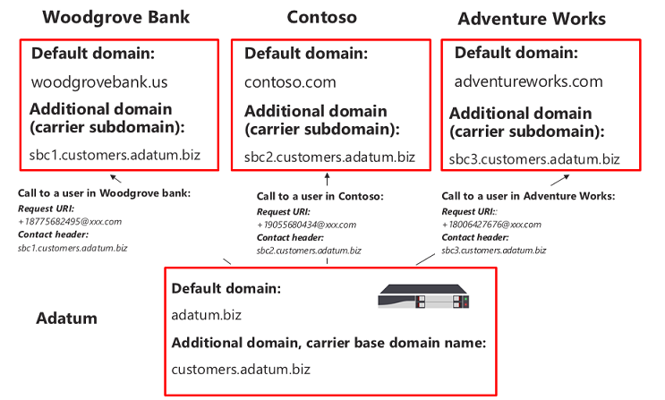

# 여러 테넌트에 대해 세션 경계 컨트롤러 구성

직접 라우팅은 여러 테넌트에 서비스를 제공하기 위해 하나의 SBC(세션 테두리 컨트롤러) 구성을 지원합니다.

> [!NOTE]
> 이 시나리오는 Microsoft 파트너 및/또는 PSTN 통신업체를 위해 설계되어 이 문서의 나중에 통신업체라고 합니다. 통신사는 고객에게 Microsoft Teams 전화 통신 서비스를 판매합니다. 

통신사:
- 데이터 센터에서 SBC를 배포하고 관리합니다(고객은 SBC를 구현할 필요가 없습니다. 클라이언트에서 통신사로부터 Teams 수신).
- SBC를 여러 테넌트에 상호 연결합니다.
- 고객에게 PSTN 서비스를 제공합니다.
- 통화 품질 엔드를 끝까지 관리합니다.
- PSTN 서비스에 대한 요금은 별도로 청구됩니다.

Microsoft는 통신업체를 관리하지 않습니다. Microsoft는 PBX(Microsoft 전화 시스템) 및 Teams 제공합니다. 또한 Microsoft는 휴대폰을 인증하고 시스템과 함께 사용할 수 있는 SBC를 Microsoft 전화 인증합니다. 통신사 선택 전에 선택한 SBC에 인증된 SBC가 있으며 음성 품질 엔드를 끝까지 관리할 수 있는지 확인하시기 바랍니다.

다음은 시나리오를 구성하는 기술 구현 단계입니다.

**캐리어 전용:**
1. 인증된 SBC 공급업체의 지침에 따라 SBC를 배포하고 호스팅 시나리오에 대해 [구성합니다.](#deploy-and-configure-the-sbc)
2. 통신사 테넌트에 기본 도메인 이름을 등록하고 와일드카드 인증서를 요청합니다.
3. 기본 도메인의 일부인 모든 고객에 대해 하위 도메인을 등록합니다.

**고객 글로벌 관리자가 있는 통신사:**
1. 고객 테넌트에 하위종 이름을 추가합니다.
2. 하위omain 이름을 활성화합니다.
3. 통신사에서 고객 테넌트로 트렁크를 구성하고 사용자를 프로비전합니다.

*DNS 기본 및 도메인 이름이 도메인 이름에서 관리되는 방법을 이해해야 Microsoft 365 Office 365. 추가를 [진행하기 전에](https://support.office.com/article/Get-help-with-Office-365-domains-28343f3a-dcee-41b6-9b97-5b0f4999b7ef) Microsoft 365 Office 365 도움말을 참조합니다.*

## SBC 배포 및 구성

SBC 호스팅 시나리오에 대해 SBC를 배포하고 구성하는 방법에 대한 자세한 단계는 SBC 공급업체의 설명서를 참조하세요.

- **AudioCodes:** [직접](https://www.audiocodes.com/solutions-products/products/products-for-microsoft-365/direct-routing-for-Microsoft-Teams)라우팅 구성 노트 , "AudioCodes SBC를 연결하여 직접 라우팅 Microsoft Teams 모델 구성 노트"에 설명된 SBC 호스팅 시나리오의 구성입니다. 
- **Oracle:** [직접 라우팅](https://www.oracle.com/technetwork/indexes/documentation/acme-packet-2228107.html)구성 노트 , SBC 호스팅 시나리오의 구성은 "Microsoft" 섹션에 설명되어 있습니다. 
- **리본 통신:**  리본 코어 시리즈 [SBC를 Microsoft Teams](https://support.sonus.net/display/IOT/PBXs+-+SBC+5k7kSWe) 방법에 대한 설명서는 리본 통신 SBC Core Microsoft Teams 구성 가이드를 참조하세요. 이 페이지 리본 모범 사례 - 직접 라우팅 SBC Edge에 대한 [통신사 Microsoft Teams 참조하세요.](https://support.sonus.net/display/UXDOC81/Connect+SBC+Edge+to+Microsoft+Teams+Direct+Routing+to+Support+Direct+Routing+Carrier)
- **TE-Systems(anynode):**  여러 테넌트에 대해 anynode SBC를 Community 방법에 대한 설명서 및 예제는 [TE-Systems](https://community.te-systems.de/) Community 페이지에 등록하세요.
- **Metaswitch:**  여러 테넌트에 대해 Perimeta SBC를 사용하도록 Community 방법에 대한 설명서는 [Metaswitch](https://manuals.metaswitch.com/MAN39555) Community 페이지에 등록하세요.

> [!NOTE]
> "연락처" 헤더를 구성하는 방법에 유의하시기 바랍니다. 연락처 헤더는 들어오는 초대 메시지에서 고객 테넌트를 찾는 데 사용됩니다. 

## 기본 도메인 및 하위 도메인 등록

호스팅 시나리오의 경우 다음을 만들어야 합니다.
- 통신사가 소유한 하나의 기본 도메인 이름입니다.
- 모든 고객 테넌트의 기본 도메인 이름의 일부인 하위 도메인입니다.

다음 예제에서
- Adatum은 인터넷 및 전화 통신 서비스를 제공하여 여러 고객을 제공하는 통신 사업자입니다.
- Woodgrove Bank, Contoso 및 Adventure Works는 도메인을 Microsoft 365 Office 365 있지만 Adatum에서 전화 통신 서비스를 받는 세 고객입니다.

하위 도마인은 초대를 보내거나 Microsoft 365 보낼 때 고객 및 FQDN에 대해 구성될 트렁크의 FQDN 이름과 일치해야 Office 365.  

직접 라우팅 인터페이스에 Microsoft 365 Office 365 경우 인터페이스는 연락처 헤더를 사용하여 사용자가 검색해야 하는 테넌트를 찾습니다. 일부 고객은 여러 테넌트에서 겹칠 수 있는 비 DID 번호가 있을 수 있습니다. 직접 라우팅은 초대에서 전화 번호 보기를 사용하지 않습니다. 따라서 연락처 헤더의 FQDN 이름은 전화 번호로 사용자를 찾아야 하는 정확한 테넌트 식별에 필요합니다.

*조직 [또는](https://support.office.com/article/Get-help-with-Office-365-domains-28343f3a-dcee-41b6-9b97-5b0f4999b7ef) 조직에서 Office 365 도메인 이름을 만드는 Microsoft 365 Office 365 검토하세요.*

다음 다이어그램에서는 기본 도메인, 하위 도메인 및 연락처 헤더에 대한 요구 사항을 요약합니다.

SBC에 연결을 인증하려면 인증서가 필요합니다. SBC 호스팅 시나리오의 경우 통신사는 CN 및/또는 SAN .base_domain *\* 인증서(예: \* .customers.adatum.biz)를 요청해야 합니다.* 이 인증서는 단일 SBC에서 제공된 여러 테넌트에 대한 연결을 인증하는 데 사용할 수 있습니다.

다음 표는 하나의 구성의 예입니다.

|새 도메인 이름 |유형|등록된  |SBC용 인증서 CN/SAN  |예제의 테넌트 기본 도메인  |사용자에게 전화를 보낼 때 SBC가 연락처 헤더에 있어야 하는 FQDN 이름|
|---------|---------|---------|---------|---------|---------|
|customers.adatum.biz|    기본     |     통신사 테넌트에서  |    \*.customers.adatum.biz  |   adatum.biz      |NA, 이는 서비스 테넌트입니다. |
|sbc1.customers.adatum.biz|    하위마인  |    고객 테넌트에서  |    \*.customers.adatum.biz  | woodgrovebank.us  |  sbc1.customers.adatum.biz|
|sbc2.customers.adatum.biz  |   하위마인 | 고객 테넌트에서   |   \*.customers.adatum.biz   |contoso.com   |sbc2.customers.adatum.biz |
|sbc3.customers.adatum.biz |   하위마인 | 고객 테넌트에서 |   \*.customers.adatum.biz  |  adventureworks.com | sbc3.customers.adatum.biz |
||         |         |         |         |         |

기본 및 하위 종을 구성하기 위해 아래 설명된 단계를 따르세요. 예제에서는 한 고객에 대한 기본 도메인 이름(customers.adatum.biz) 및 하위 도메인(Woodgrove Bank sbc1.customers.adatum.biz)을 구성합니다.

> [!NOTE]
> 통신 sbcX.customers.adatum.biz 테넌트에서 음성을 사용하도록 설정하려면 이 옵션을 사용할 수 있습니다. sbcX는 고유하고 유효한 영 숫자 호스트 이름일 수 있습니다.

## 통신사 테넌트에 기본 도메인 이름 등록

**이러한 작업은 통신사 테넌트에서 수행됩니다.**

### 통신사 테넌트에 적절한 권리가 있는지 확인

전역 관리자로 로그인한 Microsoft 365 관리 센터 새 도메인만 추가할 수 있습니다. 

역할의 유효성을 검사하기 위해 Microsoft 365 관리 센터 (를, 사용자 활성 사용자로 이동한 다음 전역 관리자 역할이 있는지 확인)에 https://portal.office.com)   >  로그인합니다. 

관리자 역할에 대한 자세한 내용은 관리자 역할에 대한 Microsoft 365 Office 365 관리자 역할 정보를 [참조하세요.](https://support.office.com/article/About-Office-365-admin-roles-da585eea-f576-4f55-a1e0-87090b6aaa9d)

### 테넌트에 기본 도메인 추가 및 확인

1. Microsoft 365 관리 센터 도메인 추가 도메인   >  **으로**  >  **이동합니다.**
2. 소유한 **도메인 입력** 상자에 기본 도메인의 FQDN을 입력합니다. 다음 예제에서는 기본 도메인이 *customers.adatum.biz.*

    

3. 다음 **을 클릭합니다.**
4. 이 예제에서 테넌트는 이미 adatum.biz 도메인 이름으로 지정되어 있습니다. 마법사는 이미 등록된 이름에 대한 하위 customers.adatum.biz 때문에 추가 확인을 요청하지 않습니다. 그러나 전에 확인되지 않은 FQDN을 추가하는 경우 확인 프로세스를 진행해야 합니다. 확인 프로세스는 [아래에 설명되어 있습니다.](#add-a-subdomain-to-the-customer-tenant-and-verify-it)

    

5. 다음 **을** **클릭하고 DNS** 업데이트 설정 페이지에서 **DNS** 레코드를 스스로 추가하고 다음을 **클릭합니다.**
6. 다음 페이지에서 모든 값을 선택 취소합니다(도메인 이름을 Exchange, SharePoint 또는 Teams/비즈니스용 Skype) 다음을 클릭한 다음 마침을 **클릭합니다.**  새 도메인이 설정 완료 상태인지 확인 합니다.

    

### 도메인 이름 활성화

도메인 이름을 등록한 후 라이선스가 있는 사용자를 하나 이상 추가하고 만든 기본 도메인과 일치하는 SIP 주소의 FQDN 전화 시스템 SIP 주소를 할당하여 활성화해야 합니다. 도메인 활성화 후 라이선스를 해지할 수 있습니다(최대 24시간이 걸릴 수 있습니다).

> [!NOTE]
> Carrier 테넌트는 테넌트에 할당된 전화 시스템 하나 이상의 라이선스를 유지해야 비즈니스용 Skype 합니다. 

*사용자 [추가에](https://support.office.com/article/Get-help-with-Office-365-domains-28343f3a-dcee-41b6-9b97-5b0f4999b7ef) 대한 자세한 내용은 Microsoft 365 또는 Office 365 도메인에 대한 도움말 Microsoft 365 Office 365 참조하세요.*

예: test@customers.adatum.biz

## 고객 테넌트에 하위 종 이름 등록

모든 고객에 대해 고유한 하위omain 이름을 만들어야 합니다. 이 예제에서는 기본 도메인 이름이 sbc1.customers.adatum.biz 테넌트에 하위 도메인 woodgrovebank.us.

**아래 모든 작업은 고객 테넌트에 있습니다.**

### 고객 테넌트에 대한 적절한 권한 확인

전역 관리자로 로그인한 Microsoft 365 관리 센터 새 도메인만 추가할 수 있습니다. 

역할의 유효성을 검사하기 위해 Microsoft 365 관리 센터 (를, 사용자 활성 사용자로 이동한 다음 전역 관리자 역할이 있는지 확인)에 https://portal.office.com)   >  로그인합니다. 

관리자 역할에 대한 자세한 내용은 관리자 역할에 대한 Microsoft 365 Office 365 관리자 역할 정보를 [참조하세요.](https://support.office.com/article/About-Office-365-admin-roles-da585eea-f576-4f55-a1e0-87090b6aaa9d)

### 고객 테넌트에 하위종 추가 및 확인
1. Microsoft 365 관리 센터 도메인 추가 도메인   >  **으로**  >  **이동합니다.**
2. 소유한 **도메인** 입력 상자에 이 테넌트의 하위 도메인의 FQDN을 입력합니다. 아래 예제에서는 하위 sbc1.customers.adatum.biz.

    

3. 다음 **을 클릭합니다.**
4. FQDN은 테넌트에 등록된 적이 없습니다. 다음 단계에서는 도메인을 확인해야 합니다. 대신 **TXT 레코드 추가를 선택합니다.** 

    

5. 다음 **을** 클릭하고 생성된 TXT 값을 참고하여 도메인 이름을 확인할 수 있습니다.

    

6. 이동통신사 DNS 호스팅 공급자의 이전 단계에서 값을 사용하여 TXT 레코드를 생성합니다.

    

    자세한 내용은 DNS 호스팅 공급자의 [DNS 레코드 만들기를 참조하세요.](https://support.office.com/article/create-dns-records-at-any-dns-hosting-provider-for-office-365-7b7b075d-79f9-4e37-8a9e-fb60c1d95166)

7. 고객의 계정으로 돌아가서 Microsoft 365 관리 센터 **을 클릭합니다.** 
8. 다음 페이지에서 **DNS** 레코드를 스스로 추가하고 다음 을 **클릭합니다.**

    

9. 온라인 서비스 **선택 페이지에서** 모든 옵션을 선택 취소하고 다음 을 **클릭합니다.**

    

10. DNS **설정** 업데이트 **페이지에서 완료를 클릭합니다.**

    

11. 상태가 설정이 **완료된지 확인** 
    
    
    
> [!NOTE]
> 개별 클라이언트에 대한 기본 URL 및 하위 종은 직접 경로 트렁크를 추가할 수 있도록 동일한 테넌트에 _있습니다._

### 하위 종 이름 활성화

도메인 이름을 등록한 후 하나 이상의 사용자를 추가하여 활성화하고 고객 테넌트에서 만든 하위 도메인과 일치하는 SIP 주소의 FQDN 부분으로 SIP 주소를 할당해야 합니다. 하위종 정품 인증 후 라이선스를 해지할 수 있습니다(최대 24시간이 걸릴 수 있습니다).

*사용자 [추가에](https://support.office.com/article/Get-help-with-Office-365-domains-28343f3a-dcee-41b6-9b97-5b0f4999b7ef) 대한 자세한 내용은 Microsoft 365 또는 Office 365 도메인에 대한 도움말 Microsoft 365 Office 365 참조하세요.*

예: test@sbc1.customers.adatum.biz

### 트렁크 만들기 및 프로비전 사용자 만들기

직접 라우팅의 초기 릴리스와 함께 Microsoft는 New-CSOnlinePSTNGateway를 사용하여 제공된 각 테넌트(고객 테넌트)에 트렁크를 추가해야 합니다.

그러나 다음 두 가지 이유로 최적으로 증명되지는 않습니다.
 
- **오버헤드 관리.** 예를 들어 SBC를 오프로드하거나 드레인하는 경우 미디어 우회 사용 또는 사용 안 끄기와 같은 일부 매개 변수가 변경됩니다. 포트를 변경하려면 (Set-CSOnlinePSTNGateway를 실행하여) 여러 테넌트에서 매개 변수를 변경해야 하지만 실제로는 동일한 SBC입니다. 

-  **오버헤드 처리 입니다.** 트렁크 상태 데이터 수집 및 모니터링 - 실제로 동일한 SBC 및 동일한 물리적 트렁크인 여러 논리 트렁크에서 수집된 SIP 옵션은 라우팅 데이터의 처리 속도를 늦출 수 있습니다.
 
이 피드백을 기반으로 Microsoft는 고객 테넌트에 대한 트렁크를 프로비전하는 새로운 논리를 제공합니다.

두 개의 새 엔터티가 도입됩니다.
-    New-CSOnlinePSTNGateway 명령을 사용하여 캐리어 테넌트에 등록된 통신사 트렁크(예: New-CSOnlinePSTNGateway -FQDN customers.adatum.biz -SIPSignalingport 5068 -ForwardPAI $true.

-    등록이 필요하지 않은 파생 트렁크입니다. 캐리어 트렁크에서 추가된 원하는 호스트 이름입니다. 캐리어 트렁크에서 모든 구성 매개 변수를 파생합니다. PowerShell에서 파생된 트렁크를 만들 필요가 없습니다. 통신사 트렁크와의 연결은 FQDN 이름(아래 세부 정보 참조)을 기반으로 합니다.

**프로비전 논리 및 예제**

-    통신사는 단일 트렁크(통신사 도메인의 캐리어 트렁크)를 설정하고 관리하기만 Set-CSOnlinePSTNGateway 합니다. 위의 예제에서는 adatum.biz.
-    고객 테넌트에서 통신사는 파생된 트렁크 FQDN을 사용자의 음성 라우팅 정책에 추가해야 합니다. 트렁크에 대한 New-CSOnlinePSTNGateway 실행할 필요가 있습니다.
-    이름에서 알 수 있 처럼 파생된 트렁크는 캐리어 트렁크에서 모든 구성 매개 변수를 상속하거나 파생합니다. 예제:
-    Customers.adatum.biz - 캐리어 테넌트에서 만들어야 하는 캐리어 트렁크입니다.
-    Sbc1.customers.adatum.biz - PowerShell에서 만들 필요가 없는 고객 테넌트의 파생된 트렁크입니다.  파생된 트렁크의 이름을 만들지 않고 온라인 음성 라우팅 정책에서 고객 테넌트에 추가할 수 있습니다.
-   통신 사업자는 파생된 트렁크 FQDN을 통신사 SBC IP 주소로 확인하여 DNS 레코드를 설정해야 합니다.

-    캐리어 트렁크의 변경 내용(캐리어 테넌트)은 파생된 트렁크에 자동으로 적용됩니다. 예를 들어 캐리어는 통신사 트렁크에서 SIP 포트를 변경할 수 있으며, 이 변경은 파생된 모든 트렁크에 적용됩니다. 트렁크를 구성하는 새 논리는 모든 테넌트로 이동하고 모든 트렁크의 매개 변수를 변경할 필요가 없습니다.
-    옵션은 캐리어 트렁크 FQDN으로만 전송됩니다. 캐리어 트렁크의 상태는 파생된 모든 트렁크에 적용되고 라우팅 결정에 사용됩니다. 직접 라우팅 [옵션에 대한 자세한 내용은 를 선택합니다.](./direct-routing-monitor-and-troubleshoot.md)
-    캐리어는 캐리어 트렁크를 드레인할 수 있으며, 파생된 모든 트렁크도 드레인됩니다. 
 
> [!NOTE]
> 캐리어 트렁크에 적용된 숫자 번역 규칙은 파생된 트렁크에 적용되지 않습니다. 알려진 문제입니다. 대체 솔루션으로 각 고객의 테넌트에 대한 번호 변환 규칙을 만들어야 합니다.

**이전 모델에서 통신사 트렁크로 마이그레이션**
 
통신사 호스팅 모델의 현재 구현에서 새 모델로 마이그레이션하려면 통신사는 고객 테넌트에 대한 트렁크를 다시 구성해야 합니다. 고객 테넌트에서 트렁크를 제거합니다(Remove-CSOnlinePSTNGateway 테넌트에 트렁크를 남기고)

캐리어 및 파생 트렁크 모델을 사용하여 모니터링 및 프로비전을 강화하는 것이 좋습니다.
 

연락처 헤더에서 하위 종의 FQDN 이름을 보내는 구성에 대한 [SBC](#deploy-and-configure-the-sbc) 공급업체 지침을 참조하세요.

## muti-tenant 장애 조치(failover) 설정 고려 사항 

다중 테넌트 환경에 대한 장애 조치(failover)를 설정하려면 다음을 해야 합니다.

- 각 테넌트에 대해 두 개의 서로 다른 SBC에 대한 FQDNS를 추가합니다.  예를 들면 다음과 같습니다.

   customer1.sbc1.contoso.com  
   customer1.sbc2.contoso.com  

- 사용자의 온라인 음성 라우팅 정책에서 두 SBC를 모두 지정합니다.  하나의 SBC가 실패하면 라우팅 정책은 두 번째 SBC로 호출을 라우팅합니다.

## 참고 항목

[직접 라우팅 계획](direct-routing-plan.md)

[직접 라우팅 구성](direct-routing-configure.md)
