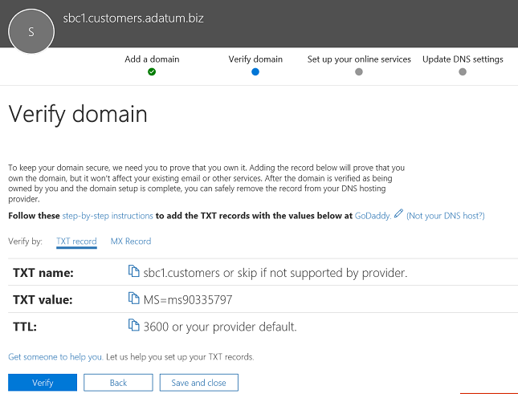

# 여러 테넌트에 대해 세션 경계 컨트롤러 구성Configure a Session Border Controller for multiple tenants

직접 라우팅은 여러 테넌트에 제공될 하나의 SBC(세션 테두리 컨트롤러)를 구성할 수 있습니다.Direct Routing supports configuring one Session Border Controller (SBC) to serve multiple tenants.

> [!NOTE]
> 이 시나리오는 Microsoft 파트너 및/또는 PSTN 통신 사업자용으로 설계되어 이 문서의 후반부에서 통신 사업자라고 합니다.This scenario is designed for Microsoft partners and/or PSTN carriers, referred to as carriers later in this document. 통신 사업자에서 고객에게 Microsoft Teams에 배달된 전화 통신 서비스를 판매합니다.A carrier sells telephony services delivered to Microsoft Teams to their customers. 

통신사:A carrier:
- 데이터 센터에서 SBC를 배포하고 관리합니다(고객은 SBC를 구현할 필요가 없습니다. Teams 클라이언트의 통신사로부터 전화 통신 서비스를 수신함).Deploys and manages an SBC in their datacenter (customers do not need to implement an SBC, and they receive telephony services from the carrier in the Teams client).
- SBC를 여러 테넌트에 상호 연결합니다.Interconnects the SBC to multiple tenants.
- 고객에게 PSTN 서비스를 제공합니다.Provides PSTN services to customers.
- 통화 품질 종단을 관리합니다.Manages call quality end to end.
- PSTN 서비스에 대한 요금은 별도로 청구됩니다.Charges separately for PSTN services.

Microsoft는 통신업체를 관리하지 않습니다.Microsoft does not manage carriers. Microsoft는 PBX(Microsoft Phone System) 및 Teams 클라이언트를 제공합니다.Microsoft offers a PBX (Microsoft Phone System) and a Teams client. 또한 Microsoft는 휴대폰을 인증하고 Microsoft Phone System에서 사용할 수 있는 SBC를 인증합니다.Microsoft also certifies phones, and certifies SBCs that can be used with the Microsoft Phone System. 통신 사업자 선택 전에 선택한 SBC에 인증된 SBC가 있으며 음성 품질 엔드를 관리할 수 있도록 합니다.Before choosing a carrier, please ensure that your choice has a certified SBC and can manage voice quality end to end.

다음은 시나리오를 구성하는 기술 구현 단계입니다.The following are the technical implementation steps to configure the scenario.

**통신 사업자만:****Carrier only:**
1. SBC를 배포하고 인증된 SBC 공급업체의 지침에 따라 호스팅 시나리오에 대해 [구성합니다.](#deploy-and-configure-the-sbc)Deploy the SBC and configure it for the hosting scenario according to the [instructions from the certified SBC vendors](#deploy-and-configure-the-sbc).
2. 통신 사업자 테넌트에 기본 도메인 이름을 등록하고 와일드카드 인증서를 요청합니다.Register a base domain name in the carrier tenant and request a wildcard certificate.
3. 기본 도메인의 일부인 모든 고객에 대해 하위 도메인을 등록합니다.Register a subdomain for every customer, which is part of the base domain.

**고객 전역 관리자를 통해 통신 사업자:****Carrier with a Customer Global Administrator:**
1. 고객 테넌트에 하위omain 이름을 추가합니다.Add the subdomain name to the customer tenant.
2. 하위omain 이름을 활성화합니다.Activate the subdomain name.
3. 통신 사업자에서 고객 테넌트로 트렁크를 구성하고 사용자를 프로비전합니다.Configure the trunk from the carrier to the customer tenant and provision users.

*DNS 기본 및 도메인 이름이 Microsoft 365 또는 Office 365에서 관리되는 방법을 이해해야 합니다. 계속하기 [전에 Microsoft 365 또는 Office 365](https://support.office.com/article/Get-help-with-Office-365-domains-28343f3a-dcee-41b6-9b97-5b0f4999b7ef) 도메인에 대한 도움말을 검토합니다.**Please make sure you understand DNS basics and how the domain name is managed in Microsoft 365 or Office 365. Review [Get help with Microsoft 365 or Office 365 domains](https://support.office.com/article/Get-help-with-Office-365-domains-28343f3a-dcee-41b6-9b97-5b0f4999b7ef) before proceeding further.*

## SBC 배포 및 구성Deploy and configure the SBC

SBC 호스팅 시나리오에 대한 SBC를 배포하고 구성하는 방법에 대한 자세한 단계는 SBC 공급업체의 설명서를 참조하세요.For the detailed steps on how to deploy and configure SBCs for an SBC hosting scenario, please refer to the SBC vendor's documentation.

- **AudioCodes:** [직접](https://www.audiocodes.com/solutions-products/products/products-for-microsoft-365/direct-routing-for-Microsoft-Teams)라우팅 구성 정보 , "AudioCodes SBC를 Microsoft Teams 직접 라우팅 호스팅 호스팅 모델 구성 메모"에 설명된 SBC 호스팅 시나리오의 구성입니다.**AudioCodes:** [Direct Routing Configuration notes](https://www.audiocodes.com/solutions-products/products/products-for-microsoft-365/direct-routing-for-Microsoft-Teams), the configuration of the SBC hosting scenario described in "Connecting AudioCodes SBC to Microsoft Teams Direct Routing Hosting Model Configuration Note." 
- **Oracle:** [직접 라우팅](https://www.oracle.com/technetwork/indexes/documentation/acme-packet-2228107.html)구성 정보 , SBC 호스팅 시나리오의 구성은 "Microsoft" 섹션에 설명되어 있습니다.**Oracle:** [Direct Routing Configuration notes](https://www.oracle.com/technetwork/indexes/documentation/acme-packet-2228107.html), the configuration of the SBC hosting scenario is described in the "Microsoft" section. 
- **리본 메뉴 통신:**  리본 코어 시리즈 [SB를](https://support.sonus.net/display/IOT/PBXs+-+SBC+5k7kSWe) 구성하는 방법에 대한 설명서 및 이 페이지 리본 메뉴 모범 사례 - Microsoft Teams 직접 라우팅 [SBC Edge에](https://support.sonus.net/display/UXDOC81/Connect+SBC+Edge+to+Microsoft+Teams+Direct+Routing+to+Support+Direct+Routing+Carrier) 대한 통신 사업자 구성에 대한 설명서는 리본 통신 SBC Core Microsoft Teams 구성 가이드를 참조하세요.**Ribbon Communications:**  Please refer to the [Ribbon Communications SBC Core Microsoft Teams Configuration Guide](https://support.sonus.net/display/IOT/PBXs+-+SBC+5k7kSWe) for documentation on how to configure Ribbon Core Series SBCs and to this page [Ribbon Best Practice - Configuring Carriers for Microsoft Teams Direct Routing SBC Edge](https://support.sonus.net/display/UXDOC81/Connect+SBC+Edge+to+Microsoft+Teams+Direct+Routing+to+Support+Direct+Routing+Carrier)
- **TE-Systems(anynode):**  여러 테넌트에 대해 임의 SBC를 구성하는 방법에 대한 설명서 및 예제는 [TE-Systems](https://community.te-systems.de/) 커뮤니티 페이지에 등록하세요.**TE-Systems (anynode):**  Please register on the [TE-Systems Community page](https://community.te-systems.de/) for documentation and examples on how to configure anynode SBC for multiple tenants.
- **Metaswitch:**  여러 테넌트에 Perimeta SBC를 사용하도록 설정하는 방법에 대한 설명서는 [Metaswitch](https://manuals.metaswitch.com/MAN39555) 커뮤니티 페이지에 등록하세요.**Metaswitch:**  Please register on the [Metaswitch Community page](https://manuals.metaswitch.com/MAN39555) for documentation on how to enable Perimeta SBC for multiple tenants.

> [!NOTE]
> "연락처" 헤더를 구성하는 방법에 주의합니다.Please pay attention to how to configure the "Contact" header. 연락처 헤더는 들어오는 초대 메시지에서 고객 테넌트 찾기에 사용됩니다.The Contact header is used to find the customer tenant on the incoming invite message. 

## 기본 도메인 및 하위 도메인 등록Register a base domain and subdomains

호스팅 시나리오의 경우 다음을 만들어야 합니다.For the hosting scenario, you need to create:
- 운송업체가 소유한 하나의 기본 도메인 이름입니다.One base domain name owned by the carrier.
- 모든 고객 테넌트에서 기본 도메인 이름의 일부인 하위 도메인입니다.A subdomain that is part of the base domain name in every customer tenant.

다음 예제에서는In the following example:
- Adatum은 인터넷 및 전화 통신 서비스를 제공하여 여러 고객에게 서비스를 제공하는 통신 사업자입니다.Adatum is a carrier that serves several customers by providing Internet and telephony services.
- Woodgrove Bank, Contoso 및 Adventure Works는 Microsoft 365 또는 Office 365 도메인을 사용하지만 Adatum에서 전화 통신 서비스를 받는 세 가지 고객입니다.Woodgrove Bank, Contoso, and Adventure Works are three customers that have Microsoft 365 or Office 365 domains but receive the telephony services from Adatum.

하위 도마는  Microsoft 365 또는 Office 365에 초대를 보낼 때 고객에 대해 구성될 트렁크의 FQDN 이름과 연락처 헤더의 FQDN과 일치해야 합니다.Subdomains **MUST** match the FQDN name of the trunk that will be configured for the customer and the FQDN in the Contact header when sending the Invite to Microsoft 365 or Office 365. 

Microsoft 365 또는 Office 365 직접 라우팅 인터페이스에 호출이 도착하면 인터페이스는 Contact 헤더를 사용하여 사용자를 검색해야 하는 테넌트를 찾을 수 있습니다.When a call arrives at the Microsoft 365 or Office 365 Direct Routing interface, the interface uses the Contact header to find the tenant where the user should be looked up. 일부 고객에게는 여러 테넌트에서 겹칠 수 있는 DID이 아닌 번호가 있을 수 있습니다.Direct Routing does not use phone number lookup on the Invite, as some customers might have non-DID numbers that can overlap in several tenants. 따라서 연락처 헤더의 FQDN 이름은 전화 번호로 사용자를 찾아야 하는 정확한 테넌트 식별에 필요합니다.Therefore, the FQDN name in the Contact header is required to identify the exact tenant to look up the user by the phone number.

*Microsoft  [365 또는 Office 365](https://support.office.com/article/Get-help-with-Office-365-domains-28343f3a-dcee-41b6-9b97-5b0f4999b7ef) 조직에서 도메인 이름을 만드는 데 대한 자세한 내용은 Office 365 도메인에 대한 도움말을 검토하세요.**Please review  [Get help with Office 365 domains](https://support.office.com/article/Get-help-with-Office-365-domains-28343f3a-dcee-41b6-9b97-5b0f4999b7ef) for more information about creating domain names in Microsoft 365 or Office 365 organizations.*

다음 다이어그램에서는 기본 도메인, 하위 도메인 및 연락처 헤더에 대한 요구 사항을 요약합니다.The following diagram summarizes the requirements to base domain, subdomains, and Contact header.

SBC는 연결을 인증하기 위해 인증서가 필요합니다.The SBC requires a certificate to authenticate the connections. SBC 호스팅 시나리오의 경우 통신 사업자는 CN 및/또는 SAN을 통해 인증서를 요청해야 *\* .base_domain(예: \* .customers.adatum.biz).*For the SBC hosting scenario, the carrier needs to request a certificate with CN and/or SAN *\*.base_domain (for example, \*.customers.adatum.biz)*. 이 인증서를 사용하여 단일 SBC에서 제공된 여러 테넌트에 대한 연결을 인증할 수 있습니다.This certificate can be used to authenticate connections to multiple tenants served from a single SBC.

다음 표는 하나의 구성의 예입니다.The following table is an example of one configuration.

|새 도메인 이름New domain name |유형Type|등록Registered  |SBC용 인증서 CN/SANCertificate CN/SAN for SBC  |예제의 테넌트 기본 도메인Tenant default domain in the example  |사용자에게 전화를 보낼 때 SBC가 연락처 헤더에 있어야 하는 FQDN 이름FQDN name that SBC must present in the Contact header when sending calls to users|
|---------|---------|---------|---------|---------|---------|
|customers.adatum.bizcustomers.adatum.biz|    기본Base     |     통신 사업자 테넌트In carrier tenant  |    \*.customers.adatum.biz\*.customers.adatum.biz  |   adatum.bizadatum.biz      |NA, 서비스 테넌트, 사용자 없음NA, this is a service tenant, no users |
|sbc1.customers.adatum.bizsbc1.customers.adatum.biz|    하위omainSubdomain  |    고객 테넌트에서In a customer tenant  |    \*.customers.adatum.biz\*.customers.adatum.biz  | woodgrovebank.uswoodgrovebank.us  |  sbc1.customers.adatum.bizsbc1.customers.adatum.biz|
|sbc2.customers.adatum.bizsbc2.customers.adatum.biz  |   하위omainSubdomain | 고객 테넌트에서In a customer tenant   |   \*.customers.adatum.biz\*.customers.adatum.biz   |contoso.comcontoso.com   |sbc2.customers.adatum.bizsbc2.customers.adatum.biz |
|sbc3.customers.adatum.bizsbc3.customers.adatum.biz |   하위omainSubdomain | 고객 테넌트에서In a customer tenant |   \*.customers.adatum.biz\*.customers.adatum.biz  |  adventureworks.comadventureworks.com | sbc3.customers.adatum.bizsbc3.customers.adatum.biz |
||         |         |         |         |         |

기본 및 하위 배포를 구성하기 위해 아래에 설명된 단계를 따르세요.To configure the base and subdomains, please follow the steps described below. 이 예제에서는 한 고객에 대한 기본 도메인 이름(customers.adatum.biz) 및 하위 도메인(Woodgrove Bank 테넌트의 sbc1.customers.adatum.biz)을 구성합니다.In the example, we will configure a base domain name (customers.adatum.biz) and a subdomain for one customer (sbc1.customers.adatum.biz in Woodgrove Bank tenant).

> [!NOTE]
> 통신 sbcX.customers.adatum.biz 사용하여 통신사 테넌트에서 음성을 사용하도록 설정할 수 있습니다.Use sbcX.customers.adatum.biz to enable voice in the carrier tenant. sbcX는 고유하고 유효한 영자 호스트 이름일 수 있습니다.sbcX can be any unique and valid alphanumeric hostname.

## 운송업체 테넌트에 기본 도메인 이름 등록Register a base domain name in the carrier tenant

**이러한 작업은 통신 사업자 테넌트에서 수행됩니다.****These actions are performed in the carrier tenant.**

### 운송업체 테넌트에 적절한 권한을 가졌다고 확인Ensure that you have appropriate rights in the carrier tenant

전역 관리자로 Microsoft 365 관리 센터에 로그인한 경우 새 도메인을 추가할 수 있습니다.You can only add new domains if you signed in to the Microsoft 365 admin center as a Global Administrator. 

역할의 유효성을 검사하려면 Microsoft 365 관리 센터에 로그인합니다(사용자 활성 사용자로 이동한 다음 전역 관리자 역할이 https://portal.office.com)   >  있는지 확인).To validate the role you have, please sign in to the Microsoft 365 admin center (https://portal.office.com), go to **Users** > **Active Users**, and then verify that you have a Global Administrator role. 

관리자 역할 및 Microsoft 365 또는 Office 365에서 역할을 할당하는 방법에 대한 자세한 내용은 관리자 역할 정보를 [참조하세요.](https://support.office.com/article/About-Office-365-admin-roles-da585eea-f576-4f55-a1e0-87090b6aaa9d)For more information about admin roles and how to assign a role in Microsoft 365 or Office 365, see [About admin roles](https://support.office.com/article/About-Office-365-admin-roles-da585eea-f576-4f55-a1e0-87090b6aaa9d).

### 테넌트에 기본 도메인 추가 및 확인Add a base domain to the tenant and verify it

1. Microsoft 365 관리 센터에서 **설정** 도메인 추가  >    >  **도메인으로 이동하세요.**In the Microsoft 365 admin center, go to **Setup** > **Domains** > **Add domain**.
2. 소유한 도메인 **입력** 상자에 기본 도메인의 FQDN을 입력합니다.In the **Enter a domain you own** box, type the FQDN of the base domain. 다음 예제에서는 기본 도메인이 *customers.adatum.biz.*In the following example, the base domain is *customers.adatum.biz*.

    

3. 다음을 **클릭합니다.**Click **Next**.
4. 이 예제에서 테넌트는 이미 확인된 도메인 adatum.biz 이름입니다.In the example, the tenant already has adatum.biz as a verified domain name. 마법사는 이미 등록된 이름의 하위 customers.adatum.biz 추가 확인을 요청하지 않습니다.The wizard will not ask for additional verification because customers.adatum.biz is a subdomain for the already registered name. 그러나 전에 확인되지 않은 FQDN을 추가하는 경우 확인 프로세스를 진행해야 합니다.However, if you add an FQDN that has not been verified before, you will need to go through the process of verification. 확인 프로세스는 [아래에 설명되어 있습니다.](#add-a-subdomain-to-the-customer-tenant-and-verify-it)The process of verification is [described below](#add-a-subdomain-to-the-customer-tenant-and-verify-it).

    

5. **다음을** 클릭하고 **DNS** 설정 업데이트 페이지에서 **DNS** 레코드를 자신을 추가하고 다음을 **클릭합니다.**Click **Next**, and on the **Update DNS Settings** page, select **I'll add the DNS records myself** and click **Next**.
6. 다음 페이지에서 Exchange, SharePoint 또는 Teams/비즈니스용 Skype에 도메인 이름을 사용하지 않는 한 모든 값을 지우고 다음을 클릭한 다음 마침을 **클릭합니다.**On the next page, clear all values (unless you want to use the domain name for Exchange, SharePoint, or Teams/Skype for Business), click **Next**, and then click **Finish**. 새 도메인이 설치 완료 상태인지 확인Make sure your new domain is in the Setup complete status.

    

### 도메인 이름 활성화Activate the domain name

도메인 이름을 등록한 후 전화 시스템 라이선스가 있는 사용자를 하나 이상 추가하고 만든 기본 도메인과 일치하는 SIP 주소의 FQDN 부분이 있는 SIP 주소를 할당하여 도메인 이름을 활성화해야 합니다.After you have registered a domain name, you need to activate it by adding at least one user with Phone System license and assigning a SIP address with the FQDN portion of the SIP address matching the created base domain. 도메인 활성화 후 라이선스를 해지할 수 있습니다(최대 24시간이 걸릴 수 있습니다).License can be revoked after the domain activation (it can take up to 24 hours).

> [!NOTE]
> 통신사 테넌트는 비즈니스용 Skype 구성을 제거하지 않도록 테넌트에 할당된 하나 이상의 전화 시스템 라이선스를 유지해야 합니다.The Carrier tenant must keep at least one Phone System license assigned to the tenant to avoid removal of the Skype for Business configuration. 

*Microsoft [365 또는 Office 365](https://support.office.com/article/Get-help-with-Office-365-domains-28343f3a-dcee-41b6-9b97-5b0f4999b7ef) 조직에서 사용자 추가에 대한 자세한 내용은 Microsoft 365 또는 Office 365 도메인에 대한 도움말을 검토하세요.**Please review [Get help with Microsoft 365 or Office 365 domains](https://support.office.com/article/Get-help-with-Office-365-domains-28343f3a-dcee-41b6-9b97-5b0f4999b7ef) for more information about adding users in Microsoft 365 or Office 365 organizations.*

예: test@customers.adatum.bizFor example: test@customers.adatum.biz

## 고객 테넌트에 하위omain 이름 등록Register a subdomain name in a customer tenant

모든 고객에 대해 고유한 하위omain 이름을 만들어야 합니다.You will need to create a unique subdomain name for every customer. 이 예제에서는 기본 도메인 이름이 sbc1.customers.adatum.biz 테넌트에 하위 도메인 woodgrovebank.us.In this example, we will create a subdomain sbc1.customers.adatum.biz in a tenant with the default domain name woodgrovebank.us.

**아래 모든 작업은 고객 테넌트에 있습니다.****All actions below are in the customer tenant.**

### 고객 테넌트에 적절한 권한을 가야 합니다.Ensure that you have appropriate rights in the customer tenant

전역 관리자로 Microsoft 365 관리 센터에 로그인한 경우 새 도메인을 추가할 수 있습니다.You can only add new domains if you signed in to the Microsoft 365 admin center as a Global Administrator. 

역할의 유효성을 검사하려면 Microsoft 365 관리 센터에 로그인합니다(사용자 활성 사용자로 이동한 다음 전역 관리자 역할이 https://portal.office.com)   >  있는지 확인).To validate the role you have, please sign in to the Microsoft 365 admin center (https://portal.office.com), go to **Users** > **Active Users**, and then verify that you have a Global Administrator role. 

관리자 역할 및 Microsoft 365 또는 Office 365에서 역할을 할당하는 방법에 대한 자세한 내용은 관리자 역할 정보를 [참조하세요.](https://support.office.com/article/About-Office-365-admin-roles-da585eea-f576-4f55-a1e0-87090b6aaa9d)For more information about admin roles and how to assign a role in Microsoft 365 or Office 365, see [About admin roles](https://support.office.com/article/About-Office-365-admin-roles-da585eea-f576-4f55-a1e0-87090b6aaa9d).

### 고객 테넌트에 하위omain을 추가하고 확인Add a subdomain to the customer tenant and verify it
1. Microsoft 365 관리 센터에서 **설정** 도메인 추가  >    >  **도메인으로 이동하세요.**In the Microsoft 365 admin center, go to **Setup** > **Domains** > **Add domain**.
2. 소유한 도메인 **입력** 상자에 이 테넌트에 대한 하위 도메인의 FQDN을 입력합니다.In the **Enter a domain you own** box, type the FQDN of the subdomain for this tenant. 아래 예제에서는 하위 sbc1.customers.adatum.biz.In the example below, the subdomain is sbc1.customers.adatum.biz.

    

3. 다음을 **클릭합니다.**Click **Next**.
4. FQDN은 테넌트에 등록된 적이 없습니다.The FQDN has never been registered in the tenant. 다음 단계에서는 도메인을 확인해야 합니다.In the next step, you will need to verify the domain. 대신 **TXT 레코드 추가를 선택합니다.**Select **Add a TXT record instead**. 

    

5. 다음을 **클릭하고** 도메인 이름을 확인하기 위해 생성된 TXT 값을 메모합니다.Click **Next**, and note the TXT value generated to verify the domain name.

    

6. 통신업체의 DNS 호스팅 공급자에서 이전 단계의 값을 사용하여 TXT 레코드를 생성합니다.Create the TXT record with the value from the previous step in carrier's DNS hosting provider.

    

    자세한 내용은 DNS 호스팅 공급자에서 [DNS 레코드 만들기를 참조하세요.](https://support.office.com/article/create-dns-records-at-any-dns-hosting-provider-for-office-365-7b7b075d-79f9-4e37-8a9e-fb60c1d95166)For more information, refer to [Create DNS records at any DNS hosting provider](https://support.office.com/article/create-dns-records-at-any-dns-hosting-provider-for-office-365-7b7b075d-79f9-4e37-8a9e-fb60c1d95166).

7. 고객의 Microsoft 365 관리 센터로 돌아가서 확인을 **클릭합니다.**Go back to the customer's Microsoft 365 admin center and click **Verify**. 
8. 다음 페이지에서 **DNS** 레코드를 자신을 추가하고 다음을 **클릭합니다.**On the next page, select **I'll add the DNS records myself** and click **Next**.

    

9. 온라인 서비스 **선택 페이지에서** 모든 옵션을 선택 취소하고 다음을 **클릭합니다.**On the **Choose your online services** page, clear all options and click **Next**.

    

10. DNS **설정** 업데이트 페이지에서 **마쳤습니다.**Click **Finish** on the **Update DNS settings** page.

    

11. 상태가 설정 완료 **상태인지 확인**Ensure that the status is **Setup complete**. 
    
    
    
> [!NOTE]
> 직접 경로 트렁크를 추가할 수 있도록 개별 클라이언트의 기본 URL 및 하위 도마인이 동일한 테넌트에 _있을_ 수 있습니다.The base URL and the subdomain for the individual client have to be on the same tenant to enable you to add a _direct route_ trunk.

### 하위omain 이름 활성화Activate the subdomain name

도메인 이름을 등록한 후 하나 이상의 사용자를 추가하여 활성화하고 고객 테넌트에서 만든 하위 도메인과 일치하는 SIP 주소의 FQDN 부분이 있는 SIP 주소를 할당해야 합니다.After you register a domain name, you need to activate it by adding at least one user and assign a SIP address with the FQDN portion of the SIP address matching the created subdomain in the customer tenant. 하위 배포 활성화 후 사용자로부터 라이선스를 해지할 수 있습니다(최대 24시간이 걸릴 수 있습니다).License can be revoked from user after the subdomain activation (it can take up to 24 hours).

*Microsoft [365 또는 Office 365](https://support.office.com/article/Get-help-with-Office-365-domains-28343f3a-dcee-41b6-9b97-5b0f4999b7ef) 조직에서 사용자 추가에 대한 자세한 내용은 Microsoft 365 또는 Office 365 도메인에 대한 도움말을 검토하세요.**Please review [Get help with Microsoft 365 or Office 365 domains](https://support.office.com/article/Get-help-with-Office-365-domains-28343f3a-dcee-41b6-9b97-5b0f4999b7ef) for more information about adding users in Microsoft 365 or Office 365 organizations.*

예: test@sbc1.customers.adatum.bizFor example: test@sbc1.customers.adatum.biz

### 트렁크 만들기 및 사용자 프로비전Create a trunk and provision users

직접 라우팅의 초기 릴리스에서 Microsoft는 New-CSOnlinePSTNGateway를 사용하여 제공된 각 테넌트(고객 테넌트)에 트렁크를 추가해야 합니다.With the initial release of Direct Routing, Microsoft required a trunk to be added to each served tenant (customer tenant) using New-CSOnlinePSTNGateway.

그러나 다음 두 가지 이유로 최적으로 입증되지는 못합니다.However, this has not proved optimal for two reasons:
 
- **오버헤드 관리.****Overhead management**. 예를 들어 SBC의 오프로드 또는 드레인은 미디어 우회 사용 또는 사용 안 끄기와 같은 일부 매개 변수를 변경합니다.Offloading or draining an SBC, for example, changes some parameters, like enabling or disabling media bypass. 포트를 변경하려면 (Set-CSOnlinePSTNGateway를 실행하여) 여러 테넌트에서 매개 변수를 변경해야 하지만 실제로는 동일한 SBC입니다.Changing the port requires changing parameters in multiple tenants (by running Set-CSOnlinePSTNGateway), but it is in fact the same SBC. 

-  **오버헤드 처리.****Overhead processing**. 트렁크 상태 데이터 수집 및 모니터링 - 실제로 동일한 SBC 및 동일한 물리적 트렁크인 여러 논리 트렁크에서 수집된 SIP 옵션은 라우팅 데이터의 처리 속도를 저하합니다.Gathering and monitoring trunk health data - SIP options collected from multiple logical trunks that are, in reality, the same SBC and the same physical trunk, slows down processing of the routing data.
 
이 피드백에 따라 Microsoft는 고객 테넌트에 대한 트렁크를 프로비전하는 새 논리를 제공합니다.Based on this feedback, Microsoft is bringing in a new logic to provision the trunks for the customer tenants.

두 개의 새 엔터티가 도입됩니다.Two new entities were introduced:
-    New-CSOnlinePSTNGateway 명령을 사용하여 운송업체 테넌트에 등록된 통신사 트렁크(예: New-CSOnlinePSTNGateway -FQDN customers.adatum.biz -SIPSignalingport 5068 -ForwardPAI $true.A carrier trunk registered in the carrier tenant using the command New-CSOnlinePSTNGateway, for example New-CSOnlinePSTNGateway -FQDN customers.adatum.biz -SIPSignalingport 5068 -ForwardPAI $true.

-    등록이 필요하지 않은 파생 트렁크입니다.A derived trunk, that does not require registration. 운송업체 트렁크에서 추가된 원하는 호스트 이름입니다.It is simply a desired host name added in from of the carrier trunk. 통신업체 트렁크에서 모든 구성 매개 변수를 파생합니다.It derives all of its configuration parameters from the carrier trunk. 파생 트렁크는 PowerShell에서 만들 필요가 없습니다. 통신사 트렁크와의 연결은 FQDN 이름을 기반으로 합니다(아래 세부 정보 참조).The derived trunk doesn't need to be created in PowerShell, and the association with the carrier trunk is based on the FQDN name (see details below).

**프로비전 논리 및 예제****Provisioning logic and example**

-    운송업체는 다음 명령을 사용하여 단일 트렁크(운송업체 도메인의 운송업체 트렁크)만 설정하고 Set-CSOnlinePSTNGateway 합니다.Carriers only need to set up and manage a single trunk  (carrier trunk in the carrier domain), using the Set-CSOnlinePSTNGateway command. 위의 예제에서는 다음 adatum.biz.In the example above it is adatum.biz;
-    고객 테넌트에서 통신 사업자만 사용자의 음성 라우팅 정책에 파생 트렁크 FQDN을 추가하면 됩니다.In the customer tenant, the carrier need only to add the derived trunk FQDN to the voice routing policies of the users. 트렁크에 대해 New-CSOnlinePSTNGateway 필요가 있습니다.There is no need to run New-CSOnlinePSTNGateway for a trunk.
-    이름에서 알 수 있 있처럼 파생된 트렁크는 운송업체 트렁크에서 모든 구성 매개 변수를 상속하거나 파생합니다.The derived trunk, as the name suggests, inherits or derives all the configuration parameters from the carrier trunk. 예:Examples:
-    Customers.adatum.biz - 운송업체 테넌트에서 만들어야 하는 운송업체 트렁크입니다.Customers.adatum.biz – the carrier trunk which needs to be created in the carrier tenant.
-    Sbc1.customers.adatum.biz - PowerShell에서 만들 필요가 없는 고객 테넌트의 파생 트렁크입니다.Sbc1.customers.adatum.biz – the derived trunk in a customer tenant that does not need to be created in PowerShell.  온라인 음성 라우팅 정책의 고객 테넌트에서 파생 트렁크의 이름을 만들지 않고 간단히 추가할 수 있습니다.You can simply add the name of the derived trunk in the customer tenant in the online voice routing policy without creating it.
-   운송업체는 파생 트렁크 FQDN을 운송업체 SBC IP 주소로 확인하여 DNS 레코드를 설정해야 합니다.Carrier will need to setup DNS record resolving derived trunk FQDN to carrier SBC ip address.

-    운송업체 트렁크(운송업체 테넌트)에 대한 변경 내용은 파생 트렁크에 자동으로 적용됩니다.Any changes made on a carrier trunk (on carrier tenant) is automatically applied to derived trunks. 예를 들어 운송업체는 운송업체 트렁크에서 SIP 포트를 변경할 수 있으며, 이 변경은 파생된 모든 트렁크에 적용됩니다.For example, carriers can change an SIP port on the carrier trunk, and this change applies to all derived trunks. 트렁크를 구성하는 새 논리는 모든 테넌트로 이동하여 모든 트렁크에서 매개 변수를 변경할 필요가 없는 관리를 간소화합니다.New logic to configure the trunks simplifies the management as you don't need to go to every tenant and change the parameter on every trunk.
-    옵션은 운송업체 트렁크 FQDN으로만 전송됩니다.The options are sent only to the carrier trunk FQDN. 운송업체 트렁크의 상태는 파생된 모든 트렁크에 적용되고 라우팅 결정에 사용됩니다.The health status of the carrier trunk is applied to all derived trunks and is used for routing decisions. 직접 라우팅 [옵션에](https://docs.microsoft.com/microsoftteams/direct-routing-monitor-and-troubleshoot)대해 더 많은 정보를 찾아 보십시오.Find out more about [Direct Routing options](https://docs.microsoft.com/microsoftteams/direct-routing-monitor-and-troubleshoot).
-    운송업체는 운송업체 트렁크를 드레인할 수 있으며 파생된 모든 트렁크도 드레인됩니다.The carrier can drain the carrier trunk, and all derived trunks will be drained as well. 
 

**이전 모델에서 운송업체 트렁크로 마이그레이션****Migration from the previous model to the carrier trunk**
 
통신 사업자 호스팅 모델의 현재 구현에서 새 모델로 마이그레이션하려면 통신 사업자는 고객 테넌트에 대한 트렁크를 다시 구성해야 합니다.For migration from the current implementation of the carrier hosted model to the new model, the carriers will need to reconfigure the trunks for customer tenants. (통신 사업자 테넌트에 트렁크를 Remove-CSOnlinePSTNGateway)를 사용하여 고객 테넌트에서 트렁크를 제거합니다.Remove the trunks from the customer tenants using Remove-CSOnlinePSTNGateway (leaving the trunk in the carrier tenant)-

운송업체 및 파생 트렁크 모델을 사용하여 모니터링 및 프로비전을 향상하는 최대한 빨리 새 솔루션으로 마이그레이션하는 것이 좋습니다.We highly encourage migrating to the new solution as soon as possible as we will be enhancing monitoring and provisioning using the carrier and derived trunk model.
 

Contact 헤더에서 하위 메일의 FQDN 이름을 전송하도록 구성하는 방법에 대한 [SBC](#deploy-and-configure-the-sbc) 공급업체 지침을 참조하세요.Please refer to the [SBC vendor instructions](#deploy-and-configure-the-sbc) on configuring sending the FQDN name of subdomains in the Contact header.

## muti 테넌트 장애 조치(failover) 설정 시 고려 사항Considerations for setting up muti-tenant failover 

다중 테넌트 환경에 대한 장애 조치(failover)를 설정하려면 다음을 해야 합니다.To set up failover for a multi-tenant environment, you'll need to do the following:

- 각 테넌트에 대해 두 개의 서로 다른 SBC에 대한 FQDNS를 추가합니다.For each tenant, add the FQDNs for two different SBCs.  예를 들면 다음과 같습니다.For example:

   customer1.sbc1.contoso.comcustomer1.sbc1.contoso.com  
   customer1.sbc2.contoso.comcustomer1.sbc2.contoso.com  

- 사용자의 온라인 음성 라우팅 정책에서 두 SBC를 모두 지정합니다.In the Online Voice Routing policies of the users, specify both SBCs.  하나의 SBC가 실패하면 라우팅 정책은 호출을 두 번째 SBC로 라우팅합니다.If one SBC fails, the routing policy will route calls to the second SBC.

## 참고 항목See also

[직접 라우팅 계획Plan Direct Routing](direct-routing-plan.md)

[직접 라우팅 구성Configure Direct Routing](direct-routing-configure.md)
