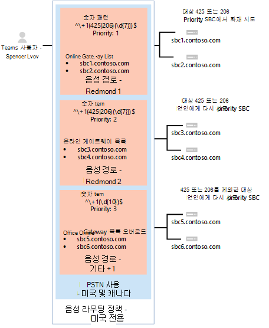

# <a name="configure-voice-routing-for-direct-routing"></a>직접 라우팅에 대한 음성 라우팅 구성

이 문서에서는 직접 라우팅에 대한 음성 라우팅을 전화 시스템 방법을 설명합니다.  직접 라우팅을 구성하기 위한 다음 단계의 3단계입니다.

- 1단계. [커넥트 시스템으로 SBC를 Microsoft 전화 연결의 유효성을 검사합니다.](direct-routing-connect-the-sbc.md) 
- 2단계. [직접 라우팅, 음성 및 음성메일에 사용자를 사용하도록 설정](direct-routing-enable-users.md)
- **3단계. 음성 라우팅 구성(이** 문서)
- 4단계. [숫자를 대체 형식으로 변환](direct-routing-translate-numbers.md) 

직접 라우팅을 설정하는 데 필요한 모든 단계에 대한 자세한 내용은 직접 라우팅 [구성 을 참조하세요.](direct-routing-configure.md)

## <a name="voice-routing-overview"></a>음성 라우팅 개요

Microsoft 전화 시스템에는 특정 SBC(세션 테두리 컨트롤러)로 호출을 보낼 수 있는 라우팅 메커니즘이 있습니다. 

- 호출된 숫자 패턴 
- 호출된 숫자 패턴과 통화를 하는 특정 사용자
 
SBC는 활성 및 백업으로 지정될 수 있습니다. 활성으로 구성된 SBC를 특정 호출 경로에 사용할 수 없는 경우 호출이 백업 SBC로 라우팅됩니다.
 
음성 라우팅은 다음 요소로 구성됩니다. 

- **음성 라우팅 정책** - 사용자 또는 여러 사용자에게 할당할 수 있는 PSTN 사용량에 대한 컨테이너입니다. 

- **PSTN 사용량** - 음성 경로 및 PSTN 사용에 대한 컨테이너로, 다양한 음성 라우팅 정책에서 공유할 수 있습니다. 

- **음성 경로** - 전화 번호가 패턴과 일치하는 호출에 사용할 온라인 PSTN 게이트웨이의 숫자 패턴 및 집합입니다.

- **온라인 PSTN 게이트웨이** - 전달 PAI(PAI) 또는 기본 코덱과 같은 SBC를 통해 호출이 배치될 때 적용되는 구성을 저장하는 SBC에 대한 포인터입니다. 음성 경로에 추가할 수 있습니다.

## <a name="voice-routing-policy-considerations"></a>음성 라우팅 정책 고려 사항

사용자에게 통화 계획 라이선스가 있는 경우 해당 사용자의 발신 호출은 Microsoft Calling Plan PSTN 인프라를 통해 자동으로 라우팅됩니다. 전화 걸기 계획 사용자에게 온라인 음성 라우팅 정책을 구성하고 할당하는 경우 해당 사용자의 발신 통화가 확인되어 전화 걸기 번호가 온라인 음성 라우팅 정책에 정의된 숫자 패턴과 일치하는지 여부를 판단합니다. 일치가 있는 경우 직접 라우팅 트렁크를 통해 호출이 라우팅됩니다. 일치하는 것이 없는 경우 호출은 호출 계획 PSTN 인프라를 통해 라우팅됩니다.

> [!CAUTION]
> 전역(Org-wide default) 온라인 음성 라우팅 정책을 구성하고 적용하는 경우 조직의 모든 음성 지원 사용자가 해당 정책을 상속받게 되어 통화 계획 사용자의 PSTN 호출이 직접 라우팅 트렁크로 부적당하게 라우팅될 수 있습니다. 모든 사용자가 글로벌 온라인 음성 라우팅 정책을 사용하지 않는 경우 사용자 지정 온라인 음성 라우팅 정책을 구성하고 개별 음성 지원 사용자에게 할당합니다.

## <a name="example-1-voice-routing-with-one-pstn-usage"></a>예제 1: PSTN 사용량이 1개인 음성 라우팅

다음 다이어그램에서는 통화 흐름의 음성 라우팅 정책의 두 가지 예제를 보여 주었다.

**Flow 1(왼쪽)을 호출합니다.** 사용자가 +1 425 XXX XX 또는 +1 206 XXX XXX를 호출하는 경우 호출이 SBC sbc1.contoso.biz 또는 sbc2.contoso.biz. sbc1.contoso.biz 또는 sbc2.contoso.biz 사용할 수 없는 경우 호출이 삭제됩니다. 

**Flow 2(오른쪽)를 호출합니다.** 사용자가 +1 425 XXX XX XX 또는 +1 206 XXX XXX를 호출하는 경우 호출이 먼저 SBC sbc1.contoso.biz 또는 sbc2.contoso.biz. SBC를 사용할 수 없는 경우 우선 순위가 낮은 경로가 시도됩니다(sbc3.contoso.biz 및 sbc4.contoso.biz. 사용할 수 있는 SBC가 없는 경우 호출이 삭제됩니다. 


두 예제에서 음성 경로에 우선 순위가 할당되는 동안 경로의 SBC는 임의 순서로 시도됩니다.

  > [!NOTE]
  > 사용자가 Microsoft Calling Plan 라이선스가 없는 경우 예제 구성에서 패턴 +1 425 XXX XX 또는 +1 206 XXX XX XX와 일치하는 숫자를 제외한 모든 숫자로 호출합니다. 사용자에게 통화 계획 라이선스가 있는 경우 Microsoft 통화 계획의 정책에 따라 호출이 자동으로 라우팅됩니다. Microsoft 통화 계획은 Microsoft 통화 계획 라이선스가 있는 모든 사용자에게 마지막 경로로 자동으로 적용되며 추가 호출 라우팅 구성이 필요하지 않습니다.

다음 다이어그램에 표시된 예제에서 음성 경로가 추가되어 다른 모든 미국 및 캐나다 번호(호출된 번호 패턴 +1 XXX XXX XXX로 이동하는 호출)에 대한 호출을 보낼 수 있습니다.


다른 모든 호출의 경우 사용자에게 라이선스(Microsoft 전화 시스템 및 Microsoft 통화 요금제)가 있는 경우 자동 경로가 사용됩니다. 관리자가 만든 온라인 음성 경로의 번호 패턴과 일치하지 않는다면 Microsoft Calling Plan을 통해 호출이 라우팅됩니다. 사용자가 시스템만 Microsoft 전화 일치하는 규칙을 사용할 수 있기 때문에 호출이 삭제됩니다.

  > [!NOTE]
  > 패턴 +1 XXX XXX XXX XX와 일치하는 경로가 하나만 있기 때문에 경로 "기타 +1"에 대한 우선 순위 값은 중요하지 않습니다. 사용자가 +1 324 567 89 89를 호출하고 sbc5.contoso.biz 및 sbc6.contoso.biz 모두 사용할 수 없는 경우 호출이 삭제됩니다.

다음 표에서는 세 개의 음성 경로를 사용하여 구성을 요약합니다. 이 예제에서는 세 경로가 모두 동일한 PSTN 사용량인 "미국 및 캐나다"의 일부입니다.  모든 경로는 "미국 및 캐나다" PSTN 사용량과 연결됩니다. PSTN 사용량은 "US Only" 음성 라우팅 정책과 연결됩니다.

|**PSTN 사용**|**음성 경로**|**숫자 패턴**|**우선 순위**|**SBC**|**설명**|
|:-----|:-----|:-----|:-----|:-----|:-----|
|미국 및 캐나다|"Redmond 1"|^\\+1(425 \| 206)(\d {7} )$|1|sbc1.contoso.biz<br/>sbc2.contoso.biz|호출된 숫자 +1 425 XXX XX 또는 +1 206 XXX XX XX에 대한 활성 경로|
|미국 및 캐나다|"Redmond 2"|^\\+1(425 \| 206)(\d {7} )$|2|sbc3.contoso.biz<br/>sbc4.contoso.biz|호출된 숫자에 대한 백업 경로 +1 425 XXX XX XX 또는 +1 206 XXX XX XX|
|미국 및 캐나다|"기타 +1"|^\\+1(\d {10} )$|3|sbc5.contoso.biz<br/>sbc6.contoso.biz|호출된 숫자에 대한 경로 +1 XXX XXX XX XX(+1 425 XXX XX 또는 +1 206 XXX XX XX 제외)|
|||||||

## <a name="example-1-configuration-steps"></a>예제 1: 구성 단계

다음 예제에서는 다음 방법을 보여줍니다.

1. 단일 PSTN 사용량을 생성합니다.
2. 세 개의 음성 경로를 구성합니다.
3. 음성 라우팅 정책을 만들 수 있습니다.
4. Spencer Low라는 사용자에게 정책을 할당합니다.

관리 센터 또는 [Microsoft Teams](#admincenterexample1) [PowerShell을](#powershellexample1) 사용하여 이러한 단계를 수행할 수 있습니다.

### <a name="using-the-microsoft-teams-admin-center"></a>Microsoft Teams 관리 센터 사용
<a name="admincenterexample1"></a>

#### <a name="step-1-create-the-us-and-canada-pstn-usage"></a>1단계: "미국 및 캐나다" PSTN 사용량 만들기

1. 관리 센터의 Microsoft Teams 탐색에서 **Voice** Direct 라우팅으로 이동한 다음 오른쪽 위 모서리에서 PSTN 사용 레코드 관리  >   **를 선택합니다.**
2. 추가 , 미국 및 캐나다 입력을 **클릭한** 다음 적용을 **클릭합니다.**

#### <a name="step-2-create-three-voice-routes-redmond-1-redmond-2-and-other-1"></a>2단계: 세 개의 음성 경로 만들기(Redmond 1, Redmond 2 및 기타 +1)

다음 단계에서는 음성 경로를 만드는 방법을 설명합니다. 이 예제에서는 이전 표에 설명된 설정을 사용하여 Redmond 1, Redmond 2 및 기타 +1이라는 세 개의 음성 경로를 만들 수 있습니다.

1. 관리 센터의 왼쪽 탐색에서 Microsoft Teams 직접 라우팅으로 이동한 다음 음성 경로   >   **탭을 선택합니다.**
2. 추가 **를** 클릭한 다음 음성 경로에 대한 이름과 설명을 입력합니다.
3. 우선 순위를 설정하고 전화 걸기 번호 패턴을 지정합니다.
4. 음성 경로로 SBC를 등록하려면 **등록된 SBC(선택 사항)에서** **SBC** 추가를 클릭하고 등록할 SBC를 선택한 다음 적용을 **클릭합니다.**
5. PSTN 사용 레코드를 추가하려면 **PSTN 사용 레코드(선택 사항)에서 PSTN** 사용량 추가를 클릭하고 추가할 PSTN 레코드를 선택한 다음 적용을 **클릭합니다.** 
6. **저장** 을 클릭합니다.

#### <a name="step-3-create-a-voice-routing-policy-named-us-only-and-add-the-us-and-canada-pstn-usage-to-the-policy"></a>3단계: "US Only"이라는 음성 라우팅 정책을 만들고 "미국 및 캐나다" PSTN 사용량을 정책에 추가합니다.

1. 관리 센터의 왼쪽 탐색에서 Microsoft Teams **음성** 라우팅 정책으로 이동한 다음  >   **추가를 클릭합니다.**
2. **이름로 US Only를** 입력하고 설명을 추가합니다.
3. **PSTN 사용** 레코드에서 **PSTN** 사용량 추가를 클릭하고 "미국 및 캐나다" PSTN 사용 레코드를 선택한 다음 적용을 **클릭합니다.**
4. **저장** 을 클릭합니다.

자세한 내용은 음성 라우팅 정책 관리를 [참조합니다.](manage-voice-routing-policies.md)

#### <a name="step-4-assign-the-voice-routing-policy-to-a-user-named-spencer-low"></a>4단계: Spencer Low이라는 사용자에게 음성 라우팅 정책 할당

1. Microsoft Teams 관리 센터의 왼쪽 탐색 창에서 **사용자** 로 이동한 후 해당 사용자를 클릭합니다.
2. 정책을 **클릭한** 다음 할당된 정책 **옆에** 있는 **편집을 클릭합니다.**
3. 음성 **라우팅 정책에서**"US Only" 정책을 선택한 다음 저장을 **클릭합니다.**

자세한 내용은 음성 라우팅 정책 관리를 [참조합니다.](manage-voice-routing-policies.md)

### <a name="using-powershell"></a>PowerShell 사용
<a name="powershellexample1"></a>


#### <a name="step-1-create-the-us-and-canada-pstn-usage"></a>1단계: "미국 및 캐나다" PSTN 사용량 만들기

온라인의 원격 PowerShell 세션에서 비즈니스용 Skype 입력합니다.

```PowerShell
Set-CsOnlinePstnUsage -Identity Global -Usage @{Add="US and Canada"}
```

다음을 입력하여 사용량이 생성된지 확인

```PowerShell
Get-CSOnlinePSTNUsage
``` 

이 목록은 Truncated될 수 있는 이름 목록을 반환합니다.

```console
Identity    : Global
Usage        : {testusage, US and Canada, International, karlUsage. . .}
```

다음 예제에서는 PowerShell 명령을 실행하여 전체 이름을 표시한 결과를 `(Get-CSOnlinePSTNUsage).usage` 보여 주며 잘리지 않습니다.

```console
 testusage
 US and Canada
 International
 karlUsage
 New test env
 Tallinn Lab Sonus
 karlUsage2
 Unrestricted
 Two trunks
```

#### <a name="step-2-create-three-voice-routes-redmond-1-redmond-2-and-other-1"></a>2단계: 세 개의 음성 경로 만들기(Redmond 1, Redmond 2 및 기타 +1)

"Redmond 1" 경로를 만들 경우 온라인의 PowerShell 세션에서 비즈니스용 Skype 입력합니다.

```PowerShell
New-CsOnlineVoiceRoute -Identity "Redmond 1" -NumberPattern "^\+1(425|206)
(\d{7})$" -OnlinePstnGatewayList sbc1.contoso.biz, sbc2.contoso.biz -Priority 1 -OnlinePstnUsages "US and Canada"
```

반환되는:

```console
Identity                : Redmond 1
Priority                : 1
Description             :
NumberPattern           : ^\+1(425|206) (\d{7})$
OnlinePstnUsages        : {US and Canada}
OnlinePstnGatewayList   : {sbc1.contoso.biz, sbc2.contoso.biz}
Name                    : Redmond 1
```

Redmond 2 경로를 만들 경우 다음을 입력합니다.

```PowerShell
New-CsOnlineVoiceRoute -Identity "Redmond 2" -NumberPattern "^\+1(425|206)
(\d{7})$" -OnlinePstnGatewayList sbc3.contoso.biz, sbc4.contoso.biz -Priority 2 -OnlinePstnUsages "US and Canada"
```

기타 +1 경로를 만들 경우 다음을 입력합니다.

```PowerShell
New-CsOnlineVoiceRoute -Identity "Other +1" -NumberPattern "^\+1(\d{10})$"
-OnlinePstnGatewayList sbc5.contoso.biz, sbc6.contoso.biz -OnlinePstnUsages "US and Canada"
```

  > [!CAUTION]
  > NumberPattern 특성의 정규식이 유효한 식인지 확인하세요. 이 웹 사이트를 사용하여 테스트할 수 있습니다. [https://www.regexpal.com](https://www.regexpal.com)

경우에 따라 모든 호출을 동일한 SBC로 라우팅해야 하는 경우도 있습니다. use -NumberPattern ".*"

모든 호출을 동일한 SBC로 라우팅합니다.

```PowerShell
Set-CsOnlineVoiceRoute -id "Redmond 1" -NumberPattern ".*" -OnlinePstnGatewayList sbc1.contoso.biz
```

다음과 같이 옵션을 사용하여 PowerShell 명령을 실행하여 경로를 `Get-CSOnlineVoiceRoute` 올바르게 구성한지 확인합니다.

```PowerShell
Get-CsOnlineVoiceRoute | Where-Object {($_.priority -eq 1) -or ($_.priority -eq 2) or ($_.priority -eq 4) -Identity "Redmond 1" -NumberPattern "^\+1(425|206) (\d{7})$" -OnlinePstnGatewayList sbc1.contoso.biz, sbc2.contoso.biz -Priority 1 -OnlinePstnUsages "US and Canada"
```
반환해야 하는 사항:

```console
Identity            : Redmond 1 
Priority               : 1
Description         : 
NumberPattern         : ^\+1(425|206) (\d{7})$
OnlinePstnUsages     : {US and Canada}     
OnlinePstnGatewayList    : {sbc1.contoso.biz, sbc2.contoso.biz}
Name             : Redmond 1
Identity        : Redmond 2 
Priority               : 2
Description         : 
NumberPattern         : ^\+1(425|206) (\d{7})$
OnlinePstnUsages     : {US and Canada}     
OnlinePstnGatewayList    : {sbc3.contoso.biz, sbc4.contoso.biz}
Name             : Redmond 2
    
Identity        : Other +1 
Priority               : 4
Description         : 
NumberPattern         : ^\+1(\d{10})$
OnlinePstnUsages     : {US and Canada}     
OnlinePstnGatewayList    : {sbc5.contoso.biz, sbc6.contoso.biz}
Name             : Other +1
```

예제에서 경로 "기타 +1"이 자동으로 우선 순위 4가 할당됩니다. 

#### <a name="step-3-create-a-voice-routing-policy-named-us-only-and-add-the-us-and-canada-pstn-usage-to-the-policy"></a>3단계: "US Only"이라는 음성 라우팅 정책을 만들고 "미국 및 캐나다" PSTN 사용량을 정책에 추가합니다.

온라인의 PowerShell 세션에서 비즈니스용 Skype 입력합니다.

```PowerShell
New-CsOnlineVoiceRoutingPolicy "US Only" -OnlinePstnUsages "US and Canada"
```

결과는 이 예제에 표시됩니다.

```console
Identity            : Tag:US only
OnlinePstnUsages    : {US and Canada}
Description         :
RouteType           : BYOT
```

#### <a name="step-4-assign-the-voice-routing-policy-to-a-user-named-spencer-low"></a>4단계: Spencer Low이라는 사용자에게 음성 라우팅 정책 할당

온라인의 PowerShell 세션에서 비즈니스용 Skype 입력합니다.

```PowerShell
Grant-CsOnlineVoiceRoutingPolicy -Identity "Spencer Low" -PolicyName "US Only"
```

이 명령을 입력하여 정책 할당의 유효성을 검사합니다.

```PowerShell
Get-CsOnlineUser "Spencer Low" | select OnlineVoiceRoutingPolicy
```

명령은 다음을 반환합니다.

```console
OnlineVoiceRoutingPolicy
---------------------
US Only
```

## <a name="example-2-voice-routing-with-multiple-pstn-usages"></a>예제 2: 여러 PSTN 사용량이 있는 음성 라우팅

예제 1에서 만든 음성 라우팅 정책은 Microsoft Calling Plan 라이선스가 사용자에게 할당되지 않는 한 미국 및 캐나다의 전화 번호로만 전화를 걸 수 있습니다.

다음 예제에서는 "제한 없음" 음성 라우팅 정책을 만들 수 있습니다. 이 정책은 예제 1에서 만든 "미국 및 캐나다" PSTN 사용량과 새 "국제" PSTN 사용량을 다시 사용합니다. 이 정책은 다른 모든 호출을 SBC 및 sbc2.contoso.biz sbc5.contoso.biz.

표시된 예제에서는 사용자 Spencer Low에 US Only 정책을 할당하고 사용자 John Woods에 제한 없음 정책을 할당하여 라우팅이 다음과 같이 수행됩니다.

- Spencer Low - 미국 전용 정책입니다.  통화는 미국 및 캐나다 번호에만 허용됩니다. Redmond 번호 범위를 호출할 때 특정 SBC 집합을 사용해야 합니다. 통화 계획 라이선스가 사용자에게 할당되지 않는 한 미국이 아닌 숫자는 라우팅되지 않습니다.

- John Woods – 국제 정책.  호출은 모든 번호로 허용됩니다. Redmond 번호 범위를 호출할 때 특정 SBC 집합을 사용해야 합니다. 미국이 아닌 숫자는 sbc2.contoso.biz 및 sbc5.contoso.biz.



다른 모든 호출의 경우 사용자에게 라이선스(Microsoft 전화 시스템 및 Microsoft 통화 요금제)가 있는 경우 자동 경로가 사용됩니다. 관리자가 만든 온라인 음성 경로의 번호 패턴과 일치하지 않는다면 Microsoft Calling Plan을 사용하여 호출이 라우팅됩니다.  시스템에만 Microsoft 전화 일치하는 규칙이 제공되어 호출이 삭제됩니다.


다음 표에서는 라우팅 정책 "제한 없음" 사용 지정 및 음성 경로를 요약합니다. 

| PSTN 사용 | 음성 경로 | 숫자 패턴 | 우선 순위 | SBC | 설명 |
|:-----|:-----|:-----|:-----|:-----|:-----|
|미국 및 캐나다|"Redmond 1"|^\\+1(425 \| 206)(\d {7} )$|1|sbc1.contoso.biz<br/>sbc2.contoso.biz|발신자 번호 +1 425 XXX XX 또는 +1 206 XXX XX XX에 대한 활성 경로|
|미국 및 캐나다|"Redmond 2"|^\\+1(425 \| 206)(\d {7} )$|2|sbc3.contoso.biz<br/>sbc4.contoso.biz|발신자 번호에 대한 백업 경로 +1 425 XXX XX XX 또는 +1 206 XXX XX XX|
|미국 및 캐나다|"기타 +1"|^\\+1(\d {10} )$|3|sbc5.contoso.biz<br/>sbc6.contoso.biz|발신자 번호에 대한 경로 +1 XXX XXX XX XX(+1 425 XXX 또는 +1 206 XXX XX XX 제외)|
|인터내셔널|인터내셔널|\d+|4|sbc2.contoso.biz<br/>sbc5.contoso.biz|모든 숫자 패턴에 대한 경로 |

  > [!NOTE]
  > - 음성 라우팅 정책의 PSTN 사용량 순서는 중요합니다. 사용량은 순서대로 적용되고 첫 번째 사용에서 일치가 발견된 경우 다른 사용량은 평가되지 않습니다. "국제" PSTN 사용량은 "미국 및 캐나다" PSTN 사용 후에 배치해야 합니다. PSTN 사용량의 순서를 변경하기 위해 명령을 `Set-CSOnlineVoiceRoutingPolicy` 실행합니다. <br/>예를 들어 순서를 "미국 및 캐나다" 첫 번째 및 "인터내셔널"에서 역순 실행으로 변경합니다.<br/> `Set-CsOnlineVoiceRoutingPolicy -id tag:"no Restrictions" -OnlinePstnUsages @{Replace="International", "US and Canada"}`
 > - "기타 +1" 및 "국제" 음성 경로에 대한 우선 순위가 자동으로 할당됩니다. "Redmond 1" 및 "Redmond 2"보다 낮은 우선 순위가 있는 한 중요하지 않습니다.

## <a name="example-2-configuration-steps"></a>예제 2: 구성 단계

다음 예제에서는 다음 방법을 보여줍니다.

1. 인터내셔널이라는 새 PSTN 사용량을 생성합니다.
2. 인터내셔널이라는 새 음성 경로를 생성합니다.
3. 제한 없음이라는 음성 라우팅 정책을 생성합니다.
4. 사용자 John Woods에 정책을 할당합니다.

관리 센터 또는 [Microsoft Teams](#admincenterexample2) [PowerShell을](#powershellexample2) 사용하여 이러한 단계를 수행할 수 있습니다.

### <a name="using-the-microsoft-teams-admin-center"></a>Microsoft Teams 관리 센터 사용
<a name="admincenterexample2"></a>

#### <a name="step-1-create-the-international-pstn-usage"></a>1단계: "국제" PSTN 사용량 만들기

1. 관리 센터의 Microsoft Teams 탐색에서 **Voice** Direct 라우팅으로 이동한 다음 오른쪽 위 모서리에서 PSTN 사용 레코드 관리  >   **를 선택합니다.**
2. 추가 , **국제** 입력을 클릭한 다음 적용을 **클릭합니다.**

#### <a name="step-2-create-the-international-voice-route"></a>2단계: "국제" 음성 경로 만들기

1. 관리 센터의 왼쪽 탐색에서 Microsoft Teams 직접 라우팅으로 이동한 다음 음성 경로   >   **탭을 선택합니다.**
2. **추가를** 클릭하고 이름으로 "International"을 입력한 다음 설명을 추가합니다.
3. 우선 순위를 4로 설정한 다음 전화 걸기 번호 패턴을 \d+로 설정합니다.
4. 등록된 **SBC(선택** 사항)에서 **SBC** 추가를 클릭하고 sbc2.contoso.biz sbc5.contoso.biz 선택한 다음 적용을 **클릭합니다.**
5. **PSTN 사용 레코드(선택 사항)에서** **PSTN** 사용량 추가를 클릭하고 "국제" PSTN 사용 레코드를 선택한 다음 적용을 **클릭합니다.**
6. **저장** 을 클릭합니다.

#### <a name="step-3-create-a-voice-routing-policy-named-no-restrictions-and-add-the-us-and-canada-and-international-pstn-usages-to-the-policy"></a>3단계: "제한 없음"이라는 음성 라우팅 정책을 만들고 "미국 및 캐나다" 및 "국제" PSTN 사용량을 정책에 추가합니다.

PSTN 사용 "미국 및 캐나다"는 이 음성 라우팅 정책에서 다시 사용되어 "+1 425 XXX XXX" 및 "+1 206 XXX XX"를 로컬 또는 프레미스 호출로 호출하는 호출에 대한 특수 처리를 보존합니다.

1. 관리 센터의 왼쪽 탐색에서 Microsoft Teams **음성** 라우팅 정책으로 이동한 다음  >   **추가를 클릭합니다.**
2. 제한 **없음을** 이름으로 입력하고 설명을 추가합니다.
3. **PSTN** 사용 레코드에서 PSTN 사용량 추가를 클릭하고 "미국 및 캐나다" **PSTN** 사용 레코드를 선택한 다음 "국제" PSTN 사용 레코드를 선택합니다. 적용 **을 클릭합니다.**

    PSTN 사용량의 순서를 유의합니다.

    - 이 예제와 같이 구성된 사용량을 사용하여 "+1 425 XXX XXX"를 번호로 호출하는 경우 호출은 "미국 및 캐나다" 사용량에 설정된 경로 집합을 따르고 특수 라우팅 논리가 적용됩니다. 즉, 호출은 sbc1.contoso.biz 및 sbc2.contoso.biz 라우팅한 다음 sbc3.contoso.biz sbc4.contoso.biz 경로로 라우팅됩니다.

    - "국제" PSTN 사용량이 "미국 및 캐나다" 앞에 있는 경우 +1 425 XXX XX XX에 대한 호출은 라우팅 논리의 일부로 sbc2.contoso.biz sbc5.contoso.biz 로 라우팅됩니다.

4. **저장** 을 클릭합니다.

자세한 내용은 음성 라우팅 정책 관리를 [참조합니다.](manage-voice-routing-policies.md)

#### <a name="step-4-assign-the-voice-routing-policy-to-a-user-named-john-woods"></a>4단계: John Woods라는 사용자에게 음성 라우팅 정책 할당

1. Microsoft Teams 관리 센터의 왼쪽 탐색 창에서 **사용자** 로 이동한 후 해당 사용자를 클릭합니다.
2. 정책을 **클릭한** 다음 할당된 정책 **옆에** 있는 **편집을 클릭합니다.**
3. 음성 **라우팅 정책에서**"제한 없음" 정책을 선택한 다음 저장을 **클릭합니다.**

그 결과 John Woods의 호출에 적용되는 음성 정책은 제한되지 않습니다. 미국, 캐나다 및 국제 통화에 사용할 수 있는 통화 라우팅 논리를 따르게 됩니다.

### <a name="using-powershell"></a>PowerShell 사용
<a name="powershellexample2"></a>

#### <a name="step-1-create-the-international-pstn-usage"></a>1단계: "국제" PSTN 사용량 만들기

온라인의 원격 PowerShell 세션에서 비즈니스용 Skype 입력합니다.

```PowerShell
Set-CsOnlinePstnUsage -Identity Global -Usage @{Add="International"}
```

#### <a name="step-2--create-a-new-voice-route-named-international"></a>2단계: "International"이라는 새 음성 경로 만들기

```PowerShell
New-CsOnlineVoiceRoute -Identity "International" -NumberPattern ".*" -OnlinePstnGatewayList sbc2.contoso.biz, sbc5.contoso.biz -OnlinePstnUsages "International"
```

반환되는:

```console
Identity                  : International
Priority                  : 5
Description               :
NumberPattern             : .*
OnlinePstnUsages          : {International}
OnlinePstnGatewayList     : {sbc2.contoso.biz, sbc5.contoso.biz}
Name                      : International
```

#### <a name="step-3-create-a-voice-routing-policy-named-no-restrictions"></a>3단계: "제한 없음"이라는 음성 라우팅 정책 만들기

PSTN 사용량 "Redmond 1" 및 "Redmond"는 이 음성 라우팅 정책에서 다시 사용되어 "+1 425 XXX XX" 및 "+1 206 XXX XX XX"를 로컬 또는 프레미스 호출로 호출하는 호출에 대한 특수 처리를 보존합니다.

  ```PowerShell
  New-CsOnlineVoiceRoutingPolicy "No Restrictions" -OnlinePstnUsages "US and Canada", "International"
  ```

PSTN 사용량의 순서를 유의합니다.

  - 다음 예제와 같이 구성된 사용량을 사용하여 "+1 425 XXX XXX"를 번호로 호출하는 경우 호출은 "미국 및 캐나다" 사용에 설정된 경로 집합을 따르고 특수 라우팅 논리가 적용됩니다. 즉, 호출은 sbc1.contoso.biz 및 sbc2.contoso.biz 라우팅한 다음 sbc3.contoso.biz sbc4.contoso.biz 경로로 라우팅됩니다.

  - "국제" PSTN 사용량이 "미국 및 캐나다" 앞에 있는 경우 +1 425 XXX XX XX에 대한 호출은 라우팅 논리의 일부로 sbc2.contoso.biz sbc5.contoso.biz 로 라우팅됩니다. 명령을 입력합니다.

  ```PowerShell
  New-CsOnlineVoiceRoutingPolicy "No Restrictions" -OnlinePstnUsages "US and Canada", "International"
  ```

반환되는:

```console
    Identity              : International 
    OnlinePstnUsages : {US and Canada, International}     
    Description         :  
    RouteType               : BYOT
```

#### <a name="step-4-assign-the-voice-routing-policy-to-the-user-named-john-woods"></a>4단계: John Woods라는 사용자에게 음성 라우팅 정책 할당

```PowerShell
Grant-CsOnlineVoiceRoutingPolicy -Identity "John Woods" -PolicyName "No Restrictions"
```

그런 다음 명령을 사용하여 할당을 확인합니다. 

```PowerShell
Get-CsOnlineUser "John Woods" | Select OnlineVoiceRoutingPolicy
```

반환되는:

```console
OnlineVoiceRoutingPolicy
------------------------
No Restrictions
```

결과적으로 John Woods의 호출에 적용된 음성 정책은 제한되지 않습니다. 미국, 캐나다 및 국제 통화에 사용할 수 있는 통화 라우팅 논리를 따르게 됩니다.

## <a name="see-also"></a>참고 항목

[직접 라우팅 계획](direct-routing-plan.md)

[직접 라우팅 구성](direct-routing-configure.md)
