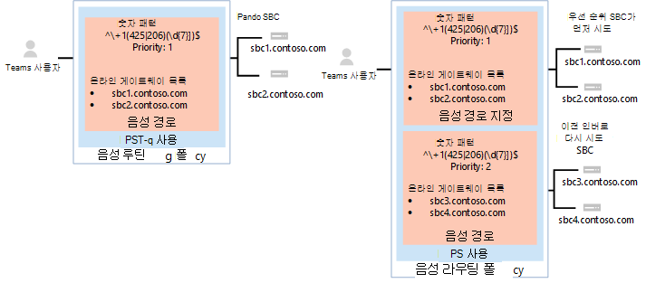

# <a name="configure-voice-routing-for-direct-routing"></a>다이렉트 라우팅에 대 한 음성 라우팅 구성

이 문서에서는 전화 시스템 다이렉트 라우팅에 대 한 음성 라우팅을 구성 하는 방법을 설명 합니다.  직접 라우팅 구성에 대 한 단계 3 단계는 다음과 같습니다.

- 1 단계. [Microsoft 전화 시스템을 사용 하 여 SBC 연결 및 연결 확인](direct-routing-connect-the-sbc.md) 
- 2 단계. [사용자가 직접 라우팅, 음성, 보이스 메일을 사용할 수 있도록 설정](direct-routing-enable-users.md)    
- **3 단계. 음성 라우팅 구성** (이 문서)
- 4 단계. [숫자를 대체 형식으로 번역](direct-routing-translate-numbers.md) 

직접 라우팅을 설정 하는 데 필요한 모든 단계에 대 한 자세한 내용은 [직접 라우팅 구성을](direct-routing-configure.md)참조 하세요.

## <a name="voice-routing-overview"></a>음성 라우팅 개요

Microsoft 휴대폰 시스템에는 다음을 기준으로 특정 SBC (세션 경계 컨트롤러)로 전화를 보낼 수 있는 라우팅 메커니즘이 있습니다. 

- 호출 된 번호 패턴 
- 호출 되는 특정 사용자와 전화 번호 패턴을 함께 사용 합니다.
 
SBCs는 활성 및 백업으로 지정 될 수 있습니다. 활성으로 구성 된 SBC를 특정 통화 경로에 대해 사용할 수 없는 경우에는 통화가 백업 SBC로 라우팅됩니다.
 
음성 라우팅은 다음 요소로 이루어집니다. 

- **음성 라우팅 정책** – 사용자 또는 여러 사용자에 게 할당할 수 있는 PSTN 용도를 위한 컨테이너입니다. 

- **Pstn** 사용 – 다른 음성 라우팅 정책에서 공유할 수 있는 음성 경로 및 PSTN 용도에 대 한 컨테이너입니다. 

- **음성 경로** – 호출 번호가 패턴과 일치 하는 호출에 사용할 수 패턴과 온라인 PSTN 게이트웨이 집합을 말합니다.

- **온라인 PSTN 게이트웨이** -호출이 sbc를 통해 호출 될 때 적용 되는 구성을 저장 하는 sbc에 대 한 포인터로, (예: pai (정방향 P-어설션된-Identity) 또는 기본 설정 코덱). 음성 경로에 추가할 수 있습니다.

## <a name="example-1-voice-routing-with-one-pstn-usage"></a>예제 1: PSTN 사용량이 하나인 음성 라우팅

다음 다이어그램은 통화 흐름에서 음성 라우팅 정책의 두 가지 예를 보여줍니다.

**통화 흐름 1 (왼쪽):** 사용자가 + 1 425 XXX XX xx 또는 + 1 206 XXX XX XX에 전화를 거는 경우, 통화는 SBC sbc1.contoso.biz 또는 sbc2.contoso.biz로 라우팅됩니다. Sbc1.contoso.biz 나 sbc2.contoso.biz 모두 사용할 수 없는 경우에는 통화가 손실 됩니다. 

**통화 흐름 2 (오른쪽):** 사용자가 + 1 425 XXX XX xx 또는 + 1 206 XXX XX XX에 전화를 거는 경우, 통화는 먼저 SBC sbc1.contoso.biz 또는 sbc2.contoso.biz로 라우팅됩니다. 두 SBC를 모두 사용할 수 없는 경우 우선 순위가 낮은 경로 (sbc3.contoso.biz 및 sbc4.contoso.biz)가 시도 됩니다. 사용할 수 있는 SBCs 장치가 없으면 통화가 끊깁니다. 



두 예제에서 음성 경로에 우선 순위를 할당 하는 동안 경로의 SBCs는 임의 순서 대로 시도 됩니다.

  > [!NOTE]
  > 사용자에 게 Microsoft 통화 계획 라이선스가 없는 경우 예제 구성의 패턴 + 1 425 XXX XX xx 또는 + 1 206 XXX XX XX와 일치 하는 숫자를 제외한 모든 번호로 거는 호출이 삭제 됩니다. 사용자에 게 통화 요금제 라이선스가 있는 경우이 통화는 Microsoft 호출 계획의 정책에 따라 자동으로 라우팅됩니다. Microsoft 통화 요금제는 Microsoft 통화 계획 라이선스를 사용 하 여 모든 사용자의 마지막 경로에 자동으로 적용 되며 추가 통화 라우팅 구성이 필요 하지 않습니다.

다음 다이어그램에 표시 된 예제에서는 다른 모든 미국 및 캐나다 번호로 전화를 보낼 수 있는 음성 경로가 추가 됩니다 (호출 되는 번호 패턴 + 1 XXX XXX XX XX (으)로 이동 하는 호출).


다른 모든 통화:

- 사용자에 게 라이선스 (Microsoft 전화 시스템 및 Microsoft 호출 계획)가 둘 다 있는 경우 자동 경로가 사용 됩니다. 
- 관리자가 만든 온라인 음성 경로의 숫자 패턴과 일치 하는 항목이 없는 경우 통화는 Microsoft 통화 요금제를 통해 라우팅됩니다.
- 사용자에 게 Microsoft 전화 시스템만 있는 경우에는 일치 하는 규칙을 사용할 수 없기 때문에 통화가 끊깁니다.

  > [!NOTE]
  > 패턴 + 1 XXX XXX XX XX와 일치 하는 경로만 있으므로이 경우 경로 "Other + 1"에 대 한 우선 순위 값은 중요 하지 않습니다. 사용자가 + 1 324 567 89 89를 호출 하 고 sbc5.contoso.biz 및 sbc6.contoso.biz를 모두 사용할 수 없는 경우 통화가 삭제 됩니다.

다음 표에는 세 가지 음성 경로를 사용 하는 구성이 요약 되어 있습니다. 이 예제에서는 세 개의 경로가 모두 동일한 PSTN 사용 인 "미국 및 캐나다"의 일부입니다.  모든 경로는 PSTN 사용 "미국 및 캐나다"와 연결 되며, PSTN 사용은 음성 라우팅 정책 "미국 전용"과 연결 됩니다. 

|**PSTN 사용**|**음성 경로**|**번호 패턴**|**중요도**|**하더라도**|**설명**|
|:-----|:-----|:-----|:-----|:-----|:-----|
|미국만|"Redmond 1"|^\\+ 1 (425\|206) (\d{7}) $|1|sbc1.contoso.biz<br/>sbc2.contoso.biz|호출 되는 번호 + 1 425 XXX XX XX 또는 + 1 206 XXX XX XX의 활성 경로|
|미국만|"Redmond 2"|^\\+ 1 (425\|206) (\d{7}) $|2|sbc3.contoso.biz<br/>sbc4.contoso.biz|호출 되는 번호에 대 한 백업 경로 + 1 425 XXX XX XX 또는 + 1 206 XXX XX XX|
|미국만|"기타 + 1"|^\\+ 1 (\d{10}) $|3|sbc5.contoso.biz<br/>sbc6.contoso.biz|호출 되는 번호에 대 한 경로 + 1 XXX XXX XX XX (+ 1 425 XXX xx xx 또는 + 1 206 XXX XX xx 제외)|
|||||||


### <a name="example-1-configuration-steps"></a>예제 1: 구성 단계

다음 예제에서는 다음을 수행 하는 방법을 보여 줍니다.

- 단일 PSTN 사용 만들기 
- 세 가지 음성 경로 구성
- 음성 라우팅 정책 만들기
- 사용자 Spencer 낮음으로 정책 할당

**1 단계:** PSTN 사용량 "미국 및 캐나다" 만들기

비즈니스용 Skype 원격 PowerShell 세션에 다음을 입력 합니다.

```PowerShell
Set-CsOnlinePstnUsage -Identity Global -Usage @{Add="US and Canada"}
```

다음을 입력 하 여 사용이 생성 되었는지 확인 합니다. 
```PowerShell
Get-CSOnlinePSTNUsage
``` 
다음은 잘릴 수 있는 이름 목록을 반환 하는 것입니다.
```console
Identity    : Global
Usage       : {testusage, US and Canada, International, karlUsage. . .}
```
다음 예제에서는 PowerShell 명령을 `(Get-CSOnlinePSTNUsage).usage` 실행 하 여 전체 이름을 표시 하는 결과를 보여 줍니다 (잘리지 않음).

<pre>
 testusage
 US and Canada
 International
 karlUsage
 New test env
 Tallinn Lab Sonus
 karlUsage2
 Unrestricted
 Two trunks
</pre>

**2 단계:** 비즈니스용 Skype Online의 PowerShell 세션에서 앞의 표에 나와 있는 것 처럼 Redmond 1, 레드먼드 2, 기타 + 1의 세 가지 경로를 만듭니다.

"Redmond 1" 경로를 만들려면 다음을 입력 합니다.

```PowerShell
New-CsOnlineVoiceRoute -Identity "Redmond 1" -NumberPattern "^\+1(425|206)
(\d{7})$" -OnlinePstnGatewayList sbc1.contoso.biz, sbc2.contoso.biz -Priority 1 -OnlinePstnUsages "US and Canada"
```

반환 되는 결과:
<pre>
Identity                : Redmond 1
Priority                : 1
Description             :
NumberPattern           : ^\+1(425|206) (\d{7})$
OnlinePstnUsages        : {US and Canada}
OnlinePstnGatewayList   : {sbc1.contoso.biz, sbc2.contoso.biz}
Name                    : Redmond 1
</pre>
Redmond 2 경로를 만들려면 다음을 입력 합니다.

```PowerShell
New-CsOnlineVoiceRoute -Identity "Redmond 2" -NumberPattern "^\+1(425|206)
(\d{7})$" -OnlinePstnGatewayList sbc3.contoso.biz, sbc4.contoso.biz -Priority 2 -OnlinePstnUsages "US and Canada"
```

다른 + 1 경로를 만들려면 다음을 입력 합니다.

```PowerShell
New-CsOnlineVoiceRoute -Identity "Other +1" -NumberPattern "^\+1(\d{10})$"
-OnlinePstnGatewayList sbc5.contoso.biz, sbc6.contoso.biz -OnlinePstnUsages "US and Canada"
```

  > [!CAUTION]
  > 번호 패턴 특성의 정규식이 유효한 식 인지 확인 합니다. 이 웹 사이트를 사용 하 여 테스트할 수 있습니다.[https://www.regexpal.com](https://www.regexpal.com)

일부 경우에는 동일한 SBC에 대 한 모든 통화를 라우팅할 필요가 있습니다. -번호 사용 패턴 ". *"

모든 통화를 동일한 SBC로 라우팅합니다.

```PowerShell
Set-CsOnlineVoiceRoute -id "Redmond 1" -NumberPattern ".*" -OnlinePstnGatewayList sbc1.contoso.biz
```

다음과 같이 옵션을 사용 하 여 `Get-CSOnlineVoiceRoute` PowerShell 명령을 실행 하 여 경로를 올바르게 구성 했는지 확인 합니다.

```PowerShell
Get-CsOnlineVoiceRoute | Where-Object {($_.priority -eq 1) -or ($_.priority -eq 2) or ($_.priority -eq 4) -Identity "Redmond 1" -NumberPattern "^\+1(425|206) (\d{7})$" -OnlinePstnGatewayList sbc1.contoso.biz, sbc2.contoso.biz -Priority 1 -OnlinePstnUsages "US and Canada"
```
다음을 반환 합니다.
<pre>
Identity            : Redmond 1 
Priority            : 1
Description     : 
NumberPattern       : ^\+1(425|206) (\d{7})$
OnlinePstnUsages    : {US and Canada}    
OnlinePstnGatewayList   : {sbc1.contoso.biz, sbc2.contoso.biz}
Name            : Redmond 1
Identity        : Redmond 2 
Priority            : 2
Description     : 
NumberPattern       : ^\+1(425|206) (\d{7})$
OnlinePstnUsages    : {US and Canada}    
OnlinePstnGatewayList   : {sbc3.contoso.biz, sbc4.contoso.biz}
Name            : Redmond 2
    
Identity        : Other +1 
Priority            : 4
Description     : 
NumberPattern       : ^\+1(\d{10})$
OnlinePstnUsages    : {US and Canada}    
OnlinePstnGatewayList   : {sbc5.contoso.biz, sbc6.contoso.biz}
Name            : Other +1
</pre>

이 예제에서 경로 "Other + 1"에 우선 순위 4가 자동으로 할당 되었습니다. 

**3 단계:** 음성 라우팅 정책 "미국 전용"을 만들고 PSTN 사용량 "미국 및 캐나다"를 정책에 추가 합니다.

비즈니스용 Skype Online의 PowerShell 세션에서 다음을 입력 합니다.

```PowerShell
New-CsOnlineVoiceRoutingPolicy "US Only" -OnlinePstnUsages "US and Canada"
```

결과는 다음 예제에 나와 있습니다.

<pre>
Identity            : Tag:US only
OnlinePstnUsages    : {US and Canada}
Description         :
RouteType           : BYOT
</pre>

**4 단계:** PowerShell을 사용 하 여 사용자에 게 음성 라우팅 정책을 Spencer 낮음으로 허용 합니다.

비즈니스용 Skype Online의 PowerShell 세션에서 다음을 입력 합니다.

```PowerShell
Grant-CsOnlineVoiceRoutingPolicy -Identity "Spencer Low" -PolicyName "US Only"
```

다음 명령을 입력 하 여 정책 할당의 유효성을 검사 합니다.

```PowerShell
Get-CsOnlineUser "Spencer Low" | select OnlineVoiceRoutingPolicy
```

이 명령은 다음을 반환 합니다.
<pre>
OnlineVoiceRoutingPolicy
---------------------
US Only
</pre>

## <a name="example-2-voice-routing-with-multiple-pstn-usages"></a>예제 2: 여러 PSTN 용도를 사용 하는 음성 라우팅

예 1에서 만든 음성 라우팅 정책은 Microsoft 통화 계획 라이선스가 사용자에 게 할당 되지 않는 이상 미국 및 캐나다의 전화 번호로만 통화 하도록 허용 합니다.

다음 예제에서는 음성 라우팅 정책 "제한 없음"을 만들 수 있습니다. 이 정책은 예제 1에서 만든 PSTN 사용량 "미국 및 캐나다"와 새로운 PSTN 사용량 "국제"를 재사용 합니다.  이 정책은 SBCs sbc2.contoso.biz 및 sbc5.contoso.biz에 대 한 다른 모든 통화를 라우팅합니다. 

표시 되는 예제에서는 사용자에 대 한 US 전용 정책만, 사용자에 게는 제한 사항 없음 정책, Spencer John 숲에는 다음과 같이 라우팅이 발생 하도록 지정 합니다.

- Spencer 낮음 – 미국 전용 정책.  통화는 미국 및 캐나다 번호로만 허용 됩니다. Redmond 번호 범위로 전화를 거는 경우 특정 SBCs 집합을 사용 해야 합니다. 통화 요금제 라이선스가 사용자에 게 할당 되지 않으면 미국 이외의 번호는 라우팅되지 않습니다.

- John 숲 – 국제 정책.  모든 숫자가 통화에 허용 됩니다. Redmond 번호 범위로 전화를 거는 경우 특정 SBCs 집합을 사용 해야 합니다. 미국 이외의 번호는 sbc2.contoso.biz 및 sbc5.contoso.biz를 사용 하 여 라우팅합니다.


다른 모든 통화에 대해 사용자에 게 라이선스 (Microsoft 전화 시스템 및 Microsoft 호출 계획)가 둘 다 있는 경우 자동 경로가 사용 됩니다. 관리자가 만든 온라인 음성 경로의 번호 패턴에 일치 하는 항목이 없는 경우에는 Microsoft 통화 요금제를 사용 하 여 통화가 전달 됩니다.  사용자에 게 Microsoft 전화 시스템만 있는 경우에는 일치 하는 규칙이 없기 때문에 통화가 끊깁니다.


다음 표에서는 라우팅 정책 "제한 없음" 사용 현황 및 음성 경로를 요약 하 여 설명 합니다. 

|**PSTN 사용**|**음성 경로**|**번호 패턴**|**중요도**|**하더라도**|**설명**|
|:-----|:-----|:-----|:-----|:-----|:-----|
|미국만|"Redmond 1"|^\\+ 1 (425\|206) (\d{7}) $|1|sbc1.contoso.biz<br/>sbc2.contoso.biz|호출 수신자 번호 + 1 425 XXX XX XX 또는 + 1 206 XXX XX XX의 활성 경로|
|미국만|"Redmond 2"|^\\+ 1 (425\|206) (\d{7}) $|2|sbc3.contoso.biz<br/>sbc4.contoso.biz|호출 수신자 번호 + 1 425 XXX XX XX 또는 + 1 206 XXX XX XX에 대 한 백업 경로|
|미국만|"기타 + 1"|^\\+ 1 (\d{10}) $|3|sbc5.contoso.biz<br/>sbc6>. contoso.biz|호출 수신자 번호 + 1 XXX XXX XX XX (+ 1 425 XXX xx xx 또는 + 1 206 XXX XX xx 제외)의 경로|
|국제화|국제화|\d +|4(tcp/ipv4)|sbc2.contoso.biz<br/>sbc5.contoso.biz|임의의 숫자 패턴에 대 한 라우팅 |


  > [!NOTE]
  > - 음성 라우팅 정책의 PSTN 사용량 순서는 중요 합니다. 용도는 순서 대로 적용 되며 첫 번째 사용에서 일치 하는 항목을 찾은 경우 다른 용도는 계산 되지 않습니다. Pstn 사용 "국제"는 PSTN 사용량 "미국 전용" 뒤에 배치 해야 합니다. PSTN 사용량의 순서를 변경 하려면 `Set-CSOnlineVoiceRoutingPolicy` 명령을 실행 합니다. <br/>예를 들어 "미국 및 캐나다"의 순서와 역순으로 "국제" 초를 순서 대로 변경 하려면 다음을 실행 합니다.<br/> `Set-CsOnlineVoiceRoutingPolicy -id tag:"no Restrictions" -OnlinePstnUsages @{Replace="International", "US and Canada"}`
 > - "기타 + 1" 및 "국제" 음성 경로에 대 한 우선 순위는 자동으로 지정 됩니다. "Redmond 1" 및 "Redmond 2" 보다 우선 순위가 낮은 경우에는 중요 하지 않습니다.


### <a name="example-2-configuration-steps"></a>예제 2: 구성 단계

다음 예제에서는 다음을 수행 하는 방법을 보여 줍니다.

- 국제 표준 이라는 새 PSTN 사용 만들기
- 국제 새 음성 경로 만들기
- 음성 라우팅 정책 만들기 제한 사항 없음
- 사용자에 게 정책 할당 John 숲


**1 단계**: PSTN 사용량 "국제"를 만듭니다. 

비즈니스용 Skype Online의 원격 PowerShell 세션에서 다음을 입력 합니다.

```PowerShell
Set-CsOnlinePstnUsage -Identity Global -Usage @{Add="International"}
```

**2 단계**: "국제" 새 음성 경로 만들기

```PowerShell
New-CsOnlineVoiceRoute -Identity "International" -NumberPattern ".*" -OnlinePstnGatewayList sbc2.contoso.biz, sbc5.contoso.biz -OnlinePstnUsages "International"
```
반환 되는 결과:

<pre>
Identity                  : International
Priority                  : 5
Description               :
NumberPattern             : .*
OnlinePstnUsages          : {International}
OnlinePstnGatewayList     : {sbc2.contoso.biz, sbc5.contoso.biz}
Name                      : International
</pre>

**3 단계**: 음성 라우팅 정책 "제한 없음"을 만듭니다. 

PSTN 사용 "Redmond 1" 및 "Redmond"는 전화 번호 "+ 1 425 XXX xx" 및 "+ 1 206 XXX XX XX"를 로컬 또는 온-프레미스 통화로 하는 특별 한 처리를 유지 하기 위해이 음성 라우팅 정책에 재사용 됩니다.

  ```PowerShell
  New-CsOnlineVoiceRoutingPolicy "No Restrictions" -OnlinePstnUsages "US and Canada", "International"
  ```

PSTN 사용 순서를 기록해 둡니다.

  에서. 다음 예제와 같이 구성 된 사용량으로 "+ 1 425 XXX XX"로 전화를 걸고 나면 통화는 "미국 및 캐나다" 사용에 설정 된 경로를 따르고 특별 한 라우팅 논리가 적용 됩니다. 즉, 통화가 먼저 sbc1.contoso.biz 및 sbc2.contoso.biz를 사용 하 여 라우팅된 다음 백업 경로로 sbc3.contoso.biz 및 sbc4.contoso.biz 됩니다.

  b. "국제" PSTN 사용이 "미국 및 캐나다" 보다 앞에 있는 경우 + 1 425 XXX XX XX로 거는 호출은 라우팅 논리의 일부로 sbc2.contoso.biz 및 sbc5.contoso.biz로 라우팅됩니다. 명령 입력:

  ```PowerShell
  New-CsOnlineVoiceRoutingPolicy "No Restrictions" -OnlinePstnUsages "US and Canada", "International"
  ```

반환 되는 결과:

    <pre>
    Identity              : International 
    OnlinePstnUsages : {US and Canada, International}    
    Description      :  
    RouteType             : BYOT
    </pre>

**4 단계**: 다음 명령을 사용 하 여 사용자 "John 숲"에 음성 라우팅 정책을 할당 합니다.

```PowerShell
Grant-CsOnlineVoiceRoutingPolicy -Identity "John Woods" -PolicyName "No Restrictions”
```

그런 다음 명령을 사용 하 여 과제를 확인 합니다. 

```PowerShell
Get-CsOnlineUser "John Woods" | Select OnlineVoiceRoutingPolicy
```

반환 되는 결과:

<pre>
OnlineVoiceRoutingPolicy
------------------------
No Restrictions
</pre>

결과적으로 John 숲의 통화에 적용 되는 음성 정책에는 제한이 없으며 미국, 캐나다, 국제 통화를 위해 제공 되는 통화 라우팅의 논리에 따라 진행 됩니다.


## <a name="see-also"></a>참고 항목

[직접 라우팅 계획](direct-routing-plan.md)

[직접 라우팅 구성](direct-routing-configure.md)
