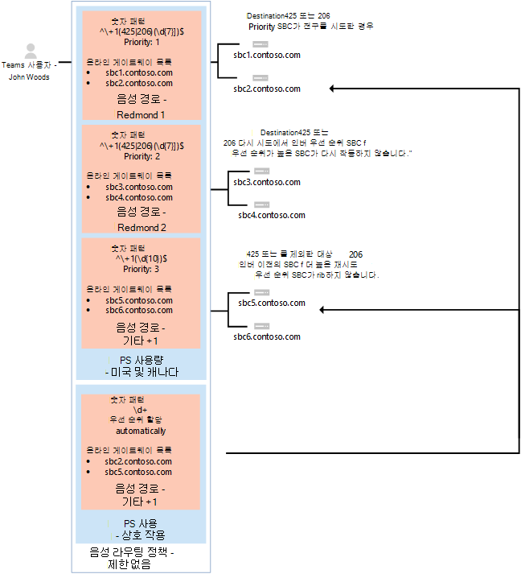

# <a name="configure-voice-routing-for-direct-routing"></a><span data-ttu-id="1f695-103">직접 라우팅에 대한 음성 라우팅 구성</span><span class="sxs-lookup"><span data-stu-id="1f695-103">Configure voice routing for Direct Routing</span></span>

<span data-ttu-id="1f695-104">이 문서에서는 직접 라우팅에 대한 음성 라우팅을 전화 시스템 방법을 설명합니다.</span><span class="sxs-lookup"><span data-stu-id="1f695-104">This article describes how to configure voice routing for Phone System Direct Routing.</span></span>  <span data-ttu-id="1f695-105">직접 라우팅을 구성하기 위한 다음 단계의 3단계입니다.</span><span class="sxs-lookup"><span data-stu-id="1f695-105">This is step 3 of the following steps for configuring Direct Routing:</span></span>

- <span data-ttu-id="1f695-106">1단계.</span><span class="sxs-lookup"><span data-stu-id="1f695-106">Step 1.</span></span> [<span data-ttu-id="1f695-107">커넥트 시스템으로 SBC를 Microsoft 전화 연결의 유효성을 검사합니다.</span><span class="sxs-lookup"><span data-stu-id="1f695-107">Connect the SBC with Microsoft Phone System and validate the connection</span></span>](direct-routing-connect-the-sbc.md) 
- <span data-ttu-id="1f695-108">2단계.</span><span class="sxs-lookup"><span data-stu-id="1f695-108">Step 2.</span></span> [<span data-ttu-id="1f695-109">직접 라우팅, 음성 및 음성메일에 사용자를 사용하도록 설정</span><span class="sxs-lookup"><span data-stu-id="1f695-109">Enable users for Direct Routing, voice, and voicemail</span></span>](direct-routing-enable-users.md)
- <span data-ttu-id="1f695-110">**3단계. 음성 라우팅 구성(이** 문서)</span><span class="sxs-lookup"><span data-stu-id="1f695-110">**Step 3. Configure voice routing** (This article)</span></span>
- <span data-ttu-id="1f695-111">4단계.</span><span class="sxs-lookup"><span data-stu-id="1f695-111">Step 4.</span></span> [<span data-ttu-id="1f695-112">숫자를 대체 형식으로 변환</span><span class="sxs-lookup"><span data-stu-id="1f695-112">Translate numbers to an alternate format</span></span>](direct-routing-translate-numbers.md) 

<span data-ttu-id="1f695-113">직접 라우팅을 설정하는 데 필요한 모든 단계에 대한 자세한 내용은 직접 라우팅 [구성 을 참조하세요.](direct-routing-configure.md)</span><span class="sxs-lookup"><span data-stu-id="1f695-113">For information on all the steps required for setting up Direct Routing, see [Configure Direct Routing](direct-routing-configure.md).</span></span>

## <a name="voice-routing-overview"></a><span data-ttu-id="1f695-114">음성 라우팅 개요</span><span class="sxs-lookup"><span data-stu-id="1f695-114">Voice routing overview</span></span>

<span data-ttu-id="1f695-115">Microsoft 전화 시스템에는 특정 SBC(세션 테두리 컨트롤러)로 호출을 보낼 수 있는 라우팅 메커니즘이 있습니다.</span><span class="sxs-lookup"><span data-stu-id="1f695-115">Microsoft Phone System has a routing mechanism that allows a call to be sent to a specific Session Border Controller (SBC) based on:</span></span> 

- <span data-ttu-id="1f695-116">호출된 숫자 패턴</span><span class="sxs-lookup"><span data-stu-id="1f695-116">The called number pattern</span></span> 
- <span data-ttu-id="1f695-117">호출된 숫자 패턴과 통화를 하는 특정 사용자</span><span class="sxs-lookup"><span data-stu-id="1f695-117">The called number pattern plus the specific user who makes the call</span></span>
 
<span data-ttu-id="1f695-118">SBC는 활성 및 백업으로 지정될 수 있습니다.</span><span class="sxs-lookup"><span data-stu-id="1f695-118">SBCs can be designated as active and backup.</span></span> <span data-ttu-id="1f695-119">활성으로 구성된 SBC를 특정 호출 경로에 사용할 수 없는 경우 호출이 백업 SBC로 라우팅됩니다.</span><span class="sxs-lookup"><span data-stu-id="1f695-119">When the SBC that is configured as active is not available for a specific call route, then the call will be routed to a backup SBC.</span></span>
 
<span data-ttu-id="1f695-120">음성 라우팅은 다음 요소로 구성됩니다.</span><span class="sxs-lookup"><span data-stu-id="1f695-120">Voice routing is made up of the following elements:</span></span> 

- <span data-ttu-id="1f695-121">**음성 라우팅 정책** - 사용자 또는 여러 사용자에게 할당할 수 있는 PSTN 사용량에 대한 컨테이너입니다.</span><span class="sxs-lookup"><span data-stu-id="1f695-121">**Voice routing policy** – A container for PSTN usages, which can be assigned to a user or to multiple users.</span></span> 

- <span data-ttu-id="1f695-122">**PSTN 사용량** - 음성 경로 및 PSTN 사용에 대한 컨테이너로, 다양한 음성 라우팅 정책에서 공유할 수 있습니다.</span><span class="sxs-lookup"><span data-stu-id="1f695-122">**PSTN usages** – A container for voice routes and PSTN usages, which can be shared in different voice routing policies.</span></span> 

- <span data-ttu-id="1f695-123">**음성 경로** - 전화 번호가 패턴과 일치하는 호출에 사용할 온라인 PSTN 게이트웨이의 숫자 패턴 및 집합입니다.</span><span class="sxs-lookup"><span data-stu-id="1f695-123">**Voice routes** – A number pattern and set of online PSTN gateways to use for calls where the calling number matches the pattern.</span></span>

- <span data-ttu-id="1f695-124">**온라인 PSTN 게이트웨이** - 전달 PAI(PAI) 또는 기본 코덱과 같은 SBC를 통해 호출이 배치될 때 적용되는 구성을 저장하는 SBC에 대한 포인터입니다. 음성 경로에 추가할 수 있습니다.</span><span class="sxs-lookup"><span data-stu-id="1f695-124">**Online PSTN gateway** - A pointer to an SBC that also stores the configuration that is applied when a call is placed through the SBC, such as forward P-Asserted-Identity (PAI) or Preferred Codecs; can be added to voice routes.</span></span>

## <a name="voice-routing-policy-considerations"></a><span data-ttu-id="1f695-125">음성 라우팅 정책 고려 사항</span><span class="sxs-lookup"><span data-stu-id="1f695-125">Voice routing policy considerations</span></span>

<span data-ttu-id="1f695-126">사용자에게 통화 계획 라이선스가 있는 경우 해당 사용자의 발신 호출은 Microsoft Calling Plan PSTN 인프라를 통해 자동으로 라우팅됩니다.</span><span class="sxs-lookup"><span data-stu-id="1f695-126">If a user has a Calling Plan license, that user’s outgoing calls are automatically routed through the Microsoft Calling Plan PSTN infrastructure.</span></span> <span data-ttu-id="1f695-127">전화 걸기 계획 사용자에게 온라인 음성 라우팅 정책을 구성하고 할당하는 경우 해당 사용자의 발신 통화가 확인되어 전화 걸기 번호가 온라인 음성 라우팅 정책에 정의된 숫자 패턴과 일치하는지 여부를 판단합니다.</span><span class="sxs-lookup"><span data-stu-id="1f695-127">If you configure and assign an online voice routing policy to a Calling Plan user, that user’s outgoing calls are checked to determine whether the dialed number matches a number pattern defined in the online voice routing policy.</span></span> <span data-ttu-id="1f695-128">일치가 있는 경우 직접 라우팅 트렁크를 통해 호출이 라우팅됩니다.</span><span class="sxs-lookup"><span data-stu-id="1f695-128">If there’s a match, the call is routed through the Direct Routing trunk.</span></span> <span data-ttu-id="1f695-129">일치하는 것이 없는 경우 호출은 호출 계획 PSTN 인프라를 통해 라우팅됩니다.</span><span class="sxs-lookup"><span data-stu-id="1f695-129">If there’s no match, the call is routed through the Calling Plan PSTN infrastructure.</span></span>

> [!CAUTION]
> <span data-ttu-id="1f695-130">전역(Org-wide default) 온라인 음성 라우팅 정책을 구성하고 적용하는 경우 조직의 모든 음성 지원 사용자가 해당 정책을 상속받게 되어 통화 계획 사용자의 PSTN 호출이 직접 라우팅 트렁크로 부적당하게 라우팅될 수 있습니다.</span><span class="sxs-lookup"><span data-stu-id="1f695-130">If you configure and apply the global (Org-wide default) online voice routing policy, all voice-enabled users in your organization will inherit that policy, which may result in PSTN calls from Calling Plan users being inadvertently routed to a Direct Routing trunk.</span></span> <span data-ttu-id="1f695-131">모든 사용자가 글로벌 온라인 음성 라우팅 정책을 사용하지 않는 경우 사용자 지정 온라인 음성 라우팅 정책을 구성하고 개별 음성 지원 사용자에게 할당합니다.</span><span class="sxs-lookup"><span data-stu-id="1f695-131">If you don't want all users to use the global online voice routing policy, configure a custom online voice routing policy and assign it to individual voice-enabled users.</span></span>

## <a name="example-1-voice-routing-with-one-pstn-usage"></a><span data-ttu-id="1f695-132">예제 1: PSTN 사용량이 1개인 음성 라우팅</span><span class="sxs-lookup"><span data-stu-id="1f695-132">Example 1: Voice routing with one PSTN usage</span></span>

<span data-ttu-id="1f695-133">다음 다이어그램에서는 통화 흐름의 음성 라우팅 정책의 두 가지 예제를 보여 주었다.</span><span class="sxs-lookup"><span data-stu-id="1f695-133">The following diagram shows two examples of voice routing policies in a call flow.</span></span>

<span data-ttu-id="1f695-134">**Flow 1(왼쪽)을 호출합니다.** 사용자가 +1 425 XXX XX 또는 +1 206 XXX XXX를 호출하는 경우 호출이 SBC sbc1.contoso.biz 또는 sbc2.contoso.biz.</span><span class="sxs-lookup"><span data-stu-id="1f695-134">**Call Flow 1 (on the left):** If a user makes a call to +1 425 XXX XX XX or +1 206 XXX XX XX, the call is routed to SBC sbc1.contoso.biz or sbc2.contoso.biz.</span></span> <span data-ttu-id="1f695-135">sbc1.contoso.biz 또는 sbc2.contoso.biz 사용할 수 없는 경우 호출이 삭제됩니다.</span><span class="sxs-lookup"><span data-stu-id="1f695-135">If neither sbc1.contoso.biz nor sbc2.contoso.biz are available, the call is dropped.</span></span> 

<span data-ttu-id="1f695-136">**Flow 2(오른쪽)를 호출합니다.** 사용자가 +1 425 XXX XX XX 또는 +1 206 XXX XXX를 호출하는 경우 호출이 먼저 SBC sbc1.contoso.biz 또는 sbc2.contoso.biz.</span><span class="sxs-lookup"><span data-stu-id="1f695-136">**Call Flow 2 (on the right):** If a user makes a call to +1 425 XXX XX XX or +1 206 XXX XX XX, the call is first routed to SBC sbc1.contoso.biz or sbc2.contoso.biz.</span></span> <span data-ttu-id="1f695-137">SBC를 사용할 수 없는 경우 우선 순위가 낮은 경로가 시도됩니다(sbc3.contoso.biz 및 sbc4.contoso.biz.</span><span class="sxs-lookup"><span data-stu-id="1f695-137">If neither SBC is available, the route with lower priority will be tried (sbc3.contoso.biz and sbc4.contoso.biz).</span></span> <span data-ttu-id="1f695-138">사용할 수 있는 SBC가 없는 경우 호출이 삭제됩니다.</span><span class="sxs-lookup"><span data-stu-id="1f695-138">If none of the SBCs are available, the call is dropped.</span></span> 


<span data-ttu-id="1f695-140">두 예제에서 음성 경로에 우선 순위가 할당되는 동안 경로의 SBC는 임의 순서로 시도됩니다.</span><span class="sxs-lookup"><span data-stu-id="1f695-140">In both examples, while the voice route is assigned priorities, the SBCs in the routes are tried in random order.</span></span>

  > [!NOTE]
  > <span data-ttu-id="1f695-141">사용자가 Microsoft Calling Plan 라이선스가 없는 경우 예제 구성에서 패턴 +1 425 XXX XX 또는 +1 206 XXX XX XX와 일치하는 숫자를 제외한 모든 숫자로 호출합니다.</span><span class="sxs-lookup"><span data-stu-id="1f695-141">Unless the user also has a Microsoft Calling Plan license, calls to any number except numbers matching the patterns +1 425 XXX XX XX or +1 206 XXX XX XX in the example configuration are dropped.</span></span> <span data-ttu-id="1f695-142">사용자에게 통화 계획 라이선스가 있는 경우 Microsoft 통화 계획의 정책에 따라 호출이 자동으로 라우팅됩니다.</span><span class="sxs-lookup"><span data-stu-id="1f695-142">If the user has a Calling Plan license, the call is automatically routed according to the policies of the Microsoft Calling Plan.</span></span> <span data-ttu-id="1f695-143">Microsoft 통화 계획은 Microsoft 통화 계획 라이선스가 있는 모든 사용자에게 마지막 경로로 자동으로 적용되며 추가 호출 라우팅 구성이 필요하지 않습니다.</span><span class="sxs-lookup"><span data-stu-id="1f695-143">The Microsoft Calling Plan applies automatically as the last route to all users with the Microsoft Calling Plan license and does not require additional call routing configuration.</span></span>

<span data-ttu-id="1f695-144">다음 다이어그램에 표시된 예제에서 음성 경로가 추가되어 다른 모든 미국 및 캐나다 번호(호출된 번호 패턴 +1 XXX XXX XXX로 이동하는 호출)에 대한 호출을 보낼 수 있습니다.</span><span class="sxs-lookup"><span data-stu-id="1f695-144">In the example shown in the following diagram, a voice route is added to send calls to all other US and Canadian numbers (calls that go to called number pattern +1 XXX XXX XX XX).</span></span>


<span data-ttu-id="1f695-146">다른 모든 호출의 경우 사용자에게 라이선스(Microsoft 전화 시스템 및 Microsoft 통화 요금제)가 있는 경우 자동 경로가 사용됩니다.</span><span class="sxs-lookup"><span data-stu-id="1f695-146">For all other calls, if a user has both licenses (Microsoft Phone System and Microsoft Calling Plan), the automatic route is used.</span></span> <span data-ttu-id="1f695-147">관리자가 만든 온라인 음성 경로의 번호 패턴과 일치하지 않는다면 Microsoft Calling Plan을 통해 호출이 라우팅됩니다.</span><span class="sxs-lookup"><span data-stu-id="1f695-147">If nothing matches the number patterns in the administrator-created online voice routes, then the call is routed through Microsoft Calling Plan.</span></span> <span data-ttu-id="1f695-148">사용자가 시스템만 Microsoft 전화 일치하는 규칙을 사용할 수 있기 때문에 호출이 삭제됩니다.</span><span class="sxs-lookup"><span data-stu-id="1f695-148">If the user only has Microsoft Phone System, the call is dropped because no matching rules are available.</span></span>

  > [!NOTE]
  > <span data-ttu-id="1f695-149">패턴 +1 XXX XXX XXX XX와 일치하는 경로가 하나만 있기 때문에 경로 "기타 +1"에 대한 우선 순위 값은 중요하지 않습니다.</span><span class="sxs-lookup"><span data-stu-id="1f695-149">The Priority value for route "Other +1" doesn't matter in this case because there is only one route that matches the pattern +1 XXX XXX XX XX.</span></span> <span data-ttu-id="1f695-150">사용자가 +1 324 567 89 89를 호출하고 sbc5.contoso.biz 및 sbc6.contoso.biz 모두 사용할 수 없는 경우 호출이 삭제됩니다.</span><span class="sxs-lookup"><span data-stu-id="1f695-150">If a user makes a call to +1 324 567 89 89 and both sbc5.contoso.biz and sbc6.contoso.biz are unavailable, the call is dropped.</span></span>

<span data-ttu-id="1f695-151">다음 표에서는 세 개의 음성 경로를 사용하여 구성을 요약합니다.</span><span class="sxs-lookup"><span data-stu-id="1f695-151">The following table summarizes the configuration using three voice routes.</span></span> <span data-ttu-id="1f695-152">이 예제에서는 세 경로가 모두 동일한 PSTN 사용량인 "미국 및 캐나다"의 일부입니다.</span><span class="sxs-lookup"><span data-stu-id="1f695-152">In this example, all three routes are part of the same PSTN usage, "US and Canada".</span></span>  <span data-ttu-id="1f695-153">모든 경로는 "미국 및 캐나다" PSTN 사용량과 연결됩니다. PSTN 사용량은 "US Only" 음성 라우팅 정책과 연결됩니다.</span><span class="sxs-lookup"><span data-stu-id="1f695-153">All routes are associated with the "US and Canada" PSTN usage  and the PSTN usage is associated with the "US Only" voice routing policy.</span></span>

|<span data-ttu-id="1f695-154">**PSTN 사용**</span><span class="sxs-lookup"><span data-stu-id="1f695-154">**PSTN usage**</span></span>|<span data-ttu-id="1f695-155">**음성 경로**</span><span class="sxs-lookup"><span data-stu-id="1f695-155">**Voice route**</span></span>|<span data-ttu-id="1f695-156">**숫자 패턴**</span><span class="sxs-lookup"><span data-stu-id="1f695-156">**Number pattern**</span></span>|<span data-ttu-id="1f695-157">**우선 순위**</span><span class="sxs-lookup"><span data-stu-id="1f695-157">**Priority**</span></span>|<span data-ttu-id="1f695-158">**SBC**</span><span class="sxs-lookup"><span data-stu-id="1f695-158">**SBC**</span></span>|<span data-ttu-id="1f695-159">**설명**</span><span class="sxs-lookup"><span data-stu-id="1f695-159">**Description**</span></span>|
|:-----|:-----|:-----|:-----|:-----|:-----|
|<span data-ttu-id="1f695-160">미국 및 캐나다</span><span class="sxs-lookup"><span data-stu-id="1f695-160">US and Canada</span></span>|<span data-ttu-id="1f695-161">"Redmond 1"</span><span class="sxs-lookup"><span data-stu-id="1f695-161">"Redmond 1"</span></span>|<span data-ttu-id="1f695-162">^\\+1(425 \| 206)(\d {7} )$</span><span class="sxs-lookup"><span data-stu-id="1f695-162">^\\+1(425\|206)(\d{7})$</span></span>|<span data-ttu-id="1f695-163">1</span><span class="sxs-lookup"><span data-stu-id="1f695-163">1</span></span>|<span data-ttu-id="1f695-164">sbc1.contoso.biz</span><span class="sxs-lookup"><span data-stu-id="1f695-164">sbc1.contoso.biz</span></span><br/><span data-ttu-id="1f695-165">sbc2.contoso.biz</span><span class="sxs-lookup"><span data-stu-id="1f695-165">sbc2.contoso.biz</span></span>|<span data-ttu-id="1f695-166">호출된 숫자 +1 425 XXX XX 또는 +1 206 XXX XX XX에 대한 활성 경로</span><span class="sxs-lookup"><span data-stu-id="1f695-166">Active route for called numbers +1 425 XXX XX XX or +1 206 XXX XX XX</span></span>|
|<span data-ttu-id="1f695-167">미국 및 캐나다</span><span class="sxs-lookup"><span data-stu-id="1f695-167">US and Canada</span></span>|<span data-ttu-id="1f695-168">"Redmond 2"</span><span class="sxs-lookup"><span data-stu-id="1f695-168">"Redmond 2"</span></span>|<span data-ttu-id="1f695-169">^\\+1(425 \| 206)(\d {7} )$</span><span class="sxs-lookup"><span data-stu-id="1f695-169">^\\+1(425\|206)(\d{7})$</span></span>|<span data-ttu-id="1f695-170">2</span><span class="sxs-lookup"><span data-stu-id="1f695-170">2</span></span>|<span data-ttu-id="1f695-171">sbc3.contoso.biz</span><span class="sxs-lookup"><span data-stu-id="1f695-171">sbc3.contoso.biz</span></span><br/><span data-ttu-id="1f695-172">sbc4.contoso.biz</span><span class="sxs-lookup"><span data-stu-id="1f695-172">sbc4.contoso.biz</span></span>|<span data-ttu-id="1f695-173">호출된 숫자에 대한 백업 경로 +1 425 XXX XX XX 또는 +1 206 XXX XX XX</span><span class="sxs-lookup"><span data-stu-id="1f695-173">Backup route for called numbers +1 425 XXX XX XX or +1 206 XXX XX XX</span></span>|
|<span data-ttu-id="1f695-174">미국 및 캐나다</span><span class="sxs-lookup"><span data-stu-id="1f695-174">US and Canada</span></span>|<span data-ttu-id="1f695-175">"기타 +1"</span><span class="sxs-lookup"><span data-stu-id="1f695-175">"Other +1"</span></span>|<span data-ttu-id="1f695-176">^\\+1(\d {10} )$</span><span class="sxs-lookup"><span data-stu-id="1f695-176">^\\+1(\d{10})$</span></span>|<span data-ttu-id="1f695-177">3</span><span class="sxs-lookup"><span data-stu-id="1f695-177">3</span></span>|<span data-ttu-id="1f695-178">sbc5.contoso.biz</span><span class="sxs-lookup"><span data-stu-id="1f695-178">sbc5.contoso.biz</span></span><br/><span data-ttu-id="1f695-179">sbc6.contoso.biz</span><span class="sxs-lookup"><span data-stu-id="1f695-179">sbc6.contoso.biz</span></span>|<span data-ttu-id="1f695-180">호출된 숫자에 대한 경로 +1 XXX XXX XX XX(+1 425 XXX XX 또는 +1 206 XXX XX XX 제외)</span><span class="sxs-lookup"><span data-stu-id="1f695-180">Route for called numbers +1 XXX XXX XX XX (except +1 425 XXX XX XX or +1 206 XXX XX XX)</span></span>|
|||||||

## <a name="example-1-configuration-steps"></a><span data-ttu-id="1f695-181">예제 1: 구성 단계</span><span class="sxs-lookup"><span data-stu-id="1f695-181">Example 1: Configuration steps</span></span>

<span data-ttu-id="1f695-182">다음 예제에서는 다음 방법을 보여줍니다.</span><span class="sxs-lookup"><span data-stu-id="1f695-182">The following example shows how to:</span></span>

1. <span data-ttu-id="1f695-183">단일 PSTN 사용량을 생성합니다.</span><span class="sxs-lookup"><span data-stu-id="1f695-183">Create a single PSTN usage.</span></span>
2. <span data-ttu-id="1f695-184">세 개의 음성 경로를 구성합니다.</span><span class="sxs-lookup"><span data-stu-id="1f695-184">Configure three voice routes.</span></span>
3. <span data-ttu-id="1f695-185">음성 라우팅 정책을 만들 수 있습니다.</span><span class="sxs-lookup"><span data-stu-id="1f695-185">Create a voice routing policy.</span></span>
4. <span data-ttu-id="1f695-186">Spencer Low라는 사용자에게 정책을 할당합니다.</span><span class="sxs-lookup"><span data-stu-id="1f695-186">Assign the policy to a user named Spencer Low.</span></span>

<span data-ttu-id="1f695-187">관리 센터 또는 [Microsoft Teams](#admincenterexample1) [PowerShell을](#powershellexample1) 사용하여 이러한 단계를 수행할 수 있습니다.</span><span class="sxs-lookup"><span data-stu-id="1f695-187">You can use the [Microsoft Teams admin center](#admincenterexample1) or [PowerShell](#powershellexample1) to perform these steps.</span></span>

### <a name="using-the-microsoft-teams-admin-center"></a><span data-ttu-id="1f695-188">Microsoft Teams 관리 센터 사용</span><span class="sxs-lookup"><span data-stu-id="1f695-188">Using the Microsoft Teams admin center</span></span>
<a name="admincenterexample1"></a>

#### <a name="step-1-create-the-us-and-canada-pstn-usage"></a><span data-ttu-id="1f695-189">1단계: "미국 및 캐나다" PSTN 사용량 만들기</span><span class="sxs-lookup"><span data-stu-id="1f695-189">Step 1: Create the "US and Canada" PSTN usage</span></span>

1. <span data-ttu-id="1f695-190">관리 센터의 Microsoft Teams 탐색에서 **Voice** Direct 라우팅으로 이동한 다음 오른쪽 위 모서리에서 PSTN 사용 레코드 관리  >   **를 선택합니다.**</span><span class="sxs-lookup"><span data-stu-id="1f695-190">In the left navigation of the Microsoft Teams admin center, go to **Voice** > **Direct Routing**, and then in the upper-right corner, select **Manage PSTN usage records**.</span></span>
2. <span data-ttu-id="1f695-191">추가 , 미국 및 캐나다 입력을 **클릭한** 다음 적용을 **클릭합니다.**</span><span class="sxs-lookup"><span data-stu-id="1f695-191">Click **Add**, type **US and Canada**, and then click **Apply**.</span></span>

#### <a name="step-2-create-three-voice-routes-redmond-1-redmond-2-and-other-1"></a><span data-ttu-id="1f695-192">2단계: 세 개의 음성 경로 만들기(Redmond 1, Redmond 2 및 기타 +1)</span><span class="sxs-lookup"><span data-stu-id="1f695-192">Step 2: Create three voice routes (Redmond 1, Redmond 2, and Other +1)</span></span>

<span data-ttu-id="1f695-193">다음 단계에서는 음성 경로를 만드는 방법을 설명합니다.</span><span class="sxs-lookup"><span data-stu-id="1f695-193">The following steps describe how to create a voice route.</span></span> <span data-ttu-id="1f695-194">이 예제에서는 이전 표에 설명된 설정을 사용하여 Redmond 1, Redmond 2 및 기타 +1이라는 세 개의 음성 경로를 만들 수 있습니다.</span><span class="sxs-lookup"><span data-stu-id="1f695-194">Use these steps to create the three voice routes named Redmond 1, Redmond 2, and Other +1 for this example by using the settings outlined in the earlier table.</span></span>

1. <span data-ttu-id="1f695-195">관리 센터의 왼쪽 탐색에서 Microsoft Teams 직접 라우팅으로 이동한 다음 음성 경로   >   **탭을 선택합니다.**</span><span class="sxs-lookup"><span data-stu-id="1f695-195">In the left navigation of the Microsoft Teams admin center, go to **Voice** > **Direct Routing**, and then select the **Voice routes** tab.</span></span>
2. <span data-ttu-id="1f695-196">추가 **를** 클릭한 다음 음성 경로에 대한 이름과 설명을 입력합니다.</span><span class="sxs-lookup"><span data-stu-id="1f695-196">Click **Add**, and then enter a name and description for the voice route.</span></span>
3. <span data-ttu-id="1f695-197">우선 순위를 설정하고 전화 걸기 번호 패턴을 지정합니다.</span><span class="sxs-lookup"><span data-stu-id="1f695-197">Set the priority and specify the dialed number pattern.</span></span>
4. <span data-ttu-id="1f695-198">음성 경로로 SBC를 등록하려면 **등록된 SBC(선택 사항)에서** **SBC** 추가를 클릭하고 등록할 SBC를 선택한 다음 적용을 **클릭합니다.**</span><span class="sxs-lookup"><span data-stu-id="1f695-198">To enroll an SBC with the voice route, under **SBCs enrolled (optional)**, click **Add SBCs**, select the SBCs you want to enroll, and then click **Apply**.</span></span>
5. <span data-ttu-id="1f695-199">PSTN 사용 레코드를 추가하려면 **PSTN 사용 레코드(선택 사항)에서 PSTN** 사용량 추가를 클릭하고 추가할 PSTN 레코드를 선택한 다음 적용을 **클릭합니다.** </span><span class="sxs-lookup"><span data-stu-id="1f695-199">To add PSTN usage records, under **PSTN usage records (optional)**, click **Add PSTN usage**, select the PSTN records you want to add, and then click **Apply**.</span></span>
6. <span data-ttu-id="1f695-200">**저장** 을 클릭합니다.</span><span class="sxs-lookup"><span data-stu-id="1f695-200">Click **Save**.</span></span>

#### <a name="step-3-create-a-voice-routing-policy-named-us-only-and-add-the-us-and-canada-pstn-usage-to-the-policy"></a><span data-ttu-id="1f695-201">3단계: "US Only"이라는 음성 라우팅 정책을 만들고 "미국 및 캐나다" PSTN 사용량을 정책에 추가합니다.</span><span class="sxs-lookup"><span data-stu-id="1f695-201">Step 3: Create a voice routing policy named "US Only" and add the "US and Canada" PSTN usage to the policy</span></span>

1. <span data-ttu-id="1f695-202">관리 센터의 왼쪽 탐색에서 Microsoft Teams **음성** 라우팅 정책으로 이동한 다음  >   **추가를 클릭합니다.**</span><span class="sxs-lookup"><span data-stu-id="1f695-202">In the left navigation of the Microsoft Teams admin center, go to **Voice** > **Voice routing policies**, and then click **Add**.</span></span>
2. <span data-ttu-id="1f695-203">**이름로 US Only를** 입력하고 설명을 추가합니다.</span><span class="sxs-lookup"><span data-stu-id="1f695-203">Type **US Only** as the name and add a description.</span></span>
3. <span data-ttu-id="1f695-204">**PSTN 사용** 레코드에서 **PSTN** 사용량 추가를 클릭하고 "미국 및 캐나다" PSTN 사용 레코드를 선택한 다음 적용을 **클릭합니다.**</span><span class="sxs-lookup"><span data-stu-id="1f695-204">Under **PSTN usage records**, click **Add PSTN usage**, select the "US and Canada" PSTN usage record, and then click **Apply**.</span></span>
4. <span data-ttu-id="1f695-205">**저장** 을 클릭합니다.</span><span class="sxs-lookup"><span data-stu-id="1f695-205">Click **Save**.</span></span>

<span data-ttu-id="1f695-206">자세한 내용은 음성 라우팅 정책 관리를 [참조합니다.](manage-voice-routing-policies.md)</span><span class="sxs-lookup"><span data-stu-id="1f695-206">To learn more, see [Manage voice routing policies](manage-voice-routing-policies.md).</span></span>

#### <a name="step-4-assign-the-voice-routing-policy-to-a-user-named-spencer-low"></a><span data-ttu-id="1f695-207">4단계: Spencer Low이라는 사용자에게 음성 라우팅 정책 할당</span><span class="sxs-lookup"><span data-stu-id="1f695-207">Step 4: Assign the voice routing policy to a user named Spencer Low</span></span>

1. <span data-ttu-id="1f695-208">Microsoft Teams 관리 센터의 왼쪽 탐색 창에서 **사용자** 로 이동한 후 해당 사용자를 클릭합니다.</span><span class="sxs-lookup"><span data-stu-id="1f695-208">In the left navigation of the Microsoft Teams admin center, go to **Users**, and then click the user.</span></span>
2. <span data-ttu-id="1f695-209">정책을 **클릭한** 다음 할당된 정책 **옆에** 있는 **편집을 클릭합니다.**</span><span class="sxs-lookup"><span data-stu-id="1f695-209">Click **Policies**, and then next to **Assigned policies**, click **Edit**.</span></span>
3. <span data-ttu-id="1f695-210">음성 **라우팅 정책에서**"US Only" 정책을 선택한 다음 저장을 **클릭합니다.**</span><span class="sxs-lookup"><span data-stu-id="1f695-210">Under **Voice routing policy**, select the "US Only" policy, and then click **Save**.</span></span>

<span data-ttu-id="1f695-211">자세한 내용은 음성 라우팅 정책 관리를 [참조합니다.](manage-voice-routing-policies.md)</span><span class="sxs-lookup"><span data-stu-id="1f695-211">To learn more, see [Manage voice routing policies](manage-voice-routing-policies.md).</span></span>

### <a name="using-powershell"></a><span data-ttu-id="1f695-212">PowerShell 사용</span><span class="sxs-lookup"><span data-stu-id="1f695-212">Using PowerShell</span></span>
<a name="powershellexample1"></a>


#### <a name="step-1-create-the-us-and-canada-pstn-usage"></a><span data-ttu-id="1f695-213">1단계: "미국 및 캐나다" PSTN 사용량 만들기</span><span class="sxs-lookup"><span data-stu-id="1f695-213">Step 1: Create the "US and Canada" PSTN usage</span></span>

<span data-ttu-id="1f695-214">온라인의 원격 PowerShell 세션에서 비즈니스용 Skype 입력합니다.</span><span class="sxs-lookup"><span data-stu-id="1f695-214">In a remote PowerShell session in Skype for Business Online, type:</span></span>

```PowerShell
Set-CsOnlinePstnUsage -Identity Global -Usage @{Add="US and Canada"}
```

<span data-ttu-id="1f695-215">다음을 입력하여 사용량이 생성된지 확인</span><span class="sxs-lookup"><span data-stu-id="1f695-215">Verify that the usage was created by entering:</span></span>

```PowerShell
Get-CSOnlinePSTNUsage
``` 

<span data-ttu-id="1f695-216">이 목록은 Truncated될 수 있는 이름 목록을 반환합니다.</span><span class="sxs-lookup"><span data-stu-id="1f695-216">Which returns a list of names that may be truncated:</span></span>

```console
Identity    : Global
Usage        : {testusage, US and Canada, International, karlUsage. . .}
```

<span data-ttu-id="1f695-217">다음 예제에서는 PowerShell 명령을 실행하여 전체 이름을 표시한 결과를 `(Get-CSOnlinePSTNUsage).usage` 보여 주며 잘리지 않습니다.</span><span class="sxs-lookup"><span data-stu-id="1f695-217">The following example shows the result of running the `(Get-CSOnlinePSTNUsage).usage` PowerShell command to display full names (not truncated):</span></span>

```console
 testusage
 US and Canada
 International
 karlUsage
 New test env
 Tallinn Lab Sonus
 karlUsage2
 Unrestricted
 Two trunks
```

#### <a name="step-2-create-three-voice-routes-redmond-1-redmond-2-and-other-1"></a><span data-ttu-id="1f695-218">2단계: 세 개의 음성 경로 만들기(Redmond 1, Redmond 2 및 기타 +1)</span><span class="sxs-lookup"><span data-stu-id="1f695-218">Step 2: Create three voice routes (Redmond 1, Redmond 2, and Other +1)</span></span>

<span data-ttu-id="1f695-219">"Redmond 1" 경로를 만들 경우 온라인의 PowerShell 세션에서 비즈니스용 Skype 입력합니다.</span><span class="sxs-lookup"><span data-stu-id="1f695-219">To create the "Redmond 1" route, in a PowerShell session in Skype for Business Online, enter:</span></span>

```PowerShell
New-CsOnlineVoiceRoute -Identity "Redmond 1" -NumberPattern "^\+1(425|206)
(\d{7})$" -OnlinePstnGatewayList sbc1.contoso.biz, sbc2.contoso.biz -Priority 1 -OnlinePstnUsages "US and Canada"
```

<span data-ttu-id="1f695-220">반환되는:</span><span class="sxs-lookup"><span data-stu-id="1f695-220">Which returns:</span></span>

```console
Identity                : Redmond 1
Priority                : 1
Description             :
NumberPattern           : ^\+1(425|206) (\d{7})$
OnlinePstnUsages        : {US and Canada}
OnlinePstnGatewayList   : {sbc1.contoso.biz, sbc2.contoso.biz}
Name                    : Redmond 1
```

<span data-ttu-id="1f695-221">Redmond 2 경로를 만들 경우 다음을 입력합니다.</span><span class="sxs-lookup"><span data-stu-id="1f695-221">To create the Redmond 2 route, enter:</span></span>

```PowerShell
New-CsOnlineVoiceRoute -Identity "Redmond 2" -NumberPattern "^\+1(425|206)
(\d{7})$" -OnlinePstnGatewayList sbc3.contoso.biz, sbc4.contoso.biz -Priority 2 -OnlinePstnUsages "US and Canada"
```

<span data-ttu-id="1f695-222">기타 +1 경로를 만들 경우 다음을 입력합니다.</span><span class="sxs-lookup"><span data-stu-id="1f695-222">To create the Other +1 route, enter:</span></span>

```PowerShell
New-CsOnlineVoiceRoute -Identity "Other +1" -NumberPattern "^\+1(\d{10})$"
-OnlinePstnGatewayList sbc5.contoso.biz, sbc6.contoso.biz -OnlinePstnUsages "US and Canada"
```

  > [!CAUTION]
  > <span data-ttu-id="1f695-223">NumberPattern 특성의 정규식이 유효한 식인지 확인하세요.</span><span class="sxs-lookup"><span data-stu-id="1f695-223">Make sure that your regular expression in the NumberPattern attribute is a valid expression.</span></span> <span data-ttu-id="1f695-224">이 웹 사이트를 사용하여 테스트할 수 있습니다. [https://www.regexpal.com](https://www.regexpal.com)</span><span class="sxs-lookup"><span data-stu-id="1f695-224">You can test it using this website: [https://www.regexpal.com](https://www.regexpal.com)</span></span>

<span data-ttu-id="1f695-225">경우에 따라 모든 호출을 동일한 SBC로 라우팅해야 하는 경우도 있습니다. use -NumberPattern ".\*"</span><span class="sxs-lookup"><span data-stu-id="1f695-225">In some cases, there is a need to route all calls to the same SBC; use -NumberPattern ".\*"</span></span>

<span data-ttu-id="1f695-226">모든 호출을 동일한 SBC로 라우팅합니다.</span><span class="sxs-lookup"><span data-stu-id="1f695-226">Route all calls to the same SBC.</span></span>

```PowerShell
Set-CsOnlineVoiceRoute -id "Redmond 1" -NumberPattern ".*" -OnlinePstnGatewayList sbc1.contoso.biz
```

<span data-ttu-id="1f695-227">다음과 같이 옵션을 사용하여 PowerShell 명령을 실행하여 경로를 `Get-CSOnlineVoiceRoute` 올바르게 구성한지 확인합니다.</span><span class="sxs-lookup"><span data-stu-id="1f695-227">Verify that you've correctly configured the route by running the `Get-CSOnlineVoiceRoute` PowerShell command using options as shown:</span></span>

```PowerShell
Get-CsOnlineVoiceRoute | Where-Object {($_.priority -eq 1) -or ($_.priority -eq 2) or ($_.priority -eq 4) -Identity "Redmond 1" -NumberPattern "^\+1(425|206) (\d{7})$" -OnlinePstnGatewayList sbc1.contoso.biz, sbc2.contoso.biz -Priority 1 -OnlinePstnUsages "US and Canada"
```
<span data-ttu-id="1f695-228">반환해야 하는 사항:</span><span class="sxs-lookup"><span data-stu-id="1f695-228">Which should return:</span></span>

```console
Identity            : Redmond 1 
Priority               : 1
Description         : 
NumberPattern         : ^\+1(425|206) (\d{7})$
OnlinePstnUsages     : {US and Canada}     
OnlinePstnGatewayList    : {sbc1.contoso.biz, sbc2.contoso.biz}
Name             : Redmond 1
Identity        : Redmond 2 
Priority               : 2
Description         : 
NumberPattern         : ^\+1(425|206) (\d{7})$
OnlinePstnUsages     : {US and Canada}     
OnlinePstnGatewayList    : {sbc3.contoso.biz, sbc4.contoso.biz}
Name             : Redmond 2
    
Identity        : Other +1 
Priority               : 4
Description         : 
NumberPattern         : ^\+1(\d{10})$
OnlinePstnUsages     : {US and Canada}     
OnlinePstnGatewayList    : {sbc5.contoso.biz, sbc6.contoso.biz}
Name             : Other +1
```

<span data-ttu-id="1f695-229">예제에서 경로 "기타 +1"이 자동으로 우선 순위 4가 할당됩니다.</span><span class="sxs-lookup"><span data-stu-id="1f695-229">In the example, the route "Other +1" was automatically assigned priority 4.</span></span> 

#### <a name="step-3-create-a-voice-routing-policy-named-us-only-and-add-the-us-and-canada-pstn-usage-to-the-policy"></a><span data-ttu-id="1f695-230">3단계: "US Only"이라는 음성 라우팅 정책을 만들고 "미국 및 캐나다" PSTN 사용량을 정책에 추가합니다.</span><span class="sxs-lookup"><span data-stu-id="1f695-230">Step 3: Create a voice routing policy named "US Only" and add the "US and Canada" PSTN usage to the policy</span></span>

<span data-ttu-id="1f695-231">온라인의 PowerShell 세션에서 비즈니스용 Skype 입력합니다.</span><span class="sxs-lookup"><span data-stu-id="1f695-231">In a PowerShell session in Skype for Business Online, type:</span></span>

```PowerShell
New-CsOnlineVoiceRoutingPolicy "US Only" -OnlinePstnUsages "US and Canada"
```

<span data-ttu-id="1f695-232">결과는 이 예제에 표시됩니다.</span><span class="sxs-lookup"><span data-stu-id="1f695-232">The result is shown in this example:</span></span>

```console
Identity            : Tag:US only
OnlinePstnUsages    : {US and Canada}
Description         :
RouteType           : BYOT
```

#### <a name="step-4-assign-the-voice-routing-policy-to-a-user-named-spencer-low"></a><span data-ttu-id="1f695-233">4단계: Spencer Low이라는 사용자에게 음성 라우팅 정책 할당</span><span class="sxs-lookup"><span data-stu-id="1f695-233">Step 4: Assign the voice routing policy to a user named Spencer Low</span></span>

<span data-ttu-id="1f695-234">온라인의 PowerShell 세션에서 비즈니스용 Skype 입력합니다.</span><span class="sxs-lookup"><span data-stu-id="1f695-234">In a PowerShell session in Skype for Business Online, type:</span></span>

```PowerShell
Grant-CsOnlineVoiceRoutingPolicy -Identity "Spencer Low" -PolicyName "US Only"
```

<span data-ttu-id="1f695-235">이 명령을 입력하여 정책 할당의 유효성을 검사합니다.</span><span class="sxs-lookup"><span data-stu-id="1f695-235">Validate the policy assignment by entering this command:</span></span>

```PowerShell
Get-CsOnlineUser "Spencer Low" | select OnlineVoiceRoutingPolicy
```

<span data-ttu-id="1f695-236">명령은 다음을 반환합니다.</span><span class="sxs-lookup"><span data-stu-id="1f695-236">The command returns the following:</span></span>

```console
OnlineVoiceRoutingPolicy
---------------------
US Only
```

## <a name="example-2-voice-routing-with-multiple-pstn-usages"></a><span data-ttu-id="1f695-237">예제 2: 여러 PSTN 사용량이 있는 음성 라우팅</span><span class="sxs-lookup"><span data-stu-id="1f695-237">Example 2: Voice routing with multiple PSTN usages</span></span>

<span data-ttu-id="1f695-238">예제 1에서 만든 음성 라우팅 정책은 Microsoft Calling Plan 라이선스가 사용자에게 할당되지 않는 한 미국 및 캐나다의 전화 번호로만 전화를 걸 수 있습니다.</span><span class="sxs-lookup"><span data-stu-id="1f695-238">The voice routing policy created in Example 1 only allows calls to phone numbers in the US and Canada--unless the Microsoft Calling Plan license is also assigned to the user.</span></span>

<span data-ttu-id="1f695-239">다음 예제에서는 "제한 없음" 음성 라우팅 정책을 만들 수 있습니다.</span><span class="sxs-lookup"><span data-stu-id="1f695-239">In the example that follows, you can create the "No Restrictions" voice routing policy.</span></span> <span data-ttu-id="1f695-240">이 정책은 예제 1에서 만든 "미국 및 캐나다" PSTN 사용량과 새 "국제" PSTN 사용량을 다시 사용합니다.</span><span class="sxs-lookup"><span data-stu-id="1f695-240">The policy reuses the "US and Canada" PSTN usage created in Example 1, as well as the new "International" PSTN usage.</span></span> <span data-ttu-id="1f695-241">이 정책은 다른 모든 호출을 SBC 및 sbc2.contoso.biz sbc5.contoso.biz.</span><span class="sxs-lookup"><span data-stu-id="1f695-241">This policy routes all other calls to the SBCs sbc2.contoso.biz and sbc5.contoso.biz.</span></span>

<span data-ttu-id="1f695-242">표시된 예제에서는 사용자 Spencer Low에 US Only 정책을 할당하고 사용자 John Woods에 제한 없음 정책을 할당하여 라우팅이 다음과 같이 수행됩니다.</span><span class="sxs-lookup"><span data-stu-id="1f695-242">The examples that are shown assign the US Only policy to user Spencer Low, and the No Restrictions policy to the user John Woods so that routing occurs as follows:</span></span>

- <span data-ttu-id="1f695-243">Spencer Low - 미국 전용 정책입니다.</span><span class="sxs-lookup"><span data-stu-id="1f695-243">Spencer Low – US Only policy.</span></span>  <span data-ttu-id="1f695-244">통화는 미국 및 캐나다 번호에만 허용됩니다.</span><span class="sxs-lookup"><span data-stu-id="1f695-244">Calls are allowed only to US and Canadian numbers.</span></span> <span data-ttu-id="1f695-245">Redmond 번호 범위를 호출할 때 특정 SBC 집합을 사용해야 합니다.</span><span class="sxs-lookup"><span data-stu-id="1f695-245">When calling to the Redmond number range, the specific set of SBCs must be used.</span></span> <span data-ttu-id="1f695-246">통화 계획 라이선스가 사용자에게 할당되지 않는 한 미국이 아닌 숫자는 라우팅되지 않습니다.</span><span class="sxs-lookup"><span data-stu-id="1f695-246">Non-US numbers will not be routed unless the Calling Plan license is assigned to the user.</span></span>

- <span data-ttu-id="1f695-247">John Woods – 국제 정책.</span><span class="sxs-lookup"><span data-stu-id="1f695-247">John Woods – International policy.</span></span>  <span data-ttu-id="1f695-248">호출은 모든 번호로 허용됩니다.</span><span class="sxs-lookup"><span data-stu-id="1f695-248">Calls are allowed to any number.</span></span> <span data-ttu-id="1f695-249">Redmond 번호 범위를 호출할 때 특정 SBC 집합을 사용해야 합니다.</span><span class="sxs-lookup"><span data-stu-id="1f695-249">When calling to the Redmond number range, the specific set of SBCs must be used.</span></span> <span data-ttu-id="1f695-250">미국이 아닌 숫자는 sbc2.contoso.biz 및 sbc5.contoso.biz.</span><span class="sxs-lookup"><span data-stu-id="1f695-250">Non-US numbers will be routed using sbc2.contoso.biz and sbc5.contoso.biz.</span></span>


<span data-ttu-id="1f695-252">다른 모든 호출의 경우 사용자에게 라이선스(Microsoft 전화 시스템 및 Microsoft 통화 요금제)가 있는 경우 자동 경로가 사용됩니다.</span><span class="sxs-lookup"><span data-stu-id="1f695-252">For all other calls, if a user has both licenses (Microsoft Phone System and Microsoft Calling Plan), automatic route is used.</span></span> <span data-ttu-id="1f695-253">관리자가 만든 온라인 음성 경로의 번호 패턴과 일치하지 않는다면 Microsoft Calling Plan을 사용하여 호출이 라우팅됩니다.</span><span class="sxs-lookup"><span data-stu-id="1f695-253">If nothing matches the number patterns in the administrator-created online voice routes, then the call is routed using Microsoft Calling Plan.</span></span>  <span data-ttu-id="1f695-254">시스템에만 Microsoft 전화 일치하는 규칙이 제공되어 호출이 삭제됩니다.</span><span class="sxs-lookup"><span data-stu-id="1f695-254">If the user has only Microsoft Phone System, the call is dropped because no matching rules are available.</span></span>



<span data-ttu-id="1f695-256">다음 표에서는 라우팅 정책 "제한 없음" 사용 지정 및 음성 경로를 요약합니다.</span><span class="sxs-lookup"><span data-stu-id="1f695-256">The following table summarizes routing policy "No Restrictions" usage designations and voice routes.</span></span> 

| <span data-ttu-id="1f695-257">PSTN 사용</span><span class="sxs-lookup"><span data-stu-id="1f695-257">PSTN usage</span></span> | <span data-ttu-id="1f695-258">음성 경로</span><span class="sxs-lookup"><span data-stu-id="1f695-258">Voice route</span></span> | <span data-ttu-id="1f695-259">숫자 패턴</span><span class="sxs-lookup"><span data-stu-id="1f695-259">Number pattern</span></span> | <span data-ttu-id="1f695-260">우선 순위</span><span class="sxs-lookup"><span data-stu-id="1f695-260">Priority</span></span> | <span data-ttu-id="1f695-261">SBC</span><span class="sxs-lookup"><span data-stu-id="1f695-261">SBC</span></span> | <span data-ttu-id="1f695-262">설명</span><span class="sxs-lookup"><span data-stu-id="1f695-262">Description</span></span> |
|:-----|:-----|:-----|:-----|:-----|:-----|
|<span data-ttu-id="1f695-263">미국 및 캐나다</span><span class="sxs-lookup"><span data-stu-id="1f695-263">US and Canada</span></span>|<span data-ttu-id="1f695-264">"Redmond 1"</span><span class="sxs-lookup"><span data-stu-id="1f695-264">"Redmond 1"</span></span>|<span data-ttu-id="1f695-265">^\\+1(425 \| 206)(\d {7} )$</span><span class="sxs-lookup"><span data-stu-id="1f695-265">^\\+1(425\|206)(\d{7})$</span></span>|<span data-ttu-id="1f695-266">1</span><span class="sxs-lookup"><span data-stu-id="1f695-266">1</span></span>|<span data-ttu-id="1f695-267">sbc1.contoso.biz</span><span class="sxs-lookup"><span data-stu-id="1f695-267">sbc1.contoso.biz</span></span><br/><span data-ttu-id="1f695-268">sbc2.contoso.biz</span><span class="sxs-lookup"><span data-stu-id="1f695-268">sbc2.contoso.biz</span></span>|<span data-ttu-id="1f695-269">발신자 번호 +1 425 XXX XX 또는 +1 206 XXX XX XX에 대한 활성 경로</span><span class="sxs-lookup"><span data-stu-id="1f695-269">Active route for callee numbers +1 425 XXX XX XX or +1 206 XXX XX XX</span></span>|
|<span data-ttu-id="1f695-270">미국 및 캐나다</span><span class="sxs-lookup"><span data-stu-id="1f695-270">US and Canada</span></span>|<span data-ttu-id="1f695-271">"Redmond 2"</span><span class="sxs-lookup"><span data-stu-id="1f695-271">"Redmond 2"</span></span>|<span data-ttu-id="1f695-272">^\\+1(425 \| 206)(\d {7} )$</span><span class="sxs-lookup"><span data-stu-id="1f695-272">^\\+1(425\|206)(\d{7})$</span></span>|<span data-ttu-id="1f695-273">2</span><span class="sxs-lookup"><span data-stu-id="1f695-273">2</span></span>|<span data-ttu-id="1f695-274">sbc3.contoso.biz</span><span class="sxs-lookup"><span data-stu-id="1f695-274">sbc3.contoso.biz</span></span><br/><span data-ttu-id="1f695-275">sbc4.contoso.biz</span><span class="sxs-lookup"><span data-stu-id="1f695-275">sbc4.contoso.biz</span></span>|<span data-ttu-id="1f695-276">발신자 번호에 대한 백업 경로 +1 425 XXX XX XX 또는 +1 206 XXX XX XX</span><span class="sxs-lookup"><span data-stu-id="1f695-276">Backup route for callee numbers +1 425 XXX XX XX or +1 206 XXX XX XX</span></span>|
|<span data-ttu-id="1f695-277">미국 및 캐나다</span><span class="sxs-lookup"><span data-stu-id="1f695-277">US and Canada</span></span>|<span data-ttu-id="1f695-278">"기타 +1"</span><span class="sxs-lookup"><span data-stu-id="1f695-278">"Other +1"</span></span>|<span data-ttu-id="1f695-279">^\\+1(\d {10} )$</span><span class="sxs-lookup"><span data-stu-id="1f695-279">^\\+1(\d{10})$</span></span>|<span data-ttu-id="1f695-280">3</span><span class="sxs-lookup"><span data-stu-id="1f695-280">3</span></span>|<span data-ttu-id="1f695-281">sbc5.contoso.biz</span><span class="sxs-lookup"><span data-stu-id="1f695-281">sbc5.contoso.biz</span></span><br/><span data-ttu-id="1f695-282">sbc6.contoso.biz</span><span class="sxs-lookup"><span data-stu-id="1f695-282">sbc6.contoso.biz</span></span>|<span data-ttu-id="1f695-283">발신자 번호에 대한 경로 +1 XXX XXX XX XX(+1 425 XXX 또는 +1 206 XXX XX XX 제외)</span><span class="sxs-lookup"><span data-stu-id="1f695-283">Route for callee numbers +1 XXX XXX XX XX (except +1 425 XXX XX XX or +1 206 XXX XX XX)</span></span>|
|<span data-ttu-id="1f695-284">인터내셔널</span><span class="sxs-lookup"><span data-stu-id="1f695-284">International</span></span>|<span data-ttu-id="1f695-285">인터내셔널</span><span class="sxs-lookup"><span data-stu-id="1f695-285">International</span></span>|<span data-ttu-id="1f695-286">\d+</span><span class="sxs-lookup"><span data-stu-id="1f695-286">\d+</span></span>|<span data-ttu-id="1f695-287">4</span><span class="sxs-lookup"><span data-stu-id="1f695-287">4</span></span>|<span data-ttu-id="1f695-288">sbc2.contoso.biz</span><span class="sxs-lookup"><span data-stu-id="1f695-288">sbc2.contoso.biz</span></span><br/><span data-ttu-id="1f695-289">sbc5.contoso.biz</span><span class="sxs-lookup"><span data-stu-id="1f695-289">sbc5.contoso.biz</span></span>|<span data-ttu-id="1f695-290">모든 숫자 패턴에 대한 경로</span><span class="sxs-lookup"><span data-stu-id="1f695-290">Route for any number pattern</span></span> |

  > [!NOTE]
  > - <span data-ttu-id="1f695-291">음성 라우팅 정책의 PSTN 사용량 순서는 중요합니다.</span><span class="sxs-lookup"><span data-stu-id="1f695-291">The order of PSTN usages in voice routing policies is critical.</span></span> <span data-ttu-id="1f695-292">사용량은 순서대로 적용되고 첫 번째 사용에서 일치가 발견된 경우 다른 사용량은 평가되지 않습니다.</span><span class="sxs-lookup"><span data-stu-id="1f695-292">The usages are applied in order, and if a match is found in the first usage, then other usages are never evaluated.</span></span> <span data-ttu-id="1f695-293">"국제" PSTN 사용량은 "미국 및 캐나다" PSTN 사용 후에 배치해야 합니다.</span><span class="sxs-lookup"><span data-stu-id="1f695-293">The "International" PSTN usage must be placed after the  "US and Canada" PSTN usage.</span></span> <span data-ttu-id="1f695-294">PSTN 사용량의 순서를 변경하기 위해 명령을 `Set-CSOnlineVoiceRoutingPolicy` 실행합니다.</span><span class="sxs-lookup"><span data-stu-id="1f695-294">To change the order of the PSTN usages, run the `Set-CSOnlineVoiceRoutingPolicy` command.</span></span> <br/><span data-ttu-id="1f695-295">예를 들어 순서를 "미국 및 캐나다" 첫 번째 및 "인터내셔널"에서 역순 실행으로 변경합니다.</span><span class="sxs-lookup"><span data-stu-id="1f695-295">For example, to change the order from "US and Canada" first and "International" second to the reverse order run:</span></span><br/> `Set-CsOnlineVoiceRoutingPolicy -id tag:"no Restrictions" -OnlinePstnUsages @{Replace="International", "US and Canada"}`
 > - <span data-ttu-id="1f695-296">"기타 +1" 및 "국제" 음성 경로에 대한 우선 순위가 자동으로 할당됩니다.</span><span class="sxs-lookup"><span data-stu-id="1f695-296">The priority for "Other +1" and "International" voice routes are assigned automatically.</span></span> <span data-ttu-id="1f695-297">"Redmond 1" 및 "Redmond 2"보다 낮은 우선 순위가 있는 한 중요하지 않습니다.</span><span class="sxs-lookup"><span data-stu-id="1f695-297">They don't matter as long as they have lower priorities than "Redmond 1" and "Redmond 2."</span></span>

## <a name="example-2-configuration-steps"></a><span data-ttu-id="1f695-298">예제 2: 구성 단계</span><span class="sxs-lookup"><span data-stu-id="1f695-298">Example 2: Configuration steps</span></span>

<span data-ttu-id="1f695-299">다음 예제에서는 다음 방법을 보여줍니다.</span><span class="sxs-lookup"><span data-stu-id="1f695-299">The following example shows how to:</span></span>

1. <span data-ttu-id="1f695-300">인터내셔널이라는 새 PSTN 사용량을 생성합니다.</span><span class="sxs-lookup"><span data-stu-id="1f695-300">Create a new PSTN usage called International.</span></span>
2. <span data-ttu-id="1f695-301">인터내셔널이라는 새 음성 경로를 생성합니다.</span><span class="sxs-lookup"><span data-stu-id="1f695-301">Create a new voice route called International.</span></span>
3. <span data-ttu-id="1f695-302">제한 없음이라는 음성 라우팅 정책을 생성합니다.</span><span class="sxs-lookup"><span data-stu-id="1f695-302">Create a voice routing policy called No Restrictions.</span></span>
4. <span data-ttu-id="1f695-303">사용자 John Woods에 정책을 할당합니다.</span><span class="sxs-lookup"><span data-stu-id="1f695-303">Assign the policy to user John Woods.</span></span>

<span data-ttu-id="1f695-304">관리 센터 또는 [Microsoft Teams](#admincenterexample2) [PowerShell을](#powershellexample2) 사용하여 이러한 단계를 수행할 수 있습니다.</span><span class="sxs-lookup"><span data-stu-id="1f695-304">You can use the [Microsoft Teams admin center](#admincenterexample2) or [PowerShell](#powershellexample2) to perform these steps.</span></span>

### <a name="using-the-microsoft-teams-admin-center"></a><span data-ttu-id="1f695-305">Microsoft Teams 관리 센터 사용</span><span class="sxs-lookup"><span data-stu-id="1f695-305">Using the Microsoft Teams admin center</span></span>
<a name="admincenterexample2"></a>

#### <a name="step-1-create-the-international-pstn-usage"></a><span data-ttu-id="1f695-306">1단계: "국제" PSTN 사용량 만들기</span><span class="sxs-lookup"><span data-stu-id="1f695-306">Step 1: Create the "International" PSTN usage</span></span>

1. <span data-ttu-id="1f695-307">관리 센터의 Microsoft Teams 탐색에서 **Voice** Direct 라우팅으로 이동한 다음 오른쪽 위 모서리에서 PSTN 사용 레코드 관리  >   **를 선택합니다.**</span><span class="sxs-lookup"><span data-stu-id="1f695-307">In the left navigation of the Microsoft Teams admin center, go to **Voice** > **Direct Routing**, and then in the upper-right corner, select **Manage PSTN usage records**.</span></span>
2. <span data-ttu-id="1f695-308">추가 , **국제** 입력을 클릭한 다음 적용을 **클릭합니다.**</span><span class="sxs-lookup"><span data-stu-id="1f695-308">Click **Add**, type **International**, and then click **Apply**.</span></span>

#### <a name="step-2-create-the-international-voice-route"></a><span data-ttu-id="1f695-309">2단계: "국제" 음성 경로 만들기</span><span class="sxs-lookup"><span data-stu-id="1f695-309">Step 2: Create the "International" voice route</span></span>

1. <span data-ttu-id="1f695-310">관리 센터의 왼쪽 탐색에서 Microsoft Teams 직접 라우팅으로 이동한 다음 음성 경로   >   **탭을 선택합니다.**</span><span class="sxs-lookup"><span data-stu-id="1f695-310">In the left navigation of the Microsoft Teams admin center, go to **Voice** > **Direct Routing**, and then select the **Voice routes** tab.</span></span>
2. <span data-ttu-id="1f695-311">**추가를** 클릭하고 이름으로 "International"을 입력한 다음 설명을 추가합니다.</span><span class="sxs-lookup"><span data-stu-id="1f695-311">Click **Add**, enter "International" as the name, and then add the description.</span></span>
3. <span data-ttu-id="1f695-312">우선 순위를 4로 설정한 다음 전화 걸기 번호 패턴을 \d+로 설정합니다.</span><span class="sxs-lookup"><span data-stu-id="1f695-312">Set the priority to 4, and then set the dialed number pattern to \d+.</span></span>
4. <span data-ttu-id="1f695-313">등록된 **SBC(선택** 사항)에서 **SBC** 추가를 클릭하고 sbc2.contoso.biz sbc5.contoso.biz 선택한 다음 적용을 **클릭합니다.**</span><span class="sxs-lookup"><span data-stu-id="1f695-313">Under **SBCs enrolled (optional)**, click **Add SBCs**, select sbc2.contoso.biz and sbc5.contoso.biz, and then click **Apply**.</span></span>
5. <span data-ttu-id="1f695-314">**PSTN 사용 레코드(선택 사항)에서** **PSTN** 사용량 추가를 클릭하고 "국제" PSTN 사용 레코드를 선택한 다음 적용을 **클릭합니다.**</span><span class="sxs-lookup"><span data-stu-id="1f695-314">Under **PSTN usage records (optional)**, click **Add PSTN usage**, select the "International" PSTN usage record, and then click **Apply**.</span></span>
6. <span data-ttu-id="1f695-315">**저장** 을 클릭합니다.</span><span class="sxs-lookup"><span data-stu-id="1f695-315">Click **Save**.</span></span>

#### <a name="step-3-create-a-voice-routing-policy-named-no-restrictions-and-add-the-us-and-canada-and-international-pstn-usages-to-the-policy"></a><span data-ttu-id="1f695-316">3단계: "제한 없음"이라는 음성 라우팅 정책을 만들고 "미국 및 캐나다" 및 "국제" PSTN 사용량을 정책에 추가합니다.</span><span class="sxs-lookup"><span data-stu-id="1f695-316">Step 3: Create a voice routing policy named "No Restrictions" and add the "US and Canada" and "International" PSTN usages to the policy</span></span>

<span data-ttu-id="1f695-317">PSTN 사용 "미국 및 캐나다"는 이 음성 라우팅 정책에서 다시 사용되어 "+1 425 XXX XXX" 및 "+1 206 XXX XX"를 로컬 또는 프레미스 호출로 호출하는 호출에 대한 특수 처리를 보존합니다.</span><span class="sxs-lookup"><span data-stu-id="1f695-317">The PSTN usage "US and Canada" are reused in this voice routing policy to preserve special handling for calls to number "+1 425 XXX XX XX" and "+1 206 XXX XX XX" as local or on-premises calls.</span></span>

1. <span data-ttu-id="1f695-318">관리 센터의 왼쪽 탐색에서 Microsoft Teams **음성** 라우팅 정책으로 이동한 다음  >   **추가를 클릭합니다.**</span><span class="sxs-lookup"><span data-stu-id="1f695-318">In the left navigation of the Microsoft Teams admin center, go to **Voice** > **Voice routing policies**, and then click **Add**.</span></span>
2. <span data-ttu-id="1f695-319">제한 **없음을** 이름으로 입력하고 설명을 추가합니다.</span><span class="sxs-lookup"><span data-stu-id="1f695-319">Type **No Restrictions** as the name and add a description.</span></span>
3. <span data-ttu-id="1f695-320">**PSTN** 사용 레코드에서 PSTN 사용량 추가를 클릭하고 "미국 및 캐나다" **PSTN** 사용 레코드를 선택한 다음 "국제" PSTN 사용 레코드를 선택합니다.</span><span class="sxs-lookup"><span data-stu-id="1f695-320">Under **PSTN usage records**, click **Add PSTN usage**, select the "US and Canada" PSTN usage record, and then select the "International" PSTN usage record.</span></span> <span data-ttu-id="1f695-321">적용 **을 클릭합니다.**</span><span class="sxs-lookup"><span data-stu-id="1f695-321">Click **Apply**.</span></span>

    <span data-ttu-id="1f695-322">PSTN 사용량의 순서를 유의합니다.</span><span class="sxs-lookup"><span data-stu-id="1f695-322">Take note of the order of PSTN usages:</span></span>

    - <span data-ttu-id="1f695-323">이 예제와 같이 구성된 사용량을 사용하여 "+1 425 XXX XXX"를 번호로 호출하는 경우 호출은 "미국 및 캐나다" 사용량에 설정된 경로 집합을 따르고 특수 라우팅 논리가 적용됩니다.</span><span class="sxs-lookup"><span data-stu-id="1f695-323">If a call made to number "+1 425 XXX XX XX" with the usages configured as in this example, the call follows the route set in "US and Canada" usage and the special routing logic is applied.</span></span> <span data-ttu-id="1f695-324">즉, 호출은 sbc1.contoso.biz 및 sbc2.contoso.biz 라우팅한 다음 sbc3.contoso.biz sbc4.contoso.biz 경로로 라우팅됩니다.</span><span class="sxs-lookup"><span data-stu-id="1f695-324">That is, the call is routed using sbc1.contoso.biz and sbc2.contoso.biz first, and then sbc3.contoso.biz and sbc4.contoso.biz as the backup routes.</span></span>

    - <span data-ttu-id="1f695-325">"국제" PSTN 사용량이 "미국 및 캐나다" 앞에 있는 경우 +1 425 XXX XX XX에 대한 호출은 라우팅 논리의 일부로 sbc2.contoso.biz sbc5.contoso.biz 로 라우팅됩니다.</span><span class="sxs-lookup"><span data-stu-id="1f695-325">If "International" PSTN usage is before "US and Canada," calls to +1 425 XXX XX XX are routed to sbc2.contoso.biz and sbc5.contoso.biz as part of the routing logic.</span></span>

4. <span data-ttu-id="1f695-326">**저장** 을 클릭합니다.</span><span class="sxs-lookup"><span data-stu-id="1f695-326">Click **Save**.</span></span>

<span data-ttu-id="1f695-327">자세한 내용은 음성 라우팅 정책 관리를 [참조합니다.](manage-voice-routing-policies.md)</span><span class="sxs-lookup"><span data-stu-id="1f695-327">To learn more, see [Manage voice routing policies](manage-voice-routing-policies.md).</span></span>

#### <a name="step-4-assign-the-voice-routing-policy-to-a-user-named-john-woods"></a><span data-ttu-id="1f695-328">4단계: John Woods라는 사용자에게 음성 라우팅 정책 할당</span><span class="sxs-lookup"><span data-stu-id="1f695-328">Step 4: Assign the voice routing policy to a user named John Woods</span></span>

1. <span data-ttu-id="1f695-329">Microsoft Teams 관리 센터의 왼쪽 탐색 창에서 **사용자** 로 이동한 후 해당 사용자를 클릭합니다.</span><span class="sxs-lookup"><span data-stu-id="1f695-329">In the left navigation of the Microsoft Teams admin center, go to **Users**, and then click the user.</span></span>
2. <span data-ttu-id="1f695-330">정책을 **클릭한** 다음 할당된 정책 **옆에** 있는 **편집을 클릭합니다.**</span><span class="sxs-lookup"><span data-stu-id="1f695-330">Click **Policies**, and then next to **Assigned policies**, click **Edit**.</span></span>
3. <span data-ttu-id="1f695-331">음성 **라우팅 정책에서**"제한 없음" 정책을 선택한 다음 저장을 **클릭합니다.**</span><span class="sxs-lookup"><span data-stu-id="1f695-331">Under **Voice routing policy**, select the "No Restrictions" policy, and then click **Save**.</span></span>

<span data-ttu-id="1f695-332">그 결과 John Woods의 호출에 적용되는 음성 정책은 제한되지 않습니다. 미국, 캐나다 및 국제 통화에 사용할 수 있는 통화 라우팅 논리를 따르게 됩니다.</span><span class="sxs-lookup"><span data-stu-id="1f695-332">The result is that the voice policy applied to John Woods' calls is unrestricted and will follow the logic of call routing available for US, Canada, and International calling.</span></span>

### <a name="using-powershell"></a><span data-ttu-id="1f695-333">PowerShell 사용</span><span class="sxs-lookup"><span data-stu-id="1f695-333">Using PowerShell</span></span>
<a name="powershellexample2"></a>

#### <a name="step-1-create-the-international-pstn-usage"></a><span data-ttu-id="1f695-334">1단계: "국제" PSTN 사용량 만들기</span><span class="sxs-lookup"><span data-stu-id="1f695-334">Step 1: Create the "International" PSTN usage</span></span>

<span data-ttu-id="1f695-335">온라인의 원격 PowerShell 세션에서 비즈니스용 Skype 입력합니다.</span><span class="sxs-lookup"><span data-stu-id="1f695-335">In a remote PowerShell session in Skype for Business Online, enter:</span></span>

```PowerShell
Set-CsOnlinePstnUsage -Identity Global -Usage @{Add="International"}
```

#### <a name="step-2--create-a-new-voice-route-named-international"></a><span data-ttu-id="1f695-336">2단계: "International"이라는 새 음성 경로 만들기</span><span class="sxs-lookup"><span data-stu-id="1f695-336">Step 2:  Create a new voice route named "International"</span></span>

```PowerShell
New-CsOnlineVoiceRoute -Identity "International" -NumberPattern ".*" -OnlinePstnGatewayList sbc2.contoso.biz, sbc5.contoso.biz -OnlinePstnUsages "International"
```

<span data-ttu-id="1f695-337">반환되는:</span><span class="sxs-lookup"><span data-stu-id="1f695-337">Which returns:</span></span>

```console
Identity                  : International
Priority                  : 5
Description               :
NumberPattern             : .*
OnlinePstnUsages          : {International}
OnlinePstnGatewayList     : {sbc2.contoso.biz, sbc5.contoso.biz}
Name                      : International
```

#### <a name="step-3-create-a-voice-routing-policy-named-no-restrictions"></a><span data-ttu-id="1f695-338">3단계: "제한 없음"이라는 음성 라우팅 정책 만들기</span><span class="sxs-lookup"><span data-stu-id="1f695-338">Step 3: Create a voice routing policy named "No Restrictions"</span></span>

<span data-ttu-id="1f695-339">PSTN 사용량 "Redmond 1" 및 "Redmond"는 이 음성 라우팅 정책에서 다시 사용되어 "+1 425 XXX XX" 및 "+1 206 XXX XX XX"를 로컬 또는 프레미스 호출로 호출하는 호출에 대한 특수 처리를 보존합니다.</span><span class="sxs-lookup"><span data-stu-id="1f695-339">The PSTN usage "Redmond 1" and "Redmond" are reused in this voice routing policy to preserve special handling for calls to number "+1 425 XXX XX XX" and "+1 206 XXX XX XX" as local or on-premises calls.</span></span>

  ```PowerShell
  New-CsOnlineVoiceRoutingPolicy "No Restrictions" -OnlinePstnUsages "US and Canada", "International"
  ```

<span data-ttu-id="1f695-340">PSTN 사용량의 순서를 유의합니다.</span><span class="sxs-lookup"><span data-stu-id="1f695-340">Take note of the order of PSTN usages:</span></span>

  - <span data-ttu-id="1f695-341">다음 예제와 같이 구성된 사용량을 사용하여 "+1 425 XXX XXX"를 번호로 호출하는 경우 호출은 "미국 및 캐나다" 사용에 설정된 경로 집합을 따르고 특수 라우팅 논리가 적용됩니다.</span><span class="sxs-lookup"><span data-stu-id="1f695-341">If a call made to number "+1 425 XXX XX XX" with the usages configured as in the following example, the call follows the route set in "US and Canada" usage and the special routing logic is applied.</span></span> <span data-ttu-id="1f695-342">즉, 호출은 sbc1.contoso.biz 및 sbc2.contoso.biz 라우팅한 다음 sbc3.contoso.biz sbc4.contoso.biz 경로로 라우팅됩니다.</span><span class="sxs-lookup"><span data-stu-id="1f695-342">That is, the call is routed using sbc1.contoso.biz and sbc2.contoso.biz first, and then sbc3.contoso.biz and sbc4.contoso.biz as the backup routes.</span></span>

  - <span data-ttu-id="1f695-343">"국제" PSTN 사용량이 "미국 및 캐나다" 앞에 있는 경우 +1 425 XXX XX XX에 대한 호출은 라우팅 논리의 일부로 sbc2.contoso.biz sbc5.contoso.biz 로 라우팅됩니다.</span><span class="sxs-lookup"><span data-stu-id="1f695-343">If "International" PSTN usage is before "US and Canada," calls to +1 425 XXX XX XX are routed to sbc2.contoso.biz and sbc5.contoso.biz as part of the routing logic.</span></span> <span data-ttu-id="1f695-344">명령을 입력합니다.</span><span class="sxs-lookup"><span data-stu-id="1f695-344">Enter the command:</span></span>

  ```PowerShell
  New-CsOnlineVoiceRoutingPolicy "No Restrictions" -OnlinePstnUsages "US and Canada", "International"
  ```

<span data-ttu-id="1f695-345">반환되는:</span><span class="sxs-lookup"><span data-stu-id="1f695-345">Which returns:</span></span>

```console
    Identity              : International 
    OnlinePstnUsages : {US and Canada, International}     
    Description         :  
    RouteType               : BYOT
```

#### <a name="step-4-assign-the-voice-routing-policy-to-the-user-named-john-woods"></a><span data-ttu-id="1f695-346">4단계: John Woods라는 사용자에게 음성 라우팅 정책 할당</span><span class="sxs-lookup"><span data-stu-id="1f695-346">Step 4: Assign the voice routing policy to the user named John Woods</span></span>

```PowerShell
Grant-CsOnlineVoiceRoutingPolicy -Identity "John Woods" -PolicyName "No Restrictions"
```

<span data-ttu-id="1f695-347">그런 다음 명령을 사용하여 할당을 확인합니다.</span><span class="sxs-lookup"><span data-stu-id="1f695-347">Then verify the assignment using the command:</span></span> 

```PowerShell
Get-CsOnlineUser "John Woods" | Select OnlineVoiceRoutingPolicy
```

<span data-ttu-id="1f695-348">반환되는:</span><span class="sxs-lookup"><span data-stu-id="1f695-348">Which returns:</span></span>

```console
OnlineVoiceRoutingPolicy
------------------------
No Restrictions
```

<span data-ttu-id="1f695-349">결과적으로 John Woods의 호출에 적용된 음성 정책은 제한되지 않습니다. 미국, 캐나다 및 국제 통화에 사용할 수 있는 통화 라우팅 논리를 따르게 됩니다.</span><span class="sxs-lookup"><span data-stu-id="1f695-349">The result is that the voice policy applied to John Woods' calls is unrestricted, and will follow the logic of call routing available for US, Canada, and International calling.</span></span>

## <a name="see-also"></a><span data-ttu-id="1f695-350">참고 항목</span><span class="sxs-lookup"><span data-stu-id="1f695-350">See also</span></span>

[<span data-ttu-id="1f695-351">직접 라우팅 계획</span><span class="sxs-lookup"><span data-stu-id="1f695-351">Plan Direct Routing</span></span>](direct-routing-plan.md)

[<span data-ttu-id="1f695-352">직접 라우팅 구성</span><span class="sxs-lookup"><span data-stu-id="1f695-352">Configure Direct Routing</span></span>](direct-routing-configure.md)
