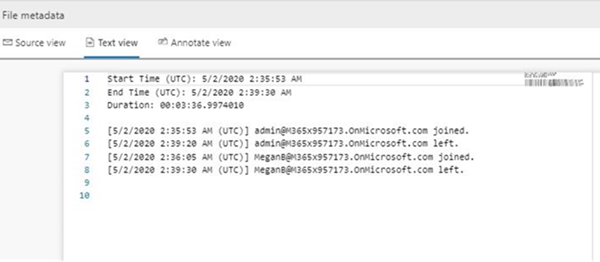
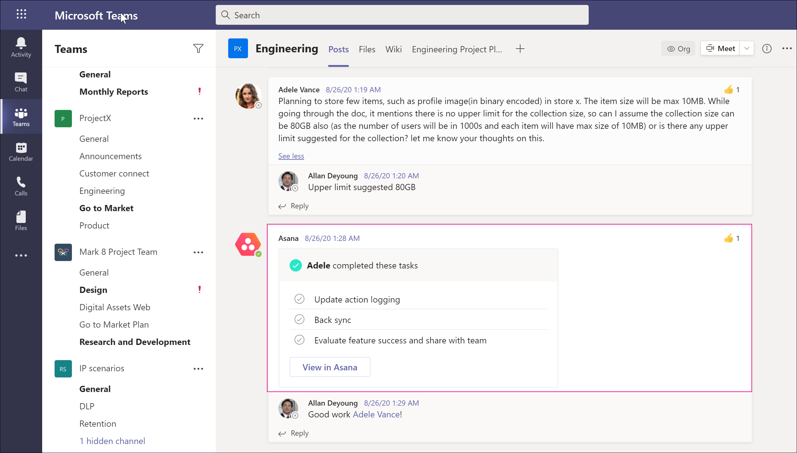

# <a name="conduct-an-ediscovery-investigation-of-content-in-microsoft-teams"></a>Microsoft Teams에서 콘텐츠에 대한 eDiscovery 조사 수행

대기업은 종종 모든 전자 저장 정보 (ESI)의 제출을 요구하는 높은 처벌 법적 절차에 노출됩니다. eDiscovery 조사 중에 Microsoft Teams 콘텐츠를 검색하고 사용할 수 있습니다.

## <a name="overview"></a>개요

모든 Microsoft Teams 1:1 또는 그룹 채팅은 각 사용자의 사서함으로 저널됩니다. 모든 표준 채널 메시지는 팀을 나타내는 그룹 사서함으로 저널링됩니다. 표준 채널에 업로드된 파일은 SharePoint Online 및 비즈니스용 OneDrive 대한 eDiscovery 기능에서 다룹니다.

개인 채널에서 메시지 및 파일의 eDiscovery [는 표준 채널](private-channels.md) 과 다르게 작동합니다. 자세한 내용은 [개인 채널의 eDiscovery를 참조하세요](#ediscovery-of-private-and-shared-channels).

모든 Teams 콘텐츠를 검색할 수 있는 것은 아닙니다. 다음 표에서는 Microsoft eDiscovery 도구를 사용하여 검색할 수 있는 콘텐츠 형식을 보여줍니다.

|**콘텐츠 형식**|**참고**|
|:---------------|:--------|
|오디오 녹음||
|카드 콘텐츠|자세한 내용은 [카드 콘텐츠 검색](#search-for-card-content) 을 참조하세요.|
|채팅 링크||
|채팅 메시지|여기에는 표준 Teams 채널의 콘텐츠, 1:1 채팅, 1:N 그룹 채팅 및 게스트 사용자 참가자와의 채팅이 포함됩니다.|
|코드 조각||
|편집된 메시지|사용자가 보류 중인 경우 이전 버전의 편집된 메시지도 유지됩니다.|
|이모지, GIF 및 스티커||
|인라인 이미지||
|루프 구성 요소|루프 구성 요소의 콘텐츠는 루프 구성 요소를 보내는 사용자의 비즈니스용 OneDrive 계정에 저장된 .fluid 파일에 저장됩니다. 즉, 루프 구성 요소에서 콘텐츠를 검색할 때 OneDrive를 데이터 원본으로 포함해야 합니다.|
|모임 메신저 대화||
|모임 메타데이터<sup>1</sup>||
|채널 이름||
|따옴표|따옴표 붙은 콘텐츠를 검색할 수 있습니다. 그러나 검색 결과는 콘텐츠가 인용되었음을 나타내지 않습니다.|
|반응(예: 좋아요, 하트 및 기타 반응)|반응은 2022년 6월 1일 이후의 모든 상용 고객에 대해 지원됩니다. 이 날짜 이전의 반응은 eDiscovery에 사용할 수 없습니다. 정부 클라우드 지원이 계획되어 있습니다. 반응에 대한 법적 보류 지원은 없습니다.|
|제목||
|테이블||
|Teams 비디오 클립(TVC)|미리 보기를 마우스 오른쪽 단추로 클릭하여 "Video-Clip" 키워드로 TVC를 검색하고 각 TVC 첨부 파일에 대한 .mp4 파일을 "다른 이름으로 저장"합니다(키워드로 검색은 2022년 10월에 제공될 예정). TVC 데이터는 eDiscovery [검토 집합](/microsoft-365/compliance/add-data-to-review-set)에서 검색할 수 있습니다.

<a name="teams-metadata"></a><sup>1</sup> 모임(및 통화) 메타데이터에는 다음이 포함됩니다.

- 모임 시작 및 종료 시간 및 기간
- 각 참가자에 대한 모임 참가 및 나가기 이벤트
- VOIP 조인/호출
- 익명 조인
- 페더레이션된 사용자 조인
- 게스트 사용자 조인

다음은 모임 중에 참가자 간의 채팅 대화의 예입니다.


다음은 eDiscovery 도구에서 볼 수 있는 동일한 채팅 대화의 규정 준수 복사본 예입니다.


다음은 모임 메타데이터의 예입니다.



eDiscovery 조사를 수행하는 방법에 대한 자세한 내용은 [eDiscovery 시작(표준)을 참조하세요](/microsoft-365/compliance/get-started-core-ediscovery).

Microsoft Teams 데이터는 Excel eDiscovery 내보내기 출력에 메신저 대화 또는 대화로 표시됩니다. Outlook에서 파일을 열어 `.pst` 내보낸 후 해당 메시지를 볼 수 있습니다.

팀의 .pst 파일을 볼 때 모든 대화는 대화 기록 아래의 팀 채팅 폴더에 있습니다. 메시지 제목에는 팀 이름과 채널 이름이 포함됩니다. 예를 들어 아래 이미지는 제조 사양 팀의 Project 7 표준 채널에 메시지를 보낸 Bob의 메시지를 보여 줍니다.


사용자의 사서함에 있는 비공개 채팅은 대화 기록 아래의 팀 채팅 폴더에 저장됩니다.

## <a name="ediscovery-of-private-and-shared-channels"></a>개인 및 공유 채널의 eDiscovery

비공개 및 공유 채널의 메시지 준수 복사본은 채널 유형에 따라 다른 사서함으로 전송됩니다. 즉, 사용자가 구성원인 채널의 유형에 따라 다른 사서함 위치를 검색해야 합니다.

- **비공개 채널.** 준수 복사본은 개인 채널 멤버의 모든 멤버 사서함으로 전송됩니다. 즉, 개인 채널 메시지에서 콘텐츠를 검색할 때 사용자 사서함을 검색해야 합니다.

- **공유 채널.** 준수 복사본은 부모 팀과 연결된 시스템 사서함으로 전송됩니다. Teams는 공유 채널에 대한 단일 시스템 사서함의 eDiscovery 검색을 지원하지 않으므로 공유 채널에서 메시지 콘텐츠를 검색할 때 부모 팀의 사서함을 검색해야 합니다(팀 사서함의 이름을 선택하여).

각 비공개 및 공유 채널에는 부모 팀 사이트와 별개인 자체 SharePoint 사이트가 있습니다. 즉, 비공개 및 공유 채널의 파일은 자체 사이트에 저장되고 부모 팀과 독립적으로 관리됩니다. 즉, 파일 및 채널 메시지 첨부 파일에서 콘텐츠를 검색할 때 채널과 연결된 특정 사이트를 식별하고 검색해야 합니다.

다음 섹션을 사용하여 eDiscovery 검색에 포함할 프라이빗 또는 공유 채널을 식별할 수 있습니다.

### <a name="identifying-the-members-of-a-private-channel"></a>비공개 채널의 멤버 식별

eDiscovery 도구를 사용하여 비공개 채널 메시지의 콘텐츠에 대한 구성원의 사서함을 검색할 수 있도록 이 섹션의 절차를 사용하여 비공개 채널의 멤버를 식별합니다.

이러한 단계를 수행하기 전에 [최신 버전의 Teams PowerShell 모듈이](teams-powershell-overview.md) 설치되어 있는지 확인합니다.

1. 다음 명령을 실행하여 검색하려는 공유 채널이 포함된 팀의 그룹 ID를 가져옵니다.

   ```powershell
   Get-Team -DisplayName <display name of the the parent team>
   ```

   > [!TIP]
   > 매개 변수 없이 **Get-Team** cmdlet을 실행하여 조직의 모든 Teams 목록을 표시합니다. 목록에는 모든 팀의 그룹 ID 및 DisplayName이 포함됩니다.

2. 다음 명령을 실행하여 부모 팀의 비공개 채널 목록을 가져옵니다. 1단계에서 얻은 팀의 그룹 ID를 사용합니다.

   ```PowerShell
    Get-TeamChannel -GroupId <parent team GroupId> -MembershipType Private
   ```

3. 다음 명령을 실행하여 특정 프라이빗 채널에 대한 개인 채널 소유자 및 멤버 목록을 가져옵니다.

   ```PowerShell
    Get-TeamChannelUser -GroupId <parent team GroupId> -DisplayName "Partner Shared Channel"
   ```

4. [eDiscovery(표준) 또는 eDiscovery(프리미엄)에서](/microsoft-365/compliance/search-for-content-in-core-ediscovery) [보유자 콘텐츠를 식별하고 수집](/microsoft-365/compliance/add-custodians-to-case)할 때 eDiscovery 검색 쿼리의 일부로 개인 채널의 소유자 및 구성원 사서함을 포함합니다.

### <a name="identifying-the-sharepoint-site-for-private-and-shared-channels"></a>비공개 및 공유 채널에 대한 SharePoint 사이트 식별

앞서 설명한 것처럼 비공개 및 공유 채널에서 공유된 파일(및 채널 메시지에 첨부된 파일)은 채널과 연결된 사이트 모음에 저장됩니다. 이 섹션의 절차를 사용하여 특정 개인 또는 공유 채널과 연결된 사이트의 URL을 식별합니다. 그런 다음 eDiscovery 도구를 사용하여 사이트에서 콘텐츠를 검색할 수 있습니다.

이러한 단계를 수행하기 전에 [SharePoint Online 관리 셸을 설치하고 SharePoint Online에 연결](/powershell/sharepoint/sharepoint-online/connect-sharepoint-online)합니다.

1. 필요에 따라 다음을 실행하여 부모 팀의 공유 채널과 연결된 모든 SharePoint 사이트 모음 목록을 가져옵니다.

   ```PowerShell
    Get-SPOSite
   ```

   > [!TIP]
   > 비공개 및 공유 채널과 연결된 사이트에 대한 URL의 명명 규칙은 입니다 `[SharePoint domain]/sites/[Name of parent team]-[Name of private or shared channel]`. 예를 들어 Contoso 조직의 "엔지니어 팀" 부모 팀에 있는 "파트너 협업"이라는 공유 채널의 URL은 입니다 `https://contoso.sharepoint.com/sites/EngineeringTeam-PartnerCollaboration`.

2. 다음 PowerShell 명령을 실행하여 조직의 비공개 및 공유 채널과 연결된 모든 SharePoint 사이트의 URL을 표시합니다. 스크립트의 출력에는 3단계에서 명령을 실행해야 하는 부모 팀의 그룹 ID도 포함됩니다.

    ```PowerShell
    $sites = Get-SPOSite -Template "TEAMCHANNEL#1"
    foreach ($site in $sites) {$x= Get-SPOSite -Identity $site.url -Detail; $x.relatedgroupID; $x.url}
    ```

   > [!NOTE]
   > 2021년 6월 28일 이전에 만든 비공개 채널에 대한 SharePoint 사이트는 사용자 지정 템플릿 ID 값을 사용합니다 `"TEAMCHANNEL#0"` . 이 날짜 이후에 만든 비공개 채널을 표시하려면 이전 두 스크립트를 실행할 때 값을 `"TEAMCHANNEL#1"` 사용합니다. 공유 채널은 의 `"TEAMCHANNEL#1"`값만 사용합니다.

3. 각 부모 팀에 대해 다음 PowerShell 명령을 실행하여 비공개 및 공유 채널 사이트를 식별합니다. 여기서 `$groupID` 은 부모 팀의 그룹 ID입니다.

    ```PowerShell
    $sites = Get-SPOSite -Template "TEAMCHANNEL#1"
    $groupID = "<group ID of parent team)"
    foreach ($site in $sites) {$x= Get-SpoSite -Identity $site.url -Detail; if ($x.RelatedGroupId -eq $groupID) {$x.RelatedGroupId;$x.url}}
    ```

4. eDiscovery 검색 쿼리의 일부로 개인 또는 공유 채널과 연결된 사이트를 [eDiscovery(표준) 또는 eDiscovery(](/microsoft-365/compliance/search-for-content-in-core-ediscovery)[프리미엄)에서 보유자 콘텐츠를 식별하고 수집할](/microsoft-365/compliance/add-custodians-to-case) 때 포함합니다.

## <a name="search-for-content-for-guest-users"></a>게스트 사용자에 대한 콘텐츠 검색

eDiscovery 도구를 사용하여 조직의 게스트 사용자와 관련된 Teams 콘텐츠를 검색할 수 있습니다. 게스트 사용자와 연결된 Teams 채팅 콘텐츠는 클라우드 기반 스토리지 위치에 유지되며 eDiscovery를 사용하여 검색할 수 있습니다. 여기에는 게스트 사용자가 조직의 다른 사용자와 함께 참여하는 1:1 및 1:N 채팅 대화에서 콘텐츠 검색이 포함됩니다. 게스트 사용자가 참가자인 비공개 채널 메시지를 검색하고 게스트 *:게스트* 채팅 대화에서 게스트 사용자만 있는 콘텐츠를 검색할 수도 있습니다.

게스트 사용자의 콘텐츠를 검색하려면 다음을 수행합니다.

1. Azure AD PowerShell에 연결합니다. 자세한 내용은 [PowerShell을 사용하여 Microsoft 365에 연결](/microsoft-365/enterprise/connect-to-microsoft-365-powershell#connect-with-the-azure-active-directory-powershell-for-graph-module)의 "Azure Active Directory PowerShell로 연결" 섹션을 참조하세요. 이전 문서에서 1단계 및 2단계를 완료해야 합니다.

2. Azure AD PowerShell에 성공적으로 연결한 후 다음 명령을 실행하여 조직의 모든 게스트 사용자의 UPN(사용자 계정 이름)을 표시합니다. 4단계에서 검색을 만들 때 게스트 사용자의 UPN을 사용해야 합니다.

   ```powershell
   Get-AzureADUser -Filter "userType eq 'Guest'" -All $true | FL UserPrincipalName
   ```

   > [!TIP]
   > 컴퓨터 화면에 사용자 계정 이름 목록을 표시하는 대신 명령의 출력을 텍스트 파일로 리디렉션할 수 있습니다. 이 작업은 이전 명령에 추가하여 `> filename.txt` 수행할 수 있습니다. 사용자 계정 이름이 있는 텍스트 파일은 현재 폴더에 저장됩니다.

3. 다른 Windows PowerShell 창에서 보안 & 준수 센터 PowerShell에 연결합니다. 자세한 내용은 [보안 & 준수 센터 PowerShell에 연결을 참조하세요](/powershell/exchange/connect-to-scc-powershell). 다단계 인증을 사용하거나 사용하지 않고 연결할 수 있습니다.

4. 다음 명령을 실행하여 지정된 게스트 사용자가 참가자인 모든 콘텐츠(예: 채팅 메시지 및 전자 메일 메시지)를 검색하는 콘텐츠 검색을 만듭니다.

   ```powershell
   New-ComplianceSearch <search name> -ExchangeLocation <guest user UPN>  -AllowNotFoundExchangeLocationsEnabled $true -IncludeUserAppContent $true
   ```

   예를 들어 게스트 사용자 Sara Davis와 연결된 콘텐츠를 검색하려면 다음 명령을 실행합니다.

   ```powershell
   New-ComplianceSearch "Sara Davis Guest User" -ExchangeLocation "sara.davis_hotmail.com#EXT#@contoso.onmicrosoft.com" -AllowNotFoundExchangeLocationsEnabled $true -IncludeUserAppContent $true
   ```

    PowerShell을 사용하여 콘텐츠 검색을 만드는 방법에 대한 자세한 내용은 [New-ComplianceSearch를 참조하세요](/powershell/module/exchange/new-compliancesearch).

5. 다음 명령을 실행하여 4단계에서 만든 콘텐츠 검색을 시작합니다.

   ```powershell
   Start-ComplianceSearch <search name>
   ```

6. 으로 [https://compliance.microsoft.com](https://compliance.microsoft.com) 이동한 다음 **모든** > **콘텐츠 검색** 표시를 클릭합니다.

7. 검색 목록에서 4단계에서 만든 검색을 선택하여 플라이아웃 페이지를 표시합니다.

8. 플라이아웃 페이지에서 다음 작업을 수행할 수 있습니다.

   - **결과 보기를** 클릭하여 검색 결과를 보고 콘텐츠를 미리 봅니다.

   - **쿼리** 필드 옆에 있는 **편집** 을 클릭하여 편집한 다음 검색을 다시 실행합니다. 예를 들어 검색 쿼리를 추가하여 결과의 범위를 좁힐 수 있습니다.

   - **결과 내보내** 기를 클릭하여 검색 결과를 내보내고 다운로드합니다.

## <a name="search-for-card-content"></a>카드 콘텐츠 검색

Teams 채널, 1:1 채팅 및 1xN 채팅의 앱에서 생성된 카드 콘텐츠는 사서함에 저장되며 검색할 수 있습니다. *카드* 는 짧은 콘텐츠에 대한 UI 컨테이너입니다. 카드에는 여러 속성과 첨부 파일이 있을 수 있으며 카드 작업을 트리거할 수 있는 단추가 포함될 수 있습니다. 자세한 내용은 [카드를 참조하세요.](/microsoftteams/platform/task-modules-and-cards/what-are-cards)

다른 Teams 콘텐츠와 마찬가지로 카드 콘텐츠가 저장되는 위치는 카드가 사용된 위치를 기반으로 합니다. Teams 채널에서 사용되는 카드의 콘텐츠는 Teams 그룹 사서함에 저장됩니다. 1:1 및 1xN 채팅의 카드 콘텐츠는 채팅 참가자의 사서함에 저장됩니다.

카드 콘텐츠를 검색하려면 또는 `itemclass:IPM.SkypeTeams.Message` 검색 조건을 사용할 `kind:microsoftteams` 수 있습니다. 검색 결과를 검토할 때 Teams 채널의 봇에서 생성된 카드 콘텐츠에는 **보낸 사람/작성자** 전자 메일 속성이 로 지정 `<appname>@teams.microsoft.com`됩니다. 여기서 `appname` 은 카드 콘텐츠를 생성한 앱의 이름입니다. 사용자가 카드 콘텐츠를 생성한 경우 **Sender/Author** 값은 사용자를 식별합니다.

콘텐츠 검색 결과에서 카드 콘텐츠를 볼 때 콘텐츠는 메시지에 대한 첨부 파일로 나타납니다. 첨부 파일의 이름은 `appname.html`입니다. 여기서 `appname` 는 카드 콘텐츠를 생성한 앱의 이름입니다. 다음 스크린샷은 Teams 및 검색 결과에 카드 콘텐츠(Asana라는 앱의 경우)가 표시되는 방법을 보여 줍니다.

### <a name="card-content-in-teams"></a>Teams의 카드 콘텐츠



### <a name="card-content-in-search-results"></a>검색 결과의 카드 콘텐츠


> [!NOTE]
> 현재 검색 결과에 카드 콘텐츠의 이미지를 표시하려면(예: 이전 스크린샷의 확인 표시) 검색 결과를 보는 데 사용하는 동일한 브라우저 세션의 다른 탭에서 Teams에 로그인해야 합니다(예 <https://teams.microsoft.com>: 이전 스크린샷의 확인 표시). 그렇지 않으면 이미지 자리 표시자가 표시됩니다.

## <a name="ediscovery-in-federated-and-non-federated-environments"></a>페더레이션된 환경과 페더레이션되지 않은 환경의 eDiscovery

관리자는 eDiscovery를 사용하여 다음 제한 사항에 따라 페더레이션( *외부 액세스* 라고 함) 및 페더레이션되지 않은( *게스트 액세스* 라고 함) 환경의 Teams 모임에서 채팅 메시지의 콘텐츠를 검색할 수 있습니다.

- **페더레이션됨**: 조직의 사용자 및 외부 조직의 사용자(조직에 외부 액세스 권한이 있는 사용자)와 Teams 모임에서 두 조직의 관리자는 모임의 채팅 메시지에서 콘텐츠를 검색할 수 있습니다.

- **비 페더레이션** 됨: 조직 및 게스트 사용자의 사용자와 Teams 모임에서 Teams 모임을 호스트하는 조직의 관리자만 모임의 채팅 메시지에서 콘텐츠를 검색할 수 있습니다.

## <a name="related-topics"></a>관련 주제

- [Microsoft 365 eDiscovery 솔루션](/microsoft-365/compliance/ediscovery)
- [eDiscovery 시작(표준)](/microsoft-365/compliance/get-started-core-ediscovery)
- [eDiscovery의 Teams 워크플로(프리미엄)](/microsoft-365/compliance/teams-workflow-in-advanced-ediscovery)
- [Teams PowerShell 개요](teams-powershell-overview.md)
