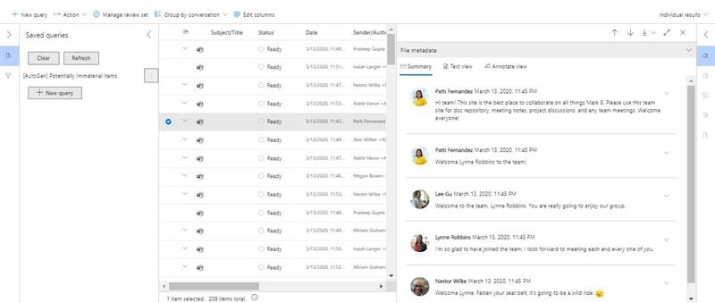

# <a name="conduct-an-ediscovery-investigation-of-content-in-microsoft-teams"></a><span data-ttu-id="e6d78-103">콘텐츠에 대한 eDiscovery 조사를 Microsoft Teams</span><span class="sxs-lookup"><span data-stu-id="e6d78-103">Conduct an eDiscovery investigation of content in Microsoft Teams</span></span>

<span data-ttu-id="e6d78-104">대기업은 종종 ESI(전자적으로 저장된 모든 정보)의 제출을 요구하는 높은 위약금 소송에 노출됩니다.</span><span class="sxs-lookup"><span data-stu-id="e6d78-104">Large Enterprises are often exposed to high penalty legal proceedings that demand submission of all Electronically Stored Information (ESI).</span></span> <span data-ttu-id="e6d78-105">Microsoft Teams eDiscovery 조사 중에 콘텐츠를 검색하고 사용할 수 있습니다.</span><span class="sxs-lookup"><span data-stu-id="e6d78-105">Microsoft Teams content can be searched and used during eDiscovery investigations.</span></span>

## <a name="overview"></a><span data-ttu-id="e6d78-106">개요</span><span class="sxs-lookup"><span data-stu-id="e6d78-106">Overview</span></span>

<span data-ttu-id="e6d78-107">모든 Microsoft Teams 1:1 또는 그룹 채팅은 해당 사용자의 사서함에 저널로 기록됩니다.</span><span class="sxs-lookup"><span data-stu-id="e6d78-107">All Microsoft Teams 1:1 or group chats are journaled through to the respective users' mailboxes.</span></span> <span data-ttu-id="e6d78-108">모든 표준 채널 메시지는 팀을 나타내는 그룹 사서함으로 저널링됩니다.</span><span class="sxs-lookup"><span data-stu-id="e6d78-108">All standard channel messages are journaled through to the group mailbox representing the team.</span></span> <span data-ttu-id="e6d78-109">표준 채널에 업로드된 파일은 온라인 및 SharePoint eDiscovery 기능에 비즈니스용 OneDrive.</span><span class="sxs-lookup"><span data-stu-id="e6d78-109">Files uploaded in standard channels are covered under the eDiscovery functionality for SharePoint Online and OneDrive for Business.</span></span>

<span data-ttu-id="e6d78-110">개인 채널의 메시지 및 파일의 [](private-channels.md) eDiscovery는 표준 채널과 다르게 작동합니다.</span><span class="sxs-lookup"><span data-stu-id="e6d78-110">eDiscovery of messages and files in [private channels](private-channels.md) works differently than in standard channels.</span></span> <span data-ttu-id="e6d78-111">자세한 내용은 [개인 채널의 eDiscovery를 참조하세요.](#ediscovery-of-private-channels)</span><span class="sxs-lookup"><span data-stu-id="e6d78-111">To learn more, see [eDiscovery of private channels](#ediscovery-of-private-channels).</span></span>

<span data-ttu-id="e6d78-112">모든 Teams eDiscoverable은 없습니다.</span><span class="sxs-lookup"><span data-stu-id="e6d78-112">Not all Teams content is eDiscoverable.</span></span> <span data-ttu-id="e6d78-113">다음 표에는 Microsoft eDiscovery 도구를 사용하여 검색할 수 있는 콘텐츠 형식이 표시됩니다.</span><span class="sxs-lookup"><span data-stu-id="e6d78-113">The following table shows the content types that you can search for using Microsoft eDiscovery tools:</span></span>

| <span data-ttu-id="e6d78-114">콘텐츠 형식</span><span class="sxs-lookup"><span data-stu-id="e6d78-114">Content type</span></span> | <span data-ttu-id="e6d78-115">eDiscoverable</span><span class="sxs-lookup"><span data-stu-id="e6d78-115">eDiscoverable</span></span> | <span data-ttu-id="e6d78-116">참고</span><span class="sxs-lookup"><span data-stu-id="e6d78-116">Notes</span></span> |
|:--- | :--- |:--- |
|<span data-ttu-id="e6d78-117">오디오 녹음</span><span class="sxs-lookup"><span data-stu-id="e6d78-117">Audio recordings</span></span> | <span data-ttu-id="e6d78-118">아니요</span><span class="sxs-lookup"><span data-stu-id="e6d78-118">No</span></span> | |
|<span data-ttu-id="e6d78-119">카드 콘텐츠</span><span class="sxs-lookup"><span data-stu-id="e6d78-119">Card content</span></span>|<span data-ttu-id="e6d78-120">예</span><span class="sxs-lookup"><span data-stu-id="e6d78-120">Yes</span></span>|<span data-ttu-id="e6d78-121">자세한 내용은 카드 [콘텐츠 검색을](#search-for-card-content) 참조하세요.</span><span class="sxs-lookup"><span data-stu-id="e6d78-121">See [Search for card content](#search-for-card-content) for more information.</span></span>|
|<span data-ttu-id="e6d78-122">채팅 링크</span><span class="sxs-lookup"><span data-stu-id="e6d78-122">Chat links</span></span> | <span data-ttu-id="e6d78-123">예</span><span class="sxs-lookup"><span data-stu-id="e6d78-123">Yes</span></span> | |
|<span data-ttu-id="e6d78-124">채팅 메시지</span><span class="sxs-lookup"><span data-stu-id="e6d78-124">Chat messages</span></span> | <span data-ttu-id="e6d78-125">예</span><span class="sxs-lookup"><span data-stu-id="e6d78-125">Yes</span></span> |<span data-ttu-id="e6d78-126">여기에는 Teams 채널의 콘텐츠, 1:1 채팅, 1:N 그룹 채팅 및 게스트 사용자 참가자와의 채팅이 포함됩니다.</span><span class="sxs-lookup"><span data-stu-id="e6d78-126">This includes content in Teams channels, 1:1 chats, 1:N group chats, and chats with guest user participants.</span></span>  |
|<span data-ttu-id="e6d78-127">코드 코드 코드 코드</span><span class="sxs-lookup"><span data-stu-id="e6d78-127">Code snippets</span></span> | <span data-ttu-id="e6d78-128">아니요</span><span class="sxs-lookup"><span data-stu-id="e6d78-128">No</span></span> | |
|<span data-ttu-id="e6d78-129">편집된 메시지</span><span class="sxs-lookup"><span data-stu-id="e6d78-129">Edited messages</span></span> | <span data-ttu-id="e6d78-130">예</span><span class="sxs-lookup"><span data-stu-id="e6d78-130">Yes</span></span> | <span data-ttu-id="e6d78-131">사용자가 보류 중이면 편집된 이전 버전의 메시지도 유지됩니다.</span><span class="sxs-lookup"><span data-stu-id="e6d78-131">If the user is on hold, previous versions of edited messages are also preserved.</span></span> |
|<span data-ttu-id="e6d78-132">이모지, GIF 및 스티커</span><span class="sxs-lookup"><span data-stu-id="e6d78-132">Emojis, GIFs, and stickers</span></span> | <span data-ttu-id="e6d78-133">예</span><span class="sxs-lookup"><span data-stu-id="e6d78-133">Yes</span></span> | |
|<span data-ttu-id="e6d78-134">인라인 이미지</span><span class="sxs-lookup"><span data-stu-id="e6d78-134">Inline images</span></span> | <span data-ttu-id="e6d78-135">예</span><span class="sxs-lookup"><span data-stu-id="e6d78-135">Yes</span></span> | |
|<span data-ttu-id="e6d78-136">IM 대화 모임</span><span class="sxs-lookup"><span data-stu-id="e6d78-136">Meeting IM conversations</span></span> | <span data-ttu-id="e6d78-137">예</span><span class="sxs-lookup"><span data-stu-id="e6d78-137">Yes</span></span> | |
|<span data-ttu-id="e6d78-138">모임 메타데이터<sup>1</sup></span><span class="sxs-lookup"><span data-stu-id="e6d78-138">Meeting metadata<sup>1</sup></span></span> | <span data-ttu-id="e6d78-139">예</span><span class="sxs-lookup"><span data-stu-id="e6d78-139">Yes</span></span> |  |
|<span data-ttu-id="e6d78-140">채널 이름</span><span class="sxs-lookup"><span data-stu-id="e6d78-140">Name of channel</span></span> | <span data-ttu-id="e6d78-141">아니요</span><span class="sxs-lookup"><span data-stu-id="e6d78-141">No</span></span> | |
|<span data-ttu-id="e6d78-142">개인 채널 메시지</span><span class="sxs-lookup"><span data-stu-id="e6d78-142">Private channel messages</span></span> | <span data-ttu-id="e6d78-143">예</span><span class="sxs-lookup"><span data-stu-id="e6d78-143">Yes</span></span> | |
|<span data-ttu-id="e6d78-144">따옴표</span><span class="sxs-lookup"><span data-stu-id="e6d78-144">Quotes</span></span> | <span data-ttu-id="e6d78-145">예</span><span class="sxs-lookup"><span data-stu-id="e6d78-145">Yes</span></span> | <span data-ttu-id="e6d78-146">인용된 콘텐츠는 검색할 수 있습니다.</span><span class="sxs-lookup"><span data-stu-id="e6d78-146">Quoted content is searchable.</span></span> <span data-ttu-id="e6d78-147">그러나 검색 결과는 콘텐츠가 인용된 것을 나타내지 않습니다.</span><span class="sxs-lookup"><span data-stu-id="e6d78-147">However, search results don't indicate that the content was quoted.</span></span> |
|<span data-ttu-id="e6d78-148">반응(예: 좋아, 하트 및 기타 반응)</span><span class="sxs-lookup"><span data-stu-id="e6d78-148">Reactions (such as likes, hearts, and other reactions)</span></span> | <span data-ttu-id="e6d78-149">아니요</span><span class="sxs-lookup"><span data-stu-id="e6d78-149">No</span></span> | |
|<span data-ttu-id="e6d78-150">제목</span><span class="sxs-lookup"><span data-stu-id="e6d78-150">Subject</span></span> | <span data-ttu-id="e6d78-151">예</span><span class="sxs-lookup"><span data-stu-id="e6d78-151">Yes</span></span> | |
|<span data-ttu-id="e6d78-152">표</span><span class="sxs-lookup"><span data-stu-id="e6d78-152">Tables</span></span> | <span data-ttu-id="e6d78-153">예</span><span class="sxs-lookup"><span data-stu-id="e6d78-153">Yes</span></span> | |
|<span data-ttu-id="e6d78-154">피드 알림</span><span class="sxs-lookup"><span data-stu-id="e6d78-154">Feed notifications</span></span> | <span data-ttu-id="e6d78-155">아니요</span><span class="sxs-lookup"><span data-stu-id="e6d78-155">No</span></span> | |
|||

<span data-ttu-id="e6d78-156"><sup>1</sup> 모임(및 호출) 메타데이터에는 다음이 포함됩니다.</span><span class="sxs-lookup"><span data-stu-id="e6d78-156"><sup>1</sup> Meeting (and call) metadata includes the following:</span></span>

- <span data-ttu-id="e6d78-157">모임 시작 및 종료 시간 및 기간</span><span class="sxs-lookup"><span data-stu-id="e6d78-157">Meeting start and end time, and duration</span></span>
- <span data-ttu-id="e6d78-158">각 참가자에 대한 모임 참가 및 이벤트 남기기</span><span class="sxs-lookup"><span data-stu-id="e6d78-158">Meeting join and leave events for each participant</span></span>
- <span data-ttu-id="e6d78-159">VOIP 조인/통화</span><span class="sxs-lookup"><span data-stu-id="e6d78-159">VOIP join/calls</span></span>
- <span data-ttu-id="e6d78-160">익명 조인</span><span class="sxs-lookup"><span data-stu-id="e6d78-160">Anonymous join</span></span>
- <span data-ttu-id="e6d78-161">페더리드 사용자 조인</span><span class="sxs-lookup"><span data-stu-id="e6d78-161">Federated user join</span></span>
- <span data-ttu-id="e6d78-162">게스트 사용자 조인</span><span class="sxs-lookup"><span data-stu-id="e6d78-162">Guest user join</span></span>

  <span data-ttu-id="e6d78-163">이미지는 모임 메타데이터의 예제를 보여줍니다.</span><span class="sxs-lookup"><span data-stu-id="e6d78-163">The image shows an example of meeting metadata.</span></span>

  > [!div class="mx-imgBorder"]
  > <span data-ttu-id="e6d78-164"></span><span class="sxs-lookup"><span data-stu-id="e6d78-164"></span></span>

<span data-ttu-id="e6d78-165">다음은 모임 중에 참가자 간의 IM 대화의 예입니다.</span><span class="sxs-lookup"><span data-stu-id="e6d78-165">Here's an example of an IM conversation between participants during the meeting.</span></span>


> [!div class="mx-imgBorder"]
> <span data-ttu-id="e6d78-167"></span><span class="sxs-lookup"><span data-stu-id="e6d78-167"></span></span>

<span data-ttu-id="e6d78-168">eDiscovery 조사 수행에 대한 자세한 내용은 [Core eDiscovery](/microsoft-365/compliance/get-started-core-ediscovery)시작 을 참조하세요.</span><span class="sxs-lookup"><span data-stu-id="e6d78-168">For more information about conducting an eDiscovery investigation, see [Get started with Core eDiscovery](/microsoft-365/compliance/get-started-core-ediscovery).</span></span>

<span data-ttu-id="e6d78-169">Microsoft Teams eDiscovery 내보내기 출력에 im 또는 Conversations로 Excel 표시됩니다.</span><span class="sxs-lookup"><span data-stu-id="e6d78-169">Microsoft Teams data will appear as IM or Conversations in the Excel eDiscovery export output.</span></span> <span data-ttu-id="e6d78-170">파일을 내보낼 Outlook 해당 메시지를 볼 수 `.pst` 있습니다.</span><span class="sxs-lookup"><span data-stu-id="e6d78-170">You can open the `.pst` file in Outlook to view those messages after you export them.</span></span>

<span data-ttu-id="e6d78-171">팀의 .pst 파일을 볼 때 모든 대화는 대화 기록 아래 팀 채팅 폴더에 보관됩니다.</span><span class="sxs-lookup"><span data-stu-id="e6d78-171">When viewing the .pst file for the team, all conversations are kept in the Team Chat folder under Conversation History.</span></span> <span data-ttu-id="e6d78-172">메시지 제목에는 팀 이름과 채널 이름이 포함되어 있습니다.</span><span class="sxs-lookup"><span data-stu-id="e6d78-172">The title of the message contains the team name and channel name.</span></span> <span data-ttu-id="e6d78-173">예를 들어 아래 이미지는 제조 사양 팀의 Project 7개 표준 채널에 메시지를 보낸 Bob의 메시지를 보여줍니다.</span><span class="sxs-lookup"><span data-stu-id="e6d78-173">For example, the image below shows a message from Bob who messaged the Project 7 standard channel of the Manufacturing Specs team.</span></span>


<span data-ttu-id="e6d78-175">사용자의 사서함에 있는 비공개 채팅은 대화 기록 아래 팀 채팅 폴더에 저장됩니다.</span><span class="sxs-lookup"><span data-stu-id="e6d78-175">Private chats in a user's mailbox are stored in the Team Chat folder under Conversation History.</span></span>

## <a name="ediscovery-of-private-channels"></a><span data-ttu-id="e6d78-176">개인 채널의 eDiscovery</span><span class="sxs-lookup"><span data-stu-id="e6d78-176">eDiscovery of private channels</span></span>

<span data-ttu-id="e6d78-177">비공개 채널에 전송된 메시지 레코드는 그룹 사서함이 아닌 모든 비공개 채널 구성원의 사서함에 전달됩니다.</span><span class="sxs-lookup"><span data-stu-id="e6d78-177">Records for messages sent in a private channel are delivered to the mailbox of all private channel members, rather than to a group mailbox.</span></span> <span data-ttu-id="e6d78-178">레코드 제목은 출처 비공개 채널을 표시하도록 형식이 지정됩니다.</span><span class="sxs-lookup"><span data-stu-id="e6d78-178">The titles of the records are formatted to indicate which private channel they were sent from.</span></span>

<span data-ttu-id="e6d78-179">각 개인 채널에는 부모 팀 사이트와 SharePoint 자체 사이트가 있기 때문에 개인 채널의 파일은 부모 팀과 독립적으로 관리됩니다.</span><span class="sxs-lookup"><span data-stu-id="e6d78-179">Because each private channel has its own SharePoint site that's separate from the parent team site, files in a private channel are managed independently of the parent team.</span></span>

<span data-ttu-id="e6d78-180">Teams 팀 내에서 단일 채널의 eDiscovery 검색을 지원하지 않습니다. 따라서 팀 전체를 검색해야 합니다.</span><span class="sxs-lookup"><span data-stu-id="e6d78-180">Teams doesn't support eDiscovery search of a single channel within a team, so the whole team must be searched.</span></span> <span data-ttu-id="e6d78-181">개인 채널에서 콘텐츠의 eDiscovery 검색을 수행하려면 팀, 개인 채널과 연결된 사이트 모음(파일을 포함), 개인 채널 구성원의 사서함(메시지를 포함)을 검색합니다.</span><span class="sxs-lookup"><span data-stu-id="e6d78-181">To perform an eDiscovery search of content in a private channel, search across the team, the site collection associated with the private channel (to include files), and mailboxes of private channel members (to include messages).</span></span>

<span data-ttu-id="e6d78-182">다음 단계를 사용하여 eDiscovery 검색에 포함할 개인 채널의 파일 및 메시지를 식별합니다.</span><span class="sxs-lookup"><span data-stu-id="e6d78-182">Use the following steps to identify files and messages in a private channel to include in your eDiscovery search.</span></span>

### <a name="include-private-channel-files-in-an-ediscovery-search"></a><span data-ttu-id="e6d78-183">eDiscovery 검색에 개인 채널 파일 포함</span><span class="sxs-lookup"><span data-stu-id="e6d78-183">Include private channel files in an eDiscovery search</span></span>

<span data-ttu-id="e6d78-184">이러한 단계를 수행하기 전에 SharePoint 온라인 관리 셸을 설치하고 SharePoint [에 연결합니다.](/powershell/sharepoint/sharepoint-online/connect-sharepoint-online)</span><span class="sxs-lookup"><span data-stu-id="e6d78-184">Before you perform these steps, install the [SharePoint Online Management Shell and connect to  SharePoint Online](/powershell/sharepoint/sharepoint-online/connect-sharepoint-online).</span></span>

1. <span data-ttu-id="e6d78-185">다음을 실행하여 팀의 개인 채널과 SharePoint 모든 사이트 모음의 목록을 얻습니다.</span><span class="sxs-lookup"><span data-stu-id="e6d78-185">Run the following to get a list of all SharePoint site collections associated with private channels in the team.</span></span>

    ```PowerShell
    Get-SPOSite
    ```

2. <span data-ttu-id="e6d78-186">다음 PowerShell 스크립트를 실행하여 팀의 SharePoint 및 부모 팀 그룹 ID와 연결된 모든 사이트 모음 URL의 목록을 얻습니다.</span><span class="sxs-lookup"><span data-stu-id="e6d78-186">Run the following PowerShell script to get a list of all SharePoint site collection URLs associated with private channels in the team and the parent team group ID.</span></span>

    ```PowerShell
    $sites = get-sposite -template "teamchannel#0"
    foreach ($site in $sites) {$x= get-sposite -identity $site.url -detail; $x.relatedgroupID; $x.url}
    ```

3. <span data-ttu-id="e6d78-187">각 팀 또는 그룹 ID에 대해 다음 PowerShell 스크립트를 실행하여 모든 관련 개인 채널 사이트를 식별합니다$groupID 팀의 그룹 ID입니다.</span><span class="sxs-lookup"><span data-stu-id="e6d78-187">For each team or group ID, run the following PowerShell script to identify all relevant private channel sites, where $groupID is the group ID of the team.</span></span>

    ```PowerShell
    $sites = get-sposite -template "teamchannel#0"
    $groupID = "e8195240-4a70-4830-9106-80193cf717cb"
    foreach ($site in $sites) {$x= Get-SpoSite -Identity $site.url -Detail; if ($x.RelatedGroupId -eq $groupID) {$x.RelatedGroupId;$x.url}}
    ```

### <a name="include-private-channel-messages-in-an-ediscovery-search"></a><span data-ttu-id="e6d78-188">eDiscovery 검색에 개인 채널 메시지 포함</span><span class="sxs-lookup"><span data-stu-id="e6d78-188">Include private channel messages in an eDiscovery search</span></span>

<span data-ttu-id="e6d78-189">이러한 단계를 수행하기 전에 최신 버전의 [PowerShell 모듈이](teams-powershell-overview.md) 설치되어 Teams 확인합니다.</span><span class="sxs-lookup"><span data-stu-id="e6d78-189">Before you perform these steps, make sure you have the [latest version of the Teams PowerShell module](teams-powershell-overview.md) installed.</span></span>

1. <span data-ttu-id="e6d78-190">다음 명령을 실행하여 팀에서 개인 채널 목록을 얻습니다.</span><span class="sxs-lookup"><span data-stu-id="e6d78-190">Run the following command to get a list of private channels in the team.</span></span>

    ```PowerShell
    Get-TeamChannel -GroupId <GroupID> -MembershipType Private
    ```

2. <span data-ttu-id="e6d78-191">다음 명령을 실행하여 개인 채널 구성원 목록을 얻습니다.</span><span class="sxs-lookup"><span data-stu-id="e6d78-191">Run the following command to get a list of private channel members.</span></span>

    ```PowerShell
    Get-TeamChannelUser -GroupId <GroupID> -DisplayName "Engineering" -Role Member
    ```

3. <span data-ttu-id="e6d78-192">[eDiscovery](/microsoft-365/compliance/search-for-content-in-core-ediscovery)검색 쿼리의 일부로 팀의 각 개인 채널의 모든 구성원의 사서함을 포함합니다.</span><span class="sxs-lookup"><span data-stu-id="e6d78-192">Include the mailboxes of all members from each private channel in the team as part of your [eDiscovery search query](/microsoft-365/compliance/search-for-content-in-core-ediscovery).</span></span>

## <a name="search-for-content-for-guest-users"></a><span data-ttu-id="e6d78-193">게스트 사용자에 대한 콘텐츠 검색</span><span class="sxs-lookup"><span data-stu-id="e6d78-193">Search for content for guest users</span></span>

<span data-ttu-id="e6d78-194">eDiscovery 도구를 사용하여 조직의 게스트 사용자와 Teams 콘텐츠를 검색할 수 있습니다.</span><span class="sxs-lookup"><span data-stu-id="e6d78-194">You can use eDiscovery tools to search for Teams content related to guest users in your organization.</span></span> <span data-ttu-id="e6d78-195">Teams 사용자와 연결된 채팅 콘텐츠는 클라우드 기반 저장소 위치에 보존되고 eDiscovery를 사용하여 검색할 수 있습니다.</span><span class="sxs-lookup"><span data-stu-id="e6d78-195">Teams chat content that's associated with a guest user is preserved in a cloud-based storage location and can be searched for using eDiscovery.</span></span> <span data-ttu-id="e6d78-196">여기에는 게스트 사용자가 조직의 다른 사용자와 함께 참여하는 1:1 및 1:N 채팅 대화의 콘텐츠를 검색하는 것이 포함됩니다.</span><span class="sxs-lookup"><span data-stu-id="e6d78-196">This includes searching for content in 1:1 and 1:N chat conversations in which a guest user is a participant with other users in your organization.</span></span> <span data-ttu-id="e6d78-197">게스트 사용자가 참여하는 비공개 채널 메시지를 검색하고 *게스트:게스트* 채팅 대화에서 유일한 참가자가 게스트 사용자인 콘텐츠를 검색할 수도 있습니다.</span><span class="sxs-lookup"><span data-stu-id="e6d78-197">You can also search for private channel messages in which a guest user is a participant and search for content in *guest:guest* chat conversations where the only participants are guest users.</span></span>

<span data-ttu-id="e6d78-198">게스트 사용자에 대한 콘텐츠를 검색하는 경우:</span><span class="sxs-lookup"><span data-stu-id="e6d78-198">To search for content for guest users:</span></span>

1. <span data-ttu-id="e6d78-199">커넥트 Ad PowerShell에 대해 설명합니다.</span><span class="sxs-lookup"><span data-stu-id="e6d78-199">Connect to Azure AD PowerShell.</span></span> <span data-ttu-id="e6d78-200">지침은 [PowerShell을](/microsoft-365/enterprise/connect-to-microsoft-365-powershell#connect-with-the-azure-active-directory-powershell-for-graph-module)커넥트 "Azure Active Directory PowerShell" 섹션을 커넥트 Microsoft 365 참조하세요.</span><span class="sxs-lookup"><span data-stu-id="e6d78-200">For instructions, see the "Connect with the Azure Active Directory PowerShell" section in [Connect to Microsoft 365 with PowerShell](/microsoft-365/enterprise/connect-to-microsoft-365-powershell#connect-with-the-azure-active-directory-powershell-for-graph-module).</span></span> <span data-ttu-id="e6d78-201">이전 항목에서 1단계 및 2단계를 완료해야 합니다.</span><span class="sxs-lookup"><span data-stu-id="e6d78-201">Be sure to complete Step 1 and Step 2 in the previous topic.</span></span>

2. <span data-ttu-id="e6d78-202">Azure AD PowerShell에 성공적으로 연결한 후 다음 명령을 실행하여 조직의 모든 게스트 사용자에 대한 UPN(사용자 주체 이름)을 표시합니다.</span><span class="sxs-lookup"><span data-stu-id="e6d78-202">After you successfully connect to Azure AD PowerShell, run the following command to display the user principal name (UPN) for all guest users in your organization.</span></span> <span data-ttu-id="e6d78-203">4단계에서 검색을 만들 때 게스트 사용자의 UPN을 사용해야 합니다.</span><span class="sxs-lookup"><span data-stu-id="e6d78-203">You have to use the UPN of the guest user when you create the search in step 4.</span></span>

   ```powershell
   Get-AzureADUser -Filter "userType eq 'Guest'" -All $true | FL UserPrincipalName
   ```

   > [!TIP]
   > <span data-ttu-id="e6d78-204">컴퓨터 화면에 사용자 주체 이름 목록을 표시하는 대신 명령의 출력을 텍스트 파일로 리디렉션할 수 있습니다.</span><span class="sxs-lookup"><span data-stu-id="e6d78-204">Instead of displaying a list of user principal names on the computer screen, you can redirect the output of the command to a text file.</span></span> <span data-ttu-id="e6d78-205">이전 명령에 추가하여 이 `> filename.txt` 작업을 할 수 있습니다.</span><span class="sxs-lookup"><span data-stu-id="e6d78-205">You can do this by appending `> filename.txt` to the previous command.</span></span> <span data-ttu-id="e6d78-206">사용자 주체 이름이 있는 텍스트 파일이 현재 폴더에 저장됩니다.</span><span class="sxs-lookup"><span data-stu-id="e6d78-206">The text file with the user principal names will be saved to the current folder.</span></span>

3. <span data-ttu-id="e6d78-207">다른 Windows PowerShell 창에서 Security & PowerShell에 연결합니다.</span><span class="sxs-lookup"><span data-stu-id="e6d78-207">In a different Windows PowerShell window, connect to Security & Compliance Center PowerShell.</span></span> <span data-ttu-id="e6d78-208">지침은 준수 [센터 powerShell](/powershell/exchange/connect-to-scc-powershell)커넥트 보안 & 참조하세요.</span><span class="sxs-lookup"><span data-stu-id="e6d78-208">For instructions, see [Connect to Security & Compliance Center PowerShell](/powershell/exchange/connect-to-scc-powershell).</span></span> <span data-ttu-id="e6d78-209">다단계 인증을 사용하지 않고도 연결할 수 있습니다.</span><span class="sxs-lookup"><span data-stu-id="e6d78-209">You can connect with or without using multi-factor authentication.</span></span>

4. <span data-ttu-id="e6d78-210">다음 명령을 실행하여 지정된 게스트 사용자가 참여한 모든 콘텐츠(예: 채팅 메시지 및 전자 메일 메시지)를 검색하는 콘텐츠 검색을 생성합니다.</span><span class="sxs-lookup"><span data-stu-id="e6d78-210">Create a content search that searches for all content (such as chat messages and email messages) in which the specified guest user was a participant by running the following command.</span></span>

   ```powershell
   New-ComplianceSearch <search name> -ExchangeLocation <guest user UPN>  -AllowNotFoundExchangeLocationsEnabled $true -IncludeUserAppContent $true
   ```

   <span data-ttu-id="e6d78-211">예를 들어 게스트 사용자 Sara Davis와 연결된 콘텐츠를 검색하기 위해 다음 명령을 실행합니다.</span><span class="sxs-lookup"><span data-stu-id="e6d78-211">For example, to search for content associated with the guest user Sara Davis, you would run the following command.</span></span>

   ```powershell
   New-ComplianceSearch "Sara Davis Guest User" -ExchangeLocation "sara.davis_hotmail.com#EXT#@contoso.onmicrosoft.com" -AllowNotFoundExchangeLocationsEnabled $true -IncludeUserAppContent $true
   ```

    <span data-ttu-id="e6d78-212">PowerShell을 사용하여 콘텐츠 검색을 만드는 데 대한 자세한 내용은 [New-ComplianceSearch 를 참조하세요.](/powershell/module/exchange/new-compliancesearch)</span><span class="sxs-lookup"><span data-stu-id="e6d78-212">For more information about using PowerShell to create content searches, see [New-ComplianceSearch](/powershell/module/exchange/new-compliancesearch).</span></span>

5. <span data-ttu-id="e6d78-213">다음 명령을 실행하여 4단계에서 만든 콘텐츠 검색을 시작하세요.</span><span class="sxs-lookup"><span data-stu-id="e6d78-213">Run the following command to start the content search that you created in step 4:</span></span>

   ```powershell
   Start-ComplianceSearch <search name>
   ```

6. <span data-ttu-id="e6d78-214">로 [https://compliance.microsoft.com](https://compliance.microsoft.com) 이동한 다음 모든 콘텐츠 **검색**  >  **표시를 클릭합니다.**</span><span class="sxs-lookup"><span data-stu-id="e6d78-214">Go to [https://compliance.microsoft.com](https://compliance.microsoft.com) and then click **Show all** > **Content search**.</span></span>

7. <span data-ttu-id="e6d78-215">검색 목록에서 4단계에서 만든 검색을 선택하여 플라이아웃 페이지를 표시합니다.</span><span class="sxs-lookup"><span data-stu-id="e6d78-215">In the list of searches, select the search that you created in step 4 to display the flyout page.</span></span>

8. <span data-ttu-id="e6d78-216">플라이아웃 페이지에서 다음 작업을 할 수 있습니다.</span><span class="sxs-lookup"><span data-stu-id="e6d78-216">On the flyout page, you can do the following things:</span></span>

   - <span data-ttu-id="e6d78-217">결과 **보기를** 클릭하여 검색 결과를 보고 콘텐츠를 미리 볼 수 있습니다.</span><span class="sxs-lookup"><span data-stu-id="e6d78-217">Click **View results** to view the search results and preview the content.</span></span>

   - <span data-ttu-id="e6d78-218">쿼리 필드 **옆에** 있는 편집을 **클릭하여** 편집한 다음 검색을 다시 실행합니다.</span><span class="sxs-lookup"><span data-stu-id="e6d78-218">Next to the **Query** field, click **Edit** to edit and then rerun the search.</span></span> <span data-ttu-id="e6d78-219">예를 들어 검색 쿼리를 추가하여 결과를 좁힐 수 있습니다.</span><span class="sxs-lookup"><span data-stu-id="e6d78-219">For example, you can add a search query to narrow the results.</span></span>

   - <span data-ttu-id="e6d78-220">결과 **내보내기 를** 클릭하여 검색 결과를 내보내고 다운로드합니다.</span><span class="sxs-lookup"><span data-stu-id="e6d78-220">Click **Export results** to export and download the search results.</span></span>

## <a name="search-for-card-content"></a><span data-ttu-id="e6d78-221">카드 콘텐츠 검색</span><span class="sxs-lookup"><span data-stu-id="e6d78-221">Search for card content</span></span>

<span data-ttu-id="e6d78-222">여러 채널, 1:Teams 채팅 및 1xN 채팅의 앱에서 생성된 카드 콘텐츠는 사서함에 저장되고 검색할 수 있습니다.</span><span class="sxs-lookup"><span data-stu-id="e6d78-222">Card content generated by apps in Teams channels, 1:1 chats, and 1xN chats is stored in mailboxes and can be searched.</span></span> <span data-ttu-id="e6d78-223">*카드는* 짧은 콘텐츠에 대한 UI 컨테이너입니다.</span><span class="sxs-lookup"><span data-stu-id="e6d78-223">A *card* is a UI container for short pieces of content.</span></span> <span data-ttu-id="e6d78-224">카드에는 여러 속성과 첨부 파일이 있을 수 있으며 카드 작업을 트리거할 수 있는 단추를 포함할 수 있습니다.</span><span class="sxs-lookup"><span data-stu-id="e6d78-224">Cards can have multiple properties and attachments, and can include buttons that can trigger card actions.</span></span> <span data-ttu-id="e6d78-225">자세한 내용은 카드를 [참조하세요.](/microsoftteams/platform/task-modules-and-cards/what-are-cards)</span><span class="sxs-lookup"><span data-stu-id="e6d78-225">For more information, see [Cards](/microsoftteams/platform/task-modules-and-cards/what-are-cards)</span></span>

<span data-ttu-id="e6d78-226">다른 Teams 콘텐츠와 마찬가지로 카드 콘텐츠가 저장되는 위치는 카드가 사용된 위치를 기반으로 합니다.</span><span class="sxs-lookup"><span data-stu-id="e6d78-226">Like other Teams content, where card content is stored is based on where the card was used.</span></span> <span data-ttu-id="e6d78-227">채널에 사용되는 카드의 Teams 그룹 사서함에 Teams 저장됩니다.</span><span class="sxs-lookup"><span data-stu-id="e6d78-227">Content for cards used in a Teams channel is stored in the Teams group mailbox.</span></span> <span data-ttu-id="e6d78-228">1:1 및 1xN 채팅에 대한 카드 콘텐츠는 채팅 참가자의 사서함에 저장됩니다.</span><span class="sxs-lookup"><span data-stu-id="e6d78-228">Card content for 1:1 and 1xN chats are stored in the mailboxes of the chat participants.</span></span>

<span data-ttu-id="e6d78-229">카드 콘텐츠를 검색하기 위해 조건 또는 `kind:microsoftteams` 검색을 `itemclass:IPM.SkypeTeams.Message` 사용할 수 있습니다.</span><span class="sxs-lookup"><span data-stu-id="e6d78-229">To search for card content, you can use the `kind:microsoftteams` or `itemclass:IPM.SkypeTeams.Message` search conditions.</span></span> <span data-ttu-id="e6d78-230">검색 결과를 검토할 때 Teams 봇에 의해 생성된 카드 콘텐츠에는 **보낸 사람/작성자** 전자 메일 속성이 있습니다. 여기서 카드 콘텐츠를 생성한 앱의 `<appname>@teams.microsoft.com` `appname` 이름입니다.</span><span class="sxs-lookup"><span data-stu-id="e6d78-230">When reviewing search results, card content generated by bots in a Teams channel has the **Sender/Author** email property as `<appname>@teams.microsoft.com`, where `appname` is the name of the app that generated the card content.</span></span> <span data-ttu-id="e6d78-231">사용자가 카드 콘텐츠를 생성한 경우 **보낸 사람/작성자의 값이** 사용자를 식별합니다.</span><span class="sxs-lookup"><span data-stu-id="e6d78-231">If card content was generated by a user, the value of **Sender/Author** identifies the user.</span></span>

<span data-ttu-id="e6d78-232">콘텐츠 검색 결과에서 카드 콘텐츠를 볼 때 콘텐츠가 메시지에 첨부 파일로 표시됩니다.</span><span class="sxs-lookup"><span data-stu-id="e6d78-232">When viewing card content in Content search results, the content appears as an attachment to the message.</span></span> <span data-ttu-id="e6d78-233">첨부 파일은 이라는 이름입니다. 여기서 카드 콘텐츠를 생성한 `appname.html` `appname` 앱의 이름입니다.</span><span class="sxs-lookup"><span data-stu-id="e6d78-233">The attachment is named `appname.html`, where `appname` is the name of the app that generated the card content.</span></span> <span data-ttu-id="e6d78-234">다음 스크린샷은 카드 콘텐츠(Asana라는 앱의 경우)가 검색 결과와 Teams 표시하는 방법을 보여 주며,</span><span class="sxs-lookup"><span data-stu-id="e6d78-234">The following screenshots show how card content (for an app named Asana) appears in Teams and in the results of a search.</span></span>

<span data-ttu-id="e6d78-235">**카드 콘텐츠가 Teams**</span><span class="sxs-lookup"><span data-stu-id="e6d78-235">**Card content in Teams**</span></span>


<span data-ttu-id="e6d78-237">**검색 결과의 카드 콘텐츠**</span><span class="sxs-lookup"><span data-stu-id="e6d78-237">**Card content in search results**</span></span>
  


> [!NOTE]
> <span data-ttu-id="e6d78-239">현재 카드 콘텐츠의 이미지를 검색 결과에 표시하기 위해(예: 이전 스크린샷의 확인 표시)에 로그인해야 Teams 검색 결과를 보는 데 사용하는 동일한 브라우저 세션의 다른 탭에서 다른 탭에서 로그인해야 https://teams.microsoft.com) 합니다.</span><span class="sxs-lookup"><span data-stu-id="e6d78-239">To display images from card content in search results at this time (such as the checkmarks in the previous screenshot), you have to be signed into Teams (at https://teams.microsoft.com) in a different tab in the same browser session that you use to view the search results.</span></span> <span data-ttu-id="e6d78-240">그렇지 않으면 이미지 자리 표시자가 표시됩니다.</span><span class="sxs-lookup"><span data-stu-id="e6d78-240">Otherwise, image placeholders are displayed.</span></span>

## <a name="advanced-ediscovery"></a><span data-ttu-id="e6d78-241">Advanced eDiscovery</span><span class="sxs-lookup"><span data-stu-id="e6d78-241">Advanced eDiscovery</span></span>

<span data-ttu-id="e6d78-242">일부 Microsoft Teams 워크플로를 사용하여 검색하고 보존할 [Advanced eDiscovery 있습니다.](/microsoft-365/compliance/overview-ediscovery-20)</span><span class="sxs-lookup"><span data-stu-id="e6d78-242">Some Microsoft Teams content can also be searched and preserved using the [Advanced eDiscovery workflow](/microsoft-365/compliance/overview-ediscovery-20).</span></span> <span data-ttu-id="e6d78-243">eDiscovery는 다양한 검색, 보류 및 내보내기 기능을 제공하면서 Advanced eDiscovery 데이터 원본을 식별하고 콘텐츠를 분석할 수 있는 더 많은 도구를 제공합니다.</span><span class="sxs-lookup"><span data-stu-id="e6d78-243">While eDiscovery provides a range of search, hold, and export functionality, Advanced eDiscovery gives compliance administrators more tools to identify data sources and analyze their contents.</span></span>

### <a name="advanced-ediscovery-custodian-workflow-for-teams-content"></a><span data-ttu-id="e6d78-244">Advanced eDiscovery 콘텐츠에 대한 Teams custodian 워크플로</span><span class="sxs-lookup"><span data-stu-id="e6d78-244">Advanced eDiscovery custodian workflow for Teams content</span></span>

<span data-ttu-id="e6d78-245">Custodians는 다양한 팀의 구성원일 수 있습니다.</span><span class="sxs-lookup"><span data-stu-id="e6d78-245">Custodians might be a member of various teams.</span></span> <span data-ttu-id="e6d78-246">이러한 관리인과 Teams 콘텐츠를 캡처할 수 있습니다.</span><span class="sxs-lookup"><span data-stu-id="e6d78-246">You can capture Teams content that is relevant to these custodians.</span></span> <span data-ttu-id="e6d78-247">custodian 워크플로에 대한 지침은 사례에 [custodians 추가를 Advanced eDiscovery 참조하세요.](/microsoft-365/compliance/add-custodians-to-case)</span><span class="sxs-lookup"><span data-stu-id="e6d78-247">For instructions on the custodian workflow, see [Add custodians to an Advanced eDiscovery case](/microsoft-365/compliance/add-custodians-to-case).</span></span>

<span data-ttu-id="e6d78-248">custodian을 추가한 후  다음 단추를 클릭한 다음 추가 **단추를** 클릭합니다.</span><span class="sxs-lookup"><span data-stu-id="e6d78-248">After adding a custodian, click the **Next** button, then the **Add** button.</span></span> <span data-ttu-id="e6d78-249">그런 다음, 추가 위치를 선택하라는 메시지가 표시되는 창이 표시되어 모든 custodian의 멤버 자격과 해당 데이터에 대한 해당 SharePoint 위치가 표시됩니다.</span><span class="sxs-lookup"><span data-stu-id="e6d78-249">A window then displays that prompts you to select additional locations, which will show you all of the custodian's memberships and the corresponding SharePoint site locations for their data.</span></span> <span data-ttu-id="e6d78-250">이러한 모든 데이터 원본 및 팀에서 eDiscovery에 사용할 콘텐츠를 선택한 다음 해당 사용자와 확인한 모든 데이터 원본을 보류할 수 있습니다.</span><span class="sxs-lookup"><span data-stu-id="e6d78-250">From all of these data sources and teams, you can choose the content you want to use for eDiscovery, then place that user and all the data sources that you've identified on hold.</span></span>

<span data-ttu-id="e6d78-251">해당 콘텐츠, Exchange 콘텐츠 또는 둘 다를 포함할지 OneDrive 수 있습니다.</span><span class="sxs-lookup"><span data-stu-id="e6d78-251">You can select whether to include their Exchange content, their OneDrive content, or both.</span></span> <span data-ttu-id="e6d78-252">Exchange 콘텐츠에는 사용자의 사서함에 있는 모든 애플리케이션 콘텐츠(예: 전자 메일, 사서함에 Teams 콘텐츠 등)가 포함됩니다.</span><span class="sxs-lookup"><span data-stu-id="e6d78-252">Exchange content includes all of the application content in the user's mailboxes, such as their email, the Teams content that is stored in their mailbox, and so on.</span></span> <span data-ttu-id="e6d78-253">OneDrive 콘텐츠에는 사용자의 콘텐츠뿐만 아니라 Teams 1:1 채팅, 1:N 채팅 및 채팅에서 공유되는 파일과 같은 OneDrive 모든 콘텐츠가 포함됩니다.</span><span class="sxs-lookup"><span data-stu-id="e6d78-253">The OneDrive content includes not only the user's content, but also all of the Teams content that is stored in OneDrive, such as 1:1 chats, 1:N chats, and files shared in chats.</span></span>

<span data-ttu-id="e6d78-254">또한 custodian이 구성원인 팀을 연결하여 채널 채팅 메시지 및 custodian에 대한 액세스 권한이 있는 파일을 포함하게 할 수도 있습니다.</span><span class="sxs-lookup"><span data-stu-id="e6d78-254">You also have the option to associate any team the custodian is a member of so that channel chat messages and files the custodian has access to are included.</span></span> <span data-ttu-id="e6d78-255">또한 다른 모든 팀이 custodian과 연결될 수 있습니다.</span><span class="sxs-lookup"><span data-stu-id="e6d78-255">Additionally, any other team can be associated with a custodian.</span></span>

> [!NOTE]
> <span data-ttu-id="e6d78-256">개인 채널의 메시지 및 파일의 [](private-channels.md) eDiscovery는 표준 채널과 다르게 작동합니다.</span><span class="sxs-lookup"><span data-stu-id="e6d78-256">eDiscovery of messages and files in [private channels](private-channels.md) works differently than in standard channels.</span></span> <span data-ttu-id="e6d78-257">자세한 내용은 [개인 채널의 eDiscovery를 참조하세요.](#ediscovery-of-private-channels)</span><span class="sxs-lookup"><span data-stu-id="e6d78-257">To learn more, see [eDiscovery of private channels](#ediscovery-of-private-channels).</span></span>

### <a name="placing-a-data-source-on-hold"></a><span data-ttu-id="e6d78-258">데이터 원본을 보류 중</span><span class="sxs-lookup"><span data-stu-id="e6d78-258">Placing a data source on hold</span></span>

<span data-ttu-id="e6d78-259">custodian으로 지정할 특정 사용자가 없는 경우 전체 데이터 원본을 보류할 수 있습니다.</span><span class="sxs-lookup"><span data-stu-id="e6d78-259">If there is no specific user to designate as a custodian, you can place an entire data source on hold.</span></span> <span data-ttu-id="e6d78-260">보류에 대한 자세한 내용은 에서 보류 [Advanced eDiscovery.](/microsoft-365/compliance/managing-holds)</span><span class="sxs-lookup"><span data-stu-id="e6d78-260">For more information on holds, see [Manage holds in Advanced eDiscovery](/microsoft-365/compliance/managing-holds).</span></span>

<span data-ttu-id="e6d78-261">콘텐츠에 대한 보류를 Teams 보류에 포함할 위치를 모두 선택할 수 있습니다.</span><span class="sxs-lookup"><span data-stu-id="e6d78-261">When creating a hold for Teams content, you can choose all of the locations you wish to include in your hold.</span></span> <span data-ttu-id="e6d78-262">사용자가 콘텐츠를 삭제하거나 변경하는 경우에도 보류는 해당 콘텐츠의 이전 버전의 복사본을 유지 관리합니다.</span><span class="sxs-lookup"><span data-stu-id="e6d78-262">Even if users are deleting or changing content, the hold will maintain copies of all previous versions of that content.</span></span>

<span data-ttu-id="e6d78-263">선택적 쿼리를 사용하여 키워드, 날짜 범위, 작성자 및 기타 여러 조건을 기반으로 보류에 대한 조건을 설정할 수도 있습니다.</span><span class="sxs-lookup"><span data-stu-id="e6d78-263">You can also use an optional query to set conditions for the hold based on keywords, date range, author, and many other criteria.</span></span> <span data-ttu-id="e6d78-264">키워드를 지정하지 않으면 해당 데이터 원본의 모든 것은 보류 대상이 됩니다.</span><span class="sxs-lookup"><span data-stu-id="e6d78-264">If you specify no keywords, then everything from that data source will be subject to the hold.</span></span>

### <a name="advanced-ediscovery-searches"></a><span data-ttu-id="e6d78-265">Advanced eDiscovery 검색</span><span class="sxs-lookup"><span data-stu-id="e6d78-265">Advanced eDiscovery searches</span></span>

<span data-ttu-id="e6d78-266">Teams 콘텐츠를 검색할 수도 있습니다.</span><span class="sxs-lookup"><span data-stu-id="e6d78-266">Teams content can also be searched.</span></span> <span data-ttu-id="e6d78-267">검색에 대한 자세한 내용은 에서 사례에 대한 데이터 [수집을 Advanced eDiscovery.](/microsoft-365/compliance/collecting-data-for-ediscovery)</span><span class="sxs-lookup"><span data-stu-id="e6d78-267">For more information on searches, see [Collect data for a case in Advanced eDiscovery](/microsoft-365/compliance/collecting-data-for-ediscovery).</span></span> <span data-ttu-id="e6d78-268">하나의 메시지도 검색 쿼리와 일치하는 경우 검색은 전체 대화를 반환합니다.</span><span class="sxs-lookup"><span data-stu-id="e6d78-268">A search will return an entire conversation if even one message matches the search query.</span></span>

<span data-ttu-id="e6d78-269">검색 쿼리를 만들 때 이미 선택한 모든 원본을 검색할 수 있도록 custodians를 선택할 수 있습니다.</span><span class="sxs-lookup"><span data-stu-id="e6d78-269">When creating a search query, you can choose custodians so that all the sources that you've already selected will be searched.</span></span> <span data-ttu-id="e6d78-270">또한 사용자에게 매핑되지 않은 Teams 사이트와 같은 비저장 원본을 검색할 수도 있습니다.</span><span class="sxs-lookup"><span data-stu-id="e6d78-270">You can also search non-custodial sources such as a Teams site that is not mapped to a user.</span></span> <span data-ttu-id="e6d78-271">선택적 쿼리를 사용하여 콘텐츠 내에서 검색 범위를 Teams 수 있습니다.</span><span class="sxs-lookup"><span data-stu-id="e6d78-271">Optional queries are also available to narrow your search within the Teams content.</span></span>

<span data-ttu-id="e6d78-272">검색을 만들어 선택한 후 선택한 검색에 수행할 수 있는 추가 세부 정보 및 작업이 있는 창이 표시됩니다.</span><span class="sxs-lookup"><span data-stu-id="e6d78-272">After you've created a search and selected it, a window displays with additional details and actions that you can take on the selected search.</span></span> <span data-ttu-id="e6d78-273">통계 단추를  클릭하면 위치 유형, 콘텐츠의 원래 원본, 콘텐츠가 그룹 사서함, 개별 사용자 사서함 또는 특정 사이트에 있는지 여부를 포함하여 검색에 대한 통계를 볼 SharePoint 있습니다.</span><span class="sxs-lookup"><span data-stu-id="e6d78-273">If you click the **Statistics** button, you can view statistics about your search, including breakdowns according to location types, the original source for the content, and whether the content is located in a group mailbox, the individual user mailbox, or a SharePoint site.</span></span> <span data-ttu-id="e6d78-274">따라서 검색 결과에 기여하는 원본의 분석 결과를 볼 수 있습니다.</span><span class="sxs-lookup"><span data-stu-id="e6d78-274">Thus, you can see a breakdown of what sources are contributing to your search results.</span></span> <span data-ttu-id="e6d78-275">또한 쿼리  보기를 사용할 수 있으므로 결과에 어떤 개별 키워드가 기여하는지 볼 수 있습니다.</span><span class="sxs-lookup"><span data-stu-id="e6d78-275">There is also a **Queries** view available so you can see which individual keywords are contributing to your results.</span></span>

<span data-ttu-id="e6d78-276">검색을 마무리한 후 결과 추가를 클릭하여 설정 단추를 검토하고 검토 집합에 추가할 수 있습니다. </span><span class="sxs-lookup"><span data-stu-id="e6d78-276">After you finalize your search, you can click the **Add results to review set** button and add it to a review set.</span></span> <span data-ttu-id="e6d78-277">검토 집합에 대한 자세한 내용은 이 [문서의](/microsoft-365/compliance/managing-review-sets) [](#review-sets-workflow) Advanced eDiscovery 검토 집합 워크플로의 검토 집합 관리를 참조하세요.</span><span class="sxs-lookup"><span data-stu-id="e6d78-277">For more information about review sets, see [Manage review sets in Advanced eDiscovery](/microsoft-365/compliance/managing-review-sets) and [Review Sets workflow](#review-sets-workflow) later in this article.</span></span>

#### <a name="normal-review-sets-and-conversation-review-sets"></a><span data-ttu-id="e6d78-278">일반 검토 집합 및 대화 검토 집합</span><span class="sxs-lookup"><span data-stu-id="e6d78-278">Normal review sets and conversation review sets</span></span>

<span data-ttu-id="e6d78-279">검토 집합에 검색을 추가할 때 일반 검토 집합 또는 대화 검토 집합에서 선택할 수 있습니다.</span><span class="sxs-lookup"><span data-stu-id="e6d78-279">When adding a search to a review set, you can choose from a normal review set or a conversation review set.</span></span>

<span data-ttu-id="e6d78-280">일반 검토 집합은 내보내기와 유사합니다. 콘텐츠에 대한 개별 파일을 Teams 기본 보기에 콘텐츠를 `.msg` 제공합니다.</span><span class="sxs-lookup"><span data-stu-id="e6d78-280">A normal review set is similar to an export; it provides the individual `.msg` files for the Teams content and presents the content in a basic view.</span></span> <span data-ttu-id="e6d78-281">일반적으로 다른 소프트웨어 도구를 사용하여 나중에 파일을 다시 처리할 계획인 경우 일반 검토 집합을 사용합니다.</span><span class="sxs-lookup"><span data-stu-id="e6d78-281">You would typically use a normal review set when you plan to use other software tools to reprocess the files later.</span></span>

<span data-ttu-id="e6d78-282">대화 검토 집합은 대화에 대한 보다 직관적이고 스레드된 보기를 제공합니다. 관련 메시지를 적절한 순서로 표시합니다.</span><span class="sxs-lookup"><span data-stu-id="e6d78-282">A conversation review set provides a more intuitive, threaded view of the conversations; it displays related messages together in the proper order.</span></span>

> [!div class="mx-imgBorder"]
> <span data-ttu-id="e6d78-283"></span><span class="sxs-lookup"><span data-stu-id="e6d78-283"></span></span>

<span data-ttu-id="e6d78-284">재연장과 같은 기능은 두 가지 유형의 검토 집합에서 사용할 수 있습니다.</span><span class="sxs-lookup"><span data-stu-id="e6d78-284">Functionality such as redaction is available in both types of review sets.</span></span> <span data-ttu-id="e6d78-285">검토 집합에 대한 자세한 내용은 고급 [eDiscovery의 대화 검토를 참조하세요.](/microsoft-365/compliance/conversation-review-sets)</span><span class="sxs-lookup"><span data-stu-id="e6d78-285">For more information about review sets, see [Review conversations in advanced eDiscovery](/microsoft-365/compliance/conversation-review-sets).</span></span>

#### <a name="collection-options"></a><span data-ttu-id="e6d78-286">컬렉션 옵션</span><span class="sxs-lookup"><span data-stu-id="e6d78-286">Collection options</span></span>

<span data-ttu-id="e6d78-287">검토 집합에 추가할 때 대화 검색 옵션 및 대화  를 포함하여 창의  **컬렉션 옵션 섹션에서** 확인란으로 사용할 수 있는 몇 가지 옵션이 Teams 있습니다.</span><span class="sxs-lookup"><span data-stu-id="e6d78-287">When adding to a review set, there are several options available as checkboxes under the **Collection Options** section of the window, including **Conversation Retrieval Options** and **Teams Conversations**.</span></span> <span data-ttu-id="e6d78-288">이러한 옵션을 사용하도록 설정하면 검토 집합에 Teams 개별 메시지도 상황에 맞는 추가 메시지와 함께 표시됩니다.</span><span class="sxs-lookup"><span data-stu-id="e6d78-288">If you enable these options, any individual Teams messages that are part of your review set will also be shown with additional messages surrounding them for context.</span></span> <span data-ttu-id="e6d78-289">예를 들어 쿼리가 특정하고 하나의 메시지만 결과로 반환되는 경우 이러한 옵션을 사용하도록 설정하면 쿼리와 일치하는 메시지까지 이어지는 여러 메시지를 반환합니다.</span><span class="sxs-lookup"><span data-stu-id="e6d78-289">For example, if your query is specific and only one message is returned as a result, enabling these options will also return several messages leading up to and following the message that matched your query.</span></span>

<span data-ttu-id="e6d78-290">많은 논리적 조건은 추가 메시지가 쿼리와 일치하는 메시지에 컨텍스트를 제공하는지 여부를 결정하는 데 사용됩니다.</span><span class="sxs-lookup"><span data-stu-id="e6d78-290">Many logical criteria are used to determine whether additional messages provide context to messages that match your query.</span></span> <span data-ttu-id="e6d78-291">예를 들어 Teams 콘텐츠의 경우 이러한 옵션을 사용하도록 설정하면 메시지가 스레드되는 방식 때문에 부모 메시지와 모든 자식 메시지를 검색합니다.</span><span class="sxs-lookup"><span data-stu-id="e6d78-291">For example, for Teams content, enabling these options will retrieve the parent message and all the child messages because of the way the messages are threaded.</span></span>

<span data-ttu-id="e6d78-292">메시지 타임스탬프도 선택됩니다.</span><span class="sxs-lookup"><span data-stu-id="e6d78-292">Message time stamps are also checked.</span></span> <span data-ttu-id="e6d78-293">메시지가 쿼리와 일치하는 경우 4시간 이내에 메시지 앞에 있는 인접한 메시지 또는 4시간 범위 내에서 해당 메시지를 따르는 메시지는 대화의 일부로 간주하며 결과에도 포함됩니다.</span><span class="sxs-lookup"><span data-stu-id="e6d78-293">If a message matches your query, neighboring messages that precede it within a span of 4 hours or that follow it within a span of 4 hours are considered to be part of the conversation and are also included in the results.</span></span>

<span data-ttu-id="e6d78-294">검색 쿼리에 일치하는 메시지가 반환될 상황에 맞는 메시지를 확실해야 하는 경우 이러한 옵션을 사용할 필요가 없습니다.</span><span class="sxs-lookup"><span data-stu-id="e6d78-294">If you must be certain about which contextual messages will be returned with matches to your search query, you do not need to use these options.</span></span> <span data-ttu-id="e6d78-295">모든 콘텐츠를 수집하거나 쿼리의 결과로 더 많은 메시지가 반환될 수 있도록 검색의 날짜 범위를 확대할 수 있습니다.</span><span class="sxs-lookup"><span data-stu-id="e6d78-295">You can either collect all content, or you can widen the date range of your search so that more messages are returned as a result of your query.</span></span>

### <a name="review-sets-workflow"></a><span data-ttu-id="e6d78-296">검토 집합 워크플로</span><span class="sxs-lookup"><span data-stu-id="e6d78-296">Review sets workflow</span></span>

<span data-ttu-id="e6d78-297">검토 집합 탭을 클릭하여 기존 검토 집합을 보거나 새 검토 집합을 **만들 수** 있습니다. 검토 집합에 대한 자세한 내용은 에서 검토 [집합 관리를 Advanced eDiscovery.](/microsoft-365/compliance/managing-review-sets)</span><span class="sxs-lookup"><span data-stu-id="e6d78-297">You can view existing review sets or create new ones by clicking the **Review Sets** tab. For more information about review sets, see [Manage review sets in Advanced eDiscovery](/microsoft-365/compliance/managing-review-sets).</span></span>

<span data-ttu-id="e6d78-298">문서 외에도 전자 메일, Teams 메시지, 메시지 Yammer 콘텐츠를 검토 집합에 추가할 수 있습니다.</span><span class="sxs-lookup"><span data-stu-id="e6d78-298">In addition to documents, you can add emails, Teams messages, Yammer messages, and other content to your review set.</span></span> <span data-ttu-id="e6d78-299">검토 집합 내에서 콘텐츠를 검색하고 사용자 지정 쿼리를 만드는 등 다른 컨텍스트에서 수행할 수 있는 많은 동일한 작업을 수행할 수도 있습니다.</span><span class="sxs-lookup"><span data-stu-id="e6d78-299">Within a review set, you can also perform many of the same operations that you can perform in other contexts, such as searching content and creating custom queries.</span></span> <span data-ttu-id="e6d78-300">이러한 작업은 검토 집합에 추가된 항목에만 적용됩니다.</span><span class="sxs-lookup"><span data-stu-id="e6d78-300">These operations only apply to items that have been added to the review set.</span></span>

<span data-ttu-id="e6d78-301">검토 집합 관리 **단추는** 분석, 요약 보고, 추가된 부하 집합 수 등의 추가 옵션을 제공합니다.</span><span class="sxs-lookup"><span data-stu-id="e6d78-301">The **Manage Review Sets** button provides additional options such as analytics, summary reporting, how many load sets have been added, and so on.</span></span>

<span data-ttu-id="e6d78-302">데이터의 시각화 및 차트에 액세스하려면 오른쪽 위에서 **개별** 결과 검색 \> **프로필 보기를** 클릭합니다.</span><span class="sxs-lookup"><span data-stu-id="e6d78-302">To access visualizations and charts of your data, click **Individual results** \> **Search profile view** in the upper right.</span></span> <span data-ttu-id="e6d78-303">이러한 차트에서 wedge를 클릭하여 대화형으로 쿼리할 콘텐츠 유형을 선택할 수 있습니다.</span><span class="sxs-lookup"><span data-stu-id="e6d78-303">You can click on wedges in these charts to interactively select the type of content you want to query.</span></span> <span data-ttu-id="e6d78-304">예를 들어 콘텐츠만 쿼리할 Teams 수 있습니다.</span><span class="sxs-lookup"><span data-stu-id="e6d78-304">For example, you can choose to query only Teams content.</span></span> <span data-ttu-id="e6d78-305">수동으로 작성하는 쿼리를 저장하는 것 처럼 이러한 쿼리를 저장할 수도 있습니다.</span><span class="sxs-lookup"><span data-stu-id="e6d78-305">You can also save these queries just as you would save queries that you write manually.</span></span>

#### <a name="summary-view-text-view-and-annotate-view"></a><span data-ttu-id="e6d78-306">요약 보기, 텍스트 보기 및 주석 추가 보기</span><span class="sxs-lookup"><span data-stu-id="e6d78-306">Summary view, text view, and annotate view</span></span>

<span data-ttu-id="e6d78-307">검토 집합에서 Teams 대화를 클릭하면 전체 Teams 대화를 개별적으로 상호 작용할 수 있는 메시지 목록으로 표시하는 요약 보기가 표시됩니다. </span><span class="sxs-lookup"><span data-stu-id="e6d78-307">If you click on a Teams conversation in the review set, it displays the **Summary view**, which displays an entire Teams conversation as a list of messages that you can interact with individually.</span></span> <span data-ttu-id="e6d78-308">메시지 오른쪽의 아래쪽 화살표를 클릭하여 메시지 세부 정보를 보거나 개별 파일을 다운로드할 수 있는 상황에 맞는 메뉴를 `.msg` 표시합니다.</span><span class="sxs-lookup"><span data-stu-id="e6d78-308">Click the downward arrow to the right of a message to display a context menu that allows you to view message details or download the individual `.msg` file.</span></span> <span data-ttu-id="e6d78-309">메시지 세부 정보를 클릭하면 메타데이터 요약 또는 메시지의 전체 메타데이터가 표시됩니다.</span><span class="sxs-lookup"><span data-stu-id="e6d78-309">Clicking message details will show you a summary of metadata or the full metadata of the message.</span></span>

<span data-ttu-id="e6d78-310">PDF를 다운로드하려면 요약 보기의 오른쪽 위에 있는 다운로드 단추를 클릭합니다.</span><span class="sxs-lookup"><span data-stu-id="e6d78-310">To download a PDF, click the download button at the upper right of the summary view.</span></span>

<span data-ttu-id="e6d78-311">텍스트 보기 **탭을** 클릭하여 대화의 추출된 텍스트의 일반 텍스트 Teams 표시합니다.</span><span class="sxs-lookup"><span data-stu-id="e6d78-311">Click the **Text view** tab to display a plain text view of the extracted text of the Teams conversation.</span></span> <span data-ttu-id="e6d78-312">이 일반 텍스트 콘텐츠는 내보내기에 적합하며 다른 소프트웨어 도구를 사용하여 쉽게 작업할 수 있습니다.</span><span class="sxs-lookup"><span data-stu-id="e6d78-312">This plain text content is suitable for export and you can easily work with it using other software tools.</span></span>

<span data-ttu-id="e6d78-313">주석 보기 **탭을** 클릭하여 주석 기능에 액세스합니다.</span><span class="sxs-lookup"><span data-stu-id="e6d78-313">Click on the **Annotate view** tab to access annotation features.</span></span> <span data-ttu-id="e6d78-314">이 탭은 대화와 Teams 형식의 콘텐츠를 표시하지만 편집을 위한 추가 옵션도 있습니다.</span><span class="sxs-lookup"><span data-stu-id="e6d78-314">This tab displays the content in a format that resembles a Teams conversation, but there are also additional options for editing.</span></span> <span data-ttu-id="e6d78-315">메모를 작성하거나, 메시지를 그리거나, 다시 만들기 위해 세분화한 스크래치 아웃을 하는 데 사용할 수 있는 연필 도구가 있습니다.</span><span class="sxs-lookup"><span data-stu-id="e6d78-315">There is a pencil tool that you can use to make notes, draw on the message, or do fine-grained scratching out for redaction purposes.</span></span> <span data-ttu-id="e6d78-316">영역을 검은색으로 표시하는 직사각형을 그리는 데 사용할 수 있는 영역 다시 시정 도구도 있습니다. </span><span class="sxs-lookup"><span data-stu-id="e6d78-316">There is also an **Area redaction** tool that you can use to draw a rectangle that blacks out the area and marks it as "Redacted".</span></span>

<span data-ttu-id="e6d78-317">사용자 간 스레드 대화에 대한 시정된 파일의 예는 다음과 같습니다.</span><span class="sxs-lookup"><span data-stu-id="e6d78-317">Here's an example of a redacted file for threaded conversation between users.</span></span>

> [!div class="mx-imgBorder"]
> <span data-ttu-id="e6d78-318"></span><span class="sxs-lookup"><span data-stu-id="e6d78-318"></span></span>

<span data-ttu-id="e6d78-319">주석 지정 보기  탭 아래쪽에 태그  지정 패널이 표시되는 태그 문서 단추가 있습니다.</span><span class="sxs-lookup"><span data-stu-id="e6d78-319">At the bottom of the **Annotate view** tab is the **Tag documents** button, which displays the tagging panel.</span></span> <span data-ttu-id="e6d78-320">이 패널 내에서 대화의 모든 메시지에 태그를 적용할 Teams 있습니다.</span><span class="sxs-lookup"><span data-stu-id="e6d78-320">Within this panel, you can apply a tag to all messages within the Teams conversation.</span></span> <span data-ttu-id="e6d78-321">대화에 "흥미로운 항목"이 포함되어 있는지 여부, 내보내기에 포함해야 하는지 여부, 추가 검토가 필요한지 여부 등 대화에 응답성 또는 응답성이 없는 권한으로 레이블을 지정할 수 있습니다.</span><span class="sxs-lookup"><span data-stu-id="e6d78-321">You can label a conversation as responsive or non-responsive, privileged or not privileged, whether it contains "Interesting items", whether it should be included in export, and whether it needs further review.</span></span> <span data-ttu-id="e6d78-322">사용자 지정 가능한 다른 태그를 관리하고 적용할 수도 있습니다.</span><span class="sxs-lookup"><span data-stu-id="e6d78-322">You can also manage and apply other customizable tags.</span></span>

#### <a name="action-menu"></a><span data-ttu-id="e6d78-323">작업 메뉴</span><span class="sxs-lookup"><span data-stu-id="e6d78-323">Action menu</span></span>

<span data-ttu-id="e6d78-324">검토 집합 창 내에서 작업 내보내기 를 클릭하여 콘텐츠를 **내보낼 수** \> **있습니다.**</span><span class="sxs-lookup"><span data-stu-id="e6d78-324">Within the review sets window, you can export the content by clicking **Action** \> **Export**.</span></span> <span data-ttu-id="e6d78-325">내보낼 때 사용할 수 있는 다양한 옵션이 있습니다.</span><span class="sxs-lookup"><span data-stu-id="e6d78-325">There are many options available when exporting.</span></span>

<span data-ttu-id="e6d78-326">모든 메시지에 대한 모든 메타데이터가 포함된 파일을 내보내려면 Teams 파일  로드 확인란을 선택합니다.</span><span class="sxs-lookup"><span data-stu-id="e6d78-326">To export a file that contains all the metadata for all Teams messages, click to select the **Load file** checkbox.</span></span> <span data-ttu-id="e6d78-327">콘텐츠에 적용한 태그를 파일에 포함하려면 태그 확인란을 **클릭하여** 선택합니다.</span><span class="sxs-lookup"><span data-stu-id="e6d78-327">To include in your file any tags that you have applied to the content, click to select the **Tags** checkbox.</span></span>

<span data-ttu-id="e6d78-328">**네이티브 파일 옵션을 사용하여** 네이티브 형식으로 파일을 내보낼 수 있습니다.</span><span class="sxs-lookup"><span data-stu-id="e6d78-328">Use the **Native files** option to export files in their native format.</span></span> <span data-ttu-id="e6d78-329">대화를 하나의 파일 또는 모든 개별 채팅 메시지로 내보낼 수 있습니다.</span><span class="sxs-lookup"><span data-stu-id="e6d78-329">You can choose to export a conversation as one file or all individual chat messages in their own separate files.</span></span>

<span data-ttu-id="e6d78-330">텍스트 **파일 옵션을** 사용하면 일반 텍스트 버전의 콘텐츠를 저장할 수 있습니다.</span><span class="sxs-lookup"><span data-stu-id="e6d78-330">The **Text files** option allows you to save plain text versions of content.</span></span> <span data-ttu-id="e6d78-331">검토 집합에서 대화에 대한 일반 텍스트 보기를 Teams 방법에 대한 자세한 내용은 위의 요약 [보기,](#summary-view-text-view-and-annotate-view) 텍스트 보기 및 주석을 참조하세요.</span><span class="sxs-lookup"><span data-stu-id="e6d78-331">For more information about how to obtain a plain text view of Teams conversations in the review set, see [Summary view, text view, and annotate view](#summary-view-text-view-and-annotate-view) above.</span></span>

<span data-ttu-id="e6d78-332">위의 요약 [보기,](#summary-view-text-view-and-annotate-view) 텍스트 보기 및 주석 추가 보기 섹션에 설명된 대로 콘텐츠에 대한 변경을  적용한 경우 변환된 네이티브 대체 옵션을 선택하여 네이티브 파일을 PDF로 변환된 복사본으로 바꿀 수 있습니다.</span><span class="sxs-lookup"><span data-stu-id="e6d78-332">If you applied any redactions to the content as described in the [Summary view, text view, and annotate view](#summary-view-text-view-and-annotate-view) section above, you can select the **Replace redacted natives with converted PDFs** option to replace the native files with converted copies in PDF.</span></span>

<span data-ttu-id="e6d78-333">Microsoft에서 제공한 Azure Blob Storage 컨테이너로 내보내거나 사용자만의 Azure Blob Storage 컨테이너를 제공할 수 있습니다.</span><span class="sxs-lookup"><span data-stu-id="e6d78-333">You can choose to export to a Microsoft-provided Azure blob storage container or you can provide your own Azure Blob storage container.</span></span>

<span data-ttu-id="e6d78-334">내보내기 프로세스를 시작할 준비가 되면 내보내기 **단추를** 클릭합니다.</span><span class="sxs-lookup"><span data-stu-id="e6d78-334">When you are ready to begin the export process, click the **Export** button.</span></span> <span data-ttu-id="e6d78-335">내보내기 [완료](/microsoft-365/compliance/download-export-jobs) 후 Azure Blob Storage 컨테이너에 액세스하고 내보낼 콘텐츠를 다운로드하는 방법에 대한 자세한 내용은 내보내기 작업 다운로드를 참조하세요.</span><span class="sxs-lookup"><span data-stu-id="e6d78-335">See [Download export jobs](/microsoft-365/compliance/download-export-jobs) for more information about how you can access the Azure blob storage container and download your exported content after export is complete.</span></span>

> [!NOTE]
> <span data-ttu-id="e6d78-336">내보내는 데 시간이 더 걸릴 수 있습니다.</span><span class="sxs-lookup"><span data-stu-id="e6d78-336">Exporting can take an extended period of time.</span></span> <span data-ttu-id="e6d78-337">내보내기 프로세스의 상태를 추적하려면 검토 집합 탭을 **종료하고** 내보내기 **탭을** 클릭합니다.</span><span class="sxs-lookup"><span data-stu-id="e6d78-337">To track the status of the export process, exit the **Review sets** tab and click the **Exports** tab.</span></span>

## <a name="related-topics"></a><span data-ttu-id="e6d78-338">관련 항목</span><span class="sxs-lookup"><span data-stu-id="e6d78-338">Related topics</span></span>

- [<span data-ttu-id="e6d78-339">eDiscovery in Microsoft 365</span><span class="sxs-lookup"><span data-stu-id="e6d78-339">eDiscovery in Microsoft 365</span></span>](/microsoft-365/compliance/ediscovery)
- [<span data-ttu-id="e6d78-340">Teams PowerShell 개요</span><span class="sxs-lookup"><span data-stu-id="e6d78-340">Teams PowerShell Overview</span></span>](teams-powershell-overview.md)