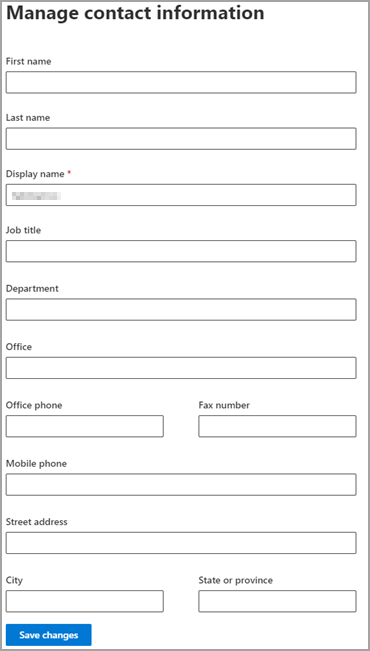

# 게스트 사용자 정보 편집Edit guest user information

관리자 센터 또는 Microsoft 365 포털에서 게스트 정보를 Azure Active Directory 있습니다.You can edit guest information from the Microsoft 365 admin center or the Azure Active Directory portal.

## 관리자 관리자의 Microsoft 365 사용자Guest users in the Microsoft 365 admin

1. 관리 센터에서 게스트 [Microsoft 365](https://admin.microsoft.com)편집하려면 사용자 게스트 사용자   >  **를 선택합니다.**To edit the guest information in the [Microsoft 365 admin center](https://admin.microsoft.com), select **Users** > **Guest Users**.

   

2. 게스트 사용자에서 **사용자를 선택합니다.**Select a user from **Guest users**.

3. 게스트 사용자 정보에서 연락처 **정보 관리를 선택합니다.**In guest user information, select **Manage contact information**.

   

4. 연락처 정보 관리에서 표시  이름을 제외한 선택한 필드를 편집한 다음 **변경** 내용 **저장을 선택합니다.**Edit any fields that you choose except for **Display name** in **Manage contact information**, and then select **Save changes**.

   

또한 포털 에서 게스트 [사용자를 Azure Active Directory 수 있습니다.](https://aad.portal.azure.com/#blade/Microsoft_AAD_IAM/UsersManagementMenuBlade/MsGraphUsers)You can also edit the guest user from the [Azure Active Directory portal](https://aad.portal.azure.com/#blade/Microsoft_AAD_IAM/UsersManagementMenuBlade/MsGraphUsers).
