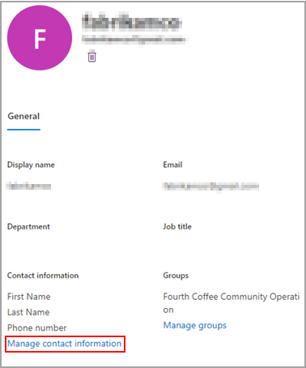

# 게스트 사용자 정보 편집Edit guest user information

Microsoft 365 관리 센터 또는 Azure 디렉터리 포털에서 게스트 정보를 편집할 수 있습니다.You can edit guest information from the Microsoft 365 admin center or the Azure Directory portal.

## Microsoft 365 관리자의 게스트 사용자Guest users in the Microsoft 365 admin

1. [Microsoft 365 관리 센터](https://admin.microsoft.com)에서 게스트 정보를 편집 하려면 **사용자**  >  **게스트 사용자** 를 선택 합니다.To edit the guest information in the [Microsoft 365 admin center](https://admin.microsoft.com), select **Users** > **Guest Users**.

   

2. **게스트 사용자** 가 사용자를 선택 합니다.Select a user from **Guest users**.

3. 게스트 사용자 정보에서 **연락처 정보 관리** 를 선택 합니다.In guest user information, select **Manage contact information**.

   

4. **연락처 정보 관리** 의 **표시 이름을** 제외 하 고 선택한 필드를 편집 하 고 **변경 내용 저장** 을 선택 합니다.Edit any fields that you choose except for **Display name** in **Manage contact information** , and then select **Save changes**.

   

[Azure Active Directory 포털](https://aad.portal.azure.com/#blade/Microsoft_AAD_IAM/UsersManagementMenuBlade/MsGraphUsers)에서 게스트 사용자를 편집할 수도 있습니다.You can also edit the guest user from the [Azure Active Directory portal](https://aad.portal.azure.com/#blade/Microsoft_AAD_IAM/UsersManagementMenuBlade/MsGraphUsers).
