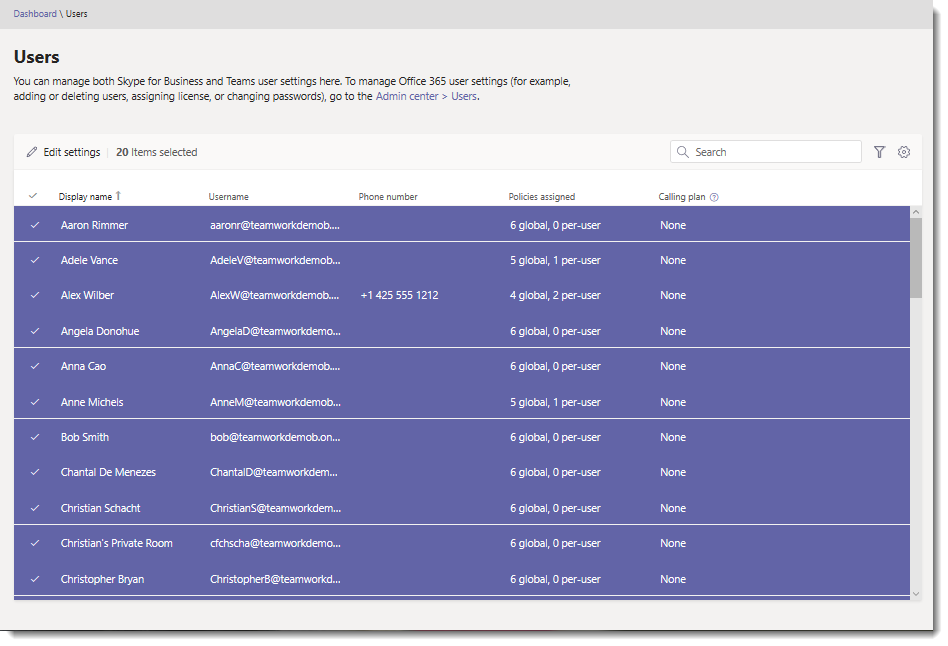

# 대량으로 Microsoft 팀 사용자 설정 편집Edit Microsoft Teams user settings in bulk

관리자는 Microsoft 팀 관리 센터에서 팀 사용자 설정을 관리할 수 있습니다.As an admin, you manage Teams user settings in the Microsoft Teams admin center. **사용자** 페이지에서 계정 및 라이선스 세부 정보, 정책 및 기타 설정 편집 등의 정보를 볼 수 있습니다.On the **Users** page, you can view information such as account and licensing details and edit policy and other settings. 사용자에 대 한 설정을 개별적으로 또는 여러 사용자가 동시에 편집할 수 있습니다.You can edit settings for users individually or for multiple users at the same time.

## 대량으로 사용자 설정 편집Edit user settings in bulk

Microsoft 팀 관리 센터를 사용 하 여 한 번에 여러 사용자의 설정을 편집할 수 있습니다.Use the Microsoft Teams admin center to edit settings for multiple users at a time. 한 번에 20 명의 사용자에 대 한 설정을 편집 하는 것이 좋습니다.We recommend editing settings for 20 users at a time. 많은 수의 사용자에 대 한 설정을 편집 하려면 PowerShell을 사용 합니다.To edit settings for a large number of users, use PowerShell. 자세한 내용은 [팀 PowerShell 개요](teams-powershell-overview.md)를 참조 하세요.For more information, see [Teams PowerShell Overview](teams-powershell-overview.md).

1. Microsoft 팀 관리 센터의 왼쪽 탐색 모음에서 **사용자**를 선택 합니다.In the left navigation of the Microsoft Teams admin center, select **Users**.
2. 편집 하려는 사용자를 검색 하거나 보기를 필터링 하 여 편집할 사용자를 표시 합니다.Search for the users you want to edit or filter the view to show the users you want to edit.
3. **&#x2713;** (확인 표시) 열에서 다음 중 하나를 수행 하 여 사용자를 선택 합니다.In the **&#x2713;** (check mark) column, select users by doing one of the following:
    - 한 번에 하나씩 사용자를 선택 합니다.Select users one at a time. 선택한 각 사용자 옆에 **&#x2713;** 표시 됩니다.A **&#x2713;** is displayed next to each user you select. 20 명 이상의 사용자를 선택 하는 경우에는 차단 되지 않지만 선택 하는 사용자가 많을 수록 작업을 완료 하는 데 시간이 오래 걸릴 수 있다는 점에 유의 하세요.If you select more than 20 users, you won't be blocked but keep in mind that the more users you select, the longer the operation will take to complete.

        

    - 테이블 맨 위에 있는 &#x2713; (확인 표시)을 클릭 하 여 모든 사용자 (최대 20 명의 사용자)를 선택한 다음, **선택 제한** 대화 상자에서 **계속 해 서 모두 선택을** 클릭 하 여 선택 영역을 완성 합니다.Click the &#x2713; (check mark) at the top of the table to select all users (up to a maximum of 20 users), and then in the **Selection limit** dialog box, click **Continue select all** to complete the selection.

           선택한 사용자 옆에 **&#x2713;** 표시 됩니다.A **&#x2713;** is displayed next to the selected users.

        
4. **설정 편집**을 클릭 하 고 원하는 대로 변경한 다음 **저장**을 클릭 합니다.Click **Edit settings**, make the changes that you want, and then click **Save**.

    
