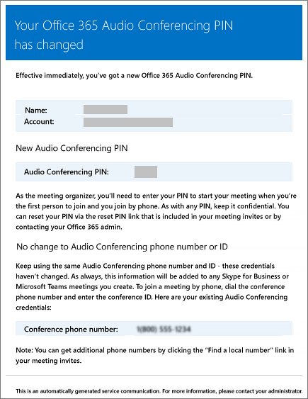

# Microsoft Teams에서 설정이 변경될 때 사용자에게 전송된 전자 메일Emails sent to users when their settings change in Microsoft Teams

Microsoft를 오디오 회의 공급자로  사용하여 오디오 회의를 사용하도록 설정된 사용자에게 전자 메일이 자동으로 전송됩니다.Emails will be automatically sent to users who are [enabled for Audio Conferencing](set-up-audio-conferencing-in-teams.md) using Microsoft as the audio conferencing provider.

기본적으로 오디오 회의를 사용하도록 설정된 사용자에게 전송되는 4가지 유형의 전자 메일이 있습니다.By default, there are four types of email that will be sent to your users who are enabled for Audio Conferencing. 그러나 사용자에게 보낸 전자 메일의 수를 제한하려는 경우 해제할 수 있습니다.However, if you want to limit the number of emails sent to users, you can turn it off. Microsoft 365 또는 Office 365의 오디오 회의는 다음을 할 때 사용자의 전자 메일로 전자 메일을 전송합니다.Audio Conferencing in Microsoft 365 or Office 365 will send email to your users' email when:

- **오디오 회의 라이선스가 사용자에게 할당되거나 오디오 회의 공급자를 Microsoft로 변경할 때 할당됩니다.****An Audio Conferencing license is assigned to them or when you are changing the audio conferencing provider to Microsoft.**

     이 전자 메일에는 회의 ID, 모임의 기본 전화 번호, 사용자의 오디오 회의 PIN 및 사용자에 대한 기존 모임을 업데이트하는 데 사용되는 비즈니스용 Skype 온라인 모임 업데이트 도구를 사용하는 지침 및 링크가 포함됩니다.This email includes the conference ID, the default conference phone number for the meetings, the audio conferencing PIN for the user, and the instructions and link to use the Skype for Business Online Meeting Update Tool that is used to update existing meetings for the user. Microsoft [Teams 추가 기능](./teams-add-on-licensing/microsoft-teams-add-on-licensing.md) 라이선스 할당 또는 오디오 회의 공급자로 Microsoft 할당을 [참조하세요.](/SkypeForBusiness/audio-conferencing-in-office-365/assign-microsoft-as-the-audio-conferencing-provider)See [Assign Microsoft Teams add-on licenses](./teams-add-on-licensing/microsoft-teams-add-on-licensing.md) or [Assign Microsoft as the audio conferencing provider](/SkypeForBusiness/audio-conferencing-in-office-365/assign-microsoft-as-the-audio-conferencing-provider).

    > [!NOTE]
    > 조직에서 동적 회의 ID를 사용하도록 설정한 경우 예약한 모든 사용자의 모임에는 고유한 회의 ID가 있습니다.If your organization has been enabled for dynamic conference IDs, all of a user's meetings that they schedule will have unique conference IDs. 조직에서 오디오 회의 동적 [아이디를 설정할 수 있습니다.](/skypeforbusiness/audio-conferencing-in-office-365/reset-a-conference-id-for-a-user)You can set up [Audio Conferencing dynamic IDs in your organization](/skypeforbusiness/audio-conferencing-in-office-365/reset-a-conference-id-for-a-user). 

    다음은 이 전자 메일의 예입니다.Here is an example of this email:

     

    라이선스에 대한 자세한 내용은 [Microsoft Teams 추가 기능 라이선스 를 참조합니다.](./teams-add-on-licensing/microsoft-teams-add-on-licensing.md)To find out more about licensing, see [Microsoft Teams add-on licensing](./teams-add-on-licensing/microsoft-teams-add-on-licensing.md).

- **사용자의 회의 ID 또는 기본 전화 회의 전화 번호가 변경됩니다.****The conference ID or default conference phone number of a user changes.**

    이 전자 메일에는 사용자에 대한 기존 모임을 업데이트하는 데 사용되는 비즈니스용 Skype 온라인 모임 업데이트 도구를 사용할 수 있는 전화 회의 ID, 기본 전화 번호 및 지침 및 링크가 포함되어 있습니다.This email contains the conference ID, default conference phone number, and the instructions and link to use the Skype for Business Online Meeting Update Tool that is used to update existing meetings for the user. 그러나 이 전자 메일에는 사용자의 오디오 회의 PIN이 포함되어 없습니다.But this email doesn't include the user's audio conferencing PIN. 사용자의 [회의 ID 재설정을 참조합니다.](reset-a-conference-id-for-a-user-in-teams.md)See [Reset a conference ID for a user](reset-a-conference-id-for-a-user-in-teams.md).

    다음은 이 전자 메일의 예입니다.Here is an example of this email:

     

- **사용자의 오디오 회의 PIN이 재설정됩니다.****The audio conferencing PIN of a user is reset.**

    이 전자 메일에는 이끌이의 오디오 회의 PIN, 기존 회의 ID 및 사용자의 기본 전화 번호가 포함되어 있습니다.This email contains the organizer's audio conferencing PIN, the existing conference ID, and default conference phone number for the user. 오디오 회의 PIN 재설정을 [참조합니다.](reset-the-audio-conferencing-pin-in-teams.md)See [Reset the Audio Conferencing PIN](reset-the-audio-conferencing-pin-in-teams.md).
    
     다음은 이 전자 메일의 예입니다.Here is an example of this email:
    
     
  
- **사용자의 라이선스가 제거되거나 오디오 회의 공급자가 Microsoft에서 다른 공급자 또는 없음으로 변경되는 경우.****A user's license is removed or when audio conferencing provider changes from Microsoft to other provider or None.**

    오디오 회의  라이선스가 사용자에서 제거되거나 오디오 회의 공급자를 없음으로 설정할 때 **발생합니다.**This happens when the **Audio Conferencing** license is removed from a user or when setting the audio conferencing provider to **None**.

    비즈니스용 Microsoft 365 라이선스 할당 또는 [제거를 참조합니다.](https://support.office.com/article/997596b5-4173-4627-b915-36abac6786dc)See [Assign or remove licenses for Microsoft 365 for business](https://support.office.com/article/997596b5-4173-4627-b915-36abac6786dc).

    다음은 이 전자 메일의 예입니다.Here is an example of this email:

     

> [!NOTE]
> [!INCLUDE [updating-admin-interfaces](includes/updating-admin-interfaces.md)]

## 전송된 전자 메일 메시지를 변경합니다.Make changes to the email messages that are sent to them

사용자에게 자동으로 전송되는 전자 메일을 변경할 수 있습니다.You can make changes to the email that is automatically sent to users. 기본적으로 전자 메일의 발신자는 Microsoft 365 또는 Office 365에서 제공되지만, 전자 메일에서 표시 이름을 변경할 수 Windows PowerShell.By default, the sender of the emails will be from Microsoft 365 or Office 365, but you can change the display name using Windows PowerShell. 자세한 내용은 [Microsoft Teams PowerShell 참조를](/powershell/module/teams/?view=teams-ps) 참조하세요.See the [Microsoft Teams PowerShell reference](/powershell/module/teams/?view=teams-ps) for more information.

## 전자 메일을 보내지 못하게 하려는 경우 어떻게 하나요?What if you don't want email to be sent to them?

사용자에게 전자 메일 보내기 기능을 사용하지 않도록 설정하면 사용자가 라이선스를 할당한 경우에도 전자 메일이 전송되지 않습니다.When you disable sending emails to users, email won't be sent even when a user gets assigned a license. 이 경우 회의 ID, 기본 회의 전화 번호 및 더 중요한 것은 해당 오디오 회의 PIN이 사용자에게 전송되지 않습니다.In this case, the conference ID, default conferencing phone number, and, more importantly, their audio conferencing PIN won't be sent to the user. 이 경우 사용자에게 별도의 전자 메일을 보내거나 호출하여 사용자에게 알려야 합니다.When this happens, you must tell the user by sending them a separate email or by calling them.

기본적으로 전자 메일은 사용자에게 전송되지만 오디오 회의를 위해 전자 메일을 받지 못하게 하려는 경우 Microsoft Teams 또는 Windows PowerShell.By default, emails will be sent to your users, but if you want to prevent them from receiving email for audio conferencing, you can use Microsoft Teams or Windows PowerShell. 

 **Microsoft Teams 관리 센터 사용** **Using the Microsoft Teams admin center**

1. 왼쪽 탐색에서 모임 회의  >  **브리지로 이동합니다.**In the left navigation, go to **Meetings** > **Conference Bridges**. 

2. 컨퍼런스 브리지  페이지의 맨 위에 있는 브리지 설정을 **클릭합니다.**At the top of the **Conference Bridges** page, click **Bridge settings**. 

3. 브리지 **설정 창에서** 전화 접속 설정이 변경될 경우 사용자에게 자동으로 전자 메일 보내기를 사용하도록 설정하거나 **사용하지 않도록 설정합니다.**In the **Bridge settings** pane, enable or disable **Automatically send emails to users if their dial-in settings change**.

4. **저장** 을 클릭합니다.Click **Save**.

> [!Note]
> [!INCLUDE [updating-admin-interfaces](includes/updating-admin-interfaces.md)]

**Using Windows PowerShell****Using Windows PowerShell**

자세한 내용은 [Microsoft Teams PowerShell 참조를](/powershell/module/teams/?view=teams-ps) 참조하세요.See the [Microsoft Teams PowerShell reference](/powershell/module/teams/?view=teams-ps) for more information.

## 자세한 정보를 Windows PowerShell?Want to know more about Windows PowerShell?

기본적으로 전자 메일의 발신자는 Microsoft 365 또는 Office 365에서 제공되지만 전자 메일 주소 및 표시 이름을 변경할 수 Windows PowerShell.By default, the sender of the emails will be from Microsoft 365 or Office 365, but you can change the email address and display name using Windows PowerShell. 

Windows PowerShell 모든 것은 사용자 관리와 사용자가 허용되거나 허용되지 않는 작업을 관리하는 것입니다.Windows PowerShell is all about managing users and what users are allowed or not allowed to do. 이 Windows PowerShell 여러 작업을 수행할 때 일상적인 작업을 단순화할 수 있는 단일 관리 지점을 사용하여 Microsoft 365 또는 Office 365를 관리할 수 있습니다.With Windows PowerShell, you can manage Microsoft 365 or Office 365 using a single point of administration that can simplify your daily work when you have multiple tasks to do. 다음 항목을 Windows PowerShell 항목을 참조하세요.To get started with Windows PowerShell, see these topics:

  - [Office 365 PowerShell을 사용해야 하는 이유Why you need to use Office 365 PowerShell](/microsoft-365/enterprise/why-you-need-to-use-microsoft-365-powershell)

  - [Office 365를 관리하는 가장 좋은 Windows PowerShell](/previous-versions//dn568025(v=technet.10))[Best ways to manage Office 365 with Windows PowerShell](/previous-versions//dn568025(v=technet.10))

자세한 내용은 Windows PowerShell [Microsoft Teams PowerShell 참조를](/powershell/module/teams/?view=teams-ps) 참조하세요.For more information about Windows PowerShell, see the [Microsoft Teams PowerShell reference](/powershell/module/teams/?view=teams-ps) for more information.

## 관련 항목Related topics

[오디오 회의 설정이 변경되면 전자 메일 보내기 사용 또는 사용 안 함Enable or disable sending emails when Audio Conferencing settings change](enable-or-disable-sending-emails-when-their-settings-change-in-teams.md)

[오디오 회의 정보를 사용하여 사용자에게 전자 메일 보내기Send an email to a user with their Audio Conferencing information](send-an-email-to-a-user-with-their-dial-in-information-in-teams.md)