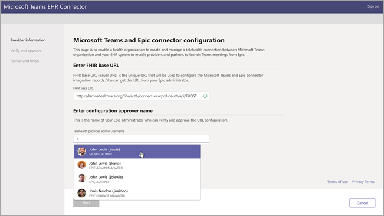
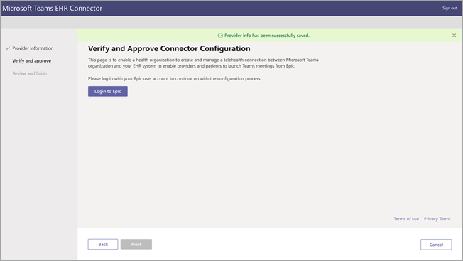

# 팀에 대 한 가상 방문-EHR에 통합Virtual visits with Teams - Integration into EHR

Microsoft 팀 EHR (전자적 상태 레코드) 커넥터를 사용 하면 clinicians에서 가상 환자를 쉽게 시작 하거나 EHR 시스템에서 직접 팀의 다른 공급자와 상담을 할 수 있습니다.Microsoft Teams Electronic Health Record (EHR) Connector makes it easy for clinicians to launch a virtual patient visit or consultation with another provider in Teams directly from the EHR system. Microsoft 팀에서 제공 하는 microsoft 365 클라우드를 사용 하면 HIPAA, HITECH 인증 등을 준수 하는 단일 허브의 채팅, 비디오, 음성 및 건강 도구를 통해 간단 하 고 안전한 공동 작업 및 통신을 할 수 있습니다.Built on the Microsoft 365 cloud, Microsoft Teams enables simple, secure collaboration and communication with chat, video, voice, and healthcare tools in a single hub that supports compliance with HIPAA, HITECH certification, and more.

팀의 의사 소통 및 공동 작업 플랫폼을 통해 clinicians는 조각화 된 시스템을 최대한 활용 하 여 최상의 관리를 제공 하는 데 시간을 투자할 수 있습니다.The communication and collaboration platform of Teams makes it easy for clinicians to cut through the clutter of fragmented systems so they can spend time providing the best possible care. Microsoft 팀 EHR (전자식 건강 성 레코드) 커넥터는 다음을 수행할 수 있습니다.Microsoft Teams Electronic Health Record (EHR) Connector can:

- 공급자 및 환자 포털에서 팀 가상 방문을 시작 합니다.Launch Teams virtual visits from both provider and patient portals.

- 연결 및 연결 끊기 이벤트의 EHR 메타 데이터에 다시 기록 하 여 자동 감사 및 기록 유지 기능을 사용 하도록 설정 합니다.Write back into EHR metadata on connect and disconnect events to enable automatic auditing and record keeping.

- Microsoft 팀을 사용 하도록 허용 하는 동안 기존 clinician 및 환자 워크플로를 통합 합니다.Integrate into existing clinician and patient workflows while allowing them to use Microsoft Teams.

## 시작 하기 전에Before you begin

EHR 커넥터를 통합 하려면 먼저 다음과 같은 전제 조건이 있는지 확인 해야 합니다.You’ll need to make sure you have the following prerequisites before you can integrate the EHR connector:

- Microsoft 클라우드의 의료 또는 구독에 대 한 활성 구독 (커넥터 독립 실행형 제공 EHR)Active subscription to Microsoft Cloud for Healthcare or subscription to Microsoft Teams EHR Connector standalone offer.

- 사용자에 게 Microsoft 팀 모임이 포함 된 적절 한 Microsoft 365 또는 Office 365 라이선스가 있어야 합니다.Users must have an appropriate Microsoft 365 or Office 365 license that includes Microsoft Teams meetings.

- 조직 내에서 Microsoft 팀을 채택 하 여 사용 해야 합니다.Microsoft Teams should be adopted and used inside the organization.

- 조직에는 대규모 버전의 2018 이상 버전이 있어야 합니다.Organizations must have with Epic version November 2018 or later.

- 시스템은 모든 [소프트웨어 및 브라우저 필수 조건을](https://docs.microsoft.com/microsoftteams/hardware-requirements-for-the-teams-app)충족 해야 합니다.Your systems must meet all [software and browser prerequisites](https://docs.microsoft.com/microsoftteams/hardware-requirements-for-the-teams-app).

또한 조직 내 다음 사용자의 정보도 필요 합니다.You’ll also need information from the following people in your organization:

- Microsoft 365 관리자Microsoft 365 administrator

- 대규모 관리자Epic administrator

> [!Note]
> 대규모 사용자 스토리 관리자에 게 대규모 Telehealth 통합 안내서를 Epic-Microsoft 제공 하도록 요청 합니다.Request your Epic admin to provide the Epic-Microsoft Teams Telehealth Integration Guide available in the Epic marketplace.

## 커넥터 설정Connector setup

커넥터 설정에는 다음을 수행 해야 합니다.The connector setup requires that you:

- [EHR 커넥터 구성 포털 시작Launch the EHR Connector configuration portal](ehr-admin.md#launch-the-ehr-connector-configuration-portal)
- [공급자 조직 정보 구성Configure provider organization information](ehr-admin.md#configure-provider-organization-information)
- [구성 확인 및 승인Verify and approve the configuration](ehr-admin.md#verify-and-approve-the-configuration)
- [구성 검토 및 완료Review and finish the configuration](ehr-admin.md#review-and-finish-the-configuration)

### [EHR 커넥터 구성 포털 시작Launch the EHR Connector configuration portal](#launch-the-ehr-connector-configuration-portal)

Microsoft 팀으로 가상 방문을 시작 하도록 건강 관리 조직을 구성 하려면 먼저 EHR 커넥터 구성 포털을 실행 합니다.Configuring your healthcare organization to launch virtual visits with Microsoft Teams starts by launching the EHR Connector configuration portal. 테스트 URL을 사용 하 여 대규모 사용자 스토리 테스트 환경에 대 한 커넥터를 구성 합니다.Use the test URL to configure the connector for your Epic test environment. 대규모 프로덕션 환경을 사용할 준비가 되 면 프로덕션 URL을 사용 합니다.Use the production URL when you're ready to enable your Epic production environment.
  
- 테스트 환경 [https://ehrconnector-ppe.teams.microsoft.com](https://ehrconnector-ppe.teams.microsoft.com)Test environment [https://ehrconnector-ppe.teams.microsoft.com](https://ehrconnector-ppe.teams.microsoft.com)
- 프로덕션 환경 [https://ehrconnector.teams.microsoft.com](https://ehrconnector.teams.microsoft.com)Production environment [https://ehrconnector.teams.microsoft.com](https://ehrconnector.teams.microsoft.com)

조직의 Microsoft 365 관리자 및 대규모 사용자 스토리 관리자가 구성 포털의 정보 및 통합 단계를 완료 해야 합니다.The Microsoft 365 admin and Epic admin from your organization must complete the information and integration steps in the configuration portal. 대규모 사용자 스토리 구성 단계는 조직에 할당 된 대규모 사용자 스토리 리소스에 문의 하세요.For Epic configuration steps, contact the Epic resource assigned to your organization.

### [공급자 조직 정보 구성Configure provider organization information](#configure-provider-organization-information)

이 단계는 Microsoft 365 관리자가 완료 해야 합니다.This step is to be completed by the Microsoft 365 administrator. Microsoft 365 관리자는 커넥터 구성 포털을 실행 하 고 Microsoft 자격 증명으로 로그인 하 여 구성 프로세스를 시작 해야 합니다.The Microsoft 365 administrator must launch the connector configuration portal and sign in with Microsoft credentials to start the configuration process.

이 단계를 완료 하려면 Microsoft 365 관리자가 Microsoft 365 관리자의 유효한 빠른 상태 상호 운용성 리소스 (FA r) 기본 URL과 구성을 승인 하는 대규모 사용자의 이름을 받아야 합니다.To complete this step, the Microsoft 365 administrator must receive a valid Fast Health Interoperability Resources (FHIR) base URL from your Microsoft 365 administrator and the username of the Epic administrator who will be approving the configuration. Microsoft 365 관리자는 커넥터 구성 페이지를 실행 하 고 Microsoft 자격 증명을 사용 하 여 로그인 해야 구성 프로세스를 시작할 수 있습니다.The Microsoft 365 administrator must launch the connector configuration page and sign in with Microsoft credentials to start the configuration process.

- FTO r 기본 URL은 서버 FA r API 끝점에 해당 하는 정적 주소입니다.The FHIR base URL is a static address corresponding to your server FHIR API endpoint. URL 예제는 [https://lamnahealthcare.org/fihr/auth/connect-ocurprd-oauth/api/FHDST](https://lamnahealthcare.org/fihr/auth/connect-ocurprd-oauth/api/FHDST) 입니다.An example URL is [https://lamnahealthcare.org/fihr/auth/connect-ocurprd-oauth/api/FHDST](https://lamnahealthcare.org/fihr/auth/connect-ocurprd-oauth/api/FHDST).

- 구성 승인자 이름은 구성 승인을 담당 하는 대규모 사용자 시스템 관리자의 이름입니다.Configuration approver name is the name of the Epic system administrator who will be responsible for approving the configuration.

  

### [구성 확인 및 승인Verify and approve the configuration](#verify-and-approve-the-configuration)

승인자로 추가 된 건강 관리 조직의 대규모 사용자는 이제 이전 단계의 동일한 EHR 커넥터 URL을 사용 하 여 Microsoft 365 자격 증명을 사용 하 여 로그인 해야 합니다.The Epic administrator for your healthcare organization who was added as an approver must now use the same EHR Connector URL from the previous step to sign in using their Microsoft 365 credentials. 유효성 검사가 성공적으로 완료 되 면 승인자는 대규모 사용자 스토리 자격 증명을 사용 하 여 로그인 하 여 대규모 조직 구성의 유효성을 검사 하도록 요청 합니다.After successful validation, the approver is going to be asked to sign in using their Epic credentials to validate the Epic organization.

> [!Note]
> 조직의 Microsoft 365 관리자 및 대규모 사용자 스토리 관리자가 같은 사람이 될 수 있습니다.The Microsoft 365 admin and Epic admin in your organizations can be the same person. 이 경우 첫 번째 단계에서 고유한 사용자 이름을 승인자로 추가 합니다.In that case, add your own username as approver in the first step. 액세스를 확인 하려면 대규모 사용자에 게 로그인 해야 합니다.You'll still need to sign in to Epic to validate your access. 대규모 사용자 스토리 로그인은 FA r 기본 URL의 유효성을 검사 하는 데만 사용 됩니다.The Epic sign in is only used to validate your FHIR base URL. Microsoft는 자격 증명을 저장 하거나이 로그인으로 EHR 데이터에 액세스할 수 없습니다.Microsoft will not store credentials or access EHR data with this sign in.

  

모든 대규모 작업이 끝난 후에는 대규모 관리자가 구성을 승인 **해야** 합니다.After a successful Epic sign in, the Epic administrator **must** approve the configuration. 구성이 올바르지 않으면 Microsoft 365 관리자가 Microsoft EHR 커넥터 포털에 다시 로그인 하 여 원래 구성을 수정할 수 있습니다.If the configuration isn't correct, the Microsoft 365 admin will have the ability to modify the original configurations by signing in to the Microsoft EHR Connector portal again.

### [구성 검토 및 완료Review and finish the configuration](#review-and-finish-the-configuration)

대규모 사용자 스토리 관리자가 구성 정보를 승인 하면 환자 및 공급자 시작에 대 한 통합 레코드가 표시 됩니다.When the configuration information is approved by the Epic administrator, you'll be presented with integration records for patient and provider launch. 이러한 레코드는 대규모의 가상 방문 구성을 완료 하는 데 필요 합니다.These records are necessary to complete the virtual visit configuration in Epic. 자세한 내용은 Epic-Microsoft 팀 Telehealth 통합 가이드를 참조 하세요.Refer to the Epic-Microsoft Teams Telehealth Integration guide for more details.

> [!Note]  
> Microsoft 365 또는 대규모 위치 관리자는 언제 든 지 구성 포털에 로그인 하 여 통합 레코드를 확인 하 고 필요한 경우 조직 구성을 수정할 수 있습니다.At any time the Microsoft 365 or Epic administrator can sign in to the configuration portal to view integration records and modify organization configuration, if needed.

## 팀 가상 방문 시작Launch Teams virtual visits

EHR 커넥터 단계 및 대규모 사용자 스토리 구성을 완료 한 후에는 조직이 Microsoft 팀의 영상 방문을 지원할 준비가 되었습니다.After completing the EHR Connector steps and Epic configuration, your organization is ready to support video visits with Microsoft Teams.

### 가상 방문 필수 조건Virtual visit prerequisites

- 시스템은 모든 [소프트웨어 및 브라우저 필수 조건을](https://docs.microsoft.com/microsoftteams/hardware-requirements-for-the-teams-app)충족 해야 합니다.Your systems must meet all [software and browser prerequisites](https://docs.microsoft.com/microsoftteams/hardware-requirements-for-the-teams-app).

- 건강 관리 조직과 Microsoft 365 조직 간의 설정을 완료 해야 합니다.Healthcare organization must have completed the setup between the Epic organization and Microsoft 365 organization.

### 공급자 환경Provider experience

조직의 의료 제공자는 또한 사용자의 협력 업체 공급자 응용 프로그램 (하이퍼스페이스, Haiku, Canto)에서 Microsoft 팀으로 가상 방문을 참가할 수 있습니다.Healthcare providers from your organization can also join virtual visits with Microsoft Teams from their Epic provider applications (Hyperspace, Haiku, Canto). **시작 가상 방문** 단추는 공급자 흐름에 포함 되어 있습니다.The **Begin virtual visit** button is embedded in the provider flow.

공급자 환경의 주요 기능:Key features of the provider experience:

- 공급자는 지원 되는 브라우저 또는 Microsoft 팀 응용 프로그램을 사용 하 여 가상 방문자에 게 참가할 수 있습니다.Providers can join virtual visits using supported browsers or the Microsoft Teams application.

- 공급자는 처음으로 가상 방문에 참가할 때 Microsoft 365 계정으로 로그인 한 번만 사용 해야 합니다.Providers must do a one time sign in with their Microsoft 365 account when joining a virtual visit for the first time.

- 한 번 로그인 한 후에는 Microsoft 팀의 가상 약속에 대 한 공급자가 바로 가져올 수 있습니다.After the one time sign in, the provider will be taken straight to the virtual appointment in Microsoft Teams. (공급자는 Microsoft 팀에 로그인 해야 합니다.)(Provider must be signed-in to Microsoft Teams).

- 공급자는 주어진 약속에 대 한 참가자의 실시간 업데이트를 확인 하 고 연결을 끊을 수 있습니다.Provider can see real-time updates of participants connect and disconnect for a given appointment. 공급자는 환자를 가상 방문에 연결 했을 때 볼 수 있습니다.The provider can see when the patient is connected to a virtual visit.

  

### 환자 경험Patient experience

커넥터는 MyChart web 및 mobile을 통해 가상 방문 환자를 지원 합니다.The connector supports patients joining virtual visits through MyChart web and mobile. 약속 시간에 환자는 **가상 방문 시작** 단추를 사용 하 여 MyChart에서 가상 방문을 시작할 수 있습니다.At the time of the appointment, patients can start a virtual visit from MyChart using the **Begin virtual visit** button.

환자 경험의 주요 특징은 다음과 같습니다.Key features of the patient experience:

- 환자는 데스크톱의 최신 웹 브라우저와 앱을 설치 하지 않고 모바일에서 방문 하는 가상 탐색을 참가할 수 있습니다.Patients can join virtual visits from modern web browsers on desktop and mobile without app installation.

- 환자는 한 번의 클릭으로 가상 방문을 참가할 수 있으며 추가 계정이 나 필요에 대 한 로그인이 없습니다.Patients can join virtual visits with a single click and there is no additional account or sign in required.

- 환자는 Microsoft 계정을 만들거나 로그인 하 여 가상 방문을 시작 하는 데 필요 하지 않습니다.Patients aren't required to create a Microsoft account or sign in to launch a virtual visit.

- 환자는 건강 보험 업체가 약속을 참가 하 고 가상 방문을 입장할 때까지 대기실에 배치 됩니다.Patients will be placed in a lobby until the healthcare provider joins the appointment and admits them to the virtual visit.

- 가상 방문에 참가 하기 전에 대기실에서 비디오 및 마이크 테스트를 사용할 수 있습니다.Testing of the video and microphone is available in the lobby before joining the virtual visit.

  

> [!Note]
> 대규모 업체, MyChart, Haiku, 그리고 Canto는 회사 시스템의 상표입니다.Epic, MyChart, Haiku, and Canto are trademarks of Epic Systems Corporation.

### 데이터의 개인 정보 및 위치Privacy and location of data

EHR 시스템으로 통합 되는 팀은 통합 및 가상 방문 흐름 중 사용 되 고 저장 되는 데이터의 양을 최적화 합니다.Teams integration into EHR systems optimizes the amount of data being used and stored during integration and virtual visit flows. 이 솔루션은 팀 개인 정보 취급 방침에 설명 된 전반적인 팀의 개인 정보 및 데이터 관리 원칙 및 지침을 따릅니다.The solution follows the overall Teams privacy and data management principles and guidelines outlined in Teams Privacy.

Microsoft 팀 EHR 커넥터는 식별이 가능한 개인 데이터 또는 환자 또는 건강 보험 제공자의 모든 상태 레코드를 EHR 시스템에서 저장 하거나 양도 하지 않습니다.The Microsoft Teams EHR connector doesn't store nor transfer any identifiable personal data or any health records of patients or healthcare providers from the EHR system. EHR 커넥터로 저장 되는 유일한 데이터는 팀 회의 설정 중에 사용 되는 EHR 사용자의 고유 ID입니다.The only data that is stored by the EHR connector is the EHR user’s unique ID, which is used during Teams meeting setup. EHR 사용자의 고유 ID는 [Microsoft 365 고객 데이터가 저장](https://docs.microsoft.com/microsoft-365/enterprise/o365-data-locations?view=o365-worldwide#data-center-geographies) 된 문서에 설명 되어 있는 세 지역 중 하나에 저장 됩니다.The EHR user’s unique ID is stored in one of the three geographic regions described in the [Where your Microsoft 365 customer data is stored](https://docs.microsoft.com/microsoft-365/enterprise/o365-data-locations?view=o365-worldwide#data-center-geographies) article. 모임 참가자가 팀에 입력 한 모든 채팅, 기록 및 기타 데이터는 기존 저장소 정책에 따라 저장 됩니다.All chat, recordings, and other data entered into Teams by the meeting participants are stored according to existing storage policies. Microsoft 팀에서 데이터의 위치에 대 한 자세한 내용을 보려면 [팀의 데이터 위치](https://docs.microsoft.com/microsoftteams/location-of-data-in-teams)를 참조 하세요.If you want to learn more information on the location of data in Microsoft Teams, visit [Locations of data in Teams](https://docs.microsoft.com/microsoftteams/location-of-data-in-teams).
