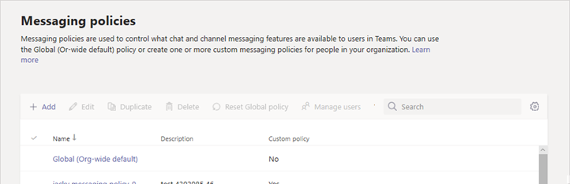

# 의료 조직을 위한 메시지 보안

메시징 정책은 Microsoft Teams의 사용자가 사용할 수 있는 채팅 및 채널 메시징 기능을 제어하는 데 사용되며 메시지를 선택하고 조치를 취하는 병원, 클리닉 또는 의사 사무실과 같은 의료 기관을 위한 전반적인 보안 메시징 배포의 일부입니다. 중요한 메시지를 언제 읽었는지 아는 것과 마찬가지로 시의 적절한 방법이 중요합니다.

조직의 사용자에게 글로벌(조직 전체 기본값) 정책을 사용하거나 하나 이상의 사용자 지정 메시징 정책을 만들 수 있습니다. 사용자 지정 정책을 만들고 할당하지 않으면 조직의 사용자에게 전역 정책이 자동으로 적용됩니다. 사용자 지정 정책을 만든 후 조직의 사용자 또는 사용자 그룹에 할당합니다. 예를 들어 특정 작업 역할만 이러한 기능을 사용하도록 허용하고(예를 들어 의사 및 간호사만 해당) 다른 작업자(예: 관리직 또는 주방 직원)는 제한된 기능을 사용하도록 선택할 수 있습니다. 필요로 사항이 무엇인지 스스로 결정하십시오. 이 지침은 제안 사항에 불과합니다.

[Microsoft Teams 관리 센터](https://admin.teams.microsoft.com)에서 관리자 자격 증명으로 로그인한 후 왼쪽 탐색 창에서 **메시징 정책** 을 선택하여 정책을 쉽게 관리할 수 있습니다.

 

조직의 기존 기본 메시징 정책을 편집하려면 **글로벌(조직 전체 기본값)** 을 클릭한 다음 변경하세요. 새로운 사용자 지정 메시징 정책을 생성하려면 **추가** 를 누른 다음 설정을 선택하세요. 완료되면 **저장** 을 선택합니다.

다음 설정은 의료 응용 프로그램에 특히 중요하며, 의료 분야에서 사용되는 맞춤형 정책을 설계할 때 고려해야 합니다.

## 읽음 확인

읽음 확인 기능을 사용하면 채팅 메시지를 보낸 사람이 수신자가 메시지를 읽은 시간을 1:1로 알 수 있으며 그룹 채팅은 20명 이하입니다. 이 설정을 사용하여 읽음 확인을 사용자가 제어할지, 모든 사용자에 대해 설정 또는 해제할지 여부를 지정합니다. 메시지 읽음 확인은 메시지를 읽었는지 여부에 대한 불확실성을 제거하기 때문에 의료 기관에서 중요합니다.

의료 응용 프로그램의 경우 **사용자 제어** 또는 **모든 사용자에게 사용** 을 선택합니다. **모든 사용자에 대해 사용** 설정을 사용할 때 전체 테넌트에 대한 읽음 확인을 설정하는 유일한 방법은 전체 테넌트에 대해 하나의 메시징 정책("글로벌(조직 전체 기본값)”이라는 기본 정책)만 사용하거나 테넌트의 모든 메시징 정책이 수신에 대해 동일한 설정을 사용하도록 하는 것입니다. 읽음 확인 기능은 **모든 사용자에 대해 사용** 으로 설정된 경우 가장 효과적입니다.

*읽음 확인 기능을 사용하지 않는 경우의 사용 예:* 고위험 환자인 Jakob Roth가 병원에 ​​입원했습니다.  Sofia Krause는 여러 전문의를 포함한 의료진의 학제 간 팀(IDT)의 일원으로 일하는 간호사이며 이 환자를 담당하는 1차 의료 서비스 코디네이터로 지정됩니다.  Sofia는 다양한 메시징 클라이언트와 앱을 사용하는 간호사 및 의사 그룹에게 전자 메일 및 기타 인스턴트 메시지를 보내지만 팀원이 메시지를 읽었는지 여부에 대한 응답이나 표시를 받지 못하는 경우가 많습니다. 복잡한 의사소통 과정으로 인해 Jakob의 약물이 잘못 적용되고 입원 기간이 연장됩니다.

*읽음 확인 기능을 사용하는 경우의 사용 예:* 고위험 환자인 Jakob Roth가 병원에 ​​입원했습니다.  Sofia Krause는 여러 전문의를 포함한 의료진의 학제 간 팀(IDT)의 일원으로 일하는 간호사이며 이 환자를 담당하는 1차 의료 서비스 코디네이터로 지정됩니다.  Sofia는 환자와 함께 치료를 조정하고 응급 분류를 시작할 의사 및 다른 간호사와 그룹 채팅을 시작합니다.  간호사와 의사는 치료 조정 과정 전반에 걸쳐 환자의 치료 계획에 대해 의사소통하고 협력합니다.  중요하고 긴급한 메시지는 1:1 및 그룹 채팅 대화를 통해 전송됩니다. Sofia는 읽음 확인 기능을 사용하여 지원을 요청하는 메시지가 전송되고 대상 의사 또는 간호사가 해당 메시지를 읽었는지 확인합니다. Jakob의 환자 결과는 거의 최적에 가깝고 건강 팀이 원활하게 의사 소통을 하기 때문에 해당 환자가 더 빨리 퇴원할 수 있습니다.

## 우선 순위 알림을 사용하여 긴급 메시지 보내기

사용자는 다른 사용자에게 채팅 메시지를 보낼 때 메시지를 *긴급* 으로 표시할 수 있습니다. 이 기능은 중요한 사건에 주의가 필요할 경우, 병원 직원이 서로에게 경알림을 전달하는 데 도움이 됩니다. 일반적인 *중요* 메시지와 달리 [우선 순위 알림](https://support.microsoft.com/article/mark-a-message-as-important-or-urgent-in-teams-ea99d5b6-1317-4550-8d75-86ff14cd4462)은 최대 20분 동안 또는 수신자가 메시지를 선택하여 읽을 때까지 2분 마다 사용자에게 메시지에 대해 알려 메시지가 적시에 실행될 가능성을 최대화합니다.

관리자는 이 정책이 할당된 사용자가 우선 순위 알림을 보낼 수 있는 기능을 사용하거나 사용 해제할 수 있습니다. 이 기능은 기본적으로 켜져 있습니다. 우선 순위 메시지의 수신자에게는 동일한 메시징 정책이 없을 수 있고 따라서 우선 순위 메시지 수신을 비활성화하는 옵션이 없습니다. 의료 응용 프로그램의 경우 최소한 일부 사용자에 대해 이 기능을 활성화하는 것이 좋지만 어떤 사용자를 선택할지는 스스로 결정해야 합니다.

*사용 예:* Sofia Krause는 고위험 환자인 Jakob Roth를 다시 입 원시킵니다. 의사인 Manuela Carstens는 이 환자의 주치의입니다.  Sofia는 Jakob 분류에 대한 즉각적인 도움을 요청하는 우선 순위 알림을 사용하여 Manuela에게 메시지를 보냅니다.  Manuela의 전화에 메시지가 수신되었지만 Manuela는 전화 진동을 느끼지 못해 응답하지 않습니다. Teams는 Manuela에게 다시 알리고 메시지를 읽을 때까지 지속적으로 다시 알림을 보냅니다. 읽음 확인 기능도 활성화된 경우 Sofia는 Manuela가 응답 방법을 결정하기 전이라도 Manuela가 메시지를 읽었다는 것을 알 수 있습니다.

## 관련 항목

- [Teams에서 메시지 정책 관리](../../messaging-policies-in-teams.md)
- [의료 조직을 위한 Teams 시작](teams-in-hc.md)
