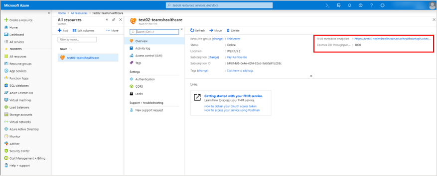

# 환자 앱을 FHIR용 Azure API에 연결

> [!NOTE]
> 2020년 10월 30일부로 환자 앱은 사용 중지되고 Teams의 [목록](https://support.microsoft.com/office/get-started-with-lists-in-teams-c971e46b-b36c-491b-9c35-efeddd0297db) 앱으로 대체됩니다. 환자 앱 데이터는 팀을 백업하는 Office 365 그룹의 그룹 사서함에 저장됩니다. 환자 앱과 연결된 모든 데이터는 이 그룹에 유지되지만 사용자 인터페이스를 통해 더 이상 액세스할 수 없습니다. 사용자는 목록 앱을 사용하여 목록을 다시 [만들 수 있습니다.](https://support.microsoft.com/office/get-started-with-lists-in-teams-c971e46b-b36c-491b-9c35-efeddd0297db)
>
>목록을 사용하여 의료 조직의 관리 팀은 라운드 및학 간 팀 모임에서 일반 환자 모니터링에 이르는 시나리오에 대한 환자 목록을 만들 수 있습니다. 시작을 위해 목록에서 환자 서식 파일을 확인해 하세요. 조직에서 목록 앱을 관리하는 방법에 대한 자세한 내용은 목록 앱 [관리를 참조하세요.](../../manage-lists-app.md)

다음 단계에 따라 Microsoft Teams의 Patients 앱이 FHIR 인스턴스용 Azure API에 액세스할 수 있도록 합니다. 이 문서에서는 [FHIR](https://azure.microsoft.com/services/azure-api-for-fhir/) 인스턴스용 Azure API가 테넌트에 설정 및 구성되어 있는 것으로 가정합니다.  테넌트에서 FHIR용 Azure API 인스턴스를 아직 만들지 않은 경우 빠른 [시작: Azure Portal을 사용하여 FHIR용 Azure API](https://docs.microsoft.com/azure/healthcare-apis/fhir-paas-portal-quickstart)배포를 참조하세요.

1. 환자 [앱에](https://login.microsoftonline.com/common/adminConsent?client_id=4aee3506-b263-43e0-ba31-1468fa7b2806) 대한 관리자 동의를 부여하려면 여기를 클릭하세요. 메시지가 표시될 때 테넌트 관리자 또는 전역 관리자 자격 증명을 사용하여 로그인한 다음 **수락을** 클릭하여 필요한 사용 권한을 부여합니다.

    

    수락한 후 창을 닫습니다. 다음과 같은 페이지가 표시됩니다. 페이지에서 오류 메시지를 무시할 수 있습니다. 이는 무해하며 동의가 부여된 것 을 나타냅니다. (이 URL에 대해 보다 친숙한 페이지에서 작업 중입니다. 계속 지켜봐 주세요!)

    

2. 관리자 자격 [증명을 사용하여 Azure Portal에](https://portal.azure.com) 로그인합니다.

3. 왼쪽 탐색에서 **Azure Active Directory를 선택한** 다음 엔터프라이즈 **애플리케이션을 선택합니다.**

    **Patients(개발)라는** 행을 찾아 개체 **ID** 열의 값을 클립보드에 복사합니다.

    

4. 환자 앱을 연결하려는 FHIR용 Azure API 리소스 인스턴스로 이동한 다음(해당 앱을 검색하거나 리소스를 검색하여) 해당 인스턴스에 대한 설정을 여습니다.

    

5. **인증을** 클릭한 다음 3단계에서 복사한 개체 ID를 허용된 개체 ID 상자에 **붙여넣습니다.** 이렇게 하면 환자 앱이 FHIR 서버에 액세스할 수 있습니다. 개체 ID를 붙여넣은 후 Azure Active Directory에서 유효성을 검사하고 옆에 녹색 확인 표시가 나타납니다.

    

6. **저장** 을 클릭합니다. 몇 분 정도 걸릴 수 있는 인스턴스를 다시 재배포합니다.

7. **개요를** 클릭한 다음 FHIR 메타데이터 엔드포인트에서 **URL을 복사합니다.** 메타데이터 태그를 제거하여 FHIR 서버 URL을 얻습니다. 예: `https://test02-teamshealth.azurehealthcareapis.com/`

    

8. Teams에서 팀에 로드된 Patients 앱 인스턴스로 이동하여 설정을 클릭한 다음 링크 **상자에** FHIR 서버 엔드포인트 URL을 입력합니다. 그런 다음 **연결을 설정하고** 검색하고 환자를 목록에 추가하려면 연결을 클릭합니다.  

    

    이 단계에서 Teams에 연결할 때 오류가 발생하면 "Patients App – EMR mode troubleshooting"의 제목 줄이 있는 전자 메일의 오류, [Fiddler의](https://www.telerik.com/download/fiddler) 로그 및 기타 재현 단계에 대한 자세한 [스크린샷을](mailto:teamsforhealthcare@service.microsoft.com)teamsforhealthcare@service.microsoft.com.

## 관련 항목

- [환자 앱 개요](patients-app-overview.md)
- [Microsoft Teams에 전자 의료 레코드 통합](patients-app.md)
