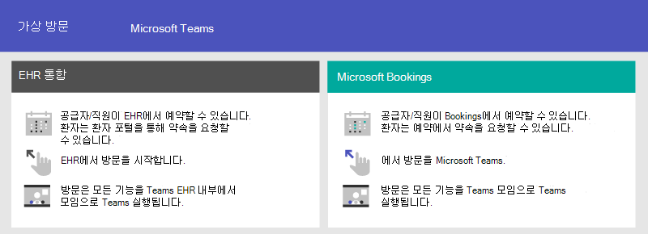

# 의료 조직을 위한 Teams 시작

Microsoft Teams는 병원 및 기타 의료 조직에 유용한 다양한 원격 의료 기능을 제공합니다. 병원을 지원하기 위해 다음과 같은 기능이 포함된 Teams 기능을 개발 중입니다.

- 가상 약속 및 EHR(전자 의료 기록) 통합
- Teams 정책 패키지
- 보안 메시징
- Teams 서식 파일
- 케어 코디네이션 및 공동 작업

이 기능은 Microsoft Cloud for Healthcare 일부입니다. [의료용 Microsoft 클라우드](/industry/healthcare)에서 Azure, Dynamics 365 및 Microsoft 365의 기능을 결합한 이 솔루션 사용에 대해 자세히 알아보세요.

Teams 의료 팀 협업을 향상시키기 위해 의료 컬렉션을 사용하는 방법에 대해 자세히 알아보려면 다음 비디오를 시청하세요.

> [!VIDEO https://www.microsoft.com/videoplayer/embed/RE4Hqan]

> [!NOTE]
> 이 섹션의 콘텐츠에서는 조직에 Teams를 이미 배포했다고 가정합니다. Teams를 아직 배포하지 않은 경우 먼저 [Microsoft Teams를 배포하는 방법](../../deploy-overview.md)을 읽어보세요.

다음 시나리오는 의료 조직에서 사용할 수 있습니다.

| 시나리오 | 설명 | 요구 사항 |
| -------- | -------- | -------- |
| [EHR(Electronic Healthcare Record) 통합을 통한 가상 약속](#virtual-appointments-and-electronic-healthcare-record-ehr-integration) | 환자와 가상 약속을 예약, 관리 및 수행합니다. 이 시나리오는 Teams Cerner 또는 Epic 플랫폼을 연결하여 가상 약속을 지원합니다. | Microsoft Teams EHR 커넥터 독립 실행형 제품에 대한 Microsoft Cloud for Healthcare 또는 구독에 대한 활성 구독입니다.   사용자에게는 Teams 모임*을 포함하는 적절한 Microsoft 365 또는 Office 365 라이선스가 있어야 합니다.   조직에는 Cerner 버전 2018년 11월 이상 또는 에픽 버전 2018년 11월 이상이 있어야 합니다.  [Cerner EHR](ehr-admin-cerner.md#before-you-begin) 및 [Epic EHR](ehr-admin.md#before-you-begin) 요구 사항에 대한 세부 정보 |
| [Microsoft Bookings 및 Bookings 앱을 사용하는 가상 약속](#virtual-appointments-and-electronic-healthcare-record-ehr-integration) | 환자와 가상 약속을 예약, 관리 및 수행합니다. 이 시나리오는 Microsoft Bookings 사용하여 가상 약속을 지원합니다. | 조직에서 Microsoft Bookings가 켜져 있어야 합니다.   Bookings 앱의 모든 사용자와 모임에 참여하는 모든 직원에게 Teams 모임 예약*을 지원하는 라이선스가 있어야 합니다.  [Bookings 요구 사항에 대한 세부 정보](../../bookings-app-admin.md#prerequisites-to-use-the-bookings-app-in-teams)|
| [Teams 정책 패키지](#teams-policy-packages)| 임상 작업자, 정보 근로자 및 환자실 장치에서 Teams 기능에 적절하게 액세스할 수 있는지 확인합니다.| 사용자에게 적절한 라이선스*가 있어야 합니다. |
| [보안 메시징](#secure-messaging) | 긴급한 메시지에 빠르게 주의를 기울일 수 있으며 메시지를 받고 읽었다는 것을 신뢰할 수 있습니다. | 사용자에게 적절한 라이선스*가 있어야 합니다.  |
| [Teams 서식 파일](#teams-templates-for-healthcare-organizations) | 병동, 병실 또는 부서 내에서 또는 병원 내의 여러 병동, 병실 및 부서 간에 통신 및 협업을 위해 미리 정의된 설정, 채널 및 미리 설치된 앱 템플릿을 포함하는 팀을 만듭니다. | 사용자에게 적절한 라이선스*가 있어야 합니다.  |
| [케어 코디네이션 및 공동 작업](#care-coordination-and-collaboration) | 의사와 직원은 일정, 문서, 작업 등 내부적으로 공동 작업할 수 있습니다.| 사용자에게 적절한 라이선스*가 있어야 합니다. |

*Office 365 A3, A5, E3, E5, F1, F3, Microsoft 365 A3, A5, E3 및 E5, Business Standard가 지원됩니다. 일반 Teams 라이선스에 대한 자세한 내용은 [Teams에 대한 사용자 액세스 관리](../../user-access.md)를 참조하세요.

## 가상 약속 및 EHR(전자 의료 기록) 통합

Teams 전체 모임 플랫폼을 사용하여 환자와 가상 약속을 예약, 관리 및 수행합니다.

- 조직에서 이미 전자 상태 레코드 또는 EHR을 사용하는 경우 보다 원활한 환경을 위해 Teams 통합할 수 있습니다. Teams EHR(전자 건강 기록) 커넥터를 사용하면 임상의가 EHR 시스템에서 직접 Teams 있는 다른 공급자와 가상 환자 약속 또는 상담을 쉽게 시작할 수 있습니다. 자세한 내용은 [Teams 가상 약속 - Cerner EHR에 통합](ehr-admin-cerner.md) 및 [Teams 가상 약속 - Epic EHR 통합을](ehr-admin.md) 참조하세요.
- 지원되는 EHR을 사용하지 않는 경우 Teams에서 Microsoft Bookings 및 Bookings 앱을 사용할 수 있습니다. 자세한 내용은 [Teams 및 Bookings 앱을 사용하여 가상 약속을 참조하세요](../bookings-virtual-visits.md).

## Teams 정책 패키지

Teams 정책 패키지를 적용하여 Teams에서 다양한 역할이 수행할 수 있는 작업을 정의합니다. 예를 들어 다음에 대한 정책을 지정합니다.

- 등록된 간호사, 간호사, 의사, 소셜 작업자와 같은 임상 작업자가 채팅, 통화, 교대 근무 관리 및 모임에 모두 액세스할 수 있도록 합니다.
- IT 직원, 정보 담당자, 재무 직원, 규정 준수 책임자 등 해당 의료 조직의 정보 근로자는 채팅, 통화, 모임에 모두 액세스할 수 있습니다.
- 환자 회의실 장치에 대한 설정을 제어하기 위한 환자 회의실.

자세한 내용은 [의료용 Teams 정책 패키지](../../policy-packages-healthcare.md)를 참조하세요.

## 보안 메시징

보안 메시징은 다음과 같은 몇 가지 새로운 기능을 포함하여 의료 팀 내에서 공동 작업을 지원합니다.

- 메시지 보낸 사람은 메시지에 대한 특별 우선 순위를 설정할 수 있으므로 메시지를 읽을 때까지 받는 사람에게 반복해서 알림을 보냅니다.
- 메시지 보낸 사람은 읽은 확인을 요청할 수 있으므로 메시지 받는 사람이 보낸 메시지를 읽은 경우 알림을 보냅니다.

이 기능들을 함께 사용하면 긴급한 메시지에 빠르게 주의를 기울일 수 있으며 메시지를 받고 읽었다는 것을 신뢰할 수 있습니다. 이러한 기능을 사용하는 새 의료 팀을 환자별로 만들 수 있습니다. 이러한 기능은 정책 기반으로 작동되며 개인 또는 전체 Teams에 할당할 수 있습니다.

자세한 내용은 [의료 조직을 위한 보안 메시징 시작](messaging-policies-hc.md)을 참조하세요.

또한 다른 테넌트를 의료 조직에서 페더레이션하여 테넌트 간 더 풍부한 커뮤니케이션을 가능하게 하는 기능도 보안 메시징과 관련이 있습니다. [Microsoft Teams에서 외부 액세스(페더레이션) 관리](../../manage-external-access.md)를 참조하세요.

## 의료 조직을 위한 Teams 서식 파일

Teams를 만들기 위한 새 서식 파일은 병원 설정에 적용하기 위해 개발된 것이고, 곧 더 많은 서식 파일을 사용할 예정입니다. 이를 통해 의료 종사자들이 다양한 부서 또는 병동에서 환자를 위한 진료를 조정하는 데 사용하는 팀을 쉽게 만들 수 있습니다. 자세한 내용은 [의료 조직을 위한 Teams 서식 파일 시작](./healthcare-templates-admin-console.md)을 참조하세요. Teams는 심장내과 같은 내부 부서나 의료진을 위해 시작할 수 있으며, 더 많은 템플릿을 개발 중입니다.

## 케어 코디네이션 및 공동 작업

의료 팀을 한데 모아 치료를 조정하고 Teams 공동 작업하세요.

Teams 통해 의사, 임상의, 간호사 및 기타 직원이 다음과 같은 Teams 포함된 공동 작업 기능과 효율적으로 협업할 수 있습니다.

- 의료 팀 및 정보 근로자에 대한 팀 및 채널을 설정할 수 있습니다. 탭이 있는 채널을 사용하여 작업 구조를 구성하고 정보 원본을 고정할 수 있는 탭의 추가 도움말을 확인할 수 있습니다.
- 채팅, 메시지 개시 및 소통. 팀은 주의가 필요한 여러 환자에 대해 지속적으로 대화를 할 수 있습니다.
- 의료 팀의 팀원과 통화하고 만나세요. 개별 모임을 설정하거나 채널 모임을 사용하여 Teams 오디오, 비디오, 화면 공유, 녹음/녹화 및 녹음/녹화 기능을 모두 사용하여 일일 모임을 관리합니다.
- 파일과 문서를 저장하고 공유하세요. 의료 팀은 Office 문서를 작업하고 공동 작업하는 단일 가상화된 팀의 일부입니다.

또한 팀에서는 Teams의 앱을 사용하여 다음 작업을 할 수 있습니다.

- 목록 앱을 통해 목록 공유 및 정보 추적
- 작업 앱을 통해 작업 추적 및 모니터링
- 승인 앱을 통해 승인 간소화
- Shifts 앱을 사용하여 일정 만들기, 관리 및 공유

### 목록 앱을 통해 목록 공유 및 정보 추적

> [!NOTE]
> 2020년 10월 30일부터 환자 앱이 폐기되고 Teams 내 [목록 앱](https://support.microsoft.com/office/get-started-with-lists-in-teams-c971e46b-b36c-491b-9c35-efeddd0297db)으로 대체되었습니다. 목록 기능을 사용하면 의료 조직의 관리 팀은 라운드 및 분야별 팀 모임에서 일반 환자 모니터링에 이르는 다양한 시나리오에 대한 환자 목록을 작성할 수 있습니다.

Teams의 목록 앱은 팀이 정보를 추적하고 작업을 구성하는 데 도움이 됩니다. 앱은 모든 Teams 사용자를 위해 사전 설치되어 있으며 모든 팀 및 채널에서 탭으로 사용할 수 있습니다. 미리 정의된 서식 파일에서 또는 Excel로 데이터를 가져와 목록을 처음부터 만들 수 있습니다.

의료 팀은 환자 서식 파일을 사용하여 작업을 시작할 수 있습니다. 의료 팀은 목록을 만들어 환자 요구 및 상태를 추적할 수 있습니다. Excel 스프레드시트에 있는 기존 환자 데이터를 가져와 Teams에서 목록을 만들 수 있습니다. 이러한 목록은 라운드 및 환자 모니터링을 통해 케어 코디네이션과 같은 시나리오에 사용할 수 있습니다.

예를 들어, 담당 간호사는 모든 건강 팀 구성원이 포함된 환자 목록을 팀에 만듭니다. 라운드 중에 의료 팀은 모바일 장치의 Teams에 액세스하고 목록의 환자 정보를 업데이트합니다. 이 정보는 팀 내의 모든 사람이 동기화 상태를 유지하기 위해 볼 수 있습니다. 의료진이 모여 환자가 퇴원할 수 있는 적절한 치료 경로에 있는지 확인하기 위해 주요 건강 성과 지표에 대해 논의하고 평가하는 라운딩 세션에서는 대형 디스플레이 화면에서 Teams를 사용하여 이 정보를 공유할 수 있습니다. 현장에 없는 의료 팀 구성원은 원격으로 참여할 수 있습니다.

다음은 환자 라운딩을 위해 설정한 예제 목록입니다.

:::image type="content" source="../../media/lists-patients-example.png" alt-text="환자 반올림에 대한 예제 목록의 스크린샷":::

자세한 내용은 [Teams 에서 조직의 목록 앱 관리](../../manage-lists-app.md)를 참조하세요.

### 작업 앱을 통해 작업 추적 및 모니터링

Teams에서 [작업](https://support.microsoft.com/office/use-the-tasks-app-in-teams-e32639f3-2e07-4b62-9a8c-fd706c12c070)을 사용하여 전체 의료 팀에 대한 항목을 추적합니다. 의료 팀에서는 Teams를 실행하는 모든 장치에서 작업을 만들고, 할당하고, 예약하고, 작업을 분류하고, 상태를 업데이트할 수 있습니다. IT 전문가 및 관리자는 조직의 특정 팀에 작업을 게시할 수도 있습니다. 예를 들어, 병원 전체에서 사용할 새 안전 프로토콜 또는 새 흡기 단계에 대한 일련의 작업을 게시할 수 있습니다.

자세한 내용은 [Microsoft Teams에서 조직의 작업 앱 관리](../../manage-tasks-app.md)를 참조하세요.

### 승인 앱을 통해 승인 간소화

[승인](https://support.microsoft.com/office/what-is-approvals-a9a01c95-e0bf-4d20-9ada-f7be3fc283d3)을 사용하여 팀과 함께 모든 요청과 프로세스를 간소화할 수 있습니다. 허브에서 직접 팀워크를 위해 승인을 만들고 관리하고 공유합니다. 채팅을 보내는 동일한 장소, 채널 대화 또는 승인 앱 자체에서 승인 흐름을 시작하세요. 승인 유형을 선택하고, 세부 정보를 추가하고, 파일을 첨부하고, 승인자를 선택하기만 하면 됩니다. 승인자가 제출하면 승인자에 대한 알림을 통해 요청을 검토하고 요청할 수 있습니다.

조직에 대해 승인 앱을 허용하고 팀에 추가할 수 있습니다. 자세한 내용은 [Teams 승인 앱 가용성](../../approval-admin.md)을 참조하세요.

### Shifts 앱과 최전방 직원 통합을 통해 일정 만들기, 관리 및 공유

교대 근무 앱 및 최전방 인력과 Teams는 통합되며, 사용자는 이를 통해 교대 근무 기능 등을 조정할 수 있습니다. 예를 들어 Shifts에서 간호사 관리자는 직원의 일정을 설정하고 조정하고 간호사는 일정을 확인하고 교대 근무를 바꾸는 기능을 사용할 수 있습니다. Teams에는 조직의 최전방 직원에 할당할 수 있는 기본 제공 최전방 직원 앱 설정 정책이 포함되어 있습니다. 기본적으로 이 정책에는 활동, 교대 근무, 채팅 및 통화 앱이 포함됩니다. 이 정책은 팀이 앱에 빠르게 액세스할 수 있도록 교대 근무 앱을 앱 표시줄에 고정하는 등 이러한 앱의 동작을 제어합니다.

자세한 내용은 [Microsoft Teams에서 조직의 Shifts 앱 관리](../shifts/manage-the-shifts-app-for-your-organization-in-teams.md)를 참조하세요.

## 임상 및 정보 근로자가 Teams를 사용할 수 있도록 지원

조직의 모든 사용자가 Teams 사용에 대해 정확히 이해하는 데 도움이 되는 리소스가 여러 가지 있습니다.

- Teams를 이용해 조직의 여정을 시작하거나 Teams를 조직의 더 많은 영역으로 확장하는 경우 Teams 배포에 대한 조언을 구하려면 [Teams 도입 센터](https://adoption.microsoft.com/microsoft-teams/)를 방문하세요.
- 사용자가 수행해야 하는 작업만 처리할 수 있도록 사용자 지정 [학습 경로](https://adoption.microsoft.com/microsoft-365-learning-pathways/)를 설정하는 것을 고려하세요.
- [빠른 교육 비디오를](https://support.microsoft.com/office/microsoft-teams-video-training-4f108e54-240b-4351-8084-b1089f0d21d7) 포함하여 Teams [지원 사이트에서](https://support.microsoft.com/teams) Teams 기본 작업을 수행하는 방법에 대한 도움말 및 교육을 받으세요. 이 사이트에는 [목록](https://support.microsoft.com/office/get-started-with-lists-in-teams-c971e46b-b36c-491b-9c35-efeddd0297db), [작업](https://support.microsoft.com/office/use-the-tasks-app-in-teams-e32639f3-2e07-4b62-9a8c-fd706c12c070), [승인](https://support.microsoft.com/office/what-is-approvals-a9a01c95-e0bf-4d20-9ada-f7be3fc283d3), [Bookings](https://support.microsoft.com/office/overview-of-the-bookings-app-in-teams-7b8569e1-0c8a-444e-b712-d9968b05110b)및 [교대 근무](https://support.microsoft.com/office/what-is-shifts-f8efe6e4-ddb3-4d23-b81b-bb812296b821)등의 Teams 앱에 대한 도움말 및 교육도 포함되어 있습니다.
