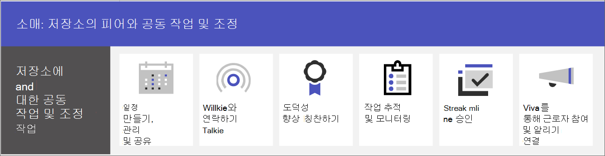

# 소매 팀 공동 작업

Microsoft Teams를 통해 매장 내 직원과 관리 인력을 한자리에 모아 소통하고 공동 작업을 하고 운영을 간소화하세요. 동료가 [Viva Connections을 사용하여 조직에 연결](#connect-information-from-across-the-organization-with-viva-connections)할 수 있도록 하고 [Yammer 커뮤니티](#connect-across-your-organization-with-yammer-and-teams)를 이용해 매장과 본사 간 커뮤니케이션을 할 수 있도록 지원합니다.

> [!VIDEO https://www.microsoft.com/videoplayer/embed/RWRJVw]

> [!NOTE]
> 이러한 시나리오 또한 소매용 Microsoft Cloud의 일부입니다. Microsoft Dynamics 365와 같은 소매용 Microsoft Cloud의 다른 기능을 사용하는 경우 이러한 시나리오를 사용하여 더 많은 작업을 할 수 있습니다. [소매용 Microsoft Cloud](/industry/retail)에서 Azure, Dynamics 365, Microsoft 365의 모든 기능을 결합한 이 솔루션을 사용하는 방법을 자세히 알아보세요.

## Teams에서 일상적인 커뮤니케이션 및 공동 작업

Microsoft Teams를 사용하면 매장 내 영업 직원, 관리자 및 기타 직원과 함께 공동 작업 기능 및 앱을 사용하여 효율적으로 공동 작업할 수 있습니다. 일선 직원은 조직의 요구에 따라 개인 또는 공유 장치에서 Teams를 사용할 수 있습니다.

Teams에서 다음과 같은 방법으로 정보를 전달하고 공유할 수 있습니다.

| 작업  | 설명 | 이 기능 관리 | 최종 사용자 교육 |
| ---- | ---- | ---- | ---- |
| 채팅, 메시지 게시 및 커뮤니케이션 | 매장 내 동료는 부서 간에 원활하게 커뮤니케이션하여 주문을 이행하고, 고객을 위한 도움을 받고, 재고 요구 사항을 관리할 수 있습니다.   Teams는 조직을 위해 즉시 사용 가능한 뛰어난 공동 작업 환경을 제공하고 대부분의 조직에 그 기본 설정이 적합합니다. | [Microsoft Teams의 채팅, 팀, 채널](../deploy-chat-teams-channels-microsoft-teams-landing-page.md) | [채팅 시작](https://support.microsoft.com/office/start-and-pin-chats-a864b052-5e4b-4ccf-b046-2e26f40e21b5) 및 [게시물 및 메시지 작업](https://support.microsoft.com/office/create-and-format-a-post-e66777da-636b-49eb-9408-b0d88b212885) |
|팀 구성원과 통화 및 모임 | 관리자는 개별 모임을 설정하거나 채널 모임을 사용하여 Teams 오디오, 비디오, 화면 공유, 녹음/녹화 및 녹음/녹화 기능을 모두 사용하여 일일 모임을 관리합니다. 예를 들어 관리자는 매장을 열기 전에 다른 부서의 매장 동료와 아침 비디오 모임을 진행하여 상태를 확인할 수 있습니다.   모임 및 회의에 대한 설정을 구성하고 음성 솔루션에서 통화를 사용하도록 설정해야 합니다. | [Microsoft Teams에서 모임 및 회의 진행](../deploy-meetings-microsoft-teams-landing-page.md) 및 [ Teams Voice 솔루션 계획](../cloud-voice-landing-page.md) | [전화 걸기](https://support.microsoft.com/office/overview-of-teams-calls-425d6970-6e27-47b6-bc61-4c38fff51c4f) 및 [모임 참가](https://support.microsoft.com/office/join-a-teams-meeting-078e9868-f1aa-4414-8bb9-ee88e9236ee4) |
|파일 및 문서 저장 및 공유 | 파일을 공유하면 매장 내 직원이 영업 현장으로 나가거나 관리자의 도움을 받지 않고도 상품 다이어그램과 같은 정보에 쉽게 액세스할 수 있습니다. 모든 팀에는 문서를 저장하고 공유하는 데 사용할 수 있는 파일 탭이 자동으로 제공됩니다. 이 탭은 실제로 SharePoint의 기본 팀 사이트 문서 라이브러리 내에서 팀을 만들 때 자동으로 생성되는 폴더를 나타냅니다. | [SharePoint 및 OneDrive가 Microsoft Teams와 상호 작용하는 방식](../sharepoint-onedrive-interact.md) | [파일 업로드 및 공유](https://support.microsoft.com/office/upload-and-share-files-57b669db-678e-424e-b0a0-15d19215cb12) |

팀은 Teams의 앱을 사용하여 다음과 같은 일상적인 작업에서 서로 조정하고 공동 작업할 수 있습니다.

| 작업  | 앱 | 설명 | 이 앱 관리 | 최종 사용자 교육 |
| ---- | ---- | ---- | ---- | ---- |
| 일정 만들기, 관리 및 공유| 교대 근무 | 교대 근무를 사용하여 일정을 원활하게 관리하고 공유합니다. 관리자는 계산원 또는 인사말과 같은 사용자 지정 그룹을 만들고, 직원에게 교대 근무를 할당하고, 맞춤형 레이블 지정 및 휴식 시간을 추가하고, 직원이 요청할 수 있는 미지정 교대 근무를 추가할 수 있습니다. 직원들은 교대 근무를 사용하여 가용성을 설정하고, 일정을 보고, 동료와 교대 근무를 교환하고, 출퇴근을 관리할 수 있습니다. | [교대 근무 관리](/microsoftteams/expand-teams-across-your-org/shifts/manage-the-shifts-app-for-your-organization-in-teams)|[교대 근무 비디오 교육](https://support.microsoft.com/office/what-is-shifts-f8efe6e4-ddb3-4d23-b81b-bb812296b821)|
| 소식 전하기 | 워키토키 | 워키토키 앱은 즉각적인 푸시-토크 통신을 제공합니다. 워키토키를 사용하면 직원과 관리자가 매장의 어디에서나 통신할 수 있습니다. 예를 들어 매장의 한쪽에 있는 고객이 매장의 다른 쪽에 재고가 있는지 직원에게 묻는 경우 직원은 Walkie Talkie를 사용하여 해당 아이템 근처에서 작업하는 사람에게 연락할 수 있습니다. Walkie Talkie에는 범위가 제한되어 있지 않으므로 직원은 다른 매장이나 회사 사무실의 전문가와 쉽게 상의할 수 있습니다. | [워키토키 관리](../walkie-talkie.md)  | [워키토키 비디오 교육](https://support.microsoft.com/office/use-walkie-talkie-in-teams-884a008a-761e-4b62-99f8-15671d9a2f69) |
| 사기 진작 | 칭찬 | 칭찬하기 앱을 사용하면 관리자 및 매장 내 동료가 미리 만든 배지나 사용자 지정 배지를 보내 서로를 칭찬하고 감사를 공유할 수 있습니다. 칭찬하기는 직원들이 판매 목표 달성과 같은 성과에 대한 인정을 받고 고객에게 도움을 제공하며 그 이상으로 나아가는 데 도움이 됩니다. | [칭찬 앱 관리](../manage-praise-app.md) |[칭찬하기 비디오 교육](https://support.microsoft.com/office/communication-and-praise-7d37ef80-542b-42e5-aa01-0fabbaa634b6) |
| 작업 추적 및 모니터링 | 작업 | Teams의 작업을 사용하여 전체 소매 팀의 할 일 항목을 추적합니다. Microsoft Store 관리자와 직원은 Teams를 실행하는 모든 장치에서 언제든지 작업을 만들고, 할당하고, 예약하고, 작업을 분류하고, 상태를 업데이트할 수 있습니다. IT 전문가 및 관리자는 조직의 특정 팀에 작업을 게시할 수도 있습니다. 예를 들어 일일 청소를 위한 작업 집합 또는 새 디스플레이를 설정하는 단계를 게시할 수 있습니다.| [작업 앱 관리](/microsoftteams/manage-tasks-app) |[작업 비디오 교육](https://support.microsoft.com/office/use-the-tasks-app-in-teams-e32639f3-2e07-4b62-9a8c-fd706c12c070) |
| 승인 간소화 | 승인 | 승인을 사용하여 팀과 함께 요청 및 프로세스를 간소화합니다. 허브에서 직접 팀워크를 위해 승인을 만들고 관리하고 공유합니다. 채팅을 보내는 동일한 장소, 채널 대화 또는 승인 앱 자체에서 승인 흐름을 시작하세요. 승인 유형을 선택하고, 세부 정보를 추가하고, 파일을 첨부하고, 승인자를 선택하기만 하면 됩니다. 승인자가 제출하면 승인자에 대한 알림을 통해 요청을 검토하고 요청할 수 있습니다. 조직에 대해 승인 앱을 허용하고 Teams에 추가할 수 있습니다. | [Teams 승인 앱 가용성](/microsoftteams/approval-admin) | [승인 비디오 교육](https://support.microsoft.com/office/what-is-approvals-a9a01c95-e0bf-4d20-9ada-f7be3fc283d3?wt.mc_id=otc_microsoft_teams)|

### 팀, 채널 및 앱 설정

Teams에서 소매 직원을 연결할 준비가 되면 미리 빌드되거나 사용자 지정 템플릿을 사용하여 매장 팀과 관리자를 위한 팀과 채널을 설정할 수 있습니다. 가장 쉬운 방법은 템플릿에서 시작하는 것입니다. **매장 구성** 및 **관리자용 소매** [템플릿](/microsoftteams/get-started-with-retail-teams-templates)은 소매용으로 설계된 채널 및 앱을 포함하는 미리 만들어진 템플릿입니다. 기존 팀을 기반으로 템플릿을 만들 수도 있습니다. 템플릿으로 시작한 경우에도 팀 및 채널을 사용자 지정하고 팀의 요구에 맞게 앱을 더 추가할 수 있습니다.

- 탭이 있는 채널을 사용하여 뉴스를 공유하고, 교대 근무를 통해 직원들에게 연락하고, 커뮤니티를 구축하세요.
- 팀 템플릿을 사용하여 상점 또는 지역에 걸쳐 유사한 구조(예: 채널 및 탭)를 사용하여 팀을 설정하세요.

#### 템플릿을 기반으로 팀 만들기

1. Microsoft Teams에서 **팀에 참가 또는 팀 만들기** 를 선택합니다.

2. **팀 만들기** 를 선택한 다음 아래로 스크롤하여 사용 가능한 템플릿을 확인합니다.

자세한 정보: [템플릿으로 팀 만들기](https://support.microsoft.com/office/create-a-team-with-team-templates-702a2977-e662-4038-bef5-bdf8ee47b17b)

### 앱 관리

앱으로 팀의 정보를 구체화합니다. Microsoft Teams 관리 센터에서 조직의 앱을 허용하거나 차단하거나 앱에 대한 설정을 구성할 수 있습니다. 앱 관리에 대한 자세한 내용은 [Microsoft Teams 관리 센터 앱 관리](../manage-apps.md)를 참조하세요.

사용자가 자신의 팀에 허용한 모든 앱을 추가할 수 있습니다. 사용자와 이 교육을 공유하여 [앱 찾기 및 사용 방법](https://support.microsoft.com/office/find-and-use-apps-6e22a734-c002-4da0-ba63-681f155b142d)을 보여주세요.

## Viva Connections를 사용하여 조직 전체의 정보 연결

Viva Connections를 사용하여 작업자를 참여시키고 공지를 알릴 수 있습니다. Viva Connections는 Teams에 허브를 만듭니다. 여기서 소매 직원은 조직의 맞춤형 뉴스 피드와 직원에게 필요한 리소스가 포함된 개인 설정 대시보드를 볼 수 있습니다. 직원이 Viva Connections를 사용하는 경우 중요한 정보를 더 빠르게 얻을 수 있으므로 관리자는 업데이트를 전파하는 데 중요한 시간을 소비할 필요가 없습니다. Viva Connections 대시보드에서 주요 정보, 개인 설정된 뉴스, 작업, 공지 및 기타 리소스를 표시합니다.

[Viva Connections](/sharepoint/viva-connections-overview)에 대해 자세히 알아보고 직원 및 동료가 [Microsoft Teams에서 Viva Connections](https://support.microsoft.com/office/your-intranet-is-now-in-microsoft-teams-8b4e7f76-f305-49a9-b6d2-09378476f95b)를 시작하는 데 도움을 주세요.

Microsoft Teams, Viva Connections 및 SharePoint를 사용하여 다음 시나리오를 사용하도록 설정할 수 있습니다.

- 신입 직원 온보드 [방법 알아보기](/sharepoint/onboard-employees)
- 일선 근로자와 리더십 팀 연결 [방법 알아보기](/sharepoint/leadership-connection)
- 조직에 뉴스 배포 [방법 알아보기](/sharepoint/distribute-corporate-news-to-your-organization)

[조직에서 통신을 구동하는 방법에 대해 자세히 알아보기](/sharepoint/corporate-communications-overview)

## Yammer 및 Teams를 사용하여 조직 전체에서 연결

Yammer에서 커뮤니티에 참여하세요. Yammer의 커뮤니티는 대화, 파일, 이벤트 및 업데이트를 위한 중앙 위치를 제공하여 지식 공유, 직원 경험, 회사 차원의 커뮤니케이션 및 리더십 참여의 요구를 충족합니다. 동료는 Yammer 커뮤니티에서 문제를 제기하고, 피드백을 제공하고, 질문하고 답변할 수 있습니다. 라이브 이벤트 및 전체 모임을 개최하여 조직의 모든 사용자를 루프에 유지합니다.

[Teams 채널에 Yammer 페이지를 추가](https://support.microsoft.com/office/add-a-yammer-page-to-a-teams-channel-ca06ec83-f22d-4b76-83a5-c83aa2a33528)하고 [Yammer 커뮤니티 가입 및 만들기](https://support.microsoft.com/office/join-and-create-a-community-in-yammer-56aaf591-1fbc-4160-ba26-0c4723c23fd6) 방법에 대해 알아보세요.

Yammer에 대한 자세한 정보:

- 관리자용: [Yammer 관리 ](/yammer)
- 사용자용: [Yammer 사용](https://support.microsoft.com/office/what-is-yammer-1b0f3b3e-89ee-4b66-aac5-30def12f287c)
