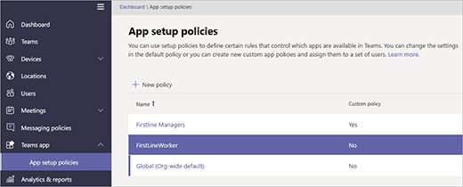

# <a name="manage-the-shifts-app-for-your-organization-in-microsoft-teams"></a>Microsoft 팀에서 조직의 교대 근무 앱 관리

> [!IMPORTANT]
> 2019 년 12 월 31 일에 효력을 StaffHub Microsoft는 곧 만료 됩니다. Microsoft 팀에 StaffHub 접근 권한 값을 구축 하 고 있습니다. 현재 팀에는 일정 관리를 위해 교대 근무 앱이 포함 되어 있으며 추가 기능이 시간에 따라 롤아웃 됩니다. StaffHub는 2019 년 12 월 31 일에 모든 사용자의 작동이 중지 됩니다. StaffHub를 열려고 하는 모든 사용자에 게 팀을 다운로드 하도록 지시 하는 메시지가 표시 됩니다. 자세한 내용은 [Microsoft StaffHub](microsoft-staffhub-to-be-retired.md)을 사용 중지 하세요.  

## <a name="overview-of-shifts"></a>교대의 개요
Microsoft 팀의 교대 근무 앱은 Firstline Worker를 연결 된 상태로 유지 하 고 동기화 합니다. 팀에 대 한 신속 하 고 효율적인 시간 관리 및 통신을 위해 먼저 모바일을 구축할 수 있습니다. 교대 근무를 통해 최신 회선 근로자와 해당 관리자는 모바일 장치를 사용 하 여 일정을 관리 하 고 지속적인 연락을 즐길 수 있습니다. 

- 관리자는 팀에 대 한 교대 근무 일정을 만들고 업데이트 하 고 관리 합니다. 각 사용자에 게 메시지를 보낼 수 있습니다 ("층에는 분할이 있습니다") 또는 전체 팀 ("지역 GM은 20 분 내에 도착 하 고 있습니다."). 또한 정책 문서, 뉴스 게시판, 비디오를 보낼 수도 있습니다. 
- 직원 들이 예정 된 교대 근무를 보거나, 하루에 대해 다른 사람을 예약 하 고, 교대 근무를 교환 하거나,, 휴가를 요청 하는 경우를 확인할 수 있습니다. 

현재 이동이 게스트 사용자를 지원 하지 않는다는 것을 알아야 합니다. 즉, 팀에서 게스트 액세스가 설정 되어 있을 때는 팀의 게스트를 추가 하거나 shift 일정을 사용할 수 없습니다. 

## <a name="availability-of-shifts"></a>이동 가능

이동은 팀을 사용할 수 있는 모든 Enterprise Sku에서 사용할 수 있습니다.

## <a name="location-of-shifts-data"></a>데이터 이동 위치

현재 북미, 서유럽, 아시아 태평양의 데이터 센터에서 Azure에 저장 된 데이터를 이동 합니다. 데이터가 저장 되는 위치에 대 한 자세한 내용은 [내 데이터 위치](http://o365datacentermap.azurewebsites.net/)를 참고 하세요.

## <a name="set-up-shifts"></a>교대 근무 설정

### <a name="enable-or-disable-shifts-in-your-organization"></a>조직의 교대 근무 사용 또는 사용 안 함

이동은 조직의 모든 팀 사용자에 대해 기본적으로 사용 하도록 설정 됩니다. Microsoft 팀 관리 센터에서 앱 권한 정책의 조직 전체 설정을 사용 하 여 조직 전체에서 앱을 설정 하거나 해제할 수 있습니다.

1. Microsoft 팀 관리 센터의 왼쪽 탐색 창에서 **팀 앱** > **권한 정책** 으로 이동 합니다.
2. **조직 전체 설정을**클릭 합니다.
3. **조직 전체 설정** 패널의 **차단 된 앱**에서 다음 중 하나를 수행 합니다.

    - 조직의 이동 기능을 해제 하려면 교대 앱을 검색 하 고 **추가** 를 클릭 하 여 차단 된 앱 목록에 추가 합니다.
    - 조직의 교대 근무를 설정 하려면 차단 된 앱 목록에서 교대 근무 앱을 제거 합니다.
4. **저장**을 클릭 합니다. 

### <a name="enable-or-disable-shifts-for-specific-users-in-your-organization"></a>조직의 특정 사용자에 대 한 교대 근무 설정 또는 해제

조직의 특정 사용자가 교대 근무를 사용 하는 것을 허용 하거나 차단 하려면 조직에 대 한 조직의 진행이 설정 되어 있는지 확인 한 다음 사용자 지정 앱 사용 권한 정책을 만들어 해당 사용자에 게 할당 합니다. 자세히 알아보려면 [팀에서 앱 권한 정책 관리](../../teams-app-permission-policies.md)를 참조 하세요.

### <a name="use-the-firstlineworker-app-setup-policy-to-pin-shifts-to-teams"></a>FirstlineWorker 앱 설정 정책을 사용 하 여 팀에 고정 이동

앱 설정 정책은 팀을 사용자 지정 하 여 조직의 사용자에 게 가장 중요 한 앱을 강조 표시할 수 있습니다. 정책&mdash;에 설정 된 앱은 팀 데스크톱 클라이언트의 측면에 있는 표시줄과 팀 모바일 클라이언트&mdash;의 맨 아래에 있으며 사용자가 빠르고 쉽게 액세스할 수 있습니다. 
 
팀에는 조직의 Firstline Worker에 할당할 수 있는 기본 제공 FirstlineWorker 앱 설정 정책이 포함 됩니다. 기본적으로 정책에는 활동, 교대, 채팅 및 통화 앱이 포함 됩니다. 

Firstlineworker 정책을 보려면 Microsoft 팀 관리 센터의 왼쪽 탐색에서 **팀 앱** > **앱 설치 정책**으로 이동 합니다.



#### <a name="assign-the-firstlineworker-policy-to-individual-users"></a>개별 사용자에 게 FirstlineWorker 정책 할당

1. Microsoft 팀 관리 센터의 왼쪽 탐색 창에서 **사용자**로 이동한 다음 사용자를 클릭 합니다.
2. **할당 된 정책**옆에 있는 **편집**을 선택 합니다.
3. **팀 앱 설정 정책**에서 **firstlineworker**를 선택 하 고 **저장**을 선택 합니다.

#### <a name="assign-the-firstlineworker-app-setup-policy-to-users-in-a-group"></a>그룹의 사용자에 게 FirstlineWorker 앱 설정 정책 할당

Graph 모듈의 Azure Active Directory PowerShell 및 비즈니스용 Skype PowerShell 모듈에 연결 하 여 그룹의 사용자에 게 (보안 그룹과 같은) FirstlineWorker 앱 설정 정책을 할당할 수 있습니다. PowerShell을 사용 하 여 팀을 관리 하는 방법에 대 한 자세한 내용은 [팀 Powershell 개요](../../teams-powershell-overview.md)를 참조 하세요.

이 예제에서는 모든 사용자에 게 FirstlineWorker 앱 설정 정책을 Contoso Firstline 팀 그룹에 할당 합니다.

> [!NOTE]
> 먼저 [단일 Windows powershell 창에서 모든 Office 365 서비스에 연결](https://docs.microsoft.com/office365/enterprise/powershell/connect-to-all-office-365-services-in-a-single-windows-powershell-window)의 단계를 따라 Graph 모듈 및 비즈니스용 Skype powershell 모듈에 대 한 Azure Active Directory powershell에 연결 해야 합니다.

특정 그룹의 GroupObjectId를 가져옵니다.
```PowerShell
$group = Get-AzureADGroup -SearchString "Contoso Firstline Team"
```
지정 된 그룹의 구성원을 가져옵니다.
```PowerShell
$members = Get-AzureADGroupMember -ObjectId $group.ObjectId -All $true | Where-Object {$_.ObjectType -eq "User"}
```
그룹의 모든 사용자를 FirstlineWorker 앱 설정 정책에 할당 합니다.
```PowerShell
$members | ForEach-Object { Grant-CsTeamsAppSetupPolicy -PolicyName "FirstlineWorker" -Identity $_.EmailAddress}
``` 
그룹의 구성원 수에 따라이 명령을 실행 하는 데 몇 분 정도 걸릴 수 있습니다.

## <a name="related-topics"></a>관련 항목
- [Firstline Worker에 대 한 도움말 이동](https://support.office.com/article/apps-and-services-cc1fba57-9900-4634-8306-2360a40c665b)
