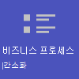

# 소매용 Teams 시작

순환 일정과 상근 직원이 있는 소매 환경은 다른 조직과 요구 사항이 매우 다릅니다. 소매 조직에서 최대한의 이점을 얻으려면 먼저 Teams가 일상적인 비즈니스 운영에서 도움을 줄 수 있는 시나리오를 선택한 다음 올바른 기본, 팀 및 앱으로 Teams 환경을 준비하여 이러한 시나리오를 지원하도록 해야 합니다.

1. 비즈니스에 구현할 [시나리오를 선택합니다.](#choose-your-scenarios)
:::image type="content" source="../media/retail-teams-scenarios.png" alt-text="소매용 Teams 시나리오를 표시하는 다이어그램." lightbox="../media/retail-teams-scenarios.png":::
1. [기본 요소 설정](#set-up-the-fundamentals) - 계정과 장치를 관리하고 적절한 Teams 정책을 적용하여 인력에 기본 요소를 지원합니다. :::image type="content" source="../media/retail-teams-fundamentals.png" alt-text="Teams 정책, 계정 및 장치를 포함한 기본 사항을 보여주는 다이어그램." lightbox="../media/retail-teams-fundamentals.png":::
1. [팀 및 앱 설정](#set-up-teams-and-apps) - 팀 템플릿을 사용하여 비즈니스에 필요한 채널과 앱을 비롯하여 필요한 팀을 빠르게 설정합니다. 시나리오를 지원하는 데 필요한 경우 Microsoft의 다른 앱도 추가합니다.
:::image type="content" source="../media/retail-teams-apps.png" alt-text="포함할 수 있는 팀과 팀 템플릿, 앱을 표시하는 다이어그램." lightbox="../media/retail-teams-apps.png":::

<!-- Additional capabilities for retail environments are available with the Microsoft Cloud for Retail, which includes capabilities from Dynamics 365 and Microsoft Azure as well as the Microsoft 365 features. For more information, see [Microsoft Cloud for Retail](/industry/retail/). -->

## 시나리오 선택

Microsoft 365 및 Microsoft Teams는 소매 조직의 일상적인 운영 및 디지털 혁신을 도울 수 있는 여러 기능을 제공합니다. 소매 조직에는 다음 시나리오를 권장합니다.

     

> [!NOTE]
> 이러한 시나리오 또한 소매용 Microsoft Cloud의 일부입니다. Microsoft Dynamics 365와 같은 소매용 Microsoft Cloud의 다른 기능을 사용하는 경우 이러한 시나리오를 사용하여 더 많은 작업을 할 수 있습니다. [소매용 Microsoft Cloud](/industry/retail)에서 Azure, Dynamics 365, Microsoft 365의 모든 기능을 결합한 이 솔루션을 사용하는 방법을 자세히 알아보세요.

### 매장 내 소통 및 공동 작업

Teams와 Teams 앱을 통해 매장 내 직원과 관리 인력을 한자리에 모아 공동 작업을 하고 운영을 간소화하세요.

**주요 앱:** 시프트, 워키토키, 작업, 승인, 채팅, 칭찬, 목록, 파일

**추가 서비스:** Viva Connections, SharePoint, Power Platform, Power Apps

자세한 정보: [소매 팀 공동 작업](retail-team-collaboration.md)

### 매장 간 소통 및 공동 작업

직원이 매장에서 사용하는 것과 같은 도구 및 앱을 사용하여 지역 내 매장 전체에서 또는 본사와 소통하고 공동 작업할 수 있습니다.

**주요 앱:** 시프트, 워키토키, 작업, 승인, 채팅, 칭찬, 목록, 파일

**추가 서비스:** Viva Connections, Yammer, SharePoint, Power Platform, Power Apps

자세한 정보: [소매 팀 공동 작업](retail-team-collaboration.md)

### 가상 피팅 및 상담

Microsoft Teams의 Bookings 앱은 조직에 동료 및 고객의 가상 약속을 예약하고 관리하는 간단한 방법을 제공합니다. 가상 쇼핑 경험 등 가상 약속을 예약하는 데 사용하세요.

**주요 기능 및 앱:** 모임, Bookings

자세한 정보: [Microsoft Teams 및 Bookings 앱을 통한 가상 약속](bookings-virtual-visits.md)

### 비즈니스 프로세스 간소화

Teams 앱, Power Apps 및 Power BI를 사용하여 비즈니스 프로세스를 단순화할 수 있습니다. 예를 들어 다음을 수행할 수 있습니다.

- Shifts로 직원 일정 설정 및 유지 관리
- Power Apps로 매장 방문 및 재고 관리
- Power BI 보고서로 KPI(핵심 성과 지표) 추적

**주요 앱:** Shifts, 작업, 목록, 승인

**추가 서비스:** Power Apps 및 Power BI가 있는 Power Platform

자세한 정보: [비즈니스 프로세스 간소화](retail-business-processes.md)

### 기업 소통

직원 참여는 모든 조직의 직장 만족도, 충성도, 생산성에 기여하는 주요 요소입니다. SharePoint, Teams, Yammer, Stream, Viva Connections를 사용하여 모든 직원에게 최신 정보를 제공하고 참여를 장려하는 방법을 알아보세요.

**추가 서비스:** Viva Connections, SharePoint, Stream, Yammer

자세한 정보: [조직 소통: 지침, 방법 및 제품](/sharepoint/corporate-communications-overview)

### 신입 직원 온보딩

신입 직원이 중요한 리소스를 찾고, 조직 내 사람들을 만나고, 새로운 역할에서 성공할 준비를 할 수 있는 올인원 하이브리드 작업 환경을 조성하여 원활한 신입 직원 온보딩 경험을 제공하세요.

**주요 앱:** 목록, 라이브 모임

**추가 서비스:** Viva Learning, SharePoint, Yammer

자세한 정보: [신입 직원 온보딩](/sharepoint/onboard-employees)

> [!NOTE]
> 이러한 모든 기능의 경우 사용자에게 적절한 라이선스가 있어야 합니다. 최전방 인력용 Microsoft 365 F1 및 F3 또는 Office 365 F3, Office 365 A3, A5, E3, E5, Microsoft 365 Business Standard, Business Premium, A3, A5, E3, E5가 모두 지원됩니다. 일반 Teams 라이선스에 대한 자세한 내용은 [Teams에 대한 사용자 액세스 관리](../user-access.md)를 참조하세요. [최전방 인력을 위한 라이선스 옵션](../flw-licensing-options.md)에서 최전방 인력용 Microsoft 365를 다른 라이선스와 결합하여 사용하는 방법에 관해 자세히 알아보세요.

## 기본 요소 설정

직원이 규정에 맞는 안전한 방법을 사용하여 업무를 완수할 수 있도록 적절한 라이선스를 선택하고, 계정을 관리하고, 장치를 관리하여 적절한 업무 토대를 마련해 주세요.

:::image type="content" source="../media/retail-teams-fundamentals.png" alt-text="Teams 정책, 계정 및 장치와 같은 Teams 시나리오를 지원하는 기본 요소 다이어그램.":::

### 라이선싱

소매 직원은 모바일 인력인 경우가 많습니다. 기업 인력과는 다르게 최전방 인력과 매니저는 온종일 컴퓨터 앞에 묶여있지 않습니다. 따라서 이러한 직원에게는 다른 종류의 도구와 앱이 필요합니다. 최전방 인력용 Microsoft 365는 이러한 대상에 딱 맞는 기능 집합을 제공합니다. [최전방 인력용 라이선스 옵션](../flw-licensing-options.md)에서 자세히 알아보세요.

### 계정

회전율이 높기 때문에 빠르게 계정을 추가 및 제거하고, 올바른 정책을 할당하는 능력이 중요합니다. Microsoft 365 관리 센터의 최전방 인력 온보딩 마법사로 시작해 보세요. 마법사는 최전방 인력 팀을 설정하고 각 구성원에게 라이선스와 정책 패키지를 할당합니다. 자세한 내용은 [최전방 인력 온보딩 마법사를 사용해 최전방 인력 활용 준비](../flw-onboarding-wizard.md)를 확인하세요.

배포하려는 팀이 많은 경우 [최전방 작업자를 위한 대규모 팀 배포](../deploy-teams-at-scale.md)를 참조하세요.

보통 최전방 인력의 근무 일정은 매일 바뀌기 때문에 현재 상태를 파악하기가 쉽지 않습니다. 관리자는 교대 근무 기반 액세스(미리 보기)로 Teams를 구성하여 조직의 최전방 인력이 근무 중인지 아닌지를 알 수 있는 최전방 인력용 교대 근무 기반 현재 상태 집합을 표시할 수 있습니다. 최전방 인력이 근무 중이지 않을 때 Teams에 대한 액세스를 관리할 수도 있습니다. 자세한 내용은 [최전방 인력용 교대 근무 기반 액세스 관리](shifts/manage-shift-based-access-flw.md)를 참조하세요.

### 디바이스

대부분이 모바일 인력인 소매 환경에서 계정과 장치 관리는 매우 중요한 부분입니다. 공유 장치든 직원의 개인 장치든 인력이 사용하는 관리 장치에 규정에 맞는 안전한 기준을 설정하도록 하세요. 자세한 내용은 다음을 참조하세요.

- [Azure Active Directory 장치 배포 계획](/azure/active-directory/devices/plan-device-deployment)
- [Microsoft Intune 개요](/mem/intune/fundamentals/what-is-intune#manage-devices)
- [RealWear용 Microsoft Teams](../flw-realwear.md)

### 정책

적절한 정책 패키지를 구성하여 영업 직원과 기타 최전방 인력에게 Teams 기능에 대한 적절한 액세스 권한을 제공하세요. Teams 정책은 특정 역할을 맡은 사용자가 할 수 있는 작업을 제어하는 데 도움이 됩니다. [최전방 인력과 최전방 관리자 정책 패키지](../manage-policy-packages.md#policy-packages-included-in-teams)는 소매점에서 근무하는 직원과 같은 최전방 인력에 적절하게 맞춤 제작된 패키지입니다.

교대 근무 앱 및 최전방 인력과 Teams는 통합되며, 사용자는 이를 통해 교대 근무 기능 등을 조정할 수 있습니다. 예를 들어 교대 근무를 사용해 매장 관리자는 직원 일정을 설정 및 조정하고, 직원은 일정을 확인하고 교대 근무를 전환할 수 있습니다.

## 팀 및 앱 설정

:::image type="content" source="../media/retail-teams-apps.png" alt-text="포함할 수 있는 팀과 팀 템플릿, 앱의 다이어그램.":::

### 소매용 앱 및 서비스

직원이 교대 근무, 워키토키, 작업, 목록, 칭찬 등 앱을 사용하여 소통하고 공동 작업하고 훌륭한 고객 서비스를 제공할 수 있도록 하세요. Teams 관리 센터에서 앱을 사용 설정하거나 팀 템플릿에 포함하여 사용자가 사용할 수 있는 앱을 결정할 수 있습니다. 자세한 정보는 [Teams 앱 관리](../manage-apps.md)를 참조하세요.

소매 환경의 경우 다음 앱과 서비스가 비즈니스 프로세스를 혁신하고 소통을 지원하는 데 도움이 될 수 있습니다.

| Teams 앱 및 서비스 | 설명 | 관리 | 도움말 |
| ----- | ----- | ----- | ----- |
| 승인 | 승인을 채팅과 통합하여 간편하게 승인을 내릴 수 있습니다. | [승인 관리](../approval-admin.md) | [승인 사용](https://support.microsoft.com/office/what-is-approvals-a9a01c95-e0bf-4d20-9ada-f7be3fc283d3) |
| 채팅 | 소비자 급 앱이나 SMS 대신 안전한 엔터프라이즈급 통신 도구로 직원 간에 빠른 대화와 체크인을 지원하세요. | [Microsoft Teams의 채팅, 팀, 채널](../deploy-chat-teams-channels-microsoft-teams-landing-page.md) | [Teams의 채팅](https://support.microsoft.com/office/start-and-pin-chats-a864b052-5e4b-4ccf-b046-2e26f40e21b5?wt.mc_id=otc_microsoft_teams) |
| 문서 | 표준 운영 절차, 매장 정책, 계획 등을 공유하세요. | [SharePoint 및 OneDrive가 Microsoft Teams와 상호 작용하는 방식](../sharepoint-onedrive-interact.md) | [파일 공유](https://support.microsoft.com/office/upload-and-share-files-57b669db-678e-424e-b0a0-15d19215cb12) |
| 칭찬 | 칭찬 앱을 사용해 훌륭한 팀워크를 보이는 직장 동료를 칭찬해 주세요. | [칭찬 앱 관리](../manage-praise-app.md) | [다른 사람에게 칭찬 보내기](https://support.microsoft.com/office/send-praise-to-people-50f26b47-565f-40fe-8642-5ca2a5ed261e) |
| RealWear 장치 | 장치를 사용한 핸즈프리 통신. | [RealWear용 Microsoft Teams](../flw-realwear.md) | [RealWear에 Microsoft Teams 사용](https://support.microsoft.com/office/using-microsoft-teams-for-realwear-af20d232-d18c-476f-8031-843a4edccd5f) |
| 교대 근무 | 교대 근무를 사용하여 일정을 관리하고 출근 시간을 기록하세요. | [교대 근무 관리](shifts-for-teams-landing-page.md) | [교대 근무 사용](https://support.microsoft.com/office/what-is-shifts-f8efe6e4-ddb3-4d23-b81b-bb812296b821) |
| 작업 | 작업을 할당하여 고객과 함께 있지 않을 때 직원이 어떤 부분에 집중해야 하는지 알 수 있도록 도와주세요. 운영팀은 [작업 게시](../manage-tasks-app.md#task-publishing)를 사용하여 지점에 작업을 보내고 해당 지점 전체에서 진행률을 추적할 수 있습니다. | [작업 앱 관리](../manage-tasks-app.md) | [작업 사용](https://support.microsoft.com/office/use-the-tasks-app-in-teams-e32639f3-2e07-4b62-9a8c-fd706c12c070) |
| 워키토키 | 표준 양방향 라디오와 같이 지리적 제한을 받지 않는 간단한 통신을 장려하세요.| [워키토키 앱 관리](../walkie-talkie.md) | [워키토키 사용](https://support.microsoft.com/office/get-started-with-teams-walkie-talkie-25bdc3d5-bbb2-41b7-89bf-650fae0c8e0c) |

| Microsoft의 더 많은 앱과 서비스 | 설명 | 관리 | 도움말 |
| ----- | ----- | ----- | ----- |
| Bookings | 가상 피팅과 상담을 사용을 지원합니다. | [Microsoft Teams 및 Bookings 앱을 통한 가상 약속](bookings-virtual-visits.md) | [Bookings 사용](https://support.microsoft.com/en-us/office/what-is-bookings-42d4e852-8e99-4d8f-9b70-d7fc93973cb5) |
| Power Apps 및 Power Platform | 비즈니스 프로세스를 통합하고 매장 재고, 판매 수치, 사고 보고 등 신속한 데이터 업데이트를 지원하세요. | [Microsoft Power Platform과 Teams 통합](/microsoftteams/platform/samples/teams-low-code-solutions) 및 [Microsoft Teams 관리 센터에서 Microsoft Power Platform 앱 관리](../manage-power-platform-apps.md) | -  |
| SharePoint | 새 팀을 만들면 새 SharePoint 사이트가 생성되고 팀에 연결됩니다. 위에 명시된 많은 시나리오가 팀 공동 작업을 위한 문서 공유 등 Teams에 이미 포함된 SharePoint 기능에 의존합니다. | [Teams 및 SharePoint 통합](/sharepoint/teams-connected-sites) | [Teams에 탭으로 SharePoint 페이지, 목록, 문서 라이브러리 추가](https://support.microsoft.com/office/add-a-sharepoint-page-list-or-document-library-as-a-tab-in-teams-131edef1-455f-4c67-a8ce-efa2ebf25f0b)|
| Viva Connections | Viva Connections는 Teams에 허브를 만듭니다. 여기서 소매 직원은 조직의 맞춤형 뉴스 피드와 직원에게 필요한 리소스가 포함된 개인 설정 대시보드를 볼 수 있습니다. | [Viva Connections 개요](/sharepoint/viva-connections-overview) | [Microsoft Teams의 Viva connections](https://support.microsoft.com/office/your-intranet-is-now-in-microsoft-teams-8b4e7f76-f305-49a9-b6d2-09378476f95b) |
| Viva Learning | 필요한 경우 작업 흐름 내에서 바로 트레이닝을 제공하세요. | [Viva Learning 관리](/microsoft-365/learning/) | [Viva Learning(미리 보기) 사용](https://support.microsoft.com/office/viva-learning-preview-01bfed12-c327-41e0-a68f-7fa527dcc98a) |
| Yammer | Yammer를 사용하여 조직을 연결하고 부서와 지역 간 소통을 지원하세요. | [Yammer 관리](/yammer) | [Yammer 사용](https://support.microsoft.com/office/what-is-yammer-1b0f3b3e-89ee-4b66-aac5-30def12f287c) |

### 템플릿을 사용하여 팀 설정

지리적 제한 없이 개별 매장 내, 지역, 본사 또는 직원 간에 소통하고 공동 작업할 수 있도록 미리 정의된 설정, 채널, 탭, 사전 설치 앱 집합을 포함하여 팀을 만드세요.

- 소매 **매장 구성** 템플릿은 일반, 교대 근무 전달, 매장 준비 상태, Learning 채널을 포함하며, 승인, 작업, Wiki 앱을 포함합니다.
- **관리자 소매** 템플릿은 일반, 운영, Learning 채널을 포함하며, Wiki 탭을 포함합니다.

[사용자 지정 템플릿을 만들어](../create-a-team-template.md) 매장에 필요한 앱을 포함할 수도 있습니다. 자세한 정보: [소매 팀 템플릿으로 시작](../get-started-with-retail-teams-templates.md)

팀 템플릿 외에도 SharePoint 사이트, Viva Connections 등 기타 사이트와 서비스를 설정하여 소통을 지원할 수도 있습니다.

- SharePoint 사이트를 설정하여 조직의 홈 페이지를 만들고, 회사 전체에 뉴스를 배포하고, 사용자 온보딩용 리소스를 위한 장소를 제공하세요. [조직 소통: 지침, 방법 및 제품](/sharepoint/corporate-communications-overview)에서 기업 소통 시나리오를 위한 SharePoint 사이트 사용하는 방법을 자세히 알아보세요.
- Viva Connections를 사용하여 모든 기능을 통합하세요. Viva Connections를 Teams의 직원 홈으로 사용하여 직원에게 작업에 관한 업데이트와 조직 뉴스 등을 제공할 수 있습니다. 자세한 정보는 [개요: Viva Connections(미리 보기)](/viva/connections/viva-connections-overview) 및 [Teams 관리 센터에서 Viva Connections 앱 추가(미리 보기)](/viva/connections/add-viva-connections-app)를 참조하세요.

## 시나리오 롤아웃 준비 - 시나리오의 역할 및 책임 식별

구현하려는 시나리오와 이를 지원하기 위해 필요한 부분을 파악했다면 이제 팀을 구성하여 조직에서 팀이 작동하는 방식을 계획하고 롤아웃하고 모니터링할 차례입니다. 예를 들어 조직에서 이러한 시나리오를 롤아웃하려면 다음 역할이 필요할 수 있습니다.

| 이미지 | 역할 | 책무 | 부서 |
| ---- | ---- | ----- | ----- |
| | IT 관리자 | 운영 및 소매 관리 직원과 협력하여 시나리오를 정의하고, 해당 시나리오가 조직에서 작동하는 방식을 정의합니다.   Teams 관리 센터에서 정책, 템플릿 등 설정을 구성하고 앱을 사용 설정합니다.   조직의 앱 설정(전역 교대 근무 설정 등)을 설정합니다.   사용자를 추가하고 라이선스를 할당합니다.  | IT 부서 |
|| 운영 직원 | 관리자와 협력하여 시나리오를 정의하고, Teams에 어떤 설정과 정책, 템플릿, 앱이 필요한지를 결정합니다.   템플릿에서 지역 또는 부서별 팀을 만듭니다.   지역 내 매장끼리 또는 매장과 본사 간의 협력을 위한 작업, 목록, 승인 흐름을 설정합니다.   직원 학습 프레임워크를 설정합니다. | 중앙 운영 |
| | 매장 관리자 | 관리자 및 운영 지원과 협력하여 시나리오를 정의합니다.   템플릿에서 매장 팀을 만듭니다.   필요한 경우 팀 채널 및 앱을 설정합니다. 예: 교대 근무 전달을 위한 채널.   교대 근무에서 매장 일정을 설정합니다.   매장별 작업, 목록, 승인 흐름을 설정합니다.   직원을 위한 학습 작업을 설정합니다. | 매장 관리 |

Teams의 성공적인 구현과 채택에 관한 자세한 정보는 [Microsoft Teams 채택](../adopt-microsoft-teams-landing-page.md)을 참조하세요.
