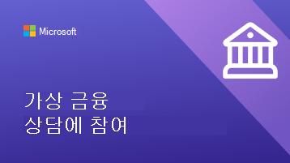
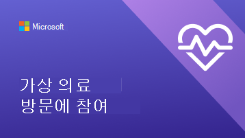
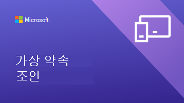

# 클라이언트와 고객이 가상 약속을 사용하도록 지원

이제 조직에서 가상 약속에 Microsoft Teams 및 Bookings 앱을 사용하기 시작했으므로 클라이언트와 고객이 이러한 약속을 예약하고 가입하는 방법을 이해해야 합니다.

가상 약속이 조직에 대해 수행할 수 있는 작업에 대한 간략한 개요는 이 비디오를 시청하세요.

> [!VIDEO https://www.microsoft.com/videoplayer/embed/RE4TQop]

## 이 도구 키트에 포함된 내용

이 도구 키트는 고객과 클라이언트가 가상 약속에 성공적으로 가입할 수 있도록 돕기 위한 것입니다. 제공하는 리소스를 사용자 지정하고 가상 약속에 대한 통신에 해당 리소스에 대한 링크를 포함할 수 있습니다. 이 도구 키트에는 다음이 포함됩니다.

[웹 사이트에 대한 지침](#guidance-for-your-website):   웹 사이트에서 사용자 지정한 다음 호스트할 수 있는 가상 약속에 대한 FAQ입니다. 고유한 링크와 고객이 정책에 대해 알아야 하는 추가 정보를 추가해야 합니다.

[팀의 리소스](#resources-for-your-team):   팀이 가상 약속을 보다 편안하게 수행할 수 있도록 도와주는 문서 및 비디오입니다.

[클라이언트에 대한 리소스](#resources-for-your-clients):  
가상 약속에 가입하는 방법에 대한 비디오가 포함된 Microsoft의 지원 콘텐츠에 대한 링크입니다. 
조직에 맞게 사용자 지정할 수 있는 인포그래픽입니다.

## 웹 사이트에 대한 지침

일반적인 질문에 답변하여 고객에게 가상 약속에 대해 무엇을 기대해야 하는지 알 수 있습니다. 가상 약속 정책에 맞게 이 Q&A를 편집하고 웹 사이트에 붙여넣기만 하면 됩니다.

### 가상 약속 기본 사항

**가상 약속이란?**

가상 약속은 Microsoft Teams 통해 수행되는 온라인 약속입니다. 직접 방문하는 것처럼 직원 중 한 명과 일대일로 대화할 수 있습니다.

**가상 약속은 직접 방문과 어떻게 다른가요?**

고객에게 가상 및 직접 제공하는 서비스에 차이가 있는지 알 수 있습니다. 가상 약속과 직접 약속 간의 요금 차이를 설명할 수도 있습니다.

**가상 약속은 어떻게 진행됩니까?**

전자 메일 확인의 링크에서 참가하면 가상 대기실을 입력합니다. 직원이 통화에 참여하면 일대일 방문이 이루어지는 가상 룸을 입력합니다.

**가상 약속에 대한 결제는 어떻게 작동하나요?**

가상 약속 대해 다양한 유형의 결제를 수락하는지 고객에게 알릴 수 있습니다.

### 약속 예약

**약속을 어떻게 할까요??**

조직의 예약 페이지에 연결합니다. 전화를 통해, 이메일을 통해 또는 소셜 미디어를 통해 가상 약속을 하는 다른 방법이 있는지 고객에게 알릴 수 있습니다.

**Who 약속할 수 있나요?**

고객이 사실상 또는 직접 운영 중인 직원을 공유하여 선호하는 공급자와의 관계를 유지할 수 있는지 확인합니다.

**가상 약속을 취소하거나 일정을 조정할 어떻게 할까요? 있나요?**

여기에서 조직의 취소 및 일정 조정 정책에 연결하거나 가상 약속과 직접 약속 간의 정책 차이점을 설명할 수 있습니다.

### 기술

**가상 약속에 필요한 장비는 무엇인가요?**

고객은 모든 웹 브라우저 또는 Microsoft Teams 앱을 통해 가상 약속에 가입할 수 있습니다. 조직에 고품질 웹캠 또는 마이크와 같은 추가 사양이 있는 경우 여기에 나열합니다. 의료 조직이 EHR을 팀에 통합한 경우 환자는 의료 포털에서 방문에 참여할 수 있습니다.

**가상 약속에 참가할 어떻게 할까요? 있나요?**

여기에서 고객을 참석자로 Bookings 약속에 참여(microsoft.com)하여 약속에 가입하는 방법에 대한 자세한 비디오 및 단계별 프로세스를 표시할 수 있습니다.

## 팀을 위한 리소스

직원이 가상 약속을 수행하는 방법을 알 수 있도록 하여 가상 약속을 최대한 활용합니다. 이러한 문서와 비디오를 팀 구성원과 공유하여 가상 약속을 더 잘 이해할 수 있습니다.

- [Teams Bookings 앱을 사용하는 방법을 알아봅니다.](https://support.microsoft.com/office/what-is-bookings-42d4e852-8e99-4d8f-9b70-d7fc93973cb5)
- [Bookings 약속에 가입하는 방법 알아보기](https://support.microsoft.com/office/join-a-bookings-appointment-attendees-3deb7bde-3ea3-4b41-8a06-741ad0db9fc0)
- [가상 방문 수행](/microsoftteams/expand-teams-across-your-org/bookings-virtual-visits#conduct-a-visit)
- [가상 약속에 대한 비디오 보기](#help-your-clients-and-customers-use-virtual-appointments)

## 클라이언트에 대한 리소스

이 문서에 연결하여 가상 약속에 가입하는 방법을 클라이언트에 표시할 수 있습니다.  
[가상 약속에 가입하는 방법 알아보기](https://support.microsoft.com/office/join-a-bookings-appointment-as-an-attendee-95cea12d-2220-421f-a663-6efb20913c7f)

이러한 인포그래픽 중 하나를 다운로드하여 [사용자 지정](#customize-your-infographic) 하여 웹 사이트에 기능을 제공합니다. 이를 통해 클라이언트는 조직과의 가상 약속이 작동하는 방식을 빠르고 시각적으로 효과적으로 이해할 수 있습니다.

| 그래픽                | 설명 및 링크              |
| :------------------- | -------------------: |
|  | 금융 서비스 조직을 위한 사용자 지정 가능한 인포그래픽   [PDF로 다운로드](//download.microsoft.com/download/8/5/7/85784cd8-6945-4fcc-a3c3-972bd88d3fef/VirtualVisit_Financial_Infographic.pdf)   [PowerPoint 다운로드](//download.microsoft.com/download/8/5/7/85784cd8-6945-4fcc-a3c3-972bd88d3fef/VirtualVisit_Financial_Infographic.pptx)
|  | 소매 조직을 위한 사용자 지정 가능한 인포그래픽   [PDF로 다운로드](//download.microsoft.com/download/a/b/5/ab5c07d9-cf7a-47b3-ba54-05a8a0a2a1bd/VirtualVisit_Retail_Infographic.pdf)   [PowerPoint 다운로드](//download.microsoft.com/download/a/b/5/ab5c07d9-cf7a-47b3-ba54-05a8a0a2a1bd/VirtualVisit_Retail_Infographic.pptx) |
|  | 의료 조직을 위한 사용자 지정 가능한 인포그래픽   [PDF로 다운로드](//download.microsoft.com/download/4/d/3/4d3d9c53-0304-4aea-a56a-60a16402c58f/VirtualVisit_Healthcare_Infographic.pdf)   [PowerPoint 다운로드](//download.microsoft.com/download/4/d/3/4d3d9c53-0304-4aea-a56a-60a16402c58f/VirtualVisit_Healthcare_Infographic.pptx) |
|  | 특정 산업에만 해당되지 않는 사용자 지정 가능한 인포그래픽   [PDF로 다운로드](//download.microsoft.com/download/c/6/9/c69d3f29-a8f5-462b-a645-79119beab406/VirtualVisit_Generic_Infographic.pdf)   [PowerPoint 다운로드](//download.microsoft.com/download/c/6/9/c69d3f29-a8f5-462b-a645-79119beab406/VirtualVisit_Generic_Infographic.pptx) |

### 인포그래픽 사용자 지정

1. 조직의 요구 사항에 따라 미리 만들어진 세 가지 인포그래픽 중 하나를 선택합니다.
    1. 의료
    2. 금융 서비스
    3. 소매

2. PowerPoint 인포그래픽을 사용자 지정합니다.
    1. 조직의 색 및 기본 설정 글꼴을 사용합니다.
    2. 조직의 로고 또는 브랜드 이미지를 추가합니다.
    3. 예약 페이지, 청구 정보 또는 홈페이지와 같은 웹 사이트의 페이지에 연결합니다.
    4. 가상 약속에 가입하기 전에 고객이 알아야 할 추가 정보를 추가합니다.

3. 사용자 지정된 인포그래픽을 PDF로 내보냅니다.
