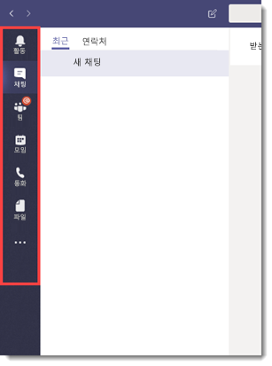
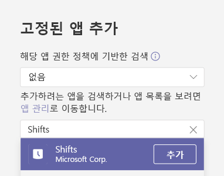
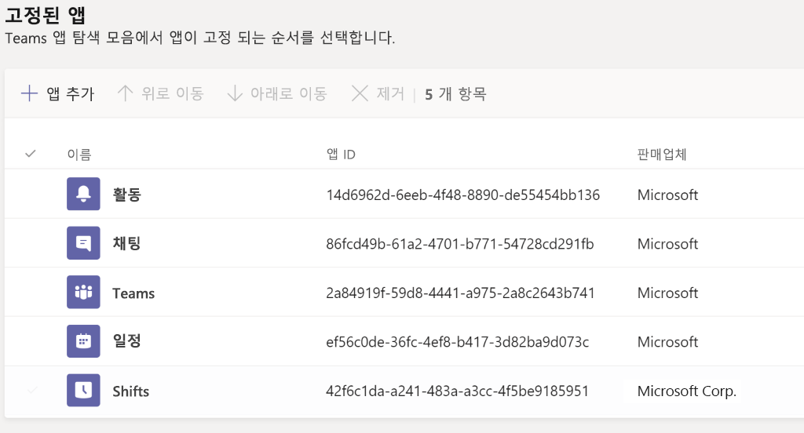
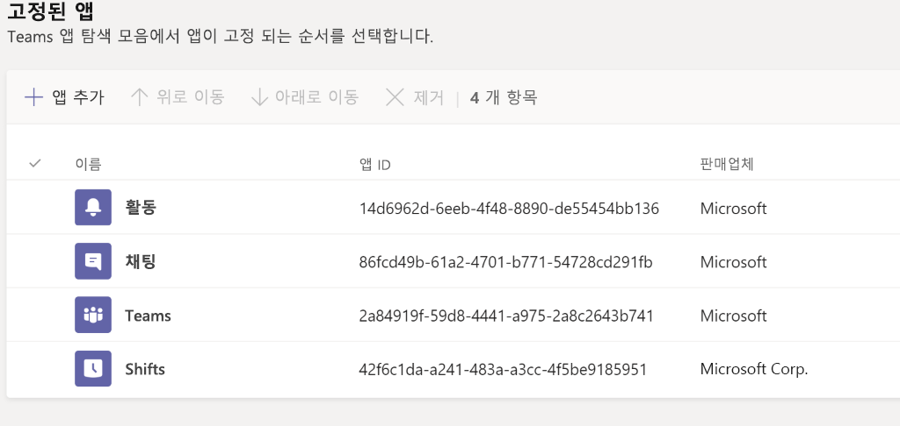
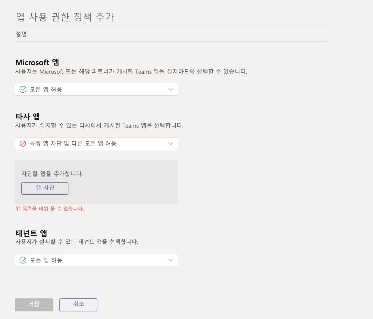

# <a name="how-to-provision-teams-at-scale-for-firstline-workers"></a><span data-ttu-id="3e540-103">일선 직원을 위한 대규모 Microsoft Teams 프로비저닝하는 방법</span><span class="sxs-lookup"><span data-stu-id="3e540-103">How to provision Teams at scale for Firstline Workers</span></span>

<span data-ttu-id="3e540-104">다수의 사용자를 Microsoft Teams에 빠르게 등록하고 이들을 위한 능률적인 환경을 구성해야 하나요?</span><span class="sxs-lookup"><span data-stu-id="3e540-104">Do you need to rapidly onboard a large number of users to Microsoft Teams and configure a streamlined experience for them?</span></span> <span data-ttu-id="3e540-105">다음 지침을 통해 ID를 빠르게 프로비저닝하고 팀을 프로비저닝하며 모든 관련 정책을 할당하여 최종 사용자 환경을 제어할 수 있습니다.</span><span class="sxs-lookup"><span data-stu-id="3e540-105">You can quickly provision identities, provision teams, and assign all relevant policies to control the end user experience by walking through the following instructions.</span></span>

<span data-ttu-id="3e540-106">여기에서는 다음과 같은 작업을 수행하는 방법을 보여드립니다.</span><span class="sxs-lookup"><span data-stu-id="3e540-106">In this walkthrough, you'll learn how to:</span></span>

- <span data-ttu-id="3e540-107">다수의 사용자를 만듭니다.</span><span class="sxs-lookup"><span data-stu-id="3e540-107">Create a large number of users.</span></span>
- <span data-ttu-id="3e540-108">다수의 팀을 만들고 적절한 채널을 설정합니다.</span><span class="sxs-lookup"><span data-stu-id="3e540-108">Create a large number of teams and set up the appropriate channels.</span></span>
- <span data-ttu-id="3e540-109">대규모로 라이선스를 할당합니다.</span><span class="sxs-lookup"><span data-stu-id="3e540-109">Assign licensing at scale.</span></span>
- <span data-ttu-id="3e540-110">적절한 Teams 메시징 정책, 앱 설정 정책 및 앱 권한 정책을 만듭니다.</span><span class="sxs-lookup"><span data-stu-id="3e540-110">Create appropriate Teams Messaging Policies, App Setup Policies, and App Permission Policies.</span></span>
- <span data-ttu-id="3e540-111">이러한 정책을 대규모 사용자에게 적용합니다.</span><span class="sxs-lookup"><span data-stu-id="3e540-111">Apply those policies to users at scale.</span></span>
- <span data-ttu-id="3e540-112">다수의 사용자를 지정된 팀에 할당합니다.</span><span class="sxs-lookup"><span data-stu-id="3e540-112">Assign a large number of users into a designated team.</span></span>

> [!NOTE]
> <span data-ttu-id="3e540-113">이 정보를 검토한 후에도 몇 가지 도움이 필요하거나 궁금한 사항이 있는 경우 [**여기를 클릭**](https://forms.office.com/Pages/ResponsePage.aspx?id=v4j5cvGGr0GRqy180BHbRyMDv-1voW9MqL7zkQ11DzBUREZaU1E0WEk5T0NYS0NDSkFMSDROUUdYMC4u)하여 고객 맞춤형 지원을 요청할 수 있습니다.</span><span class="sxs-lookup"><span data-stu-id="3e540-113">If you've reviewed this information and feel like you need some help or have some questions, you can [**click here**](https://forms.office.com/Pages/ResponsePage.aspx?id=v4j5cvGGr0GRqy180BHbRyMDv-1voW9MqL7zkQ11DzBUREZaU1E0WEk5T0NYS0NDSkFMSDROUUdYMC4u) to reach out for White Glove Support.</span></span>

## <a name="prerequisites"></a><span data-ttu-id="3e540-114">필수 구성 요소</span><span class="sxs-lookup"><span data-stu-id="3e540-114">Prerequisites</span></span>

<span data-ttu-id="3e540-115">[이 위치](https://github.com/MicrosoftDocs/OfficeDocs-SkypeForBusiness/blob/live/Teams/downloads/FLWTeamsScale.zip?raw=true)에서 자산을 다운로드합니다.</span><span class="sxs-lookup"><span data-stu-id="3e540-115">Download the assets from [this location](https://github.com/MicrosoftDocs/OfficeDocs-SkypeForBusiness/blob/live/Teams/downloads/FLWTeamsScale.zip?raw=true).</span></span>

> [!IMPORTANT]
> <span data-ttu-id="3e540-116">위에 제공된 링크의 스크립트는 Microsoft에서 제공한 그대로 제공되며 개별 요구에 맞게 수정해야 합니다.</span><span class="sxs-lookup"><span data-stu-id="3e540-116">The scripts in the link provided above are provided as-is by Microsoft, and must be modified for your individual needs.</span></span>

## <a name="technical-requirements"></a><span data-ttu-id="3e540-117">기술 요구 사항</span><span class="sxs-lookup"><span data-stu-id="3e540-117">Technical requirements</span></span>

- <span data-ttu-id="3e540-118">테넌트에는 Microsoft Teams를 포함하여 사용 가능한 적절한 수의 라이센스가 있어야 합니다.</span><span class="sxs-lookup"><span data-stu-id="3e540-118">Your tenant must have the appropriate number of licenses available that include Microsoft Teams.</span></span> <span data-ttu-id="3e540-119">아직 이러한 라이선스가 없는 경우 여기에 나와 있는 지침에 따라 [Office 365 E1 무료 평가판](e1-trial-license.md)을 활성화합니다.</span><span class="sxs-lookup"><span data-stu-id="3e540-119">If you do not already have these licenses, follow the instructions here to activate the [Office 365 E1 Free Trial](e1-trial-license.md).</span></span>
- <span data-ttu-id="3e540-120">이러한 단계를 수행하는 사용자는 Azure AD의 전역 관리자 또는 사용자 관리자의 역할로서 수행해야 합니다.</span><span class="sxs-lookup"><span data-stu-id="3e540-120">The user taking these steps must do so in the role of Global Admin or User Admin in Azure AD.</span></span>
- <span data-ttu-id="3e540-121">사용자는 로컬 컴퓨터에 소프트웨어를 설치하고 구성할 수 있는 권한이 있어야 합니다.</span><span class="sxs-lookup"><span data-stu-id="3e540-121">User must have the rights to install and configure software on their local machine.</span></span>

## <a name="step-by-step-process-overview"></a><span data-ttu-id="3e540-122">단계별 프로세스 개요</span><span class="sxs-lookup"><span data-stu-id="3e540-122">Step-by-step process overview</span></span>

1. <span data-ttu-id="3e540-123">**환경 설정**</span><span class="sxs-lookup"><span data-stu-id="3e540-123">**Setup Your Environment**</span></span>
    1. <span data-ttu-id="3e540-124">샘플 PowerShell 스크립트 및 문서가 포함된 ZIP 파일을 다운로드합니다.</span><span class="sxs-lookup"><span data-stu-id="3e540-124">Download the ZIP file containing the sample PowerShell scripts and documentation</span></span>
    1. <span data-ttu-id="3e540-125">자격 증명 설정</span><span class="sxs-lookup"><span data-stu-id="3e540-125">Setup credentials</span></span>
    1. <span data-ttu-id="3e540-126">로컬 환경 구성</span><span class="sxs-lookup"><span data-stu-id="3e540-126">Configure local environment</span></span>
    1. <span data-ttu-id="3e540-127">PowerShell 모듈 및 환경 변수 구성</span><span class="sxs-lookup"><span data-stu-id="3e540-127">Configure PowerShell Modules and Environmental Variables</span></span>
    1. <span data-ttu-id="3e540-128">앱 등록 만들기</span><span class="sxs-lookup"><span data-stu-id="3e540-128">Create App Registration</span></span>
1. <span data-ttu-id="3e540-129">**Teams 만들기 및 설정**</span><span class="sxs-lookup"><span data-stu-id="3e540-129">**Create and Setup Teams**</span></span>
    1. <span data-ttu-id="3e540-130">Teams 만들기</span><span class="sxs-lookup"><span data-stu-id="3e540-130">Create Teams</span></span>
    1. <span data-ttu-id="3e540-131">Teams를 위한 채널 만들기</span><span class="sxs-lookup"><span data-stu-id="3e540-131">Create Channels for Teams</span></span>
1. <span data-ttu-id="3e540-132">**Teams 정책 만들기**</span><span class="sxs-lookup"><span data-stu-id="3e540-132">**Create Teams Policies**</span></span>
    1. <span data-ttu-id="3e540-133">Teams 메시징 정책 만들기</span><span class="sxs-lookup"><span data-stu-id="3e540-133">Create Teams Messaging Policies</span></span>
    1. <span data-ttu-id="3e540-134">Teams 앱 설정 정책 만들기</span><span class="sxs-lookup"><span data-stu-id="3e540-134">Create Teams App Setup Policies</span></span>
    1. <span data-ttu-id="3e540-135">Teams 앱 권한 정책 만들기</span><span class="sxs-lookup"><span data-stu-id="3e540-135">Create Teams App Permission Policies</span></span>
1. <span data-ttu-id="3e540-136">**사용자 만들기 및 설정**</span><span class="sxs-lookup"><span data-stu-id="3e540-136">**Create and Setup Users**</span></span>
    1. <span data-ttu-id="3e540-137">사용자 및 보안 그룹 만들기</span><span class="sxs-lookup"><span data-stu-id="3e540-137">Create users and security groups</span></span>
    1. <span data-ttu-id="3e540-138">그룹 기반 라이선스를 사용하여 사용자에게 라이선스 할당</span><span class="sxs-lookup"><span data-stu-id="3e540-138">Assign licensing to users via group-based licensing</span></span>
1. <span data-ttu-id="3e540-139">**사용자 및 정책 할당**</span><span class="sxs-lookup"><span data-stu-id="3e540-139">**Assign Users and Policies**</span></span>
    1. <span data-ttu-id="3e540-140">Teams에 사용자 할당</span><span class="sxs-lookup"><span data-stu-id="3e540-140">Assign users to Teams</span></span>
    1. <span data-ttu-id="3e540-141">사용자와 그룹에 정책 할당</span><span class="sxs-lookup"><span data-stu-id="3e540-141">Assign policies to User and Groups</span></span>
1. <span data-ttu-id="3e540-142">**테스트 및 유효성 검사**</span><span class="sxs-lookup"><span data-stu-id="3e540-142">**Test and Validate**</span></span>
    1. <span data-ttu-id="3e540-143">오류 확인</span><span class="sxs-lookup"><span data-stu-id="3e540-143">Check for errors</span></span>
    1. <span data-ttu-id="3e540-144">테스트 사용자로 Teams에 로그인</span><span class="sxs-lookup"><span data-stu-id="3e540-144">Login to Teams with a test user</span></span>

## <a name="set-up-your-environment"></a><span data-ttu-id="3e540-145">환경 설정</span><span class="sxs-lookup"><span data-stu-id="3e540-145">Set up your environment</span></span>

<span data-ttu-id="3e540-146">다음 단계를 통해 환경을 설정할 수 있습니다.</span><span class="sxs-lookup"><span data-stu-id="3e540-146">The following steps will allow you to set up your environment:</span></span>

### <a name="download-zip-file-containing-sample-powershell-scripts"></a><span data-ttu-id="3e540-147">샘플 PowerShell 스크립트가 포함된 .zip 파일 다운로드</span><span class="sxs-lookup"><span data-stu-id="3e540-147">Download .zip file containing sample PowerShell scripts</span></span>

<span data-ttu-id="3e540-148">계속 진행하려면 [이 위치](https://github.com/MicrosoftDocs/OfficeDocs-SkypeForBusiness/blob/live/Teams/downloads/FLWTeamsScale.zip?raw=true)에서 스크립트를 다운로드해야 합니다.</span><span class="sxs-lookup"><span data-stu-id="3e540-148">Before you can proceed, you'll need to download the scripts at [this location](https://github.com/MicrosoftDocs/OfficeDocs-SkypeForBusiness/blob/live/Teams/downloads/FLWTeamsScale.zip?raw=true).</span></span>

### <a name="setup-credentials"></a><span data-ttu-id="3e540-149">자격 증명 설정</span><span class="sxs-lookup"><span data-stu-id="3e540-149">Setup Credentials</span></span>

<span data-ttu-id="3e540-150">이 문서와 샘플 스크립트에서는 작업을 더욱 쉽게 하기 위해 자격 증명이 포함된 참조 파일을 만들도록 선택했습니다.</span><span class="sxs-lookup"><span data-stu-id="3e540-150">In this document and the sample scripts we've chosen to create a reference file that contains your credentials in order to make things easier.</span></span> <span data-ttu-id="3e540-151">이 기술을 사용하면 로컬 저장소에서 자격 증명을 유지하면서 다양한 서비스 끝점을 모두 인증할 필요가 없습니다.</span><span class="sxs-lookup"><span data-stu-id="3e540-151">This technique removes the need for you to authenticate to all the various service endpoints while maintaining the credentials in a local store.</span></span> <span data-ttu-id="3e540-152">후속 스크립트를 실행하려면 사용자 및 환경에 고유한 자격 증명으로 해당 참조 파일을 업데이트해야 합니다.</span><span class="sxs-lookup"><span data-stu-id="3e540-152">In order to run the subsequent scripts, you'll need to update that reference file with the credentials that are unique to you and your environment.</span></span> <span data-ttu-id="3e540-153">각 후속 스크립트 내에서 **GetCreds**라는 도우미 함수를 사용하여 적절한 자격 증명을 읽고 해당 자격 증명을 사용하여 다양한 서비스에 연결합니다.</span><span class="sxs-lookup"><span data-stu-id="3e540-153">From within each subsequent script, the appropriate credentials are read with the helper function  we've called **GetCreds**, and those credentials are used to connect to the various services.</span></span>

<span data-ttu-id="3e540-154">여러 서비스에서 다양한 자격 증명을 필요로 하는 경우가 종종 있습니다.</span><span class="sxs-lookup"><span data-stu-id="3e540-154">It's not uncommon for different services to require different credentials.</span></span> <span data-ttu-id="3e540-155">예를 들어 MicrosoftTeams, AzureAD 및 MSonline에 대해 서로 다른 자격 증명이 있을 수 있습니다. 이 경우에는 각 자격 증명 파일을 고유한 의미 있는 이름으로 저장하는 SetCred를 실행할 수 있습니다.</span><span class="sxs-lookup"><span data-stu-id="3e540-155">For example you might have different credentials for MicrosoftTeams, AzureAD, and MSonline, in which case you can run SetCred saving each credential file with its own meaningful name.</span></span>

<span data-ttu-id="3e540-156">예: SetCreds msol-cred.xml SetCreds azuread-cred.xml SetCreds teams-cred.xml</span><span class="sxs-lookup"><span data-stu-id="3e540-156">Examples: SetCreds msol-cred.xml SetCreds azuread-cred.xml SetCreds teams-cred.xml</span></span>

> [!NOTE]
> <span data-ttu-id="3e540-157">자격 증명에 사용되는 계정에는 MFA가 필요하지 않습니다.</span><span class="sxs-lookup"><span data-stu-id="3e540-157">The account used for the credentials cannot require MFA.</span></span>

<span data-ttu-id="3e540-158">다음은 다양한 스크립트가 저장된 자격 증명을 사용하여 인증하는 방법에 대한 예입니다.</span><span class="sxs-lookup"><span data-stu-id="3e540-158">Here is an example of how the various scripts then use the saved credentials to authenticate:</span></span>

```azurepowershell
# Connect to MicrosoftTeams
$teams_cred = GetCreds teams-cred.xml
Connect-MicrosoftTeams -Credential $teams_cred
```

<span data-ttu-id="3e540-159">자격 증명을 설정하려면 다음을 완료합니다.</span><span class="sxs-lookup"><span data-stu-id="3e540-159">In order to set your credentials, complete the following:</span></span>

1. <span data-ttu-id="3e540-160">.zip 파일 자산에서 **SetCreds.ps1**을 찾습니다.</span><span class="sxs-lookup"><span data-stu-id="3e540-160">Find the **SetCreds.ps1** in the .zip file assets.</span></span>
1. <span data-ttu-id="3e540-161">PowerShell에서 **SetCreds.ps1** 스크립트를 실행하여 자격 증명을 저장합니다.</span><span class="sxs-lookup"><span data-stu-id="3e540-161">From PowerShell run the **SetCreds.ps1** script to save your credentials.</span></span>
    1. <span data-ttu-id="3e540-162">""Export-Clixml "작업 수행 중..." 메시지가 표시되고 승인하려면 'Y'를 입력합니다.</span><span class="sxs-lookup"><span data-stu-id="3e540-162">You'll be prompted with "Performing the operation "Export-Clixml"..." and you'll need to enter 'Y' to approve.</span></span>

### <a name="configure-the-local-environment"></a><span data-ttu-id="3e540-163">로컬 환경 구성</span><span class="sxs-lookup"><span data-stu-id="3e540-163">Configure the local environment</span></span>

1. <span data-ttu-id="3e540-164">.zip 파일 자산에서 **SetConfig.ps1**을 찾습니다.</span><span class="sxs-lookup"><span data-stu-id="3e540-164">Find the **SetConfig.ps1** in the .zip file assets.</span></span>
1. <span data-ttu-id="3e540-165">PowerShell에서 다음 명령을 실행하여 대괄호로 묶은 항목을 특정 정보로 바꿉니다.</span><span class="sxs-lookup"><span data-stu-id="3e540-165">From PowerShell run the following command, replacing the bracketed entries with your specific information.</span></span>
    1. <span data-ttu-id="3e540-166">**SetConfig.ps1** -tenantName [테넌트 이름] -rootPath "[git 리포지토리 루트의 전체 경로]"</span><span class="sxs-lookup"><span data-stu-id="3e540-166">**SetConfig.ps1** -tenantName [your tenant name] -rootPath "[full path to the root of the git repo]"</span></span>

<span data-ttu-id="3e540-167">예: `.\SetConfig.ps1 -tenantName contoso.onmicrosoft.com -rootPath "C:\data\source\FLWTeamsScale"`</span><span class="sxs-lookup"><span data-stu-id="3e540-167">For example: `.\SetConfig.ps1 -tenantName contoso.onmicrosoft.com -rootPath "C:\data\source\FLWTeamsScale"`</span></span>

### <a name="configure-powershell-modules-and-environmental-variables"></a><span data-ttu-id="3e540-168">PowerShell 모듈 및 환경 변수 구성</span><span class="sxs-lookup"><span data-stu-id="3e540-168">Configure PowerShell modules and environmental variables</span></span>

<span data-ttu-id="3e540-169">계속 진행하기 전에 Azure AD, MSAL, MSCloudUtils 및 MicrosoftTeams를 비롯한 여러 PowerShell 모듈을 설치하고 연결해야 합니다.</span><span class="sxs-lookup"><span data-stu-id="3e540-169">Before you go further, you'll need to install and connect to several PowerShell modules, including Azure AD, MSAL, MSCloudUtils, and MicrosoftTeams.</span></span>

1. <span data-ttu-id="3e540-170">.zip 파일 자산에서 **ConfigurePowerShellModules.ps1**을 찾습니다.</span><span class="sxs-lookup"><span data-stu-id="3e540-170">Find the **ConfigurePowerShellModules.ps1** in the .zip file assets.</span></span>
1. <span data-ttu-id="3e540-171">변수를 사용하여 다음과 같은 환경 변수를 편집하고 바꿀 수 있습니다.</span><span class="sxs-lookup"><span data-stu-id="3e540-171">Edit and replace the following environmental variables with your variables:</span></span>
1. <span data-ttu-id="3e540-172">PowerShell에서 **ConfigurePowerShellModules.ps1** 스크립트를 실행합니다.</span><span class="sxs-lookup"><span data-stu-id="3e540-172">From PowerShell, run the **ConfigurePowerShellModules.ps1** script.</span></span>

## <a name="create-and-set-up-teams"></a><span data-ttu-id="3e540-173">Teams 만들기 및 설정</span><span class="sxs-lookup"><span data-stu-id="3e540-173">Create and set up Teams</span></span>

<span data-ttu-id="3e540-174">일선 직원과 의사 소통하고 공동 작업하려면 먼저 일련의 Teams를 구성하고 해당 팀에 표준 채널을 추가해야 합니다.</span><span class="sxs-lookup"><span data-stu-id="3e540-174">In order to communicate and collaborate with your Firstline Workers, you will first need to establish a series of Teams and add standard Channels to those teams, which we'll walk through next.</span></span>

### <a name="create-teams"></a><span data-ttu-id="3e540-175">팀 만들기</span><span class="sxs-lookup"><span data-stu-id="3e540-175">Create teams</span></span>

<span data-ttu-id="3e540-176">Teams는 조직 내 사용자, 콘텐츠 및 도구의 모음입니다.</span><span class="sxs-lookup"><span data-stu-id="3e540-176">Teams are a collection of people, content, and tools within your organization.</span></span> <span data-ttu-id="3e540-177">대부분의 일선 직원 중심 조직의 경우 물리적 위치 주변에 팀을 배치하는 것이 가장 좋습니다.</span><span class="sxs-lookup"><span data-stu-id="3e540-177">For most Firstline Worker-centric organizations, it is best practice to anchor a Team around a physical location.</span></span> <span data-ttu-id="3e540-178">예를 들어 다음과 같은 팀이 있습니다.</span><span class="sxs-lookup"><span data-stu-id="3e540-178">For example, a Team for each of the following:</span></span>

- <span data-ttu-id="3e540-179">스토어</span><span class="sxs-lookup"><span data-stu-id="3e540-179">Store</span></span>
- <span data-ttu-id="3e540-180">유통 센터</span><span class="sxs-lookup"><span data-stu-id="3e540-180">Distribution Center</span></span>
- <span data-ttu-id="3e540-181">제조 공장</span><span class="sxs-lookup"><span data-stu-id="3e540-181">Manufacturing Plant</span></span>
- <span data-ttu-id="3e540-182">병원</span><span class="sxs-lookup"><span data-stu-id="3e540-182">Hospital</span></span>
- <span data-ttu-id="3e540-183">식료품점</span><span class="sxs-lookup"><span data-stu-id="3e540-183">Grocery Store</span></span>

<span data-ttu-id="3e540-184">*모범 사례 토론*: 팀을 설계할 때 [Teams 제한 사항과 사양](limits-specifications-teams.md)을 염두에 두고 있어야 합니다.</span><span class="sxs-lookup"><span data-stu-id="3e540-184">*Best Practice Discussion*: When designing your teams, it's important to keep in mind [Teams limits and specifications](limits-specifications-teams.md).</span></span> <span data-ttu-id="3e540-185">소규모 조직의 경우 조직 전체 팀을 사용하여 커뮤니케이션을 간소화하고 물리적 위치 구조를 보완할 수 있습니다.</span><span class="sxs-lookup"><span data-stu-id="3e540-185">For smaller organizations, an org-wide team can be used to streamline communication and complement a physical location structure.</span></span> <span data-ttu-id="3e540-186">기타 조직의 경우 구조화된 물리적 위치의 팀 이름 지정 규칙을 통한 기업 간 커뮤니케이션으로 여러 팀에 걸쳐 동시에 쉽게 교차 게시할 수 있습니다.</span><span class="sxs-lookup"><span data-stu-id="3e540-186">For others, a structured physical location Team naming convention helps assist Corporate Communications with Cross Posting to multiple teams simultaneously with ease.</span></span> <span data-ttu-id="3e540-187">예를 들어, 이름에 미국이 들어가는 모든 팀을 검색하여 모든 미국 위치를 타겟으로 교차 게시할 수 있습니다.</span><span class="sxs-lookup"><span data-stu-id="3e540-187">For example, you can search and cross-post to all Teams with US in the name to target all US locations.</span></span> <span data-ttu-id="3e540-188">교차 게시에 대한 자세한 내용은 [여기](https://support.office.com/article/cross-post-a-channel-conversation-in-teams-9c1252a3-67ef-498e-a7c1-dd7147b3d295)를 참조하세요.</span><span class="sxs-lookup"><span data-stu-id="3e540-188">More information on cross-posting can be found [here](https://support.office.com/article/cross-post-a-channel-conversation-in-teams-9c1252a3-67ef-498e-a7c1-dd7147b3d295).</span></span>

#### <a name="steps-to-create-teams"></a><span data-ttu-id="3e540-189">팀을 만드는 단계</span><span class="sxs-lookup"><span data-stu-id="3e540-189">Steps to create teams</span></span>

1. <span data-ttu-id="3e540-190">자산에서 **Teams Information.csv** 파일을 찾습니다.</span><span class="sxs-lookup"><span data-stu-id="3e540-190">Find the **Teams Information.csv** file in the assets.</span></span>
1. <span data-ttu-id="3e540-191">**Teams Information.csv** 파일의 정보를 조직의 특정 정보로 업데이트합니다.</span><span class="sxs-lookup"><span data-stu-id="3e540-191">Update the information in the **Teams Information.csv** file with your organization's specific information.</span></span> <span data-ttu-id="3e540-192">위의 모범 사례에 유의하세요.</span><span class="sxs-lookup"><span data-stu-id="3e540-192">Keep in mind our best practices above.</span></span>
1. <span data-ttu-id="3e540-193">**CreateTeams.ps1** 스크립트를 찾습니다.</span><span class="sxs-lookup"><span data-stu-id="3e540-193">Find the **CreateTeams.ps1** script.</span></span>
1. <span data-ttu-id="3e540-194">PowerShell에서 **CreateTeams.ps1** 스크립트를 실행합니다.</span><span class="sxs-lookup"><span data-stu-id="3e540-194">From PowerShell, run the **CreateTeams.ps1** script.</span></span>

### <a name="create-channels-for-teams"></a><span data-ttu-id="3e540-195">Teams를 위한 채널 만들기</span><span class="sxs-lookup"><span data-stu-id="3e540-195">Create channels for teams</span></span>

<span data-ttu-id="3e540-196">채널은 특정 항목, 프로젝트 또는 분야 등을 기준으로 하여 대화를 정리하는 팀의 전용 섹션입니다.</span><span class="sxs-lookup"><span data-stu-id="3e540-196">Channels are dedicated sections within a team to keep conversations organized by specific topic, project, discipline, and more.</span></span> <span data-ttu-id="3e540-197">모든 팀에서 자동으로 일반 채널을 사용할 수 있지만 비즈니스 요구에 따라 구조를 사용자 지정할 수 있습니다.</span><span class="sxs-lookup"><span data-stu-id="3e540-197">Every Team automatically gets a General channel, but from there you can customize your structure according to the needs of your business.</span></span> <span data-ttu-id="3e540-198">예를 들어, 추가 채널 구조에는 다음이 포함될 수 있습니다.</span><span class="sxs-lookup"><span data-stu-id="3e540-198">For example, your additional channel structure could include:</span></span>

- <span data-ttu-id="3e540-199">**제조** - 안전, 라인 1, 라인 2, 기업 커뮤니케이션, 교육</span><span class="sxs-lookup"><span data-stu-id="3e540-199">**Manufacturing** - Safety, Line 1, Line 2, Corporate Communications, Training</span></span>
- <span data-ttu-id="3e540-200">**식료품** - 빵집, 농산물, 육류, 기업 커뮤니케이션, 교육</span><span class="sxs-lookup"><span data-stu-id="3e540-200">**Grocery** - Bakery, Produce, Meat, Corporate Communications, Training</span></span>
- <span data-ttu-id="3e540-201">**의료** - 간호사, 의사, 중환자실 1, 중환자실 2</span><span class="sxs-lookup"><span data-stu-id="3e540-201">**Healthcare** - Nurses, Doctors, Critical Care Unit 1, Critical Care Unit 2</span></span>
- <span data-ttu-id="3e540-202">**호텔관광업** - 프론트 데스크, 유지 보수, 객실 관리, 대리 주차 및 수하물 서비스, 기업 커뮤니케이션, 교육</span><span class="sxs-lookup"><span data-stu-id="3e540-202">**Hospitality** - Front Desk, Maintenance, Housekeeping, Valet and Baggage, Corporate Communications, Training</span></span>
- <span data-ttu-id="3e540-203">**소매** - 스토어 정면, 스토어 뒷면, 기업 커뮤니케이션, 교육</span><span class="sxs-lookup"><span data-stu-id="3e540-203">**Retail** - Front of Store, Back of Store, Corporate Communications, Training</span></span>

> [!NOTE]
> <span data-ttu-id="3e540-204">채널을 보안 경계로 생각할 필요는 없습니다.</span><span class="sxs-lookup"><span data-stu-id="3e540-204">Channels should not be thought of as a security boundary.</span></span> <span data-ttu-id="3e540-205">공동 작업을 위해 직원들을 구성하는 방법입니다.</span><span class="sxs-lookup"><span data-stu-id="3e540-205">They are a means of organizing your workers for the purposes of collaboration.</span></span>

<span data-ttu-id="3e540-206">*모범 사례 토론*: 채널 구조를 설계할 때 특히 다수의 사용자를 등록하는 경우 모든 것을 단순하게 유지하는 것이 중요합니다.</span><span class="sxs-lookup"><span data-stu-id="3e540-206">*Best Practice Discussion*: When designing your channel structure, it's important to keep things simple, especially when you're looking to onboard a lot of users.</span></span> <span data-ttu-id="3e540-207">교육에 대한 필요성을 최소화하기 위해 모든 상황, 역할 또는 항목에 대한 채널을 만들고 싶은 충동을 자제하세요.</span><span class="sxs-lookup"><span data-stu-id="3e540-207">Resist the urge to create channels for every situation, role, or topic in order to minimize the need for training.</span></span> <span data-ttu-id="3e540-208">최대 3~5개의 채널을 선택하여 시작하세요.</span><span class="sxs-lookup"><span data-stu-id="3e540-208">Pick 3-5 channels at most to get started.</span></span> <span data-ttu-id="3e540-209">필요에 따라 추가 채널을 쉽게 만들 수 있습니다.</span><span class="sxs-lookup"><span data-stu-id="3e540-209">Additional channels can easily be created as the need arises.</span></span> <span data-ttu-id="3e540-210">사실 지금은 일반 채널만을 사용하는 것도 좋습니다.</span><span class="sxs-lookup"><span data-stu-id="3e540-210">In fact, it's okay to just use the General channel alone for now!</span></span>

#### <a name="steps-to-create-channels-for-teams"></a><span data-ttu-id="3e540-211">Teams를 위한 채널을 만드는 단계</span><span class="sxs-lookup"><span data-stu-id="3e540-211">Steps to Create Channels for Teams</span></span>

1. <span data-ttu-id="3e540-212">.zip 파일 자산에서 **TeamsChannels.csv** 파일을 찾습니다.</span><span class="sxs-lookup"><span data-stu-id="3e540-212">Find the **TeamsChannels.csv** file in the .zip file assets.</span></span>
1. <span data-ttu-id="3e540-213">조직의 특정 정보로 **TeamsChannels.csv** 파일을 업데이트합니다.</span><span class="sxs-lookup"><span data-stu-id="3e540-213">Update the **TeamsChannels.csv** file with your organization's specific information.</span></span> <span data-ttu-id="3e540-214">위의 모범 사례에 유의하세요.</span><span class="sxs-lookup"><span data-stu-id="3e540-214">Keep in mind our best practices above.</span></span>
1. <span data-ttu-id="3e540-215">.zip 파일 자산에서 **CreateTeamsChannels.ps1** 스크립트를 찾습니다.</span><span class="sxs-lookup"><span data-stu-id="3e540-215">Find the **CreateTeamsChannels.ps1** script in the .zip file assets.</span></span>
1. <span data-ttu-id="3e540-216">PowerShell에서 **TeamsChannels.ps1** 스크립트를 실행합니다.</span><span class="sxs-lookup"><span data-stu-id="3e540-216">From PowerShell, run the **TeamsChannels.ps1** script.</span></span>

## <a name="create-teams-policies"></a><span data-ttu-id="3e540-217">Teams 정책 만들기</span><span class="sxs-lookup"><span data-stu-id="3e540-217">Create Teams policies</span></span>

<span data-ttu-id="3e540-218">관리자는 Microsoft Teams의 팀 정책을 사용하여 조직의 사용자가 확인하고 수행할 수 있는 것을 제어할 수 있습니다.</span><span class="sxs-lookup"><span data-stu-id="3e540-218">As an admin, you can use teams policies in Microsoft Teams to control what users in your organization see and can.</span></span> <span data-ttu-id="3e540-219">예를 들어, 다수의 사용자를 등록할 때 최종 사용자 경험을 단순화하기 위해 데스크톱 또는 웹 브라우저의 왼쪽 레일에 고정할 응용 프로그램 또는 모바일 장치의 하단 표시줄을 제어할 수 있습니다.</span><span class="sxs-lookup"><span data-stu-id="3e540-219">For example, you can control which applications are pinned to the left rail on your Desktop or Web browser, or the bottom bar on mobile devices, in order to simplify the end user experience when onboarding a large amount of users.</span></span> <span data-ttu-id="3e540-220">이러한 정책의 일부는 PowerShell을 사용하여 만들 수 있으며, 일부는 Teams 관리 콘솔에서 수동으로 만들어야 합니다.</span><span class="sxs-lookup"><span data-stu-id="3e540-220">Some of these policies can be created with PowerShell, and others have to be manually created in the Teams Admin Console.</span></span>

<span data-ttu-id="3e540-221">*모범 사례 토론*: 다음 각 정책에 대해 실제로 일선 직원과 일선 관리자에 대한 두 가지 정책을 작성하기로 합니다.</span><span class="sxs-lookup"><span data-stu-id="3e540-221">*Best Practice Discussion*: For each of the following policies, we're choosing to actually create two policies: one for Firstline Workers and one for Firstline Managers.</span></span> <span data-ttu-id="3e540-222">원하는 만큼 많이 또는 적게 만들 수 있습니다.</span><span class="sxs-lookup"><span data-stu-id="3e540-222">You can choose to create as many or as few as you like.</span></span> <span data-ttu-id="3e540-223">대부분의 고객은 처음에 각 그룹에 동일한 설정을 지정하더라도 두 그룹으로 시작하는 것이 좋습니다.</span><span class="sxs-lookup"><span data-stu-id="3e540-223">For most customers, two is a good place to start, even if you give the same settings to each group initially.</span></span> <span data-ttu-id="3e540-224">Teams에 대한 경험이 커짐에 따라 경험을 더욱 차별화할 수 있고, 두 개의 별도 정책을 이미 만들어 둔 것이 이 작업을 더 간단하게 만들 수 있습니다.</span><span class="sxs-lookup"><span data-stu-id="3e540-224">As your experience with Teams grows, you may choose to differentiate their experience further and having the two separate policies already created can make that simpler.</span></span>

### <a name="create-teams-message-policies"></a><span data-ttu-id="3e540-225">Teams 메시지 정책 만들기</span><span class="sxs-lookup"><span data-stu-id="3e540-225">Create Teams message policies</span></span>

<span data-ttu-id="3e540-226">메시징 정책은 Microsoft Teams에서 사용자에게 제공되는 채팅 및 채널 메시징 기능을 제어하기 위해 사용됩니다.</span><span class="sxs-lookup"><span data-stu-id="3e540-226">Messaging policies are used to control which chat and channel messaging features are available to users in Microsoft Teams.</span></span>

<span data-ttu-id="3e540-227">*모범 사례 토론*: 자동으로 생성된 기본 전역 정책을 사용할 수 있지만, 아래 단계에 따라 사용자 지정 정책을 생성하여 일선 관리자와 직원에게 보다 폐쇄적이고 단순하며 차별화된 경험을 제공합니다.</span><span class="sxs-lookup"><span data-stu-id="3e540-227">*Best Practice Discussion*: While you can use the default Global policy that is created automatically, we have opted to create a custom policy using the steps below to provide a more locked down, simple, and differentiated experience for Firstline Managers and Firstline Workers.</span></span>

#### <a name="steps-to-create-teams-message-policies"></a><span data-ttu-id="3e540-228">Teams 메시지 정책을 만드는 단계</span><span class="sxs-lookup"><span data-stu-id="3e540-228">Steps to Create Teams Message Policies</span></span>

1. <span data-ttu-id="3e540-229">.zip 파일 자산에서 **TeamsMessagingPolicies.csv** 파일을 찾습니다.</span><span class="sxs-lookup"><span data-stu-id="3e540-229">Find the **TeamsMessagingPolicies.csv** file in the .zip file assets.</span></span>
1. <span data-ttu-id="3e540-230">조직의 특정 정보로 **TeamsMessagingPolicies.csv** 파일을 업데이트합니다.</span><span class="sxs-lookup"><span data-stu-id="3e540-230">Update the **TeamsMessagingPolicies.csv** file with your organization's specific information.</span></span> <span data-ttu-id="3e540-231">몇 가지 다양한 옵션에 대한 추가 정보는 [여기](https://docs.microsoft.com/microsoftteams/messaging-policies-in-teams#messaging-policy-settings)에서 찾을 수 있습니다.</span><span class="sxs-lookup"><span data-stu-id="3e540-231">Additional information on some of the various options can be found [here](https://docs.microsoft.com/microsoftteams/messaging-policies-in-teams#messaging-policy-settings).</span></span>
1. <span data-ttu-id="3e540-232">자산에서 **CreateTeamsMessagePolicies.ps1** 스크립트를 찾습니다.</span><span class="sxs-lookup"><span data-stu-id="3e540-232">Find the **CreateTeamsMessagePolicies.ps1** script in the assets.</span></span>
1. <span data-ttu-id="3e540-233">PowerShell에서 **TeamsMessagePolicies.ps1** 스크립트를 실행합니다.</span><span class="sxs-lookup"><span data-stu-id="3e540-233">From PowerShell, run the **TeamsMessagePolicies.ps1** script.</span></span>

### <a name="create-teams-app-setup-policies"></a><span data-ttu-id="3e540-234">Teams 앱 설정 정책 만들기</span><span class="sxs-lookup"><span data-stu-id="3e540-234">Create Teams app setup policies</span></span>

<span data-ttu-id="3e540-235">관리자는 앱 설정 정책을 사용하여 다음을 수행할 수 있습니다.</span><span class="sxs-lookup"><span data-stu-id="3e540-235">As an admin, you can use app setup policies to do the following:</span></span>

- <span data-ttu-id="3e540-236">팀을 사용자 지정하여 사용자에게 가장 중요한 앱을 강조 표시합니다.</span><span class="sxs-lookup"><span data-stu-id="3e540-236">Customize Teams to highlight the apps that are most important for your users.</span></span> <span data-ttu-id="3e540-237">고정할 앱을 선택하고 표시되는 순서를 설정합니다.</span><span class="sxs-lookup"><span data-stu-id="3e540-237">You choose the apps to pin and set the order in which they appear.</span></span> <span data-ttu-id="3e540-238">앱 고정을 사용하면 조직의 개발자나 타사에서 빌드한 앱을 비롯하여 조직의 사용자에게 필요한 앱을 표시할 수 있습니다.</span><span class="sxs-lookup"><span data-stu-id="3e540-238">Pinning apps lets you showcase apps that users in your organization need, including those built by third parties or by developers in your organization.</span></span>
- <span data-ttu-id="3e540-239">사용자가 앱을 Teams에 고정할 수 있는지 여부를 제어합니다.</span><span class="sxs-lookup"><span data-stu-id="3e540-239">Control whether users can pin apps to Teams.</span></span>

<span data-ttu-id="3e540-240">앱은 앱 표시줄에 고정됩니다.</span><span class="sxs-lookup"><span data-stu-id="3e540-240">Apps are pinned to the app bar.</span></span> <span data-ttu-id="3e540-241">앱 표시줄 Teams 데스크톱 클라이언트의 측면과 Teams 모바일 클라이언트(iOS 및 Android)의 하단에 있는 표시줄입니다.</span><span class="sxs-lookup"><span data-stu-id="3e540-241">This is the bar on the side of the Teams desktop client and at the bottom of the Teams mobile clients (iOS and Android).</span></span>

|<span data-ttu-id="3e540-242">Teams 데스크톱 클라이언트</span><span class="sxs-lookup"><span data-stu-id="3e540-242">Teams Desktop Client</span></span>  |         |<span data-ttu-id="3e540-243">Teams 모바일 클라이언트</span><span class="sxs-lookup"><span data-stu-id="3e540-243">Teams Mobile Client</span></span>  |
|---------|---------|---------|
|         |         | |

<span data-ttu-id="3e540-246">*모범 사례 토론*: Microsoft Teams 관리 센터에서 앱 설정 정책을 관리합니다.</span><span class="sxs-lookup"><span data-stu-id="3e540-246">*Best Practice Discussion*: You manage app setup policies in the Microsoft Teams admin center.</span></span> <span data-ttu-id="3e540-247">PowerShell을 사용하여 만들 수 없습니다.</span><span class="sxs-lookup"><span data-stu-id="3e540-247">They aren't able to be created with PowerShell.</span></span> <span data-ttu-id="3e540-248">전역(조직 전체 기본값) 정책을 사용하거나 사용자 지정 정책을 만들어 사용자에게 할당할 수 있습니다.</span><span class="sxs-lookup"><span data-stu-id="3e540-248">You can use the global (Org-wide default) policy or create custom policies and assign them to users.</span></span> <span data-ttu-id="3e540-249">사용자 지정 정책을 만들고 할당하지 않으면 조직의 사용자에게 전역 정책이 자동으로 할당됩니다.</span><span class="sxs-lookup"><span data-stu-id="3e540-249">Users in your organization will automatically be assigned to the global policy unless you create and assign a custom policy.</span></span> <span data-ttu-id="3e540-250">우리의 목적에 맞게 다수의 사용자를 동시에 등록할 수 있도록 보다 단순하고 능률적인 환경을 제공하기 위해 일선 직원과 관리자에 대해 두 가지 새로운 정책을 만듭니다.</span><span class="sxs-lookup"><span data-stu-id="3e540-250">For our purposes, we are creating two new policies for Firstline Workers and Firstline Managers, in order to provide them a simpler and more streamlined experience to ease onboarding a large number of users simultaneously.</span></span> <span data-ttu-id="3e540-251">비즈니스 요구에 따라 환경을 사용자 지정할 수 있습니다.</span><span class="sxs-lookup"><span data-stu-id="3e540-251">You can choose to customize the experience as your business needs.</span></span>

#### <a name="create-the-firstline-manager-app-setup-policy"></a><span data-ttu-id="3e540-252">일선 관리자 앱 설정 정책 만들기</span><span class="sxs-lookup"><span data-stu-id="3e540-252">Create the Firstline Manager app setup policy</span></span>

<span data-ttu-id="3e540-253">비즈니스 요구에 맞게 다음 설정을 사용자 지정할 수 있습니다.</span><span class="sxs-lookup"><span data-stu-id="3e540-253">The following settings can be customized to meet your business needs.</span></span> <span data-ttu-id="3e540-254">모범 사례를 기반으로 새로운 사용자를 대규모로 쉽게 등록할 수 있도록 하기 위해 권장 옵션을 선택했습니다.</span><span class="sxs-lookup"><span data-stu-id="3e540-254">We have chosen some recommended options based on best practices and to improve the ease of onboarding new users at scale.</span></span> <span data-ttu-id="3e540-255">자세한 내용은 [여기](https://docs.microsoft.com/MicrosoftTeams/teams-app-setup-policies#create-a-custom-app-setup-policy)를 클릭하세요.</span><span class="sxs-lookup"><span data-stu-id="3e540-255">For more information, click [here](https://docs.microsoft.com/MicrosoftTeams/teams-app-setup-policies#create-a-custom-app-setup-policy).</span></span>

1. <span data-ttu-id="3e540-256">Microsoft Teams 관리 센터의 왼쪽 탐색 창에서  **Teams 앱** > **정책 설정**으로 이동합니다.</span><span class="sxs-lookup"><span data-stu-id="3e540-256">In the left navigation of the Microsoft Teams admin center, go to **Teams apps** > **Setup policies**.</span></span>
2. <span data-ttu-id="3e540-257"> *\*추가*\*를 클릭합니다.</span><span class="sxs-lookup"><span data-stu-id="3e540-257">Click **Add**.</span></span>  
3. <span data-ttu-id="3e540-258">정책의 이름과 설명을 입력합니다.</span><span class="sxs-lookup"><span data-stu-id="3e540-258">Enter a name and description for the policy.</span></span> <span data-ttu-id="3e540-259">예: **일선 관리자 앱 설정 정책**</span><span class="sxs-lookup"><span data-stu-id="3e540-259">As an example: **Firstline Manager App Setup Policy**.</span></span>
<span data-ttu-id="3e540-260"></span><span class="sxs-lookup"><span data-stu-id="3e540-260"></span></span>

4. <span data-ttu-id="3e540-261">**사용자 지정 앱 업로드**를 해제합니다.</span><span class="sxs-lookup"><span data-stu-id="3e540-261">Turn off **Upload custom apps**.</span></span>
5. <span data-ttu-id="3e540-262">**사용자 고정 허용**을 해제합니다.</span><span class="sxs-lookup"><span data-stu-id="3e540-262">Turn off **Allow user pinning**.</span></span>
<span data-ttu-id="3e540-263"></span><span class="sxs-lookup"><span data-stu-id="3e540-263"></span></span>

6. <span data-ttu-id="3e540-264">아직 목록에 없는 경우 **Shifts** 앱을 추가합니다.</span><span class="sxs-lookup"><span data-stu-id="3e540-264">If it's not already listed, add the **Shifts** app.</span></span> <span data-ttu-id="3e540-265">**Shifts**에 대한 자세한 내용을 보려면 [여기](expand-teams-across-your-org/shifts/manage-the-shifts-app-for-your-organization-in-teams.md)를 클릭합니다.</span><span class="sxs-lookup"><span data-stu-id="3e540-265">For more information about **Shifts**, click [here](expand-teams-across-your-org/shifts/manage-the-shifts-app-for-your-organization-in-teams.md).</span></span>
<span data-ttu-id="3e540-266"></span><span class="sxs-lookup"><span data-stu-id="3e540-266"></span></span>

7. <span data-ttu-id="3e540-267">통화가 표시되는 경우 제거합니다.</span><span class="sxs-lookup"><span data-stu-id="3e540-267">Remove Calling, if it appears.</span></span> <span data-ttu-id="3e540-268">참고: 이 기능을 제거해도 사용자에게는 기능이 비활성화되지 않지만 최종 사용자 경험을 단순화하기 위해 앱 표시줄에 기능이 나타나지 않습니다.</span><span class="sxs-lookup"><span data-stu-id="3e540-268">Note: removing this feature will not disable it for the user, but will prevent it from appearing on the app bar to simplify the end user experience.</span></span>
8. <span data-ttu-id="3e540-269">다음 순서대로 앱을 정렬하여 Teams 앱 표시줄에서 순서를 지정한 다음  **저장**을 클릭합니다.</span><span class="sxs-lookup"><span data-stu-id="3e540-269">Arrange the apps in the following order to dictate their order in the Teams App Bar, and then click **Save**.</span></span>
    1. <span data-ttu-id="3e540-270">활동</span><span class="sxs-lookup"><span data-stu-id="3e540-270">Activity</span></span>
    1. <span data-ttu-id="3e540-271">채팅</span><span class="sxs-lookup"><span data-stu-id="3e540-271">Chat</span></span>
    1. <span data-ttu-id="3e540-272">Teams</span><span class="sxs-lookup"><span data-stu-id="3e540-272">Teams</span></span>
    1. <span data-ttu-id="3e540-273">일정</span><span class="sxs-lookup"><span data-stu-id="3e540-273">Calendar</span></span>
    1. <span data-ttu-id="3e540-274">Shifts </span><span class="sxs-lookup"><span data-stu-id="3e540-274">Shifts </span></span>

#### <a name="create-the-firstline-worker-app-setup-policy"></a><span data-ttu-id="3e540-275">일선 직원 앱 설정 정책 만들기</span><span class="sxs-lookup"><span data-stu-id="3e540-275">Create the Firstline Worker app setup policy</span></span>

<span data-ttu-id="3e540-276">비즈니스 요구에 맞게 다음 설정을 사용자 지정할 수 있습니다.</span><span class="sxs-lookup"><span data-stu-id="3e540-276">The following settings can be customized to meet your business needs.</span></span> <span data-ttu-id="3e540-277">모범 사례를 기반으로 새로운 사용자를 대규모로 쉽게 등록할 수 있도록 하기 위해 권장 옵션을 선택했습니다.</span><span class="sxs-lookup"><span data-stu-id="3e540-277">We have chosen some recommended options based on best practices and to improve the ease of onboarding new users at scale.</span></span> <span data-ttu-id="3e540-278">자세한 내용은 [여기](https://docs.microsoft.com/MicrosoftTeams/teams-app-setup-policies#create-a-custom-app-setup-policy)를 클릭하세요.</span><span class="sxs-lookup"><span data-stu-id="3e540-278">For more information, click [here](https://docs.microsoft.com/MicrosoftTeams/teams-app-setup-policies#create-a-custom-app-setup-policy).</span></span>

1. <span data-ttu-id="3e540-279">Microsoft Teams 관리 센터의 왼쪽 탐색 창에서  **Teams 앱** > **정책 설정**으로 이동합니다.</span><span class="sxs-lookup"><span data-stu-id="3e540-279">In the left navigation of the Microsoft Teams admin center, go to **Teams apps** > **Setup policies**.</span></span>
2. <span data-ttu-id="3e540-280"> *\*추가*\*를 클릭합니다.</span><span class="sxs-lookup"><span data-stu-id="3e540-280">Click **Add**.</span></span>
3. <span data-ttu-id="3e540-281">정책의 이름과 설명을 입력합니다.</span><span class="sxs-lookup"><span data-stu-id="3e540-281">Enter a name and description for the policy.</span></span> <span data-ttu-id="3e540-282">예: **일선 직원 앱 설정 정책**</span><span class="sxs-lookup"><span data-stu-id="3e540-282">As an example: **Firstline Worker App Setup Policy**.</span></span>
<span data-ttu-id="3e540-283"></span><span class="sxs-lookup"><span data-stu-id="3e540-283"></span></span>

4. <span data-ttu-id="3e540-284">**사용자 지정 앱 업로드**를 해제합니다.</span><span class="sxs-lookup"><span data-stu-id="3e540-284">Turn off **Upload custom apps**.</span></span>
5. <span data-ttu-id="3e540-285">**사용자 고정 허용**을 해제합니다.</span><span class="sxs-lookup"><span data-stu-id="3e540-285">Turn off **Allow user pinning**.</span></span>
<span data-ttu-id="3e540-286"></span><span class="sxs-lookup"><span data-stu-id="3e540-286"></span></span>

6. <span data-ttu-id="3e540-287">아직 목록에 없는 경우 **Shifts** 앱을 추가합니다.</span><span class="sxs-lookup"><span data-stu-id="3e540-287">If it's not already listed, add the **Shifts** app.</span></span> <span data-ttu-id="3e540-288">**Shifts**에 대한 자세한 내용을 보려면 여기를 클릭합니다.</span><span class="sxs-lookup"><span data-stu-id="3e540-288">For more information about **Shifts**, click here.</span></span>
<span data-ttu-id="3e540-289"></span><span class="sxs-lookup"><span data-stu-id="3e540-289"></span></span>

7. <span data-ttu-id="3e540-290">모임 및 통화가 표시되는 경우 제거합니다.</span><span class="sxs-lookup"><span data-stu-id="3e540-290">Remove Meetings and Calling, if they appear.</span></span> <span data-ttu-id="3e540-291">참고: 이 기능을 제거해도 사용자에게는 기능이 비활성화되지 않지만 최종 사용자 경험을 단순화하기 위해 앱 표시줄에 기능이 나타나지 않습니다.</span><span class="sxs-lookup"><span data-stu-id="3e540-291">Note: removing these features will not disable them for the user, but will prevent them from appearing on the app bar to simplify the end user experience.</span></span>
8. <span data-ttu-id="3e540-292">다음 순서대로 앱을 정렬하여 Teams 앱 표시줄에서 순서를 지정한 다음  **저장**을 클릭합니다.</span><span class="sxs-lookup"><span data-stu-id="3e540-292">Arrange the apps in the following order to dictate their order in the Teams App Bar, and then click **Save**.</span></span>
    1. <span data-ttu-id="3e540-293">활동</span><span class="sxs-lookup"><span data-stu-id="3e540-293">Activity</span></span>
    1. <span data-ttu-id="3e540-294">채팅</span><span class="sxs-lookup"><span data-stu-id="3e540-294">Chat</span></span>
    1. <span data-ttu-id="3e540-295">Teams</span><span class="sxs-lookup"><span data-stu-id="3e540-295">Teams</span></span>
    1. <span data-ttu-id="3e540-296">Shifts </span><span class="sxs-lookup"><span data-stu-id="3e540-296">Shifts </span></span>

### <a name="create-app-permission-policies"></a><span data-ttu-id="3e540-297">앱 사용 권한 정책 만들기</span><span class="sxs-lookup"><span data-stu-id="3e540-297">Create app permission policies</span></span>

<span data-ttu-id="3e540-298">관리자는 앱 권한 정책을 사용하여 조직의 Microsoft Teams 사용자가 사용할 수있는 앱을 제어할 수 있습니다.</span><span class="sxs-lookup"><span data-stu-id="3e540-298">As an admin, you can use app permission policies to control what apps are available to Microsoft Teams users in your organization.</span></span> <span data-ttu-id="3e540-299">모든 앱 또는 Microsoft, 타사 및 조직에서 게시한 특정 앱을 허용하거나 차단할 수 있습니다.</span><span class="sxs-lookup"><span data-stu-id="3e540-299">You can allow or block all apps, or specific apps published by Microsoft, third-parties, and your organization.</span></span> <span data-ttu-id="3e540-300">앱을 차단하면 정책이 있는 사용자는 Teams 앱 스토어에서 goekd 앱을 설치할 수 없습니다.</span><span class="sxs-lookup"><span data-stu-id="3e540-300">When you block an app, users who have the policy are unable to install it from the Teams app store.</span></span> <span data-ttu-id="3e540-301">이러한 정책을 관리하려면 전역 관리자 또는 Teams 서비스 관리자여야 합니다.</span><span class="sxs-lookup"><span data-stu-id="3e540-301">You must be a global admin or Teams service admin to manage these policies.</span></span>

<span data-ttu-id="3e540-302">*모범 사례 토론*: Microsoft Teams 관리 센터에서 앱 설정 정책을 관리합니다.</span><span class="sxs-lookup"><span data-stu-id="3e540-302">*Best Practice Discussion*: You manage app setup policies in the Microsoft Teams admin center.</span></span> <span data-ttu-id="3e540-303">PowerShell을 사용하여 만들 수 없습니다.</span><span class="sxs-lookup"><span data-stu-id="3e540-303">They aren't able to be created with PowerShell.</span></span> <span data-ttu-id="3e540-304">전역(조직 전체 기본값) 정책을 사용하거나 사용자 지정 정책을 만들어 사용자에게 할당할 수 있습니다.</span><span class="sxs-lookup"><span data-stu-id="3e540-304">You can use the global (Org-wide default) policy or create custom policies and assign them to users.</span></span> <span data-ttu-id="3e540-305">사용자 지정 정책을 만들고 할당하지 않으면 조직의 사용자에게 전역 정책이 자동으로 적용됩니다.</span><span class="sxs-lookup"><span data-stu-id="3e540-305">Users in your organization will automatically get the global policy unless you create and assign a custom policy.</span></span> <span data-ttu-id="3e540-306">우리의 목적에 맞게 다수의 사용자를 동시에 등록할 수 있도록 보다 안전하고 능률적인 환경을 제공하기 위해 일선 직원과 관리자에 대해 두 가지 새로운 정책을 만듭니다.</span><span class="sxs-lookup"><span data-stu-id="3e540-306">For our purposes, we are creating two new policies for Firstline Workers and Firstline Managers in order to provide a secure and more streamlined experience to ease onboarding a large number of users simultaneously.</span></span> <span data-ttu-id="3e540-307">물론 비즈니스 요구에 따라 환경을 사용자 지정할 수 있습니다.</span><span class="sxs-lookup"><span data-stu-id="3e540-307">You can of course choose to customize the experience as your business needs.</span></span>

#### <a name="create-the-firstline-manager-app-permission-policy"></a><span data-ttu-id="3e540-308">일선 관리자 앱 권한 정책 만들기</span><span class="sxs-lookup"><span data-stu-id="3e540-308">Create the Firstline Manager app permission policy</span></span>

<span data-ttu-id="3e540-309">비즈니스 요구에 맞게 다음 설정을 사용자 지정할 수 있습니다.</span><span class="sxs-lookup"><span data-stu-id="3e540-309">The following settings can be customized to meet your business needs.</span></span> <span data-ttu-id="3e540-310">다음은 모범 사례를 기반으로 새로운 사용자를 대규모로 쉽게 등록할 수 있는 권장 옵션입니다.</span><span class="sxs-lookup"><span data-stu-id="3e540-310">These are some recommended options based on best practices that can improve the ease of onboarding new users at scale.</span></span> <span data-ttu-id="3e540-311">자세한 내용은 [여기](teams-app-permission-policies.md)를 클릭하세요.</span><span class="sxs-lookup"><span data-stu-id="3e540-311">For more information, click [here](teams-app-permission-policies.md).</span></span>

1. <span data-ttu-id="3e540-312">Microsoft Teams 관리 센터의 왼쪽 탐색 창에서  **Teams 앱** > **권한 정책**으로 이동합니다.</span><span class="sxs-lookup"><span data-stu-id="3e540-312">In the left navigation of the Microsoft Teams admin center, go to **Teams apps** > **Permission policies**.</span></span>
2. <span data-ttu-id="3e540-313"> *\*추가*\*를 클릭합니다.</span><span class="sxs-lookup"><span data-stu-id="3e540-313">Click **Add**.</span></span>
<span data-ttu-id="3e540-314"></span><span class="sxs-lookup"><span data-stu-id="3e540-314"></span></span>

3. <span data-ttu-id="3e540-315">정책의 이름과 설명을 입력합니다.</span><span class="sxs-lookup"><span data-stu-id="3e540-315">Enter a name and description for the policy.</span></span> <span data-ttu-id="3e540-316">예: 일선 관리자 앱 권한 정책</span><span class="sxs-lookup"><span data-stu-id="3e540-316">As an example: Firstline Manager App Permission Policy.</span></span>
4. <span data-ttu-id="3e540-317">Microsoft 앱에서 **모든 앱 허용**을 선택합니다.</span><span class="sxs-lookup"><span data-stu-id="3e540-317">Under Microsoft apps, select **Allow all apps**.</span></span>
5. <span data-ttu-id="3e540-318">타사 앱에서 **모든 앱 허용**을 선택합니다.</span><span class="sxs-lookup"><span data-stu-id="3e540-318">Under Third-party apps, select **Allow all apps**.</span></span>
6. <span data-ttu-id="3e540-319">테넌트 앱에서 **모든 앱 허용**을 선택합니다.</span><span class="sxs-lookup"><span data-stu-id="3e540-319">Under Tenant apps, select **Allow all apps**.</span></span>
7. <span data-ttu-id="3e540-320"> *\*저장*\*을 클릭합니다.</span><span class="sxs-lookup"><span data-stu-id="3e540-320">Click **Save**.</span></span>

#### <a name="create-the-firstline-worker-app-permission-policy"></a><span data-ttu-id="3e540-321">일선 직원 앱 권한 정책 만들기</span><span class="sxs-lookup"><span data-stu-id="3e540-321">Create the Firstline Worker App Permission Policy</span></span>

<span data-ttu-id="3e540-322">비즈니스 요구에 맞게 다음 설정을 사용자 지정할 수 있습니다.</span><span class="sxs-lookup"><span data-stu-id="3e540-322">The following settings can be customized to meet your business needs.</span></span> <span data-ttu-id="3e540-323">다음은 모범 사례를 기반으로 새로운 사용자를 대규모로 쉽게 등록할 수 있는 권장 옵션입니다.</span><span class="sxs-lookup"><span data-stu-id="3e540-323">These are some recommended options based on best practices that can improve the ease of onboarding new users at scale.</span></span> <span data-ttu-id="3e540-324">자세한 내용은 [여기](teams-app-permission-policies.md)를 클릭하세요.</span><span class="sxs-lookup"><span data-stu-id="3e540-324">For more information, click [here](teams-app-permission-policies.md).</span></span>

1. <span data-ttu-id="3e540-325">Microsoft Teams 관리 센터의 왼쪽 탐색 창에서  **Teams 앱** > **권한 정책**으로 이동합니다.</span><span class="sxs-lookup"><span data-stu-id="3e540-325">In the left navigation of the Microsoft Teams admin center, go to **Teams apps** > **Permission policies**.</span></span>
2. <span data-ttu-id="3e540-326"> *\*추가*\*를 클릭합니다.</span><span class="sxs-lookup"><span data-stu-id="3e540-326">Click **Add**.</span></span>
<span data-ttu-id="3e540-327"></span><span class="sxs-lookup"><span data-stu-id="3e540-327"></span></span>

3. <span data-ttu-id="3e540-328">정책의 이름과 설명을 입력합니다.</span><span class="sxs-lookup"><span data-stu-id="3e540-328">Enter a name and description for the policy.</span></span> <span data-ttu-id="3e540-329">예: 일선 직원 앱 권한 정책</span><span class="sxs-lookup"><span data-stu-id="3e540-329">As an example: Firstline Worker App Permission Policy.</span></span>
4. <span data-ttu-id="3e540-330">Microsoft 앱에서 **모든 앱 허용**을 선택합니다.</span><span class="sxs-lookup"><span data-stu-id="3e540-330">Under Microsoft apps, select **Allow all apps**.</span></span>
5. <span data-ttu-id="3e540-331">타사 앱에서 **모든 앱 차단**을 선택합니다.</span><span class="sxs-lookup"><span data-stu-id="3e540-331">Under Third-party apps, select **Block all apps**.</span></span>
6. <span data-ttu-id="3e540-332">테넌트 앱에서 **모든 앱 허용**을 선택합니다.</span><span class="sxs-lookup"><span data-stu-id="3e540-332">Under Tenant apps, select **Allow all apps**.</span></span>
7. <span data-ttu-id="3e540-333"> *\*저장*\*을 클릭합니다.</span><span class="sxs-lookup"><span data-stu-id="3e540-333">Click **Save**.</span></span>

## <a name="create-and-set-up-users"></a><span data-ttu-id="3e540-334">사용자 만들기 및 설정</span><span class="sxs-lookup"><span data-stu-id="3e540-334">Create and set up users</span></span>

### <a name="create-user-and-security-groups"></a><span data-ttu-id="3e540-335">사용자 및 보안 그룹 만들기</span><span class="sxs-lookup"><span data-stu-id="3e540-335">Create user and security groups</span></span>

<span data-ttu-id="3e540-336">팀에서 다수의 사용자와 작업하려면 먼저 Azure AD에서 사용자를 만들어야 합니다.</span><span class="sxs-lookup"><span data-stu-id="3e540-336">To work with a large amount of users in Teams you first need to have the users created in Azure AD.</span></span> <span data-ttu-id="3e540-337">다수의 사용자를 프로비전하는 방법에는 여러 가지가 있지만, 다음 방법을 살펴보겠습니다.</span><span class="sxs-lookup"><span data-stu-id="3e540-337">There are many ways to provision a large number of users, but we're going to highlight the following:</span></span>

- <span data-ttu-id="3e540-338">이러한 사용자가 다음 HR 시스템 중 하나에 이미 있는 경우 다음 링크를 사용하여 사용자 프로비저닝을 설정합니다.</span><span class="sxs-lookup"><span data-stu-id="3e540-338">If these users already exist in one of the following HR systems, use the following links to set up user provisioning:</span></span>
  - <span data-ttu-id="3e540-339">SAP Success Factors - [자습서: Active Directory 사용자 프로비저닝에 맞게 SAP SuccessFactors 구성](https://docs.microsoft.com/azure/active-directory/saas-apps/sap-successfactors-inbound-provisioning-tutorial).</span><span class="sxs-lookup"><span data-stu-id="3e540-339">SAP Success Factors - [Tutorial: Configure SAP SuccessFactors to Active Directory user provisioning](https://docs.microsoft.com/azure/active-directory/saas-apps/sap-successfactors-inbound-provisioning-tutorial).</span></span>
  - <span data-ttu-id="3e540-340">Workday - [자습서: 자동 사용자 프로비저닝을 위한 Workday 구성](https://docs.microsoft.com/azure/active-directory/saas-apps/workday-inbound-tutorial).</span><span class="sxs-lookup"><span data-stu-id="3e540-340">Workday - [Tutorial: Configure Workday for automatic user provisioning](https://docs.microsoft.com/azure/active-directory/saas-apps/workday-inbound-tutorial).</span></span>
- <span data-ttu-id="3e540-341">다른 시스템에 사용자 정보가 있는 경우 다음 단계를 진행합니다.</span><span class="sxs-lookup"><span data-stu-id="3e540-341">If you have your user information in other systems, proceed with the following steps.</span></span>

<span data-ttu-id="3e540-342">이러한 사용자를 대규모로 보다 효과적으로 관리하려면 일선 직원과 일선 관리자에 대해 두 개의 보안 그룹을 만들고 다음 단계에 따라 해당 사용자를 보안 그룹에 직접 프로비전해야 합니다.</span><span class="sxs-lookup"><span data-stu-id="3e540-342">In order to manage these users at scale more effectively, you need to create two security groups for Firstline Workers and Firstline Managers, and provision those users into the security groups directly, following these steps:</span></span>

1. <span data-ttu-id="3e540-343">.zip 파일 자산에서 **SecurityGroups.csv** 파일을 찾습니다.</span><span class="sxs-lookup"><span data-stu-id="3e540-343">Find the **SecurityGroups.csv** file in the .zip file assets.</span></span>
1. <span data-ttu-id="3e540-344">조직의 특정 정보로 **SecurityGroups.csv** 파일을 업데이트합니다.</span><span class="sxs-lookup"><span data-stu-id="3e540-344">Update the **SecurityGroups.csv** file with your organization's specific information.</span></span>
    1. <span data-ttu-id="3e540-345">**MessagePolicy**, **AppPermissionPolicy** 및 **AppSetupPolicy** 필드를 업데이트하여 이전에 작성한 해당 정책에 적절히 맵핑합니다.</span><span class="sxs-lookup"><span data-stu-id="3e540-345">Make sure to update the **MessagePolicy**, **AppPermissionPolicy**, and **AppSetupPolicy** fields to map to the appropriate policies you created earlier.</span></span>
    1. <span data-ttu-id="3e540-346">이러한 사용자 각각에게 부여하려는 라이선스를 반영하도록 **LicensePlan** 필드를 업데이트합니다.</span><span class="sxs-lookup"><span data-stu-id="3e540-346">Make sure to update the **LicensePlan** field to reflect the licensing that you intend to give each of these users.</span></span> <span data-ttu-id="3e540-347">제품 이름 및 서비스 계획 식별자에 대한 자세한 내용은 [여기](https://docs.microsoft.com/azure/active-directory/users-groups-roles/licensing-service-plan-reference)에서 문서를 검토합니다.</span><span class="sxs-lookup"><span data-stu-id="3e540-347">For more information on product names and service plan identifiers, review the documentation [here](https://docs.microsoft.com/azure/active-directory/users-groups-roles/licensing-service-plan-reference).</span></span>
1. <span data-ttu-id="3e540-348">.zip 파일 자산에서 **Users.csv** 파일을 찾습니다.</span><span class="sxs-lookup"><span data-stu-id="3e540-348">Find the **Users.csv** file in the .zip file assets.</span></span>
1. <span data-ttu-id="3e540-349">조직의 특정 정보로 **Users.csv** 파일을 업데이트합니다.</span><span class="sxs-lookup"><span data-stu-id="3e540-349">Update the **Users.csv** file with your organization's specific information.</span></span>
    1. <span data-ttu-id="3e540-350">기본적으로 제공되는 스크립트는 임시 암호와 함께 사용자를 생성하며, 최초 로그인 시 암호를 변경해야 합니다.</span><span class="sxs-lookup"><span data-stu-id="3e540-350">By default, the script we've provided will create a user with a temporary password that must be changed on first login.</span></span> <span data-ttu-id="3e540-351">기본 암호를 사용하지 않으려면 요구 사항에 맞게 **CreateUsers.ps1** 스크립트를 편집합니다.</span><span class="sxs-lookup"><span data-stu-id="3e540-351">If you don't want to use the default password, edit the **CreateUsers.ps1** script to meet your requirements.</span></span>
    1. <span data-ttu-id="3e540-352">앞에서 만든 적절한 이름을 반영하도록 SecurityGroup 필드를 업데이트합니다.</span><span class="sxs-lookup"><span data-stu-id="3e540-352">Make sure to update the SecurityGroup field to reflect the appropriate name created earlier.</span></span>
1. <span data-ttu-id="3e540-353">PowerShell의 자산에서 **CreateUsers.ps1** 스크립트를 실행합니다.</span><span class="sxs-lookup"><span data-stu-id="3e540-353">From PowerShell, run the script **CreateUsers.ps1** from assets.</span></span>

### <a name="assign-licensing-to-users-by-group-based-licensing"></a><span data-ttu-id="3e540-354">그룹 기반 라이선스로 사용자에게 라이선스 할당</span><span class="sxs-lookup"><span data-stu-id="3e540-354">Assign licensing to users by Group-Based licensing</span></span>

<span data-ttu-id="3e540-355">Office 365, Enterprise Mobility + Security, Dynamics 365 및 기타 유사한 제품과 같은 Microsoft 유료 클라우드 서비스에는 라이선스가 필요합니다.</span><span class="sxs-lookup"><span data-stu-id="3e540-355">Microsoft paid cloud services, such as Office 365, Enterprise Mobility + Security, Dynamics 365, and other similar products, require licenses.</span></span> <span data-ttu-id="3e540-356">이러한 라이선스는 해당 서비스에 액세스해야 하는 각 사용자에게 할당됩니다.</span><span class="sxs-lookup"><span data-stu-id="3e540-356">These licenses are assigned to each user who needs access to these services.</span></span> <span data-ttu-id="3e540-357">라이선스를 관리하기 위해 관리자는 관리 포털(Office 또는 Azure) 및 PowerShell cmdlet 중 하나를 사용합니다.</span><span class="sxs-lookup"><span data-stu-id="3e540-357">To manage licenses, administrators use one of the management portals (Office or Azure) and PowerShell cmdlets.</span></span> <span data-ttu-id="3e540-358">Azure AD(Azure Active Directory)는 모든 Microsoft 클라우드 서비스에 대한 ID 관리를 지원하는 기본 인프라입니다.</span><span class="sxs-lookup"><span data-stu-id="3e540-358">Azure Active Directory (Azure AD) is the underlying infrastructure that supports identity management for all Microsoft cloud services.</span></span> <span data-ttu-id="3e540-359">Azure AD는 사용자의 라이선스 할당 상태에 대한 정보를 저장합니다.</span><span class="sxs-lookup"><span data-stu-id="3e540-359">Azure AD stores information about license assignment states for users.</span></span>

<span data-ttu-id="3e540-360">대규모로 라이선스를 사용할 수 있도록 Azure AD에는 이제 그룹 기반 라이선스가 포함되어 있으며, 이러한 이유로 이 문서의 앞부분에서 보안 그룹을 만들었습니다.</span><span class="sxs-lookup"><span data-stu-id="3e540-360">In order to enable licensing at scale, Azure AD now includes group-based licensing, and for this reason we created the security groups earlier in this article.</span></span> <span data-ttu-id="3e540-361">하나 이상의 제품 라이선스를 그룹에 할당할 수 있습니다.</span><span class="sxs-lookup"><span data-stu-id="3e540-361">You can assign one or more product licenses to a group.</span></span> <span data-ttu-id="3e540-362">Azure AD는 해당 그룹의 모든 구성원에게 라이선스가 할당되어 있는지 확인합니다.</span><span class="sxs-lookup"><span data-stu-id="3e540-362">Azure AD ensures that the licenses are assigned to all members of the group.</span></span> <span data-ttu-id="3e540-363">그룹에 참가하는 모든 새 구성원에게 적절한 라이선스가 할당됩니다.</span><span class="sxs-lookup"><span data-stu-id="3e540-363">Any new members who join the group are assigned the appropriate licenses.</span></span> <span data-ttu-id="3e540-364">그룹에서 탈퇴한 회원의 라이선스는 제거됩니다.</span><span class="sxs-lookup"><span data-stu-id="3e540-364">Licenses are removed from members who leave the group.</span></span> <span data-ttu-id="3e540-365">이 라이선싱 관리를 사용하면 PowerShell을 통해 라이선스 관리를 자동화하여 사용자별로 조직 및 부서 구조의 변경 내용을 반영할 필요가 없습니다.</span><span class="sxs-lookup"><span data-stu-id="3e540-365">This licensing management eliminates the need for automating license management via PowerShell to reflect changes in the organization and departmental structure on a per-user basis.</span></span>

## <a name="assign-users-and-policies"></a><span data-ttu-id="3e540-366">사용자 및 정책 할당</span><span class="sxs-lookup"><span data-stu-id="3e540-366">Assign Users and Policies</span></span>

### <a name="assigning-users-to-teams"></a><span data-ttu-id="3e540-367">팀에 사용자 할당</span><span class="sxs-lookup"><span data-stu-id="3e540-367">Assigning users to teams</span></span>

<span data-ttu-id="3e540-368">사용자를 만들고 Teams를 만들었으므로 이제 모든 사용자를 적절한 Teams에 배치해야 합니다.</span><span class="sxs-lookup"><span data-stu-id="3e540-368">Now that you've created the users and created the Teams, it's time to put all the users in the appropriate Teams.</span></span>

1. <span data-ttu-id="3e540-369">.zip 파일 자산에서 **Users.csv** 파일을 찾고 이 파일에서 Teams에 정확하게 맵핑했는지 확인합니다.</span><span class="sxs-lookup"><span data-stu-id="3e540-369">Find the **Users.csv** file in the .zip file assets and make sure you have accurate mapping to Teams in this file.</span></span>
1. <span data-ttu-id="3e540-370">PowerShell의 .zip 파일 자산에서 **AssignUserstoTeams.ps1** 스크립트를 실행합니다.</span><span class="sxs-lookup"><span data-stu-id="3e540-370">From PowerShell, run the script **AssignUserstoTeams.ps1** from the .zip file assets.</span></span>

### <a name="assign-teams-policies-to-users"></a><span data-ttu-id="3e540-371">사용자에게 Teams 정책 할당</span><span class="sxs-lookup"><span data-stu-id="3e540-371">Assign Teams policies to users</span></span>

<span data-ttu-id="3e540-372">이제 Teams에서 환경을 수정하는 사용자와 정책을 만들었으므로 해당 정책을 올바른 사용자에게 할당해야 합니다.</span><span class="sxs-lookup"><span data-stu-id="3e540-372">Now that you've created the users and the policies to modify their experience in Teams, it's time to assign those policies to the correct users.</span></span>

1. <span data-ttu-id="3e540-373">.zip 파일 자산에서 **SecurityGroups.csv** 파일을 찾고 정책을 그룹에 정확하게 맵핑했는지 확인합니다.</span><span class="sxs-lookup"><span data-stu-id="3e540-373">Find the **SecurityGroups.csv** file in the .zip file assets and make sure you have accurate mapping of the policies to the groups.</span></span>
1. <span data-ttu-id="3e540-374">PowerShell의 .zip 파일 자산에서 **AssignPoliciestoUsers.ps1** 스크립트를 실행합니다.</span><span class="sxs-lookup"><span data-stu-id="3e540-374">From PowerShell, run the script **AssignPoliciestoUsers.ps1** from the .zip file assets.</span></span>

## <a name="test-and-validate"></a><span data-ttu-id="3e540-375">테스트 및 유효성 검사</span><span class="sxs-lookup"><span data-stu-id="3e540-375">Test and validate</span></span>

### <a name="check-for-errors"></a><span data-ttu-id="3e540-376">오류 확인</span><span class="sxs-lookup"><span data-stu-id="3e540-376">Check for errors</span></span>

<span data-ttu-id="3e540-377">이전 스크립트를 실행하는 동안 .zip 파일 자산의 logs 폴더에 있는 .csv 파일에 오류 또는 예외가 기록되었습니다.</span><span class="sxs-lookup"><span data-stu-id="3e540-377">As you ran the earlier scripts, errors or exceptions were written to a .csv file located in the logs folder of the .zip file assets.</span></span> <span data-ttu-id="3e540-378">이 파일은 발생한 문제를 조사하는 데 사용할 수 있습니다.</span><span class="sxs-lookup"><span data-stu-id="3e540-378">This file can be used to investigate any issues that may have occurred.</span></span>

<span data-ttu-id="3e540-379">예를 들어 테넌트에 이미 존재하는 팀을 만들려고 할 때 예외가 발생할 수 있습니다.</span><span class="sxs-lookup"><span data-stu-id="3e540-379">An example of an exception could be if you tried to create a team that already existed in your tenant.</span></span>

1. <span data-ttu-id="3e540-380">**Logs** 폴더를 찾아서 포함되어 있는 모든 .csv 파일을 검토합니다.</span><span class="sxs-lookup"><span data-stu-id="3e540-380">Find the **Logs** folder and review any .csv file it may contain.</span></span> <span data-ttu-id="3e540-381">예외가 없는 경우 여기에서 예외 파일을 찾지 못할 수 있습니다.</span><span class="sxs-lookup"><span data-stu-id="3e540-381">If there are no exceptions, you may not find an exception file here.</span></span>

### <a name="login-to-teams-with-a-test-user"></a><span data-ttu-id="3e540-382">테스트 사용자로 Teams에 로그인</span><span class="sxs-lookup"><span data-stu-id="3e540-382">Login to Teams with a test user</span></span>

<span data-ttu-id="3e540-383">이제 모든 단계를 완료했으므로 완료한 작업을 확인할 차례입니다.</span><span class="sxs-lookup"><span data-stu-id="3e540-383">Now that you've completed all the steps, it's time to verify the work you've completed.</span></span>

1. <span data-ttu-id="3e540-384">이전 목록에서 사용자를 선택하고 해당 사용자의 자격 증명으로 Teams에 로그인합니다.</span><span class="sxs-lookup"><span data-stu-id="3e540-384">Select a user from your earlier list and log into Teams with that user's credentials.</span></span>
1. <span data-ttu-id="3e540-385">Teams의 모양과 느낌이 예상한 것과 같은지 확인합니다.</span><span class="sxs-lookup"><span data-stu-id="3e540-385">Verify the look and feel of Teams is what you expected.</span></span> <span data-ttu-id="3e540-386">그렇지 않은 경우 **Teams 정책 만들기** 및 **사용자에게 Teams 정책 할당** 섹션을 검토합니다.</span><span class="sxs-lookup"><span data-stu-id="3e540-386">If not, review the **Create Teams Policies** and the **Assign Teams Policies to Users** sections.</span></span>
1. <span data-ttu-id="3e540-387">사용자가 올바른 팀에 있는지 확인합니다.</span><span class="sxs-lookup"><span data-stu-id="3e540-387">Verify the user is in the correct team.</span></span> <span data-ttu-id="3e540-388">그렇지 않은 경우 **사용자 만들기 및 설정** 및 **Teams에 사용자 할당** 섹션을 검토합니다.</span><span class="sxs-lookup"><span data-stu-id="3e540-388">If not, review the **Create and Setup Users** and **Assign Users to Teams** sections.</span></span>
