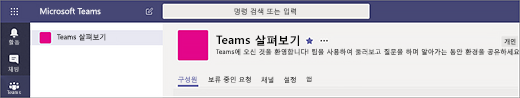
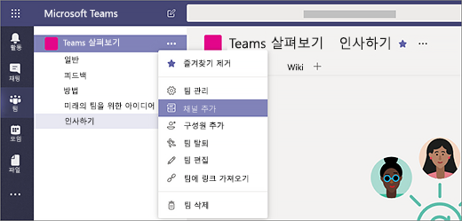

# Microsoft Teams에서 첫 번째 팀과 채널 만들기

팀과 채널의 첫 번째 집합을 설정하고 사용하는 것은 Teams에 대한 경험을 쌓고 조직 전체에 Teams를 채택하는 데 도움을 줄 수 있는 챔피언을 식별하도록 합니다. 아직 Teams를 설치하지 않은 경우 [Teams 클라이언트 가져오기](get-clients.md) 및 [최신 인증을 사용하여 Teams에 로그인](sign-in-teams.md)을 참조하세요.

## 첫 번째 팀과 채널에 대한 제안

 팀은 공통의 목표를 위해 함께 모이는 사람의 모음입니다. 채널은 실제 작업이 수행되는 팀 내의 공동 작업 공간입니다. 

자세한 내용은 [Teams의 팀과 채널 개요](teams-channels-overview.md) 및 [Teams에서 팀 구성에 대한 모범 사례](best-practices-organizing.md)를 참조하세요.

 얼리어답터가 시험해보고 질문을 하고 Teams의 기능을 발견할 수 있는 “Teams 살펴보기” 팀으로 시작하는 것이 좋습니다. 이 팀은 Teasm를 실험하기 시작하면서 성공하는 데 필수적일 수 있습니다. 

### “Teams 살펴보기” 팀
프로젝트 팀은 "Teams 살펴보기" 팀을 사용하여 Teams 클라이언트와 함께 설정하고 초기 대화를 진행하고 Teams에서 어떤 작업을 할 수 있는지 살펴볼 수 있습니다. 이미 조직에 새 기능에 사전 액세스를 즐기는 그룹의 사람들이 있을 수 있습니다. 이 그룹은 팀을 구성할 때 초기 팀 중 하나일 수 있으며 조기 피드백을 받는 데 도움이 됩니다.

팀에 대해 제안하는 구조는 다음과 같습니다.

| 채널 | 설명 및 사용법 | 고정 된 탭, 봇 및 앱 |
| ------------ | -------------------- | -------------------- |
| 일반 | 모든 팀은 일반 채널로 시작합니다. Teams를 알아가기 시작하면 이 채널을 사용하여 공지 사항을 만드세요. |  |
| 인사하기 | 팀에 자신을 소개하고 Teams로부터 원하는 내용을 공유할 수 있습니다. |  |
| 방법 | 방법에 대한 질문을 하는 채널입니다. 1단계 – 데스크톱과 모바일 클라이언트를 설치합니다. 2단계 – Teams로 이동합니다.| [Teams 도움말 센터](https://support.office.com/teams)로 연결되는 고정된 탭 [Teams 교육 비디오](https://support.office.com/article/microsoft-teams-video-training-4f108e54-240b-4351-8084-b1089f0d21d7)로 연결되는 고정된 탭 [Teams 데스크톱과 모바일 클라이언트 다운로드 링크](https://teams.microsoft.com/downloads)에 연결되는 고정된 탭 |
| 사용자 의견 | Teams 경험에 대한 의견을 공유하세요. | Polly 설문 조사로 고정된 탭|
| 미래의 팀을 위한 아이디어 | Teams가 조직에서 추가 가치를 창출할 수 있는 위치에 대한 의견을 공유합니다. 이러한 팀을 뭐라고 할 수 있을까요? 누가 구성원이 되나요? ||
| 지원 | 예상대로 작동하지 않는 경우 이 채널을 사용하여 도움을 받으세요. ||

## 첫 번째 팀을 준비하고 실행하세요.
관리자는 Teams 클라이언트나 Microsoft Teams 관리 센터에서 팀과 채널을 만들고 관리할 수 있습니다. 팀을 공개 또는 비공개로 만들 수 있습니다. [조직 전체 팀](create-an-org-wide-team.md)을 만들 수도 있습니다. 조직에서 Teams를 사용하는 모든 사용자가 공개 팀에 참석할 수 있습니다. 비공개 팀의 경우 팀 소유자가 팀 구성원을 관리합니다. 조직 전체 팀의 경우 조직 내 모든 사용자가 자동으로 추가됩니다. 

시작하려면 비공개 팀을 만들고 다른 소유자를 추가하여 팀 설정 및 구성원을 관리하는 것이 좋습니다. 

> [!NOTE]
> 다음 단계에서는 Teams 데스크톱 클라이언트를 사용하여 팀과 채널을 만듭니다. 관리자는 Microsoft Teams 관리 센터에서 이 작업을 수행할 수도 있습니다.

### 팀 만들기

Teams의 왼쪽에서 **Teams** 를 클릭하고 팀 목록 아래에서 **팀 참가 또는 만들기** 를 클릭한 다음 **새 팀 만들기** 를 클릭합니다.

팀을 만든 후에는 참여하도록 사용자를 초대합니다. 개인 사용자, 그룹 및 전체 연락처 그룹 (이전에는 "메일 그룹"이라고 함)을 추가할 수 있습니다. 

 

### 팀 소유자 추가
만든 팀을 찾은 다음 **추가 옵션 ˙˙˙** > **팀 관리** 를 클릭합니다. 그런 다음 **구성원** 탭으로 이동합니다. 팀 소유자로 지정하려는 사용자를 찾습니다. **역할** 에서 **소유자** 을 클릭합니다.

### 팀에서 채널 만들기
만든 팀을 찾은 다음 **추가 옵션 ...** > **채널 추가** 를 클릭합니다. **팀 관리** 를 클릭하고 **채널** 탭에서 채널을 추가할 수도 있습니다. 

 

사용자가 채널의 용도를 쉽게 이해할 수 있도록 채널에 설명하는 이름을 지정합니다. 

팀 소유자는 팀 전체에 채널을 자동으로 선호하여 팀의 모든 사람이 채널을 더 잘 보게 할 수 있습니다. OneNote, 웹 페이지 링크 및 기타 콘텐츠와 같은 도구를 추가하여 사용자가 필요한 것을 쉽게 찾고 생각을 공유하도록 탭을 채널에 고정할 수도 있습니다.  

다음은 "Teams 살펴보기" 팀의 "방법" 채널의 예입니다. Teams 웹 페이지 &ndash; Teams 비디오 교육, Teams 도움말 센터 및 Teams 다운로드 링크로 연결되는 고정된 탭이 표시됩니다. 

 

## 다음 단계
[얼리어답터 온보딩](get-started-with-teams-onboard-early-adopters.md)으로 이동합니다.
