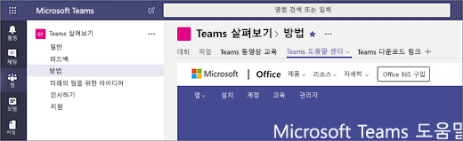

# Microsoft Teams에서 첫 번째 팀과 채널 만들기Create your first teams and channels in Microsoft Teams

팀과 채널의 첫 번째 집합을 설정하고 사용하는 것은 Teams에 대한 경험을 쌓고 조직 전체에 Teams를 채택하는 데 도움을 줄 수 있는 챔피언을 식별하도록 합니다.Setting up and using your first set of teams and channels builds your experience with Teams and identifies champions who can help drive Teams adoption across your organization. 아직 Teams를 설치하지 않은 경우 [Teams 클라이언트 가져오기](get-clients.md) 및 [최신 인증을 사용하여 Teams에 로그인](sign-in-teams.md)을 참조하세요.If you haven't installed Teams yet, check out [Get Teams clients](get-clients.md) and [Sign in to Teams using modern authentication](sign-in-teams.md).

## 첫 번째 팀과 채널에 대한 제안Suggestions for your first teams and channels

 팀은 공통의 목표를 위해 함께 모이는 사람의 모음입니다.A team is a collection of people who gather together around a common goal. 채널은 실제 작업이 수행되는 팀 내의 공동 작업 공간입니다.Channels are the collaboration spaces within a team where the actual work gets done. 

자세한 내용은 [Teams의 팀과 채널 개요](teams-channels-overview.md) 및 [Teams에서 팀 구성에 대한 모범 사례](best-practices-organizing.md)를 참조하세요.To learn more, see [Overview of teams and channels in Teams](teams-channels-overview.md) and [Best practices for organizing teams in Teams](best-practices-organizing.md).

 얼리어답터가 시험해보고 질문을 하고 Teams의 기능을 발견할 수 있는 “Teams 살펴보기” 팀으로 시작하는 것이 좋습니다.We suggest you start with a “Get to know Teams” team where your early adopters can play around, ask questions, and discover the capabilities of Teams. 이 팀은 Teasm를 실험하기 시작하면서 성공하는 데 필수적일 수 있습니다.This team can be essential to your success as you begin to experiment with Teams. 

### “Teams 살펴보기” 팀"Get to know Teams" team
프로젝트 팀은 "Teams 살펴보기" 팀을 사용하여 Teams 클라이언트와 함께 설정하고 초기 대화를 진행하고 Teams에서 어떤 작업을 할 수 있는지 살펴볼 수 있습니다.Your project team can use the “Getting to know Teams” team to ensure they're set up with Teams clients, have some initial conversations, and explore what Teams can do. 이미 조직에 새 기능에 사전 액세스를 즐기는 그룹의 사람들이 있을 수 있습니다.You may already have a group of people in your organization who enjoy getting early access to new capabilities. 이 그룹은 팀을 구성할 때 초기 팀 중 하나일 수 있으며 조기 피드백을 받는 데 도움이 됩니다.This can be one of their initial teams when you bring them on board and will help you get early feedback.

팀에 대해 제안하는 구조는 다음과 같습니다.Here's a suggested structure for the team.

| 채널Channel | 설명 및 사용법Description and usage | 고정 된 탭, 봇 및 앱Pinned tabs, bots, and apps |
| ------------ | -------------------- | -------------------- |
| 일반General | 모든 팀은 일반 채널로 시작합니다.All teams start with a General channel. Teams를 알아가기 시작하면 이 채널을 사용하여 공지 사항을 만드세요.Use this channel to make announcements as you start getting to know Teams. |  |
| 인사하기Say hi | 팀에 자신을 소개하고 Teams로부터 원하는 내용을 공유할 수 있습니다.Introduce yourself to the team and share what you want to get from Teams. |  |
| 방법How do I | 방법에 대한 질문을 하는 채널입니다.A channel to ask how-to questions. 1단계 – 데스크톱과 모바일 클라이언트를 설치합니다.Step 1 – install the desktop and mobile clients. 2단계 – Teams로 이동합니다.Step 2 – jump into Teams.| [Teams 도움말 센터](https://support.office.com/teams)로 연결되는 고정된 탭Pinned tab that links to the [Teams help center](https://support.office.com/teams) [Teams 교육 비디오](https://support.office.com/article/microsoft-teams-video-training-4f108e54-240b-4351-8084-b1089f0d21d7)로 연결되는 고정된 탭Pinned tab that links to [Teams training videos](https://support.office.com/article/microsoft-teams-video-training-4f108e54-240b-4351-8084-b1089f0d21d7) [Teams 데스크톱과 모바일 클라이언트 다운로드 링크](https://teams.microsoft.com/downloads)에 연결되는 고정된 탭Pinned tab that links to [Teams desktop and mobile client download links](https://teams.microsoft.com/downloads) |
| 사용자 의견Feedback | Teams 경험에 대한 의견을 공유하세요.Share your thoughts on your Teams experiences. | Polly 설문 조사로 고정된 탭Pinned tab with Polly Poll|
| 미래의 팀을 위한 아이디어Ideas for future teams | Teams가 조직에서 추가 가치를 창출할 수 있는 위치에 대한 의견을 공유합니다.Share your thoughts on where Teams can drive additional value in your organization. 이러한 팀을 뭐라고 할 수 있을까요?What could these teams be called? 누가 구성원이 되나요?Who would be members? ||
| 지원Support | 예상대로 작동하지 않는 경우 이 채널을 사용하여 도움을 받으세요.If something isn't working as expected, use this channel to get help. ||

## 첫 번째 팀을 준비하고 실행하세요.Get your first teams up and running
관리자는 Teams 클라이언트나 Microsoft Teams 관리 센터에서 팀과 채널을 만들고 관리할 수 있습니다.As an admin, you can create and manage teams and channels in the Teams client or the Microsoft Teams admin center. 팀을 공개 또는 비공개로 만들 수 있습니다.You can create teams as public or private. [조직 전체 팀](create-an-org-wide-team.md)을 만들 수도 있습니다.You can also create an [org-wide team](create-an-org-wide-team.md). 조직에서 Teams를 사용하는 모든 사용자가 공개 팀에 참석할 수 있습니다.Anyone using Teams in your organization can join a public team. 비공개 팀의 경우 팀 소유자가 팀 구성원을 관리합니다.For private teams, team owners manage team membership. 조직 전체 팀의 경우 조직 내 모든 사용자가 자동으로 추가됩니다.And for an org-wide team, everyone in your organization is automatically added. 

시작하려면 비공개 팀을 만들고 다른 소유자를 추가하여 팀 설정 및 구성원을 관리하는 것이 좋습니다.To get started, we recommend you create private teams and add another owner to manage team settings and membership. 

> [!NOTE]
> 다음 단계에서는 Teams 데스크톱 클라이언트를 사용하여 팀과 채널을 만듭니다.In the steps that follow, we use the Teams desktop client to create teams and channels. 관리자는 Microsoft Teams 관리 센터에서 이 작업을 수행할 수도 있습니다.Keep in mind that as an admin, you can also do these tasks in the Microsoft Teams admin center.

### 팀 만들기Create a team

Teams의 왼쪽에서 **Teams**를 클릭하고 팀 목록 아래에서 **팀 참가 또는 만들기**를 클릭한 다음 **새 팀 만들기**를 클릭합니다.On the left side of Teams, click **Teams**, at the bottom of the teams list, click **Join or create a team**, and then click **Create a new team**.

팀을 만든 후에는 참여하도록 사용자를 초대합니다.Once you've created the team, invite people to join it. 개인 사용자, 그룹 및 전체 연락처 그룹 (이전에는 "메일 그룹"이라고 함)을 추가할 수 있습니다.You can add individual users, groups, and even entire contact groups (formerly known as "distribution lists"). 

 

### 팀 소유자 추가Add a team owner
만든 팀을 찾은 다음 **추가 옵션 ˙˙˙** > **팀 관리**를 클릭합니다.Find the team that you created, click **More options ˙˙˙** > **Manage team**. 그런 다음 **구성원** 탭으로 이동합니다. 팀 소유자로 지정하려는 사용자를 찾습니다.Then go to the **Members** tab. Find the people you want to designate as team owners. **역할**에서 **소유자**을 클릭합니다.Under **Role**, click **Owner**.

### 팀에서 채널 만들기Create a channel in a team
만든 팀을 찾은 다음 **추가 옵션 ...** > **채널 추가**를 클릭합니다.Find the team that you created, click **More options ...** > **Add channel**. **팀 관리**를 클릭하고 **채널** 탭에서 채널을 추가할 수도 있습니다.You can also click **Manage team** and add a channel in the **Channels** tab. 

 

사용자가 채널의 용도를 쉽게 이해할 수 있도록 채널에 설명하는 이름을 지정합니다.Give the channel a descriptive name to make it easier for users to understand the purpose of the channel. 

팀 소유자는 팀 전체에 채널을 자동으로 선호하여 팀의 모든 사람이 채널을 더 잘 보게 할 수 있습니다.As a team owner, you can automatically favorite channels for the whole team, making the channels more visible for everyone on the team. OneNote, 웹 페이지 링크 및 기타 콘텐츠와 같은 도구를 추가하여 사용자가 필요한 것을 쉽게 찾고 생각을 공유하도록 탭을 채널에 고정할 수도 있습니다.You can also pin tabs to the channel to add tools, such as OneNote, links to webpages, and other content to make it easy for users to find what they need and share their thoughts.  

다음은 "Teams 살펴보기" 팀의 "방법" 채널의 예입니다. Teams 웹 페이지 &ndash; Teams 비디오 교육, Teams 도움말 센터 및 Teams 다운로드 링크로 연결되는 고정된 탭이 표시됩니다.Here's an example of the "How do I" channel in the "Get to know Teams" team, showing pinned tabs that link to Teams webpages &ndash; Teams video training, Teams help center, and Teams download links. 

 

## 다음 단계Next steps
[얼리어답터 온보딩](get-started-with-teams-onboard-early-adopters.md)으로 이동합니다.Go to [Onboard your early adopters](get-started-with-teams-onboard-early-adopters.md).
