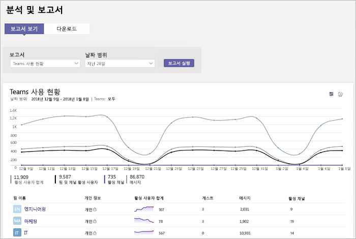
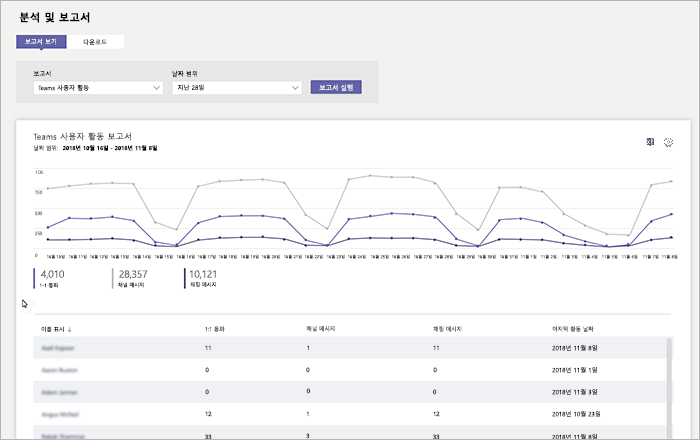
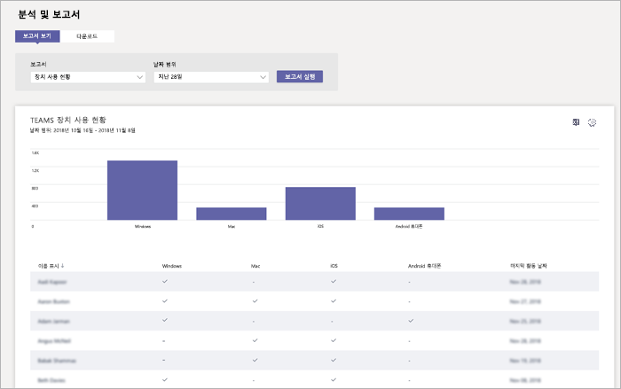

# Microsoft Teams에서 사용 현황 및 피드백 모니터링Monitor usage and feedback in Microsoft Teams
사용자가 Teams를 사용하는 방법과 Teams와 함께 어떤 환경이 진행되고 있는지 알아야 합니다.It's important to know how users are using Teams and what their experience is with Teams. 사용 현황 보고서는 사용 현황 패턴을 보다 잘 이해할 수 있도록 도와주고 사용자 피드백을 반영하여 더 광범위한 배포와 교육 및 통신 노력을 어디에 우선시해야 하는지에 대한 정보를 제공합니다.Usage reports can help you better understand usage patterns, and along with user feedback, give you insights to inform your wider rollout and where to prioritize training and communication efforts.

## 사용 현황 모니터링Monitor usage
첫 번째 팀 집합에 대해 보고서를 일주일에 두 번 검토하여 새로운 추세를 파악하는 것이 좋습니다.For your first set of teams, we recommend you review reports twice a week to understand emerging trends. 

예를 들어 사용 현황 보고서는 Teams 모바일 클라이언트를 사용하는 사용자가 많지 않다는 것을 보여 줍니다.For example, usage reports show that not many users are using the Teams mobile clients. 사용자가 클라이언트를 설치하는 방법을 모른다는 것을 나타낼 수 있습니다.This may indicate that users aren't sure how to install the clients. 채널에 단계별 설치 지침을 게시하면 더 넓은 범위의 클라이언트를 사용하는 데 도움이 될 수 있습니다.Posting step-by-step installation instructions in a channel may help drive usage of a wider range of clients. 또는 사용 현황 보고서는 사용자가 주로 개인 채팅을 위해 Teams를 사용하고 있다는 것을 보여 줍니다.Or, usage reports show that users are primarily using Teams for private chats. 이 예제에서는 사용자가 설정된 초기 팀 및 채널 외부에서 채팅하고 있으므로 팀 시나리오를 검토하기 원할 수 있습니다.In this example, you may want to review your team scenarios because users are chatting outside the initial teams and channels that were set up. 

Teams 사용 현황을 검토하기 위해 보고서를 받는 방법은 다음과 같습니다.Here's how to get reports to view Teams usage. 

### Teams 분석 및 보고서 (Microsoft Teams 관리 센터)Teams analytics & reports (Microsoft Teams admin center)

Microsoft Teams 관리 센터의 Teams 보고서는 조직에서 Teams를 사용하는 방법에 대한 정보를 제공합니다.Teams reports in the Microsoft Teams admin center give you insights into how Teams is used in your organization. 보고서를 사용하여 조직 전체에 대한 Teams 사용 현황, 사용자 활동 및 장치 사용 현황을 검토할 수 있습니다.Use the reports to get a view into Teams usage, user activity, and device usage across your organization. 

이러한 보고서를 검토하려면 Microsoft 365 또는 Office 365의 전역 관리자, Teams 서비스 관리자 또는 비즈니스용 Skype 관리자라야 합니다. Microsoft Teams 관리 센터로 이동하여 왼쪽 탐색 창에서 **분석 및 보고서** 를 선택한 다음 **보고서** 에서 실행할 보고서를 선택합니다.To view these reports, you must be a global admin in Microsoft 365 or Office 365, Teams service admin, or Skype for Business admin. Go to the Microsoft Teams admin center, in the left navigation, select **Analytics & reports**, and then under **Report**, choose the report you want to run.

- **Teams 사용 현황 보고서**: 이 보고서는 총 활성 사용자 및 채널 수 그리고 각 팀에서의 활성 사용자 및 채널, 게스트, 메시지 수를 포함하여 Teams의 사용 현황 활동에 대한 개요를 제공합니다.**Teams usage report**: This report gives you an overview of usage activity in Teams, including the total active users and channels, and the number of active users and channels, guests, and messages in each team. 

         
- **Teams 사용자 활동 보고서**: 이 보고서는 1:1 통화, 채널 메시지 및 개인 채팅 메시지를 통해 의사소통하는 사용자의 수와 같이 사용자가 참여하는 활동 유형에 대한 정보를 제공합니다.**Teams user activity report**: This report gives you insight into the types of activities users engage in, such as how many people communicate through 1:1 calls, channel messages, and private chat messages. 

     
\` 
\`
- **Teams 장치 사용 현황 보고서**: 이 보고서는 사용자가 이동할 때 모바일 장치에서 Teams를 사용하는 사용자의 수를 비롯하여 Teams에 연결하는 방법을 표시합니다.**Teams device usage report**: This report shows you how users connect to Teams, including how many people use Teams on their mobile devices when on-the-go. 

    

자세한 내용은 [Teams 분석 및 보고](teams-analytics-and-reports/teams-reporting-reference.md)를 참조하세요.To learn more, check out [Teams analytics and reporting](teams-analytics-and-reports/teams-reporting-reference.md). 

### Teams 활동 보고서 (Microsoft 365 관리 센터)Teams activity reports (Microsoft 365 admin center)
Microsoft 365 관리 센터에서 제공되는 보고서를 통해 Teams 활동을 볼 수도 있습니다.You can also view Teams activity through reports that are available from the Microsoft 365 admin center. 이러한 보고서는 Microsoft 365 관리 센터의 Microsoft 365 보고서에 포함되어 있으며 사용자 활동과 장치 사용 현황에 대한 정보를 제공합니다.These reports are part of the Microsoft 365 reports in the Microsoft 365 admin center and provide information about user activity and device usage. 

이러한 보고서를 검토하려면 Microsoft 365 관리 센터로 이동하여 **보고서** > **사용 현황** 을 클릭합니다.To view these reports, go to the Microsoft 365 admin center, click **Reports** > **Usage**. **보고서 선택** 아래에 **Microsoft Teams** 를 클릭하세요.Under **Select a report**, click **Microsoft Teams**. 여기에서 검토하려는 보고서를 선택합니다.From here, choose the report you want to view.

자세한 내용은 [Teams에 대한 활동 보고서 사용](teams-activity-reports.md)으로 이동하세요.To learn more, go to [Use activity reports for Teams](teams-activity-reports.md).

### Microsoft 365 사용 현황 분석Microsoft 365 usage analytics

Power BI에서 Microsoft 365 사용 현황 분석을 사용하여 Teams 및 기타 Microsoft 365 또는 Office 365 제품과 서비스에 대한 사용 현황 데이터를 검토하고 분석할 수 있습니다.You can use Microsoft 365 usage analytics in Power BI to view and analyze usage data for Teams and other Microsoft 365 or Office 365 products and services. Microsoft 365 사용 현황 분석은 이미 작성된 대시보드와 여러 이미 작성된 보고서를 포함하는 콘텐츠 팩입니다.Microsoft 365 usage analytics is a content pack that includes a pre-built dashboard and a number of pre-built reports. 각 보고서는 특정 사용 현황 데이터 및 정보를 제공합니다.Each report gives you specific usage data and insights. 콘텐츠 팩에 연결하려면 Power BI가 필요하며 Microsoft 365, Office 365 또는 보고서 읽기 프로그램의 전역 관리자여야 합니다.To connect to the content pack, you need Power BI and must be a global admin in Microsoft 365, Office 365, or reports reader. Power BI가 아직 없는 경우 [Power BI 무료 서비스에 등록하세요](https://powerbi.microsoft.com).If you don't already have Power BI, [sign up for the free Power BI service](https://powerbi.microsoft.com). 

자세한 내용은 [Microsoft 365 사용 현황 분석](https://support.office.com/article/Microsoft-365-usage-analytics-77ff780d-ab19-4553-adea-09cb65ad0f1f)을 참조하세요.To learn more, see [Microsoft 365 usage analytics](https://support.office.com/article/Microsoft-365-usage-analytics-77ff780d-ab19-4553-adea-09cb65ad0f1f). 

## 피드백 수집Gather feedback
새 공동 작업 환경의 채택은 사용자의 행동을 변화시키는 것입니다.The adoption of a new collaboration experience is about changing the behavior of users. 변화를 가능하게 하려면 교육, 격려 및 긍정적인 예제가 필요합니다.Enabling change requires training, encouragement, and positive examples. 사용자가 Teams로 전환하는 동안 의견을 내고 자신의 경험을 개방적으로 공유할 수 있도록 하는 것은 중요합니다.It's important for users to have a voice during the transition to Teams and to be able to openly share their experiences. Teams를 사용하여 사용자의 환경에서 사용자로부터 피드백을 수집하고 해결하기 위해 만든 "Teams에 대해 알아보기" 팀에서 피드백 채널을 사용하는 것이 좋습니다.We recommend using the Feedback channel in the "Get to know Teams" team you created to collect and address feedback from users on their experiences with Teams. 

## 다음 단계Next steps
[리소스를 다운로드하여 Teams의 조직 전체 배포 계획](get-started-with-teams-resources-for-org-wide-rollout.md)으로 이동하세요.Go to [Get resources to plan your organization-wide rollout of Teams](get-started-with-teams-resources-for-org-wide-rollout.md).
