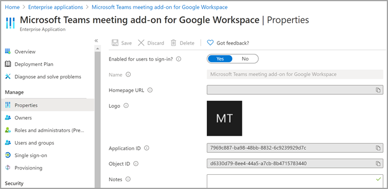

# <a name="set-up-microsoft-teams-meeting-add-on-for-google-workspace"></a>Google Microsoft Teams 모임 추가 기능 설정

모임 Microsoft Teams 추가 기능을 사용하면 Google 일정 사용자가 Google 작업 영역에서 직접 모임을 예약하고 Microsoft Teams 참가할 수 있습니다. 사용자는 비디오 및 Teams 회의, 화면 공유, 모임 채팅, 디지털 화이트보드 등을 포함한 다양한 모임 기능에 액세스할 수 있습니다. 업무, 학교 및 생활에서 더 많은 작업을 수행하기 위해 연결되고 체계적으로 유지해야 합니다.

테넌트 Microsoft Teams 액세스하려면 먼저 Google 작업 영역의 모임 추가 Teams 관리자에서 사용하도록 설정해야 합니다.

## <a name="enable-or-disable-microsoft-teams-meeting-add-on-for-google-workspace-in-the-azure-portal"></a>Azure portal에서 Microsoft Teams Google 작업 영역의 모임 추가 기능 사용 또는 사용 안 하도록 설정

테넌트 관리자는 Azure portal을 사용하여 조직의 관리자 계정에서 Google Microsoft Teams 모임 추가 기능을 사용하도록 설정하거나 사용하지 않도록 설정할 수 있습니다.

추가 기능을 기본적으로 사용하도록 설정되어 있습니다.

1. Azure Portal에 로그인합니다.

2. 애플리케이션 **Enterprise**  >  **모든 애플리케이션을 선택합니다.**

3. Google 작업 Microsoft Teams 모임 추가 **기능을 검색합니다.**

   

4. 예 **를 선택합니다.**

   

5. (선택 사항) 추가 기능을 사용하지 않도록  설정하려면 4단계에서 예 대신 **아니요를** 선택합니다.

## <a name="disable-microsoft-teams-meeting-add-on-for-google-workspace-using-powershell"></a>PowerShell을 Microsoft Teams Google 작업 영역의 모임 추가 기능 사용하지 않도록 설정

```powershell
Connect-AzureAD

$displayName = 'Microsoft Teams meeting add-on for Google Workspace'
$appId = '7969c887-ba98-48bb-8832-6c9239929d7c'

# Check if a service principal already exists for the app
$servicePrincipal = Get-AzureADServicePrincipal -Filter "appId eq '$appId'"
if ($servicePrincipal) {
    # Service principal exists already, disable it
    Set-AzureADServicePrincipal -ObjectId $servicePrincipal.ObjectId -AccountEnabled $false
    Write-Host "Disabled existing Service Principal \n"
} else {
    # Service principal does not yet exist, create it and disable it at the same time
    New-AzureADServicePrincipal -AppId $appId -DisplayName $displayName
    $servicePrincipal = New-AzureADServicePrincipal -AppId $appId -DisplayName $displayName -AccountEnabled $false
    Write-Host "Created and disabled the Service Principal \n"
}
```

자세한 내용은 을 사용하여 Azure 서비스 [주체 만들기를 Azure PowerShell.](/powershell/azure/create-azure-service-principal-azureps?view=azps-5.0.0)

## <a name="delete-the-microsoft-teams-meeting-add-on-for-google-workspace"></a>Google Microsoft Teams 모임 추가 기능 삭제

지침은 Google 워크스페이스 Marketplace 앱을 [삭제하는 Google](https://support.google.com/a/answer/6216211?hl=en) 설명서를 참조하세요.