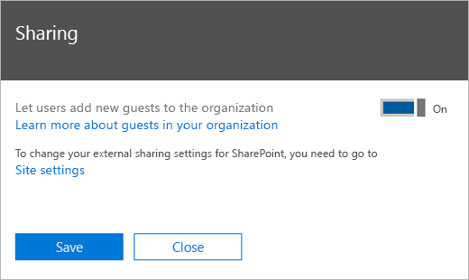

팀 게스트 액세스 검사 목록Teams guest access checklist
==========================================

조직의 기본 설정에 따라 Microsoft 팀에서 게스트 액세스 기능을 사용 하도록 설정 하 고 구성 하는 데 도움이 되는 검사 목록을 사용 합니다.Use this checklist to help you enable and configure the guest access feature in Microsoft Teams according to the preferences of your organization.

> [!NOTE] 
> 공동 작업 제한 사항은 [B2B 외부 공동 작업 사용 및 게스트 초대를 할 수 있는 사용자 관리를](https://docs.microsoft.com/azure/active-directory/b2b/delegate-invitations)참조 하세요.For collaboration restrictions see [Enable B2B external collaboration and manage who can invite guests](https://docs.microsoft.com/azure/active-directory/b2b/delegate-invitations).

## 게스트의 제한 사항 이해Understand the limitations for guests

게스트 환경에는 설계상의 제한 사항이 있습니다.The guest experience has limitations by design. 문제가 아닌 항목을 해결 하기 위해 게스트 환경을 이해 하 고 있는지 확인 하세요.Make sure you understand the guest experience so you don't try to fix something that isn't a problem. 예를 들어 Microsoft 팀의 게스트에는 사용할 수 없는 몇 가지 기능이 나와 있습니다.For example, here's a list of some of the functionality that isn't available to a guest in Microsoft Teams:

- 비즈니스용 OneDriveOneDrive for Business
- 팀 외부에서 사용자 검색People search outside of Teams
- 일정, 예약 된 모임 또는 모임 세부 정보Calendar, Scheduled Meetings, or Meeting Details
- PSTNPSTN
- 조직도Organization chart
- 팀 만들기 또는 수정Create or revise a team
- 팀 찾아보기Browse for a team
- 사용자 간 채팅에 파일 업로드Upload files to a person-to-person chat
- 게스트는 사용자의 전체 전자 메일 ID를 알고 있는 경우에도 사용자가 팀 외부에서 검색 하 고 찾을 수 있습니다.Guests can still search and find users (outside their team) if they know the user's full email ID. 이를 방지 하기 위해 IT 관리자는 게스트를 고유한 가상 GAL으로 제한할 수 있는 [범위 디렉터리 검색](https://docs.microsoft.com/en-us/MicrosoftTeams/teams-scoped-directory-search) 등의 패턴을 사용할 수 있습니다.To prevent this, IT admins can use patterns like [scoped directory search](https://docs.microsoft.com/en-us/MicrosoftTeams/teams-scoped-directory-search) that have the ability to restrict Guests into their own virtual GAL.

자세한 내용은 [게스트 환경](guest-experience.md) 및 [Office 365 그룹의 게스트 액세스에](https://support.office.com/article/guest-access-in-office-365-groups-bfc7a840-868f-4fd6-a390-f347bf51aff6)대해 알아보세요.For more details, see [What the guest experience is like](guest-experience.md) and [Guest access in Office 365 Groups](https://support.office.com/article/guest-access-in-office-365-groups-bfc7a840-868f-4fd6-a390-f347bf51aff6).

### 게스트 액세스와 외부 액세스 (페더레이션) 비교Guest access vs. external access (federation)

[!INCLUDE [guest-vs-external-access](includes/guest-vs-external-access.md)]

> [!NOTE] 
> 현재 Microsoft 팀은 게스트 inviter 역할을 지원 하지 않습니다.Currently, Microsoft Teams does not support the guest inviter role. Microsoft 팀에서 작업 하려면 "구성원을 초대할 수 있습니다." 토글을 게스트 액세스에 대해 "예"로 설정 해야 합니다.At a minimum the "members can invite" toggle must be set to "Yes" for guest access to work in Microsoft Teams. "구성원이" 초대 가능 "을" 아니요 "로 설정한 다음 Office 365 그룹 및 Microsoft 팀에서 게스트 액세스를 사용 하도록 설정 하면 관리자가 디렉터리에 대 한 게스트 초대를 제어할 수 있습니다.If you set "members can invite" to "No" and then enable guest access in Office 365 Groups and Microsoft Teams, admins can control guest invitations to your directory. Guest가 디렉터리에 있으면 팀 소유자 인 관리자가 아닌 구성원에 따라 팀에 추가 될 수 있습니다.After guests are in the directory, they can be added to teams by non-admin members who are team owners.

## 게스트가 라이센스 오류를 보고 있는 경우If your guests are seeing license errors

Microsoft 팀의 게스트 액세스는 Azure AD (azure Active Directory) Business to Business (B2B) 및 해당 라이선스 모델을 사용 합니다.Guest access in Microsoft Teams uses Azure Active Directory (Azure AD) Business to Business (B2B) and its licensing model. 라이선스 오류가 표시 되는 경우 사용자가 조직에 게스트를 초대할 수 있도록 [B2B 라이선스 지침](https://docs.microsoft.com/azure/active-directory/b2b/licensing-guidance) 을 읽고 조직의 라이선스 요구 사항을 이해 해야 합니다.If you’re seeing licensing errors, make sure to read the [B2B licensing guidance](https://docs.microsoft.com/azure/active-directory/b2b/licensing-guidance) to understand the licensing requirements your organization has so that your users are able to invite guests to your organization.

몇 가지 주의할 사항이 있습니다.A few things to remember:

- 게스트는 조직 외부의 사용자입니다.Guests are users outside your organization. 직원, 출장 대리점, 출장 업체 등은 게스트로 추가할 수 없습니다.Your employees, onsite contractors, onsite agents, and so on can't be added as guests. 계열사에도 마찬가지입니다.The same applies to your affiliates.
- 초청 기관에 대해 게스트 라이선스가 계산 됩니다.Guest licenses are counted against the inviting organization. 필요한 라이선스 수를 계산할 때이를 고려 합니다.Consider this when you calculate the number of licenses you need.
- 라이선스는 초대 된 게스트가 다른 Office 365 테 넌 트에서 온 것인지 또는 개인 전자 메일 주소를 사용 하는 조직에 게 계산 됩니다.Licenses are counted against your organization whether the invited guests come from another Office 365 tenant or are using their personal email addresses.

## □ 단계 1: Azure AD business 비즈니스에서 설정 구성□  Step 1: Configure settings in Azure AD business-to-business

1. 테 넌 트 관리자로 [Azure 포털](https://portal.azure.com) 에 로그인 합니다.Sign in to the [Azure portal](https://portal.azure.com) as a tenant administrator.
2. **Azure Active Directory** > **사용자** > **사용자 설정을**선택 합니다.Select **Azure Active Directory** > **Users** > **User settings**.
3. **외부 사용자**아래에서 **외부 공동 작업 설정 관리**를 선택 합니다.Under **External users**, select **Manage external collaboration settings**.
   > [!NOTE]
   > **외부 공동 작업 설정은** **조직 관계** 페이지 에서도 사용할 수 있습니다.The **External collaboration settings** are also available from the **Organizational relationships** page. Azure Active Directory의 **관리**에서 **조직 관계** > **설정**으로 이동 합니다.In Azure Active Directory, under **Manage**, go to **Organizational relationships** > **Settings**.
4. **외부 공동 작업 설정** 페이지에서 사용 하도록 설정할 정책을 선택 합니다.On the **External collaboration settings** page, choose the policies you want to enable.

  - **게스트 사용자 권한이 제한 됨**:이 정책은 디렉터리의 게스트에 대 한 사용 권한을 결정 합니다.**Guest users permissions are limited**: This policy determines permissions for guests in your directory. **예** 를 선택 하 여 사용자, 그룹 또는 기타 디렉터리 리소스 열거와 같은 특정 디렉터리 작업에서 게스트를 차단 합니다.Select **Yes** to block guests from certain directory tasks, like enumerating users, groups, or other directory resources. 게스트를 사용 하 여 디렉터리 데이터에 대 한 액세스 권한을 다른 사용자와 동일 하 게 지정 하려면 ( **아니요** )를 선택 합니다.Select **No** to give guests the same access to directory data as  regular users in your directory.
   - **게스트 inviter 역할의 관리자와 사용자는 초대할 수 있습니다**. "게스트 inviter" 역할의 관리자와 사용자가 게스트를 초대 하도록 허용 하려면이 정책을 **Yes**로 설정 합니다.**Admins and users in the guest inviter role can invite**: To allow admins and users in the "Guest Inviter" role to invite guests, set this policy to **Yes**.
   - **구성원 초대 가능**: 해당 디렉터리의 관리자가 아닌 구성원이 게스트를 초대 하도록 허용 하려면이 정책을 **예로**설정 합니다.**Members can invite**: To allow non-admin members of your directory to invite guests, set this policy to **Yes**.
   
       > [!NOTE]
       > 구성원을 **No** 에 **초대할 수** 있고 Office 365 그룹 및 Microsoft 팀에서 게스트 액세스를 사용 하도록 설정한 경우 관리자는 디렉터리에 대 한 게스트 초대를 제어할 수 있습니다.If you set **Members can invite** to **No** and then enable guest access in Office 365 Groups and Microsoft Teams, admins can control guest invitations to your directory. Guest가 디렉터리에 있으면 팀 소유자 인 관리자가 아닌 구성원에 따라 팀에 추가 될 수 있습니다.After guests are in the directory, they can be added to teams by non-admin members who are team owners. 자세한 내용은 [Microsoft 팀에서 게스트 액세스 권한 부여](Teams-dependencies.md)를 참조 하세요.For more information, see [Authorize guest access in Microsoft Teams](Teams-dependencies.md).
   
   - **게스트 초대**: 게스트가 다른 게스트를 초대할 수 있도록 하려면이 정책을 **Yes**로 설정 합니다.**Guests can invite**: To allow guests to invite other guests, set this policy to **Yes**.
   - **게스트를 위한 전자 메일 1 회 암호 사용 (미리 보기)**: 일회성 암호 기능에 대 한 자세한 내용은 일회용 [암호 기반 전자 메일 인증 (preview)](https://docs.microsoft.com/azure/active-directory/b2b/one-time-passcode)을 참조 하세요.**Enable email one-time passcode for guests (Preview)**: For more information about the one-time passcode feature, see [Email one-time passcode authentication (preview)](https://docs.microsoft.com/azure/active-directory/b2b/one-time-passcode).
   - **공동 작업 제한 사항**: 특정 도메인에 대 한 초대를 허용 하거나 차단 하는 방법에 대 한 자세한 내용은 [특정 조직의 B2B 사용자에 대 한 초대 허용 또는 차단](allow-deny-list.md)을 참조 하세요.**Collaboration restrictions**: For more information about allowing or blocking invitations to specific domains, see [Allow or block invitations to B2B users from specific organizations](allow-deny-list.md).

## □ 단계 2: Office 365 그룹 구성□ Step 2: Configure Office 365 Groups

1. Microsoft 365 관리 센터에서 **설정** > **서비스 & 추가 기능** > **Office 365 그룹**으로 이동 합니다.In the Microsoft 365 admin center, go to **Settings** > **Services & Add-ins** > **Office 365 Groups**.
2. 조직에서 그룹 **구성원을 액세스할 수 있도록 그룹 콘텐츠** 를 설정 하도록 허용 \*\*\*\* 해야 합니다.Make sure **Let group members outside the organization access group content** is set to **On**. 이 설정이 해제 되어 있으면 게스트는 그룹 콘텐츠에 액세스할 수 없게 됩니다.If this setting is turned off, guests won't be able to access any group content.
3. **그룹 소유자가 조직 외부의 사용자를 그룹에 추가 하도록 허용** 하는 \*\*\*\* 것이 설정 되어 있는지 확인 합니다.Make sure **Let group owners add people outside the organization to groups** is set to **On**. 이 설정을 끄면 팀 소유자가 새 게스트를 추가할 수 없게 됩니다.If this setting is turned off, Team owners won't be able to add new guests. 게스트 액세스를 지원 하려면 최소한이 설정이 설정 되어 있어야 합니다.At a minimum, this setting must be On to support guest access.

     

이러한 설정을 구성 하는 방법에 대 한 자세한 지침은 [office 365 그룹에서 게스트 액세스 관리](https://support.office.com/en-us/article/manage-guest-access-in-office-365-groups-9de497a9-2f5c-43d6-ae18-767f2e6fe6e0?appver=MOE150) 및 [office 365 그룹의 게스트 액세스 제어](Teams-dependencies.md#control-guest-access-in-office-365-groups)를 참조 하세요.For detailed instructions about configuring these settings, see [Manage guest access in Office 365 Groups](https://support.office.com/en-us/article/manage-guest-access-in-office-365-groups-9de497a9-2f5c-43d6-ae18-767f2e6fe6e0?appver=MOE150) and [Control guest access in Office 365 Groups](Teams-dependencies.md#control-guest-access-in-office-365-groups).
 

## □ 단계 3: 테 넌 트 수준에서 게스트 액세스를 사용 하도록 설정□ Step 3: Enable guest access at the tenant level

최소한 microsoft **팀 관리 센터**에서 microsoft 팀에 대 한 게스트 액세스를 설정 해야 합니다.At a minimum, you must turn on guest access for Microsoft Teams under the **Microsoft Teams admin center**. 

1. 팀 관리 센터에서 **조직 전체 설정** > **게스트 액세스**를 선택 합니다.In the Teams admin center, select **Org-Wide settings** > **Guest access**.
2. **Microsoft 팀에서 게스트 액세스 허용** 을 설정으로 전환 \*\*\*\* 합니다.Set the **Allow guest access in Microsoft Teams** switch to **On**.

    

3. 이 페이지에서 필요한 다른 게스트 설정을 구성 합니다.On this same page, configure any other guest settings that you require.
4. **저장**을 클릭 합니다.Click **Save**.

자세한 지침은 [Microsoft 팀에 대 한 게스트 액세스 설정 또는 해제](set-up-guests.md)를 참조 하세요.For detailed instructions, see [Turn on or turn off guest access to Microsoft Teams](set-up-guests.md).

## □ 단계 4: Office 365에서 공유 구성□  Step 4: Configure sharing in Office 365 

사용자가 게스트를 추가할 수 있는지 확인 합니다.Make sure that users can add guests. 방법은 다음과 같습니다.Here's how:

1. Microsoft 365 관리 센터에서 **설정** > **보안 & 개인 정보**로 이동 합니다.In the Microsoft 365 admin center, go to **Settings** > **Security & privacy**.

     

2. **공유**에서 **편집**을 선택 합니다.In **Sharing**, select **Edit**.

     
 
3. **사용자가이 조직에 새 게스트를 추가할 수 있도록 허용** 을 선택한 다음 **저장**을 클릭 합니다. \*\*\*\*Set **Let users add new guests to this organization** to **On**, and then click **Save**.

     
 
> [!NOTE]
> 이 설정은 회원 들이 Azure AD의**외부 사용자** **설정** > 에서 설정을 **초대할 수** 있는 것과 같습니다.This setting is equivalent to the **Members can invite** setting in  **User settings** > **External users**  in Azure AD.  

## □ 단계 5: SharePoint에서 공유 설정 확인□ Step 5: Verify sharing setting in SharePoint

1. Microsoft 365 관리 센터에 로그인 합니다.Sign in to the Microsoft 365 admin center.
2. **관리 센터**를 클릭 한 다음 **SharePoint**를 선택 합니다.Click **Admin center**, and then select **SharePoint**.
3. SharePoint 관리 센터에서 **공유**를 선택 합니다.In the SharePoint admin center, select **Sharing**.
4. **조직 외부 공유 허용 안 함** 옵션이 선택 되어 *있지* 않은지 확인 합니다.Make sure the option for **Don’t allow sharing outside your organization** is *not* selected.
 
     

## □ 단계 6: 채널에 특정 설정 사용□ Step 6: Enable specific settings for channels 

팀 응용 프로그램 개별 팀 수준에서 게스트가 채널을 만들고 업데이트 하 고 삭제할 수 있도록 게스트 권한을 구성 합니다.In the Teams application, at the individual team level, configure guest permissions so that guests can create, update, and delete channels. 관리자 외에도, 팀 소유자는이 설정을 구성할 수 있습니다.In addition to admins,  team owners can configure this setting.

방법 비디오를 비롯 한 자세한 내용은 [Microsoft 팀의 게스트 액세스](guest-access.md)를 참조 하세요.For more information, including how-to videos, see [Guest access in Microsoft Teams](guest-access.md).

## 해결사Troubleshooting

Microsoft 팀에서 게스트를 추가 하는 데 문제가 있는 경우 [게스트 액세스 문제 해결 가이드](https://techcommunity.microsoft.com/t5/Microsoft-Teams/Guest-Access-Troubleshooting-Guide/td-p/119797)를 참조 하세요.If you have problems with adding guests in Microsoft Teams, see the [Guest Access Troubleshooting Guide](https://techcommunity.microsoft.com/t5/Microsoft-Teams/Guest-Access-Troubleshooting-Guide/td-p/119797).

