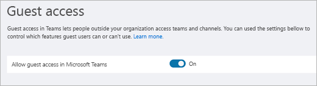
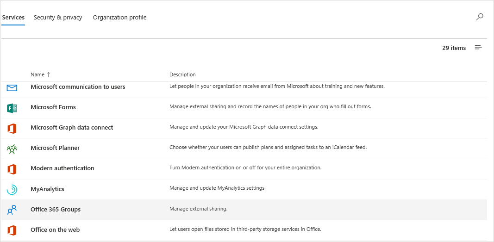

Microsoft Teams 게스트 액세스 검사 목록
=========================================

이 검사 목록을 사용하여 Microsoft Teams에서 게스트 액세스를 설정하고 구성할 수 있습니다. 이렇게 변경하려면 사용자가 전역 관리자 또는 Teams 관리자여야 합니다.

> [!IMPORTANT]
> 변경 내용이 적용되는 데 최대 24시간이 걸릴 수 있습니다. 

이 짧은 비디오(5분 31초)를 시청하여 Teams와 같은 Microsoft 365를 통해 게스트 액세스를 설정하는 방법에 대해 알아보세요.

> [!VIDEO https://www.microsoft.com/videoplayer/embed/RE44NTr?autoplay=false]

## 1단계: 조직 전체 수준에서 게스트 액세스 설정

게스트 액세스를 설정하려면 **Microsoft Teams 관리 센터**로 이동합니다. 

1. Teams 관리 센터에서 **조직 전체 설정** > **게스트 액세스**를 선택합니다.
2. **Microsoft Teams에서 게스트 액세스 허용** 스위치를 **켬**으로 설정합니다.

    

3. 이 페이지에서 게스트의 **통화**, **모임** 및 **메시징** 설정을 켜거나 끕니다.
4. **저장**을 클릭합니다.

> [!TIP]
> Azure Active Directory, SharePoint Online 및 Microsoft 365 그룹에서 기본 설정을 사용 하는 경우 게스트 액세스 구성이 완료 될 수 있습니다. 이 경우 나머지 단계를 건너뛸 수 있습니다. 확실 하지 않은 경우 또는 AAD, SharePoint Online 또는 Microsoft 365 그룹에 대 한 사용자 지정 설정을 사용 하는 경우이 검사 목록의 나머지 단계를 계속 진행 합니다.

## 2단계: Azure AD B2B 설정

다음은 Teams에서 게스트 액세스를 지원하는 Azure AD 설정입니다. 이러한 설정을 구성한 후에는 Teams에서 게스트를 [추가](add-guests.md)하고 [관리](manage-guests.md)할 수 있습니다.

1. 테넌트 관리자로 [Azure Portal](https://portal.azure.com)에 로그인합니다.
2. **Azure Active Directory** > **사용자** > **사용자 설정**을 선택합니다.
3. **외부 사용자**에서 **외부 공동 작업 관리 설정**을 선택합니다.
   > [!NOTE]
   > **조직 관계** 페이지에서 **외부 공동 작업 설정**도 사용할 수 있습니다. Azure Active Directory의 **관리**에서 **조직 관계** > **설정**으로 이동합니다.
4. **외부 공동 작업 설정** 페이지에서 사용하려는 정책을 선택합니다.

    - **게스트 사용자의 사용 권한 제한**: 이 정책은 디렉터리에서 게스트의 사용 권한을 결정합니다. **예**를 선택하여 사용자, 그룹 또는 기타 디렉터리 리소스 열거와 같이 특정 디렉터리 작업에서 게스트를 차단합니다. **아니요**를 선택하여 게스트에게 사용자 디렉터리의 일반 사용자와 같은 액세스 권한을 부여합니다.
     - **게스트 초대자 역할의 관리자 및 사용자 초대 가능**: "게스트 초대자" 역할의 관리자가 게스트를 초대하도록 허용하려면 이 정책을 **예**로 설정합니다.
     - **회원 초대 가능**: 디렉토리의 관리자가 아닌 회원이 손님을 초대할 수 있게 하려면 이 정책을 **예**(권장)로 설정하십시오. 관리자만 게스트를 추가할 수 있게 하려는 경우 이 정책을 **아니오**로 설정할 수 있습니다. **아니오**로 설정할 경우 관리자가 아닌 Teams 소유자의 게스트 환경이 제한됨에 유의하십시오. 이 소유자들은 AAD에 이미 추가된 Teams에만 게스트를 추가할 수 있습니다.
     - **게스트가 게스트를 초대할 수 있음**: 게스트가 다른 게스트를 초대하도록 허용하려면 이 정책을 **예**로 설정합니다.
         > [!IMPORTANT]
         > 현재 Teams는 게스트 초대자 역할을 지원하지 않으므로 **참석자를 초대 할 수 있음**으로 **설정**하더라도 손님은 Teams에서 다른 참석자를 초대할 수 없습니다.
     - **게스트에 메일 일회용 암호 사용(미리 보기)**: 일회용 암호 기능에 대한 자세한 내용은 [메일 일회용 암호 인증(미리 보기)](https://docs.microsoft.com/azure/active-directory/b2b/one-time-passcode)을 참조하세요.
     - **공동 작업 제한 사항**: 특정 도메인에 대한 초대를 허용하거나 차단하는 방법에 대한 자세한 내용은 [특정 조직에서 B2B 사용자에 대한 초대 허용 또는 차단](https://docs.microsoft.com/azure/active-directory/b2b/allow-deny-list)을 참조하세요.
        > [!NOTE]
        > 공동 작업 제한 사항에 대한 자세한 내용은 [B2B 외부 공동 작업 사용 및 게스트를 초대할 수 있는 사용자 관리](https://docs.microsoft.com/azure/active-directory/b2b/delegate-invitations)를 참조하세요.
      
    게스트를 초대할 수 있는 사용자를 제어하는 방법에 대한 자세한 내용은 [Azure Active Directory B2B 공동 작업에 대한 초대 위임](https://docs.microsoft.com/azure/active-directory/b2b/delegate-invitations)을 참조합니다.

## 3 단계: Microsoft 365 그룹 구성

1. Microsoft 365 관리 센터에서 **설정** > **설정**으로 이동 하 여 **서비스**를 클릭 한 다음 **Microsoft 365 그룹**을 선택 합니다.

     
2. **조직 외부의 그룹 구성원이 그룹 콘텐츠에 액세스하도록 허용** 확인란을 선택했는지 확인합니다. 이 설정을 선택하지 않으면 게스트가 그룹 콘텐츠에 액세스할 수 없습니다.

    
3. **그룹 소유자가 조직 외부의 사람을 그룹에 추가하도록 허용** 확인란을 선택했는지 확인합니다. 이 설정을 선택하지 않으면 팀 소유자가 새 게스트를 추가할 수 없습니다. 게스트 액세스를 지원하려면 이 설정은 기본으로 선택해야 합니다.

이러한 설정을 구성 하는 방법에 대 한 자세한 지침은 [microsoft 365 그룹에서 게스트 액세스 관리](https://support.office.com/article/manage-guest-access-in-office-365-groups-9de497a9-2f5c-43d6-ae18-767f2e6fe6e0?appver=MOE150) 및 [microsoft 365 그룹의 게스트 액세스 제어](Teams-dependencies.md#control-guest-access-in-microsoft-365-groups)를 참조 하세요.

## 4단계: Office 365에서 공유 구성 

사용자가 게스트를 추가할 수 있는지 확인합니다. 방법은 다음과 같습니다.

1. Microsoft 365 관리 센터에서 **설정** > **설정**으로 이동하고 **보안 및 개인 정보**를 클릭한 다음 **공유**를 선택합니다.

     
 
2. **사용자가 이 조직에 새 게스트를 추가하도록 허용** 확인란을 선택한 다음 **변경 내용 저장**을 클릭합니다.

     
 
    > [!NOTE]
    > 이 설정은 Azure AD의 **사용자 설정** > **외부 사용자**에 있는 **구성원 초대 허용** 설정과 동일합니다.  

## 5단계: SharePoint에서 공유 설정 확인

1. Microsoft 365 관리 센터에 로그인합니다.
2. **관리 센터**에서 **SharePoint**를 선택합니다.
3. 새 SharePoint 관리 센터의 **사이트**에서 **활성 사이트**를 선택합니다.

    

3. 사이트를 선택하고 **공유**를 클릭합니다.
4. 옵션이 **모든 사용자** 또는 **신규 및 기존 게스트**로 설정되어 있는지 확인합니다.

     

## 6단계: 게스트 사용자 권한 설정

Teams 응용 프로그램의 개별 팀 수준에서 게스트에서 채널을 만들고, 업데이트 또는 삭제할 수 있는지를 제어하는 게스트 권한을 구성합니다. 팀 관리자뿐만 아니라 팀 소유자도 이러한 설정을 구성할 수 있습니다.

게스트 액세스에 대한 자세한 내용은 [Teams에서 게스트 액세스](guest-access.md) 및 [Microsoft Teams에 대한 게스트 액세스 켜기 또는 끄기](set-up-guests.md)를 참조하세요.

## 문제 해결

Teams에서 게스트 액세스를 설정하거나 게스트를 추가하는 데 문제가 있는 경우 다음 리소스를 사용하여 도움을 받을 수 있습니다.

[Microsoft Teams의 게스트 액세스에 대한 문제 해결](troubleshoot-guest-access.md)

[Teams 문제 해결](https://docs.microsoft.com/MicrosoftTeams/troubleshoot/)
