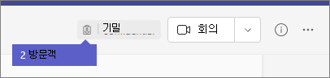

게스트 환경의 모양What the guest experience is like
=================================

방문자가 팀에 참가 하도록 초대 되 면 환영 전자 메일 메시지를 받습니다.When a guest is invited to join a team, they receive a welcome email message. 이 메시지에는 팀에 대 한 몇 가지 정보와 현재 구성원 인 것으로 예상 되는 내용이 포함 됩니다.This message includes some information about the team and what to expect now that they're a member. 게스트는 팀과 해당 채널에 액세스할 수 있으려면 먼저 전자 메일 메시지에서 **Microsoft 팀 열기** 를 선택 하 여 초대를 수락 해야 합니다.The guest must accept the invitation by selecting **Open Microsoft Teams** in the email message before they can access the team and its channels.
    

    
모든 팀 멤버가 팀 소유자가 게스트를 추가 하 고 게스트 이름을 제공 한다는 것을 알리기 위해 채널 스레드에서 메시지가 표시 됩니다.All team members see a message in the channel thread announcing that the team owner has added a guest and providing the guest's name. 팀의 모든 사용자가 쉽게 게스트를 식별할 수 있습니다.Everyone on the team can identify easily who is a guest. 샘플 팀의 다음 스크린샷은 "이 팀에 게스트 있음"이 표시 되 고 각 게스트 이름 옆에 **(게스트)** 레이블이 표시 됩니다.As shown in the following screenshot of a sample team, a banner indicates "This team has guests" and a **(Guest)** label appears next to each guest's name.
    

## 팀 구성원 및 게스트 기능 비교Comparison of team member and guest capabilities

다음 표에서는 조직의 팀 구성원과 해당 게스트에 대해 사용할 수 있는 팀 기능을 비교 합니다.The following table compares the Teams functionality available for an organization's team members and its guests.

|**팀의 기능****Capability in Teams**|**조직의 팀 사용자****Teams user in the organization**|**게스트 사용자****Guest user**|
|:-----|:-----|:-----|
|채널 만들기Create a channel     *팀 소유자는이 설정을 제어 합니다.**Team owners control this setting.*    |||
|개인 채팅 참가Participate in a private chat    |||
|채널 대화에 참여Participate in a channel conversation    |||
|메시지 게시, 삭제 및 편집Post, delete, and edit messages    |||
|채널 파일 공유Share a channel file    |||
|채팅 파일 공유Share a chat file    |||
|앱 추가 (탭, 인공 지능 또는 커넥터)Add apps (tabs, bots, or connectors)    |||
|모임 또는 액세스 일정 만들기Create meetings or access schedules    |||
|비즈니스용 OneDrive 저장소 액세스Access OneDrive for Business storage    |||
|테 넌 트 전체 및 팀/채널 게스트 액세스 정책 만들기Create tenant-wide and teams/channels guest access policies    |||
|Office 365 테 넌 트의 도메인 외부에 사용자 초대Invite a user outside the Office 365 tenant's domain    *팀 소유자는이 설정을 제어 합니다.**Team owners control this setting.*      |||
|팀 만들기Create a team    |||
|공개 팀 검색 및 참가Discover and join a public team    |||
|조직도 보기View organization chart    |||
|인라인 번역 사용Use inline translation    |||
   
다음 표에서는 다른 유형의 사용자와 비교 하 여 게스트로 사용할 수 있는 통화 및 모임 기능을 보여 줍니다.The following table shows the calling and meeting features available to guests, compared to other types of users.

| 통화 기능Calling feature | 방명록Guest | E1 및 E3 사용자E1 and E3 user | E5 및 Enterprise 음성 사용자E5 and Enterprise Voice user |
| --------------- | ----- | -------------- | -------------- |
| VOIP 통화VOIP calling | 예Yes | 예Yes | 예Yes |
| 그룹 통화Group calling | 예Yes | 예Yes | 예Yes |
| 지원 되는 핵심 통화 제어 (대기, 음소거, 비디오 켜기/끄기, 화면 공유)Core call controls supported (hold, mute, video on/off, screen sharing) | 예Yes | 예Yes | 예Yes |
| 대상 전송Transfer target | 예Yes | 예Yes | 예Yes |
| 통화를 양도할 수 있습니다.Can transfer a call | 예Yes | 예Yes | 예Yes |
| Consultative 전송 가능Can consultative transfer | 예Yes | 예Yes | 예Yes |
| VOIP를 통해 통화에 다른 사용자를 추가할 수 있습니다.Can add other users to a call via VOIP | 예Yes | 예Yes | 예Yes |
| 전화 번호를 통해 통화에 사용자를 추가할 수 있습니다.Can add users by phone number to a call | 아니요No | 아니요No | 예Yes |
| 대상 전달Forward target | 아니요No | 예Yes | 예Yes |
| 통화 그룹 대상Call group target | 아니요No | 예Yes | 예Yes |
| 응답 하지 않은 대상Unanswered target | 아니요No | 예Yes | 예Yes |
| 페더레이션된 통화 대상일 수 있습니다.Can be the target of a federated call | 아니요No | 예Yes | 예Yes |
| 페더레이션된 통화를 할 수 있습니다.Can make a federated call | 아니요No | 예Yes | 예Yes |
| 통화를 즉시 착신 전환할 수 있습니다.Can immediately forward their calls | 아니요No | 아니요No | 예Yes |
| 동시에 통화를 들을 수 있습니다.Can simultaneously ring their calls | 아니요No | 아니요No | 예Yes |
| 응답 하지 않은 통화를 라우팅할 수 있습니다.Can route their unanswered calls | 아니요No | 아니요No | 예Yes |
| 부재 중 통화는 보이스 메일로 이동할 수 있습니다.Missed calls can go to voicemail | 아니요No | 없음1No1 |예Yes |
| 통화를 받을 수 있는 전화 번호 사용Have a phone number that can receive calls | 아니요No | 아니요No | 예Yes |
| 전화 번호를 입력할 수 있음Can dial phone numbers | 아니요No | 아니요No | 예Yes |
| 통화 설정에 액세스할 수 있음Can access call settings | 아니요No | 아니요No | 예Yes |
| 보이스 메일 인사말 변경 가능Can change voicemail greeting | 아니요No | 없음1No1 | 예Yes |
| 벨 소리 변경 가능Can change ringtones | 아니요No | 아니요No  | 예Yes |
| TTY 지원Supports TTY | 아니요No | 아니요No | 예Yes |
| 대리인을 가질 수 있습니다.Can have delegates | 아니요No | 아니요No | 예Yes |
|  대리인 일 수 있음Can be a delegate | 아니요No | 아니요No | 예Yes |

1 이 기능은 곧 제공 될 예정입니다.1 This feature will be available soon.

> [!NOTE]
> Office 365 관리자는 게스트가 사용할 수 있는 기능을 제어 합니다.Office 365 admins control the features available to guests. 

## 자주하는 질문Frequently asked questions

### 내가 초대 받은 조직을 종료 하는 방법은 무엇 인가요?How do I leave an organization that I've been invited to?
게스트가 되지 않도록 하는 조직에 초대 된 경우 조직에서 나갈 수 있습니다.If you've been invited to an organization that you don't want to be a guest of, you can choose to leave the organization. 자세한 내용은 [게스트 사용자로 조직 나가기](https://docs.microsoft.com/azure/active-directory/b2b/leave-the-organization)로 이동 하세요.For more information, go to [Leave an organization as a guest user](https://docs.microsoft.com/azure/active-directory/b2b/leave-the-organization). 또는 조직의 관리자에 게 테 넌 트에서 사용자를 제거 하도록 요청할 수 있습니다.Alternatively, you can ask the admin of the organization to remove you from their tenant. 두 경우 모두 나중에 조직에 액세스 하려는 경우 테 넌 트에 다시 초대 해야 합니다.Note that in either case you'll need to be re-invited to the tenant if you want to access the organization in the future.

### 게스트는 팀 구성원과 동일한 기능을가지고 있나요?Do guests have the same capabilities as team members?
아니요.No. 게스트가 할 수 있는 작업과 수행할 수 없는 작업에 대 한 자세한 내용은이 문서의 [팀 구성원 및 게스트 기능 비교](#comparison-of-team-member-and-guest-capabilities) 를 참고 하세요.For more information about what a guest can and cannot do, go to [Comparison of team member and guest capabilities](#comparison-of-team-member-and-guest-capabilities) in this article.

### 게스트가 비즈니스용 OneDrive에 액세스할 수 있습니까?Do guests have access to OneDrive for Business?
아니요.No.

### 게스트가 SharePoint 파일에 액세스할 수 있습니까?Do guests have access to SharePoint files?
예.Yes.

### 게스트가 파일 내에서 검색할 수 있나요?Can guests search within files?
아니요.No.

### 게스트가 파일을 첨부할 수 있나요?Can guests attach files?
예, 게스트는 다음 두 가지 방법으로 파일을 첨부할 수 있습니다.Yes, a guest can attach files in these two ways:

   - 왼쪽 창에서 **파일** 을 선택한 다음 파일 위치로 이동 합니다.Select **Files** in the left pane, and then browse to the file location.
   - 컴퓨터에서 파일을 업로드 합니다.Upload files from their computer.

### 게스트가 개인 채팅에서 파일을 다운로드할 수 있나요?Can a guest download a file in a private chat?
예, 개인 채팅의 구성원 으로부터 파일을 받은 다음 데스크톱에 다운로드할 수 있습니다.Yes, they can receive a file from a member in a private chat, and then download it to their desktop.
