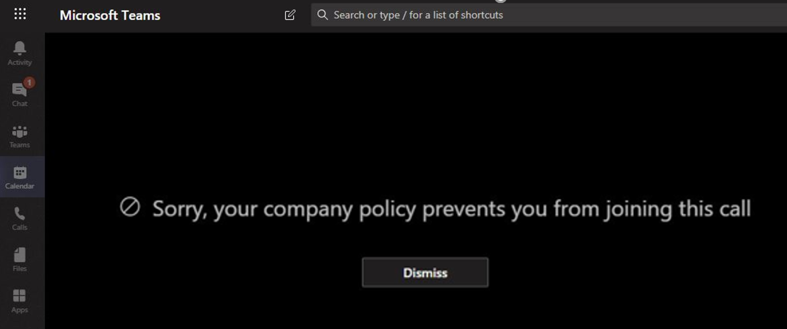

# Microsoft 팀의 정보 장벽

IB (정보 장벽)은 관리자가 개인 또는 그룹이 서로 통신 하는 것을 방지 하기 위해 구성할 수 있는 정책입니다. 예를 들어 한 부서가 다른 부서와 공유 하지 않아야 하는 정보를 처리 하거나 그룹 외부의 모든 사람과 통신 하는 것을 금지 또는 격리 해야 하는 경우에 유용 합니다.

> [!NOTE]
> - 테 넌 트 간에 정보 장벽 그룹을 만들 수 없습니다.
> - 봇을 사용 하 여 사용자를 추가 하는 것은 버전 1에서 지원 되지 않습니다.
> - 개인 채널은 사용자가 구성한 정보 장벽 정책에 따릅니다.
> - 신규: 팀에 연결 된 SharePoint 사이트에 대 한 정보 장벽 지원은 이제 비공개 미리 보기입니다. 비공개 미리 보기에 참여 하려면 [여기](https://forms.office.com/Pages/ResponsePage.aspx?id=v4j5cvGGr0GRqy180BHbR3-O9WDTKhhDtgWfphwS9YhUM0hJNklNRkZKMlhLNDRZNzlEQlVDSjdZVi4u) 를 클릭 하세요.

정보 장벽 정책은 또한 조회 및 검색을 방지 합니다. 따라서 통신 하지 않아야 하는 사람과 통신을 시도 하는 경우에는 사용자 선택에서 해당 사용자를 찾지 못합니다.

## 배경

정보 장벽에 대 한 기본 드라이버는 금융 서비스 업계에서 제공 합니다. 이 (가) 금융 업계 규정 기관 ([finra]( http://www.finra.org))은 회원 기업 내에 대 한 정보 장벽 및 충돌을 검토 하 고 그러한 충돌 (finra 2241, [부채 리서치 규정 15-31](http://www.finra.org/sites/default/files/Regulatory-Notice-15-31_0.pdf)을 관리 하는 방법에 대 한 지침을 제공 합니다.  

그러나 정보 장벽 때문에 다른 많은 영역에서 유용 하 게 사용할 수 있습니다. 다른 일반적인 시나리오는 다음과 같습니다.

- 교육: 한 학교에 있는 학생 들은 다른 학교 학생의 연락처 세부 정보를 찾을 수 없습니다.
- 법률: 한 클라이언트의 변호사에서 얻은 데이터의 기밀성을 다른 클라이언트를 나타내는 동일한 회사의 변호사에서 액세스 하지 못하도록 유지 관리 합니다.
- 정부: 부서와 그룹 간에 정보 액세스 및 제어가 제한 됩니다.
- 전문 서비스: 회사의 사용자 그룹은 고객 참여 중에 페더레이션 또는 게스트 액세스를 통해 클라이언트나 특정 고객에 게 채팅할 수만 있습니다.

예를 들어 Enrico는 은행 부문 세그먼트에 속하고 재무 관리자 세그먼트에 속합니다. 조직의 IB 정책은 이러한 두 세그먼트 간의 통신과 공동 작업을 차단 하기 때문에, Pradeep는 서로 통신할 수 없습니다. 그러나 Pradeep는 HR에 정영일와 통신할 수 있습니다.

## 정보 장애물을 사용 하는 경우

다음과 같은 경우에 정보 장벽을 사용 하는 것이 좋습니다.

- 팀에서 특정 다른 팀과 데이터를 교환 하거나 공유 하는 것을 방지 해야 합니다.
- 팀은 팀 외부의 모든 사람과 데이터를 교환 하거나 공유 하지 않아야 합니다.

정보 장벽 정책 평가 서비스는 통신이 정보 장벽 정책에 부합 하는지 여부를 확인 합니다.

## 정보 장벽 정책 관리

정보 장벽 정책은 PowerShell cmdlet을 사용 하 여 SCC (Microsoft 365 준수 센터)에서 관리 합니다. 자세한 내용은 [정보 장벽에 대 한 정책 정의](https://docs.microsoft.com/office365/securitycompliance/information-barriers-policies)를 참조 하세요.

> [!IMPORTANT]
> 정책을 설정 하거나 정의 하기 전에 **Microsoft 팀에서 범위 디렉터리 검색을 사용 하도록 설정 해야 합니다**. 범위 디렉터리 검색을 사용 하도록 설정한 후 24 시간 이상 기다려야 정보 장벽에 대 한 정책을 설정 하거나 정의 합니다. [정보 장벽에 대 한 필수 구성 요소에 대해 자세히 알아보세요](https://docs.microsoft.com/office365/securitycompliance/information-barriers-policies#prerequisites).

## 정보 장벽 관리자 역할

IB 준수 관리 역할은 정보 장벽 정책 관리를 담당 합니다. 이 역할에 대 한 자세한 내용은 [Microsoft 365 준수 센터의 사용 권한을](https://docs.microsoft.com/office365/securitycompliance/permissions-in-the-security-and-compliance-center)참조 하세요.

## 정보 장벽 트리거

정보 장벽 정책은 다음 팀 이벤트가 발생 했을 때 활성화 됩니다.

- **구성원은 팀에 추가 되며** , 팀에 사용자를 추가할 때마다 다른 팀 구성원의 정보 장벽 정책에 대해 사용자의 정책을 평가 해야 합니다. 사용자가 성공적으로 추가 된 후에는 사용자가 추가 검사 없이 팀의 모든 기능을 수행할 수 있습니다. 사용자의 정책이 팀에 추가 되는 것을 차단 하는 경우 사용자는 검색에 표시 되지 않습니다.

    

- **새로운 채팅 요청** -두 명 이상의 사용자 간에 새로운 채팅을 요청할 때마다 채팅은 정보 장벽 정책에 위반 되지 않도록 평가 됩니다. 대화가 정보 장벽 정책에 위배 되는 경우 대화가 시작 되지 않습니다.

    다음은 1:1 채팅의 예입니다.

     

    다음은 그룹 채팅의 예입니다.

    

- **사용자가 모임에 참가 하도록 초대 됨** -사용자가 모임에 참가 하도록 초대 하면 다른 팀 구성원의 정책에 대해 사용자의 정책이 평가 되 고 위반이 있는 경우 사용자가 모임에 참가할 수 없습니다.

    

- 두 명 이상의 사용자가 화면을 **공유** 하는 경우, 두 명 이상의 사용자가 화면을 공유할 때마다 화면 공유를 평가 하 여 다른 사용자의 정보 장벽 정책에 위배 되지 않도록 해야 합니다. 정보 장벽 정책이 위반 되는 경우 화면 공유는 허용 되지 않습니다.
- **사용자가 팀에 VOIP (voice call)를 배치** 합니다-사용자가 다른 사용자 또는 사용자 그룹에 게 음성 통화를 시작할 때마다 해당 통화가 다른 팀 구성원의 정보 장벽 정책을 위반 하지 않도록 평가 됩니다. 위반 사항이 있는 경우 음성 통화가 차단 됩니다.
- **팀의 게스트 사용자** -정보 장벽 정책은 팀의 게스트 사용자 에게도 적용 됩니다. 조직의 전체 주소 목록에서 게스트 사용자를 검색할 수 있어야 하는 경우 [Microsoft 365 그룹에서 게스트 액세스 관리](https://docs.microsoft.com/office365/admin/create-groups/manage-guest-access-in-groups?view=o365-worldwide#can-i-make-guest-objects-visible-in-the-global-address-list)를 참조 하세요. 게스트 사용자가 검색 가능 하면 [정보 장벽 정책을 정의할](https://docs.microsoft.com/office365/securitycompliance/information-barriers-policies)수 있습니다.

## 정책 변경으로 기존 채팅에 영향을 주는 방법

정보 장벽 정책 관리자가 정책을 변경 하거나 사용자 프로필 (예: 작업 변경 또는 유사한 이유)의 변경으로 인해 정책 변경이 적용 되는 경우 정보 장벽 정책 평가 서비스는 구성원을 자동으로 검색 하 여 팀 구성원이 정책을 위반 하지 않도록 합니다.

사용자 간에 기존 채팅 또는 다른 통신이 있는 경우 새 정책이 설정 되거나 기존 정책이 변경 되는 경우 서비스는 기존 통신을 평가 하 여 통신이 계속 발생할 수 있는지 확인 합니다.

- **1:1 채팅** -두 사용자 간의 통신이 더 이상 허용 되지 않음 (한 명 또는 두 명의 사용자에 게 정책 차단 통신이 적용 되는 경우), 추가 통신은 차단 되 고 채팅 대화는 읽기 전용 상태가 됩니다.

- **그룹 채팅** -한 사용자에서 그룹으로의 통신을 더 이상 사용할 수 없는 경우 (예: 사용자가 작업을 변경 하는 경우) 해당 정책을 위반 하는 다른 사용자와 함께 그룹 채팅에서 제거 되 고 그룹과의 추가 통신은 허용 되지 않을 수 있습니다. 사용자는 여전히 이전 대화 (읽기 전용)를 볼 수 있지만 그룹과 새로운 대화를 보거나 참여할 수는 없습니다. 통신을 차단 하는 새 정책이 여러 사용자에 게 적용 되는 경우 해당 정책의 영향을 받는 사용자가 그룹 채팅에서 제거 될 수 있습니다. 이전 대화를 계속 볼 수 있습니다.

이 예제에서는 조직 내의 다른 부서로 이동 하 고 그룹 채팅에서 제거 합니다.

  

더 이상 그룹 채팅에 메시지를 보낼 수 없습니다.

  

- **팀** -그룹에서 제거 된 모든 사용자가 팀에서 제거 되 고 기존 또는 새 대화를 보거나 참여할 수 없게 됩니다.

## 시나리오: 기존 채팅의 사용자가 차단 됩니다.

현재는 정보 장벽 정책이 다른 사용자를 차단 하는 경우 사용자에 게 다음과 같은 경험을 경험할 수 있습니다.

- **인물 정보 탭** -사용자가 대화 **상대** 탭에서 차단 된 사용자를 볼 수 없습니다.
- **사용자 선택** -차단 된 사용자는 사용자 선택에 표시 되지 않습니다.

    
    
- **활동 탭** -사용자가 차단 된 사용자의 **활동** 탭을 방문 하면 게시물이 표시 되지 않습니다. ( **활동** 탭에는 채널 게시물만 표시 되며, 두 사용자 사이에는 공통 채널이 없습니다.)
- **조직도** -사용자가 차단 된 사용자가 표시 되는 조직도에 액세스 하는 경우 차단 된 사용자가 조직도에 나타나지 않고 대신 오류 메시지가 표시 됩니다.
- **인물 정보** -사용자가 대화에 참여 하 고 있고 그 사용자가 차단 되는 경우 사용자 카드에 차단 된 사용자의 이름을 가리키면 다른 사용자에 게 오류 메시지가 표시 됩니다. 카드 (통화 및 채팅 등)에 나열 된 동작을 사용할 수 없습니다.
- **추천 연락처** -차단 된 사용자는 추천 연락처 목록 (새 사용자에 대해 표시 되는 초기 연락처 목록)에 표시 되지 않습니다.
- **채팅 연락처** -사용자가 채팅 대화 상대 목록에서 차단 된 사용자를 볼 수 있지만 차단 되는 사용자를 식별 하 고 사용자가 수행할 수 있는 유일한 동작은 삭제 하는 것입니다. 사용자는이를 클릭 하 여 이전 대화를 볼 수도 있습니다.
- **대화 상대** 에 게 전화-사용자가 차단 된 사용자를 볼 수 있으 나 차단 되는 사용자를 식별 하 고 사용자가 수행할 수 있는 유일한 동작은 삭제 하는 것입니다.
- **Skype To 팀 마이그레이션** -비즈니스용 skype 마이그레이션 중-모든 사용자는 정보 장벽 정책에 의해 차단 된 경우에도 팀으로 마이그레이션되고, 위에서 설명한 대로 처리 됩니다.

## 팀 정책 및 SharePoint 사이트

팀을 만들 때 SharePoint 사이트를 프로 비전 하 고 파일 환경을 위해 팀과 연결 합니다. 이 SharePoint 사이트 및 파일에 대 한 액세스는 조직의 IB를 허용 하 고, 예를 들어 IB에 대 한 IB 세그먼트와 일치 하는 사용자만 액세스를 허용할 수 있습니다. 파일 공유 시에도 IB 정책이 허용 됩니다.

예: Contoso Bank corporation에서 사용자 ' Sesha@contosobank.onmicrosoft.com '은 투자 은행 부문에 속하고 ' Nikita@contosobank.onmicrosoft.com ' 사용자는 세그먼트 권고에 속합니다. 조직의 IB 정책은 이러한 두 세그먼트 간의 통신과 공동 작업을 차단 합니다.
사용자가 투자 은행 부문에 대 한 팀을 만드는 경우 팀과이를 지 원하는 SharePoint 사이트는 투자 은행 부문 사용자만 액세스할 수 있습니다. 사이트 링크를가지고 있는 경우에도 사용자 Nikita 해당 사이트에 액세스할 수 없습니다.

## 필수 라이선스 및 사용 권한

계획 및 가격을 비롯 한 자세한 내용은 [라이선스 지침](https://docs.microsoft.com/office365/servicedescriptions/microsoft-365-service-descriptions/microsoft-365-tenantlevel-services-licensing-guidance/microsoft-365-security-compliance-licensing-guidance)을 참조 하세요.

## 추가 정보

- 정보 장벽에 대해 자세히 알아보려면 [정보 장벽](https://docs.microsoft.com/office365/securitycompliance/information-barriers)을 참조 하세요.

- 정보 장벽 정책을 설정 하려면 [정보 장벽에 대 한 정책 정의](https://docs.microsoft.com/office365/securitycompliance/information-barriers-policies)를 참조 하세요.

- 정보 장벽 정책을 편집 하거나 제거 하려면 [정보 장벽 정책 편집 (또는 제거)](https://docs.microsoft.com/microsoft-365/compliance/information-barriers-edit-segments-policies)을 참조 하세요.
