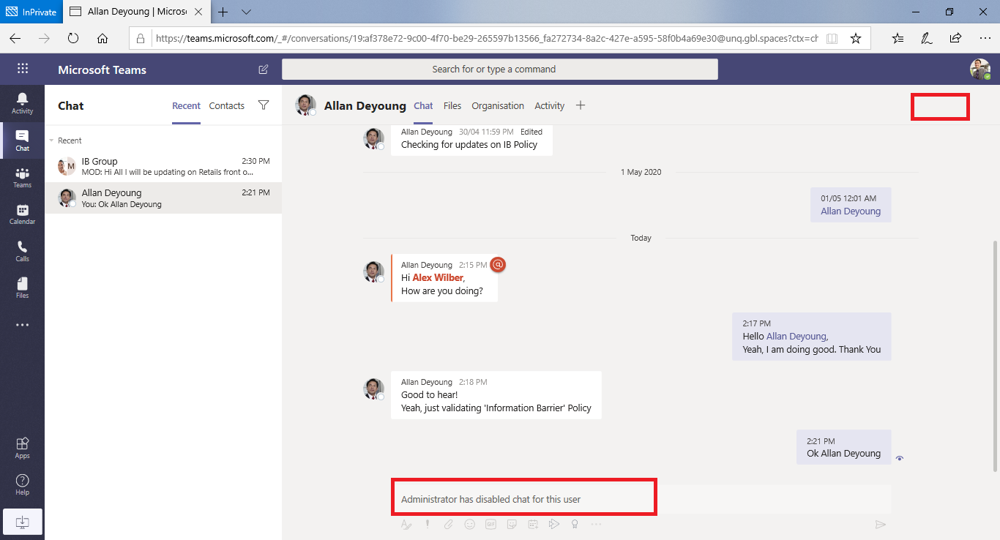

# <a name="information-barriers-in-microsoft-teams"></a>Microsoft Teams 정보 장벽

[Microsoft Purview OB(정보 장벽](/microsoft-365/compliance/information-barriers) )는 관리자가 개인 또는 그룹이 서로 통신하지 못하도록 구성할 수 있는 정책입니다. 예를 들어 한 부서가 다른 부서와 공유해서는 안 되는 정보를 처리하는 경우 IB가 유용합니다. IB는 그룹을 격리하거나 해당 그룹 외부의 사용자와 통신하지 못하도록 해야 하는 경우에도 유용합니다. Microsoft Teams 공유 채널은 정보 장벽에서 지원됩니다. 공유 유형에 따라 정보 장벽 정책은 특정 방식으로 공유를 제한할 수 있습니다. 공유 채널 및 정보 장벽 동작에 대한 자세한 내용은 [정보 장벽 및 공유 채널을 참조하세요](information-barriers-shared-channels.md).

Microsoft Teams 경우 정보 장벽은 다음과 같은 종류의 무단 협업을 결정하고 방지할 수 있습니다.

- 팀 또는 채널에 사용자 추가
- 팀 또는 채널 콘텐츠에 대한 사용자 액세스
- 1:1 및 그룹 채팅에 대한 사용자 액세스
- 모임에 대한 사용자 액세스
- 조회 및 검색을 방지합니다. 사용자는 사람 선택기에서 표시되지 않습니다.

>[!NOTE]
>- 테넌트 간에 정보 장벽 그룹을 만들 수 없습니다.
>- 봇, Azure Active Directory(Azure AD) 앱, API를 사용하여 활동 피드 알림을 보내고, 사용자를 추가하는 일부 API는 버전 1에서 지원되지 않습니다.
>- 개인 채널은 구성하는 정보 장벽 정책을 준수합니다.
>- Teams 연결된 SharePoint 사이트에 대한 장벽 지원에 대한 자세한 내용은 [Microsoft Teams 사이트와 연결된 세그먼트](/sharepoint/information-barriers#segments-associated-with-microsoft-teams-sites)를 참조하세요.

## <a name="background"></a>배경

LB의 주요 동인은 금융 서비스 산업에서 비롯됩니다. 금융산업규제당국([FINRA]( https://www.finra.org))은 회원사 내의 IB 및 이해상충을 검토하고 이러한 분쟁 관리에 대한 지침을 제공합니다(FINRA 2241, [부채 연구 규제 공지 15-31](https://www.finra.org/sites/default/files/Regulatory-Notice-15-31_0.pdf)).

그러나 IB를 도입한 이후 다른 많은 영역에서 유용하다는 것을 알게되었습니다. 다른 일반적인 시나리오는 다음과 같습니다.

- **교육**: 한 학교의 학생들은 다른 학교의 학생에 대한 연락처 세부 정보를 조회할 수 없습니다.
- **법률**: 한 고객의 변호사가 얻은 데이터의 기밀성을 유지하고 다른 고객을 대표하는 동일한 회사의 변호사가 데이터에 액세스하지 못하도록 방지합니다.
- **정부**: 정보 액세스 및 제어는 부서 및 그룹 전체에 걸쳐 제한됩니다.
- **Professional 서비스**: 회사의 사용자 그룹은 고객 참여 중에 게스트 액세스를 통해서만 클라이언트 또는 특정 고객과 채팅할 수 있습니다.

예를 들어 Enrico는 은행 세그먼트에 속하고 Pradeep은 재무 고문 세그먼트에 속합니다. Enrico와 Pradeep은 조직의 IB 정책이 이러한 두 세그먼트 간의 통신 및 협업을 차단하기 때문에 서로 통신할 수 없습니다. 그러나 엔리코와 프라딥은 HR에서 리와 통신할 수 있습니다.


## <a name="when-to-use-information-barriers"></a>정보 장벽을 사용하는 경우

다음과 같은 상황에서 IB를 사용할 수 있습니다.

- 팀은 특정 다른 팀과 데이터를 통신하거나 공유하지 못하도록 해야 합니다.
- 팀은 팀 외부의 누구와도 데이터를 통신하거나 공유해서는 안됩니다.

정보 장벽 정책 평가 서비스는 통신이 IB 정책을 준수하는지 여부를 결정합니다.

## <a name="managing-information-barrier-policies"></a>정보 장벽 정책 관리

IB 정책은 PowerShell cmdlet을 사용하여 Microsoft Purview 준수 포털(SCC)에서 관리됩니다. 자세한 내용은 [정보 장벽에 대한 정책 정의를 참조하세요](/office365/securitycompliance/information-barriers-policies).

>[!IMPORTANT]
>정책을 설정하거나 정의하기 전에 Microsoft Teams 범위가 지정된 디렉터리 검색을 사용하도록 설정해야 합니다. 정보 장벽에 대한 정책을 설정하거나 정의하기 전에 범위가 지정된 디렉터리 검색을 사용하도록 설정한 후 최소 몇 시간 정도 기다립니다. 자세한 내용은 [정보 장벽 정책 정의를 참조하세요](/office365/securitycompliance/information-barriers-policies#prerequisites).

## <a name="information-barriers-administrator-role"></a>정보 장벽 관리자 역할

IB 규정 준수 관리 역할은 IB 정책 관리를 담당합니다. 이 역할에 대한 자세한 내용은 [Microsoft Purview 규정 준수 포털의 사용 권한을 참조하세요](/office365/securitycompliance/permissions-in-the-security-and-compliance-center).

## <a name="information-barrier-triggers"></a>정보 장벽 트리거

IB 정책은 다음 Teams 이벤트가 발생할 때 활성화됩니다.

- **구성원이 팀에 추가됩니다**. 팀에 사용자를 추가할 때마다 다른 팀 구성원의 IB 정책에 대해 사용자의 정책을 평가해야 합니다. 사용자가 성공적으로 추가되면 추가 검사 없이 팀의 모든 기능을 수행할 수 있습니다. 사용자의 정책이 팀에 추가되지 못하도록 차단하는 경우 사용자는 검색에 표시되지 않습니다.

    

- **새 채팅이 요청됨**: 사용자가 하나 이상의 다른 사용자와 새 채팅을 요청할 때마다 IB 정책을 위반하지 않는지 확인하기 위해 채팅이 평가됩니다. 대화가 IB 정책을 위반하는 경우 대화가 시작되지 않습니다.

    다음은 1:1 채팅의 예입니다.

    

    다음은 그룹 채팅의 예입니다.

    

- **사용자가 모임에 참가하도록 초대됩니다**. 사용자가 모임에 참가하도록 초대되면 사용자에게 적용되는 IB 정책이 다른 팀 구성원에게 적용되는 IB 정책에 대해 평가됩니다. 위반이 있는 경우 사용자는 모임에 참가할 수 없습니다.

    

- **두 명 이상의 사용자 간에 화면이 공유됩니다**. 사용자가 다른 사용자와 화면을 공유하는 경우 다른 사용자의 IB 정책을 위반하지 않도록 공유를 평가해야 합니다. IB 정책을 위반하면 화면 공유가 허용되지 않습니다.

    정책이 적용되기 전에 화면 공유의 예는 다음과 같습니다.

    

    정책이 적용된 후 화면 공유의 예는 다음과 같습니다. 화면 공유 및 통화 아이콘이 표시되지 않습니다.

    

- **사용자가 Teams 전화 통화를** 합니다. 사용자가 VOIP를 통해 다른 사용자 또는 사용자 그룹에 대한 음성 통화를 시작할 때마다 다른 팀 구성원의 IB 정책을 위반하지 않도록 통화가 평가됩니다. 위반이 있으면 음성 통화가 차단됩니다.

- **Teams 게스트**: Teams 게스트에게도 IB 정책이 적용됩니다. 조직의 전역 주소 목록에서 게스트를 검색할 수 있어야 하는 경우 [Microsoft 365 그룹 게스트 액세스 관리를](/microsoft-365/admin/create-groups/manage-guest-access-in-groups) 참조하세요. 게스트를 검색할 수 있게 되면 [IB 정책을 정의](/office365/securitycompliance/information-barriers-policies)할 수 있습니다.

## <a name="how-policy-changes-impact-existing-chats"></a>정책 변경이 기존 채팅에 미치는 영향

IB 정책 관리자가 정책을 변경하거나 사용자 프로필 변경(예: 작업 변경)으로 인해 정책 변경이 활성화된 경우 정보 장벽 정책 평가 서비스는 구성원을 자동으로 검색하여 팀의 구성원이 정책을 위반하지 않도록 합니다.

기존 채팅 또는 사용자 간의 다른 통신이 있고 새 정책이 설정되거나 기존 정책이 변경된 경우 서비스는 기존 통신을 평가하여 통신이 계속 수행되도록 합니다. 

- **1:1 채팅**: 두 사용자 간의 통신이 더 이상 허용되지 않는 경우(통신을 차단하는 정책의 한 명 또는 두 사용자 모두에 대한 애플리케이션으로 인해) 추가 통신이 차단됩니다. 기존 채팅 대화는 읽기 전용이 됩니다.

    다음은 채팅이 표시되는 것을 보여 주는 예제입니다.

    

    다음은 채팅을 사용하지 않도록 설정한 것을 보여 주는 예제입니다.

    

- **그룹 채팅**: 한 사용자에서 그룹으로의 통신이 더 이상 허용되지 않는 경우(예: 사용자가 작업을 변경했기 때문에) 참여가 정책을 위반하는 다른 사용자와 함께 그룹 채팅에서 제거될 수 있으며 그룹과의 추가 통신은 허용되지 않습니다. 사용자는 여전히 이전 대화를 볼 수 있지만 그룹과의 새 대화를 보거나 참여할 수 없습니다. 통신을 방지하는 새 정책이나 변경된 정책이 둘 이상의 사용자에게 적용되는 경우 정책의 영향을 받는 사용자는 그룹 채팅에서 제거될 수 있습니다. 그들은 여전히 오래된 대화를 볼 수 있습니다.

  이 예제에서 Enrico는 조직 내의 다른 부서로 이동하여 그룹 채팅에서 제거됩니다.

  

  Enrico는 더 이상 그룹 채팅에 메시지를 보낼 수 없습니다.

  

- **팀**: 그룹에서 제거된 모든 사용자는 팀에서 제거되며 기존 또는 새 대화를 보거나 참여할 수 없습니다.

## <a name="scenario-a-user-in-an-existing-chat-becomes-blocked"></a>시나리오: 기존 채팅의 사용자가 차단됨

현재 사용자는 IB 정책이 다른 사용자를 차단하는 경우 다음과 같은 시나리오를 경험합니다.

- **사용자 탭**: **사용자 탭에서** 차단된 사용자를 볼 수 없습니다.

- **사람 선택:** 차단된 사용자는 사람 선택기에서 표시되지 않습니다.

    

- **활동 탭**: 사용자가 차단된 사용자의 **활동** 탭을 방문하면 게시물이 표시되지 않습니다. ( **활동** 탭에는 채널 게시물만 표시되고 두 사용자 간에 공통 채널이 없습니다.)

    다음은 차단된 활동 탭 보기의 예입니다.

    

- **조직도**: 사용자가 차단된 사용자가 표시되는 조직도에 액세스하면 차단된 사용자가 조직도에 표시되지 않습니다. 대신 오류 메시지가 표시됩니다.

- **사용자 카드**: 사용자가 대화에 참여하고 나중에 사용자가 차단된 경우 차단된 사용자의 이름을 마우스로 가리킬 때 다른 사용자에게 사용자 카드 대신 오류 메시지가 표시됩니다. 카드에 나열된 작업(예: 통화 및 채팅)을 사용할 수 없습니다.

- **추천 연락처**: 차단된 사용자가 제안된 연락처 목록(새 사용자에 대해 표시되는 초기 연락처 목록)에 표시되지 않습니다.

- **채팅 연락처**: 사용자는 채팅 연락처 목록에서 차단된 사용자를 볼 수 있지만 차단된 사용자는 식별됩니다. 차단된 사용자에 대해 사용자가 수행할 수 있는 유일한 작업은 삭제하는 것입니다. 사용자는 이전 대화를 볼 수 있도록 선택할 수도 있습니다.

- **통화 연락처**: 사용자는 통화 연락처 목록에서 차단된 사용자를 볼 수 있지만 차단된 사용자는 식별됩니다. 사용자가 블록 사용자에 대해 수행할 수 있는 유일한 작업은 삭제하는 것입니다.

    다음은 통화 연락처 목록에서 차단된 사용자의 예입니다.

    > [!div class="mx-imgBorder"]
    > 

    다음은 통화 콘텐츠 목록에서 사용자에 대해 사용하지 않도록 설정된 채팅의 예입니다.

    > [!div class="mx-imgBorder"]
    > 

- **Teams 마이그레이션에 대한 Skype**: 비즈니스용 Skype Teams 마이그레이션하는 동안 IB 정책에 의해 차단된 모든 사용자도 Teams 마이그레이션됩니다. 그런 다음 이러한 사용자는 위에서 설명한 대로 처리됩니다.

## <a name="teams-policies-and-sharepoint-sites"></a>Teams 정책 및 SharePoint 사이트

팀이 만들어지면 SharePoint 사이트가 프로비전되고 파일 환경에 대한 Microsoft Teams 연결됩니다. 정보 장벽 정책은 기본적으로 이 SharePoint 사이트 및 파일에 적용되지 않습니다. SharePoint 및 OneDrive 정보 장벽을 사용하도록 설정하려면 SharePoint 문서에서 [정보 장벽 사용](/sharepoint/information-barriers#enable-sharepoint-and-onedrive-information-barriers-in-your-organization)의 지침과 단계를 따릅니다.

## <a name="information--barrier-modes-and-teams"></a>정보 장벽 모드 및 Teams

정보 장벽 모드는 팀에 추가하거나 팀에서 제거할 수 있는 사용자를 강화하는 데 도움이 됩니다. Teams 정보 장벽을 사용하는 경우 다음 IB 모드가 지원됩니다.

- **열기**: 이 구성은 정보 장벽을 사용하도록 설정하기 전에 프로비전된 모든 기존 그룹에 대한 기본 IB 모드입니다. 이 모드에는 적용 가능한 IB 정책이 없습니다.
- **암시적**: 이 구성은 정보 장벽을 사용하도록 설정한 후 팀이 프로비전될 때 기본 IB 모드입니다. 암시적 모드를 사용하면 그룹에 호환되는 모든 사용자를 추가할 수 있습니다.
- **소유자 조정:** 이 모드는 소유자가 조정하는 호환되지 않는 세그먼트 사용자 간의 공동 작업을 허용하려는 경우 팀에서 설정됩니다. 팀 소유자는 IB 정책에 따라 새 멤버를 추가할 수 있습니다.

테넌트에서 정보 장벽 정책을 활성화하기 전에 만든 Teams 기본적으로 자동으로 *열기* 모드로 설정됩니다. 테넌트에서 IB 정책을 활성화한 후에는 기존 팀의 모드를 *암시적으로* 업데이트하여 기존 팀이 IB 규격인지 확인해야 합니다.

세그먼트에 사용하려는 모드에 해당하는 *InformationBarrierMode* 매개 변수와 함께 [Set-UnifiedGroup](/powershell/module/exchange/set-unifiedgroup) cmdlet을 사용합니다. *InformationBarrierMode* 매개 변수에 허용되는 값 목록은 *Open*, *Implicit* 및 *Owner Moderated* 입니다.

예를 들어 Microsoft 365 그룹에 대한 *암시적* 모드를 구성하려면 다음 PowerShell 명령을 사용합니다.

```powershell
Set-UnifiedGroup -InformationBarrierMode Implicit
```

모든 기존 팀에 대해 Open에서 Implicit으로 모드를 업데이트하려면 이 [PowerShell 스크립트](information-barriers-mode-script.md)를 사용합니다.

조직의 규정 준수 요구 사항을 충족하도록 기존 Teams 연결된 그룹에서 열기 모드 구성을 변경하는 경우 Teams 팀에 연결된 연결된 SharePoint 사이트에 대한 [IB 모드를 업데이트](/sharepoint/information-barriers#view-and-manage-ib-modes-as-an-administrator-with-sharepoint-powershell)해야 합니다.

## <a name="required-licenses-and-permissions"></a>필수 라이선스 및 사용 권한

라이선스 및 사용 권한, 계획 및 가격 책정에 대한 자세한 내용은 [보안 & 규정 준수에 대한 Microsoft 365 라이선스 지침을](/office365/servicedescriptions/microsoft-365-service-descriptions/microsoft-365-tenantlevel-services-licensing-guidance/microsoft-365-security-compliance-licensing-guidance) 참조하세요.

## <a name="known-issues"></a>알려진 문제

- **사용자는 임시 모임에 참가할 수 없습니다**. IB 정책을 사용하는 경우 모임 명단의 크기가 [모임 참석 제한](limits-specifications-teams.md)보다 큰 경우 사용자는 모임에 참가할 수 없습니다. 근본 원인은 IB 검사가 사용자를 모임 채팅 명단에 추가할 수 있는지 여부에 의존하며, 명단에 추가할 수 있는 경우에만 모임에 참가할 수 있다는 것입니다. 모임에 참가하는 사용자는 해당 사용자를 명단에 추가합니다. 따라서 되풀이 모임의 경우 명단을 빠르게 채울 수 있습니다. 채팅 명단이 [모임 참석 한도](limits-specifications-teams.md)에 도달하면 추가 사용자를 모임에 추가할 수 없습니다. 조직에 대해 IB를 사용하도록 설정하고 채팅 명단이 모임에 가득 차 있는 경우 새 사용자(아직 명단에 없는 사용자)는 모임에 참가할 수 없습니다. 그러나 조직에 대해 IB를 사용하도록 설정하지 않고 모임 채팅 명단이 가득 차면 모임에 채팅 옵션이 표시되지 않지만 새 사용자(아직 명단에 없는 사용자)가 모임에 참가할 수 있습니다. 단기적인 해결 방법은 모임 채팅 명단에서 비활성 멤버를 제거하여 새 사용자를 위한 공간을 만드는 것입니다. 그러나 나중에 모임 채팅 명단의 크기를 늘릴 것입니다.
- **사용자는 채널 모임에 참가할 수 없습니다**. IB 정책을 사용하도록 설정하면 사용자가 팀의 구성원이 아닌 경우 채널 모임에 참가할 수 없습니다. 근본 원인은 IB 검사가 사용자를 모임 채팅 명단에 추가할 수 있는지 여부에 의존하며, 명단에 추가할 수 있는 경우에만 모임에 참가할 수 있다는 것입니다. 채널 모임의 채팅 스레드는 팀/채널 구성원만 사용할 수 있으며 비회원은 채팅 스레드를 보거나 액세스할 수 없습니다. 조직에 대해 IB를 사용하도록 설정하고 팀 구성원이 아닌 사용자가 채널 모임에 참가하려고 하면 해당 사용자가 모임에 참가할 수 없습니다. 그러나 조직에 대해 IB를 사용하도록 설정하지 않고 팀 구성원이 아닌 사용자가 채널 모임에 참가하려고 하면 사용자가 모임에 참가할 수 있지만 모임에 채팅 옵션이 표시되지 않습니다.
- **조직에서 허용되는 최대 세그먼트 수**: 각 조직은 IB 정책을 구성할 때 최대 100개의 세그먼트를 설정할 수 있습니다. 구성할 수 있는 정책 수에는 제한이 없습니다.
- **IB 정책은 페더레이션된 사용자에 대해 작동하지 않습니다**. 외부 조직과의 페더레이션을 허용하는 경우 해당 조직의 사용자는 IB 정책에 의해 제한되지 않습니다. 조직의 사용자가 외부 페더레이션된 사용자가 구성한 채팅 또는 모임에 참가하는 경우 IB 정책도 조직의 사용자 간 통신을 제한하지 않습니다.

## <a name="more-information"></a>추가 정보

- IB에 대한 자세한 내용은 [정보 장벽을 참조하세요](/office365/securitycompliance/information-barriers).
- IB 정책을 설정하려면 [정보 장벽이 있는 시작 참조하세요](/office365/securitycompliance/information-barriers-policies).
- IB 정책을 편집하거나 제거하려면 [정보 장벽 정책 관리를](/microsoft-365/compliance/information-barriers-edit-segments-policies) 참조하세요.
- [정보 장벽 및 공유 채널](information-barriers-shared-channels.md)

## <a name="availability"></a>가용성

Teams 정보 장벽은 공용, GCC, GCC - 높음 및 DOD 클라우드에서 사용할 수 있습니다.
