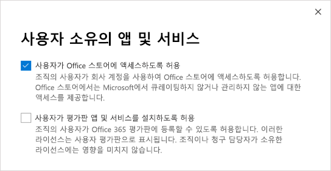

Microsoft Teams 상용 클라우드 평가판 관리
=======================================================

Microsoft Teams 상용 클라우드 평가판은 조직에 속한 Microsoft Teams 라이선스가 없는 기존의 Office 365 사용자에게 제품의 1년 평가판을 시작할 수 있는 권한을 제공합니다. 관리자는 조직의 사용자에 대해 이 기능을 설정 하거나 해제할 수 있습니다.

> [!IMPORTANT]
> Microsoft Teams Commercial 클라우드 평가판은 2020년 1월부터 Microsoft Teams Exploratory로 대체됩니다. 이 새로운 제품에 대해 알아보려면 [Teams Exploratory 라이센스 관리](teams-exploratory.md)를 읽어보세요.

## 제안에 포함된 사항

이 제안에 포함된 서비스 플랜은 다음과 같습니다.

- Exchange Foundation
- Office 365 플랜 1의 흐름
- Forms
- Microsoft Planner
- Microsoft Teams (Teams1, Teams IW)
- Office 
- Office 365 플랜 1용 PowerApps
- SharePoint Online Kiosk
- Stream
- Sway
- Whiteboard
- Yammer Enterprise 

평가판은 전체 조직에 1년의 평가판 구독을 부여합니다. 할당된 각 라이선스에 대해 평가판은 2GB의 SharePoint Online 저장소를 배정합니다. 

## 사용할 수 있는 사용자

(Microsoft 365 관리 센터에서) 사용자는 앱과 평가판을 사용할 수 있게 등록하도록 설정을 해야 합니다. 자세한 내용은 이 문서 뒷부분의 [평가판 관리](#manage-the-trial) 부분을 참조하십시오. 

Teams를 포함하는 Office 365 라이선스가 없는 사용자는 Microsoft Teams 상용 클라우드 평가판을 시작할 수 있습니다. 예를 들어 사용자에게 Office 365 Business(Teams가 포함되지 않음)가 있는 경우 평가판을 사용할 수 있습니다.

## 사용할 수 없는 사용자

사용자가 Syndication 파트너 고객이거나 GCC, GCC High, DoD 또는 EDU 고객인 경우 사용자의 조직은 평가판을 사용할 수 없습니다.

조직에서 Microsoft Teams 상용 평가판을 사용할 수 없는 경우 **사용자가 평가판 앱 및 서비스를 설치하도록 허용** 스위치가 표시되지 않습니다.

## 사용자가 평가판에 등록하는 방법

적격 사용자는 Teams에 로그인하여 평가판에 등록할 수 있습니다([teams.microsoft.com](https://teams.microsoft.com)). 평가판을 시작하기 위한 다음의 화면이 표시됩니다. 

조직 내의 모든 평가판은 시작일과 종료일이 동일하고 이는 첫 번째 사용자가 평가판에 등록한 날짜입니다. 예를 들어 사용자 A가 2019년 1월 25일에 최초 평가판을 시작하고 사용자 B가 2019년 6월 3일에 평가판을 시작하는 경우 두 사용자의 평가판은 모두 2020년 1월 25일에 만료됩니다.

## 평가판 관리

Teams 평가판은 개별 최종 사용자가 시작하고 최종 사용자 직원을 대신해 Teams 평가판을 시작할 수 없습니다.

관리자는 최종 사용자가 조직 내에서 평가판 앱과 서비스를 시작하는 기능을 사용하지 않도록 설정할 수 있습니다. 현재 이 문서에서 설명하는 평가판은 이 범주의 유일한 평가판이지만, 향후에 다른 유사한 프로그램에 적용될 수 있습니다. 

### 사용자가 평가판 앱 및 서비스를 설치하지 못하도록 방지

사용자는 평가판 앱과 서비스를 설치하는 기능을 해제할 수 있습니다.

1. [Microsoft 365 관리 센터](https://portal.office.com/adminportal/home)에서 **설정** > **설정**으로 이동하여 **서비스**를 선택한 다음 **사용자 소유 앱 및 서비스**를 선택합니다.

    

2. **사용자가 평가판 앱 및 서비스를 설치하도록 허용** 확인란을 해제합니다.

    

### Teams를 포함하는 라이선스가 있는 사용자의 평가판 상태 관리

Teams를 포함하는 라이선스가 할당된 사용자는 평가판을 사용할 수 없습니다. Teams 서비스 플랜을 사용할 수 있도록 설정한 경우 사용자는 로그인을 하고 Teams를 사용할 수 있습니다. 서비스 플랜을 사용하지 않도록 설정한 경우 사용자가 로그인할 수 없으며 평가판 옵션이 표시 되지 않습니다.

Teams로의 액세스를 해제하려면:

1. Microsoft 365 관리 센터에서 **사용자** > **활성 사용자**를 선택합니다.

2. 사용자 이름 옆에 있는 상자를 선택합니다.

3. 우측의 **제품 라이선스** 행에서 **편집**을 선택합니다.

4. **제품 라이선스** 창에서 토글 스위치를 **해제**로 전환합니다.

    

### 평가판을 이미 요청한 사용자의 Teams 가용성 관리

사용자가 Teams 평가판 라이선스를 요청한 경우 라이선스 또는 서비스 플랜을 제거하여 이를 제거할 수 있습니다.

평가판 라이선스를 해제하려면 다음을 수행합니다.

1. Microsoft 365 관리 센터에서 **사용자** > **활성 사용자**를 선택합니다.

2. 사용자 이름 옆에 있는 상자를 선택합니다.

3. 우측의 **제품 라이선스** 행에서 **편집**을 선택합니다.

4. **제품 라이선스** 창에서 토글 스위치를 **해제**로 전환합니다.

    
    
    >[!Note]
    >Microsoft Teams의 평가판 토글 스위치는 조직의 첫 사용자가 평가판에 등록한 후에 표시됩니다.

### 평가판 라이선스가 있는 사용자의 Teams 관리

정규 유료 라이선스가 있는 사용자를 관리하는 것과 같은 방식으로 평가판 라이선스가 있는 사용자를 관리할 수 있습니다. 자세한 내용은 [조직에서 Microsoft Teams 설정 관리](enable-features-office-365.md)를 참조하세요.

### 평가판 라이선스에서 사용자 업그레이드

평가판 라이선스에서 사용자를 업그레이드하려면 다음을 수행합니다.

1. Teams를 포함하는 구독을 구입합니다.

2. 사용자의 Teams 평가판 구독을 제거합니다.

3. 새로 구매한 라이선스를 할당합니다.

자세한 내용은 [Microsoft Teams 사용을 위한 Office 365 라이선싱](Office-365-licensing.md)을 참조하세요.

> [!NOTE]
> 평가판이 종료되고 사용자가 Teams을 포함하는 구독으로 즉시 업그레이드 되지 않는 경우 사용자의 데이터는 제거되지 않습니다. 사용자는 여전히 Azure Active Directory에 존재하고 Teams 내의 모든 데이터는 계속 유지됩니다. Teams의 기능을 다시 사용할 수 있도록 사용자에게 새 라이선스가 할당되면 모든 콘텐츠가 계속 존재하게 됩니다. 

### 레거시 Microsoft Teams 평가판 라이선스 제거

2019년 4월 22일부로 사용자는 최신 Microsoft Teams 상용 클라우드 평가판 라이선스를 요청할 수 있습니다. 조직에서 사용자를 레거시 평가판 라이선스에서 최신 라이센스로 이동하려면 먼저 각 사용자의 레거시 Microsoft Teams 평가판 라이선스를 제거 해야 합니다. 레거시 라이선스가 제거되면 해당 사용자는 업데이트된 Microsoft Teams 상용 클라우드 평가판 라이선스를 요청할 수 있습니다.

- PowerShell을 통해 이 라이선스를 제거하려면 [Office 365 PowerShell을 사용하여 사용자 계정에서 라이선스 제거](https://docs.microsoft.com/office365/enterprise/powershell/remove-licenses-from-user-accounts-with-office-365-powershell)를 참조하세요.

- 관리 포털을 통해 이 라이선스를 제거하려면 [비즈니스용 Office 365의 사용자 라이선스 제거](https://docs.microsoft.com/office365/admin/subscriptions-and-billing/remove-licenses-from-users?view=o365-worldwide)를 참조하세요. 
