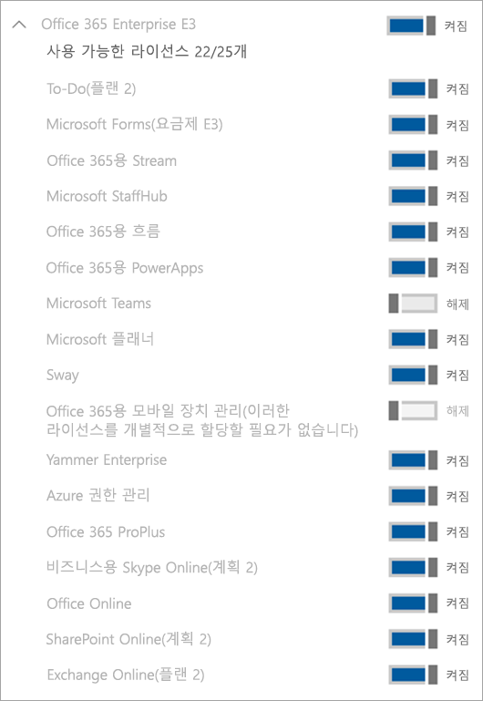

Microsoft Teams 상용 클라우드 평가판 관리Manage the Microsoft Teams Commercial Cloud Trial offer
=======================================================

Microsoft Teams 상용 클라우드 평가판은 조직에 속한 Microsoft Teams 라이선스가 없는 기존의 Office 365 사용자에게 제품의 1년 평가판을 시작할 수 있는 권한을 제공합니다.The Microsoft Teams Commercial Cloud Trial offers existing Office 365 users in your organization who are not licensed for Microsoft Teams to initiate a 1-year trial of the product. 관리자는 조직의 사용자에 대해 이 기능을 설정 하거나 해제할 수 있습니다.Admins can switch this feature on or off for users in their organization.

> [!IMPORTANT]
> Microsoft Teams Commercial 클라우드 평가판은 2020년 1월부터 Microsoft Teams Exploratory로 대체됩니다.The Microsoft Teams Commercial Cloud Trial will be replaced by Microsoft Teams Exploratory beginning in January 2020. 이 새로운 제품에 대해 알아보려면 [Teams Exploratory 라이센스 관리](teams-exploratory.md)를 읽어보세요.To learn about this new offer, read [Manage Teams Exploratory license](teams-exploratory.md).

## 제안에 포함된 사항What's in the offer

이 제안에 포함된 서비스 플랜은 다음과 같습니다.The service plans included in this offer are:

- Exchange FoundationExchange Foundation
- Office 365 플랜 1의 흐름Flow for Office 365 Plan 1
- FormsForms
- Microsoft PlannerMicrosoft Planner
- Microsoft Teams (Teams1, Teams IW)Microsoft Teams (Teams1, Teams IW)
- OfficeOffice 
- Office 365 플랜 1용 PowerAppsPowerApps for Office 365 Plan 1
- SharePoint Online KioskSharePoint Online Kiosk
- StreamStream
- SwaySway
- WhiteboardWhiteboard
- Yammer EnterpriseYammer Enterprise 

평가판은 전체 조직에 1년의 평가판 구독을 부여합니다.The trial grants a one-year trial subscription to your entire organization. 할당된 각 라이선스에 대해 평가판은 2GB의 SharePoint Online 저장소를 배정합니다.For each license assigned, the trial allocates 2 GB of SharePoint Online storage. 

## 사용할 수 있는 사용자Who is eligible

(Microsoft 365 관리 센터에서) 사용자는 앱과 평가판을 사용할 수 있게 등록하도록 설정을 해야 합니다.Users must be enabled to sign up for apps and trials (in the Microsoft 365 admin center). 자세한 내용은 이 문서 뒷부분의 [평가판 관리](#manage-the-trial) 부분을 참조하십시오.For more information, see [Manage the trial](#manage-the-trial), later in this article. 

Teams를 포함하는 Office 365 라이선스가 없는 사용자는 Microsoft Teams 상용 클라우드 평가판을 시작할 수 있습니다.Users who do not have an Office 365 license that includes Teams can initiate the Microsoft Teams Commercial Cloud Trial offer. 예를 들어 사용자에게 Office 365 Business(Teams가 포함되지 않음)가 있는 경우 평가판을 사용할 수 있습니다.For example, if a user has Office 365 Business (which doesn't include Teams), they are eligible for the trial.

## 사용할 수 없는 사용자Who is not eligible

사용자가 Syndication 파트너 고객이거나 GCC, GCC High, DoD 또는 EDU 고객인 경우 사용자의 조직은 평가판을 사용할 수 없습니다.Your organization is not eligible for the trial if you are a Syndication Partner Customer or if you are a GCC, GCC High, DoD, or EDU customer.

조직에서 Microsoft Teams 상용 평가판을 사용할 수 없는 경우 **사용자가 평가판 앱 및 서비스를 설치하도록 허용** 스위치가 표시되지 않습니다.If your organization is ineligible for the Microsoft Teams Commercial Cloud Trial offer, you will not see the **Let users install trial apps and services** switch.

## 사용자가 평가판에 등록하는 방법How users sign up for the trial

적격 사용자는 Teams에 로그인하여 평가판에 등록할 수 있습니다([teams.microsoft.com](https://teams.microsoft.com)).Eligible users can sign up for the trial offer by signing in to Teams ([teams.microsoft.com](https://teams.microsoft.com)). 평가판을 시작하기 위한 다음의 화면이 표시됩니다.They will see the following screen to start the trial. 

조직 내의 모든 평가판은 시작일과 종료일이 동일하고 이는 첫 번째 사용자가 평가판에 등록한 날짜입니다.All trials within your organization share the same start and end dates, which is the date the first user signed up for the trial. 예를 들어 사용자 A가 2019년 1월 25일에 최초 평가판을 시작하고 사용자 B가 2019년 6월 3일에 평가판을 시작하는 경우 두 사용자의 평가판은 모두 2020년 1월 25일에 만료됩니다.For example, if user A starts the first trial on January 25, 2019 and user B starts a trial on June 3, 2019, both users' trial will expire on January 25, 2020.

## 평가판 관리Manage the trial

Teams 평가판은 개별 최종 사용자가 시작하고 최종 사용자 직원을 대신해 Teams 평가판을 시작할 수 없습니다.The Teams Trial is meant to be initiated by individual end users, and you may not initiate the Teams Trial offer on behalf of end-user employees.

관리자는 최종 사용자가 조직 내에서 평가판 앱과 서비스를 시작하는 기능을 사용하지 않도록 설정할 수 있습니다.Admins can disable the ability for end users to claim trial apps and services within their organization. 현재 이 문서에서 설명하는 평가판은 이 범주의 유일한 평가판이지만, 향후에 다른 유사한 프로그램에 적용될 수 있습니다.Currently, the trial described in this article is the only trial in this category, but it might apply to other similar programs in the future. 

### 사용자가 평가판 앱 및 서비스를 설치하지 못하도록 방지Prevent users from installing trial apps and services

사용자는 평가판 앱과 서비스를 설치하는 기능을 해제할 수 있습니다.You can turn off a user’s ability to install trial apps and services.

1. [Microsoft 365 관리 센터](https://portal.office.com/adminportal/home)에서 **설정** > **설정**으로 이동하여 **서비스**를 선택한 다음 **사용자 소유 앱 및 서비스**를 선택합니다.From the [Microsoft 365 admin center](https://portal.office.com/adminportal/home), go to **Settings** > **Settings**, select **Services**, and then select **User owned apps and services**.

    

2. **사용자가 평가판 앱 및 서비스를 설치하도록 허용** 확인란을 해제합니다.Clear the **Let users install trial apps and services** check box.

    

### Teams를 포함하는 라이선스가 있는 사용자의 평가판 상태 관리Manage trial availability for a user with a license that includes Teams

Teams를 포함하는 라이선스가 할당된 사용자는 평가판을 사용할 수 없습니다.A user who is assigned a license that includes Teams is not eligible for the trial. Teams 서비스 플랜을 사용할 수 있도록 설정한 경우 사용자는 로그인을 하고 Teams를 사용할 수 있습니다.When the Teams service plan is enabled, the user can sign in and use Teams. 서비스 플랜을 사용하지 않도록 설정한 경우 사용자가 로그인할 수 없으며 평가판 옵션이 표시 되지 않습니다.If the service plan is disabled, the user cannot sign in and is not presented with the trial option either.

Teams로의 액세스를 해제하려면:To turn off access to Teams:

1. Microsoft 365 관리 센터에서 **사용자** > **활성 사용자**를 선택합니다.In the Microsoft 365 admin center, select **Users** > **Active users**.

2. 사용자 이름 옆에 있는 상자를 선택합니다.Select the box next to the name of the user.

3. 우측의 **제품 라이선스** 행에서 **편집**을 선택합니다.On the right, in the **Product licenses** row, choose **Edit**.

4. **제품 라이선스** 창에서 토글 스위치를 **해제**로 전환합니다.In the **Product licenses** pane, switch the toggle to **Off**.

    

### 평가판을 이미 요청한 사용자의 Teams 가용성 관리Manage Teams availability for users who already claimed the trial

사용자가 Teams 평가판 라이선스를 요청한 경우 라이선스 또는 서비스 플랜을 제거하여 이를 제거할 수 있습니다.If a user has claimed a Teams trial license, you can remove it by removing the license or service plan.

평가판 라이선스를 해제하려면 다음을 수행합니다.To turn off the trial license:

1. Microsoft 365 관리 센터에서 **사용자** > **활성 사용자**를 선택합니다.In the Microsoft 365 admin center, select **Users** > **Active users**.

2. 사용자 이름 옆에 있는 상자를 선택합니다.Select the box next to the name of the user.

3. 우측의 **제품 라이선스** 행에서 **편집**을 선택합니다.On the right, in the **Product licenses** row, choose **Edit**.

4. **제품 라이선스** 창에서 토글 스위치를 **해제**로 전환합니다.In the **Product licenses** pane, switch the toggle to **Off**.

    
    
    >[!Note]
    >Microsoft Teams의 평가판 토글 스위치는 조직의 첫 사용자가 평가판에 등록한 후에 표시됩니다.The Microsoft Teams Trial toggle switch will appear after the first user in the organization signs up for the trial.

### 평가판 라이선스가 있는 사용자의 Teams 관리Manage Teams for users who have the trial license

정규 유료 라이선스가 있는 사용자를 관리하는 것과 같은 방식으로 평가판 라이선스가 있는 사용자를 관리할 수 있습니다.You can manage users who have a trial license just like you manage users who have a regular paid license. 자세한 내용은 [조직에서 Microsoft Teams 설정 관리](enable-features-office-365.md)를 참조하세요.For more information, see [Manage Microsoft Teams settings for your organization](enable-features-office-365.md).

### 평가판 라이선스에서 사용자 업그레이드Upgrade users from the trial license

평가판 라이선스에서 사용자를 업그레이드하려면 다음을 수행합니다.To upgrade users from the trial license, do the following:

1. Teams를 포함하는 구독을 구입합니다.Purchase a subscription that includes Teams.

2. 사용자의 Teams 평가판 구독을 제거합니다.Remove the Teams trial subscription from the user.

3. 새로 구매한 라이선스를 할당합니다.Assign the newly purchased license.

자세한 내용은 [Microsoft Teams 사용을 위한 Office 365 라이선싱](Office-365-licensing.md)을 참조하세요.For more information, see [Office 365 licensing for Microsoft Teams](Office-365-licensing.md).

> [!NOTE]
> 평가판이 종료되고 사용자가 Teams을 포함하는 구독으로 즉시 업그레이드 되지 않는 경우 사용자의 데이터는 제거되지 않습니다.If the trial ends and a user is not immediately upgraded to a subscription that includes teams, the user data is not removed. 사용자는 여전히 Azure Active Directory에 존재하고 Teams 내의 모든 데이터는 계속 유지됩니다.The user still exists in Azure Active Directory and all data within Teams still remains. Teams의 기능을 다시 사용할 수 있도록 사용자에게 새 라이선스가 할당되면 모든 콘텐츠가 계속 존재하게 됩니다.Once a new license is assigned to the user to enable Teams functionality again, all content will still exist. 

### 레거시 Microsoft Teams 평가판 라이선스 제거Remove a legacy Microsoft Teams Trial license

2019년 4월 22일부로 사용자는 최신 Microsoft Teams 상용 클라우드 평가판 라이선스를 요청할 수 있습니다.As of April 22, 2019, users can begin claiming the latest Microsoft Teams Commercial Cloud Trial license. 조직에서 사용자를 레거시 평가판 라이선스에서 최신 라이센스로 이동하려면 먼저 각 사용자의 레거시 Microsoft Teams 평가판 라이선스를 제거 해야 합니다.If you would like to move users in your organization off of the legacy trial license and onto the latest one, you will need to first remove the legacy Microsoft Teams Trial license from each user. 레거시 라이선스가 제거되면 해당 사용자는 업데이트된 Microsoft Teams 상용 클라우드 평가판 라이선스를 요청할 수 있습니다.Once the legacy license is removed, each affected user can claim the updated Microsoft Teams Commercial Cloud Trial license.

- PowerShell을 통해 이 라이선스를 제거하려면 [Office 365 PowerShell을 사용하여 사용자 계정에서 라이선스 제거](https://docs.microsoft.com/office365/enterprise/powershell/remove-licenses-from-user-accounts-with-office-365-powershell)를 참조하세요.If you would like to remove this license via PowerShell, see: [Remove licenses from user accounts with Office 365 PowerShell](https://docs.microsoft.com/office365/enterprise/powershell/remove-licenses-from-user-accounts-with-office-365-powershell)

- 관리 포털을 통해 이 라이선스를 제거하려면 [비즈니스용 Office 365의 사용자 라이선스 제거](https://docs.microsoft.com/office365/admin/subscriptions-and-billing/remove-licenses-from-users?view=o365-worldwide)를 참조하세요. If you would like to remove this license through the admin portal, see: [Remove licenses from users in Office 365 for business](https://docs.microsoft.com/office365/admin/subscriptions-and-billing/remove-licenses-from-users?view=o365-worldwide)
