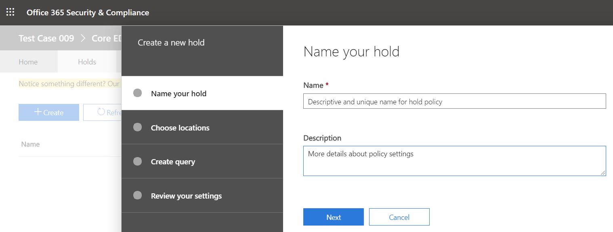

법률 보류에 Microsoft 팀 사용자 또는 팀 배치
==================================================

소송에 대 한 합리적인 기대치가 있는 경우 조직은 케이스와 관련 된 팀 채팅 메시지를 포함 하 여 전자적으로 저장 된 정보 (ESI)를 보존 해야 합니다. 조직에서 특정 주제 또는 특정 개인에 관련 된 모든 메시지를 보존 해야 할 수 있습니다. 이 문서에서는 Microsoft 팀의 법률 보존에 대해 설명 합니다 (M365 공간에서 구현을 유지 하려면, [eDiscovery 사례 관리: 보류 중인 콘텐츠 위치](https://docs.microsoft.com/microsoft-365/compliance/ediscovery-cases#step-4-place-content-locations-on-hold))를 검토 하세요.

> [!NOTE]
> 2020 년 2 월에는 개인 채널에 대 한 법적 고 지 또는 대/소문자 대기를 설정 했습니다 (개인 채널 채팅은 사용자 사서함에 저장 되며, 일반 채널 채팅은 해당 팀의 그룹 사서함에 저장 됩니다.) 사용자 사서함에 대 한 적절 한 보류가 이미 있는 경우에는 이제 해당 사서함에 저장 된 개인 채널 메시지에 보류 정책이 자동으로 적용 됩니다. 관리자가이 기능을 설정 하는 데 필요한 추가 작업은 없습니다. 개인 채널에서 공유 되는 파일의 법적 유지도 지원 됩니다.

Microsoft 팀 내에서 전체 팀 또는 선택 사용자는 보류 또는 법률 보류로 전환할 수 있습니다. 이렇게 하면 해당 팀 (개인 채널 포함)에서 교환 된 모든 메시지 또는 해당 개인이 교환 하는 메시지를 조직의 준수 관리자 또는 팀 관리자가 검색할 수 있습니다.

> [!NOTE]
> 사용자를 보류에 두면 그룹이 보류 중이거나 그 반대의 경우도 마찬가지입니다.

사용자 또는 팀을 법적 보류에 놓으려면:

1. [보안 & 준수 센터로](https://go.microsoft.com/fwlink/?linkid=854628)이동 합니다. 새 서비스 케이스를 만들 때 사서함 또는 사이트를 보류에 배치 하는 옵션이 표시 됩니다.
1. EDiscovery 또는 고급 eDiscovery로 이동 하 여 "+ 사례 만들기"를 클릭 하 여 사례를 만듭니다. 대/소문자를 만들었으면이를 엽니다.

1. 위쪽 메뉴에서 "보류" 섹션으로 이동 하 고 "+ 만들기"를 클릭 하 여 보류를 만듭니다. 새 서비스 케이스를 만들 때 해당 사용자 또는 메시지가 교환 하는 모든 메시지를 저장 하려면 사서함 또는 사이트를 보류 상태로 전환 하는 옵션이 표시 됩니다.

    1. **보류 이름을 포함**합니다. 만들려는 보류에 대해 설명 하는 고유한 이름을 선택 합니다.

    1. **위치를 선택**합니다. 보류를 사용자 또는 전체 팀에 적용할지 여부를 선택 합니다 (현재는 보류를 개별 채널에 적용할 수 없음). 참고: 사용자가 보류 중인 경우에는 1:1 채팅에서 보낸 사람, 1: 다 수 또는 그룹 채팅 또는 채널 대화 (개인 채널 포함)를 포함 하 여 모든 메시지를 대기 상태로 유지할 수 있습니다.
    
    1. **쿼리를 만듭니다**. 보존 정책에서 세분화 하려면 보류를 사용자 지정할 수 있습니다. 예를 들어 찾을 키워드를 지정 하거나 조건을 더 추가 하 여 보류를 적용할 수 있습니다.
    1. 조직에 게시 하기 전에 **설정을 검토** 하세요.

법률 보류가 설정 되 면 [팀 eDiscovery](eDiscovery-investigation.md) 문서를 팔 로우 하는 모든 보존 정책에서 보존 된 모든 콘텐츠를 검색할 수 있습니다.

> [!IMPORTANT]
> 사용자 또는 그룹이 보류 중인 경우 모든 메시지 복사본이 유지 됩니다. 예를 들어 사용자가 채널에서 메시지를 게시 한 후 메시지를 수정 하는 경우에는 메시지의 두 복사본이 모두 보존 됩니다. 적절 한 보류가 없으면 최신 메시지만 유지 됩니다.

유용한 지침으로 아래 표를 사용 하 여 데이터 요구 사항에 따라 법적 보류에 배치 해야 하는 내용을 이해할 수 있습니다.

|시나리오  |보류에 배치할 항목  |
|---------|---------|
|**사용자의 Microsoft 팀 콘텐츠 채팅 (1:1 채팅, 1: 다 수 또는 그룹 채팅, 개인 채널 대화 등)**     |사용자 사서함         |
|**Microsoft 팀 채널 채팅 (비공개 채널 제외)**    |팀에 사용 된 그룹 사서함         |
|**Microsoft 팀 콘텐츠 (예: Wiki, 파일)**     |팀에서 사용 하는 SharePoint 사이트         |
|**Microsoft 팀 개인 채널 파일**     |전용 개인 채널 SharePoint 사이트     |
|**사용자의 개인 콘텐츠**     |사용자의 비즈니스용 OneDrive 사이트         |

> [!NOTE]
> 개인 채널에서 통신을 유지 하려면 사용자 사서함 (개인 채널 사용자)을 보류 하 고 eDiscovery 도구를 사용 하 여 검색 하는 경우 해당 사용자의 사서함에서 검색 해야 합니다. 앞에서 언급 한 것 처럼 개인 채널 채팅은 팀의 그룹 사서함이 아닌 사용자 사서함에 저장 됩니다.

이 항목에 대 한 자세한 내용은 M365의 팀이 아닌 영역에 대해 자세히 알아보려면 [eDiscovery 사례 관리: 콘텐츠 위치를 보류할 위치](https://docs.microsoft.com/microsoft-365/compliance/ediscovery-cases#step-4-place-content-locations-on-hold)를 검토 해야 합니다.
