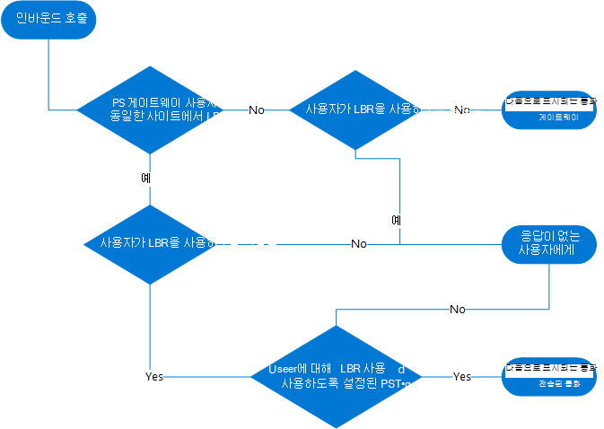
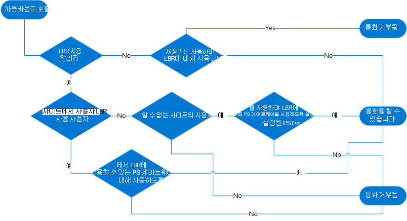

# 직접 라우팅으로 전달되는 위치 기반 라우팅 계획

일부 국가 및 지역에서는 장거리 통화 비용을 줄이기 위해 PSTN(공중 전화망) 공급자를 우회하는 것은 불법입니다. 

이 문서에서는 지리적 위치에 따라 Microsoft Teams 사용자의 통행료 우회를 제한하기 위해 Location-Based 라우팅을 사용하는 데 알아야 할 사항을 설명합니다. 이 문서는 직접 라우팅에만 적용됩니다. Location-Based 라우팅은 통화 플랜 또는 운영자 연결에 적용되지 않습니다.

Location-Based 라우팅을 사용하도록 설정할 준비가 되면 다음을 참조하세요.

- [위치 기반 라우팅의 네트워크 설정 구성](location-based-routing-configure-network-settings.md)
- [Location-Based 라우팅에 대한 네트워크 설정 배포](location-based-routing-configure-network-settings.md)
- [직접 라우팅에 위치 기반 라우팅 사용](location-based-routing-enable.md)

> [!NOTE]
> Location-Based 라우팅을 사용하여 사용자의 위치에 따라 PSTN 호출을 동적으로 라우팅해서는 안 됩니다. 이렇게 하면 의도하지 않은 결과가 발생할 수 있습니다.

## 개요

Location-Based 라우팅을 사용하면 인바운드 또는 아웃바운드 PSTN 호출 시 정책 및 사용자의 지리적 위치에 따라 사용자의 통행료 우회를 제한할 수 있습니다. 

Location-Based 라우팅은 네트워크 지역, 사이트 및 서브넷에 대해 정의하는 네트워크 토폴로지를 사용합니다. 한 위치에 대해 통행료 우회가 제한되면 해당 위치에 대한 각 IP 서브넷과 각 PSTN 게이트웨이를 네트워크 사이트에 연결합니다. 

PSTN 호출 시 사용자의 위치는 사용자의 Teams 엔드포인트가 연결된 IP 서브넷에 의해 결정됩니다. 사용자가 여러 사이트에 여러 Teams 클라이언트가 있는 경우 Location-Based 라우팅은 Teams 엔드포인트의 위치에 따라 각 클라이언트의 라우팅을 별도로 적용합니다.

네트워크 설정에 대한 자세한 내용은 [Teams의 클라우드 음성 기능에 대한 네트워크 설정을 참조하세요](cloud-voice-network-settings.md).

이 문서에서는 네트워크 사이트가 다음 상태 중 하나에 있을 수 있다고 가정합니다.

- **사용** - 테넌트 네트워크 서브넷 및 사이트를 사용하여 구성되고 Location-Based 라우팅에 사용하도록 설정된 사이트입니다.

- **사용하도록 설정되지 않음** - 테넌트 네트워크 서브넷 및 사이트를 사용하여 구성되었지만 Location-Based 라우팅에 사용하도록 설정되지 않은 사이트입니다.

- **알 수 없음** - 테넌트 네트워크 서브넷 및 사이트를 사용하여 구성되지 않은 사이트입니다. 일반적으로 이러한 사이트는 회사 네트워크 내부이지만 의도적으로 구성되지 않았거나 회사 네트워크 외부에 있습니다. 어떤 경우에도 이러한 사이트는 Location-Based 라우팅에 사용할 수 없습니다. 

### 통행료 우회 평가 및 결과

Location-Based 라우팅을 사용하는 경우 Teams 사용자와 PSTN 간의 호출이 평가되어 통행료 우회가 제한되는지 확인합니다. 결과에 따라 호출이 완료되거나 완료되지 않습니다. 

사용자가 Location-Based 라우팅을 사용하도록 설정되어 있고 사용자가 Location-Based 라우팅 제한이 적용되는 사이트에 있는 경우 해당 사용자에 대해 통행료 우회가 제한됩니다. Teams는 다음 정보를 사용하여 통행료 우회가 제한되는지 여부를 확인합니다. 

- Teams 사용자가 사용자의 Teams 통화 정책에 정의된 대로 Location-Based 라우팅을 사용할 수 있는지 여부입니다.

- Teams 사용자의 엔드포인트 네트워크 사이트 위치 및 사이트가 Location-Based 라우팅에 사용하도록 설정되었는지 여부입니다.

- 호출에서 사용되는 PSTN 게이트웨이의 네트워크 사이트 위치입니다.

- 호출에서 사용되는 PSTN 게이트웨이가 Location-Based 라우팅에 사용하도록 설정되었는지 여부입니다.

- 전송 시나리오의 경우 PSTN 통화 경로는 통화를 전송하는 사용자의 라우팅 설정과 통화가 전송되는 Teams 사용자의 Location-Based 라우팅 설정을 기반으로 합니다.  

- 회의 및 그룹 통화 시나리오의 경우 통행료 우회가 제한된 Teams 사용자가 통화의 일부인지 여부입니다.

통화를 완료할 수 없는 경우 Teams 사용자에게 다음과 같은 알림이 표시됩니다.

- 아웃바운드 PSTN 호출의 경우 통화 창에 다음과 같은 메시지가 표시됩니다. 조직의 설정으로 인해 통화가 허용되지 않습니다.

- 인바운드 PSTN 통화의 경우 호출은 일반적으로 음성 메일에 대한 Teams 사용자의 응답되지 않은 착신 전환 설정에 따라 라우팅됩니다. Teams 사용자에게 응답되지 않은 통화 설정이 구성되어 있지 않으면 통화 연결이 끊어집니다.

## Location-Based 라우팅 적용

Location-Based 라우팅을 다음 항목에 적용해야 합니다.

- [사용자](#apply-location-based-routing-at-the-user-location)
- [네트워크 사이트](#apply-location-based-routing-at-the-network-site)
- [PSTN 게이트웨이](#apply-location-based-routing-at-the-pstn-gateway)

다음 모범 사례를 염두에 두세요.

- Location-Based 라우팅에 대해 게이트웨이와 연결된 PSTN 게이트웨이 및 네트워크 사이트를 모두 사용하도록 설정해야 합니다.

- Location-Based 라우팅에 사용할 수 있는 PSTN 게이트웨이를 통해 호출을 설정하려면 사용자도 Location-Based 라우팅을 사용하도록 설정해야 합니다.

- Location-Based 라우팅을 사용하도록 설정된 사용자가 알 수 없는 네트워크 사이트에서 아웃바운드 PSTN 호출을 수행하도록 허용하려면 다음이 true여야 합니다.

  - Location-Based 라우팅에 사용하도록 설정된 PSTN 게이트웨이에서 호출을 송신해야 합니다.
  - PSTN 게이트웨이는 GatewayLbrEnabledUserOverride 플래그를 True로 설정하여 구성해야 합니다.

### 사용자 위치에서 Location-Based 라우팅 적용

통행료 우회 제한은 사용자가 PSTN 호출을 만들고 받을 수 있는 조건과 사용할 수 있는 PSTN 게이트웨이를 제어합니다. 

사용자가 통행료 우회 제한을 받는 경우 해당 사용자는 Location-Based 라우팅에 대해 사용하도록 설정해야 합니다. 활성화된 사용자가 Location-Based 라우팅에 사용할 수 있는 사이트에 있는 경우 사용자는 사이트에 연결되고 Location-Based 라우팅을 사용하도록 설정된 게이트웨이를 통해 호출해야 합니다. 

Location-Based 라우팅은 사용자의 Teams 엔드포인트의 IP 주소를 기반으로 사용자의 현재 위치를 확인하여 작동하며 그에 따라 규칙을 적용합니다. Location-Based 라우팅을 사용하도록 설정된 사용자의 위치는 다음과 같이 분류할 수 있습니다. 

- **사용자는 DID가 할당된 PSTN 게이트웨이에 연결된 동일한 Location-Based 라우팅 사용 사이트에 있습니다.** 이 시나리오에서 사용자는 Location-Based 라우팅을 사용하도록 설정된 구성된 네트워크 사이트에 있으며 사용자의 DID(Direct Inward Dial) 번호는 동일한 네트워크 사이트에 있는 PSTN 게이트웨이에서 종료됩니다. 예를 들어 사용자는 자신의 사무실에 있습니다. 

- **사용자는 DID가 할당된 PSTN 게이트웨이에 연결되지 않은 다른 Location-Based 라우팅 사용 사이트에 있습니다.** 이 시나리오에서 사용자는 Location-Based 라우팅을 사용하도록 설정된 구성된 네트워크 사이트에 있으며 해당 사이트는 사용자의 DID 번호가 할당된 PSTN 게이트웨이와 연결되지 않습니다. 예를 들어 사용자는 다른 사무실로 이동합니다.  

- **사용자는 Location-Based 라우팅에 사용할 수 없는 내부 사이트에 있습니다.**  이 시나리오에서 사용자는 Location-Based 라우팅에 대해 사용하도록 설정되지 않은 구성된 네트워크 사이트에 있습니다. 

- **사용자가 알 수 없는 사이트에 있습니다.** 
    - 사용자는 네트워크 사이트로 정의되지 않은 내부 네트워크 내에 있습니다. 
    - 사용자가 내부 네트워크 외부에 있습니다. 예를 들어 사용자는 집에서 인터넷이나 커피숍에 있습니다. 

### 네트워크 사이트에서 Location-Based 라우팅 적용 

Location-Based 라우팅을 사용하도록 설정된 사용자가 로밍하는 경우 Location-Based 라우팅에 사용하도록 설정된 네트워크 사이트는 사용할 게이트웨이를 결정하는 데 도움이 됩니다. 예를 들면 다음과 같습니다.

- Location-Based 라우팅을 사용하도록 설정된 사용자가 Location-Based 라우팅에 사용할 수 있는 사이트로 로밍하는 경우 해당 사이트의 Location-Based 라우팅에 사용하도록 설정된 PSTN 게이트웨이만 아웃바운드 호출에 사용할 수 있습니다. 

- Location-Based 라우팅을 사용하도록 설정된 사용자가 Location-Based 라우팅에 사용하도록 설정되지 않은 사이트로 로밍하는 경우 Location-Based 라우팅에 사용하도록 설정되지 않은 게이트웨이를 아웃바운드 호출에 사용할 수 있습니다.  

### PSTN 게이트웨이에서 Location-Based 라우팅 적용  

PSTN 게이트웨이에서 Location-Based 라우팅을 적용하려면 다음을 수행해야 합니다.

- Location-Based 라우팅에 게이트웨이를 사용하도록 설정합니다. (Location-Based 라우팅에 대해 사용하도록 설정되지 않은 사용자가 게이트웨이를 사용할 수 없도록 Location-Based 라우팅에 대해 게이트웨이를 사용하도록 설정해야 합니다.)

- 게이트웨이에 네트워크 사이트를 할당합니다.

그런 다음, 시스템은 지정된 사이트의 지정된 사용자가 게이트웨이를 사용할 수 있는지 여부를 확인합니다. 

또한 GatewayLbrEnabledUserOverride를 True로 설정하면 알 수 없는 사이트(예: 집에서 작업하는 사용자)에서 위치 기반 라우팅을 사용하도록 설정된 사용자가 아웃바운드 PSTN 호출을 수행할 수 있습니다.

## 제한 규칙

제한 규칙은 Teams 사용자가 Location-Based 라우팅에 사용할 수 있는지 여부에 따라 달라집니다.

### 사용자가 Location-Based 라우팅에 사용할 수 있습니다.

사용자가 Location-Based 라우팅을 사용하도록 설정하면 다음이 적용됩니다.

- **아웃바운드 PSTN 호출을 수행하려면** 다음 중 하나가 true여야 합니다.

  - 사용자의 엔드포인트는 Location-Based 라우팅에 사용할 수 있는 사이트에 위치하고 동일한 사이트에서 Location-Based 라우팅에 사용하도록 설정된 PSTN 게이트웨이를 통해 송신을 호출합니다.  

  - 사용자의 엔드포인트는 알 수 없는 사이트에 있으며 Location-Based 라우팅에 사용하도록 설정된 PSTN 게이트웨이를 통해 송신을 호출합니다. PSTN 게이트웨이는 GatewayLbrEnabledUserOverride 매개 변수를 True로 설정하여 구성됩니다.

  - 사용자의 엔드포인트는 Location-Based 라우팅에 대해 사용하도록 설정되지 않은 사이트에 있으며 Location-Based 라우팅에 사용하도록 설정되지 않은 PSTN 게이트웨이를 통해 송신을 호출합니다.

- **인바운드 PSTN 호출을 받으려면** 다음 중 하나가 true여야 합니다. 

   - 사용자의 응답 엔드포인트 및 호출 수신을 통한 PSTN 게이트웨이는 Location-Based 라우팅에 사용하도록 설정된 동일한 사이트에 있어야 합니다. Location-Based 라우팅에 PSTN 게이트웨이를 사용하도록 설정해야 합니다.

   - 사용자의 응답 엔드포인트 및 호출 수신을 통한 PSTN 게이트웨이는 Location-Based 라우팅에 대해 사용하도록 설정되지 않은 동일한 사이트에 있어야 합니다. Location-Based 라우팅에 PSTN 게이트웨이를 사용하도록 설정해서는 안 됩니다.  (이 시나리오에는 수신 PSTN 호출을 수신하는 데 일반적으로 사용되는 PSTN 게이트웨이보다 다른 PSTN 게이트웨이가 사용자의 전화 번호로 수신하는 데 사용되는 게이트웨이보다 수신으로 다시 라우팅하는 작업이 포함됩니다.)

   - 사용자가 로밍하는 경우와 같은 다른 시나리오에서는 통화가 허용되지 않으며 사용자의 응답되지 않은 착신 전환 설정(일반적으로 음성 메일)으로 라우팅됩니다.  
   
- **1:1 Teams VoIP 통화 및 PSTN으로 전송하려면** 다음 사항에 유의하세요.

  - 호출을 송신하는 PSTN 게이트웨이인 호출의 라우팅은 호출을 전송하는 사용자의 라우팅 설정을 기반으로 합니다.

  - 전송이 허용되는지 여부는 다음을 기반으로 합니다.
  
    - PSTN으로 전송되는 사용자의 Location-Based 라우팅 설정입니다.
    - 엔드포인트 네트워크 사이트 위치입니다.
    - Location-Based 라우팅에 위치를 사용할 수 있는지 여부입니다.

    전송 중인 사용자가 동일한 PSTN 게이트웨이를 사용하여 현재 위치에서 해당 PSTN을 호출할 수 있는 경우 전송이 허용됩니다.

- **들어오거나 나가는 PSTN 통화 및 다른 Teams 사용자에게 전송의 경우** 전송이 허용되는지 여부는 다음 사항에 따라 달라집니다.

   - 전송된 전화를 받는 사용자의 라우팅 설정입니다. 
   - 엔드포인트 네트워크 사이트 위치입니다.
   - Location-Based 라우팅에 위치를 사용할 수 있는지 여부입니다.

   전송된 전화를 받는 사람이 진행 중인 PSTN 호출에서 사용하는 PSTN 게이트웨이를 사용하여 현재 위치에서 해당 PSTN 호출을 만들거나 받을 수 있는 경우 전송이 허용됩니다.

### 사용자가 Location-Based 라우팅에 사용할 수 없습니다.

Teams 사용자가 Location-Based 라우팅을 사용하도록 설정되지 않은 경우 해당 사용자와 주고받은 모든 호출은 Location-Based 라우팅에 대해 사용하도록 설정되지 않은 PSTN 게이트웨이를 통해 라우팅되어야 합니다. Location-Based 라우팅에 사용하도록 설정된 PSTN 게이트웨이를 통해 라우팅된 이러한 사용자에 대한 인바운드 호출은 사용자의 응답되지 않은 착신 전환 설정(일반적으로 음성 메일)으로 라우팅됩니다.

### 인바운드 및 아웃바운드 호출에 대한 의사 결정 흐름

다음 다이어그램은 인바운드 및 아웃바운드 호출에 대한 의사 결정 흐름을 보여 줍니다.

**인바운드 호출**

**아웃바운드 호출**

## 위치 기반 라우팅 시나리오

이 섹션에서는 Location-Based 라우팅을 사용하여 통행료 우회를 제한하는 다양한 시나리오에 대해 설명합니다. 이 시나리오에서는 Location-Based 라우팅에 대해 사용하도록 설정되지 않은 사용자와 Location-Based 라우팅을 사용하도록 설정된 사용자에 대해 호출을 라우팅하는 방법을 비교합니다.

- [Teams 사용자가 PSTN에 아웃바운드 호출을 수행합니다.](#teams-user-places-an-outbound-call-to-the-pstn)
- [Teams 사용자가 PSTN에서 인바운드 전화를 받습니다.](#teams-user-receives-an-inbound-call-from-the-pstn)
- [Teams 사용자가 다른 Teams 사용자에게 통화를 전송하거나 전달합니다.](#teams-user-transfers-or-forwards-call-to-another-teams-user)
- [Teams 사용자가 PSTN 엔드포인트에 대한 호출을 전송하거나 전달합니다.](#teams-user-transfers-or-forwards-call-to-pstn-endpoint)
- [동시 연결](#simultaneous-ringing)
- [위임](#delegation)

다음 다이어그램에서는 각 시나리오에서 Location-Based 라우팅에서 사용하도록 설정된 제한을 보여 줍니다. Location-Based 라우팅에 사용할 수 있는 사용자, 네트워크 사이트 및 게이트웨이에는 주위에 테두리가 있습니다. 다이어그램을 가이드로 사용하여 각 시나리오에서 Location-Based 라우팅이 작동하는 방식을 이해할 수 있습니다.  

### Teams 사용자가 PSTN에 아웃바운드 호출을 수행합니다.

#### 사용자가 Location-Based 라우팅에 대해 사용하도록 설정되지 않음

Location-Based 라우팅을 사용하도록 설정되지 않은 사용자는 할당된 음성 라우팅 정책을 통해 라우팅을 Location-Based 사용하도록 설정되지 않은 모든 사이트의 게이트웨이를 사용하여 아웃바운드 호출을 수행할 수 있습니다. 그러나 게이트웨이가 Location-Based 라우팅에 사용하도록 설정된 경우 사용자는 음성 라우팅 정책에 할당된 경우에도 게이트웨이를 통해 아웃바운드 호출을 수행할 수 없습니다. 사용자가 Location-Based 라우팅을 사용하도록 설정된 사이트로 로밍하는 경우 Location-Based 라우팅에 사용하도록 설정되지 않은 일반 라우팅 게이트웨이를 통해서만 호출할 수 있습니다.
 
#### Location-Based 라우팅에 대해 사용하도록 설정된 사용자

이에 비해 Location-Based 라우팅을 사용하도록 설정된 사용자에 대한 아웃바운드 호출 라우팅은 사용자의 엔드포인트 네트워크 위치에 의해 영향을 받습니다. 다음 표에서는 Location-Based 라우팅이 User1의 위치에 따라 User1의 아웃바운드 호출 라우팅에 미치는 영향을 보여 줍니다. 

|User1 엔드포인트 위치  |User1에 대한 아웃바운드 호출 라우팅  |
|---------|---------|
|사용자의 DID가 할당된 동일한 사이트, Location-Based 라우팅에 사용하도록 설정된 사이트(Site1)      |사용자의 음성 라우팅 정책에 따라 Site1에서 GW1(Location-Based 라우팅)에 사용하도록 설정된 게이트웨이를 통해 라우팅된 호출         |
|사용자의 DID가 할당된 사이트와 다른 사이트, Location-Based 라우팅에 사용하도록 설정된 사이트(Site2)    |사용자의 음성 라우팅 정책에 따라 로밍 Site2에서 GW2(Location-Based 라우팅)에 사용하도록 설정된 게이트웨이를 통해 라우팅된 호출        |
|사용자의 DID가 할당된 사이트와 다른 사이트, Location-Based 라우팅에 사용하도록 설정되지 않은 사이트(Site3)  |사용자의 음성 라우팅 정책에 따라 GW3(Location-Based 라우팅)에 사용하도록 설정되지 않은 사이트에서 Location-Based 라우팅에 대해 사용하도록 설정되지 않은 게이트웨이를 통해 라우팅된 호출       |
|알 수 없는 내부 네트워크(Location4)    |  게이트웨이에 GatewayLbrEnabledUserOverride가 True로 설정되어 있지 않으면 PSTN 호출이 허용되지 않습니다.       |
|알 수 없는 외부 네트워크(Location5)    | 게이트웨이에 GatewayLbrEnabledUserOverride가 True로 설정되어 있지 않으면 PSTN 호출이 허용되지 않습니다.       |

### Teams 사용자가 PSTN에서 인바운드 전화를 받습니다.

#### 사용자가 Location-Based 라우팅에 대해 사용하도록 설정되지 않음

Location-Based 라우팅에 대해 사용하도록 설정되지 않은 사용자는 할당된 DID 번호가 수신되는 Location-Based 라우팅에 대해 사용하도록 설정되지 않은 게이트웨이에서 인바운드 호출을 받을 수 있습니다. 사용자가 Location-Based 라우팅에 사용할 수 없는 사이트로 로밍하는 경우에도 일반 PSTN 게이트웨이를 통해 호출을 받을 수 있습니다.
  
#### Location-Based 라우팅에 대해 사용하도록 설정된 사용자

이에 비해 Location-Based 라우팅을 사용하도록 설정된 사용자는 동일한 사이트에 있을 때 DID가 할당된 PSTN 게이트웨이에서만 인바운드 호출을 받을 수 있습니다. 다음 표에서는 User1이 다른 네트워크 위치로 이동할 때 User1이 인바운드 호출을 받는 방법을 보여 줍니다. 통화가 사용자의 엔드포인트로 라우팅되지 않으면 설정이 구성된 경우 사용자의 응답되지 않은 착신 전환 설정으로 이동합니다. 일반적으로 통화는 음성 메일로 전달됩니다.  

|User1 엔드포인트 위치  |User1에 대한 인바운드 호출 라우팅  |
|---------|---------|
|사용자의 DID가 할당된 사이트와 동일한 사이트, Location-Based 라우팅에 사용하도록 설정된 사이트(Site1)   | Site1에서 User1의 엔드포인트로 라우팅된 호출        |
|사용자의 DID가 할당된 사이트와 다른 사이트, Location-Based 라우팅에 사용하도록 설정된 사이트(Site2)    | Site2에서 엔드포인트로 라우팅되지 않은 호출        |
|사용자의 DID가 할당된 사이트와 다른 사이트, Location-Based 라우팅에 사용하도록 설정되지 않은 사이트(Site3)    | Site3에서 엔드포인트로 라우팅되지 않은 호출        |
|알 수 없는 내부 네트워크(Location4)   | Location4에서 엔드포인트로 라우팅되지 않은 호출        |
|알 수 없는 외부 네트워크(Location5)     | Location5에서 엔드포인트로 라우팅되지 않은 호출        |

### Teams 사용자가 다른 Teams 사용자에게 통화를 전송하거나 전달합니다.

PSTN 엔드포인트가 관련되면 Location-Based 라우팅은 Location-Based 라우팅에 대해 사용자 중 하나 또는 둘 다 사용할 수 있는지 여부를 분석하고 두 엔드포인트의 위치에 따라 호출을 전송할지 또는 전달해야 하는지를 결정합니다. 
 
통화 전송을 위해서는 통화 전달을 시작할 때 초기 호출에 응답할 필요가 없는 동안 시작 사용자가 통화를 선택해야 합니다. User1이 인바운드 호출을 받을 수 있는 위치에 있지 않은 경우( [Teams 사용자가 PSTN 섹션에서 인바운드 통화를 수신하는 테이블](#teams-user-receives-an-inbound-call-from-the-pstn) 참조) User1이 인바운드 전화를 받을 수 없는 경우 통화를 전송할 수 없는 경우에도 통화를 전달할 수 있습니다. 

#### 사용자가 Location-Based 라우팅에 대해 사용하도록 설정되지 않음

Location-Based 라우팅을 사용하도록 설정되지 않은 사용자는 Location-Based 라우팅을 사용하도록 설정되지 않은 다른 사용자에게 PSTN 호출을 전송하거나 전달할 수 있습니다. Location-Based 라우팅을 사용하도록 설정된 사용자는 일반적으로 PSTN 호출에 대한 Location-Based 라우팅 사용 게이트웨이에 공동 배치됩니다. 따라서 사용하도록 설정되지 않은 사용자는 Location-Based 라우팅을 사용하도록 설정된 사용자에게 PSTN 호출을 전송하거나 전달할 수 없습니다. 예외는 Location-Based 라우팅을 사용하도록 설정된 사용자가 Location-Based 라우팅에 사용하도록 설정되지 않은 사이트로 로밍하는 경우입니다. 이 시나리오에서는 전송된 호출이 허용됩니다.  

마찬가지로 Location-Based 라우팅에 대해 사용하도록 설정되지 않은 사용자는 Location-Based 라우팅에 대해 사용하도록 설정되지 않은 다른 사용자로부터 전송 또는 전달된 PSTN 호출만 받을 수 있습니다. 

#### Location-Based 라우팅에 대해 사용하도록 설정된 사용자

Location-Based 라우팅에 사용할 수 있는 게이트웨이에서 인바운드 PSTN 호출을 전송하고 전달하는 것은 대상 사용자가 Location-Based 라우팅에 대해 사용하도록 설정되어 있고 동일한 사이트에 있는 경우에만 허용됩니다. 그렇지 않으면 호출 전송 및 전달이 허용되지 않습니다. 

다음 표에서는 대상 사용자의 위치에 따라 착신 전환 및 통화 전송이 허용되는지 여부를 보여 줍니다. 이 표에서 Site1에 있는 User1은 Location-Based 라우팅에 사용할 수 있고 다른 위치에 있는 다른 Teams 사용자에게 전송 또는 전달을 시작합니다.  

|대상 사용자 엔드포인트 위치|User1이 호출 전송을 시작합니다. |User1이 착신 전환 시작|
|---------|---------|---------|
|초기자와 동일한 네트워크 사이트(User2)|허용|허용|
|다른 네트워크 사이트, Location-Based 라우팅에 사용하도록 설정된 사이트(User3)|허용되지 않음|허용되지 않음|
|다른 네트워크 사이트, Location-Based 라우팅에 사용할 수 없는 사이트(User4)|허용되지 않음|허용되지 않음|
|알 수 없는 내부 네트워크(User5)| 허용되지 않음|허용되지 않음|
|알 수 없는 외부 네트워크(User6)| 허용되지 않음|허용되지 않음|

### Teams 사용자가 PSTN 엔드포인트에 대한 호출을 전송하거나 전달합니다.

#### 사용자가 Location-Based 라우팅에 대해 사용하도록 설정되지 않음

- PSTN 호출을 다른 PSTN 번호로 전송하고 전달할 수 있습니다. 

- 인바운드 VOIP 호출을 PSTN으로 전송하고 전달하려면 호출자의 통행료 우회 제한을 적용해야 합니다. 

    - 호출자가 Location-Based 라우팅에 대해 사용하도록 설정되지 않은 경우 Location-Based 라우팅에 대해 사용하도록 설정되지 않은 모든 PSTN 게이트웨이로 전송할 수 있습니다.
    - 호출자가 Location-Based 라우팅을 사용하도록 설정된 경우 동일한 네트워크 사이트에 있는 Location-Based 라우팅 사용 게이트웨이로만 전송할 수 있습니다. 

#### Location-Based 라우팅에 대해 사용하도록 설정된 사용자

- PSTN 호출을 다른 PSTN 번호로 전송하고 전달하려면 인바운드 호출이 도착한 것과 동일한 Location-Based 라우팅이 설정된 게이트웨이로 라우팅되어야 합니다.

- 인바운드 VOIP 호출을 PSTN으로 전송하고 전달하려면 호출자와 호출된 사용자의 수신자 우회 제한이 모두 적용되어야 합니다. 

    - 호출자가 Location-Based 라우팅에 대해 사용하도록 설정되지 않은 경우 Location-Based 라우팅에 대해 사용하도록 설정되지 않은 모든 PSTN 게이트웨이로 전송할 수 있습니다.

    - 호출자가 Location-Based 라우팅을 사용하도록 설정된 경우 동일한 네트워크 사이트에 있는 Location-Based 라우팅 사용 게이트웨이로만 전송할 수 있습니다.
 
다음 표에서는 Location-Based 라우팅이 Site1에서 Location-Based 라우팅이 설정된 User1에서 PSTN 엔드포인트로 호출을 전송하거나 전달하는 다른 위치의 사용자로 VOIP 호출 라우팅에 영향을 미치는 방법을 보여 줍니다.  

|통화 전송 또는 전달을 시작하는 사용자  |PSTN으로 전송 또는 전달  |
|---------|---------|
|동일한 네트워크 사이트, Location-Based 라우팅에 사용하도록 설정된 사이트(User2)   |결과 PSTN 호출은 User2의 음성 라우팅 정책에 따라 계산된 경로가 Site1에서 Location-Based 라우팅이 설정된 Gateway1을 통한 경로가 발생하는 경우에만 허용됩니다.         |
|다른 네트워크 사이트, Location-Based 라우팅에 사용하도록 설정된 사이트(User3)    |결과 PSTN 호출은 User3의 음성 라우팅 정책에 따라 계산된 경로가 Site1에서 Location-Based 라우팅이 설정된 Gateway1을 통한 경로가 발생하는 경우에만 허용됩니다. |
|다른 네트워크 사이트, Location-Based 라우팅에 사용할 수 없는 사이트(User4)    |결과 PSTN 호출은 User4의 음성 라우팅 정책에 따라 계산된 경로가 Site1에서 Location-Based 라우팅이 설정된 Gateway1을 통한 경로가 발생하는 경우에만 허용됩니다.          |
|알 수 없는 내부 네트워크(User5)     |결과 PSTN 호출은 User5의 음성 라우팅 정책에 따라 계산된 경로가 Site1에서 Location-Based 라우팅이 설정된 Gateway1을 통한 경로가 발생하는 경우에만 허용됩니다.          |
|알 수 없는 외부 네트워크(User6)   |결과 PSTN 호출은 User6의 음성 라우팅 정책에 따라 계산된 경로가 Site1에서 Location-Based 라우팅이 설정된 Gateway1을 통한 경로가 발생하는 경우에만 허용됩니다.          |

### 동시 연결

Location-Based 라우팅을 사용하도록 설정한 사용자가 전화를 받고 동시 벨소리를 사용하도록 설정된 경우 Location-Based 라우팅은 호출 당사자의 위치와 호출된 당사자의 엔드포인트를 분석하여 호출을 라우팅해야 하는지 여부를 결정합니다. 동시 벨소리는 호출 전송 및 전달과 동일한 Location-Based 규칙을 따릅니다. 

#### 다른 Teams 사용자에 대한 동시 벨소리

다음 표에서는 Location-Based 라우팅에서 User1에 대한 인바운드 PSTN 호출에 대해 서로 다른 사용자에게 동시에 울릴 수 있는지 여부를 보여 줍니다.

|대상 사용자 엔드포인트 위치|동시 링  |
|---------|---------|
|초기자와 동일한 네트워크 사이트(User2)   |허용         |
|Location-Based 라우팅에 사용하도록 설정된 다른 로밍된 네트워크 사이트(User3)   |허용되지 않음         |
|Location-Based 라우팅에 로밍된 네트워크 사이트를 사용할 수 없음(User4)   |허용되지 않음        |
|알 수 없는 내부 네트워크(User5)    | 허용되지 않음        |
|알 수 없는 외부 네트워크(User6)    |허용되지 않음        |
|대상 사용자가 PSTN 번호입니다.    |통화는 User1의 음성 라우팅 정책에 따라 Site1에서 Location-Based 라우팅이 설정된 Gateway1을 통해서만 라우팅할 수 있습니다.      |

#### PSTN 엔드포인트에 동시 울림

다음 표에서는 Site1에 있는 Location-Based 라우팅 사용 User1에서 PSTN 번호로 설정된 동시 링이 있는 다른 위치의 사용자에게 인바운드 VoIP 호출에 대한 Location-Based 라우팅 동작을 보여 줍니다. 

|호출된 사용자 엔드포인트 위치  |동시 링 대상은 PSTN 엔드포인트입니다. |
|---------|---------|
|동일한 네트워크 사이트, Location-Based 라우팅에 사용하도록 설정된 사이트(User2)    |결과 PSTN 호출은 User2의 음성 라우팅 정책에 따라 계산된 경로가 Site1에서 Location-Based 라우팅이 설정된 Gateway1을 통한 경로가 발생하는 경우에만 허용됩니다.        |
|Location-Based 라우팅에 사용하도록 설정된 다른 네트워크 사이트(User3)    |결과 PSTN 호출은 User3의 음성 라우팅 정책에 따라 계산된 경로가 Site1에서 Location-Based 라우팅이 설정된 Gateway1을 통한 경로가 발생하는 경우에만 허용됩니다.         |
|Location-Based 라우팅에 사용할 수 없는 다른 네트워크 사이트(User4)    |결과 PSTN 호출은 User4의 음성 라우팅 정책에 따라 계산된 경로가 Site1에서 Location-Based 라우팅이 설정된 Gateway1을 통한 경로가 발생하는 경우에만 허용됩니다.          |
|알 수 없는 내부 네트워크(User5)    |결과 PSTN 호출은 User5의 음성 라우팅 정책에 따라 계산된 경로가 Site1에서 Location-Based 라우팅이 설정된 Gateway1을 통한 경로가 발생하는 경우에만 허용됩니다.          |
|알 수 없는 외부 네트워크(User6)   |결과 PSTN 호출은 User6의 음성 라우팅 정책에 따라 계산된 경로가 Site1에서 Location-Based 라우팅이 설정된 Gateway1을 통한 경로가 발생하는 경우에만 허용됩니다.          |

#### 음성 앱을 통한 인바운드 통화(자동 전화 교환 또는 통화 큐)

Location-Based 라우팅 사용 게이트웨이의 인바운드 PSTN 호출은 자동 전화 교환 또는 통화 큐에 연결할 수 있습니다. 

Location-Based 라우팅을 사용하도록 설정된 사용자는 인바운드 PSTN 호출이 시작된 동일한 사이트에 있는 경우 이러한 애플리케이션에 대한 인바운드 호출 전송을 받을 수 있습니다.
 
음성 앱 전송을 위해 사용자에게 착신 전환 및 동시 벨소리 및 PSTN이 허용됩니다. 대상에 대한 호출을 완료하는 경우 이전에 나열된 것과 동일한 Location-Based 라우팅 규칙이 적용됩니다.  
 
음성 메일로 전달도 허용됩니다.  

### 위임

Teams 사용자는 대신 전화를 걸고 받을 수 있는 대리인을 선택할 수 있습니다. Teams의 위임 기능은 다음과 같이 Location-Based 라우팅의 영향을 받습니다. 

- 위임자를 대신하여 Location-Based 라우팅 사용 대리자의 아웃바운드 호출의 경우 동일한 규칙이 적용됩니다. 통화 라우팅은 대리자의 통화 권한 부여 정책, 음성 라우팅 정책 및 위치를 기반으로 합니다. 자세한 내용은 [Teams 사용자가 PSTN에 아웃바운드 호출을 하는 것을](#teams-user-places-an-outbound-call-to-the-pstn) 참조하세요. 

- 위임자에 대한 인바운드 PSTN 호출의 경우 다른 사용자에게 착신 전환 또는 동시에 울리는 데 적용되는 동일한 Location-Based 라우팅 규칙도 대리자에 적용됩니다. 자세한 내용은 [Teams 사용자 전송 또는 전달 통화를 다른 Teams 사용자에게 전달](#teams-user-transfers-or-forwards-call-to-another-teams-user)하고, [Teams 사용자가 PSTN 엔드포인트로 통화를 전송하거나 전달](#teams-user-transfers-or-forwards-call-to-pstn-endpoint)하고, [동시 울림을 참조하세요](#simultaneous-ringing). 대리자가 PSTN 엔드포인트를 동시 링 대상으로 설정하면 대리자의 음성 라우팅 정책이 호출을 PSTN으로 라우팅하는 데 사용됩니다. 

- 위임의 경우 위임자 및 연결된 대리자를 동일한 네트워크 사이트에 배치하는 것이 좋습니다. 

## 기타 계획 고려 사항

### 온-프레미스 Location-Based 라우팅 배포의 변경 내용

네트워크 사이트 음성 라우팅 정책은 더 이상 사용되지 않습니다. 대신 사용자의 음성 라우팅 정책을 사용합니다. 사용자가 다른 사이트로 로밍할 수 있도록 하려면 음성 라우팅 정책에 로밍된 사이트의 게이트웨이가 포함되어야 합니다. 

### 위치 기반 라우팅을 위한 기술적 고려 사항

IPv4 및 IPv6 서브넷이 지원되지만 IPv6은 일치 항목을 확인할 때 우선합니다.

### Location-Based 라우팅에 대한 클라이언트 지원

지원되는 Teams 클라이언트는 다음과 같습니다.
- Teams 데스크톱 클라이언트(Windows 및 Mac)
- Teams 모바일 클라이언트(iOS 및 Android)
- Teams IP 휴대폰

Teams 웹 클라이언트 및 비즈니스용 Skype 클라이언트는 지원되지 않습니다.

### 위치 기반 라우팅에서 지원하지 않는 기능

Location-Based 라우팅은 다음 유형의 상호 작용에 적용되지 않습니다. Location-Based 라우팅은 Teams 엔드포인트가 다음 시나리오에서 PSTN 엔드포인트와 상호 작용할 때 적용되지 않습니다. 

- 통화 대기 또는 통화 대기를 통한 PSTN 통화 검색 

- 온-프레미스 비즈니스용 Skype 사용자 또는 비즈니스용 Skype Online 사용자가 Teams 사용자를 호출합니다.  

### 회의를 위한 Location-Based 라우팅

PSTN 통화에서 Location-Based 라우팅이 설정된 사용자는 다른 사용자 또는 PSTN 번호로 회의를 시작할 수 없습니다. 자동 전화 교환 또는 통화 큐에 연결할 수 있습니다.

사용자에게 오디오 회의 라이선스가 있는 경우 사용자는 관련 사용자와 회의를 시작하고 회의 브리지를 통해 PSTN에 전화하여 전화 회의를 시작해야 합니다.

오디오 회의 라이선스가 없는 사용자가 시작한 전화 회의에서 전화 회의에 라우팅을 사용하도록 설정된 사용자가 하나 이상 있거나 Location-Based 경우 PSTN 참가자를 추가할 수 없습니다. 라우팅을 사용하도록 설정된 Location-Based 참가자가 통화에 참여하도록 초대되기 전에 하나 이상의 PSTN 참가자가 이러한 전화 회의의 일부이거나 해당 회의의 일부인 경우 이러한 Location-Based 라우팅 사용 참가자를 통화에 추가할 수 없습니다.

Location-Based 라우팅을 사용하도록 설정된 사용자가 Location-Based 라우팅에 사용할 수 없는 내부 사이트에서 전화 회의에 참가하는 경우 위의 단락의 제한 사항이 적용되지 않습니다. 

오디오 회의를 위한 온-네트워크 회의는 인도의 전화 통신 장비와 함께 배포되어서는 안 됩니다.

### Location-Based 라우팅에 대한 미디어 바이패스 요구 사항

인도에서 Location-Based 라우팅을 배포하는 경우 미디어 바이패스도 구성해야 합니다. 자세한 내용은 [직접 라우팅 및 직접 라우팅을 위한](direct-routing-plan-media-bypass.md) [로컬 미디어 최적화를 사용하여 미디어](direct-routing-media-optimization.md) 바이패스 계획을 참조하세요.

### VoIP(Direct Voice over IP)

VoIP(Direct Voice over IP)는 인도의 전화 통신 장비와 함께 배포해서는 안 됩니다.

## 관련 기사

- [직접 라우팅에 위치 기반 라우팅 사용](location-based-routing-enable.md)
- [Teams의 클라우드 음성 기능에 대한 네트워크 설정](cloud-voice-network-settings.md)
