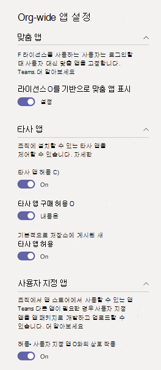
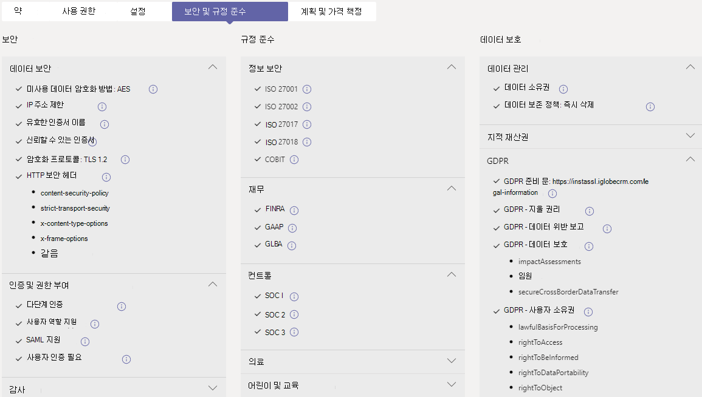

# 관리 센터에서 앱 Microsoft Teams 관리

관리자의 경우 관리 센터의 앱 관리 Microsoft Teams 조직에 대한 모든 앱 Teams 관리합니다. 여기서는 앱의 조직 수준 상태 및 속성을 보고, 조직의 앱 스토어에 새 사용자 지정 앱을 승인 또는 업로드하고, 조직 수준에서 앱을 차단 또는 허용하고, 팀에 앱을 추가하고, 타사 앱에 대한 서비스를 구매하고, 앱에 대한 관리자 동의를 부여하고, 조직 전체 앱 설정을 관리할 수 있습니다.

앱 관리 페이지에서는 사용 가능한 모든 앱에 대한 보기를 제공하여 조직 전체에서 허용하거나 차단할 앱을 결정하는 데 필요한 정보를 제공합니다. 그런 다음 앱 권한 [정책,](teams-app-permission-policies.md)앱  설정 정책 [및](teams-app-setup-policies.md)사용자 지정 앱 정책 및 설정을 사용하여 조직의 특정 사용자에 대한 앱 환경을 구성할 수 있습니다.

Microsoft Teams 관리 센터의 왼쪽 탐색 창에서 **Teams 앱** > **앱 관리** 로 이동합니다. 페이지에 액세스하려면 전역 관리자 또는 Teams 관리자 되어야 합니다.

> [!NOTE]
> 앱 관리 페이지는 GCCH(High) Microsoft 365 정부 커뮤니티 클라우드 DoD(DoD) 배포에서 아직 사용할 수 Teams.

## 앱 보기

각 앱에 대한 다음 정보를 포함하여 모든 앱을 볼 수 있습니다.

- **이름**: 앱 이름입니다. 앱 세부 정보 페이지로 이동하려면 앱 이름을 선택하여 앱에 대한 자세한 정보를 볼 수 있습니다. 여기에는 앱에 대한 설명, 허용 여부, 버전, 개인 정보 취급 방침, 사용 약관, 앱에 적용되는 범주, 인증 상태, 지원되는 기능 및 앱 ID가 포함됩니다. 다음은 예제입니다.

  
  
- **인증**: 앱이 인증을 통과한 경우 인증  또는 인증 Microsoft 365 인증 Publisher **표시됩니다.** 링크를 선택하여 앱에 대한 인증 세부 정보를 볼 수 있습니다. "가 표시된 경우 앱에 대한 인증 **--** 정보가 없습니다. 인증된 앱에 대한 자세한 내용은 Teams 앱 인증 Microsoft 365 [를 읽어보아야 합니다.](/teams-app-certification/all-apps)  
- **Publisher**: 게시자의 이름입니다.
- **게시 상태**: 사용자 지정 앱의 게시 상태입니다.
- **상태**: 다음 중 하나일 수 있는 오그 수준에서 앱의 상태입니다.
- **허용된**: 이 앱은 조직의 모든 사용자가 사용할 수 있습니다.
- **차단된**: 앱이 차단된 후 조직의 모든 사용자가 사용할 수 없습니다.
- **차단된 org-wide**: 앱이 오그 전체 앱 설정에서 차단됩니다.
      이 열은 이전 **Org-wide** 설정 창에 있는 앱의 허용 및 차단 상태를 나타내는 것을 알아야 합니다. 이제 앱 관리 페이지에서 오그 전체에서 앱을 보고 차단하고 **허용합니다.**
- **라이선스**: 앱에서 구입을 위해 SaaS(Software as a Service) 구독을 제공하는지 여부를 나타냅니다. 이 열은 타사 앱에만 적용됩니다. 각 타사 앱은 다음 값 중 하나를 하게 됩니다.
- **지금 구입**: 앱은 SaaS 구독을 제공하며 구입할 수 있습니다.  
- **구입한**: 앱은 SaaS 구독을 제공하며 라이선스를 구입했습니다.
- **- -**: 앱이 SaaS 구독을 제공하지 않습니다.
- **사용자 지정 앱**: 앱이 사용자 지정 앱인지 여부입니다.
- **사용 권한**: Azure AD(Azure AD)에 등록된 타사 또는 사용자 지정 앱에 동의가 Azure Active Directory 권한이 있는지 여부를 나타냅니다. 다음 값 중 하나를 볼 수 있습니다.
- **세부 정보 보기**: 앱에서 데이터에 액세스할 수 있도록 하기 전에 동의가 필요한 권한이 있습니다.
- **- -**: 앱에 동의가 필요한 권한이 없습니다.
- **범주**: 앱에 적용되는 범주입니다.
- **버전**: 앱 버전입니다.
- **관리자는 모임에 설치할 수 있습니다.** 팀 모임에서 관리자가 앱을 설치할 수 있는지 여부를 나타냅니다. [자세한 정보](teams-app-setup-policies.md#install-apps)

표에서 원하는 정보를 표시하려면 오른쪽  위 모서리에 있는 열 편집을 선택하여 테이블에 열을 추가하거나 제거합니다.

## 조직의 앱 스토어에 사용자 지정 앱 게시

앱 관리 페이지를 사용하여 조직을 위해 특별히 구축된 앱을 게시합니다. 사용자 지정 앱을 게시한 후 조직의 앱 스토어의 사용자가 사용할 수 있습니다. 조직의 앱 스토어에 사용자 지정 앱을 게시하는 두 가지 방법이 있습니다. 사용하는 방법은 앱을 다운로드하는 방법에 따라 달라 습니다.

- [사용자 지정 앱 승인](#approve-a-custom-app): 개발자가 앱 제출 API를 사용하여 앱 관리 페이지에 직접 앱을 제출하는 Teams 사용합니다. 그런 다음 앱 세부 정보 페이지에서 직접 앱을 검토하고 게시(또는 거부)할 수 있습니다.
- [업로드](#upload-an-app-package)패키지: 개발자가 앱 패키지를 전송하는 경우 이 .zip 사용합니다. 앱 패키지를 업로드하여 앱을 게시합니다.

### 사용자 지정 앱 승인

앱  관리 페이지의 보류 중인 승인 위젯은 개발자가 앱 제출 API를 사용하여 앱을 제출하는 Teams 표시됩니다. 새로 제출된 앱은 제출된  게시 상태  및  차단 **상태와 함께 나열됩니다.** 앱 세부 정보 페이지로 이동하여 앱에 대한 자세한 정보를 확인한 다음 게시를 위해 게시 상태를 **게시로** **설정합니다.**

개발자가 사용자 지정 앱에 대한 업데이트를 제출할 때도 알림을 하게 됩니다. 그런 다음 앱 세부 정보 페이지에서 업데이트를 검토하고 게시(또는 거부)할 수 있습니다. 모든 앱 사용 권한 정책 및 앱 설정 정책은 업데이트된 앱에 대해 계속 적용됩니다.

자세한 내용은 앱 제출 API 를 통해 [제출된 사용자 Teams 게시를 참조하세요.](submit-approve-custom-apps.md)

### 업로드 패키지를 추가합니다.

개발자는 Teams [App Studio를](/microsoftteams/platform/get-started/get-started-app-studio)사용하여 Teams 앱 패키지를 만든 다음, .zip 형식으로 전송합니다. 앱 패키지가 있는 경우 조직의 앱 스토어에 업로드할 수 있습니다.

새 사용자 지정 앱을 업로드하려면 앱 **업로드** 업로드할 앱을 선택합니다. 앱이 업로드된 후에 강조 표시되지 않습니다. 앱 관리 페이지에서 앱 목록을 검색하여 찾아야 합니다.

업로드된 후 앱을 업데이트하려면 앱 관리 페이지의 앱 목록에서 앱 이름을 선택한 다음 업데이트를 **선택합니다.** 이렇게 하면 기존 앱을 대체하고 업데이트된 앱에 대한 모든 앱 사용 권한 정책 및 앱 설정 정책이 계속 적용됩니다.

자세한 내용은 앱 패키지를 업로드하여 사용자 지정 앱 [게시를 참조하세요.](upload-custom-apps.md)

## 앱 허용 및 차단

앱 관리 페이지는 구성 수준에서 개별 앱을 허용하거나 차단하는 위치입니다. 사용 가능한 모든 앱과 현재 org-level 앱 상태를 보여줍니다. (오그 수준에서 앱을 차단하고 허용하는 것이 **Org 전체** 앱 설정 창에서 여기로 이동했습니다.)

앱을 허용하거나 차단하려면 앱을 선택한 다음 허용 **또는** 차단을 **선택합니다.** 앱을 차단하면 해당 앱과의 모든 상호 작용이 비활성화되어 조직의 Teams 나타나지 않습니다.

앱 관리 페이지에서 앱을 차단하거나 허용하면 해당 앱이 차단되거나 조직의 모든 사용자에게 허용됩니다.  앱 권한 정책에서 앱을 차단하거나 허용하는 Teams 해당 정책이 할당된 사용자에게는 차단되거나 허용됩니다. 사용자가 모든 앱을 설치하고 상호 작용할 수 있도록 앱 관리 페이지에서 또는 사용자에게 할당된 앱 권한 정책에서 앱을 허용해야 합니다.

 > [!NOTE]
 > 앱을 제거하려면 앱을 마우스 오른쪽 단추로 클릭한  다음 제거를 클릭하거나  왼쪽에 있는 추가 앱 메뉴를 사용하세요.

## 팀에 앱 추가

팀에 **추가 단추를 사용하여** 팀에 앱을 설치합니다. 팀 범위에 설치할 수 있는 앱에만 해당됩니다. 개인 **범위에만** 설치할 수 있는 앱에는 팀에 추가 단추를 사용할 수 없습니다.

1. 원하는 앱을 검색한 다음 앱 이름의 왼쪽을 클릭하여 앱을 선택합니다.
2. 팀에 **추가를 선택합니다.**
3. 팀에  추가 창에서 앱을 추가할 팀을 검색하고 팀을 선택한 다음 적용을 **선택합니다.**

## 앱 사용자 지정

이제 조직의 요구에 따라 특정 모양과 느낌을 포함하도록 앱을 사용자 지정할 수 있습니다. 에서 [앱 사용자 지정을 Teams.](customize-apps.md)

## 타사 앱에 대한 서비스 구매

앱 관리 페이지에서 직접 조직의 사용자를 위해 타사 앱에서 제공하는 서비스에 대한 라이선스를 검색하고 구입할 수 있습니다. 표의 **라이선스** 열은 앱이 유료 SaaS 구독을 제공하는지 여부를 나타냅니다. 지금 **구매를** 선택하여 요금제 및 가격 책정 정보를 보고 사용자에 대한 라이선스를 구입합니다. 자세한 내용은 관리 센터의 Teams 타사 앱에 대한 서비스 [Microsoft Teams 참조하세요.](purchase-third-party-apps.md)

## 앱에 관리자 동의 부여

조직의 모든 사용자를 대신하여 권한을 요청하는 앱에 대한 동의를 검토하고 부여할 수 있습니다. 사용자가 앱을 시작할 때 앱에서 요청한 권한을 검토하고 수락할 필요는 없습니다. 사용 **권한 열은** 앱에 동의가 필요한 권한이 있는지 여부를 나타냅니다. 동의가 필요한  권한이 있는 Azure AD에 등록된 각 앱에 대한 보기 세부 정보 링크가 표시됩니다. 자세한 내용은 앱 사용 권한 보기 및 관리자 동의를 Microsoft Teams [참조하세요.](app-permissions-admin-center.md)

## 리소스별 동의 권한 보기

RSC(리소스별 동의) 권한을 통해 팀 소유자는 앱에 대한 동의를 부여하여 팀의 데이터에 액세스하고 수정할 수 있습니다. RSC 사용 권한은 특정 Teams 앱에서 할 수 있는 작업을 정의하는 세분화된 특정 권한입니다. 앱에 대한 앱 세부 정보  페이지의 사용 권한 탭에서 RSC 권한을 볼 수 있습니다. 자세한 내용은 앱 사용 권한 보기 및 관리자 동의를 Microsoft Teams [참조하세요.](app-permissions-admin-center.md)

## 전체 앱 설정 관리

조직 전체 앱 설정을 사용하여 사용자가 타사 앱을 설치할 수 있는지 여부와 사용자가 조직의 사용자 지정 앱을 업로드하거나 상호 작용할 수 있는지 여부를 제어합니다. 조직 전체 앱 설정은 모든 사용자의 동작을 관리하고 사용자에게 할당된 다른 모든 앱 사용 권한 정책을 재정의합니다. 악의적이거나 문제가 있는 앱을 제어하는 데 사용할 수 있습니다.

> [!NOTE]
> 정부의 Microsoft 365 전체 앱 설정을 사용하는 방법에 대해 알아보 정부 커뮤니티 클라우드 높은 GCCH 및 DoD(국방부) 배포에 대한 자세한 내용은 Teams 의 앱 권한 정책 [관리를 Teams.](teams-app-permission-policies.md)

1. 앱 관리 페이지에서 **Org-wide 앱** 설정을 선택합니다. 그런 다음 패널에서 원하는 설정을 구성할 수 있습니다.

    

2. **타사 앱** 에서 이 설정을 끄거나 켜면 타사 앱에 대한 액세스를 제어할 수 있습니다.

    - **타사 앱 허용**: 사용자가 타사 앱을 사용할 수 있는지 여부를 제어합니다. 이 설정을 해제하면 사용자가 타사 앱을 설치하거나 사용할 수 없습니다. 이러한 앱의 앱 상태가 표에 차단된 **오그** 전체로 표시됩니다.

        > [!NOTE]
        > 타사  앱 허용이 해제된  경우 모든 사용자에 대해 계속 아웃아웃 웹후크를 사용할 수 있지만 앱 사용 권한 정책을 통해 아웃가스 웹후크 앱을 허용하거나 차단하여 사용자 수준에서 해당 웹후크를 제어할 [수 있습니다.](teams-app-permission-policies.md)   특정 앱 허용을  사용하여 다른 모든 설정을  차단하는 **Microsoft** 앱에 대한 기존 앱 사용 권한 정책이 있으며, 사용자에 대한 외출 웹후크를 사용하도록 설정하려는 경우 목록에 아웃가스 웹후크 앱을 추가합니다.

        > [!NOTE]
        > Teams 사용자는 다른 조직의 사용자와 모임 또는 채팅을 호스트할 때 앱을 추가할 수 있습니다. 또한 해당 조직에서 호스트하는 모임 또는 채팅에 참가할 때 다른 조직의 사용자가 공유하는 앱을 사용할 수도 있습니다. 호스팅 사용자 조직의 데이터 정책과 해당 사용자 조직에서 공유하는 타사 앱의 데이터 공유 사례가 적용됩니다.

    - **기본적으로 스토어에 게시된 새 타사 앱 허용**: Teams 앱 스토어에 게시된 새 타사 앱이 Teams에서 자동으로 제공될지 여부를 제어합니다. 타사 앱을 허용하는 경우에만 이 옵션을 설정할 수 있습니다.

3. 사용자 **지정 앱에서** 사용자 지정 앱과의 상호 작용 허용을 끄거나 **끄기** 이 설정은 사용자가 사용자 지정 앱과 상호 작용할 수 있는지 여부를 제어합니다. 자세한 내용은 [Teams에서 사용자 지정 앱 정책 및 설정 관리](teams-custom-app-policies-and-settings.md)를 참조하세요.
4. 적용하려면 **오그** 전체 앱 설정에 대한 저장을 선택합니다.

## 인증된 앱에 대한 Microsoft 365 및 규정 준수 정보 보기

조직에 대한 앱을 평가할 때 관리자는 MCAS(Microsoft Cloud App Security)와 같은 독립적인 CASB(클라우드 액세스 보안 브로커)를 사용하여 앱의 보안 및 동작에 대한 정보를 찾을 수 있습니다. Teams 관리 센터에는 인증된 앱에 대한 MCAS의 보안 및 규정 Microsoft 365 정보가 포함되어 있으므로 앱이 요구 사항을 충족하는지 여부에 대한 자세한 정보를 제공합니다.

> [!NOTE]
> 이 기능은 조직에 MCAS를 지원하는 라이선스가 있는지 여부에 따라 모든 관리자가 사용할 수 있습니다.

MCAS 정보에 액세스하기 위해 다음 단계를 수행합니다.

1. Teams 관리 센터에서 **앱** 관리 Teams **선택합니다.**
1. **인증을** 선택하여 앱을 정렬하고 모든 Microsoft 365 인증된 앱을 테이블 맨 위에 푸시합니다.
1. 인증된 Microsoft 365 선택하세요.
1. 보안 및 **규정 준수 탭을** 선택합니다.

이 탭에서는 보안, 규정 준수 및 데이터 보호에 대한 정보를 찾을 수 있습니다. 또한 각 드롭다운 목록을 확장하여 선택한 애플리케이션에 대해 지원되는 기능에 대한 자세한 정보를 얻을 수 있습니다.

## 관련 항목

- [Teams의 앱에 대한 관리 설정](admin-settings.md)
