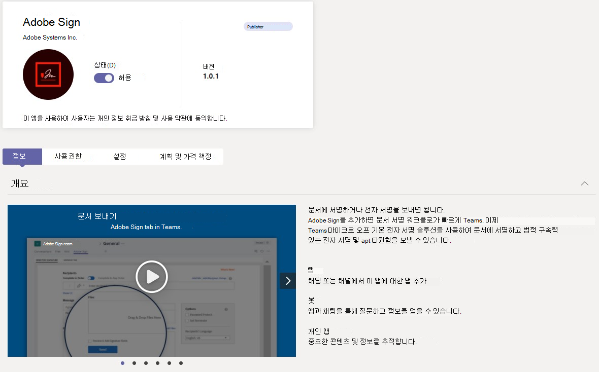

# Microsoft Teams 관리 센터에서 Teams 앱 관리

관리 센터의 **Teams 앱** 에서 조직의 앱을 관리합니다. [앱 관리](https://admin.teams.microsoft.com/policies/manage-apps) 페이지를 사용하여 조직의 앱 카탈로그에서 모든 Teams 앱을 보고 관리합니다. 앱 관리 페이지에서는 테넌트 카탈로그에서 사용 가능한 모든 앱에 대한 보기를 제공하여 조직 전체에서 허용하거나 차단할 앱을 결정하는 데 필요한 정보를 제공합니다. 앱의 조직 수준 상태 및 속성을 확인하고, 조직 수준에서 앱을 차단 또는 허용하고, 새 사용자 지정 앱을 테넌트 카탈로그에 업로드하고, 조직 전체 앱 설정을 관리할 수 있습니다.

앱을 관리하려면 다음 정책을 사용하여 사용자에 대한 권한, 앱 설치 및 조직 내에서 만든 사용자 지정 앱 업로드를 제어합니다. 정책을 이해하려면 [앱 정책 개요를](app-policies.md) 참조하세요.

관리자 역할 및 권한을 가져오는 방법에 대해 알아보려면 [Teams 관리자 역할을](./using-admin-roles.md) 참조하세요.

> [!NOTE]
> [!INCLUDE [new-teams-sfb-admin-center-notice](includes/new-teams-sfb-admin-center-notice.md)]

> [!NOTE]
> 앱 관리 페이지는 Teams Microsoft 365 정부 커뮤니티 클라우드 High(GCCH) 또는 국방부(DoD) 배포에서 사용할 수 없습니다.

<!--- TBD: This info belongs in the app policy overview article. Title it as mentioned in the spreadsheet.

* **App permission policy**: With it, you can control what apps are available to specific users in your organization. You can allow or block all apps or specific apps published by Microsoft, third-parties, and your organization. See [Manage app permission policies in Teams](teams-app-permission-policies.md).
* **App setup policies**: It lets you customize the app experience for your users. You choose the apps that you want to pin to the app bar in the Teams clients and the order in which they appear, on web, desktop, and mobile clients. See [Manage app setup policies in Teams](teams-app-setup-policies.md).
* **Custom app policies and settings**: Teams allows developers in your organization to build, test, and deploy custom apps to other users. Custom apps can be added to Teams by uploading an app package in a .zip file directly to a team or in the personal context. You can use app setup policies to control who in your organization can upload custom apps. You can also set org-wide settings to control whether users can interact with specific custom apps. See [Manage custom app policies and settings in Teams](teams-custom-app-policies-and-settings).

The following are the important use cases you can accomplish via the the Manage apps page:

* [Allow or block apps at the org level](#allow-and-block-apps)
* [Apps blocked by publishers](#apps-blocked-by-publishers)
* [Add apps to teams](#add-an-app-to-a-team)
* [Approve or upload new custom apps to your organization's app store](#publish-a-custom-app-to-your-organizations-app-store)
* [View permissions requested by apps](#view-resource-specific-consent-permissions)
* [Grant consent to apps](#grant-admin-consent-to-apps)
* [Purchase service for third-party apps](#purchase-services-for-third-party-apps)
* [See org-level status and properties of apps](#view-apps)
* [Manage org-wide app settings](#manage-org-wide-app-settings)
* [View security and compliance information for Microsoft 365 Certified apps](#view-security-and-compliance-information-for-microsoft-365-certified-apps)

<!--- TBD: Commenting for now in favor of the definition list above: 

The Manage apps page gives you a view into all available apps, providing you with the information you need to decide which apps to allow or block across your organization. You can then use [app permission policies](teams-app-permission-policies.md), [app setup policies](teams-app-setup-policies.md), and [custom app policies and settings](teams-custom-app-policies-and-settings.md) to configure the app experience for specific users in your organization.

In the left navigation of the Microsoft Teams admin center, go to **Teams apps** > **Manage apps**. You must be a global admin or Teams service admin to access the page.

--->

<!--- TBD: Move this view apps section to a new article about navigating and understanding TAC. It is yet to be created.

## View apps

You can view every app including the following information about each app.

- **Name**: The app name. Select the app name to go to the app details page to see more information about the app. This includes a description of the app, whether it's allowed or blocked, version, privacy policy, terms of use, categories that apply to the app, certification status, supported capabilities, and app ID.
- **Certification**: If the app has gone through certification, you'll see either **Microsoft 365 certified** or **Publisher attestation**. Select the link to view certification details for the app. If you see `--`, we don't have certification information for the app. To learn more about certified apps in Teams, read [Microsoft 365 App Certification program](/microsoft-365-app-certification/overview).
- **Publisher**: Name of the publisher.
- **Publishing status**: Publishing status of custom apps.
- **Status**: Status of the app at the org level, which can be one of the following:
  - **Allowed**: The app is available for all users in your organization.
  - **Blocked**: The app is blocked and not available for any users in your organization.
  - **Blocked by publisher**: The app is blocked by the publisher and is hidden from end-users by default. After you set up the app using the publisher's guidance, you can allow or block the app to make it available to end-users.
  - **Blocked org-wide**: The app is blocked in org-wide app settings.
      It's important to know that this column represents the allowed and blocked status of apps that were formerly on the **Org-wide settings** pane. You now view, block, and allow apps at the org-wide on the **Manage apps** page.
- **Licenses**: Indicates whether an app offers a Software as a Service (SaaS) subscription for purchase. This column applies only to third-party apps. Each third-party app will have one of the following values:
  - **Purchase**: The app offers a SaaS subscription and is available to purchase.  
  - **Purchased**: The app offers a SaaS subscription and you've purchased licenses for it.
  - **- -**: The app doesn't offer a SaaS subscription.
- **Custom app**: Whether the app is a custom app.
- **Permissions**: Indicates whether a third-party or custom app that's registered in Azure Active Directory (Azure AD) has permissions that need consent. You'll see one of the following values:
  - **View details**: The app has permissions that require consent before the app can access data.
  - **- -**: The app doesn't have permissions that need consent.
- **Categories**: Categories that apply to the app.
- **Version**: App version.
- **Admin can install in meetings**: Indicates whether an app can be installed by admins in Team meetings. [Learn more](teams-app-setup-policies.md#install-apps)

To see the information that you want in the table, select **Edit Column** in the upper-right corner to add or remove columns to the table.
--->

## 조직의 앱 스토어에 사용자 지정 앱 게시

앱 관리 페이지를 사용하여 조직을 위해 특별히 빌드된 앱을 게시합니다. 사용자 지정 앱을 게시한 후에는 조직의 앱 스토어에 있는 사용자가 사용할 수 있습니다. 조직의 앱 스토어에 사용자 지정 앱을 게시하는 방법에는 두 가지가 있습니다. 사용하는 방법은 앱을 가져오는 방법에 따라 달라집니다.

* [사용자 지정 앱 승인](#approve-a-custom-app): 개발자가 Teams 앱 제출 API를 사용하여 앱 관리 페이지에 직접 앱을 제출하는 경우 이 메서드를 사용합니다. 그런 다음 앱 세부 정보 페이지에서 직접 앱을 검토하고 게시하거나 거부할 수 있습니다.
* [앱 패키지 업로드](#upload-an-app-package): 개발자가 .zip 형식으로 앱 패키지를 보내는 경우 이 메서드를 사용합니다. 앱 패키지를 업로드하여 앱을 게시합니다.

### 사용자 지정 앱 승인

앱 관리 페이지의 **보류 중인 승인** 위젯은 개발자가 Teams 앱 제출 API를 사용하여 앱을 제출할 때 알 수 있습니다. 새로 제출된 앱은 **게시 상태가** **제출됨** 및 **차단됨** **상태** 와 함께 나열됩니다. 앱 세부 정보 페이지로 이동하여 앱에 대한 자세한 정보를 확인하고 게시하려면 **게시 상태를 게시로** 설정합니다.

개발자가 사용자 지정 앱에 업데이트를 제출할 때도 알림이 표시됩니다. 그런 다음 앱 세부 정보 페이지에서 업데이트를 검토하고 게시하거나 거부할 수 있습니다. 모든 앱 권한 정책 및 앱 설정 정책은 업데이트된 앱에 계속 적용됩니다.

자세한 내용은 [Teams 앱 제출 API를 통해 제출된 사용자 지정 앱 게시를](submit-approve-custom-apps.md) 참조하세요.

### 앱 패키지 업로드

개발자는 Teams [App Studio를 사용하여 Teams 앱](/microsoftteams/platform/get-started/get-started-app-studio) 패키지를 만든 다음 .zip 형식으로 사용자에게 보냅니다. 앱 패키지가 있는 경우 조직의 앱 스토어에 업로드할 수 있습니다.

새 사용자 지정 앱을 업로드하려면 **업로드** 선택하여 앱 패키지를 업로드합니다. 앱이 업로드된 후에는 강조 표시되지 않으므로 앱 관리 페이지에서 앱 목록을 검색하여 찾아야 합니다.

앱을 업로드한 후 업데이트하려면 앱 관리 페이지의 앱 목록에서 앱 이름을 선택한 다음 **업데이트를 선택합니다.** 이렇게 하면 기존 앱이 대체되고 모든 앱 권한 정책 및 앱 설정 정책이 업데이트된 앱에 계속 적용됩니다.

자세한 내용은 [앱 패키지를 업로드하여 사용자 지정 앱 게시를](upload-custom-apps.md) 참조하세요.

## 앱 허용 및 차단

앱 관리 페이지는 조직 수준에서 개별 앱을 허용하거나 차단하는 위치입니다. 사용 가능한 모든 앱과 현재 조직 수준 앱 상태를 표시합니다. (조직 수준에서 앱 차단 및 허용이 **조직 전체 앱 설정** 창에서 여기로 이동되었습니다.)

앱을 허용하거나 차단하려면 앱을 선택한 다음 **허용** 또는 **차단** 을 선택합니다. 앱을 차단하면 해당 앱과의 모든 상호 작용이 비활성화되고 조직의 모든 사용자에 대한 Teams 앱이 표시되지 않습니다.

앱 관리 페이지에서 앱을 차단하거나 허용하면 해당 앱이 차단되거나 조직의 모든 사용자에 대해 허용됩니다.  Teams 앱 권한 정책에서 앱을 차단하거나 허용하면 해당 정책이 할당된 사용자에게 차단되거나 허용됩니다. 사용자가 모든 앱을 설치하고 상호 작용할 수 있도록 하려면 앱 관리 페이지의 조직 수준 및 사용자에게 할당된 앱 권한 정책에서 앱을 허용해야 합니다.

 > [!NOTE]
 > 앱을 제거하려면 앱을 마우스 오른쪽 단추로 클릭한 다음 **제거** 를 클릭하거나 왼쪽의 **추가 앱** 메뉴를 사용합니다.

## 게시자에 의해 차단된 앱

ISV가 앱을 글로벌 앱 스토어에 게시하는 경우 관리자가 앱 환경을 구성하거나 사용자 지정해야 할 수 있습니다. 관리자는 앱이 완전히 설정되면 최종 사용자가 사용할 수 있도록 할 수 있습니다.

예를 들어 Contoso Electronics는 Microsoft Teams 지원 센터 앱을 빌드한 ISV입니다. Contoso Electronics는 사용자가 앱과 상호 작용할 때 예상대로 작동하도록 고객이 앱의 특정 속성을 설정하기를 원합니다. 관리자가 애플리케이션을 허용하거나 차단하기 전에 Teams 관리 센터에서 **차단된 게시자로** 표시되고 기본적으로 최종 사용자에게 숨겨집니다. 게시자의 지침에 따라 앱을 설정한 후에는 상태를 **허용** 됨으로 변경하여 사용자가 사용할 수 있도록 설정하거나 상태를 **차단** 됨으로 변경하여 사용자가 앱을 사용하지 못하도록 차단할 수 있습니다.

## 팀에 앱 추가

**팀에 추가** 단추를 사용하여 팀에 앱을 설치합니다. 이는 팀 범위에 설치할 수 있는 앱에만 해당됩니다. **팀에 추가** 단추는 개인 범위에만 설치할 수 있는 앱에서 사용할 수 없습니다.

1. 원하는 앱을 검색한 다음 앱 이름 왼쪽을 클릭하여 앱을 선택합니다.
1. **팀에 추가를** 선택합니다.
1. **팀에 추가** 창에서 앱을 추가할 팀을 검색하고 팀을 선택한 다음 **적용** 을 선택합니다.

## 앱 사용자 지정

이제 조직의 요구에 따라 특정 모양과 느낌을 포함하도록 앱을 사용자 지정할 수 있습니다. [Teams 앱 사용자 지정을](customize-apps.md) 참조하세요.

## 타사 앱용 서비스 구매

앱 관리 페이지에서 조직의 사용자를 위해 타사 앱에서 제공하는 서비스에 대한 라이선스를 검색하고 구매할 수 있습니다. 테이블의 **라이선스** 열은 앱이 유료 SaaS 구독을 제공하는지 여부를 나타냅니다. **지금 구매** 를 선택하여 플랜 및 가격 정보를 보고 사용자에 대한 라이선스를 구입합니다. 자세한 내용은 [Microsoft Teams 관리 센터에서 Teams 타사 앱에 대한 서비스 구매를 참조하세요](purchase-third-party-apps.md).

## 앱에 관리자 동의 부여

조직의 모든 사용자를 대신하여 권한을 요청하는 앱에 대한 동의를 검토하고 부여할 수 있습니다. 이렇게 하면 사용자가 앱을 시작할 때 앱에서 요청한 권한을 검토하고 수락할 필요가 없습니다. **권한** 열은 앱에 동의가 필요한 권한이 있는지 여부를 나타냅니다. 동의가 필요한 권한이 있는 Azure AD에 등록된 각 앱에 대한 **세부 정보 보기** 링크가 표시됩니다. 자세한 내용은 [Microsoft Teams 관리 센터에서 앱 권한 보기 및 관리자 동의 부여를](app-permissions-admin-center.md) 참조하세요.

## 리소스별 동의 권한 보기

RSC(리소스별 동의) 권한을 통해 팀 소유자는 앱에 대한 동의를 부여하여 팀의 데이터에 액세스하고 수정할 수 있습니다. RSC 권한은 앱이 특정 팀에서 수행할 수 있는 작업을 정의하는 세분화된 Teams 특정 권한입니다. 앱에 대한 앱 세부 정보 페이지의 **사용 권한** 탭에서 RSC 권한을 볼 수 있습니다. 자세한 내용은 [Microsoft Teams 관리 센터에서 앱 권한 보기 및 관리자 동의 부여를](app-permissions-admin-center.md) 참조하세요.

## 조직 전체 앱 설정 관리

조직 전체 앱 설정을 사용하여 [F 라이선스](https://www.microsoft.com/microsoft-365/enterprise/frontline#office-SKUChooser-0dbn8nt) 를 가진 사용자가 맞춤형 최전방 앱 환경을 얻을 수 있는지 여부, 사용자가 타사 앱을 설치할 수 있는지 여부 및 사용자가 조직에서 사용자 지정 앱을 업로드하거나 조작할 수 있는지 여부를 제어합니다. 조직 전체 앱 설정은 모든 사용자의 동작을 관리하고 사용자에게 할당된 다른 모든 앱 사용 권한 정책을 재정의합니다. 악의적이거나 문제가 있는 앱을 제어하는 데 사용할 수 있습니다.

> [!NOTE]
> Microsoft 365 Government - 정부 커뮤니티 클라우드 High GCCH 및 DoD(국방부) Teams 배포에서 조직 전체 앱 설정을 사용하는 방법을 알아보려면 [Teams 앱 권한 정책 관리를](teams-app-permission-policies.md) 참조하세요.

1. 앱 관리 페이지에서 **조직 전체 앱 설정을** 선택합니다. 그런 다음 창에서 원하는 설정을 구성할 수 있습니다.

    :::image type="content" source="media/manage-apps-org-wide-app-settings.png" alt-text="앱 관리 페이지의 조직 전체 앱 설정 창 스크린샷":::

1. **맞춤형 앱** 에서 **맞춤형 앱 표시** 를 끄거나 켭니다. 이 설정이 켜지면 [F 라이선스](https://www.microsoft.com/microsoft-365/enterprise/frontline#office-SKUChooser-0dbn8nt) 가 있는 사용자는 맞춤형 최전방 앱 환경을 얻을 수 있습니다. 이 환경은 최전방 작업자를 위해 Teams 가장 관련성이 큰 앱을 고정합니다. 자세한 내용은 [일선 작업자를 위한 Teams 앱 맞춤](pin-teams-apps-based-on-license.md)을 참조하세요.

    이 기능은 F 라이선스에 사용할 수 있습니다. 다른 라이선스 유형은 나중에 지원될 예정입니다.
1. **타사 앱** 에서 이 설정을 끄거나 켜면 타사 앱에 대한 액세스를 제어할 수 있습니다.

    - **타사 앱 허용**: 사용자가 타사 앱을 사용할 수 있는지 여부를 제어합니다. 이 설정을 해제하면 사용자가 타사 앱을 설치하거나 사용할 수 없으며 이러한 앱의 앱 상태가 표에 **차단된 조직 전체** 로 표시됩니다.

        > [!NOTE]
        > **타사 앱 허용** 이 해제된 경우 모든 사용자에 대해 [나가는 웹후크가](/microsoftteams/platform/webhooks-and-connectors/what-are-webhooks-and-connectors) 계속 활성화되지만 앱 [권한 정책을](teams-app-permission-policies.md) 통해 나가는 웹후크 앱을 허용하거나 차단하여 사용자 수준에서 제어할 수 있습니다. **특정 앱 허용을 사용하고 다른 모든 설정을 차단하는** **Microsoft 앱** 에 대한 기존 [앱 사용 권한 정책이](teams-app-permission-policies.md) 있고 사용자에 대해 나가는 웹후크를 사용하도록 설정하려는 경우 목록에 나가는 웹후크 앱을 추가합니다.

        > [!NOTE]
        > Teams 사용자는 다른 조직의 사용자와 모임 또는 채팅을 호스트할 때 앱을 추가할 수 있습니다. 또한 해당 조직에서 호스트하는 모임 또는 채팅에 참가할 때 다른 조직의 사용자가 공유하는 앱을 사용할 수도 있습니다. 호스팅 사용자 조직의 데이터 정책과 해당 사용자 조직에서 공유하는 타사 앱의 데이터 공유 사례가 적용됩니다.

    - **기본적으로 스토어에 게시된 새 타사 앱 허용**: Teams 앱 스토어에 게시된 새 타사 앱이 Teams에서 자동으로 제공될지 여부를 제어합니다. 타사 앱을 허용하는 경우에만 이 옵션을 설정할 수 있습니다.

1. **사용자 지정 앱에서 사용자 지정 앱****과의 상호 작용 허용** 을 끄거나 켭니다. 이 설정은 사용자가 사용자 지정 앱과 상호 작용할 수 있는지 여부를 제어합니다. 자세한 내용은 [Teams에서 사용자 지정 앱 정책 및 설정 관리](teams-custom-app-policies-and-settings.md)를 참조하세요.
1. 조직 전체 앱 설정에 대해 **저장** 을 선택하여 적용합니다.

<!--- TBD: Commenting this info for now. Move it later to the new article about compliance program and how/where admins can find info about compliant apps.

## View security and compliance information for Microsoft 365 Certified apps

When evaluating an app for their organization, admins can use independent Cloud Access Security Brokers (CASB), such as Microsoft Cloud App Security (MCAS), to find information about security and behaviors of an app. The Teams admin center includes security and compliance information from MCAS for Microsoft 365 Certified apps so you'll have more information on whether or not the app meets your needs.

> [!NOTE]
> This feature is available to all admins, whether or not your organization has a license that supports MCAS.

To access MCAS information, follow these steps:

1. In the Teams admin center, select **Manage apps** under **Teams apps**.
1. Select **Certification** to sort apps and push all Microsoft 365 Certified apps to the top of the table.
1. Choose a Microsoft 365 Certified app.
1. Select the **Security and compliance** tab.

On this tab, you'll find information on security, compliance, and data protection. You can also expand each dropdown list to get more details about which capabilities are supported for the selected application.
--->
