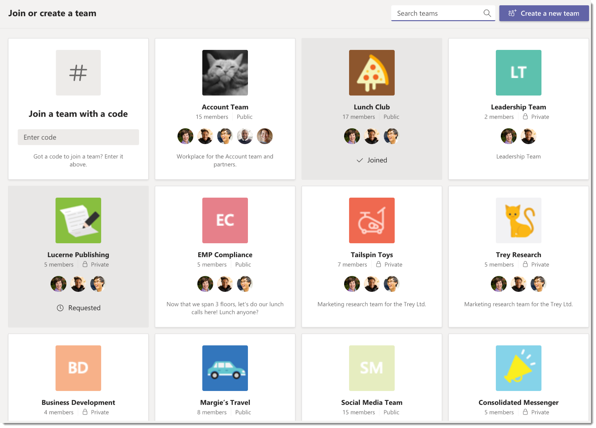

# <a name="manage-discovery-of-private-teams-in-microsoft-teams"></a><span data-ttu-id="a7e46-103">Microsoft 팀에서 비공개 팀의 검색 관리</span><span class="sxs-lookup"><span data-stu-id="a7e46-103">Manage discovery of private teams in Microsoft Teams</span></span>

[!INCLUDE [preview-feature](includes/preview-feature.md)]

<span data-ttu-id="a7e46-104">관리자와 팀 소유자는 조직의 Microsoft 팀 사용자가 비공개 팀을 검색할 수 있는지 여부를 제어할 수 있습니다.</span><span class="sxs-lookup"><span data-stu-id="a7e46-104">Admins and team owners can control whether private teams can be discovered by Microsoft Teams users in your organization.</span></span> <span data-ttu-id="a7e46-105">개인 팀을 검색할 수 있는 경우에는 검색 결과에 표시 되며 팀의 공용 팀과 함께 팀 갤러리의 제안 사항에 포함 됩니다.</span><span class="sxs-lookup"><span data-stu-id="a7e46-105">When a private team is discoverable, it shows up in search results and is included in suggestions in the team gallery alongside public teams in Teams.</span></span> <span data-ttu-id="a7e46-106">이렇게 하면 사용자가 참여 하려는 비공개 팀을 쉽게 검색 하 고 찾을 수 있습니다.</span><span class="sxs-lookup"><span data-stu-id="a7e46-106">This makes it easy for users to search for and find the private teams that they want to join.</span></span> <span data-ttu-id="a7e46-107">사용자는 비공개 팀에 참가 하도록 요청할 수 있으며, 팀 소유자는 요청을 승인 하거나 거부할 수 있습니다.</span><span class="sxs-lookup"><span data-stu-id="a7e46-107">Users can request to join a private team, and a team owner can then approve or deny the request.</span></span>

## <a name="overview-of-public-teams-private-teams-and-discovery-in-teams"></a><span data-ttu-id="a7e46-108">팀의 공개 팀, 비공개 팀 및 검색 개요</span><span class="sxs-lookup"><span data-stu-id="a7e46-108">Overview of public teams, private teams, and discovery in Teams</span></span>

<span data-ttu-id="a7e46-109">대부분의 조직에는 다음과 같은 종류의 팀 (공개 팀, 검색 가능한 개인 팀, 검색 불가능 한 비공개 팀)이 있습니다.</span><span class="sxs-lookup"><span data-stu-id="a7e46-109">Most organizations have the following kinds of teams: public teams, discoverable private teams, and non-discoverable private teams.</span></span>



### <a name="public-teams"></a><span data-ttu-id="a7e46-111">공용 팀</span><span class="sxs-lookup"><span data-stu-id="a7e46-111">Public teams</span></span>

<span data-ttu-id="a7e46-112">공용 팀은 조직의 모든 사용자가 참가할 수 있습니다.</span><span class="sxs-lookup"><span data-stu-id="a7e46-112">Public teams are available for all users in your organization to join.</span></span> <span data-ttu-id="a7e46-113">공용 팀은 팀 갤러리의 모든 사용자가 볼 수 있으며, 사용자는 팀 소유자의 승인을 받을 필요 없이 공용 팀에 참가할 수 있습니다.</span><span class="sxs-lookup"><span data-stu-id="a7e46-113">Public teams are visible to everyone in the teams gallery, and users can join a public team without having to get approval from the team owner.</span></span> <span data-ttu-id="a7e46-114">공개 팀의 예로는 기술 뉴스, 제품에 대 한 피드백을 얻을 수 있는 팀, 사용자 carpooling 사용할 팀을 토론할 수 있는 팀이 있습니다.</span><span class="sxs-lookup"><span data-stu-id="a7e46-114">Examples of public teams include a team to discuss technology news, a team to get feedback for your products, and a team for people carpooling to work.</span></span>

### <a name="discoverable-private-teams"></a><span data-ttu-id="a7e46-115">검색 가능한 개인 팀</span><span class="sxs-lookup"><span data-stu-id="a7e46-115">Discoverable private teams</span></span>

<span data-ttu-id="a7e46-116">검색 가능한 비공개 팀은 팀 소유자가 사용자를 추가 하는 경우에만 참가할 수 있습니다.</span><span class="sxs-lookup"><span data-stu-id="a7e46-116">Discoverable private teams can only be joined when the team owner adds users to them.</span></span> <span data-ttu-id="a7e46-117">비공개 팀을 검색할 수 있게 만들면 팀은 팀 갤러리의 추천 팀 및 검색 결과 목록에 포함 됩니다.</span><span class="sxs-lookup"><span data-stu-id="a7e46-117">When you make a private team discoverable, the team is included in the list of suggested teams and search results in the teams gallery.</span></span> <span data-ttu-id="a7e46-118">모든 사람이 인식 하 고 팀의 대화 및 파일에 대 한 액세스를 제어 해야 하는 조직의 프로젝트 및 그룹에 대해 검색 가능한 개인 팀을 사용 합니다.</span><span class="sxs-lookup"><span data-stu-id="a7e46-118">Use discoverable private teams for projects and groups in your organization that everyone is aware of and where access to conversations and files in the team need to be controlled.</span></span> <span data-ttu-id="a7e46-119">예를 들면 HR 부서별로 팀, 조직의 모든 관리자를 위한 팀, 관리자와 팀의 직속 부하 직원 등이 포함 됩니다.</span><span class="sxs-lookup"><span data-stu-id="a7e46-119">Examples include a team for your HR department, a team for all managers in your organization, and a team for a manager and their direct reports.</span></span>

### <a name="non-discoverable-private-teams"></a><span data-ttu-id="a7e46-120">검색할 수 없는 비공개 팀</span><span class="sxs-lookup"><span data-stu-id="a7e46-120">Non-discoverable private teams</span></span>

<span data-ttu-id="a7e46-121">검색할 수 없는 비공개 팀은 팀 소유자가 해당 사용자를 추가 하는 경우에만 참가할 수 있습니다.</span><span class="sxs-lookup"><span data-stu-id="a7e46-121">Non-discoverable private teams can only be joined when the team owner adds users to them.</span></span> <span data-ttu-id="a7e46-122">개인 팀을 검색할 수 없는 경우 팀 갤러리에서 추천 팀 목록에 표시 되지 않은 상태로 검색 결과에서 제거 됩니다.</span><span class="sxs-lookup"><span data-stu-id="a7e46-122">When you make a private team not discoverable, it's hidden from the list of suggested teams and removed from search results in the teams gallery.</span></span> <span data-ttu-id="a7e46-123">검색할 수 없는 팀을 사용 하 여 중요 하 고 기밀 항목을 공동으로 작업 합니다.</span><span class="sxs-lookup"><span data-stu-id="a7e46-123">Use non-discoverable teams to collaborate on sensitive and highly confidential topics.</span></span> <span data-ttu-id="a7e46-124">예제에는 예정 된 취득 및 팀을 논의 하 여 조직의 전략적 방향에 대 한 변경 내용을 설명 하는 팀이 포함 됩니다.</span><span class="sxs-lookup"><span data-stu-id="a7e46-124">Examples include a team to discuss an upcoming acquisition and a team to discuss a change in your organization's strategic direction.</span></span>

## <a name="set-whether-new-private-teams-are-discoverable"></a><span data-ttu-id="a7e46-125">새 비공개 팀 검색 가능 여부 설정</span><span class="sxs-lookup"><span data-stu-id="a7e46-125">Set whether new private teams are discoverable</span></span>

<span data-ttu-id="a7e46-126">팀 소유자가 비공개 팀을 만들면 팀의 검색 설정을 구성 하 여 검색 가능 하도록 선택할 수 있습니다.</span><span class="sxs-lookup"><span data-stu-id="a7e46-126">When a team owner creates a private team, they can choose to make it discoverable by configuring the team's discovery setting.</span></span> <span data-ttu-id="a7e46-127">기본적으로 새 비공개 팀을 검색 하 고 검색할 수 있습니다.</span><span class="sxs-lookup"><span data-stu-id="a7e46-127">By default, new private teams are searchable and discoverable.</span></span> <span data-ttu-id="a7e46-128">팀 소유자가 개인 팀이 검색 결과 및 제안에 표시 되지 않게 하려는 경우 소유자는이 팀 옆에 있는 **변경 설정을** 선택 하 여 설정을 해제할 수 있으며이는 검색 **및 검색 가능**합니다.</span><span class="sxs-lookup"><span data-stu-id="a7e46-128">If the team owner doesn't want the private team to show up in search results and suggestions, the owner can turn off the setting by selecting **Change setting** next to **This team is searchable and discoverable**.</span></span>


## <a name="set-whether-existing-private-teams-are-discoverable"></a><span data-ttu-id="a7e46-130">기존 비공개 팀을 검색할 수 있는지 여부 설정</span><span class="sxs-lookup"><span data-stu-id="a7e46-130">Set whether existing private teams are discoverable</span></span>

<span data-ttu-id="a7e46-131">팀 소유자는 팀 설정에서 직접 기존 개인 팀의 검색 설정을 지정할 수 있으며, 관리자는 PowerShell을 사용 하 여이 작업을 수행할 수 있습니다.</span><span class="sxs-lookup"><span data-stu-id="a7e46-131">Team owners can set the discovery setting for an existing private team directly in the team settings and admins can do so by using PowerShell.</span></span>

### <a name="in-team-settings"></a><span data-ttu-id="a7e46-132">팀 설정</span><span class="sxs-lookup"><span data-stu-id="a7e46-132">In team settings</span></span>

<span data-ttu-id="a7e46-133">팀에서 비공개 팀으로 이동 하 고 **추가 옵션** > 을 클릭 하 여**팀 관리**를 선택 합니다.</span><span class="sxs-lookup"><span data-stu-id="a7e46-133">In Teams, go to the private team, click **More options** > **Manage team**.</span></span> <span data-ttu-id="a7e46-134">**설정** 탭에서 **팀 검색**을 확장 한 다음 검색 **기능 설정** 확인란을 선택 하거나 선택을 취소 합니다.</span><span class="sxs-lookup"><span data-stu-id="a7e46-134">On the **Settings** tab, expand **Team discovery**, and then clear or select the **Turn on discoverability** check box.</span></span>


### <a name="using-powershell"></a><span data-ttu-id="a7e46-136">PowerShell 사용</span><span class="sxs-lookup"><span data-stu-id="a7e46-136">Using PowerShell</span></span>

<span data-ttu-id="a7e46-137">**[팀](https://docs.microsoft.com/powershell/module/teams/set-team?view=teams-ps)** cmdlet을 사용 하 여 기존 개인 팀에 대 한 검색 설정을 끄거나 설정 합니다.</span><span class="sxs-lookup"><span data-stu-id="a7e46-137">Use the **[Set-Team](https://docs.microsoft.com/powershell/module/teams/set-team?view=teams-ps)** cmdlet to turn off or turn on the discovery setting for an existing private team.</span></span> <span data-ttu-id="a7e46-138">팀을 검색 가능 하 게 만드는 방법의 예는 다음과 같습니다.</span><span class="sxs-lookup"><span data-stu-id="a7e46-138">Here's an example of how to make a team discoverable:</span></span>
```PowerShell
    Set-Team -GroupId 0abc123d-e4f5-67gh-i890-jk1m2n345o6p -ShowInTeamsSearchAndSuggestions $true
```
<span data-ttu-id="a7e46-139">스크립트에서이 cmdlet을 사용 하 여 기존 비공개 팀의 검색 설정을 대량으로 설정할 수 있습니다.</span><span class="sxs-lookup"><span data-stu-id="a7e46-139">You can use this cmdlet in a script to set the discovery setting of existing private teams in bulk.</span></span>

## <a name="set-whether-users-can-discover-private-teams"></a><span data-ttu-id="a7e46-140">사용자가 비공개 팀을 검색할 수 있는지 여부 설정</span><span class="sxs-lookup"><span data-stu-id="a7e46-140">Set whether users can discover private teams</span></span>

<span data-ttu-id="a7e46-141">관리자는 조직에서 검색 결과 및 팀의 제안에 따라 비공개 팀을 검색할 수 있는 사용자를 제어할 수도 있습니다.</span><span class="sxs-lookup"><span data-stu-id="a7e46-141">As an admin, you can also control which users in your organization are allowed to discover private teams in search results and suggestions in Teams.</span></span> <span data-ttu-id="a7e46-142">**[CsTeamsChannelsPolicy](https://docs.microsoft.com/powershell/module/skype/new-csteamschannelspolicy?view=skype-ps)** cmdlet을 사용 하 여 정책을 만든 다음 해당 정책을 사용자에 게 할당 합니다.</span><span class="sxs-lookup"><span data-stu-id="a7e46-142">Create a policy by using the **[New-CsTeamsChannelsPolicy](https://docs.microsoft.com/powershell/module/skype/new-csteamschannelspolicy?view=skype-ps)** cmdlet, and then assign the policy to users.</span></span>
 
<span data-ttu-id="a7e46-143">**AllowPrivateTeamDiscovery** 매개 변수를 **true** 로 설정 하 여 정책을 할당 받은 사용자가 검색 결과 및 제안에서 검색 가능한 개인 팀을 볼 수 있도록 합니다.</span><span class="sxs-lookup"><span data-stu-id="a7e46-143">Set the **AllowPrivateTeamDiscovery** parameter to **true** to allow users who are assigned the policy to see discoverable private teams in search results and suggestions.</span></span> <span data-ttu-id="a7e46-144">**AllowPrivateTeamDiscovery** 매개 변수를 **false** 로 설정 하면 검색 결과 및 정책에 할당 된 사용자에 대 한 제안에서 모든 검색 가능한 개인 팀이 제거 됩니다.</span><span class="sxs-lookup"><span data-stu-id="a7e46-144">Setting the **AllowPrivateTeamDiscovery** parameter to **false** removes all discoverable private teams from search results and suggestions for users who are assigned the policy.</span></span>

<span data-ttu-id="a7e46-145">기본적으로 조직의 모든 사용자에 대해 **AllowPrivateTeamDiscovery** 가 **true** 로 설정 됩니다.</span><span class="sxs-lookup"><span data-stu-id="a7e46-145">By default, **AllowPrivateTeamDiscovery** is set to **true** for all users in an organization.</span></span>

<span data-ttu-id="a7e46-146">이 예제에서는 사용자가 검색 가능 하도록 설정 된 비공개 팀을 검색 하는 것을 막는 VendorPolicy 라는 정책을 만들고, 정책을 vendoruser1 라는 사용자에 게 할당 합니다.</span><span class="sxs-lookup"><span data-stu-id="a7e46-146">In this example, we create a policy named VendorPolicy that prevents users from discovering any private teams that are made discoverable, and then we assign the policy to a user named vendoruser1.</span></span>
```PowerShell
     New-CsTeamsChannelsPolicy -Identity VendorPolicy -AllowPrivateTeamDiscovery $false
     Grant-CsTeamsChannelsPolicy -Identity vendoruser1@company.com -PolicyName VendorPolicy
```

> [!NOTE]
> <span data-ttu-id="a7e46-147">검색할 수 없는 비공개 팀은 정책 설정에 관계 없이 검색 결과 및 제안에 표시 되지 않습니다.</span><span class="sxs-lookup"><span data-stu-id="a7e46-147">Private teams that are not discoverable are never shown in search results and suggestions, regardless of the policy setting.</span></span> <span data-ttu-id="a7e46-148">예를 들어 개인 팀에 대 한 검색 설정을 해제 하면 사용자는 해당 사용자에 대 한 정책 설정에서 **AllowPrivateTeamDiscovery** 매개 변수가 **true** 로 설정 된 경우에도 팀을 검색할 수 없습니다.</span><span class="sxs-lookup"><span data-stu-id="a7e46-148">For example, if you turn off the discovery setting for a private team, users are unable to discover the team, even though  the **AllowPrivateTeamDiscovery** parameter is set to **true** in the policy setting for those users.</span></span>

## <a name="related-topics"></a><span data-ttu-id="a7e46-149">관련 항목</span><span class="sxs-lookup"><span data-stu-id="a7e46-149">Related topics</span></span>
- [<span data-ttu-id="a7e46-150">팀 PowerShell 개요</span><span class="sxs-lookup"><span data-stu-id="a7e46-150">Teams PowerShell Overview</span></span>](teams-powershell-overview.md)
